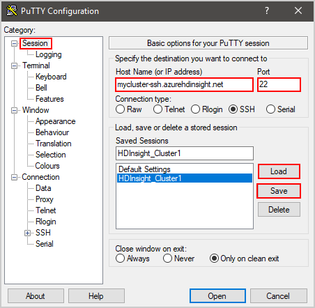
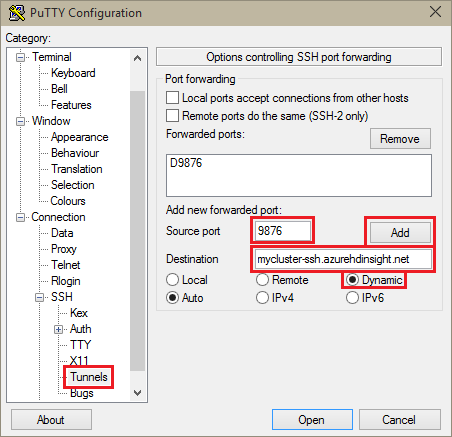
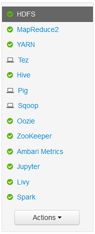
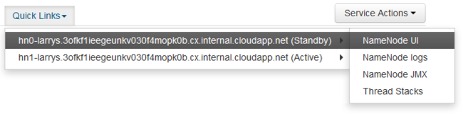
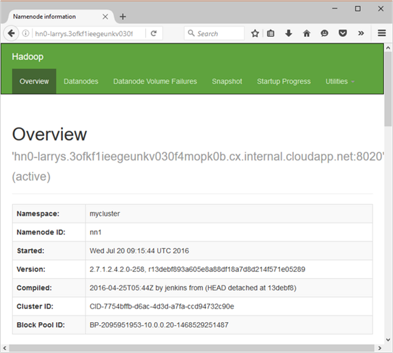

# Use SSH tunneling to access Apache Ambari web UI, JobHistory, NameNode, Apache Oozie, and other UIs

HDInsight clusters provide access to the Apache Ambari web UI over the Internet. Some features require an SSH tunnel. For example, the Apache Oozie web UI can't be accessed over the internet without an SSH tunnel.

## Why use an SSH tunnel

Several of the menus in Ambari only work through an SSH tunnel. These menus rely on web sites and services running on other node types, such as worker nodes.

The following Web UIs require an SSH tunnel:

* JobHistory
* NameNode
* Thread Stacks
* Oozie web UI
* HBase Master and Logs UI

Services installed with Script Actions that expose a web service will require an SSH tunnel. Hue installed with Script Action requires an SSH tunnel to access the web UI.

> [!IMPORTANT]  
> If you have direct access to HDInsight through a virtual network, you do not need to use SSH tunnels. For an example of directly accessing HDInsight through a virtual network, see the [Connect HDInsight to your on-premises network](connect-on-premises-network.md) document.

## What is an SSH tunnel

[Secure Shell (SSH) tunneling](https://en.wikipedia.org/wiki/Tunneling_protocol#Secure_Shell_tunneling) connects a port on your local machine to a head node on HDInsight. Traffic sent to the local port is routed through an SSH connection to the head node. The request is resolved as if it originated on the head node. The response is then routed back through the tunnel to your workstation.

## Prerequisites

* An SSH client. For more information, see [Connect to HDInsight (Apache Hadoop) using SSH](hdinsight-hadoop-linux-use-ssh-unix.md).

* A web browser that can be configured to use a SOCKS5 proxy.

    > [!WARNING]  
    > The SOCKS proxy support built into Windows Internet settings does not support SOCKS5, and does not work with the steps in this document. The following browsers rely on Windows proxy settings, and do not currently work with the steps in this document:
    >
    > * Microsoft Edge
    > * Microsoft Internet Explorer
    >
    > Google Chrome also relies on the Windows proxy settings. However, you can install extensions that support SOCKS5. We recommend [FoxyProxy Standard](https://chrome.google.com/webstore/detail/foxyproxy-standard/gcknhkkoolaabfmlnjonogaaifnjlfnp).

## <a name="usessh"></a>Create a tunnel using the SSH command

Use the following command to create an SSH tunnel using the `ssh` command. Replace `sshuser` with an SSH user for your HDInsight cluster, and replace `CLUSTERNAME` with the name of your HDInsight cluster:

```cmd
ssh -C2qTnNf -D 9876 sshuser@CLUSTERNAME-ssh.azurehdinsight.net
```

This command creates a connection that routes traffic to local port 9876 to the cluster over SSH. The options are:

    |Option |Description |
    |---|---|
    |D 9876|The local port that routes traffic through the tunnel.|
    |C|Compress all data, because web traffic is mostly text.|
    |2|Force SSH to try protocol version 2 only.|
    |q|Quiet mode.|
    |T|Disable pseudo-tty allocation, since you're just forwarding a port.|
    |n|Prevent reading of STDIN, since you're just forwarding a port.|
    |N|Do not execute a remote command, since you're just forwarding a port.|
    |f|Run in the background.|

Once the command finishes, traffic sent to port 9876 on the local computer is routed to the cluster head node.

## <a name="useputty"></a>Create a tunnel using PuTTY

[PuTTY](https://www.chiark.greenend.org.uk/~sgtatham/putty) is a graphical SSH client for Windows. If you aren't familiar with PuTTY, see the [PuTTY documentation](https://www.chiark.greenend.org.uk/~sgtatham/putty/docs.html). Use the following steps to create an SSH tunnel using PuTTY:

### Create or load a session

1. Open PuTTY and ensure **Session** is selected on the left menu. If you've already saved a session, select the session name from the **Saved Sessions** list and select **Load**.

1. If you don't already have a saved session, enter your connection information:

    |Property |Value |
    |---|---|
    |Host Name (or IP address)|The SSH address for the HDInsight cluster. For example, **mycluster-ssh.azurehdinsight.net**.|
    |Port|22|
    |Connection Type|SSH|

1. Select **Save**

    

1. In the **Category** section to the left of the dialog, expand **Connection**, expand **SSH**, and then select **Tunnels**.

1. Provide the following information on the **Options controlling SSH port forwarding** form:

    |Property |Value |
    |---|---|
    |Source port|The port on the client that you wish to forward. For example, **9876**.|
    |Destination|The SSH address for the HDInsight cluster. For example, **mycluster-ssh.azurehdinsight.net**.|
    |Dynamic|Enables dynamic SOCKS proxy routing.|

    

1. Select **Add** to add the settings, and then select **Open** to open an SSH connection.

1. When prompted, sign in to the server.

## Use the tunnel from your browser

> [!IMPORTANT]  
> The steps in this section use the Mozilla FireFox browser, as it provides the same proxy settings across all platforms. Other modern browsers, such as Google Chrome, may require an extension such as FoxyProxy to work with the tunnel.

1. Configure the browser to use **localhost** and the port you used when creating the tunnel as a **SOCKS v5** proxy. Here's what the Firefox settings look like. If you used a different port than 9876, change the port to the one you used:

    

   > [!NOTE]  
   > Selecting **Remote DNS** resolves Domain Name System (DNS) requests by using the HDInsight cluster. This setting resolves DNS using the head node of the cluster.

2. Verify that the tunnel works by visiting a site such as [https://www.whatismyip.com/](https://www.whatismyip.com/). The IP returned should be one used by the Microsoft Azure datacenter.

## Verify with Ambari web UI

Once the cluster has been established, use the following steps to verify that you can access service web UIs from the Ambari Web:

1. In your browser, go to `http://headnodehost:8080`. The `headnodehost` address is sent over the tunnel to the cluster and resolve to the head node that Ambari is running on. When prompted, enter the admin user name (admin) and password for your cluster. You may be prompted a second time by the Ambari web UI. If so, reenter the information.

   > [!NOTE]  
   > When using the `http://headnodehost:8080` address to connect to the cluster, you are connecting through the tunnel. Communication is secured using the SSH tunnel instead of HTTPS. To connect over the internet using HTTPS, use `https://clustername.azurehdinsight.net`, where `clustername` is the name of the cluster.

2. From the Ambari Web UI, select HDFS from the list on the left of the page.

    

3. When the HDFS service information is displayed, select **Quick Links**. A list of the cluster head nodes appears. Select one of the head nodes, and then select **NameNode UI**.

    

    > [!NOTE]  
    > When you select __Quick Links__, you may get a wait indicator. This condition can occur if you have a slow internet connection. Wait a minute or two for the data to be received from the server, then try the list again.
    >
    > Some entries in the **Quick Links** menu may be cut off by the right side of the screen. If so, expand the menu using your mouse and use the right arrow key to scroll the screen to the right to see the rest of the menu.

4. A page similar to the following image is displayed:

    

    > [!NOTE]  
    > Notice the URL for this page; it should be similar to `http://hn1-CLUSTERNAME.randomcharacters.cx.internal.cloudapp.net:8088/cluster`. This URI is using the internal fully qualified domain name (FQDN) of the node, and is only accessible when using an SSH tunnel.

## Next steps

Now that you've learned how to create and use an SSH tunnel, see the following document for other ways to use Ambari:

* [Manage HDInsight clusters by using Apache Ambari](hdinsight-hadoop-manage-ambari.md)
