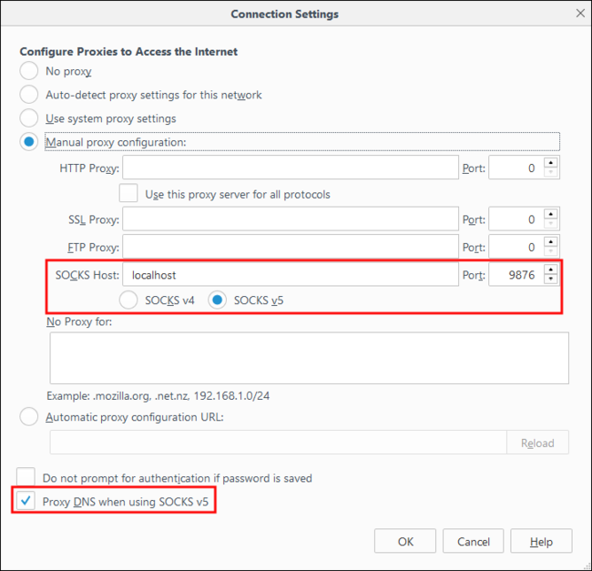
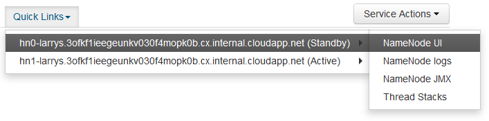
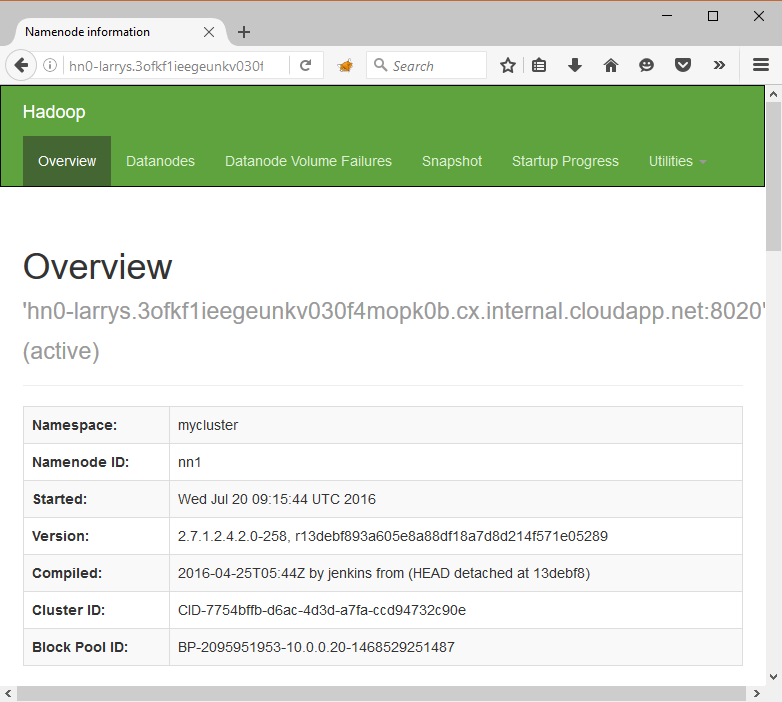

# Use SSH Tunneling to access Ambari web UI, JobHistory, NameNode, Oozie, and other web UI's

Linux-based HDInsight clusters provide access to Ambari web UI over the Internet, but some features of the UI are not. For example, the web UI for other services that are surfaced through Ambari. For full functionality of the Ambari web UI, you must use an SSH tunnel to the cluster head.

## Why use an SSH tunnel

Several of the menus in Ambari do not fully populate without an SSH tunnel, as they rely on web sites and services exposed by other Hadoop services running on the cluster. Often, these web sites are not secured, so it is not safe to directly expose them on the internet. Sometimes the service runs the web site on another cluster node such as a Zookeeper node.

The following are services that Ambari web UI uses, that cannot be accessed without an SSH tunnel:

* JobHistory
* NameNode
* Thread Stacks
* Oozie web UI
* HBase Master and Logs UI

If you use Script Actions to customize your cluster, any services or utilities that you install that expose a web UI require an SSH tunnel. For example, if you install Hue using a Script Action, you must use an SSH tunnel to access the Hue web UI.

## What is an SSH tunnel

[Secure Shell (SSH) tunneling](https://en.wikipedia.org/wiki/Tunneling_protocol#Secure_Shell_tunneling) routes traffic sent to a port on your local workstation, through an SSH connection to your HDInsight cluster head node, where the request is then resolved as if it originated on the head node. The response is then routed back through the tunnel to your workstation.

## Prerequisites

When using an SSH tunnel for web traffic, you must have the following:

* An SSH client. For Linux and Unix distributions, Macintosh OS X, and Bash on Windows 10, the `ssh` command is provided with the operating system. For Windows versions that do not include the `ssh` command, we recommend [PuTTY](http://www.chiark.greenend.org.uk/~sgtatham/putty/download.html)
  
  > [!NOTE]
  > If you want to use an SSH client other than `ssh` or PuTTY, please consult the documentation for your client on how to establish an SSH tunnel.

* A web browser that can be configured to use a SOCKS5 proxy.

    > [!WARNING]
    > The SOCKS proxy support built into Windows does not support SOCKS5, and will not work with the steps in this document. The following browsers rely on Windows proxy settings, and do not currently work with the steps in this document:
    > 
    > * Microsoft Edge
    > * Microsoft Internet Explorer
    >
    > Google Chrome also relies on the Windows proxy settings. However, you can install extensions that support SOCKS5. We recommend [FoxyProxy Standard](https://chrome.google.com/webstore/detail/foxyproxy-standard/gcknhkkoolaabfmlnjonogaaifnjlfnp).

## <a name="usessh"></a>Create a tunnel using the SSH command

Use the following command to create an SSH tunnel using the `ssh` command. Replace **USERNAME** with an SSH user for your HDInsight cluster, and replace **CLUSTERNAME** with the name of your HDInsight cluster

```
ssh -C2qTnNf -D 9876 USERNAME@CLUSTERNAME-ssh.azurehdinsight.net
```

This creates a connection that routes traffic to local port 9876 to the cluster over SSH. The options are:

* **D 9876** - The local port that routes traffic through the tunnel.
* **C** - Compress all data, because web traffic is mostly text.
* **2** - Force SSH to try protocol version 2 only.
* **q** - Quiet mode.
* **T** - Disable pseudo-tty allocation, since we are just forwarding a port.
* **n** - Prevent reading of STDIN, since we are just forwarding a port.
* **N** - Do not execute a remote command, since we are just forwarding a port.
* **f** - Run in the background.

If you configured the cluster with an SSH key, you may need use the `-i` parameter and specify the path to the private SSH key.

Once the command finishes, traffic sent to port 9876 on the local computer is routed over Secure Sockets Layer (SSL) to the cluster head node and appear to originate there.

## <a name="useputty"></a>Create a tunnel using PuTTY

Use the following steps to create an SSH tunnel using PuTTY.

1. Open PuTTY, and enter your connection information. If you are not familiar with PuTTY, see the [PuTTY documentation (http://www.chiark.greenend.org.uk/~sgtatham/putty/docs.html)](http://www.chiark.greenend.org.uk/~sgtatham/putty/docs.html).

2. In the **Category** section to the left of the dialog, expand **Connection**, expand **SSH**, and then select **Tunnels**.

3. Provide the following information on the **Options controlling SSH port forwarding** form:
   
   * **Source port** - The port on the client that you wish to forward. For example, **9876**.

   * **Destination** - The SSH address for the Linux-based HDInsight cluster. For example, **mycluster-ssh.azurehdinsight.net**.

   * **Dynamic** - Enables dynamic SOCKS proxy routing.
     
     

4. Click **Add** to add the settings, and then click **Open** to open an SSH connection.

5. When prompted, log in to the server. This establishes an SSH session and enable the tunnel.

## Use the tunnel from your browser

> [!IMPORTANT]
> The steps in this section use the Mozilla FireFox browser, as it provides the same proxy settings across all platforms. Other modern browsers, such as Google Chrome, may require an extension such as FoxyProxy to work with the tunnel.

1. Configure the browser to use **localhost** and the port you used when creating the tunnel as a **SOCKS v5** proxy. Here's what the Firefox settings look like. If you used a different port than 9876, change the port to the one you used:
   
    
   
   > [!NOTE]
   > Selecting **Remote DNS** resolves Domain Name System (DNS) requests by using the HDInsight cluster. If this is unselected, DNS is resolved locally.

2. Verify that traffic is being routed through the tunnel by vising a site such as [http://www.whatismyip.com/](http://www.whatismyip.com/) with the proxy settings enabled and disabled in Firefox. While the settings are enabled, the IP address returned is from a machine in the Microsoft Azure datacenter.

## Verify with Ambari web UI

Once the cluster has been established, use the following steps to verify that you can access service web UIs from the Ambari Web:

1. In your browser, go to http://headnodehost:8080. The `headnodehost` address is sent over the tunnel to the cluster and resolve to the headnode that Ambari is running on. When prompted, enter the admin user name (admin) and password for your cluster. You may be prompted a second time by the Ambari web UI. If so, re-enter the information.
   
   > [!NOTE]
   > When using the http://headnodehost:8080 address to connect to the cluster, you are connecting directly over the tunnel to the head node that Ambari is running on using HTTP and communication is secured using the SSH tunnel. when connecting over the internet without the use of a tunnel, communication is secured using HTTPS. To connect over the internet using HTTPS, use https://CLUSTERNAME.azurehdinsight.net, where **CLUSTERNAME** is the name of the cluster.

2. From the Ambari Web UI, select HDFS from the list on the left of the page.
   
    
3. When the HDFS service information is displayed, select **Quick Links**. A list of the cluster head nodes appears. Select one of the head nodes, and then select **NameNode UI**.
   
    
   
   > [!NOTE]
   > If you have a slow internet connection, or the head node is very busy, you may get a wait indicator instead of a menu when you select **Quick Links**. If so, wait a minute or two for the data to be received from the server, then try the list again.
   > 
   > If you have a lower resolution monitor, or your browser window is not maximized, some entries in the **Quick Links** menu may be cut off by the right side of the screen. If so, expand the menu using your mouse, then use the right arrow key to scroll the screen to the right to see the rest of the menu.
   > 
   > 
4. A page similar to the following should appear:
   
    
   
   > [!NOTE]
   > Notice the URL for this page; it should be similar to **http://hn1-CLUSTERNAME.randomcharacters.cx.internal.cloudapp.net:8088/cluster**. This is using the internal fully qualified domain name (FQDN) of the node, and is not accessible without using an SSH tunnel.
   > 
   > 

## Next steps

Now that you have learned how to create and use an SSH tunnel, see the following for information on monitoring and managing your cluster using Ambari:

* [Manage HDInsight clusters by using Ambari](hdinsight-hadoop-manage-ambari.md)

For more information on using SSH with HDInsight, see [Use SSH with HDInsight](hdinsight-hadoop-linux-use-ssh-unix.md).

