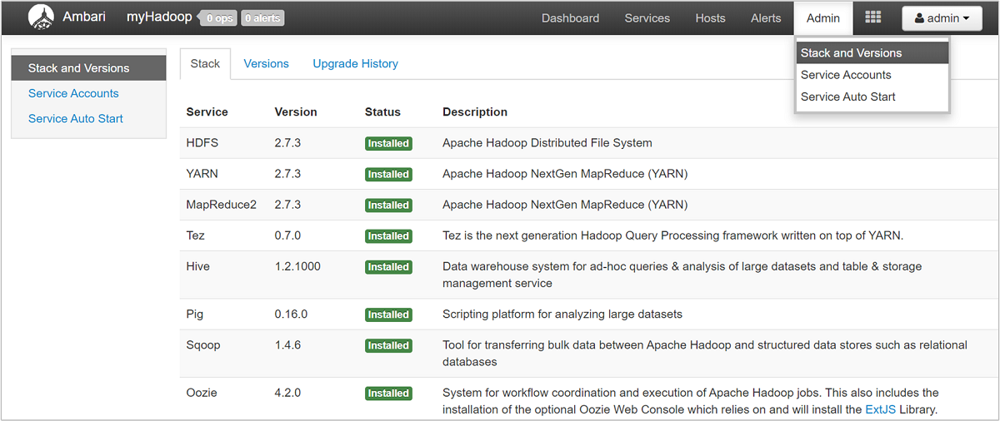
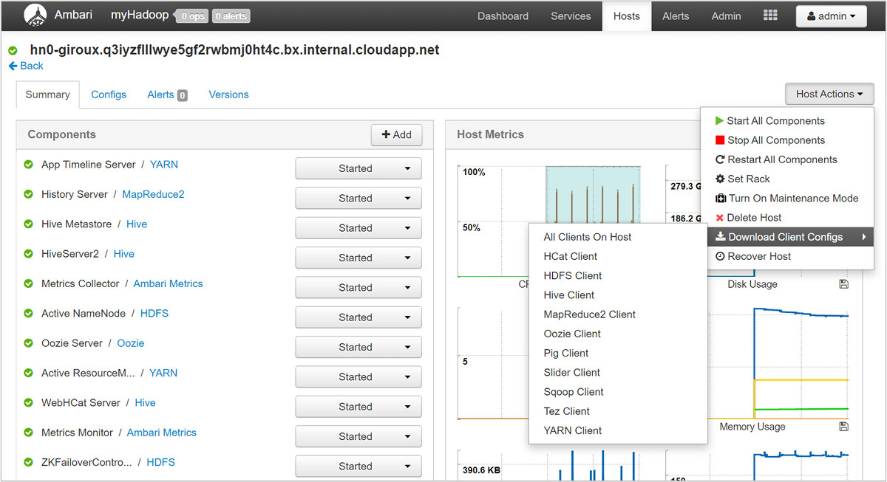
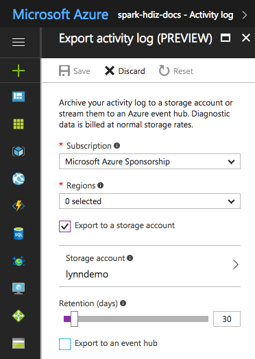

# Manage logs for an HDInsight cluster

An HDInsight cluster produces a variety of log files. For example, Apache Hadoop and related services, such as Apache Spark, produce detailed job execution logs. Log file management is part of maintaining a healthy HDInsight cluster. There can also be regulatory requirements for log archiving.  Due to the number and size of log files, optimizing log storage and archiving helps with service cost management.

Managing HDInsight cluster logs includes retaining information about all aspects of the cluster environment. This information includes all associated Azure Service logs, cluster configuration, job execution information, any error states, and other data as needed.

Typical steps in HDInsight log management are:

* Step 1: Determine log retention policies
* Step 2: Manage cluster service versions configuration logs
* Step 3: Manage cluster job execution log files
* Step 4: Forecast log volume storage sizes and costs
* Step 5: Determine log archive policies and processes

## Step 1: Determine log retention policies

The first step in creating a HDInsight cluster log management strategy is to gather information about business scenarios and job execution history storage requirements.

### Cluster details

The following cluster details are useful in helping to gather information in your log management strategy. Gather this information from all HDInsight clusters you've created in a particular Azure account.

* Cluster name
* Cluster region and Azure availability zone
* Cluster state, including details of the last state change
* Type and number of HDInsight instances specified for the master, core, and task nodes

You can get most of this top-level information using the Azure portal.  Alternatively, you can use [Azure CLI](https://docs.microsoft.com/cli/azure/?view=azure-cli-latest) to get information about your HDInsight cluster(s):

```azurecli
az hdinsight list --resource-group <ResourceGroup>
az hdinsight show --resource-group <ResourceGroup> --name <ClusterName>
```

You can also use PowerShell to view this information.  For more information, see [Apache Manage Hadoop clusters in HDInsight by using Azure PowerShell](hdinsight-administer-use-powershell.md).

### Understand the workloads running on your clusters

It's important to understand the workload types running on your HDInsight cluster(s) to design appropriate logging strategies for each type.

* Are the workloads experimental (such as development or test) or production-quality?
* How often do the production-quality workloads normally run?
* Are any of the workloads resource-intensive and/or long-running?
* Do any of the workloads use a complex set of Hadoop services for which multiple types of logs are produced?
* Do any of the workloads have associated regulatory execution lineage requirements?

### Example log retention patterns and practices

* Consider maintaining data lineage tracking by adding an identifier to each log entry, or through other techniques. This allows you to trace back the original source of the data and the operation, and follow the data through each stage to understand its consistency and validity.

* Consider how you can collect logs from the cluster, or from more than one cluster, and collate them for purposes such as auditing, monitoring, planning, and alerting. You might use a custom solution to access and download the log files on a regular basis, and combine and analyze them to provide a dashboard display. You can also add additional capabilities for alerting for security or failure detection. You can build these utilities using PowerShell, the HDInsight SDKs, or code that accesses the Azure classic deployment model.

* Consider whether a monitoring solution or service would be a useful benefit. The Microsoft System Center provides an [HDInsight management pack](https://www.microsoft.com/download/details.aspx?id=42521). You can also use third-party tools such as Apache Chukwa and Ganglia to collect and centralize logs. Many companies offer services to monitor Hadoop-based big data solutions, for example: Centerity, Compuware APM, Sematext SPM, and Zettaset Orchestrator.

## Step 2: Manage cluster service versions and view logs

A typical HDInsight cluster uses several services and open-source software packages (such as Apache HBase, Apache Spark, and so forth). For some workloads, such as bioinformatics, you may be required to retain service configuration log history in addition to job execution logs.

### View cluster configuration settings with the Ambari UI

Apache Ambari simplifies the management, configuration, and monitoring of a HDInsight cluster by providing a web UI and a REST API. Ambari is included on Linux-based HDInsight clusters. Select the **Cluster Dashboard** pane on the Azure portal HDInsight page to open the **Cluster Dashboards** link page.  Next, select the **HDInsight cluster dashboard** pane to open the Ambari UI.  You're prompted for your cluster login credentials.

To open a list of service views, select the **Ambari Views** pane on the Azure portal page for HDInsight.  This list varies, depending on which libraries you've installed.  For example, you may see YARN Queue Manager, Hive View, and Tez View.  Select any service link to see configuration and service information.  The Ambari UI **Stack and Version** page provides information about the cluster services' configuration and service version history. To navigate to this section of the Ambari UI, select the **Admin** menu and then **Stacks and Versions**.  Select the **Versions** tab to see service version information.



Using the Ambari UI, you can download the configuration for any (or all) services running on a particular host (or node) in the cluster.  Select the **Hosts** menu, then the link for the host of interest. On that host's page, select the **Host Actions** button and then **Download Client Configs**.



### View the script action logs

HDInsight [script actions](hdinsight-hadoop-customize-cluster-linux.md) run scripts on a cluster, either manually or when specified. For example, script actions can be used to install additional software on the cluster or to alter configuration settings from the default values. Script action logs can provide insight into errors that occurred during setup of the cluster, and also configuration settings' changes that could affect cluster performance and availability.  To see the status of a script action, select the **ops** button on your Ambari UI, or access the status logs in the default storage account. The storage logs are available at `/STORAGE_ACCOUNT_NAME/DEFAULT_CONTAINER_NAME/custom-scriptaction-logs/CLUSTER_NAME/DATE`.

### View Ambari alerts status logs

Apache Ambari writes alert status changes to `ambari-alerts.log`. The full path is `/var/log/ambari-server/ambari-alerts.log`. To enable debugging for the log, change a property in `/etc/ambari-server/conf/log4j.properties.` Change then entry under `# Log alert state changes` from:

```
log4j.logger.alerts=INFO,alerts

to

log4j.logger.alerts=DEBUG,alerts
```

## Step 3: Manage the cluster job execution log files

The next step is reviewing the job execution log files for the various services.  Services could include Apache HBase, Apache Spark, and many others. A Hadoop cluster produces a large number of verbose logs, so determining which logs are useful (and which aren't) can be time-consuming.  Understanding the logging system is important for targeted management of log files.  The following image is an example log file.


### Access the Hadoop log files

HDInsight stores its log files both in the cluster file system and in Azure Storage. You can examine log files in the cluster by opening an [SSH](hdinsight-hadoop-linux-use-ssh-unix.md) connection to the cluster and browsing the file system, or by using the Hadoop YARN Status portal on the remote head node server. You can examine the log files in Azure Storage using any of the tools that can access and download data from Azure Storage. Examples are [AzCopy](../storage/common/storage-use-azcopy.md), [CloudXplorer](https://clumsyleaf.com/products/cloudxplorer), and the Visual Studio Server Explorer. You can also use PowerShell and the Azure Storage Client libraries, or the Azure .NET SDKs, to access data in Azure blob storage.

Hadoop runs the work of the jobs as *task attempts* on various nodes in the cluster. HDInsight can initiate speculative task attempts, terminating any other task attempts that don't complete first. This generates significant activity that is logged to the controller, stderr, and syslog log files on-the-fly. In addition, multiple task attempts are running simultaneously, but a log file can only display results linearly.

#### HDInsight logs written to Azure Blob storage

HDInsight clusters are configured to write task logs to an Azure Blob storage account for any job that is submitted using the Azure PowerShell cmdlets or the .NET job submission APIs.  If you submit jobs through SSH to the cluster, then the execution logging information is stored in the Azure Tables as discussed in the previous section.

In addition to the core log files generated by HDInsight, installed services such as YARN also generate job execution log files.  The number and type of log files depends on the services installed.  Common services are Apache HBase, Apache Spark, and so on.  Investigate the job log execution files for each service to understand the overall logging files available on your cluster.  Each service has its own unique methods of logging and locations for storing log files.  As an example, details for accessing the most common service log files (from YARN) are discussed in the following section.

### HDInsight logs generated by YARN

YARN aggregates logs across all containers on a worker node and stores those logs as one aggregated log file per worker node. That log is stored on the default file system after an application finishes. Your application may use hundreds or thousands of containers, but logs for all containers that are run on a single worker node are always aggregated to a single file. There's only one log per worker node used by your application. Log aggregation is enabled by default on HDInsight clusters version 3.0 and above. Aggregated logs are located in default storage for the cluster.

```
/app-logs/<user>/logs/<applicationId>
```

The aggregated logs aren't directly readable, as they're written in a TFile binary format indexed by container. Use the YARN ResourceManager logs or CLI tools to view these logs as plain text for applications or containers of interest.

#### YARN CLI tools

To use the YARN CLI tools, you must first connect to the HDInsight cluster using SSH. Specify the `<applicationId>`, `<user-who-started-the-application>`, `<containerId>`, and `<worker-node-address>` information when running these commands. You can view the logs as plain text with one of the following commands:

```bash
yarn logs -applicationId <applicationId> -appOwner <user-who-started-the-application>
yarn logs -applicationId <applicationId> -appOwner <user-who-started-the-application> -containerId <containerId> -nodeAddress <worker-node-address>
```

#### YARN ResourceManager UI

The YARN ResourceManager UI runs on the cluster head node, and is accessed through the Ambari web UI. Use the following steps to view the YARN logs:

1. In a web browser, navigate to `https://CLUSTERNAME.azurehdinsight.net`. Replace CLUSTERNAME with the name of your HDInsight cluster.
2. From the list of services on the left, select YARN.
3. From the Quick Links dropdown, select one of the cluster head nodes and then select **ResourceManager logs**. You're presented with a list of links to YARN logs.

## Step 4: Forecast log volume storage sizes and costs

After completing the previous steps, you have an understanding of the types and volumes of log files that your HDInsight cluster(s) are producing.

Next, analyze the volume of log data in key log storage locations over a period of time. For example, you can analyze volume and growth over 30-60-90 day periods.  Record this information in a spreadsheet or use other tools such as Visual Studio, the Azure Storage Explorer, or Power Query for Excel. For more information, see [Analyze HDInsight logs](hdinsight-debug-jobs.md).  

You now have enough information to create a log management strategy for the key logs.  Use your spreadsheet (or tool of choice) to forecast both log size growth and log storage Azure service costs going forward.  Consider also any log retention requirements for the set of logs that you're examining.  Now you can reforecast future log storage costs, after determining which log files can be deleted (if any) and which logs should be retained and archived to less expensive Azure Storage.

## Step 5: Determine log archive policies and processes

After you determine which log files can be deleted, you can adjust logging parameters on many Hadoop services to automatically delete log files after a specified time period.

For certain log files, you can use a lower-priced log file archiving approach. For Azure Resource Manager activity logs, you can explore this approach using the Azure portal.  Set up archiving of the Resource Manager logs by selecting the **Activity Log** link in the Azure portal for your HDInsight instance.  On the top of the Activity Log search page, select the **Export** menu item to open the **Export activity log** pane.  Fill in the subscription, region, whether to export to a storage account, and how many days to retain the logs. On this same pane, you can also indicate whether to export to an event hub.



Alternatively, you can script log archiving with PowerShell.  For an example PowerShell script, see [Archive Azure Automation logs to Azure Blob Storage](https://gallery.technet.microsoft.com/scriptcenter/Archive-Azure-Automation-898a1aa8).

### Accessing Azure Storage metrics

Azure Storage can be configured to log storage operations and access. You can use these very detailed logs for capacity monitoring and planning, and for auditing requests to storage. The logged information includes latency details, enabling you to monitor and fine-tune the performance of your solutions.
You can use the .NET SDK for Hadoop to examine the log files generated for the Azure Storage that holds the data for an HDInsight cluster.

### Control the size and number of backup indexes for old log files

To control the size and number of log files retained, set the following properties of the `RollingFileAppender`:

* `maxFileSize` is the critical size of the file, above which the file is rolled. The default value is 10 MB.
* `maxBackupIndex` specifies the number of backup files to be created, default 1.

### Other log management techniques

To avoid running out of disk space, you can use some OS tools such as [logrotate](https://linux.die.net/man/8/logrotate) to manage handling of log files. You can configure `logrotate` to run on a daily basis, compressing log files and removing old ones. Your approach  depends on your requirements, such as how long to keep the logfiles on local nodes.  

You can also check whether DEBUG logging is enabled for one or more services, which greatly increases the output log size.  

To collect the logs from all the nodes to one central location, you can create a data flow, such as ingesting all log entries into Solr.

## Next steps

* [Monitoring and Logging Practice for HDInsight](https://msdn.microsoft.com/library/dn749790.aspx)
* [Access Apache Hadoop YARN application logs in Linux-based HDInsight](hdinsight-hadoop-access-yarn-app-logs-linux.md)
* [How to control size of log files for various Apache Hadoop components](https://community.hortonworks.com/articles/8882/how-to-control-size-of-log-files-for-various-hdp-c.html)
