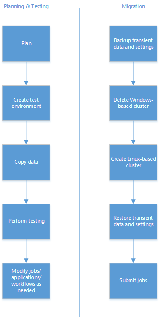

<properties
pageTitle="Migrate from Windows-based HDInsight to Linux-based HDInsight | Azure"
description="Learn how to migrate from a Windows-based HDInsight cluster to a Linux-based HDInsight cluster."
services="hdinsight"
documentationCenter=""
authors="Blackmist"
manager="paulettm"
editor="cgronlun"/>

<tags
ms.service="hdinsight"
ms.devlang="na"
ms.topic="article"
ms.tgt_pltfrm="na"
ms.workload="big-data"
ms.date="07/25/2016"
ms.author="larryfr"/>

#Migrate from a Windows-based HDInsight cluster to a Linux-based cluster

While Windows-based HDInsight provides an easy way to use Hadoop in the cloud, you may discover that you need a Linux-based cluster to take advantage of tools and technologies that are required for your solution. Many things in the Hadoop ecosystem are developed on Linux-based systems, and some may not be available for use with Windows-based HDInsight. Additionally, many books, videos, and other training material assume that you are using a Linux system when working with Hadoop.

This document provides details on the differences between HDInsight on Windows and Linux, and guidance on how to migrate existing workloads to a Linux-based cluster.

> [AZURE.NOTE] HDInsight clusters use Ubuntu long term support (LTS) as the operating system for the nodes in the cluster. HDInsight 3.3 and 3.4 clusters use Ubuntu 14.0.4 LTS; earlier versions of HDInsight used Ubuntu 12.04.05 LTS.

## Migration tasks

The general workflow for migration is as follows.

1.  Read each section of this document to understand changes that may be required when migrating your existing workflow, jobs, etc. to a Linux-based cluster.

2.  Create a Linux-based cluster as a test/quality assurance environment. For more information on creating a Linux-based cluster, see [Create Linux-based clusters in HDInsight](hdinsight-hadoop-provision-linux-clusters.md).

3.  Copy existing jobs, data sources and sinks to the new environment. See the Copy data to the test environment section for more details.

4.  Perform validation testing to make sure that your jobs work as expected on the new cluster.

Once you have verified that everything works as expected, schedule
downtime for the migration. During this downtime, do the following
actions.

1.  Backup any transient data stored locally on the cluster nodes. For example, if you have data stored directly on a head node.

2.  Delete the Windows-based cluster.

3.  Create a Linux-based cluster using the same default data store that the Windows-based cluster used. This will allow the new cluster to continue working against your existing production data.

4.  Import any transient data you backed up.

5.  Start jobs/continue processing using the new cluster.

### Copy data to the test environment

There are many methods to copy the data and jobs, however the two discussed in this section are the simplest methods to directly move files to a test cluster.

#### HDFS DFS copy

You can use the Hadoop HDFS command to directly copy data from the storage for your existing production cluster, to the storage for a new test cluster using the following steps.

1. Find the storage account and default container information for your existing cluster. You can do this by using the following Azure PowerShell script.

        $clusterName="Your existing HDInsight cluster name"
        $clusterInfo = Get-AzureRmHDInsightCluster -ClusterName $clusterName
        write-host "Storage account name: $clusterInfo.DefaultStorageAccount.split('.')[0]"
        write-host "Default container: $clusterInfo.DefaultStorageContainer"

2. Follow the steps in the Create Linux-based clusters in HDInsight document to create a new test environment. Stop before creating the cluster, and instead select **Optional Configuration**.

3. From the Optional Configuration blade, select **Linked Storage Accounts**.

4. Select **Add a storage key**, and when prompted, select the storage account that was returned by the PowerShell script in step 1. Click **Select** on each blade to close them. Finally, create the cluster.

5. Once the cluster has been created, connect to it using **SSH.** If you are not familiar with using SSH with HDInsight, see one of the following articles.

    * [Use SSH with Linux-based HDInsight from Windows clients](hdinsight-hadoop-linux-use-ssh-windows.md)

    * [Use SSH with Linux-based HDInsight from Linux, Unix, and Mac clients](hdinsight-hadoop-linux-use-ssh-unix.md)

6. From the SSH session, use the following command to copy files from the linked storage account to the new default storage account. Replace CONTAINER and ACCOUNT with the container and account information returned by the PowerShell script in step 1. Replace the path to data with the path to a data file.

        hdfs dfs -cp wasbs://CONTAINER@ACCOUNT.blob.core.windows.net/path/to/old/data /path/to/new/location

    [AZURE.NOTE] If the directory structure that contains the data does not exist on the test environment, you can create it using the following command.

        hdfs dfs -mkdir -p /new/path/to/create

    The `-p` switch enables the creation of all directories in
    the path.

#### Direct copy between Azure Storage blobs

Alternatively, you may want to use the `Start-AzureStorageBlobCopy` Azure PowerShell cmdlet to copy blobs between storage accounts outside of HDInsight. For more information, see the How to manage Azure Blobs section of Using Azure PowerShell with Azure Storage.

##Client-side technologies

In general, client-side technologies such as [Azure PowerShell cmdlets](../powershell-install-configure.md), [Azure CLI](../xplat-cli-install.md) or the [.NET SDK for Hadoop](https://hadoopsdk.codeplex.com/) will continue to work the same with Linux-based clusters, as they rely on REST APIs that are the same across both cluster OS types.

##Server-side technologies

The following table provides guidance on migrating server-side components that are Windows specific.

| If you are using this technology... | Take this action... |
| ----- | ----- |
| **PowerShell** (server-side scripts, including Script Actions used during cluster creation) | Rewrite as Bash scripts. For Script Actions, see [Customize Linux-based HDInsight with Script Actions](hdinsight-hadoop-customize-cluster-linux.md) and [Script action development for Linux-based HDInsight](hdinsight-hadoop-script-actions-linux.md). |
| **Azure CLI** (server-side scripts) | While the Azure CLI is available on Linux, it does not come pre-installed on the HDInsight cluster head nodes. If you need it for server-side scripting, see [Install the Azure CLI](../xplat-cli-install.md) for information on installing on Linux-based platforms. |
| **.NET components** | .NET is not currently supported on Linux-based HDInsight clusters, but will be added in a future update. If you need to migrate now, you must rewrite your components in Java or Python. |
| **Win32 components or other Windows-only technology** | Guidance depends on the component or technology; you may be able to find a version that is compatible with Linux, or you may need to find an alternate solution or rewrite this component. |

##Cluster creation

This section provides information on differences in cluster creation.

### SSH User

Linux-based HDInsight clusters use the **Secure Shell (SSH)** protocol to provide remote access to the cluster nodes. Unlike Remote Desktop for Windows-based clusters, most SSH clients do not provide a graphical user experience, but instead provides a command-line that allows you to run commands on the cluster. Some clients (such as [MobaXterm](http://mobaxterm.mobatek.net/),) provide a graphical file system browser in addition to a remote command-line.

During cluster creation, you must provide an SSH user and either a **password** or **public key certificate** for authentication.

We recommend using Public key certificate, as it is more secure than using a password. Certificate authentication works by generating a signed public/private key pair, then providing the public key when creating the cluster. When connecting to the server using SSH, the private key on the client provides authentication for the connection.

For more information on using SSH with HDInsight, see:

- [Use SSH with HDInsight from Windows clients](hdinsight-hadoop-linux-use-ssh-windows.md)

- [Use SSH with HDInsight from Linux, Unix, and OS X clients](hdinsight-hadoop-linux-use-ssh-unix.md)

### Cluster customization

**Script Actions** used with Linux-based clusters must be written in Bash script. While Script Actions can be used during cluster creation, for Linux-based clusters they can also be used to perform customization after a cluster is up and running. For more information, see [Customize Linux-based HDInsight with Script Actions](hdinsight-hadoop-customize-cluster-linux.md) and [Script action development for Linux-based HDInsight](hdinsight-hadoop-script-actions-linux.md).

Another customization feature is **bootstrap**. For Windows clusters, this allows you to specify the location of additional libraries for use with Hive. After cluster creation, these libraries are automatically available for use with Hive queries without the need to use `ADD JAR`.

Bootstrap for Linux-based clusters does not provide this functionality. Instead, use script action documented in [Add Hive libraries during cluster creation](hdinsight-hadoop-add-hive-libraries.md).

### Virtual Networks

Windows-based HDInsight clusters only work with Classic Virtual Networks, while Linux-based HDInsight clusters require Resource Manager Virtual Networks. If you have resources in a Classic Virtual Network that the Linux-HDInsight cluster must connect to, see [Connecting a Classic Virtual Network to a Resource Manager Virtual Network](../virtual-network/virtual-networks-arm-asm-s2s.md).

For more information on configuration requirements for using Azure Virtual Networks with HDInsight, see [Extend HDInsight capabilities by using a Virtual Network](hdinsight-extend-hadoop-virtual-network.md).

##Management and monitoring

Many of the web UIs you may have used with Windows-based HDInsight, such as Job History or Yarn UI, are available through Ambari. In addition, the Ambari Hive View provides a way to run Hive queries using your web browser. The Ambari Web UI is available on Linux-based clusters at https://CLUSTERNAME.azurehdinsight.net.

For more information on working with Ambari, see the following documents:

- [Ambari Web](hdinsight-hadoop-manage-ambari.md)

- [Ambari REST API](hdinsight-hadoop-manage-ambari-rest-api.md)

### Ambari Alerts

Ambari has an alert system that can tell you of potential problems with the cluster. Alerts appear as red or yellow entries in the Ambari Web UI, however you can also retrieve them through the REST API.

> [AZURE.IMPORTANT] Ambari alerts indicate that there *may* be a problem, not that there *is* a problem. For example, you may receive an alert that HiveServer2 cannot be accessed, even though you can access it normally.
>
> Many alerts are implemented as interval-based queries against a service, and expect a response within a specific time frame. So the alert doesn't necessarily mean that the service is down, just that it didn't return results within the expected time frame.

In general, you should evaluate whether an alert has been occurring for an extended period, or mirrors user problems that have previously been reported with the cluster before taking action on it.

##File system locations

The Linux cluster file system is laid out differently than Windows-based HDInsight clusters. Use the following table to find commonly used files.

| I need to find... | It is located... |
| ----- | ----- |
| Configuration | `/etc`. For example, `/etc/hadoop/conf/core-site.xml` |
| Log files | `/var/logs` |
| Hortonworks Data Platform (HDP) | `/usr/hdp`.There are two directories located here, one that is the current HDP version (for example, `2.2.9.1-1`,) and `current`. The `current` directory contains symbolic links to files and directories located in the version number directory, and is provided as a convenient way of accessing HDP files since the version number will change as the HDP version is updated. |
| hadoop-streaming.jar | `/usr/hdp/current/hadoop-mapreduce-client/hadoop-streaming.jar` |

In general, if you know the name of the file, you can use the following command from an SSH session to find the file path:

    find / -name FILENAME 2>/dev/null

You can also use wildcards with the file name. For example, `find / -name *streaming*.jar 2>/dev/null` will return the path to any jar files that contain the word 'streaming' as part of the file name.

##Hive, Pig, and MapReduce

Pig and MapReduce workloads are very similar on Linux-based clusters - the main difference is if you use Remote Desktop to connect to a Windows-based cluster and run jobs, you will use SSH with Linux-based clusters.

- [Use Pig with SSH](hdinsight-hadoop-use-pig-ssh.md)

- [Use MapReduce with SSH](hdinsight-hadoop-use-mapreduce-ssh.md)

### Hive

The following chart provides guidance on migrating your Hive workloads.

| On Windows-based, I use... | On Linux-based... |
| ----- | ----- |
| **Hive Editor** | [Hive View in Ambari](hdinsight-hadoop-use-hive-ambari-view.md) |
| `set hive.execution.engine=tez;` to enable Tez | Tez is the default execution engine for Linux-based clusters, so the set statement is no longer needed. |
| CMD files or scripts on the server invoked as part of a Hive job | use Bash scripts |
| `hive` command from remote desktop | Use [Beeline](hdinsight-hadoop-use-hive-beeline.md) or [Hive from an SSH session](hdinsight-hadoop-use-hive-ssh.md) |

##Storm

| On Windows-based, I use... | On Linux-based... |
| ----- | ----- |
| Storm Dashboard | The Storm Dashboard is not available. See [Deploy and Manage Storm topologies on Linux-based HDInsight](hdinsight-storm-deploy-monitor-topology-linux.md) for ways to submit topologies |
| Storm UI | The Storm UI is available at https://CLUSTERNAME.azurehdinsight.net/stormui |
| Visual Studio to create, deploy, and manage C# or hybrid topologies | Linux-based clusters do not currently support .NET topologies; however, support will be added in a future update. If you need to migrate before this happens, you will need to re-implement your topologies in Java. See [Develop Java-based topologies](hdinsight-storm-develop-java-topology.md) for more information on creating Java-based topologies. |

##HBase

On Linux-based clusters, the znode parent for HBase is `/hbase-unsecure`. You must set this in the configuration for any Java client applications that use native HBase Java API.

See [Build a Java-based HBase application](hdinsight-hbase-build-java-maven.md) for an example client that sets this value.

##Spark

Spark clusters were available on Windows-clusters during preview; however, for release, Spark is only available with Linux-based clusters. There is no migration path from a Windows-based Spark preview cluster to a release Linux-based Spark cluster.

##Known issues

### Azure Data Factory custom .NET activities

Azure Data Factory custom .NET activities are not currently supported on Linux-based HDInsight clusters. Instead, you should use one of the following methods to implement custom activities as part of your ADF pipeline.

-   Execute .NET activities on Azure Batch pool. See the Use Azure Batch linked service section of [Use custom activities in an Azure Data Factory pipeline](../data-factory/data-factory-use-custom-activities.md#AzureBatch)

-   Implement the activity as a MapReduce activity. See [Invoke MapReduce Programs from Data Factory](../data-factory/data-factory-map-reduce.md) for more information.

### Line endings

In general, line endings on Windows-based systems use CRLF, while Linux-based systems use LF. If you produce, or expect, data with CRLF line endings, you may need to modify the producers or consumers to work with the LF line ending.

For example, using Azure PowerShell to query HDInsight on a Windows-based cluster will return data with CRLF. The same query with a Linux-based cluster will return LF. In many cases, this doesn't matter to the data consumer, however it should be investigated before migrating to a Linux-based cluster.

If you have scripts that will be executed directly on the Linux-cluster nodes (such as a Python script used with Hive or a MapReduce job,) you should always use LF as the line ending. If you use CRLF, you may see errors when running the scripts on a Linux-based cluster.

If you know that the scripts do not contain strings with embedded CR characters, you can bulk change the line endings using one of the following methods:

-   **If you have scripts that you plan on uploading to the cluster**, use the following PowerShell statements to change the line endings from CRLF to LF before uploading the script to the cluster.

        $original_file ='c:\path\to\script.py'
        $text = [IO.File]::ReadAllText($original_file) -replace "`r`n", "`n"
        [IO.File]::WriteAllText($original_file, $text)

-   **If you have scripts that are already in the storage used by the cluster**, you can use the following command from an SSH session to the Linux-based cluster to modify the script.

        hdfs dfs -get wasbs:///path/to/script.py oldscript.py
        tr -d '\r' < oldscript.py > script.py
        hdfs dfs -put -f script.py wasbs:///path/to/script.py

##Next Steps

-   [Learn how to create Linux-based HDInsight clusters](hdinsight-hadoop-provision-linux-clusters.md)

-   [Connect to a Linux-based cluster using SSH from a Windows client](hdinsight-hadoop-linux-use-ssh-windows.md)

-   [Connect to a Linux-based cluster using SSH from a Linux, Unix, or Mac client](hdinsight-hadoop-linux-use-ssh-unix.md)

-   [Manage a Linux-based cluster using Ambari](hdinsight-hadoop-manage-ambari.md)
