# Operationalize a data analytics pipeline

*Data pipelines* underly many data analytics solutions. As the name suggests, a data pipeline takes in raw data, cleans and reshapes it as needed, and then typically performs calculations or aggregations before storing the processed data. The processed data is consumed by clients, reports, or APIs. A data pipeline must provide repeatable results, whether on a schedule or when triggered by new data.

This article describes how to operationalize your data pipelines for repeatability, using Oozie running on HDInsight Hadoop clusters. The example scenario walks you through a data pipeline that prepares and processes airline flight time-series data.

In the following scenario, the input data is a flat file containing a batch of flight data for one month. This flight data includes information such as the origin and destination airport, the miles flown, the departure and arrival times, and so forth. The goal with this pipeline is to summarize daily airline performance, where each airline has one row for each day with the average departure and arrival delays in minutes, and the total miles flown that day.

| YEAR | MONTH | DAY_OF_MONTH | CARRIER |AVG_DEP_DELAY | AVG_ARR_DELAY |TOTAL_DISTANCE |
| --- | --- | --- | --- | --- | --- | --- |
| 2017 | 1 | 3 | AA | 10.142229 | 7.862926 | 2644539 |
| 2017 | 1 | 3 | AS | 9.435449 | 5.482143 | 572289 |
| 2017 | 1 | 3 | DL | 6.935409 | -2.1893024 | 1909696 |

The example pipeline waits until a new time period's flight data arrives, then stores that detailed flight information into your Hive data warehouse for long-term analyses. The pipeline also creates a much smaller dataset that summarizes just the daily flight data. This daily flight summary data is sent to a SQL database to provide reports, such as for a website.

The following diagram illustrates the example pipeline.

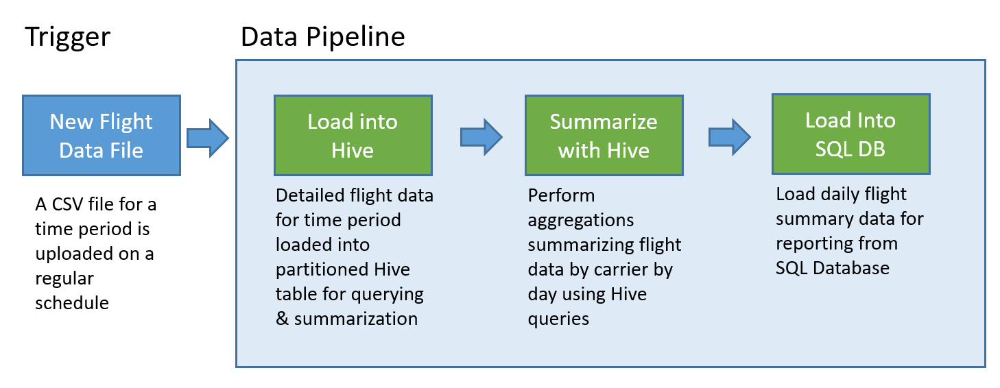

## Oozie Solution Overview

This pipeline uses Apache Oozie running on an HDInsight Hadoop cluster.

Oozie describes its pipelines in terms of *actions*, *workflows*, and *coordinators*. Actions determine the actual work to perform, such as running a Hive query. Workflows define the sequence of actions. Coordinators define the schedule for when the workflow is run. Coordinators can also wait on the availability of new data before launching an instance of the workflow.

The following diagram shows the high-level design of this example Oozie pipeline.


### Provision Azure resources

This pipeline requires an Azure SQL Database and an HDInsight Hadoop cluster in the same location. The Azure SQL Database stores both the summary data produced by the pipeline and the Oozie metadata store.

#### Provision Azure SQL Database

1. Using the Azure portal, create a new Resource Group named `oozie` to contain all the resources used by this example.
2. Within the `oozie` resource group, provision an Azure SQL Server and Database. You do not need a database larger than the S1 Standard pricing tier.
3. Using the Azure portal, navigate to the pane for your newly deployed SQL Database, and select Tools.

    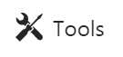

4. Select Query Editor.

    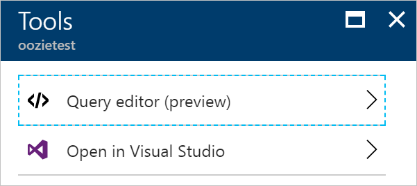

5. In the Query Editor pane, select Login.

    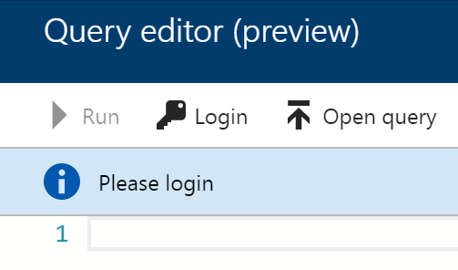

6. Enter your SQL Database credentials and select OK.

   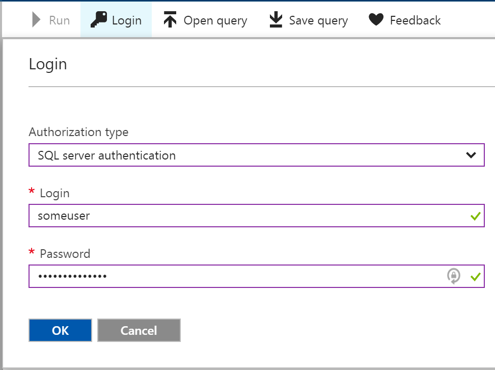

7. In the query editor text area, enter the following SQL statements to create the `dailyflights` table that will store the summarized data from each run of the pipeline.

    ```
    CREATE TABLE dailyflights
    (
        YEAR INT,
        MONTH INT,
        DAY_OF_MONTH INT,
        CARRIER CHAR(2),
        AVG_DEP_DELAY FLOAT,
        AVG_ARR_DELAY FLOAT,
        TOTAL_DISTANCE FLOAT
    )
    GO

    CREATE CLUSTERED INDEX dailyflights_clustered_index on dailyflights(YEAR,MONTH,DAY_OF_MONTH,CARRIER)
    GO
    ```

8. Select Run to execute the SQL statements.

    

9. Your Azure SQL Database is now ready.

#### Provision an HDInsight Hadoop Cluster

1. In the Azure portal, select **+New** and search for HDInsight.
2. Select Create.
3. On the Basics pane provide a unique name for your cluster and choose your Azure Subscription.

    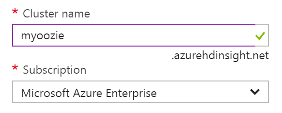

4. In the Cluster type pane, select the Hadoop cluster type, Linux operating system, and the latest version of the HDInsight cluster. Leave the Cluster tier at Standard.

    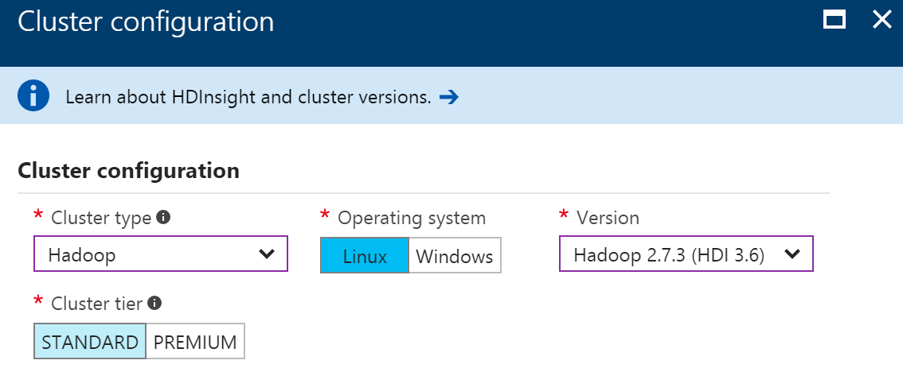

5. Choose Select to apply your cluster type selection.
6. Complete the Basics pane by providing a login password and selecting your `oozie` resource group from the list, then select Next.

    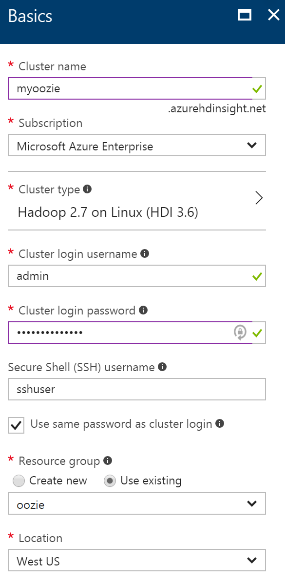

7. In the Storage pane, leave the primary storage type set to Azure Storage, select **Create new** and provide a name for the new account.

    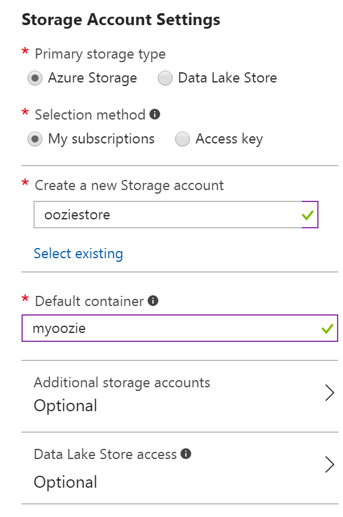

8. For the Metastore Settings, under **Select a SQL database for Hive**, choose the database you previously created.

    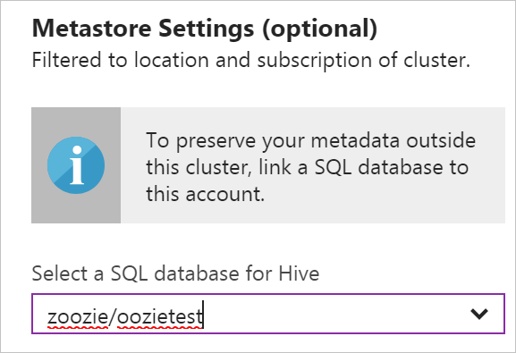

9. Select **Authenticate SQL Database**.

    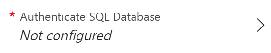

10. Enter your SQL database username and password, and choose Select. 

       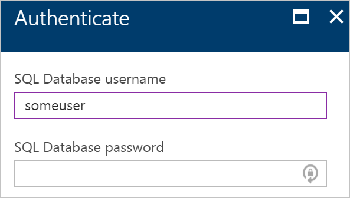

11. Back on the Metastore Settings, select your database for the Oozie metadata store and authenticate as you did previously. 

       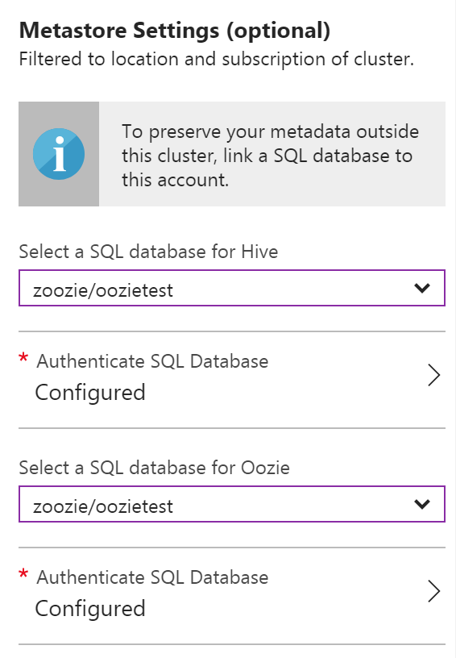

12. Select Next.
13. On the Summary pane, select **Create** to deploy your cluster.

### Verify SSH Tunneling Setup

To use the Oozie Web Console to view the status of your coordinator and workflow instances, set up an SSH tunnel to your HDInsight cluster. For more information, see [SSH Tunnel](hdinsight-linux-ambari-ssh-tunnel.md).

> [!NOTE]
> You can also use Chrome with the [Foxy Proxy](https://getfoxyproxy.org/) extension to browse your cluster's web resources across the SSH tunnel. You need to configure it to proxy all request through the host `localhost` on the tunnel's port 9876. This approach is compatible with the Windows Subsystem for Linux, also known as Bash on Windows 10.

1. Run the following command to open an SSH tunnel to your cluster:

    ```
    ssh -C2qTnNf -D 9876 sshuser@[CLUSTERNAME]-ssh.azurehdinsight.net
    ```

2. Verify the tunnel is operational by navigating to Ambari on your head node by browsing to:

    http://headnodehost:8080

3. To access the Oozie Web Console from within Ambari, select Oozie, Quick Links, and then select Oozie Web Console.

### Configure Hive

1. Upload the CSV file `2017-01-FlightData.csv` containing sample data for one month of flight data. 
<!-- {TODO tbd This file type is not allowed}  You will need to upload the CSV file that contains sample data for one month flight data. You can download this CSV file from here: [2017-01-FlightData.csv](./code/hdinsight-operationalize-data-pipeline/setup/2017-01-FlightData.csv)  -->

2. Copy this file up to the Azure Storage account attached to your HDInsight cluster and place it in the `/example/data/flights` folder.

You can copy the file using SCP in your `bash` shell session.

1. Use SCP to copy the files from your local machine to the local storage of your HDInsight cluster head node.

    scp ./2017-01-FlightData.csv sshuser@[CLUSTERNAME]-ssh.azurehdinsight.net:2017-01-FlightData.csv

2. Use the HDFS command to copy the file from your head node local storage to Azure Storage.

    hdfs dfs -put ./2017-01-FlightData.csv /example/data/flights/2017-01-FlightData.csv

The sample data is now available. However, the pipeline requires two Hive tables for processing, one for the incoming data (`rawFlights`) and one for the summarized data (`flights`). Create these tables in Ambari as follows.

1. Login to Ambari by navigating to [http://headnodehost:8080](http://headnodehost:8080).
2. From the list of services, select Hive.

    

3. Select **Go To View** next to the Hive View 2.0 label.

    

4. In the query text area, paste the following statements to create the `rawFlights` table. The `rawFlights` table provides a schema-on-read for the CSV files within the `/example/data/flights` folder in Azure Storage. 

    ```
    CREATE EXTERNAL TABLE IF NOT EXISTS rawflights (
        YEAR INT,
        MONTH INT,
        DAY_OF_MONTH INT,
        FL_DATE STRING,
        CARRIER STRING,
        FL_NUM STRING,
        ORIGIN STRING,
        DEST STRING,
        DEP_DELAY FLOAT,
        ARR_DELAY FLOAT,
        ACTUAL_ELAPSED_TIME FLOAT,
        DISTANCE FLOAT)
    ROW FORMAT SERDE 'org.apache.hadoop.hive.serde2.OpenCSVSerde'
    WITH SERDEPROPERTIES 
    (
        "separatorChar" = ",",
        "quoteChar"     = "\""
    ) 
    LOCATION '/example/data/flights'
    ```
5. Select Execute to create the table.

    

6. Replace the text in the query text area with the following statements to create the `flights` table. The `flights` table is a Hive managed table that partitions data loaded into it by year, month, and day of month. This table will contain all historical flight data, with the lowest granularity present in the source data of one row per flight. 

    ```
    SET hive.exec.dynamic.partition.mode=nonstrict;

    CREATE TABLE flights
    (
        FL_DATE STRING,
        CARRIER STRING,
        FL_NUM STRING,
        ORIGIN STRING,
        DEST STRING,
        DEP_DELAY FLOAT,
        ARR_DELAY FLOAT,
        ACTUAL_ELAPSED_TIME FLOAT,
        DISTANCE FLOAT
    )
    PARTITIONED BY (YEAR INT, MONTH INT, DAY_OF_MONTH INT)
    ROW FORMAT SERDE 'org.apache.hadoop.hive.serde2.OpenCSVSerde'
    WITH SERDEPROPERTIES 
    (
        "separatorChar" = ",",
        "quoteChar"     = "\""
    );
    ```
7. Select Execute to create the table.

You are now ready to begin constructing your pipeline.

### Create the Oozie workflow

When defining a pipeline, it is typical to batch the data flowing thru the pipeline according to a time interval. In the case of the scenario, the pipeline processes the flight data on a daily interval. This approach provides flexibility in that it allows the input CSV files to arrive daily, weekly, monthly or annually and the pipeline continues to work with little modification.

The workflow you will be build processes the flight data in this day by day fashion, following three major steps:

1. Extract the data in the day date range from the source CSV file represented by the RawFlights table and insert it into Flights table. This is accomplished by running a Hive query. 
2. Dynamically create a staging table in Hive for the day which contains a copy of the flight data summarized by day and carrier. This is also accomplished by running a Hive query.
3. Copy all the data from the daily staging table in Hive to the destination dailyflights table in Azure SQL Database. This is accomplished by using Apache Sqoop, which reads the source rows from the data behind the Hive table residing in Azure Storage and loads them into SQL Database using a JDBC connection.

These three steps are coordinated by an Oozie workflow. 

The first step is a query in the file `hive-load-flights-partition.hql` as follows:

```
SET hive.exec.dynamic.partition.mode=nonstrict;

INSERT OVERWRITE TABLE flights
PARTITION (YEAR, MONTH, DAY_OF_MONTH)
SELECT 	
  	FL_DATE,
  	CARRIER,
  	FL_NUM,
  	ORIGIN,
  	DEST,
  	DEP_DELAY,
  	ARR_DELAY,
  	ACTUAL_ELAPSED_TIME,
  	DISTANCE,
	YEAR,
  	MONTH,
  	DAY_OF_MONTH
FROM rawflights
WHERE year = ${year} AND month = ${month} AND day_of_month = ${day};
```

Observe the values present with the syntax ${}, these are Oozie variables that are configured later and Oozie will substitute with the actual values at runtime. 

The second step is a query in the file hive-create-daily-summary-table.hql as follows:

```
DROP TABLE ${hiveTableName};
CREATE EXTERNAL TABLE ${hiveTableName}
(
    YEAR INT,
  	MONTH INT,
  	DAY_OF_MONTH INT,
  	CARRIER STRING,
  	AVG_DEP_DELAY FLOAT,
  	AVG_ARR_DELAY FLOAT,
  	TOTAL_DISTANCE FLOAT
)
ROW FORMAT DELIMITED
FIELDS TERMINATED BY '\t' STORED AS TEXTFILE LOCATION '${hiveDataFolder}';
INSERT OVERWRITE TABLE ${hiveTableName}
SELECT 	year, month, day_of_month, carrier, avg(dep_delay) avg_dep_delay, 
		avg(arr_delay) avg_arr_delay, sum(distance) total_distance 
FROM flights
GROUP BY year, month, day_of_month, carrier 
HAVING year = ${year} AND month = ${month} AND day_of_month = ${day};
```

This query creates a staging table that will store only the summarized data for one day, take note of the SELECT statement that computes the average delays and total of distance flown by carrier by day. The data inserted into this table stored at a known location (the path indicated by the hiveDataFolder variable) so that it can be used as the source for Sqoop in the next step.

The third step is effectively to run the following sqoop command:

```
sqoop export --connect ${sqlDatabaseConnectionString} --table ${sqlDatabaseTableName} --export-dir ${hiveDataFolder} -m 1 --input-fields-terminated-by "\t"
```

These three steps are expressed as three separate actions in the Oozie workflow (a file named workflow.xml):

```
<workflow-app name="loadflightstable" xmlns="uri:oozie:workflow:0.5">
    <start to = "RunHiveLoadFlightsScript"/>
    <action name="RunHiveLoadFlightsScript">
        <hive xmlns="uri:oozie:hive-action:0.2">
            <job-tracker>${jobTracker}</job-tracker>
            <name-node>${nameNode}</name-node>
            <configuration>
            <property>
                <name>mapred.job.queue.name</name>
                <value>${queueName}</value>
            </property>
            </configuration>
            <script>${hiveScriptLoadPartition}</script>
            <param>year=${year}</param>
            <param>month=${month}</param>
            <param>day=${day}</param>
        </hive>
        <ok to="RunHiveCreateDailyFlightTableScript"/>
        <error to="fail"/>
    </action>
    <action name="RunHiveCreateDailyFlightTableScript">
        <hive xmlns="uri:oozie:hive-action:0.2">
            <job-tracker>${jobTracker}</job-tracker>
            <name-node>${nameNode}</name-node>
            <configuration>
            <property>
                <name>mapred.job.queue.name</name>
                <value>${queueName}</value>
            </property>
            </configuration>
            <script>${hiveScriptCreateDailyTable}</script>
            <param>hiveTableName=${hiveDailyTableName}</param>
            <param>year=${year}</param>
            <param>month=${month}</param>
            <param>day=${day}</param>
            <param>hiveDataFolder=${hiveDataFolder}/${year}/${month}/${day}</param>
        </hive>
        <ok to="RunSqoopExport"/>
        <error to="fail"/>
    </action>
    <action name="RunSqoopExport">
        <sqoop xmlns="uri:oozie:sqoop-action:0.2">
            <job-tracker>${jobTracker}</job-tracker>
            <name-node>${nameNode}</name-node>
            <configuration>
            <property>
                <name>mapred.compress.map.output</name>
                <value>true</value>
            </property>
            </configuration>
            <arg>export</arg>
            <arg>--connect</arg>
            <arg>${sqlDatabaseConnectionString}</arg>
            <arg>--table</arg>
            <arg>${sqlDatabaseTableName}</arg>
            <arg>--export-dir</arg>
            <arg>${hiveDataFolder}/${year}/${month}/${day}</arg>
            <arg>-m</arg>
            <arg>1</arg>
            <arg>--input-fields-terminated-by</arg>
            <arg>"\t"</arg>
            <archive>sqljdbc41.jar</archive>
            </sqoop>
        <ok to="end"/>
        <error to="fail"/>
    </action>
    <kill name="fail">
        <message>Job failed, error message[${wf:errorMessage(wf:lastErrorNode())}] </message>
    </kill>
    <end name="end"/>
</workflow-app>
```

The two Hive queries are accessed by their path in Azure Storage, and the remaining variable values are provided by the job.properties file, for example:

```
nameNode=wasbs://[CONTAINERNAME]@[ACCOUNTNAME].blob.core.windows.net
jobTracker=hn0-[CLUSTERNAME].[UNIQUESTRING].dx.internal.cloudapp.net:8050
queueName=default
oozie.use.system.libpath=true
appBase=wasbs://[CONTAINERNAME]@[ACCOUNTNAME].blob.core.windows.net/oozie
oozie.wf.application.path=${appBase}/load_flights_by_day
hiveScriptLoadPartition=wasbs://[CONTAINERNAME]@[ACCOUNTNAME].blob.core.windows.net/oozie/load_flights_by_day/hive-load-flights-partition.hql
hiveScriptCreateDailyTable=wasbs://[CONTAINERNAME]@[ACCOUNTNAME].blob.core.windows.net/oozie/load_flights_by_day/hive-create-daily-summary-table.hql
hiveDailyTableName=dailyflights${year}${month}${day}
hiveDataFolder=wasbs://[CONTAINERNAME]@[ACCOUNTNAME].blob.core.windows.net/example/data/flights/day/${year}/${month}/${day}
sqlDatabaseConnectionString="jdbc:sqlserver://[SERVERNAME].database.windows.net;user=[USERNAME];password=[PASSWORD];database=[DATABASENAME]"
sqlDatabaseTableName=dailyflights
year=2017
month=01
day=03
```

Notice that the above job.properties file configures the workflow to run for the date January 3rd, 2017. The following table summarizes each of the proeprties in more detail, and indicates from where you need to acquire the value for your own environment.

| Property | Value Source |
| --- | --- |
| nameNode | The full path to the Azure Storage Container attached to your HDInsight cluster. |
|jobTracker | The internal hostname to your active cluster YARN head node. Get this from Ambari- on the Ambari home page, select YARN from the list of services, then choose Active Resource Manager. The URI displayed at the top of the page is what you are after. Append the port 8050. |
| queueName | The name of the YARN queue that is used when scheduling the Hive actions. Leave as default. |
| oozie.use.system.libpath | Leave as true. |
| appBase | The path to the subfolder in Azure Storage to which you deploy the oozie workflow and supporting files |
| oozie.wf.application.path | Indicates the location of the workflow.xml containing the Oozie workflow you want to run | 
| hiveScriptLoadPartition | The path in Azure Storage to the hive-load-flights-partition.hql Hive query file |
| hiveScriptCreateDailyTable | The path in Azure Storage to the hive-create-daily-summary-table.hql Hive query file |
| hiveDailyTableName | The dynamically generated name to use for the staging table |
| hiveDataFolder | The path in Azure Storage to the data contained by the staging table |
| sqlDatabaseConnectionString | The JDBC syntax connection string to your Azure SQL Database | 
| sqlDatabaseTableName | The name of the table in Azure SQL Database into which summary rows are inserted. Leave as dailyflights. |
| year | The year component of the day for which flight summaries are computed. Leave as is. |
| month | The month component of the day for which flight summaries are computed. Leave as is. |
| day | The day of month component of the day for which flight summaries are computed. Leave as is. |

Before you can deploy and run your Oozie workflow, be sure to update your copy of the job.properties file with the values specific to your environment. 

### Deploy and run the Oozie Workflow

To deploy your Oozie workflow (workflow.xml), the Hive queries (hive-load-flights-partition.hql and hive-create-daily-summary-table.hql) and the job.properties configuration file, you can use SCP from your bash session. 

With Oozie, the only the job.properites file must exist on the local storage of the headnode. All other files must be stored in HDFS (Azure Storage). Additionally, the Sqoop action used by the workflow depends on a JDBC driver for communicating with SQL Database, which must be copied from the head node to HDFS. The following instructions walk thru each of these steps:

1. Create the load_flights_by_day subfolder underneath the user's path in the local storage of the head node:

        ssh sshuser@[CLUSTERNAME]-ssh.azurehdinsight.net 'mkdir load_flights_by_day'

2. Copy the workflow and job.properties files up to the load_flights_by_day subfolder:

        scp ./* sshuser@[CLUSTERNAME]-ssh.azurehdinsight.net:load_flights_by_day

3. SSH into your head node and naviagate into the load_flights_by_day folder:

        ssh sshuser@[CLUSTERNAME]-ssh.azurehdinsight.net 
        cd load_flights_by_day


4. Copy workflow files to HDFS:

        hdfs dfs -put ./* /oozie/load_flights_by_day

5. Copy the sqljdbc41.jar from the local head node to the workflow folder in HDFS:

        hdfs dfs -put /usr/share/java/sqljdbc_4.1/enu/sqljdbc*.jar /oozie/load_flights_by_day

6. Run the workflow:

        oozie job -config job.properties -run

7. Observe the status using the Oozie Web Console. Navigate to the console as previously described and look at the listing in the Workflow Jobs tab and selecting the All Jobs toggle.

    

8. When the status reads SUCCEEDED, query the SQL database table (you can use the Query Editor in the Azure Portal as described previously) to view the inserted rows:

        SELECT * FROM dailyflights

Now that you have the workflow running for a single day, you can wrap this workflow with a coordinator that will effectively schedule the workflow so that it runs daily.

### Run the workflow with a coordinator
When you what to schedule this workflow so that it runs daily (or to run for all days in a data range), for example once a day as new data arrives, you need to leverage a coordinator. 

In the case of the scenario, we want the workflow to run daily and so you create a coordinator that has a daily frequency. 

The following is the contents of coordinator.xml:

```
<coordinator-app name="daily_export" start="2017-01-01T00:00Z" end="2017-01-05T00:00Z" frequency="${coord:days(1)}" timezone="UTC" xmlns="uri:oozie:coordinator:0.4">
    <datasets>
        <dataset name="ds_input1" frequency="${coord:days(1)}" initial-instance="2016-12-31T00:00Z" timezone="UTC">
            <uri-template>${sourceDataFolder}${YEAR}-${MONTH}-FlightData.csv</uri-template>
            <done-flag></done-flag>
        </dataset>
    </datasets>
    <input-events>
        <data-in name="event_input1" dataset="ds_input1">
            <instance>${coord:current(0)}</instance>
        </data-in>
    </input-events>
    <action>
        <workflow>
            <app-path>${appBase}/load_flights_by_day</app-path>
            <configuration>
                <property>
                    <name>year</name>
                    <value>${coord:formatTime(coord:nominalTime(), 'yyyy')}</value>
                </property>
                <property>
                    <name>month</name>
                    <value>${coord:formatTime(coord:nominalTime(), 'MM')}</value>
                </property>
                <property>
                    <name>day</name>
                    <value>${coord:formatTime(coord:nominalTime(), 'dd')}</value>
                </property>
                <property>
                    <name>hiveScriptLoadPartition</name>
                    <value>${hiveScriptLoadPartition}</value>
                </property>
                <property>
                    <name>hiveScriptCreateDailyTable</name>
                    <value>${hiveScriptCreateDailyTable}</value>
                </property>
                <property>
                    <name>hiveDailyTableNamePrefix</name>
                    <value>${hiveDailyTableNamePrefix}</value>
                </property>
                <property>
                    <name>hiveDailyTableName</name>
                    <value>${hiveDailyTableNamePrefix}${coord:formatTime(coord:nominalTime(), 'yyyy')}${coord:formatTime(coord:nominalTime(), 'MM')}${coord:formatTime(coord:nominalTime(), 'dd')}</value>
                </property>
                <property>
                    <name>hiveDataFolderPrefix</name>
                    <value>${hiveDataFolderPrefix}</value>
                </property>
                <property>
                    <name>hiveDataFolder</name>
                    <value>${hiveDataFolderPrefix}${coord:formatTime(coord:nominalTime(), 'yyyy')}/${coord:formatTime(coord:nominalTime(), 'MM')}/${coord:formatTime(coord:nominalTime(), 'dd')}</value>
                </property>
                <property>
                    <name>sqlDatabaseConnectionString</name>
                    <value>${sqlDatabaseConnectionString}</value>
                </property>
                <property>
                    <name>sqlDatabaseTableName</name>
                    <value>${sqlDatabaseTableName}</value>
                </property>
            </configuration>
        </workflow>
    </action>
</coordinator-app>
``` 

As you can see, the majority of the coordinator is just passing thru configuration to the workflow instance. However, there are a few important items to call out.

First, the start and end attributes on the coordinator element itself control the time interval over which the coordinator runs. 

    <coordinator-app ... start="2017-01-01T00:00Z" end="2017-01-05T00:00Z" frequency="${coord:days(1)}" ...>

A coordinator is responsible for scheduling actions within the start and end date range and according to the interval specified by the frequency attribute. Each action scheduled ultimately runs the workflow configured. In the coordinator definition above, the coordinator is configured to run actions from January 1st, 2017 to January 5th, 2017. The frequency is set to 1 day by the [Oozie Expression Language](http://oozie.apache.org/docs/4.2.0/CoordinatorFunctionalSpec.html#a4.4._Frequency_and_Time-Period_Representation) frequency expression ${coord:days(1)}. This results in the coordinator scheduling an action (and ultimately the workflow) once per day. For date ranges that are in the past, as in the example, the action will be scheduled to run without delay. The start of the date from which an action is scheduled to run is referred to as the nominal time. For example, to process the data for January 1st, 2017 the coordinator will schedule action with a nominal time of 2017-01-01T00:00:00 GMT.

Second, within the date range of the workflow, the dataset element defines where to look in HDFS for the data for a particualr date range, and configures how Oozie determines if the data is available yet for processing. 

    <dataset name="ds_input1" frequency="${coord:days(1)}" initial-instance="2016-12-31T00:00Z" timezone="UTC">
            <uri-template>${sourceDataFolder}${YEAR}-${MONTH}-FlightData.csv</uri-template>
            <done-flag></done-flag>
    </dataset>

The path to the data in HDFS is built dynamically according to the expression provided in the uri-template element. In the above coordinator, a frequency of one day is also used with the dataset. While the start and end dates on the coordinator element control when the actions are scheduled (and defines their nominal time), the initial-instance and frequency on the dataset control the calculation of the date that is used in constructing the uri-template. In this case, we set the initial instance to one day before the start of the coordinator to ensure that we pick up the first day's (e.g., 1/1/2017) worth of data. The dataset's date calculation rolls forward from the value of initial-instance (e.g., 12/31/2016) advancing in increments of dataset frequency (e.g., 1 day) until it finds the latest date that does not pass the nominal time set by the coordinator (e.g., 2017-01-01T00:00:00 GMT for the first action).  
Notice also the use of the empty done-flag element- this means that when Oozie checks for the presence of input data at the appointed time, it determines data is available by presence of a directory or file- in this case it is the presence of the csv file. If present it assumes the data is ready and can launch a workflow instance to process it, otherwise it assumes the data is not yet ready and that run of the workflow goes into a waiting state. 

Third, the data-in specifies the particular timestamp to use as the nominal time when replacing the values in uri-template for the associated dataset. 

    <data-in name="event_input1" dataset="ds_input1">
        <instance>${coord:current(0)}</instance>
    </data-in>

In this case, we set the instance to the expression ${coord:current(0)} which translates to using the nominal time of the action as originally scheduled by the coordinator. In other words, when the coordinator schedules the action to run with a nominal time of 01/01/2017, then 01/01/2017 is what is used to replace the YEAR (2017) and MONTH (01) variables in the URI template. Once the URI template is computed for this instance, Oozie checks if the expected directory or file is available and schedules the run of the workflow accordingly.  

These three points all combine to yield a situation where the coordinator schedules processing of the source data in a day by day fashion. For example:

1. The coordinator starts with a nominal date of 2017-01-01.
2. Oozie looks for data available in the sourceDataFolder/2017-01-FlightData.csv.
3. When it sees that file, it schedules an instance of the workflow that will process the data for 2017-01-01.   

Then it continues processing for 2017-01-02. This evaluation continues up to, but excluding 2017-01-05.

As for workflows, the configuration of a coordinator is also provided in a job.properties file, which has a superset of the settings used by the workflow:

```
nameNode=wasbs://[CONTAINERNAME]@[ACCOUNTNAME].blob.core.windows.net
jobTracker=hn0-[CLUSTERNAME].[UNIQUESTRING].dx.internal.cloudapp.net:8050
queueName=default
oozie.use.system.libpath=true
appBase=wasbs://[CONTAINERNAME]@[ACCOUNTNAME].blob.core.windows.net/oozie
oozie.coord.application.path=${appBase}
sourceDataFolder=wasbs://[CONTAINERNAME]@[ACCOUNTNAME].blob.core.windows.net/example/data/flights/
hiveScriptLoadPartition=wasbs://[CONTAINERNAME]@[ACCOUNTNAME].blob.core.windows.net/oozie/load_flights_by_day/hive-load-flights-partition.hql
hiveScriptCreateDailyTable=wasbs://[CONTAINERNAME]@[ACCOUNTNAME].blob.core.windows.net/oozie/load_flights_by_day/hive-create-daily-summary-table.hql
hiveDailyTableNamePrefix=dailyflights
hiveDataFolderPrefix=wasbs://[CONTAINERNAME]@[ACCOUNTNAME].blob.core.windows.net/example/data/flights/day/
sqlDatabaseConnectionString="jdbc:sqlserver://[SERVERNAME].database.windows.net;user=[USERNAME];password=[PASSWORD];database=[DATABASENAME]"
sqlDatabaseTableName=dailyflights

```

The only new properties introduced in this job.properties are:

| Property | Value Source |
| --- | --- |
| oozie.coord.application.path | Indicates the location of the coordinator.xml containing the Oozie coordinator you want to run |
| hiveDailyTableNamePrefix | The prefix that will be used when dynamically creating the table name of the staging table |
| hiveDataFolderPrefix | The prefix of the path to where all the staging tables will be stored |

### Deploy and run the Oozie Coordinator

To run the pipeline with a coordinator, you proceed in a similar fashion as for the workflow, except you work from a folder one level above the folder that contains your workflow. This convention enables you to separate the coordinators from the workflows on disk, and also enables you to easily associate a coordinator with different "child" workflows. 

1. Use SCP from your local machine to copy the coordinator files up to the local storage of the head node of your cluster:

    scp ./* sshuser@[CLUSTERNAME]-ssh.azurehdinsight.net:~

2. SSH into your head node:

        ssh sshuser@[CLUSTERNAME]-ssh.azurehdinsight.net 

3. Copy the coordinator files to HDFS:

        hdfs dfs -put ./* /oozie/

4. Run the coordinator

        oozie job -config job.properties -run

5. Verify the status using the Oozie Web Console, this time selecting the Coordinator Jobs tab, and then the All jobs toggle. 

    

6. Select the coordinator instance to display the list of scheduled actions, you should see four actions with nominal times in the range from 1/1/2017 to 1/4/2017, similar to the following:

    

Each action in this list correlates to an instance of the workflow intended to process one day's worth of data, where the start of that day is indicated by the nominal time.

## See also

* [Apache Oozie Documentation](http://oozie.apache.org/docs/4.2.0/index.html)

<!-- * Build the same pipeline [using Azure Data Factory](tbd.md).  -->
