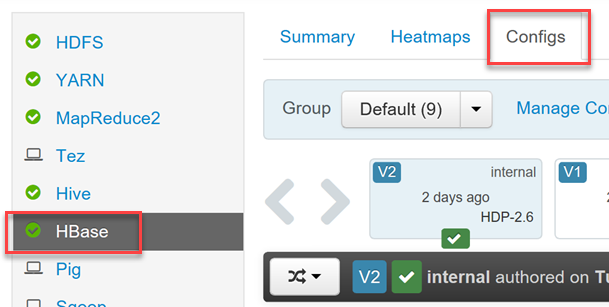

# Apache Phoenix in HDInsight

[Apache Phoenix](http://phoenix.apache.org/) is an open source, massively parallel relational database layer over [HBase](hdinsight-hbase-overview.md). It allows you to use SQL-like queries over HBase. It uses JDBC drivers underneath to enable users to create, delete, alter SQL tables, indexes, views and sequences, upsert rows individually and in bulk. It uses noSQL native compilation instead of using MapReduce to compile queries enabling the creation of low latency applications on top of HBase. To do this, Phoenix adds coprocessors to support running client-supplied code in the address space of the server, executing the code colocated with the data. This minimizes client/server data transfer.

Like other tools used to query big data using SQL-like syntax, such as [Hive](../hdinsight-use-hive.md) and [Spark SQL](hdinsight-spark-sql-with-hdinsight.md), Apache Phoenix opens up big data queries to non-developers who do not want to learn a new programming language just to work with data. The benefit to developers is writing highly performant queries with much less code. Unlike Hive and Spark SQL, Phoenix is highly optimized for HBase, providing powerful features and ease-of-use over MapReduce.

When you submit a SQL query, Phoenix compiles the query to HBase native calls and runs the scan or plan in parallel for optimization. This layer of abstraction takes away the focus (and requirement) of the developer from writing MapReduce jobs, bearing in mind big data fundamentals, and allows them instead to focus on the business logic and the workflow of their application around the big data storage Phoenix gives them access to.

## Query performance optimization and other features

Apache Phoenix adds several performance enhancements, as well as some powerful features, to your HBase queries.

### Secondary indexes

HBase has a single index which is lexicographically sorted on the primary row key. As such, records can only be accessed through the row key. Accessing records through any column other than the row key, requires scanning all of the data and applying the required filter. In a secondary index, the column or expressions indexed form an alternate row key, allowing lookups and range scans on the index.

You can create a secondary index using the `CREATE INDEX` command:

```sql
CREATE INDEX ix_purchasetype on SALTEDWEBLOGS (purchasetype, transactiondate)INCLUDE(bookname,quantity);
```

This typically yields a significant performance increase over executing queries without an index. Such secondary indexes are known as a **covering index**, wherein the index contains all of the columns included in the query. Therefore, the table lookup is not required and the index satisfies the entire query.

### Views

Phoenix views provide a nice way to overcome one of HBase's limitations; the performance degredation experienced when you create more than around 100 physical tables. Views help in this regard by enabling multiple virtual tables to share the same underlying physical HBase table.

Creating views is very similar to using standard SQL view syntax. One primary difference is that you can define additional columns for your view in addition to the columns inherited from its base table. You may also optionally add new `KeyValue` columns.

For example, let's suppose we have a physical table named `product_metrics` with the following definition:

```sql
CREATE  TABLE product_metrics (
    metric_type CHAR(1),
    created_by VARCHAR, 
    created_date DATE, 
    metric_id INTEGER
    CONSTRAINT pk PRIMARY KEY (metric_type, created_by, created_date, metric_id));
```

We can define a view over top of this table, that adds additional columns:

```sql
CREATE VIEW mobile_product_metrics (carrier VARCHAR, dropped_calls BIGINT) AS
SELECT * FROM product_metrics
WHERE metric_type = 'm';
```

Additional columns may be added post-creation with an `ALTER VIEW` statement.

### Skip Scan

Skip scan uses one or more columns of a composite index to find distinct values. This implements intra-row scanning as opposed to Range Scan, yielding [improved performance](http://phoenix.apache.org/performance.html#Skip-Scan). While scanning, the first matched value is skipped along with the index until it finds the next value.

The skip scan leverages the `SEEK_NEXT_USING_HINT` enum of the HBase filter. Using this, the skip scan keeps track of which set of keys or ranges of kees are being searched for in each column. It then takes a key that was passed to it during filter evaluation, and figures out whether it is one of the combinations. If not, it evaluates the next highest key to which to jump.

### Transactions

While HBase provides row-level transactions, Phoenix integrates with [Tephra](http://tephra.io/) to add cross-row and cross-table transaction support with full [ACID](https://en.wikipedia.org/wiki/ACID) semantics.

As with traditional SQL transactions, transactions provided through the Phoenix transaction manager allow you to ensure an atomic unit of data is successfully upserted, rolling back the transaction if the upsert operation fails on any transaction-enabled table.

To create a new table with transactions enabled, use the `TRANSACTIONAL=true` property in your `CREATE` statement:

```sql
CREATE TABLE my_table (k BIGINT PRIMARY KEY, v VARCHAR) TRANSACTIONAL=true;
```

If you wish to alter an existing table to be transactional, use the same property in an `ALTER` statement:

```sql
ALTER TABLE my_other_table SET TRANSACTIONAL=true;
```

> Be aware that you cannot switch a transactional table back to being non-transactional.

Follow [these steps](http://phoenix.apache.org/transactions.html) to enable Phoenix transactions.

### Salted Tables

A common issue when writing records with sequential keys to HBase is known as RegionServer Hotspotting. Though you may have multiple region servers in your cluster, your writes are all occurring on just one. This creates the hotspotting issue where, instead of your write workload being distributed across all of the available region servers, just one is handling the load. Since each region has a pre-defined maximum size, when a region reaches that size limit, it is split into two small regions. When that happens, one of these new regions takes all new records, becoming the new hotspot victim.

To mitigate this problem, achieving better performance, we can pre-split tables in a way that all of the region servers are equally used. Phoenix provides us with Salted tables, where it transparently adds the salting byte to the row key for a particular table. The table is pre-split on the salt byte boundaries to ensure equal load distribution among region servers during the initial phase of the table. This distributes the write workload across all of the available region servers, thus improving the write and read performance. This is achieved by specifying the `SALT_BUCKETS` table property at table creation time.

Example:

```sql
CREATE TABLE Saltedweblogs (
    transactionid varchar(500) Primary Key,
    transactiondate Date NULL,
    customerid varchar(50) NULL,
    bookid varchar(50) NULL,
    purchasetype varchar(50) NULL,
    orderid varchar(50) NULL,
    bookname varchar(50) NULL,
    categoryname varchar(50) NULL,
    invoicenumber varchar(50) NULL,
    invoicestatus varchar(50) NULL,
    city varchar(50) NULL,
    state varchar(50) NULL,
    paymentamount DOUBLE NULL,
    quantity INTEGER NULL,
    shippingamount DOUBLE NULL) SALT_BUCKETS=4;
```

## Enabling and tuning Phoenix through Ambari

When you provision an HDInsight HBase cluster, you gain access to [Ambari](hdinsight-hadoop-manage-ambari.md) to easily make configuration changes.

To enable or disable Phoenix, and to control Phoenix's query timeout settings, log in to Ambari Web UI (https://YOUR_CLUSTER_NAME.azurehdinsight.net) using your Hadoop user credentials specified during cluster creation.

Once logged in, select **HBase** from the list of services in the left-hand menu, then select the **Configs** tab.



Find the **Phoenix SQL** configuration section to enable/disable phoenix, as well as set the query timeout in minutes and seconds.


## See also

* [Use Apache Phoenix with Linux-based HBase clusters in HDInsight](hbase/apache-hbase-phoenix-squirrel-linux.md)
