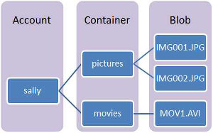

<properties 
   pageTitle="Custom-provision Hadoop clusters in HDInsight | Microsoft Azure" 
   description="Learn how to custom-provision clusters for Azure HDInsight by using the Azure Classic Portal, Azure PowerShell, a command line, or a .NET SDK." 
   services="hdinsight" 
   documentationCenter="" 
   authors="mumian" 
   manager="paulettm" 
   editor="cgronlun"/>

<tags
   ms.service="hdinsight"
   ms.devlang="na"
   ms.topic="article"
   ms.tgt_pltfrm="na"
   ms.workload="big-data" 
   ms.date="07/25/2016"
   ms.author="jgao"/>

#Provision Hadoop clusters in HDInsight

Learn how to plan for provision HDInsight clusters.

> [AZURE.IMPORTANT] The steps in this document use the Azure Classic Portal. Microsoft does not recommend using the classic portal when creating new services. For an explanation of the advantages of the Azure Portal, see [Microsoft Azure Portal](https://azure.microsoft.com/features/azure-portal/).
>
> This document also includes information on using Azure PowerShell, the Azure CLI, and the .NET SDK for HDInsight. The snippets provided are based on commands that use Azure Service Management (ASM) to work with HDInsight and are __deprecated__. These commands will be removed by January 1, 2017.
>
>For a version of this document that uses the Azure portal, along with PowerShell, Azure CLI, and .NET SDK for HDInsight snippets that use Azure Resource Manager (ARM), see [Provision Hadoop clusters in HDInsight](hdinsight-provision-clusters.md).

**Prerequisites:**

Before you begin the instructions in this article, you must have the following:

- An Azure subscription. See [Get Azure free trial](https://azure.microsoft.com/documentation/videos/get-azure-free-trial-for-testing-hadoop-in-hdinsight/).

## Basic configuration options

- **Cluster name**

	Cluster name is used to identify a cluster. Cluster name must follow the following guidelines:
	
	- The field must be a string that contains between 3 and 63 characters
	- The field can contain only letters, numbers, and hyphens.

- **Subscription name**

	An HDInsight cluster is tied to one Azure subscription.
 
- **Operating system**

	You can provision HDInsight clusters on one of the following two operating systems:
	- **HDInsight on Windows (Windows Server 2012 R2 Datacenter)**:
	- **HDInsight on Linux**: HDInsight provides the option of configuring Linux clusters on Azure. Configure a Linux cluster if you are familiar with Linux or Unix, migrating from an existing Linux-based Hadoop solution, or want easy integration with Hadoop ecosystem components built for Linux. For more information, see [Get started with Hadoop on Linux in HDInsight](hdinsight-hadoop-linux-tutorial-get-started.md). 

- **HDInsight version**

	It is used to determine the version of HDInsight to use for this cluster. For more information, see [Hadoop cluster versions and components in HDInsight](https://go.microsoft.com/fwLink/?LinkID=320896&clcid=0x409)

- **Cluster type** and **cluster size (a.k.a. data nodes)**

	HDInsight allows customers to deploy a variety of cluster types, for different data analytics workloads. Cluster types offered today are:
	
	- Hadoop clusters: for query and analysis workloads
	- HBase clusters:  for NoSQL workloads
	- Storm clusters: for real time event processing workloads
	- Spark clusters: for in-memory processing, interactive queries, stream, and machines learning workloads.

	
 
	> [AZURE.NOTE] *Azure HDInsight cluster* is also called *Hadoop clusters in HDInsight*, or *HDInsight cluster*. Sometimes, it is used interchangeably with *Hadoop cluster*. They all refer to the Hadoop clusters hosted in the Microsoft Azure environment. 	   

	Within a given cluster type, there are different roles for the various nodes, which allow a customer to size those nodes in a given role appropriate to the details of their workload. For example, a Hadoop cluster can have its worker nodes provisioned with a large amount of memory if the type of analytics being performed are memory intensive.

	 

	Hadoop clusters for HDInsight are deployed with two roles:

	- Head node (2 nodes)
	- Data node (at least 1 node)

	 

	HBase clusters for HDInsight are deployed with three roles:
	- Head servers (2 nodes)
	- Region servers (at least 1 node)
	- Master/Zookeeper nodes (3 nodes)
	
	

	Storm clusters for HDInsight are deployed with three roles:
	- Nimbus nodes (2 nodes)
	- Supervisor servers (at least 1 node)
	- Zookeeper nodes (3 nodes)
	

	

	Spark clusters for HDInsight are deployed with three roles:
	- Head node (2 nodes)
	- Worker node (at least 1 node)
	- Zookeeper nodes (3 nodes) (Free for A1 Zookeepers)

	Customers are billed for the usage of those nodes for the duration of the cluster’s life. Billing starts once a cluster is created and stops when the cluster is deleted (clusters can’t be de-allocated or put on hold). The cluster size affects the cluster price. For learning purposes, it is recommended to use 1 data node. For more information about HDInsight pricing, see [HDInsight pricing](https://go.microsoft.com/fwLink/?LinkID=282635&clcid=0x409).

	>[AZURE.NOTE] The cluster size limit varies among Azure subscriptions. Contact billing support to increase the limit.
	
- **Region/virtual network (a.k.a. location)**

	

	For a list of supported regions, click the **Region** drop-down list on [HDInsight pricing](https://go.microsoft.com/fwLink/?LinkID=282635&clcid=0x409).

- **Node size**

	

	Select the VM size for the nodes. For more information, see [Sizes for Cloud Services](cloud-services-sizes-specs.md)

	Based on the choice of VMs, your cost might vary. HDInsight uses all standard-tier VMs for cluster nodes. For information on how VM sizes affect your prices, see <a href="http://azure.microsoft.com/pricing/details/hdinsight/" target="_blank">HDInsight Pricing</a>.

- **HDInsight users**

	The HDInsight clusters allow you to configure two user accounts during provisioning:

	- HTTP user. The default user name is admin using the basic configuration on the Azure Classic Portal.
	- RDP user (Windows clusters): It is used to connect to the cluster using RDP. When you create the account, you must set an expiration date that is within 90 days from today. 
	- SSH User (Linux clusters): Is used to connect to the cluster using SSH. You can create additional SSH user accounts after the cluster is created by following the steps in [Use SSH with Linux-based Hadoop on HDInsight from Linux, Unix, or OS X](hdinsight-hadoop-linux-use-ssh-unix.md).
  
 

- **Azure storage account**

	The original HDFS uses of many local disks on the cluster. HDInsight uses Azure Blob storage instead for data storage. Azure Blob storage is a robust, general-purpose storage solution that integrates seamlessly with HDInsight. Through a Hadoop distributed file system (HDFS) interface, the full set of components in HDInsight can operate directly on structured or unstructured data in Blob storage. Storing data in Blob storage enables you to safely delete the HDInsight clusters that are used for computation without losing user data. 
	
	During configuration, you must specify an Azure storage account and an Azure Blob storage container on the Azure storage account. Some provision process requires the Azure storage account and the Blob storage container created beforehand.  The Blob storage container is used as the default storage location by the cluster. Optionally, you can specify additional Azure Storage accounts (linked storage) that will be accessible by the cluster. In addition, the cluster can also access any Blob containers that are configured with full public read access or pulic read access for blobs only.  For more information on the restrict access, see [Manage Access to Azure Storage Resources](storage-manage-access-to-resources.md).

	
	
	>[AZURE.NOTE] A Blob storage container provides a grouping of a set of blobs as shown in the image:
	
	
	  
	
	>[AZURE.WARNING] Don't share one Blob storage container for multiple clusters. This is not supported. 
	
	For more information on using secondary Blob stores, see [Using Azure Blob Storage with HDInsight](hdinsight-hadoop-use-blob-storage.md).

- **Hive/Oozie metastore**

	The metastore contains Hive and Oozie metadata, such as Hive tables, partitions, schemas, and columns. Using the metastore helps you to retain your Hive and Oozie metadata, so that you don't need to re-create Hive tables or Oozie jobs when you provision a new cluster. By default, Hive uses an embedded Azure SQL database to store this information. The embedded database can't preserve the metadata when the cluster is deleted. For example, you have a cluster provisioned with a Hive metastore. You created some Hive tables. After you delete the cluster, and recreat the cluster using the same Hive metastore, you will be able to see the Hive tables you created in the original cluster. 

## Advanced configuration options

>[AZURE.NOTE] This section currently only apply to Windows base HDInsight clusters.

### Customize clusters using HDInsight cluster customization

Sometimes, you want to configure the configuration files.  Here are some of them.

- core-site.xml
- hdfs-site.xml
- mapred-site.xml
- yarn-site.xml
- hive-site.xml
- oozie-site.xml

The clusters can't retain the changes due to re-image.  For more information, see [Role Instance Restarts Due to OS Upgrades](http://blogs.msdn.com/b/kwill/archive/2012/09/19/role-instance-restarts-due-to-os-upgrades.aspx). To keep the changes through the clusters' lifetime, you can use HDInsight cluster customization during the provision process.

The following is an Azure PowerShell script example of customizing a Hive configuration:

	# hive-site.xml configuration 
	$hiveConfigValues = new-object 'Microsoft.WindowsAzure.Management.HDInsight.Cmdlet.DataObjects.AzureHDInsightHiveConfiguration'
	$hiveConfigValues.Configuration = @{ "hive.metastore.client.socket.timeout"="90" } #default 60
	
	$config = New-AzureHDInsightClusterConfig `
	            -ClusterSizeInNodes $clusterSizeInNodes `
	            -ClusterType $clusterType `
	          | Set-AzureHDInsightDefaultStorage `
	            -StorageAccountName $defaultStorageAccount `
	            -StorageAccountKey $defaultStorageAccountKey `
	            -StorageContainerName $defaultBlobContainer `
	          | Add-AzureHDInsightConfigValues `
	            -Hive $hiveConfigValues 
	
	New-AzureHDInsightCluster -Name $clusterName -Location $location -Credential $credential -OSType Windows -Config $config

Some more samples on customizing other configuration files:

	# hdfs-site.xml configuration
	$HdfsConfigValues = @{ "dfs.blocksize"="64m" } #default is 128MB in HDI 3.0 and 256MB in HDI 2.1
	
	# core-site.xml configuration
	$CoreConfigValues = @{ "ipc.client.connect.max.retries"="60" } #default 50
	
	# mapred-site.xml configuration
	$MapRedConfigValues = new-object 'Microsoft.WindowsAzure.Management.HDInsight.Cmdlet.DataObjects.AzureHDInsightMapReduceConfiguration'
	$MapRedConfigValues.Configuration = @{ "mapreduce.task.timeout"="1200000" } #default 600000
	
	# oozie-site.xml configuration
	$OozieConfigValues = new-object 'Microsoft.WindowsAzure.Management.HDInsight.Cmdlet.DataObjects.AzureHDInsightOozieConfiguration'
	$OozieConfigValues.Configuration = @{ "oozie.service.coord.normal.default.timeout"="150" }  # default 120
	
For more information, see Azim Uddin's blog titled [Customizing HDInsight Cluster provisioning](http://blogs.msdn.com/b/bigdatasupport/archive/2014/04/15/customizing-hdinsight-cluster-provisioning-via-powershell-and-net-sdk.aspx).

### Customize clusters using Script action

You can install additional components or customize cluster configuration by using scripts during provisioning. Such scripts are invoked via **Script Action**, which is a configuration option that can be used from the Azure Classic Portal, HDInsight Windows PowerShell cmdlets, or the HDInsight .NET SDK. For more information, see [Customize HDInsight cluster using Script Action](hdinsight-hadoop-customize-cluster.md).

### Use Azure virtual networks

[Azure Virtual Network](https://azure.microsoft.com/documentation/services/virtual-network/) allows you to create a secure, persistent network containing the resources you need for your solution. A virtual network allows you to:

* Connect cloud resources together in a private network (cloud-only).

	

* Connect your cloud resources to your local data-center network (site-to-site or point-to-site) by using a virtual private network (VPN).

	Site-to-site configuration allows you to connect multiple resources from your data center to the Azure virtual network by using a hardware VPN or the Routing and Remote Access Service.

	

	Point-to-site configuration allows you to connect a specific resource to the Azure virtual network by using a software VPN.

	

For information on using HDInsight with a Virtual Network, including specific configuration requirements for the Virtual Network, see [Extend HDInsight capbilities by using an Azure Virtual Network](hdinsight-extend-hadoop-virtual-network.md).

## Provision tools

- The Azure Classic Portal
- Azure PowerShell
- .NET SDK
- CLI

### Use the Azure Classic Portal

You can refer to the [basic configuration options], and the [advanced configuration options] for the explanations of the fields. 

**To create an HDInsight cluster by using the Custom Create option**

1. Sign in to the [Azure Classic Portal][azure-management-portal].
2. Click **+ NEW** on the bottom of the page, click **DATA SERVICES**, click **HDINSIGHT**, and then click **CUSTOM CREATE**.
3. On the **Cluster Details** page, type or choose the following values:

	- Cluster Name
	- Subscription Name
	- Cluster Type
	- Operating System
	- HDInsight Version

4. On the **Configure Cluster** page, enter or select the following values:

	- Data Nodes
	- Region/Virtual Network
	- Head Node Size
	- Data Node Size

5. On the **Configure Cluster User** page, provide the following values:

	- HTTP User Name
	- HTTP Password/Confirm Password
	- Enable remote desktop for cluster
	- Enter the Hive/Oozie Metastore

6. If you choose to enter the Hive/Oozie metastore in the previous screen, on the **Configure Hive/Oozie Metastore** page, provide the following values:

	- Hive Metastore Database
	- Database User
	- Database User Password
	- Oozie Metastore Database
	- Database User
	- Database User Password

7. On the **Storage Account** page, provide the following values:

	- Storage Account
	- Account Name
	- Default Container
	- Additional Storage Accounts

8. On the **Script Actions** page, click **add script action** to provide details about the custom script that you want to run to customize a cluster, as the cluster is being created. For more information, see [Customize HDInsight clusters using Script Action](hdinsight-hadoop-customize-cluster.md).

	- Name: Specify a name for the script action
	- Script URI: Specify the Uniform Resource Identifier (URI) to the script that is invoked to customize the cluster.
	- Node Type: Specify the nodes on which the customization script is run. You can choose <b>All Nodes</b>, <b>Head nodes only</b>, or <b>Data nodes only</b>.
	- Parameters: Specify the parameters, if required by the script.</td></tr>

	You can add more than one script action to install multiple components on the cluster. After you have added the scripts, click the check mark to start provisioning the cluster.

### Use Azure PowerShell
Azure PowerShell is a powerful scripting environment that you can use to control and automate the deployment and management of your workloads in Azure. This section provides instructions on how to provision an HDInsight cluster by using Azure PowerShell. For information on configuring a workstation to run HDInsight Windows PowerShell cmdlets, see [Install and configure Azure PowerShell](../powershell-install-configure.md). For more information on using Azure PowerShell with HDInsight, see [Administer HDInsight using PowerShell](hdinsight-administer-use-powershell.md). For the list of the HDInsight Windows PowerShell cmdlets, see [HDInsight cmdlet reference](https://msdn.microsoft.com/library/azure/dn858087.aspx).

> [AZURE.NOTE] While the scripts in this section can be used to configure an HDInsight cluster on an Azure virtual network, they will not create an Azure virtual network. For information on creating an Azure virtual network, see [Virtual Network configuration tasks](../virtual-network/virtual-networks-create-vnet-arm-pportal.md).

The following procedures are needed to provision an HDInsight cluster by using Azure PowerShell:

- Create an Azure Storage account
- Create an Azure Blob container
- Create an HDInsight cluster

You can use either the Windows PowerShell console or the Windows PowerShell Integrated Scripting Environment (ISE) to run the scripts.

HDInsight uses an Azure Blob storage container as the default file system. An Azure Storage account and storage container are required before you can create an HDInsight cluster. The Storage account must be located in the same data center as the HDInsight cluster.

**To connect to your Azure account**

	Add-AzureAccount

You will be prompted to enter your Azure account credentials.

**To create an Azure Storage account**

	$storageAccountName = "<StorageAcccountName>"	# Provide a Storage account name
	$location = "<MicrosoftDataCenter>"				# For example, "West US"

	# Create an Azure Storage account
	New-AzureStorageAccount -StorageAccountName $storageAccountName -Location $location

If you already have a Storage account but do not know the account name and account key, you can use the following Windows PowerShell commands to retrieve the information:

	# List Storage accounts for the current subscription
	Get-AzureStorageAccount

	# List the keys for a Storage account
	Get-AzureStorageKey "<StorageAccountName>"

**To create Azure Blob storage container**

	$storageAccountName = "<StorageAccountName>"	# Provide the Storage account name
	$containerName="<ContainerName>"				# Provide a container name

	# Create a storage context object
	$storageAccountKey = Get-AzureStorageKey $storageAccountName | %{ $_.Primary }
	$destContext = New-AzureStorageContext -StorageAccountName $storageAccountName
	                                       -StorageAccountKey $storageAccountKey  

	# Create a Blob storage container
	New-AzureStorageContainer -Name $containerName -Context $destContext

Once you have the Storage account and the Blob container prepared, you are ready to create a cluster.

**To provision an HDInsight cluster**

> [AZURE.NOTE] The Azure PowerShell cmdlets are the only recommended way to change configuration variables in an HDInsight cluster. Changes made to Hadoop configuration files while connected to the cluster via Remote Desktop may be overwritten in the event of cluster patching. Configuration values set via Azure PowerShell will be preserved if the cluster is patched.

- Run the following commands from an Azure PowerShell console window:

		$subscriptionName = "<AzureSubscriptionName>"	  # The Azure subscription used for the HDInsight cluster to be created
	
		$storageAccountName = "<AzureStorageAccountName>" # HDInsight cluster requires an existing Azure Storage account to be used as the default file system
	
		$clusterName = "<HDInsightClusterName>"			  # The name for the HDInsight cluster to be created
		$clusterNodes = <ClusterSizeInNodes>              # The number of nodes in the HDInsight cluster
		$hadoopUserName = "<HadoopUserName>"              # User name for the Hadoop user. You will use this account to connect to the cluster and run jobs.
		$hadoopUserPassword = "<HadoopUserPassword>"
	
		$secPassword = ConvertTo-SecureString $hadoopUserPassword -AsPlainText -Force
		$credential = New-Object System.Management.Automation.PSCredential($hadoopUserName,$secPassword)
	
		# Get the storage primary key based on the account name
		Select-AzureSubscription $subscriptionName
		$storageAccountKey = Get-AzureStorageKey $storageAccountName | %{ $_.Primary }
		$containerName = $clusterName				# Azure Blob container that is used as the default file system for the HDInsight cluster
	
		# The location of the HDInsight cluster. It must be in the same data center as the Storage account.
		$location = Get-AzureStorageAccount -StorageAccountName $storageAccountName | %{$_.Location}
	
		# Create a new HDInsight cluster
		New-AzureHDInsightCluster -Name $clusterName -Credential $credential -Location $location -DefaultStorageAccountName "$storageAccountName.blob.core.windows.net" -DefaultStorageAccountKey $storageAccountKey -DefaultStorageContainerName $containerName  -ClusterSizeInNodes $clusterNodes -ClusterType Hadoop

	>[AZURE.NOTE] The $hadoopUserName and $hadoopUserPassword commands are used to create the Hadoop user account for the cluster. You will use this account to connect to the cluster and run jobs. If you use the Quick Create option from the Azure Classic Portal to provision a cluster, the default Hadoop user name is "admin". Don't confuse this account with the Remote Desktop Protocol (RDP) user account. The RDP user account has to be different from the Hadoop user account. For more information, see [Manage Hadoop clusters in HDInsight using the Azure Classic Portal][hdinsight-admin-portal].

	It can take several minutes before the cluster provisioning finishes.

	![HDI.CLI.Provision][image-hdi-ps-provision]

**To provision an HDInsight cluster by using custom configuration options**

While provisioning a cluster, you can use the other configuration options such as connecting to more than one Azure Blob storage container, using a virtual network, or using an Azure SQL database for Hive and Oozie metastores. This allows you to separate the lifetime of your data and metadata from the lifetime of the cluster.

> [AZURE.NOTE] The Windows PowerShell cmdlets are the only recommended way to change configuration variables in an HDInsight cluster. Changes made to Hadoop configuration files while connected to the cluster via Remote Desktop may be overwritten in the event of cluster patching. Configuration values set via Azure PowerShell will be preserved if the cluster is patched.

- Run the following commands from a Windows PowerShell window:

		$subscriptionName = "<SubscriptionName>"
		$clusterName = "<ClusterName>"
		$location = "<MicrosoftDataCenter>"
		$clusterNodes = <ClusterSizeInNodes>

		$storageAccountName_Default = "<DefaultFileSystemStorageAccountName>"
		$containerName_Default = "<DefaultFileSystemContainerName>"

		$storageAccountName_Add1 = "<AdditionalStorageAccountName>"

		$hiveSQLDatabaseServerName = "<SQLDatabaseServerNameForHiveMetastore>"
		$hiveSQLDatabaseName = "<SQLDatabaseDatabaseNameForHiveMetastore>"
		$oozieSQLDatabaseServerName = "<SQLDatabaseServerNameForOozieMetastore>"
		$oozieSQLDatabaseName = "<SQLDatabaseDatabaseNameForOozieMetastore>"

		# Get the virtual network ID and subnet name
		$vnetID = "<AzureVirtualNetworkID>"
		$subNetName = "<AzureVirtualNetworkSubNetName>"

		# Get the Storage account keys
		Select-AzureSubscription $subscriptionName
		$storageAccountKey_Default = Get-AzureStorageKey $storageAccountName_Default | %{ $_.Primary }
		$storageAccountKey_Add1 = Get-AzureStorageKey $storageAccountName_Add1 | %{ $_.Primary }

		$oozieCreds = Get-Credential -Message "Oozie metastore"
		$hiveCreds = Get-Credential -Message "Hive metastore"

		# Create a Blob storage container
		$dest1Context = New-AzureStorageContext -StorageAccountName $storageAccountName_Default -StorageAccountKey $storageAccountKey_Default  
		New-AzureStorageContainer -Name $containerName_Default -Context $dest1Context

		# Create a new HDInsight cluster
		$config = New-AzureHDInsightClusterConfig -ClusterSizeInNodes $clusterNodes |
		    Set-AzureHDInsightDefaultStorage -StorageAccountName "$storageAccountName_Default.blob.core.windows.net" -StorageAccountKey $storageAccountKey_Default -StorageContainerName $containerName_Default |
		    Add-AzureHDInsightStorage -StorageAccountName "$storageAccountName_Add1.blob.core.windows.net" -StorageAccountKey $storageAccountKey_Add1 |
		    Add-AzureHDInsightMetastore -SqlAzureServerName "$hiveSQLDatabaseServerName.database.windows.net" -DatabaseName $hiveSQLDatabaseName -Credential $hiveCreds -MetastoreType HiveMetastore |
		    Add-AzureHDInsightMetastore -SqlAzureServerName "$oozieSQLDatabaseServerName.database.windows.net" -DatabaseName $oozieSQLDatabaseName -Credential $oozieCreds -MetastoreType OozieMetastore |
		        New-AzureHDInsightCluster -Name $clusterName -Location $location -VirtualNetworkId $vnetID -SubnetName $subNetName

	>[AZURE.NOTE] The Azure SQL database used for the metastore must allow connectivity to other Azure services, including Azure HDInsight. On the Azure SQL database dashboard, on the right side, click the server name. This is the server on which the SQL database instance is running. Once you are on the server view, click **Configure**, and then for **Azure Services**, click **Yes**, and then click **Save**.

**To list HDInsight clusters**

- Run the following command from an Azure PowerShell console window to list the HDInsight cluster and verify that the cluster was successfully provisioned:

		Get-AzureHDInsightCluster -Name <ClusterName>

### Use the Azure CLI

> [AZURE.NOTE] As of 8/29/2014, Azure CLI cannot be used to associate a cluster with an Azure virtual network.

Another option for provisioning an HDInsight cluster is the Azure CLI. Azure CLI is implemented in Node.js. It can be used on any platform that supports Node.js, including Windows, Mac and Linux.

For a general guide on how to use Azure CLI, see [Azure CLI](../xplat-cli-install.md).

Instructions below guide you on how to install Azure CLI on Linux and Windows, and then how to use the command line to provision a cluster.

- [Set up the Azure CLI for Linux](#clilin)
- [Set up the Azure CLI for Windows](#cliwin)
- [Provision HDInsight clusters by using the Azure CLI](#cliprovision)

#### Set up Azure CLI for Linux

Perform the following procedures to set up your Linux computer to use the Azure Command-Line Interface (Azure CLI):

- Install Azure CLI by using Node.js Package Manager (NPM)
- Connect to your Azure subscription

**To install Azure CLI by using NPM**

1.	Open a terminal window on your Linux computer and run the following command:

		sudo npm install -g https://github.com/azure/azure-xplat-cli/archive/hdinsight-February-18-2015.tar.gz

2.	Run the following command to verify the installation:

		azure hdinsight -h

	You can use the *-h* switch at different levels to display the help information. For example:

		azure -h
		azure hdinsight -h
		azure hdinsight cluster -h
		azure hdinsight cluster create -h

**To connect to your Azure subscription**

Before using Azure CLI, you must configure connectivity between your workstation and Azure. Your Azure subscription information is used by Azure CLI to connect to your account. This information can be obtained from Azure in a publish settings file. The publish settings file can then be imported as a persistent local config setting that Azure CLI will use for subsequent operations. You need to import your publish settings only once.

> [AZURE.NOTE] The publish settings file contains sensitive information. Microsoft recommends that you delete the file or take additional steps to encrypt the user folder that contains the file. On Windows, modify the folder properties or use BitLocker Drive Encryption.

1.	Open a terminal window.
2.	Run the following command to log in to your Azure subscription:

		azure account download

	

	The command launches the webpage to download the publish settings file from. If the webpage does not open, click the link in the terminal window to open the browser page and log in to the portal.

3.	Download the publish settings file to the computer.
5.	From the command prompt window, run the following command to import the publish settings file:

		azure account import <path/to/the/file>

#### Set up Azure CLI for Windows

Perform the following procedures to set up your Windows-based computer to use Azure CLI:

- Install Azure CLI (by using NPM or Windows Installer)
- Download and import Azure account publish settings

Azure CLI can be installed via NPM or Windows Installer. Microsoft recommends that you install by using only one of the two options.

**To install Azure CLI by using NPM**

1.	Browse to **www.nodejs.org**.
2.	Click **INSTALL** and follow the instructions, using the default settings.
3.	Open **Command Prompt** (or *Azure Command Prompt*, or *Developer Command Prompt for VS2012*) from your workstation.
4.	Run the following command in the command prompt window:

		npm install -g https://github.com/azure/azure-xplat-cli/archive/hdinsight-February-18-2015.tar.gz

	> [AZURE.NOTE] If you get an error saying the NPM command is not found, verify that the following paths are in the PATH environment variable: <i>C:\Program Files (x86)\nodejs;C:\Users\[username]\AppData\Roaming\npm</i> or <i>C:\Program Files\nodejs;C:\Users\[username]\AppData\Roaming\npm</i>

5.	Run the following command to verify the installation:

		azure hdinsight -h

	You can use the *-h* switch at different levels to display the help information. For example:

		azure -h
		azure hdinsight -h
		azure hdinsight cluster -h
		azure hdinsight cluster create -h

**To install Azure CLI by using Windows Installer**

1.	Browse to **http://azure.microsoft.com/downloads/**.
2.	Scroll down to the **Command line tools** section, and then click **Azure Command-Line Interface** and follow the Web Platform Installer wizard.

**To download and import publish settings**

Before using Azure CLI, you must configure connectivity between your workstation and Azure. Your Azure subscription information is used by Azure CLI to connect to your account. This information can be obtained from Azure in a publish settings file. The publish settings file can then be imported as a persistent local config setting that Azure CLI will use for subsequent operations. You need to import your publish settings only once.

> [AZURE.NOTE] The publish settings file contains sensitive information. Microsoft recommends that you delete the file or take additional steps to encrypt the user folder that contains the file. On Windows, modify the folder properties or use BitLocker.

1.	Open a **Command Prompt**.
2.	Run the following command to download the publish settings file:

		azure account download

	![HDI.CLIAccountDownloadImport][image-cli-account-download-import]

	The command launches the webpage to download the publish settings file from.

3.	At the prompt to save the file, click **Save** and provide a location where the file must be saved.
5.	From the command prompt window, run the following command to import the publish settings file:

		azure account import <path/to/the/file>

#### Provision HDInsight clusters by using an Azure CLI

The following procedures are needed to provision an HDInsight cluster by using the Azure CLI:

- Create an Azure Storage account
- Provision a cluster

**To create an Azure Storage account**

HDInsight uses an Azure Blob storage container as the default file system. An Azure Storage account is required before you can create an HDInsight cluster. The Storage account must be located in the same data center.

- From the command prompt window, run the following command to create an Azure Storage account:

		azure storage account create [options] <StorageAccountName>

	When prompted for a location, select a location where an HDInsight cluster can be provisioned. The storage must be in the same location as the HDInsight cluster. Currently, only the **East Asia**, **Southeast Asia**, **North Europe**, **West Europe**, **East US**, **West US**, **North Central US**, and **South Central US** regions can host HDInsight clusters.  

For information on creating an Azure Storage account by using the Azure Classic Portal, see [Create, manage, or delete a storage account](../storage/storage-create-storage-account.md).

If you already have a Storage account but do not know the account name and account key, you can use the following commands to retrieve the information:

	-- Lists Storage accounts
	azure storage account list

	-- Shows information for a Storage account
	azure storage account show <StorageAccountName>

	-- Lists the keys for a Storage account
	azure storage account keys list <StorageAccountName>

For details on getting the information by using the Azure Classic Portal, see the *How to: View, copy and regenerate storage access keys* section of [Create, manage, or delete a storage account](../storage/storage-create-storage-account.md).

An HDInsight cluster also requires a container within a Storage account. If the Storage account you provide does not already have a container, the *azure hdinsight cluster create* command prompts you for a container name and creates it as well. However, if you want to create the container beforehand, you can use the following command:

	azure storage container create --account-name <StorageAccountName> --account-key <StorageAccountKey> [ContainerName]

Once you have the Storage account and the Blob container prepared, you are ready to create a cluster.

**To provision an HDInsight cluster**

- From the command prompt window, run the following command:

		azure hdinsight cluster create --clusterName <ClusterName> --storageAccountName "<StorageAccountName>.blob.core.windows.net" --storageAccountKey <storageAccountKey> --storageContainer <StorageContainerName> --dataNodeCount <NumberOfNodes> --location <DataCenterLocation> --userName <HDInsightClusterUsername> --password <HDInsightClusterPassword> --osType windows

	![HDI.CLIClusterCreation][image-cli-clustercreation]

**To provision an HDInsight cluster by using a configuration file**

Typically, you provision an HDInsight cluster, run the jobs, and then delete the cluster to cut down the cost. Azure CLI gives you the option to save the configurations into a file, so that you can reuse it every time you provision a cluster.

- From the command prompt window, run the following commands:

		#Create the config file
		azure hdinsight cluster config create <file>

		#Add commands to create a basic cluster
		azure hdinsight cluster config set <file> --clusterName <ClusterName> --dataNodeCount <NumberOfNodes> --location "<DataCenterLocation>" --storageAccountName "<StorageAccountName>.blob.core.windows.net" --storageAccountKey "<StorageAccountKey>" --storageContainer "<BlobContainerName>" --userName "<Username>" --password "<UserPassword>" --osType windows

		#If required, include commands to use additional Blob storage with the cluster
		azure hdinsight cluster config storage add <file> --storageAccountName "<StorageAccountName>.blob.core.windows.net"
		       --storageAccountKey "<StorageAccountKey>"

		#If required, include commands to use a SQL database as a Hive metastore
		azure hdinsight cluster config metastore set <file> --type "hive" --server "<SQLDatabaseName>.database.windows.net"
		       --database "<HiveDatabaseName>" --user "<Username>" --metastorePassword "<UserPassword>"

		#If required, include commands to use a SQL database as an Oozie metastore
		azure hdinsight cluster config metastore set <file> --type "oozie" --server "<SQLDatabaseName>.database.windows.net"
		       --database "<OozieDatabaseName>" --user "<SQLUsername>" --metastorePassword "<SQLPassword>"

		#Run this command to create a cluster by using the config file
		azure hdinsight cluster create --config <file>

	>[AZURE.NOTE] The Azure SQL database used for the metastore must allow connectivity to other Azure services, including Azure HDInsight. On the Azure SQL database dashboard, on the right side, click the server name. This is the server on which the SQL database instance is running. Once you are on the server view, click **Configure**, and then for **Azure Services**, click **Yes**, and then click **Save**.

	![HDI.CLIClusterCreationConfig][image-cli-clustercreation-config]

**To list and show cluster details**

- Use the following commands to list and show cluster details:

		azure hdinsight cluster list
		azure hdinsight cluster show <ClusterName>

	![HDI.CLIListCluster][image-cli-clusterlisting]

**To delete a cluster**

- Use the following command to delete a cluster:

		azure hdinsight cluster delete <ClusterName>

### Use the HDInsight .NET SDK
The HDInsight .NET SDK provides .NET client libraries that make it easier to work with HDInsight from a .NET Framework application.

The following procedures must be performed to provision an HDInsight cluster by using the SDK:

- Install the HDInsight .NET SDK
- Create a self-signed certificate
- Create a console application
- Run the application

**To install the HDInsight .NET SDK**

You can install the latest published build of the SDK from [NuGet](http://nuget.codeplex.com/wikipage?title=Getting%20Started). The instructions will be shown in the next procedure.

**To create a self-signed certificate**

Create a self-signed certificate, install it on your workstation, and upload it to your Azure subscription. For instructions, see [Create a self-signed certificate](http://go.microsoft.com/fwlink/?LinkId=511138).

**To create a Visual Studio console application**

1. Open Visual Studio 2013 or 2015.

2. From the **File** menu, click **New**, and then click **Project**.

3. From **New Project**, type or select the following values:

	|Property|Value|
	|--------|-----|
	|Template|Templates/Visual C#/Windows/Console Application|
	|Name|CreateHDICluster|

4. Click **OK** to create the project.

5. From the **Tools** menu, click **Nuget Package Manager**, and then click **Package Manager Console**.

6. Run the following command in the console to install the packages:

		Install-Package Microsoft.Azure.Common.Authentication -Pre
		Install-Package Microsoft.Azure.Management.HDInsight -Pre
		Install-Package Microsoft.Azure.Management.Resources -Pre

	These commands add .NET libraries and references to them to the current Visual Studio project.

7. From Solution Explorer, double-click **Program.cs** to open it.
8. Replace the code with the following:

		using Microsoft.Azure;
		using Microsoft.Azure.Common.Authentication;
		using Microsoft.Azure.Common.Authentication.Factories;
		using Microsoft.Azure.Common.Authentication.Models;
		using Microsoft.Azure.Management.HDInsight;
		using Microsoft.Azure.Management.HDInsight.Models;

		namespace CreateHDICluster
		{
		    internal class Program
		    {
		        private static HDInsightManagementClient _hdiManagementClient;
		
		        private static Guid SubscriptionId = new Guid("<AZURE SUBSCRIPTION ID>");
		        private const string ResourceGroupName = "<AZURE RESOURCEGROUP NAME>";

		        private const string NewClusterName = "<HDINSIGHT CLUSTER NAME>";
		        private const int NewClusterNumNodes = <NUMBER OF NODES>;
		        private const string NewClusterLocation = "<LOCATION>";  // Must match the Azure Storage account location
                private const string NewClusterType = "Hadoop";
		        private const OSType NewClusterOSType = OSType.Windows;
		        private const string NewClusterVersion = "3.2";

		        private const string NewClusterUsername = "admin";
		        private const string NewClusterPassword = "<HTTP USER PASSWORD>";
		        private const string ExistingStorageName = "<STORAGE ACCOUNT NAME>.blob.core.windows.net";
		        private const string ExistingStorageKey = "<STORAGE ACCOUNT KEY>";
		        private const string ExistingContainer = "<DEFAULT CONTAINER NAME>"; 
		
		
		        private static void Main(string[] args)
		        {
		            var tokenCreds = GetTokenCloudCredentials();
		            var subCloudCredentials = GetSubscriptionCloudCredentials(tokenCreds, SubscriptionId);
		            
		            var resourceManagementClient = new ResourceManagementClient(subCloudCredentials);
		            resourceManagementClient.Providers.Register("Microsoft.HDInsight");
		
		            _hdiManagementClient = new HDInsightManagementClient(subCloudCredentials);
		
		            CreateCluster();
		        }
		
		        public static SubscriptionCloudCredentials GetTokenCloudCredentials(string username = null, SecureString password = null)
		        {
		            var authFactory = new AuthenticationFactory();
		
		            var account = new AzureAccount { Type = AzureAccount.AccountType.User };
		
		            if (username != null && password != null)
		                account.Id = username;
		
		            var env = AzureEnvironment.PublicEnvironments[EnvironmentName.AzureCloud];
		
		            var accessToken =
		                authFactory.Authenticate(account, env, AuthenticationFactory.CommonAdTenant, password, ShowDialog.Auto)
		                    .AccessToken;
		
		            return new TokenCloudCredentials(accessToken);
		        }
		
		        public static SubscriptionCloudCredentials GetSubscriptionCloudCredentials(SubscriptionCloudCredentials creds, Guid subId)
		        {
		            return new TokenCloudCredentials(subId.ToString(), ((TokenCloudCredentials)creds).Token);
		        }
		
		
		        private static void CreateCluster()
		        {
		            var parameters = new ClusterCreateParameters
		            {
		                ClusterSizeInNodes = NewClusterNumNodes,
		                Location = NewClusterLocation,
		                ClusterType = NewClusterType,
		                OSType = NewClusterOSType,
		                Version = NewClusterVersion,

		                UserName = NewClusterUsername,
		                Password = NewClusterPassword,

		                DefaultStorageAccountName = ExistingStorageName,
		                DefaultStorageAccountKey = ExistingStorageKey,
		                DefaultStorageContainer = ExistingContainer
		            };
		
		            _hdiManagementClient.Clusters.Create(ResourceGroupName, NewClusterName, parameters);
		        }
			}
		}
		
10. Replace the class member values.

**To run the application**

While the application is open in Visual Studio, press **F5** to run the application. A console window should open and display the status of the application. It can take several minutes to create an HDInsight cluster.

## Next steps
In this article, you have learned several ways to provision an HDInsight cluster. To learn more, see the following articles:

* [Get started with Azure HDInsight](hdinsight-hadoop-linux-tutorial-get-started.md) - Learn how to start working with your HDInsight cluster
* [Use Sqoop with HDInsight](hdinsight-use-sqoop.md) - Learn how to copy data between HDInsight and SQL Database or SQL Server
* [Administer HDInsight using PowerShell](hdinsight-administer-use-powershell.md) - Learn how to work with HDInsight by using Azure PowerShell
* [Submit Hadoop jobs programmatically](hdinsight-submit-hadoop-jobs-programmatically.md) - Learn how to programmatically submit jobs to HDInsight
* [Azure HDInsight SDK documentation] [hdinsight-sdk-documentation] - Discover the HDInsight SDK

[hdinsight-sdk-documentation]: http://msdn.microsoft.com/library/dn479185.aspx
[azure-management-portal]: https://manage.windowsazure.com
