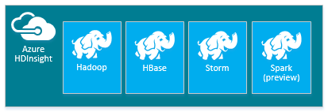
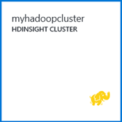
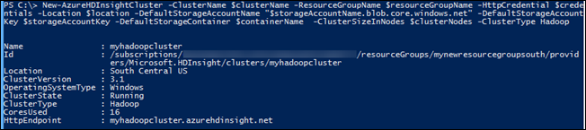

<properties
   pageTitle="Custom-provision Hadoop clusters in HDInsight | Microsoft Azure"
   	description="Learn how to custom-provision clusters for Azure HDInsight by using the Azure Preview Portal, Azure PowerShell, a command line, or a .NET SDK."
   services="hdinsight"
   documentationCenter=""
   tags="azure-portal"
   authors="mumian"
   manager="paulettm"
   editor="cgronlun"/>

<tags
   ms.service="hdinsight"
   ms.devlang="na"
   ms.topic="article"
   ms.tgt_pltfrm="na"
   ms.workload="big-data"
   ms.date="09/29/2015"
   ms.author="jgao"/>

# Provision Hadoop clusters in HDInsight

Learn how to plan for provision HDInsight clusters.

[AZURE.INCLUDE [selector](../../includes/hdinsight-portal-management-selector.md)]

* [Provision Hadoop clusters in HDInsight](hdinsight-provision-clusters-v1.md)

[AZURE.INCLUDE [hdinsight-azure-preview-portal](../../includes/hdinsight-azure-preview-portal.md)]

* [Provision Hadoop clusters in HDInsight](hdinsight-provision-clusters-v1.md)

**Prerequisites:**

Before you begin the instructions in this article, you must have the following:

- An Azure subscription. See [Get Azure free trial](http://azure.microsoft.com/documentation/videos/get-azure-free-trial-for-testing-hadoop-in-hdinsight/).

## Basic configuration options

- **Cluster name**

	Cluster name is used to identify a cluster. Cluster name must follow the following guidelines:

	- The field must be a string that contains between 3 and 63 characters
	- The field can contain only letters, numbers, and hyphens.

- **Subscription name**

	An HDInsight cluster is tied to one Azure subscription.

- **Resource group name**

	Applications are typically made up of many components, for example a web app, database, database server, storage, and 3rd party services. Azure Resource Manager (ARM) enables you to work with the resources in your application as a group, referred to as an Azure Resource Group. You can deploy, update, monitor or delete all of the resources for your application in a single, coordinated operation. You use a template for deployment and that template can work for different environments such as testing, staging and production. You can clarify billing for your organization by viewing the rolled-up costs for the entire group. For more information, see [Azure Resource Manager Overview](resource-group-overview.md).	
- **Operating system**

	You can provision HDInsight clusters on one of the following two operating systems:
	- **HDInsight on Windows (Windows Server 2012 R2 Datacenter)**:
	- **HDInsight on Linux (Ubuntu 12.04 LTS for Linux) (Preview)**: HDInsight provides the option of configuring Linux clusters on Azure. Configure a Linux cluster if you are familiar with Linux or Unix, migrating from an existing Linux-based Hadoop solution, or want easy integration with Hadoop ecosystem components built for Linux. For more information, see [Get started with Hadoop on Linux in HDInsight](hdinsight-hadoop-linux-get-started.md).

- **HDInsight version**

	It is used to determine the version of HDInsight to use for this cluster. For more information, see [Hadoop cluster versions and components in HDInsight](https://go.microsoft.com/fwLink/?LinkID=320896&clcid=0x409)

- **Cluster type** and **cluster size (a.k.a. data nodes)**

	HDInsight allows customers to deploy a variety of cluster types, for different data analytics workloads. Cluster types offered today are:

	- Hadoop clusters: for query and analysis workloads
	- HBase clusters:  for NoSQL workloads
	- Storm clusters: for real time event processing workloads
	- Spark clusters (preview): for in-memory processing, interactive queries, stream, and machines learning workloads.

	

	> [AZURE.NOTE] *Azure HDInsight cluster* is also called *Hadoop clusters in HDInsight*, or *HDInsight cluster*. Sometimes, it is used interchangeably with *Hadoop cluster*. They all refer to the Hadoop clusters hosted in the Microsoft Azure environment.

	Within a given cluster type, there are different roles for the various nodes, which allow a customer to size those nodes in a given role appropriate to the details of their workload. For example, a Hadoop cluster can have its worker nodes provisioned with a large amount of memory if the type of analytics being performed are memory intensive.

	

	Hadoop clusters for HDInsight are deployed with two roles:

	- Head node (2 nodes)
	- Data node (at least 1 node)

	

	HBase clusters for HDInsight are deployed with three roles:
	- Head servers (2 nodes)
	- Region servers (at least 1 node)
	- Master/Zookeeper nodes (3 nodes)

	

	Storm clusters for HDInsight are deployed with three roles:
	- Nimbus nodes (2 nodes)
	- Supervisor servers (at least 1 node)
	- Zookeeper nodes (3 nodes)

	

	Spark clusters for HDInsight are deployed with three roles:
	- Head node (2 nodes)
	- Worker node (at least 1 node)
	- Zookeeper nodes (3 nodes) (Free for A1 Zookeepers)

	Customers are billed for the usage of those nodes for the duration of the cluster’s life. Billing starts once a cluster is created and stops when the cluster is deleted (clusters can’t be de-allocated or put on hold). The cluster size affects the cluster price. For learning purposes, it is recommended to use 1 data node. For more information about HDInsight pricing, see [HDInsight pricing](https://go.microsoft.com/fwLink/?LinkID=282635&clcid=0x409).

	>[AZURE.NOTE] The cluster size limit varies among Azure subscriptions. Contact billing support to increase the limit.

- **Region/virtual network (a.k.a. location)**

	

	For a list of supported regions, click the **Region** drop-down list on [HDInsight pricing](https://go.microsoft.com/fwLink/?LinkID=282635&clcid=0x409).

- **Node size**

	

	Select the VM size for the nodes. For more information, see [Sizes for Cloud Services](cloud-services-sizes-specs.md)

	Based on the choice of VMs, your cost might vary. HDInsight uses all standard-tier VMs for cluster nodes. For information on how VM sizes affect your prices, see <a href="http://azure.microsoft.com/pricing/details/hdinsight/" target="_blank">HDInsight Pricing</a>.

- **HDInsight users**

	The HDInsight clusters allow you to configure two user accounts during provisioning:

	- HTTP user. The default user name is admin using the basic configuration on the Azure preview portal.
	- RDP user (Windows clusters): It is used to connect to the cluster using RDP. When you create the account, you must set an expiration date that is within 90 days from today.
	- SSH User (Linux clusters): Is used to connect to the cluster using SSH. You can create additional SSH user accounts after the cluster is created by following the steps in [Use SSH with Linux-based Hadoop on HDInsight from Linux, Unix, or OS X](hdinsight-hadoop-linux-use-ssh-unix.md).

- **Azure storage account**

	The original HDFS uses of many local disks on the cluster. HDInsight uses Azure Blob storage instead for data storage. Azure Blob storage is a robust, general-purpose storage solution that integrates seamlessly with HDInsight. Through a Hadoop distributed file system (HDFS) interface, the full set of components in HDInsight can operate directly on structured or unstructured data in Blob storage. Storing data in Blob storage enables you to safely delete the HDInsight clusters that are used for computation without losing user data.

	During configuration, you must specify an Azure storage account and an Azure Blob storage container on the Azure storage account. Some provision process requires the Azure storage account and the Blob storage container created beforehand.  The Blob storage container is used as the default storage location by the cluster. Optionally, you can specify additional Azure Storage accounts (linked storage) that will be accessible by the cluster. In addition, the cluster can also access any Blob containers that are configured with full public read access or pulic read access for blobs only.  For more information on the restrict access, see [Manage Access to Azure Storage Resources](storage-manage-access-to-resources.md).

	

	>[AZURE.NOTE] A Blob storage container provides a grouping of a set of blobs as shown in the image:

	

	>[AZURE.WARNING] Don't share one Blob storage container for multiple clusters. This is not supported.

	For more information on using secondary Blob stores, see [Using Azure Blob Storage with HDInsight](hdinsight-use-blob-storage.md).

- **Hive/Oozie metastore**

	The metastore contains Hive and Oozie metadata, such as Hive tables, partitions, schemas, and columns. Using the metastore helps you to retain your Hive and Oozie metadata, so that you don't need to re-create Hive tables or Oozie jobs when you provision a new cluster. By default, Hive uses an embedded Azure SQL database to store this information. The embedded database can't preserve the metadata when the cluster is deleted. For example, you have a cluster provisioned with a Hive metastore. You created some Hive tables. After you delete the cluster, and recreat the cluster using the same Hive metastore, you will be able to see the Hive tables you created in the original cluster.

## Advanced configuration options

>[AZURE.NOTE] This section currently only apply to Windows base HDInsight clusters.

### Customize clusters using HDInsight cluster customization

Sometimes, you want to configure the configuration files.  Here are some of them.

- core-site.xml
- hdfs-site.xml
- mapred-site.xml
- yarn-site.xml
- hive-site.xml
- oozie-site.xml

The clusters can't retain the changes due to re-image.  For more information, see [Role Instance Restarts Due to OS Upgrades](http://blogs.msdn.com/b/kwill/archive/2012/09/19/role-instance-restarts-due-to-os-upgrades.aspx). To keep the changes through the clusters' lifetime, you can use HDInsight cluster customization during the provision process.

The following is an Azure PowerShell script example of customizing a Hive configuration:

	# hive-site.xml configuration
	$hiveConfigValues = new-object 'Microsoft.WindowsAzure.Management.HDInsight.Cmdlet.DataObjects.AzureHDInsightHiveConfiguration'
	$hiveConfigValues.Configuration = @{ "hive.metastore.client.socket.timeout"="90" } #default 60

	$config = New-AzureHDInsightClusterConfig `
	            -ClusterSizeInNodes $clusterSizeInNodes `
	            -ClusterType $clusterType `
	          | Set-AzureHDInsightDefaultStorage `
	            -StorageAccountName $defaultStorageAccount `
	            -StorageAccountKey $defaultStorageAccountKey `
	            -StorageContainerName $defaultBlobContainer `
	          | Add-AzureHDInsightConfigValues `
	            -Hive $hiveConfigValues

	New-AzureHDInsightCluster -Name $clusterName -Location $location -Credential $credential -OSType Windows -Config $config

Some more samples on customizing other configuration files:

	# hdfs-site.xml configuration
	$HdfsConfigValues = @{ "dfs.blocksize"="64m" } #default is 128MB in HDI 3.0 and 256MB in HDI 2.1

	# core-site.xml configuration
	$CoreConfigValues = @{ "ipc.client.connect.max.retries"="60" } #default 50

	# mapred-site.xml configuration
	$MapRedConfigValues = new-object 'Microsoft.WindowsAzure.Management.HDInsight.Cmdlet.DataObjects.AzureHDInsightMapReduceConfiguration'
	$MapRedConfigValues.Configuration = @{ "mapreduce.task.timeout"="1200000" } #default 600000

	# oozie-site.xml configuration
	$OozieConfigValues = new-object 'Microsoft.WindowsAzure.Management.HDInsight.Cmdlet.DataObjects.AzureHDInsightOozieConfiguration'
	$OozieConfigValues.Configuration = @{ "oozie.service.coord.normal.default.timeout"="150" }  # default 120

For more information, see Azim Uddin's blog titled [Customizing HDInsight Cluster provisioning](http://blogs.msdn.com/b/bigdatasupport/archive/2014/04/15/customizing-hdinsight-cluster-provisioning-via-powershell-and-net-sdk.aspx).

### Customize clusters using Script action

You can install additional components or customize cluster configuration by using scripts during provisioning. Such scripts are invoked via **Script Action**, which is a configuration option that can be used from the preview portal, HDInsight Windows PowerShell cmdlets, or the HDInsight .NET SDK. For more information, see [Customize HDInsight cluster using Script Action](hdinsight-hadoop-customize-cluster.md).

### Use Azure virtual networks

[Azure Virtual Network](http://azure.microsoft.com/documentation/services/virtual-network/) allows you to create a secure, persistent network containing the resources you need for your solution. A virtual network allows you to:

* Connect cloud resources together in a private network (cloud-only).

	

* Connect your cloud resources to your local data-center network (site-to-site or point-to-site) by using a virtual private network (VPN).

	Site-to-site configuration allows you to connect multiple resources from your data center to the Azure virtual network by using a hardware VPN or the Routing and Remote Access Service.

	

	Point-to-site configuration allows you to connect a specific resource to the Azure virtual network by using a software VPN.

	

For more information on Virtual Network features, benefits, and capabilities, see the [Azure Virtual Network overview](../virtual-network/virtual-networks-overview.md).

> [AZURE.NOTE] You must create the Azure virtual network before provisioning an HDInsight cluster. For more information, see [Provision a Hadoop cluster into a virtual network](hdinsight-hbase-provision-vnet.md#provision-an-hbase-cluster-into-a-virtual-network).
>
> Azure HDInsight only supports location-based Virtual Networks, and does not currently work with Affinity Group-based Virtual Networks. Use Azure PowerShell cmdlet Get-AzureVNetConfig to check whether an existing Azure virtual network is location-based. If your virtual network is not location-based, you have the following options:
>
> - Export the existing Virtual Network configuration and then create a new Virtual Network. All new Virtual Networks are location based  by default.
> - Migrate to a location-based Virtual Network.  See [Migrate existing services to regional scope](http://azure.microsoft.com/blog/2014/11/26/migrating-existing-services-to-regional-scope/).
>
> It is highly recommended to designate a single subnet for one cluster.

## Provision using the preview portal

You can refer to the [basic configuration options], and the [advanced configuration options] for the explanations of the fields.

**To create an HDInsight cluster**

1. Sign in to the [Azure preview portal][azure-preview-portal].
2. Click **NEW**, Click **Data Analytics**, and then click **HDInsight**.

    

3. Type or select the following values:

  * **Cluster Name**: Enter a name for the cluster. A green check will appear beside the cluster name if the name is available.
  * **Cluster Type**: Select **Hadoop**.
  * **Cluster Operating System**: Select **Windows Server 2012 R2 Datacenter**.
  * **Subscription**: Select the Azure subscription that will be used for provision this cluster.
  * **Resource Group**: Select an existing or create a new resource group. This entry will default to one of your existing resource groups, if any are available.
  * **Credentials**: Configure the username and the password for the Hadoop user (HTTP user). If you enable remote desktop for the cluster, you will need to configure the remote desktop user username and password, and an account expiration date. Click **Select** at the bottom to save the changes.

	   	

  * **Data Source**: Create a new or select an existing Azure Storage account to be used as the default file system for the cluster.

   		

  		* **Selection Method**: Set this to **From all subscriptions** to enable browsing of storage accounts from all your subscriptions. Set this to **Access Key** if you want to enter the **Storage Name** and **Access Key** of an existing storage account.
  		* **Select storage account / Create New**: Click **Select storage account** to browse and select an existing storage account you want to associate with the cluster. Or, click **Create New** to create a new storage account. Use the field that appears to enter the name of the storage account. A green check will appear if the name is available.
  		* **Choose Default Container**: Use this to enter the name of the default container to use for the cluster. While you can enter any name here, we recommend using the same name as the cluster so that you can easily recognize that the container is used for this specific cluster.
  		* **Location**: The geographic region that the storage account is in, or will be created in. This location will determine the cluster location.  The cluster and its default storage account must co-locate in the same Azure data center.
  	
  * **Node Pricing Tiers**: Set the number of worker nodes that you need for the cluster. The estimated cost of the cluster will be shown within the blade.
  

		

  * **Optional Configuration** to select the cluster version, as well as configure other optional settings such as joining a **Virtual Network**, setting up an **External Metastore** to hold data for Hive and Oozie, use Script Actions to customize a cluster to install custom components, or use additional storage accounts with the cluster.

  		* **HDInsight Version**: Select the version you want to use for the cluster. For more information, see [HDInsight cluster versions](hdinsight-component-versioning.md).
  		* **Virtual Network**: Select an Azure virtual network and the subnet if you want to place the cluster into a virtual network.  

			

			>[AZURE.NOTE] Windows based HDInsight cluster can only be placed into a classical virtual network.
  

  		
		* **External Metastores**: Specify an Azure SQL database to store Hive and Oozie metadata associated with the cluster.
 

			

			For **Use an existing SQL DB for Hive** metadata, click **Yes**, select a SQL database, and then provide the username/password for the database. Repeat these steps if you want to **Use an existing SQL DB for Oozie metadata**. Click **Select** till you are back on the **Optional Configuration** blade.

			>[AZURE.NOTE] The Azure SQL database used for the metastore must allow connectivity to other Azure services, including Azure HDInsight. On the Azure SQL database dashboard, on the right side, click the server name. This is the server on which the SQL database instance is running. Once you are on the server view, click **Configure**, and then for **Azure Services**, click **Yes**, and then click **Save**.
		
  		* **Script Actions** if you want to use a custom script to customize a cluster, as the cluster is being created. For more information about script actions, see [Customize HDInsight clusters using Script Action](hdinsight-hadoop-customize-cluster.md). On the Script Actions blade provide the details as shown in the screen capture.
  	

			

    	* **Azure Storage Keys**: Specify additional storage accounts to associate with the cluster. In the **Azure Storage Keys** blade, click **Add a storage key**, and then select an existing storage account or create a new account.
    

			

4. Click **Create**. Selecting **Pin to Startboard** will add a tile for cluster to the Startboard of your preview portal. The icon will indicate that the cluster is provisioning, and will change to display the HDInsight icon once provisioning has completed.

	| While provisioning | Provisioning complete |
	| ------------------ | --------------------- |
	|  |  |

	
	> [AZURE.NOTE] It will take some time for the cluster to be created, usually around 15 minutes. Use the tile on the Startboard, or the **Notifications** entry on the left of the page to check on the provisioning process.
	

5. Once the provisioning completes, click the tile for the cluster from the Startboard to launch the cluster blade. The cluster blade provides essential information about the cluster such as the name, the resource group it belongs to, the location, the operating system, URL for the cluster dashboard, etc.

	

	Use the following to understand the icons at the top of this blade, and in the **Essentials** section:

	* **Settings** and **All Settings**: Displays the **Settings** blade for the cluster, which allows you to access detailed configuration information for the cluster.
	* **Dashboard**, **Cluster Dashboard**, and **URL**: These are all ways to access the cluster dashboard, which is a Web portal to run jobs on the cluster.
	* **Remote Desktop**: Enables you to enable/disable remote desktop on the cluster nodes.
	* **Scale Cluster**: Allows you to change the number of worker nodes for this cluster.
	* **Delete**: Deletes the HDInsight cluster.
	* **Quickstart** (): Displays information that will help you get started using HDInsight.
	* **Users** (): Allows you to set permissions for _portal management_ of this cluster for other users on your Azure subscription.
	

		> [AZURE.IMPORTANT] This _only_ affects access and permissions to this cluster in the preview portal, and has no effect on who can connect to or submit jobs to the HDInsight cluster.
		
	* **Tags** (): Tags allows you to set key/value pairs to define a custom taxonomy of your cloud services. For example, you may create a key named __project__, and then use a common value for all services associated with a specific project.

## Provision using Azure Resource Manager template

Azure Resource Manager (ARM) template makes it easier to deploy and redeploy cluster. The following procedure creates a Hadoop cluster on the Linux operating system in the North Europe data center with 4 worker nodes.

**To deploy a cluster using ARM template**

1. Save the json file in the Appendix A to your workstation.
2. Make the parameters if needed.
3. Run the template using the following PowerShell script:

		$resourceGroupName = "<ResourceGroupName>"
		$Location = "<ResourceGroupLocation>"
		
		$armDeploymentName = "<ARMDeploymentName>"
		$clusterName = "<ClusterName>"
		$clusterStorageAccountName = "<DefaultStorageAccountName>"
		
		# Connect to Azure
		Switch-AzureMode -Name AzureResourceManager
		Add-AzureAccount
		
		# Create a resource group
		New-AzureResourceGroup -Name $resourceGroupName -Location $Location
		
		# Provision cluster and the dependent storage accounge
		$parameters = @{clusterName="$clusterName";clusterStorageAccountName="$clusterStorageAccountName"}
		
		New-AzureResourceGroupDeployment `
		    -Name $armDeploymentName `
		    -ResourceGroupName $resourceGroupName `
		    -TemplateFile E:\Tutorials\HDIARMTemplates\ARMTemplate-create-hadoop-cluster-with-storage.json `
		    -TemplateParameterObject $parameters
		
		# List cluster
		Get-AzureHDInsightCluster -ResourceGroupName $resourceGroupName -ClusterName $clusterName

For deploying an ARM template using other methods, see [Deploy an application with Azure Resource Manager template](resource-group-template-deploy.md).

## Provision using Azure PowerShell
Azure PowerShell is a powerful scripting environment that you can use to control and automate the deployment and management of your workloads in Azure. This section provides instructions on how to provision an HDInsight cluster by using Azure PowerShell. For information on configuring a workstation to run HDInsight Windows PowerShell cmdlets, see [Install and configure Azure PowerShell](../install-configure-powershell.md). For more information on using Azure PowerShell with HDInsight, see [Administer HDInsight using PowerShell](hdinsight-administer-use-powershell.md). For the list of the HDInsight Windows PowerShell cmdlets, see [HDInsight cmdlet reference](https://msdn.microsoft.com/library/azure/dn858087.aspx).

The following procedures are needed to provision an HDInsight cluster by using Azure PowerShell:

- Create an Azure resource group
- Create an Azure Storage account
- Create an Azure Blob container
- Create an HDInsight cluster

		# Sign in
		Add-AzureAccount

		###########################################
		# Create required items, if none exist
		###########################################

		# Select the subscription to use
		$subscriptionName = "<SubscriptionName>"        # Provide your Subscription Name
		Select-AzureSubscription -SubscriptionName $subscriptionName

		# Create an Azure Resource Group
		$resourceGroupName = "<ResourceGroupName>"      # Provide a Resource Group name
		$location = "<Location>"                        # For example, "West US"
		New-AzureResourceGroup -Name $resourceGroupName -Location $location

		# Create an Azure Storage account
		$storageAccountName = "<StorageAcccountName>"   # Provide a Storage account name
		New-AzureStorageAccount -ResourceGroupName $resourceGroupName -StorageAccountName $storageAccountName -Location $location -Type Standard_GRS

		# Create an Azure Blob Storage container
		$containerName = "<ContainerName>"              # Provide a container name
		$storageAccountKey = Get-AzureStorageAccountKey -ResourceGroupName $resourceGroupName -Name $storageAccountName | %{ $_.Key1 }
		$destContext = New-AzureStorageContext -StorageAccountName $storageAccountName -StorageAccountKey $storageAccountKey
		New-AzureStorageContainer -Name $containerName -Context $destContext

		###########################################
		# Create an HDInsight Cluster
		###########################################

		# Skip these variables if you just created them
		$resourceGroupName = "<ResourceGroupName>"      # Provide the Resource Group name
		$storageAccountName = "<StorageAcccountName>"   # Provide the Storage account name
		$containerName = "<ContainerName>"              # Provide the container name
		$storageAccountKey = Get-AzureStorageAccountKey -Name $storageAccountName -ResourceGroupName $resourceGroupName | %{ $_.Key1 }

		# Set these variables
		$clusterName = $containerName           		# As a best practice, have the same name for the cluster and container
		$clusterNodes = <ClusterSizeInNodes>    		# The number of nodes in the HDInsight cluster
		$credentials = Get-Credential

		# The location of the HDInsight cluster. It must be in the same data center as the Storage account.
		$location = Get-AzureStorageAccount -ResourceGroupName $resourceGroupName -StorageAccountName $storageAccountName | %{$_.Location}

		# Create a new HDInsight cluster
		New-AzureHDInsightCluster -ResourceGroupName $resourceGroupName `
									-ClusterName $clusterName `
									-Location $location `
									-ClusterSizeInNodes $clusterNodes `
									-ClusterType Hadoop `
									-OSType Windows `
									-HttpCredential $credentials `
									-DefaultStorageAccountName "$storageAccountName.blob.core.windows.net" `
									-DefaultStorageAccountKey $storageAccountKey `
									-DefaultStorageContainer $containerName  

	

## Provision using the HDInsight .NET SDK
The HDInsight .NET SDK provides .NET client libraries that make it easier to work with HDInsight from a .NET Framework application. Follow the instructions below to create a Visual Studio console application and paste the code for creating a cluster.

**To create a Visual Studio console application**

1. Open Visual Studio 2013.

2. From the **File** menu, click **New**, and then click **Project**.

3. From **New Project**, type or select the following values:

	<table style="border-color: #c6c6c6; border-width: 2px; border-style: solid; border-collapse: collapse;">
	<tr>
	<th style="border-color: #c6c6c6; border-width: 2px; border-style: solid; border-collapse: collapse; width:90px; padding-left:5px; padding-right:5px;">Property</th>
	<th style="border-color: #c6c6c6; border-width: 2px; border-style: solid; border-collapse: collapse; width:90px; padding-left:5px; padding-right:5px;">Value</th></tr>
	<tr>
	<td style="border-color: #c6c6c6; border-width: 2px; border-style: solid; border-collapse: collapse; padding-left:5px;">Category</td>
	<td style="border-color: #c6c6c6; border-width: 2px; border-style: solid; border-collapse: collapse; padding-left:5px; padding-right:5px;">Templates/Visual C#/Windows</td></tr>
	<tr>
	<td style="border-color: #c6c6c6; border-width: 2px; border-style: solid; border-collapse: collapse; padding-left:5px;">Template</td>
	<td style="border-color: #c6c6c6; border-width: 2px; border-style: solid; border-collapse: collapse; padding-left:5px;">Console Application</td></tr>
	<tr>
	<td style="border-color: #c6c6c6; border-width: 2px; border-style: solid; border-collapse: collapse; padding-left:5px;">Name</td>
	<td style="border-color: #c6c6c6; border-width: 2px; border-style: solid; border-collapse: collapse; padding-left:5px;">CreateHDICluster</td></tr>
	</table>

4. Click **OK** to create the project.

5. From the **Tools** menu, click **Nuget Package Manager**, and then click **Manage Nuget Packages for Solutions**. In the Search text box within the dialog box, search for **HDInsight**. From the results that show up, install the following:

	 * Microsoft.Azure.Management.HDInsight
	 * Microsoft.Azure.Management.HDInsight.Job

	Search for Azure Authentication and from the results that show up, install **Microsoft.Azure.Common.Authentication**.

6. From Solution Explorer, double-click **Program.cs** to open it, paste the following code, and provide values for the variables:

        using System;
		using System.Collections.Generic;
		using System.Diagnostics;
		using System.Linq;
		using System.Security;
		using System.Text;
		using System.Threading.Tasks;
		using Hyak.Common;
		using Microsoft.Azure;
		using Microsoft.Azure.Common.Authentication;
		using Microsoft.Azure.Common.Authentication.Models;
		using Microsoft.Azure.Management.HDInsight;
		using Microsoft.Azure.Management.HDInsight.Job;
		using Microsoft.Azure.Management.HDInsight.Job.Models;
		using Microsoft.Azure.Management.HDInsight.Models;
		using Newtonsoft.Json;

		namespace CreateHDICluster
		{
		    internal class Program
		    {
		        private static ProfileClient _profileClient;
		        private static SubscriptionCloudCredentials _cloudCredentials;
		        private static HDInsightManagementClient _hdiManagementClient;

		        private static Guid SubscriptionId = new Guid("<SubscriptionID>");
		        private const string ResourceGroupName = "<ResourceGroupName>";
		        private const string ExistingStorageName = "<storageaccountname>.blob.core.windows.net";
		        private const string ExistingStorageKey = "<account key>";
		        private const string ExistingContainer = "<container name>";
		        private const string NewClusterName = "<cluster name>";
		        private const int NewClusterNumNodes = <number of nodes>;
		        private const string NewClusterLocation = "<location>";		//should be same as the storage account
		        private const OSType NewClusterOsType = OSType.Windows;
		        private const HDInsightClusterType NewClusterType = HDInsightClusterType.Hadoop;
		        private const string NewClusterVersion = "3.2";
		        private const string NewClusterUsername = "admin";
		        private const string NewClusterPassword = "<password>";

		        private static void Main(string[] args)
		        {
		            System.Console.WriteLine("Start cluster provisioning");

		            _profileClient = GetProfile();
		            _cloudCredentials = GetCloudCredentials();
		            _hdiManagementClient = new HDInsightManagementClient(_cloudCredentials);

		            System.Console.WriteLine(String.Format("Creating the cluster {0}...", NewClusterName));
		            CreateCluster();
		            System.Console.WriteLine("Done. Press any key to continue.");
		            System.Console.ReadKey(true);
		        }

		        private static void CreateCluster()
		        {
		            var parameters = new ClusterCreateParameters
		            {
		                ClusterSizeInNodes = NewClusterNumNodes,
		                UserName = NewClusterUsername,
		                Password = NewClusterPassword,
		                Location = NewClusterLocation,
		                DefaultStorageAccountName = ExistingStorageName,
		                DefaultStorageAccountKey = ExistingStorageKey,
		                DefaultStorageContainer = ExistingContainer,
		                ClusterType = NewClusterType,
		                OSType = NewClusterOsType
		            };

		            _hdiManagementClient.Clusters.Create(ResourceGroupName, NewClusterName, parameters);
		        }

		        private static ProfileClient GetProfile(string username = null, SecureString password = null)
		        {
		            var profileClient = new ProfileClient(new AzureProfile());
		            var env = profileClient.GetEnvironmentOrDefault(EnvironmentName.AzureCloud);
		            var acct = new AzureAccount { Type = AzureAccount.AccountType.User };

		            if (username != null && password != null)
		                acct.Id = username;

		            profileClient.AddAccountAndLoadSubscriptions(acct, env, password);

		            return profileClient;
		        }

		        private static SubscriptionCloudCredentials GetCloudCredentials()
		        {
		            var sub = _profileClient.Profile.Subscriptions.Values.FirstOrDefault(s => s.Id.Equals(SubscriptionId));

		            Debug.Assert(sub != null, "subscription != null");
		            _profileClient.SetSubscriptionAsDefault(sub.Id, sub.Account);

		            return AzureSession.AuthenticationFactory.GetSubscriptionCloudCredentials(_profileClient.Profile.Context);
		        }

		    }
		}

7. Press **F5** to run the application. A console window should open and display the status of the application. You will also be prompted to enter your Azure account credentials. It can take several minutes to create an HDInsight cluster.

## Creating HDInsight cluster using on-premises SQL Server Integration Services

You can also use SQL Server Integration Services (SSIS) to create or delete an HDInsight cluster. The Azure Feature Pack for SSIS provides the following components that work with HDInsight clusters.

- [Azure HDInsight Create Cluster Task][ssisclustercreate]
- [Azure HDInsight Delete Cluster Task][ssisclusterdelete]
- [Azure Subscription Connection Manager][connectionmanager]

Learn more about the Azure Feature Pack for SSIS [here][ssispack].

## Next steps
In this article, you have learned several ways to provision an HDInsight cluster. To learn more, see the following articles:

* [Get started with Azure HDInsight](hdinsight-get-started.md) - Learn how to start working with your HDInsight cluster
* [Use Sqoop with HDInsight](hdinsight-use-sqoop.md) - Learn how to copy data between HDInsight and SQL Database or SQL Server
* [Administer HDInsight using PowerShell](hdinsight-administer-use-powershell.md) - Learn how to work with HDInsight by using Azure PowerShell
* [Submit Hadoop jobs programmatically](hdinsight-submit-hadoop-jobs-programmatically.md) - Learn how to programmatically submit jobs to HDInsight
* [Azure HDInsight SDK documentation] [hdinsight-sdk-documentation] - Discover the HDInsight SDK

##Appendix A - ARM template

The following Azure Resource Manger template creates a Hadoop cluster with the dependent Azure storage account.

	{
	  "$schema": "https://schema.management.azure.com/schemas/2015-01-01/deploymentTemplate.json#",
	  "contentVersion": "1.0.0.0",
	  "parameters": {
	    "location": {
	      "type": "string",
	      "defaultValue": "North Europe",
	      "allowedValues": [
	        "North Europe"
	      ],
	      "metadata": {
	        "description": "The location where all azure resources will be deployed."
	      }
	    },
	    "clusterName": {
	      "type": "string",
	      "metadata": {
	        "description": "The name of the HDInsight cluster to create."
	      }
	    },
	    "clusterLoginUserName": {
	      "type": "string",
	      "defaultValue": "admin",
	      "metadata": {
	        "description": "These credentials can be used to submit jobs to the cluster and to log into cluster dashboards."
	      }
	    },
	    "clusterLoginPassword": {
	      "type": "securestring",
	      "metadata": {
	        "description": "The password for the cluster login."
	      }
	    },
	    "sshUserName": {
	      "type": "string",
	      "defaultValue": "hdiuser",
	      "metadata": {
	        "description": "These credentials can be used to remotely access the cluster and the edge node virtual machine."
	      }
	    },
	    "sshPassword": {
	      "type": "securestring",
	      "metadata": {
	        "description": "The password for the ssh user."
	      }
	    },
	    "clusterStorageAccountName": {
	      "type": "string",
	      "metadata": {
	        "description": "The name of the storage account to be created and be used as the cluster's storage."
	      }
	    },
	    "clusterStorageType": {
	      "type": "string",
	      "defaultValue": "Standard_LRS",
	      "allowedValues": [
	        "Standard_LRS",
	        "Standard_GRS",
	        "Standard_ZRS"
	      ]
	    },
	    "clusterWorkerNodeCount": {
	      "type": "int",
	      "defaultValue": 4,
	      "metadata": {
	        "description": "The number of nodes in the HDInsight cluster."
	      }
	    }
	  },
	  "variables": {},
	  "resources": [
	    {
	      "name": "[parameters('clusterStorageAccountName')]",
	      "type": "Microsoft.Storage/storageAccounts",
	      "location": "[parameters('location')]",
	      "apiVersion": "2015-05-01-preview",
	      "dependsOn": [],
	      "tags": {},
	      "properties": {
	        "accountType": "[parameters('clusterStorageType')]"
	      }
	    },
	    {
	      "name": "[parameters('clusterName')]",
	      "type": "Microsoft.HDInsight/clusters",
	      "location": "[parameters('location')]",
	      "apiVersion": "2015-03-01-preview",
	      "dependsOn": [
	        "[concat('Microsoft.Storage/storageAccounts/',parameters('clusterStorageAccountName'))]"
	      ],
	      "tags": {},
	      "properties": {
	        "clusterVersion": "3.2",
	        "osType": "Linux",
	        "clusterDefinition": {
	          "kind": "hadoop",
	          "configurations": {
	            "gateway": {
	              "restAuthCredential.isEnabled": true,
	              "restAuthCredential.username": "[parameters('clusterLoginUserName')]",
	              "restAuthCredential.password": "[parameters('clusterLoginPassword')]"
	            }
	          }
	        },
	        "storageProfile": {
	          "storageaccounts": [
	            {
	              "name": "[concat(parameters('clusterStorageAccountName'),'.blob.core.windows.net')]",
	              "isDefault": true,
	              "container": "[parameters('clusterName')]",
	              "key": "[listKeys(resourceId('Microsoft.Storage/storageAccounts', parameters('clusterStorageAccountName')), '2015-05-01-preview').key1]"
	            }
	          ]
	        },
	        "computeProfile": {
	          "roles": [
	            {
	              "name": "headnode",
	              "targetInstanceCount": "1",
	              "hardwareProfile": {
	                "vmSize": "Large"
	              },
	              "osProfile": {
	                "linuxOperatingSystemProfile": {
	                  "username": "[parameters('sshUserName')]",
	                  "password": "[parameters('sshPassword')]"
	                }
	              }
	            },
	            {
	              "name": "workernode",
	              "targetInstanceCount": "[parameters('clusterWorkerNodeCount')]",
	              "hardwareProfile": {
	                "vmSize": "Large"
	              },
	              "osProfile": {
	                "linuxOperatingSystemProfile": {
	                  "username": "[parameters('sshUserName')]",
	                  "password": "[parameters('sshPassword')]"
	                }
	              }
	            }
	          ]
	        }
	      }
	    }
	  ],
	  "outputs": {
	    "cluster": {
	      "type": "object",
	      "value": "[reference(resourceId('Microsoft.HDInsight/clusters',parameters('clusterName')))]"
	    }
	  }
	}

[hdinsight-sdk-documentation]: http://msdn.microsoft.com/library/dn479185.aspx
[azure-preview-portal]: https://manage.windowsazure.com
[connectionmanager]: http://msdn.microsoft.com/en-US/library/mt146773(v=sql.120).aspx
[ssispack]: http://msdn.microsoft.com/en-US/library/mt146770(v=sql.120).aspx
[ssisclustercreate]: http://msdn.microsoft.com/en-US/library/mt146774(v=sql.120).aspx
[ssisclusterdelete]: http://msdn.microsoft.com/en-US/library/mt146778(v=sql.120).aspx
