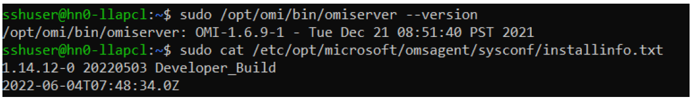
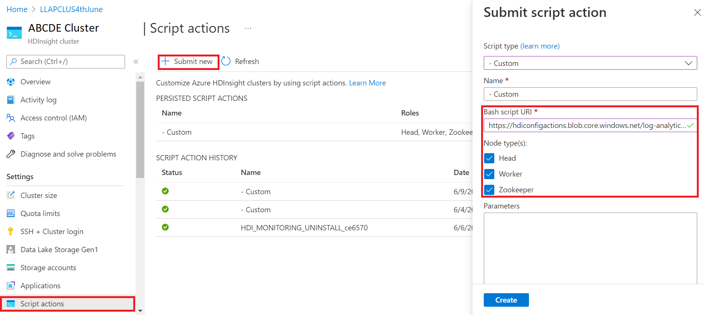
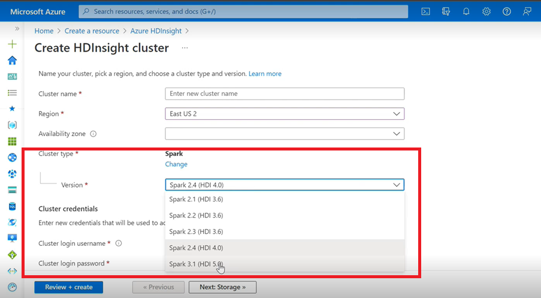
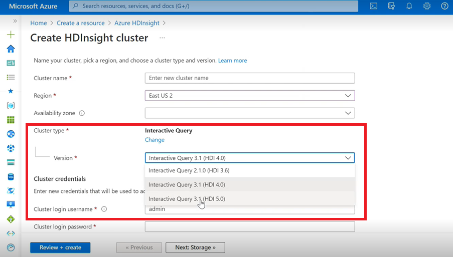

# Archived release notes

## Summary

Azure HDInsight is one of the most popular services among enterprise customers for open-source analytics on Azure.
If you would like to subscribe on release notes, watch releases on [this GitHub repository](https://github.com/Azure/HDInsight/releases).

## Release date: July 25, 2023

This release applies to HDInsight 4.x and 5.x HDInsight release will be available to all regions over several days. This release is applicable for image number **2307201242**. [How to check the image number?](./view-hindsight-cluster-image-version.md)

HDInsight uses safe deployment practices, which involve gradual region deployment. it may take up to 10 business days for a new release or a new version to be available in all regions.

**OS versions**

* HDInsight 4.0: Ubuntu 18.04.5 LTS Linux Kernel 5.4
* HDInsight 5.0: Ubuntu 18.04.5 LTS Linux Kernel 5.4
* HDInsight 5.1: Ubuntu 18.04.5 LTS Linux Kernel 5.4

For workload specific versions, see 

* [HDInsight 5.x component versions](./hdinsight-5x-component-versioning.md)
* [HDInsight 4.x component versions](./hdinsight-40-component-versioning.md)

##  What's new
* HDInsight 5.1 is now supported with ESP cluster.  
* Upgraded version of Ranger 2.3.0 and Oozie 5.2.1 are now part of HDInsight 5.1
* The Spark 3.3.1 (HDInsight 5.1) cluster comes with Hive Warehouse Connector (HWC) 2.1, which works together with the Interactive Query (HDInsight 5.1) cluster.

> [!IMPORTANT]
> This release addresses the following CVEs released by [MSRC](https://msrc.microsoft.com/update-guide/vulnerability) on August 8, 2023. The action is to update to the latest image **2307201242**. Customers are advised to plan accordingly. 

|CVE | Severity| CVE Title|
|-|-|-|
|[CVE-2023-35393](https://msrc.microsoft.com/update-guide/vulnerability/CVE-2023-35393)|	Important|Azure Apache Hive Spoofing Vulnerability|
|[CVE-2023-35394](https://msrc.microsoft.com/update-guide/vulnerability/CVE-2023-35394)|	Important|Azure HDInsight Jupyter Notebook Spoofing Vulnerability|
|[CVE-2023-36877](https://msrc.microsoft.com/update-guide/vulnerability/CVE-2023-36877)|	Important|Azure Apache Oozie Spoofing Vulnerability|
|[CVE-2023-36881](https://msrc.microsoft.com/update-guide/vulnerability/CVE-2023-36881)|	Important|Azure Apache Ambari Spoofing Vulnerability|
|[CVE-2023-38188](https://msrc.microsoft.com/update-guide/vulnerability/CVE-2023-38188)|	Important|Azure Apache Hadoop Spoofing Vulnerability|
 

##  Coming soon

* The max length of cluster name will be changed to 45 from 59 characters, to improve the security posture of clusters. Customers need to plan for the updates before 30, September 2023.
* Cluster permissions for secure storage  
  * Customers can specify (during cluster creation) whether a secure channel should be used for HDInsight cluster nodes to contact the storage account. 
* In-line quota update.
   * Request quotas increase directly from the My Quota page, which will be a direct API call, which is faster. If the API call fails, then customers need to create a new support request for quota increase.
* HDInsight Cluster Creation with Custom VNets.
  * To improve the overall security posture of the HDInsight clusters, HDInsight clusters using custom VNETs need to ensure that the user needs to have permission for `Microsoft Network/virtualNetworks/subnets/join/action` to perform create operations. Customers would need to plan accordingly as this change would be a mandatory check to avoid cluster creation failures before 30, September 2023. 
* Basic and Standard A-series VMs Retirement.
   * On 31 August 2024, we'll retire Basic and Standard A-series VMs. Before that date, you need to migrate your workloads to Av2-series VMs, which provide more memory per vCPU and faster storage on solid-state drives (SSDs). To avoid service disruptions, [migrate your workloads](https://aka.ms/Av1retirement) from Basic and Standard A-series VMs to Av2-series VMs before 31, August 2024.
* Non-ESP ABFS clusters [Cluster Permissions for Word Readable] 
  * Plan to introduce a change in non-ESP ABFS clusters, which restricts non-Hadoop group users from executing Hadoop commands for storage operations. This change to improve cluster security posture. Customers need to plan for the updates before 30 September 2023. 

If you have any more questions, contact [Azure Support](https://ms.portal.azure.com/#view/Microsoft_Azure_Support/HelpAndSupportBlade/~/overview).

You can always ask us about HDInsight on [Azure HDInsight - Microsoft Q&A](/answers/tags/168/azure-hdinsight)

You’re welcome to add more proposals and ideas and other topics here and vote for them - [HDInsight Community (azure.com)](https://feedback.azure.com/d365community/search/?q=HDInsight) and follow us for more  updates on [twitter](https://twitter.com/AzureHDInsight)

 > [!NOTE]
 > We advise customers to use to latest versions of HDInsight [Images](./view-hindsight-cluster-image-version.md) as they bring in the best of open source updates,  Azure updates and security fixes. For more information, see [Best practices](./hdinsight-overview-before-you-start.md).

## Release date: May 08, 2023

This release applies to HDInsight 4.x and 5.x HDInsight release is available to all regions over several days. This release is applicable for image number **2304280205**. [How to check the image number?](./view-hindsight-cluster-image-version.md)

HDInsight uses safe deployment practices, which involve gradual region deployment. it may take up to 10 business days for a new release or a new version to be available in all regions.

**OS versions**

* HDInsight 4.0: Ubuntu 18.04.5 LTS Linux Kernel 5.4
* HDInsight 5.0: Ubuntu 18.04.5 LTS Linux Kernel 5.4

For workload specific versions, see 

* [HDInsight 5.x component versions](./hdinsight-5x-component-versioning.md)
* [HDInsight 4.x component versions](./hdinsight-40-component-versioning.md)


1. Azure HDInsight 5.1 updated with

    1. Apache HBase 2.4.11
    1. Apache Phoenix 5.1.2
    1. Apache Hive 3.1.2
    1. Apache Spark 3.3.1
    1. Apache Tez 0.9.1
    1. Apache Zeppelin 0.10.1
    1. Apache Livy 0.5
    1. Apache Kafka 3.2.0

    > [!NOTE]
    > * All components are integrated with Hadoop 3.3.4 & ZK 3.6.3
    > * All above upgraded components are now available in non-ESP clusters for public preview.


1. **Enhanced Autoscale for HDInsight**

   Azure HDInsight has made notable improvements stability and latency on Autoscale, The essential changes include improved feedback loop for scaling decisions, significant improvement on latency for scaling and support for recommissioning the decommissioned nodes, Learn [more](https://techcommunity.microsoft.com/t5/analytics-on-azure-blog/enhanced-autoscale-capabilities-in-hdinsight-clusters/ba-p/3811271) about the enhancements, how to custom configure and migrate your cluster to enhanced autoscale. The enhanced Autoscale capability is available effective 17 May 2023 across all supported regions.
    
1. **Azure HDInsight ESP for Apache Kafka 2.4.1 is now Generally Available**.

   Azure HDInsight ESP for Apache Kafka 2.4.1 has been in public preview since April 2022. After notable improvements in CVE fixes and stability, Azure HDInsight ESP Kafka 2.4.1 now becomes generally available and ready for production workloads, learn the detail about the [how to configure](./domain-joined/apache-domain-joined-run-kafka.md) and [migrate](./kafka/migrate-versions.md).

1. **Quota Management for HDInsight**

    HDInsight currently allocates quota to customer subscriptions at a regional level. The cores allocated to customers are generic and not classified at a VM family level (For example, `Dv2`, `Ev3`, `Eav4`, etc.).
    
    HDInsight introduced an improved view, which provides a detail and classification of quotas for family-level VMs, this feature allows customers to view current and remaining quotas for a region at the VM family level. With the enhanced view, customers have richer visibility, for planning quotas, and a better user experience. This feature is currently available on HDInsight 4.x and 5.x for East US EUAP region. Other regions to follow later.

    For more information, see [Cluster capacity planning in Azure HDInsight | Microsoft Learn](./hdinsight-capacity-planning.md#view-quota-management-for-hdinsight)
    
 

* Poland Central

## Coming soon

* The max length of cluster name changes to 45 from 59 characters, to improve the security posture of clusters.
* Cluster permissions for secure storage  
  * Customers can specify (during cluster creation) whether a secure channel should be used for HDInsight cluster nodes to contact the storage account. 
* In-line quota update.
   * Request quotas increase directly from the My Quota page, which is a direct API call, which is faster. If the API call fails, then customers need to create a new support request for quota increase.
* HDInsight Cluster Creation with Custom VNets.
  * To improve the overall security posture of the HDInsight clusters, HDInsight clusters using custom VNETs need to ensure that the user needs to have permission for `Microsoft Network/virtualNetworks/subnets/join/action` to perform create operations. Customers would need to plan accordingly as this would be a mandatory check to avoid cluster creation failures.
* Basic and Standard A-series VMs Retirement.
   * On 31 August 2024, we'll retire Basic and Standard A-series VMs. Before that date, you need to migrate your workloads to Av2-series VMs, which provide more memory per vCPU and faster storage on solid-state drives (SSDs). To avoid service disruptions, [migrate your workloads](https://aka.ms/Av1retirement) from Basic and Standard A-series VMs to Av2-series VMs before 31 August 2024.
* Non-ESP ABFS clusters [Cluster Permissions for World Readable] 
  * Plan to introduce a change in non-ESP ABFS clusters, which restricts non-Hadoop group users from executing Hadoop commands for storage operations. This change to improve cluster security posture. Customers need to plan for the updates.

## Release date: February 28, 2023

This release applies to HDInsight 4.0. and 5.0, 5.1. HDInsight release is available to all regions over several days. This release is applicable for image number **2302250400**. [How to check the image number?](./view-hindsight-cluster-image-version.md)

HDInsight uses safe deployment practices, which involve gradual region deployment. it may take up to 10 business days for a new release or a new version to be available in all regions.

**OS versions**

* HDInsight 4.0: Ubuntu 18.04.5 LTS Linux Kernel 5.4
* HDInsight 5.0: Ubuntu 18.04.5 LTS Linux Kernel 5.4

For workload specific versions, see 

* [HDInsight 5.x component versions](./hdinsight-5x-component-versioning.md)
* [HDInsight 4.x component versions](./hdinsight-40-component-versioning.md)

> [!IMPORTANT] 
> Microsoft has issued [CVE-2023-23408](https://msrc.microsoft.com/update-guide/vulnerability/CVE-2023-23408), which is fixed on the current release and customers are advised to upgrade their clusters to latest image. 

 

**HDInsight 5.1**

We have started rolling out a new version of HDInsight 5.1. All new open-source releases added as incremental releases on HDInsight 5.1.

For more information, see [HDInsight 5.1.0 version](./hdinsight-51-component-versioning.md)


**Kafka 3.2.0 Upgrade (Preview)** 

* Kafka 3.2.0 includes several significant new features/improvements.
	* Upgraded Zookeeper to 3.6.3
	* Kafka Streams support
	* Stronger delivery guarantees for the Kafka producer enabled by default.
	* `log4j` 1.x replaced with `reload4j`.
	* Send a hint to the partition leader to recover the partition.
	* `JoinGroupRequest` and `LeaveGroupRequest` have a reason attached.
	* Added Broker count metrics8. 
	* Mirror `Maker2` improvements.

**HBase 2.4.11 Upgrade (Preview)**
* This version has new features such as the addition of new caching mechanism types for block cache, the ability to alter `hbase:meta table` and view the `hbase:meta` table from the HBase WEB UI. 

**Phoenix 5.1.2 Upgrade (Preview)**
 * Phoenix version upgraded to 5.1.2 in this release. This upgrade includes the Phoenix Query Server. The Phoenix Query Server proxies the standard Phoenix JDBC driver and provides a backwards-compatible wire protocol to invoke that JDBC driver.
 
**Ambari CVEs**
  * Multiple Ambari CVEs are fixed.

> [!NOTE]
> ESP isn't supported for Kafka and HBase in this release.
>


End of support for Azure HDInsight clusters on Spark 2.4 February 10, 2024. For more information, see [Spark versions supported in Azure HDInsight](./hdinsight-40-component-versioning.md#spark-versions-supported-in-azure-hdinsight)

## What's next

* Autoscale
  * Autoscale with improved latency and several improvements 
* Cluster name change limitation 
  * The max length of cluster name changes to 45 from 59 in Public, Azure China, and Azure Government. 
* Cluster permissions for secure storage  
  * Customers can specify (during cluster creation) whether a secure channel should be used for HDInsight cluster nodes to contact the storage account. 
* Non-ESP ABFS clusters [Cluster Permissions for World Readable] 
  * Plan to introduce a change in non-ESP ABFS clusters, which restricts non-Hadoop group users from executing Hadoop commands for storage operations. This change to improve cluster security posture. Customers need to plan for the updates.
* Open-source upgrades
  * Apache Spark 3.3.0 and Hadoop 3.3.4 are under development on HDInsight 5.1 and includes several significant new features, performance and other improvements.

 > [!NOTE]
 > We advise customers to use to latest versions of HDInsight [Images](./view-hindsight-cluster-image-version.md) as they bring in the best of open source updates,  Azure updates and security fixes. For more information, see [Best practices](./hdinsight-overview-before-you-start.md).


## Release date: December 12, 2022

This release applies to HDInsight 4.0. and 5.0 HDInsight release is made available to all regions over several days.

HDInsight uses safe deployment practices, which involve gradual region deployment. It may take up to 10 business days for a new release or a new version to be available in all regions.

**OS versions**

* HDInsight 4.0: Ubuntu 18.04.5 LTS Linux Kernel 5.4
* HDInsight 5.0: Ubuntu 18.04.5 LTS Linux Kernel 5.4

For workload specific versions, see [here.](./hdinsight-40-component-versioning.md) 

 

* **Log Analytics** - Customers can enable classic monitoring to get the latest OMS version 14.19. To remove old versions, disable and enable classic monitoring.
* **Ambari** user auto UI sign out due to inactivity. For more information, see [here](./ambari-web-ui-auto-logout.md)
* **Spark** - A new and optimized version of Spark 3.1.3 is included in this release. We tested Apache Spark 3.1.2(previous version) and Apache Spark 3.1.3(current version) using the TPC-DS benchmark. The test was carried out using E8 V3  SKU, for Apache Spark on 1-TB workload. Apache Spark 3.1.3 (current version) outperformed Apache Spark 3.1.2 (previous version) by over 40% in total query runtime for TPC-DS queries using the same hardware specs. The Microsoft Spark team added optimizations available in Azure Synapse with Azure HDInsight. For more information, please refer to [ Speed up your data workloads with performance updates to Apache Spark 3.1.2 in Azure Synapse](https://techcommunity.microsoft.com/t5/azure-synapse-analytics-blog/speed-up-your-data-workloads-with-performance-updates-to-apache/ba-p/2769467)

 

* Qatar Central
* Germany North


* HDInsight has moved away from Azul Zulu Java JDK  8 to `Adoptium Temurin JDK 8`, which supports high-quality TCK certified runtimes, and associated technology for use across the Java ecosystem.

* HDInsight has migrated to `reload4j`. The `log4j` changes are applicable to

  * Apache Hadoop
  * Apache Zookeeper
  * Apache Oozie
  * Apache Ranger
  * Apache Sqoop
  * Apache Pig
  * Apache Ambari 
  * Apache Kafka
  * Apache Spark
  * Apache Zeppelin
  * Apache Livy
  * Apache Rubix
  * Apache Hive
  * Apache Tez
  * Apache HBase
  * OMI
  * Apache Pheonix


HDInsight to implement TLS1.2 going forward, and earlier versions are updated on the platform. If you're running any applications on top of HDInsight and they use TLS 1.0 and 1.1, upgrade to TLS 1.2 to avoid any disruption in services. 

For more information, see [How to enable Transport Layer Security (TLS)](/mem/configmgr/core/plan-design/security/enable-tls-1-2-client)


End of support for Azure HDInsight clusters on Ubuntu 16.04 LTS from 30 November 2022. HDInsight begins release of cluster images using Ubuntu 18.04 from June 27,  2021. We recommend our customers who are running clusters using Ubuntu 16.04 is to rebuild their clusters with the latest HDInsight images by 30 November 2022.

For more information on how to check Ubuntu version of cluster, see [here](https://learnubuntu.com/check-ubuntu-version)

1. Execute the command “lsb_release -a” in the terminal.  

1. If the value for “Description” property in output is “Ubuntu 16.04 LTS”, then this update is applicable to the cluster.  

 

* Support for Availability Zones selection for Kafka and HBase (write access) clusters.

## Open source bug fixes

**Hive bug fixes**

|Bug Fixes|Apache JIRA|
|---|---|
|[HIVE-26127](https://issues.apache.org/jira/browse/HIVE-26127)| INSERT OVERWRITE error - File Not Found|
|[HIVE-24957](https://issues.apache.org/jira/browse/HIVE-24957)| Wrong results when subquery has COALESCE in correlation predicate|
|[HIVE-24999](https://issues.apache.org/jira/browse/HIVE-24999)| HiveSubQueryRemoveRule generates invalid plan for IN subquery with multiple correlations| 
|[HIVE-24322](https://issues.apache.org/jira/browse/HIVE-24322)| If there is direct insert, the attempt ID has to be checked when reading the manifest fails|
|[HIVE-23363](https://issues.apache.org/jira/browse/HIVE-23363)| Upgrade DataNucleus dependency to 5.2 |
|[HIVE-26412](https://issues.apache.org/jira/browse/HIVE-26412)| Create interface to fetch available slots and add the default|
|[HIVE-26173](https://issues.apache.org/jira/browse/HIVE-26173)| Upgrade derby to 10.14.2.0|
|[HIVE-25920](https://issues.apache.org/jira/browse/HIVE-25920)| Bump `Xerce2` to 2.12.2.|
|[HIVE-26300](https://issues.apache.org/jira/browse/HIVE-26300)| Upgrade Jackson data bind version to 2.12.6.1+ to avoid CVE-2020-36518|

## Release date: 08/10/2022

This release applies to HDInsight 4.0.  HDInsight release is made available to all regions over several days.

HDInsight uses safe deployment practices, which involve gradual region deployment. It may take up to 10 business days for a new release or a new version to be available in all regions.


 
### New Feature

**1. Attach external disks in HDI Hadoop/Spark clusters**

HDInsight cluster comes with predefined disk space based on SKU. This space may not be sufficient in large job scenarios. 

This new feature allows you to add more disks in cluster, which used as node manager local directory. Add number of disks to worker nodes during HIVE and Spark cluster creation, while the  selected disks are part of node manager’s local directories.

> [!NOTE]
> The added disks are only configured for node manager local directories.
> 

For more information, [see here](./hdinsight-hadoop-provision-linux-clusters.md#configuration--pricing)

**2. Selective logging analysis**

Selective logging analysis is now available on all regions for public preview. You can connect your cluster to a log analytics workspace. Once enabled, you can see the logs and metrics like HDInsight Security Logs, Yarn Resource Manager, System Metrics etc. You can monitor workloads and see how they're affecting cluster stability. Selective logging allows you to enable/disable all the tables or enable selective tables in log analytics workspace. You can adjust the source type for each table, since in new version of Geneva monitoring one table has multiple sources.

1. The Geneva monitoring system uses mdsd(MDS daemon) which is a monitoring agent and fluentd for collecting logs using unified logging layer.
1. Selective Logging uses script action to disable/enable tables and their log types. Since it doesn't open any new ports or change any existing security setting hence, there are no security changes.
1. Script Action runs in parallel on all specified nodes and changes the configuration files for disabling/enabling tables and their log types.

For more information, [see here](./selective-logging-analysis.md)


 
### Fixed

#### **Log analytics**

Log Analytics integrated with Azure HDInsight running OMS version 13 requires an upgrade to OMS version 14 to apply the latest security updates.
Customers using older version of cluster with OMS version 13 need to install OMS version 14 to meet the security requirements. (How to check current version & Install 14) 

**How to check your current OMS version**

1. Sign in to the cluster using SSH.
1. Run the following command in your SSH Client.

```
sudo /opt/omi/bin/ominiserver/ --version
```


**How to upgrade your OMS version from 13 to 14**

1. Sign in to the [Azure portal](https://portal.azure.com/) 
1. From the resource group, select the HDInsight cluster resource 
1. Select **Script actions** 
1. From **Submit script action** panel, choose **Script type** as custom 
1. Paste the following link in the Bash script URL box
https://hdiconfigactions.blob.core.windows.net/log-analytics-patch/OMSUPGRADE14.1/omsagent-vulnerability-fix-1.14.12-0.sh 
1. Select **Node type(s)**
1. Select **Create** 



1. Verify the successful installation of the patch using the following steps:  

  1. Sign in to the cluster using SSH.
  1. Run the following command in your SSH Client.

  ```
  sudo /opt/omi/bin/ominiserver/ --version
  ```

### Other bug fixes

1. Yarn log’s CLI failed to retrieve the logs if any `TFile` is corrupt or empty. 
2. Resolved invalid service principal details error while getting the OAuth token from Azure Active Directory.
3. Improved cluster creation reliability when 100+ worked nodes are configured.

### Open source bug fixes

#### TEZ bug fixes

|Bug Fixes|Apache JIRA|
|---|---|
|Tez Build Failure: FileSaver.js not found|[TEZ-4411](https://issues.apache.org/jira/browse/TEZ-4411)|
|Wrong FS Exception when warehouse and `scratchdir` are on different FS|[TEZ-4406](https://issues.apache.org/jira/browse/TEZ-4406)|
|TezUtils.createConfFromByteString on Configuration larger than 32 MB throws com.google.protobuf.CodedInputStream exception|[TEZ-4142](https://issues.apache.org/jira/browse/TEZ-4142)|
|TezUtils::createByteStringFromConf should use snappy instead of DeflaterOutputStream|[TEZ-4113](https://issues.apache.org/jira/browse/TEZ-4411)|
|Update protobuf dependency to 3.x|[TEZ-4363](https://issues.apache.org/jira/browse/TEZ-4363)|

#### Hive bug fixes

|Bug Fixes|Apache JIRA|
|---|---|
|Perf optimizations in ORC split-generation| [HIVE-21457](https://issues.apache.org/jira/browse/HIVE-21457)|
|Avoid reading table as ACID when table name is starting with "delta", but table isn't transactional and BI Split Strategy is used| [HIVE-22582](https://issues.apache.org/jira/browse/HIVE-22582)|
|Remove an FS#exists call from AcidUtils#getLogicalLength|[HIVE-23533](https://issues.apache.org/jira/browse/HIVE-23533)|
|Vectorized OrcAcidRowBatchReader.computeOffset and bucket optimization|[HIVE-17917](https://issues.apache.org/jira/browse/HIVE-17917)|

### Known issues

HDInsight is compatible with Apache HIVE 3.1.2. Due to a bug in this release, the Hive version is shown as 3.1.0 in hive interfaces. However, there's no impact on the functionality.

### Release date: 08/10/2022

This release applies to HDInsight 4.0.  HDInsight release is made available to all regions over several days.

HDInsight uses safe deployment practices, which involve gradual region deployment. It may take up to 10 business days for a new release or a new version to be available in all regions.


 
### New Feature

**1. Attach external disks in HDI Hadoop/Spark clusters**

HDInsight cluster comes with predefined disk space based on SKU. This space may not be sufficient in large job scenarios. 

This new feature allows you to add more disks in cluster, which will be used as node manager local directory. Add number of disks to worker nodes during HIVE and Spark cluster creation, while the selected disks are part of node manager’s local directories.

> [!NOTE]
> The added disks are only configured for node manager local directories.
> 

For more information, [see here](./hdinsight-hadoop-provision-linux-clusters.md#configuration--pricing)

**2. Selective logging analysis**

Selective logging analysis is now available on all regions for public preview. You can connect your cluster to a log analytics workspace. Once enabled, you can see the logs and metrics like HDInsight Security Logs, Yarn Resource Manager, System Metrics etc. You can monitor workloads and see how they're affecting cluster stability. Selective logging allows you to enable/disable all the tables or enable selective tables in log analytics workspace. You can adjust the source type for each table, since in new version of Geneva monitoring one table has multiple sources.

1. The Geneva monitoring system uses mdsd(MDS daemon) which is a monitoring agent and fluentd for collecting logs using unified logging layer.
1. Selective Logging uses script action to disable/enable tables and their log types. Since it doesn't open any new ports or change any existing security setting hence, there are no security changes.
1. Script Action runs in parallel on all specified nodes and changes the configuration files for disabling/enabling tables and their log types.

For more information, [see here](./selective-logging-analysis.md)


 

### Fixed

#### **Log analytics**

Log Analytics integrated with Azure HDInsight running OMS version 13 requires an upgrade to OMS version 14 to apply the latest security updates.
Customers using older version of cluster with OMS version 13 need to install OMS version 14 to meet the security requirements. (How to check current version & Install 14) 

**How to check your current OMS version**

1. Log in to the cluster using SSH.
1. Run the following command in your SSH Client.

```
sudo /opt/omi/bin/ominiserver/ --version
```


**How to upgrade your OMS version from 13 to 14**

1. Sign in to the [Azure portal](https://portal.azure.com/) 
1. From the resource group, select the HDInsight cluster resource 
1. Select **Script actions** 
1. From **Submit script action** panel, choose **Script type** as custom 
1. Paste the following link in the Bash script URL box
https://hdiconfigactions.blob.core.windows.net/log-analytics-patch/OMSUPGRADE14.1/omsagent-vulnerability-fix-1.14.12-0.sh 
1. Select **Node type(s)**
1. Select **Create** 


1. Verify the successful installation of the patch using the following steps:  

  1. Sign in to the cluster using SSH.
  1. Run the following command in your SSH Client.

  ```
  sudo /opt/omi/bin/ominiserver/ --version
  ```

### Other bug fixes

1. Yarn log’s CLI failed to retrieve the logs if any `TFile` is corrupt or empty. 
2. Resolved invalid service principal details error while getting the OAuth token from Azure Active Directory.
3. Improved cluster creation reliability when 100+ worked nodes are configured.

### Open source bug fixes

#### TEZ bug fixes

|Bug Fixes|Apache JIRA|
|---|---|
|Tez Build Failure: FileSaver.js not found|[TEZ-4411](https://issues.apache.org/jira/browse/TEZ-4411)|
|Wrong FS Exception when warehouse and `scratchdir` are on different FS|[TEZ-4406](https://issues.apache.org/jira/browse/TEZ-4406)|
|TezUtils.createConfFromByteString on Configuration larger than 32 MB throws com.google.protobuf.CodedInputStream exception|[TEZ-4142](https://issues.apache.org/jira/browse/TEZ-4142)|
|TezUtils::createByteStringFromConf should use snappy instead of DeflaterOutputStream|[TEZ-4113](https://issues.apache.org/jira/browse/TEZ-4411)|
|Update protobuf dependency to 3.x|[TEZ-4363](https://issues.apache.org/jira/browse/TEZ-4363)|

#### Hive bug fixes

|Bug Fixes|Apache JIRA|
|---|---|
|Perf optimizations in ORC split-generation| [HIVE-21457](https://issues.apache.org/jira/browse/HIVE-21457)|
|Avoid reading table as ACID when table name is starting with "delta", but table isn't transactional and BI Split Strategy is used| [HIVE-22582](https://issues.apache.org/jira/browse/HIVE-22582)|
|Remove an FS#exists call from AcidUtils#getLogicalLength|[HIVE-23533](https://issues.apache.org/jira/browse/HIVE-23533)|
|Vectorized OrcAcidRowBatchReader.computeOffset and bucket optimization|[HIVE-17917](https://issues.apache.org/jira/browse/HIVE-17917)|

### Known issues

HDInsight is compatible with Apache HIVE 3.1.2. Due to a bug in this release, the Hive version is shown as 3.1.0 in hive interfaces. However, there's no impact on the functionality.

## Release date: 06/03/2022

This release applies for HDInsight 4.0. HDInsight release is made available to all regions over several days. The release date here indicates the first region release date. If you don't see following changes, wait for the release being live in your region over several days.

### Release highlights

**The Hive Warehouse Connector (HWC) on Spark v3.1.2**

The Hive Warehouse Connector (HWC) allows you to take advantage of the unique features of Hive and Spark to build powerful big-data applications. HWC is currently supported for Spark v2.4 only.  This feature adds business value by allowing ACID transactions on Hive Tables using Spark. This feature is useful for customers who use both Hive and Spark in their data estate.
For more information, see [Apache Spark & Hive - Hive Warehouse Connector - Azure HDInsight | Microsoft Docs](./interactive-query/apache-hive-warehouse-connector.md)

### Ambari

* Scaling and provisioning improvement changes
* HDI hive is now compatible with OSS version 3.1.2

HDI Hive 3.1 version is upgraded to OSS Hive 3.1.2. This version has all fixes and features available in open source Hive 3.1.2 version.

> [!NOTE]
> **Spark**
> 
> * If you are using Azure User Interface to create Spark Cluster for HDInsight, you will see from the dropdown list an other version Spark 3.1.(HDI 5.0) along with the older versions.  This version is a renamed version of Spark 3.1.(HDI 4.0). This is only an UI level change, which doesn’t impact anything for the existing users and users who are already using the ARM template.



> [!NOTE]
> **Interactive Query**
> 
> * If you are creating an Interactive Query Cluster, you will see from the dropdown list an other version as Interactive Query 3.1 (HDI 5.0).
> * If you are going to use Spark 3.1 version along with Hive which require ACID support, you need to select this version Interactive Query 3.1 (HDI 5.0).



### TEZ bug fixes

| Bug Fixes|Apache JIRA|
|---|---|
|TezUtils.createConfFromByteString on Configuration larger than 32 MB throws com.google.protobuf.CodedInputStream exception |[TEZ-4142](https://issues.apache.org/jira/browse/TEZ-4142)|
|TezUtils createByteStringFromConf should use snappy instead of DeflaterOutputStream|[TEZ-4113](https://issues.apache.org/jira/browse/TEZ-4113)|

### HBase bug fixes

| Bug Fixes|Apache JIRA|
|---|---|
|TableSnapshotInputFormat should use ReadType.STREAM for scanning `HFiles` |[HBASE-26273](https://issues.apache.org/jira/browse/HBASE-26273)|
|Add option to disable scanMetrics in TableSnapshotInputFormat |[HBASE-26330](https://issues.apache.org/jira/browse/HBASE-26330)|
|Fix for ArrayIndexOutOfBoundsException when balancer is executed |[HBASE-22739](https://issues.apache.org/jira/browse/HBASE-22739)|

### Hive bug fixes

|Bug Fixes|Apache JIRA|
|---|---|
| NPE when inserting data with 'distribute by' clause with dynpart sort optimization|[HIVE-18284](https://issues.apache.org/jira/browse/HIVE-18284)|
| MSCK REPAIR Command with Partition Filtering Fails While Dropping Partitions|[HIVE-23851](https://issues.apache.org/jira/browse/HIVE-23851)|
| Wrong exception thrown if capacity<=0|[HIVE-25446](https://issues.apache.org/jira/browse/HIVE-25446)|
| Support parallel load for HastTables - Interfaces|[HIVE-25583](https://issues.apache.org/jira/browse/HIVE-25583)|
| Include MultiDelimitSerDe in HiveServer2 By Default|[HIVE-20619](https://issues.apache.org/jira/browse/HIVE-20619)|
| Remove glassfish.jersey and mssql-jdbc classes from jdbc-standalone jar|[HIVE-22134](https://issues.apache.org/jira/browse/HIVE-22134)|
| Null pointer exception on running compaction against an MM table.|[HIVE-21280](https://issues.apache.org/jira/browse/HIVE-21280)|
| Hive query with large size via `knox` fails with Broken pipe Write failed|[HIVE-22231](https://issues.apache.org/jira/browse/HIVE-22231)|
| Adding ability for user to set bind user|[HIVE-21009](https://issues.apache.org/jira/browse/HIVE-21009)|
| Implement UDF to interpret date/timestamp using its internal representation and Gregorian-Julian hybrid calendar|[HIVE-22241](https://issues.apache.org/jira/browse/HIVE-22241)|
| Beeline option to show/not show execution report|[HIVE-22204](https://issues.apache.org/jira/browse/HIVE-22204)|
| Tez: SplitGenerator tries to look for plan files, which doesn't exist for Tez|[HIVE-22169](https://issues.apache.org/jira/browse/HIVE-22169)|
| Remove expensive logging from the LLAP cache `hotpath`|[HIVE-22168](https://issues.apache.org/jira/browse/HIVE-22168)|
| UDF: FunctionRegistry synchronizes on org.apache.hadoop.hive.ql.udf.UDFType class|[HIVE-22161](https://issues.apache.org/jira/browse/HIVE-22161)|
| Prevent the creation of query routing appender if property is set to false|[HIVE-22115](https://issues.apache.org/jira/browse/HIVE-22115)|
| Remove cross-query synchronization for the partition-eval|[HIVE-22106](https://issues.apache.org/jira/browse/HIVE-22106)|
| Skip setting up hive scratch dir during planning|[HIVE-21182](https://issues.apache.org/jira/browse/HIVE-21182)|
| Skip creating scratch dirs for tez if RPC is on|[HIVE-21171](https://issues.apache.org/jira/browse/HIVE-21171)|
| switch Hive UDFs to use `Re2J` regex engine|[HIVE-19661](https://issues.apache.org/jira/browse/HIVE-19661)|
| Migrated clustered tables using bucketing_version 1 on hive 3 uses bucketing_version 2 for inserts|[HIVE-22429](https://issues.apache.org/jira/browse/HIVE-22429)|
| Bucketing: Bucketing version 1 is incorrectly partitioning data|[HIVE-21167](https://issues.apache.org/jira/browse/HIVE-21167)|
| Adding ASF License header to the newly added file|[HIVE-22498](https://issues.apache.org/jira/browse/HIVE-22498)|
| Schema tool enhancements to support mergeCatalog|[HIVE-22498](https://issues.apache.org/jira/browse/HIVE-22498)|
| Hive with TEZ UNION ALL and UDTF results in data loss|[HIVE-21915](https://issues.apache.org/jira/browse/HIVE-21915)|
| Split text files even if header/footer exists|[HIVE-21924](https://issues.apache.org/jira/browse/HIVE-21924)|
| MultiDelimitSerDe returns wrong results in last column when the loaded file has more columns than the one is present in table schema|[HIVE-22360](https://issues.apache.org/jira/browse/HIVE-22360)|
| LLAP external client - Need to reduce LlapBaseInputFormat#getSplits() footprint|[HIVE-22221](https://issues.apache.org/jira/browse/HIVE-22221)|
| Column name with reserved keyword is unescaped when query including join on table with mask column is rewritten (Zoltan Matyus via Zoltan Haindrich)|[HIVE-22208](https://issues.apache.org/jira/browse/HIVE-22208)|
|Prevent LLAP shutdown on `AMReporter` related RuntimeException|[HIVE-22113](https://issues.apache.org/jira/browse/HIVE-22113)|
| LLAP status service driver may get stuck with wrong Yarn app ID|[HIVE-21866](https://issues.apache.org/jira/browse/HIVE-21866)|
| OperationManager.queryIdOperation doesn't  properly clean up multiple queryIds|[HIVE-22275](https://issues.apache.org/jira/browse/HIVE-22275)|
| Bringing a node manager down blocks restart of LLAP service|[HIVE-22219](https://issues.apache.org/jira/browse/HIVE-22219)|
| StackOverflowError when drop lots of partitions|[HIVE-15956](https://issues.apache.org/jira/browse/HIVE-15956)|
| Access check is failed when a temporary directory is removed|[HIVE-22273](https://issues.apache.org/jira/browse/HIVE-22273)|
| Fix wrong results/ArrayOutOfBound exception in left outer map joins on specific boundary conditions|[HIVE-22120](https://issues.apache.org/jira/browse/HIVE-22120)|
| Remove distribution management tag from pom.xml|[HIVE-19667](https://issues.apache.org/jira/browse/HIVE-19667)|
| Parsing time can be high if there's deeply nested subqueries|[HIVE-21980](https://issues.apache.org/jira/browse/HIVE-21980)|
| For ALTER TABLE t SET TBLPROPERTIES ('EXTERNAL'='TRUE'); `TBL_TYPE` attribute changes not reflecting for non-CAPS|[HIVE-20057](https://issues.apache.org/jira/browse/HIVE-20057)|
| JDBC: HiveConnection shades `log4j` interfaces|[HIVE-18874](https://issues.apache.org/jira/browse/HIVE-18874)|
| Update repo URLs in `poms` - branch 3.1 version|[HIVE-21786](https://issues.apache.org/jira/browse/HIVE-21786)|
| `DBInstall` tests broken on master and branch-3.1|[HIVE-21758](https://issues.apache.org/jira/browse/HIVE-21758)|
| Load data into a bucketed table is ignoring partitions specs and loads data into default partition|[HIVE-21564](https://issues.apache.org/jira/browse/HIVE-21564)|
| Queries with join condition having timestamp or timestamp with local time zone literal throw SemanticException|[HIVE-21613](https://issues.apache.org/jira/browse/HIVE-21613)|
| Analyze compute stats for column leave behind staging dir on HDFS|[HIVE-21342](https://issues.apache.org/jira/browse/HIVE-21342)|
| Incompatible change in Hive bucket computation|[HIVE-21376](https://issues.apache.org/jira/browse/HIVE-21376)|
| Provide a fallback authorizer when no other authorizer is in use|[HIVE-20420](https://issues.apache.org/jira/browse/HIVE-20420)|
| Some alterPartitions invocations throw 'NumberFormatException: null'|[HIVE-18767](https://issues.apache.org/jira/browse/HIVE-18767)|
| HiveServer2: Preauthenticated subject for http transport isn't retained for entire duration of http communication in some cases|[HIVE-20555](https://issues.apache.org/jira/browse/HIVE-20555)|

## Release date: 03/10/2022

This release applies for HDInsight 4.0. HDInsight release is made available to all regions over several days. The release date here indicates the first region release date. If you don't see following changes, wait for the release being live in your region over several days.

The OS versions for this release are: 
- 	HDInsight 4.0: Ubuntu 18.04.5 

### Spark 3.1 is now generally available

Spark 3.1 is now Generally Available on HDInsight 4.0 release.  This release includes 

* Adaptive Query Execution, 
* Convert Sort Merge Join to Broadcast Hash Join, 
* Spark Catalyst Optimizer,
* Dynamic Partition Pruning, 
* Customers will be able to create new Spark 3.1 clusters and not Spark 3.0 (preview) clusters.

For more information, see the [Apache Spark 3.1](https://techcommunity.microsoft.com/t5/analytics-on-azure-blog/spark-3-1-is-now-generally-available-on-hdinsight/ba-p/3253679) is now Generally Available on HDInsight - Microsoft Tech Community.

For a complete list of improvements, see the [Apache Spark 3.1 release notes.](https://spark.apache.org/releases/spark-release-3-1-2.html)

For more information on migration, see the [migration guide.](https://spark.apache.org/docs/latest/migration-guide.html)

### Kafka 2.4 is now generally available

Kafka 2.4.1 is now Generally Available.  For more information, please see [Kafka 2.4.1 Release Notes.](http://kafka.apache.org/24/documentation.html) 
Other features include MirrorMaker 2 availability, new metric category AtMinIsr topic partition, Improved broker start-up time by lazy on demand `mmap` of index files, More consumer metrics to observe user poll behavior.

### Map Datatype in HWC is now supported in HDInsight 4.0 

This release includes Map Datatype Support for HWC 1.0 (Spark 2.4) Via the spark-shell  application, and all other all spark clients that HWC supports. Following improvements are included like any other data types:

A user can 
*	Create a Hive table with any column(s) containing Map datatype, insert data into it and read the results from it.
*	Create an Apache Spark dataframe with Map Type and do batch/stream reads and writes.

### New regions

HDInsight has now expanded its geographical presence to two new regions: China East 3 and China North 3.

### OSS backport changes

OSS backports that are included in Hive including HWC 1.0 (Spark 2.4) which supports Map data type.

### Here are the OSS backported Apache JIRAs for this release:

| Impacted Feature    |   Apache JIRA                                                      |
|---------------------|--------------------------------------------------------------------|
| Metastore direct sql queries with IN/(NOT IN) should be split based on max parameters allowed by SQL DB   | [HIVE-25659](https://issues.apache.org/jira/browse/HIVE-25659)     |
| Upgrade `log4j` 2.16.0 to 2.17.0                    | [HIVE-25825](https://issues.apache.org/jira/browse/HIVE-25825)     |
| Update `Flatbuffer` version                    | [HIVE-22827](https://issues.apache.org/jira/browse/HIVE-22827)     |
| Support Map data-type natively in Arrow format                    | [HIVE-25553](https://issues.apache.org/jira/browse/HIVE-25553)     |
| LLAP external client - Handle nested values when the parent struct is null                    | [HIVE-25243](https://issues.apache.org/jira/browse/HIVE-25243)     |
| Upgrade arrow version to 0.11.0                    | [HIVE-23987](https://issues.apache.org/jira/browse/HIVE-23987)     |

### Deprecation notices
#### Azure Virtual Machine Scale Sets on HDInsight  

HDInsight will no longer use Azure Virtual Machine Scale Sets to provision the clusters, no breaking change is expected. Existing HDInsight clusters on virtual machine scale sets have no impact, any new clusters on latest images will no longer use Virtual Machine Scale Sets.  

#### Scaling of Azure HDInsight HBase workloads will now be supported only using manual scale

Starting from March 01, 2022, HDInsight will only support manual scale for HBase, there's no impact on running clusters. New HBase clusters won't be able to enable schedule based Autoscaling.  For more information on how to  manually scale your HBase cluster, refer our documentation on [Manually scaling Azure HDInsight clusters](./hdinsight-scaling-best-practices.md)


## Release date: 12/27/2021

This release applies for HDInsight 4.0. HDInsight release is made available to all regions over several days. The release date here indicates the first region release date. If you don't see following changes, wait for the release being live in your region over several days.

The OS versions for this release are:
- HDInsight 4.0: Ubuntu 18.04.5 LTS

HDInsight 4.0 image has been updated to mitigate `Log4j` vulnerability as described in [Microsoft’s Response to CVE-2021-44228 Apache Log4j 2.](https://msrc-blog.microsoft.com/2021/12/11/microsofts-response-to-cve-2021-44228-apache-log4j2/)

> [!Note]
> * Any HDI 4.0 clusters created post 27 Dec 2021 00:00 UTC are created with an updated version of the image which mitigates the `log4j` vulnerabilities. Hence, customers need not patch/reboot these clusters.
> * For new HDInsight 4.0 clusters created between 16 Dec 2021 at 01:15 UTC and 27 Dec 2021 00:00 UTC, HDInsight 3.6 or in pinned subscriptions after 16 Dec 2021 the patch is auto applied within the hour in which the cluster is created, however customers must then reboot their nodes for the patching to complete (except for Kafka Management nodes, which are automatically rebooted).

## Release date: 07/27/2021

This release applies for both HDInsight 3.6 and HDInsight 4.0. HDInsight release is made available to all regions over several days. The release date here indicates the first region release date. If you don't see following changes, wait for the release being live in your region in several days.

The OS versions for this release are:
- HDInsight 3.6: Ubuntu 16.04.7 LTS
- HDInsight 4.0: Ubuntu 18.04.5 LTS

### New features
#### Azure HDInsight support for Restricted Public Connectivity is generally available on Oct 15, 2021
Azure HDInsight now supports restricted public connectivity in all regions. Below are some of the key highlights of this capability: 

- Ability to reverse resource provider to cluster communication such that it's outbound from the cluster to the resource provider 
- Support for bringing your own Private Link enabled resources (For example, storage, SQL, key vault) for HDInsight cluster to access the resources over private network only 
- No public IP addresses are resource provisioned 

By using this new capability, you can also skip the inbound network security group (NSG) service tag rules for HDInsight management IPs. Learn more about [restricting public connectivity](./hdinsight-restrict-public-connectivity.md)

#### Azure HDInsight support for Azure Private Link is generally available on Oct 15 2021
You can now use private endpoints to connect to your HDInsight clusters over private link. Private link can be used in cross VNET scenarios where VNET peering isn't available or enabled. 

Azure Private Link enables you to access Azure PaaS Services (for example, Azure Storage and SQL Database) and Azure hosted customer-owned/partner services over a [private endpoint](../private-link/private-endpoint-overview.md) in your virtual network. 

Traffic between your virtual network and the service travels the Microsoft backbone network. Exposing your service to the public internet is no longer necessary. 

Let more at [enable private link](./hdinsight-private-link.md).  

#### New Azure Monitor integration experience (Preview)
The new Azure monitor integration experience will be Preview in East US and West Europe with this release. Learn more details about the new Azure monitor experience [here](./log-analytics-migration.md#migrate-to-the-new-azure-monitor-integration).

### Deprecation
HDInsight 3.6 version is deprecated effective Oct 01, 2022. 
### Behavior changes
#### HDInsight Interactive Query only supports schedule-based Autoscale
As customer scenarios grow more mature and diverse, we've identified some limitations with Interactive Query (LLAP) load-based Autoscale. These limitations are caused by the nature of LLAP query dynamics, future load prediction accuracy issues, and issues in the LLAP scheduler's task redistribution. Due to these limitations, users may see their queries run slower on LLAP clusters when Autoscale is enabled. The effect on performance can outweigh the cost benefits of Autoscale.

Starting from July 2021, the Interactive Query workload in HDInsight only supports schedule-based Autoscale. You can no longer enable load-based autoscale on new Interactive Query clusters. Existing running clusters can continue to run with the known limitations described above. 

Microsoft recommends that you move to a schedule-based Autoscale for LLAP.  You can analyze your cluster's current usage pattern through the Grafana Hive dashboard. For more information, see [Automatically scale Azure HDInsight clusters](hdinsight-autoscale-clusters.md). 

### Upcoming changes
The following changes happen in upcoming releases.

#### Built-in LLAP component in ESP Spark cluster will be removed
HDInsight 4.0 ESP Spark cluster has built-in LLAP components running on both head nodes. The LLAP components in ESP Spark cluster were originally added for HDInsight 3.6 ESP Spark, but has no real user case for HDInsight 4.0 ESP Spark. In the next release scheduled in Sep 2021, HDInsight will remove the built-in LLAP component from HDInsight 4.0 ESP Spark cluster. This change helps to offload head node workload and avoid confusion between ESP Spark and ESP Interactive Hive cluster type.

### New region
- West US 3
- `Jio` India West
- Australia Central

### Component version change
The following component version has been changed with this release:
- ORC version from 1.5.1 to 1.5.9

You can find the current component versions for HDInsight 4.0 and HDInsight 3.6 in [this doc](./hdinsight-component-versioning.md).

### Back ported JIRAs
Here are the back ported Apache JIRAs for this release:

| Impacted Feature    |   Apache JIRA                                                      |
|---------------------|--------------------------------------------------------------------|
| Date / Timestamp    | [HIVE-25104](https://issues.apache.org/jira/browse/HIVE-25104)     |
|                     | [HIVE-24074](https://issues.apache.org/jira/browse/HIVE-24074)     |
|                     | [HIVE-22840](https://issues.apache.org/jira/browse/HIVE-22840)     |
|                     | [HIVE-22589](https://issues.apache.org/jira/browse/HIVE-22589)     |
|                     | [HIVE-22405](https://issues.apache.org/jira/browse/HIVE-22405)     |
|                     | [HIVE-21729](https://issues.apache.org/jira/browse/HIVE-21729)     |
|                     | [HIVE-21291](https://issues.apache.org/jira/browse/HIVE-21291)     |
|                     | [HIVE-21290](https://issues.apache.org/jira/browse/HIVE-21290)     |
| UDF                 | [HIVE-25268](https://issues.apache.org/jira/browse/HIVE-25268)     |
|                     | [HIVE-25093](https://issues.apache.org/jira/browse/HIVE-25093)     |
|                     | [HIVE-22099](https://issues.apache.org/jira/browse/HIVE-22099)     |
|                     | [HIVE-24113](https://issues.apache.org/jira/browse/HIVE-24113)     |
|                     | [HIVE-22170](https://issues.apache.org/jira/browse/HIVE-22170)     |
|                     | [HIVE-22331](https://issues.apache.org/jira/browse/HIVE-22331)     |
| ORC                 | [HIVE-21991](https://issues.apache.org/jira/browse/HIVE-21991)     |
|                     | [HIVE-21815](https://issues.apache.org/jira/browse/HIVE-21815)     |
|                     | [HIVE-21862](https://issues.apache.org/jira/browse/HIVE-21862)     |
| Table Schema        | [HIVE-20437](https://issues.apache.org/jira/browse/HIVE-20437)     |
|                     | [HIVE-22941](https://issues.apache.org/jira/browse/HIVE-22941)     |
|                     | [HIVE-21784](https://issues.apache.org/jira/browse/HIVE-21784)     |
|                     | [HIVE-21714](https://issues.apache.org/jira/browse/HIVE-21714)     |
|                     | [HIVE-18702](https://issues.apache.org/jira/browse/HIVE-18702)     |
|                     | [HIVE-21799](https://issues.apache.org/jira/browse/HIVE-21799)     |
|                     | [HIVE-21296](https://issues.apache.org/jira/browse/HIVE-21296)     |
| Workload Management | [HIVE-24201](https://issues.apache.org/jira/browse/HIVE-24201)     |
| Compaction          | [HIVE-24882](https://issues.apache.org/jira/browse/HIVE-24882)     |
|                     | [HIVE-23058](https://issues.apache.org/jira/browse/HIVE-23058)     |
|                     | [HIVE-23046](https://issues.apache.org/jira/browse/HIVE-23046)     |
| Materialized view   | [HIVE-22566](https://issues.apache.org/jira/browse/HIVE-22566)     |

### Price Correction for HDInsight `Dv2` Virtual Machines

A pricing error was corrected on April 25, 2021, for the `Dv2` VM series on HDInsight. The pricing error resulted in a reduced charge on some customer's bills prior to April 25, and with the correction, prices now match what had been advertised on the HDInsight pricing page and the HDInsight pricing calculator. The pricing error impacted customers in the following regions who used `Dv2` VMs:

- Canada Central
- Canada East
- East Asia
- South Africa North
- Southeast Asia
- UAE Central

Starting on April 25, 2021, the corrected amount for the `Dv2` VMs will be on your account. Customer notifications were sent to subscription owners prior to the change. You can use the Pricing calculator, HDInsight pricing page, or the Create HDInsight cluster blade in the Azure portal to see the corrected costs for `Dv2` VMs in your region.

No other action is needed from you. The price correction will only apply for usage on or after April 25, 2021 in the specified regions, and not to any usage prior to this date. To ensure you have the most performant and cost-effective solution, we recommended that you review the pricing, VCPU, and RAM for your `Dv2` clusters and compare the `Dv2` specifications to the `Ev3` VMs to see if your solution would benefit from utilizing one of the newer VM series.

## Release date: 06/02/2021

This release applies for both HDInsight 3.6 and HDInsight 4.0. HDInsight release is made available to all regions over several days. The release date here indicates the first region release date. If you don't see following changes, wait for the release being live in your region in several days.

The OS versions for this release are:
- HDInsight 3.6: Ubuntu 16.04.7 LTS
- HDInsight 4.0: Ubuntu 18.04.5 LTS

### New features
#### OS version upgrade
As referenced in [Ubuntu's release cycle](https://ubuntu.com/about/release-cycle), the Ubuntu 16.04 kernel reaches End of Life (EOL) in April 2021. We started rolling out the new HDInsight 4.0 cluster image running on Ubuntu 18.04 with this release. Newly created HDInsight 4.0 clusters run on Ubuntu 18.04 by default once available. Existing clusters on Ubuntu 16.04 runs as is with full support.

HDInsight 3.6 will continue to run on Ubuntu 16.04. It will change to Basic support (from Standard support) beginning 1 July 2021. For more information about dates and support options, see [Azure HDInsight versions](./hdinsight-component-versioning.md#supported-hdinsight-versions). Ubuntu 18.04 won't be supported for HDInsight 3.6. If you'd like to use Ubuntu 18.04, you'll need to migrate your clusters to HDInsight 4.0. 

You need to drop and recreate your clusters if you'd like to move existing HDInsight 4.0 clusters to Ubuntu 18.04. Plan to create or recreate your clusters after Ubuntu 18.04 support becomes available.

After creating the new cluster, you can SSH to your cluster and run `sudo lsb_release -a` to verify that it runs on Ubuntu 18.04. We recommend that you test your applications in your test subscriptions first before moving to production.

#### Scaling optimizations on HBase accelerated writes clusters
HDInsight made some improvements and optimizations on scaling for HBase accelerated write enabled clusters. [Learn more about HBase accelerated write](./hbase/apache-hbase-accelerated-writes.md).

### Deprecation
No deprecation in this release.

### Behavior changes
#### Disable Stardard_A5 VM size as Head Node for HDInsight 4.0
HDInsight cluster Head Node is responsible for initializing and managing the cluster. Standard_A5 VM size has reliability issues as Head Node for HDInsight 4.0. Starting from this release, customers won't be able to create new clusters with Standard_A5 VM size as Head Node. You can use other two-core VMs like E2_v3 or E2s_v3. Existing clusters will run as is. A four-core VM is highly recommended for Head Node to ensure the high availability and reliability of your production HDInsight clusters.

#### Network interface resource not visible for clusters running on Azure virtual machine scale sets
HDInsight is gradually migrating to Azure virtual machine scale sets. Network interfaces for virtual machines are no longer visible to customers for clusters that use Azure virtual machine scale sets.

### Upcoming changes
The following changes will happen in upcoming releases.

#### HDInsight Interactive Query only supports schedule-based Autoscale

As customer scenarios grow more mature and diverse, we've identified some limitations with Interactive Query (LLAP) load-based Autoscale. These limitations are caused by the nature of LLAP query dynamics, future load prediction accuracy issues, and issues in the LLAP scheduler's task redistribution. Due to these limitations, users may see their queries run slower on LLAP clusters when Autoscale is enabled. The effect on performance can outweigh the cost benefits of Autoscale.

Starting from July  2021, the Interactive Query workload in HDInsight only supports schedule-based Autoscale. You can no longer enable Autoscale on new Interactive Query clusters. Existing running clusters can continue to run with the known limitations described above. 

Microsoft recommends that you move to a schedule-based Autoscale for LLAP.  You can analyze your cluster's current usage pattern through the Grafana Hive dashboard. For more information, see [Automatically scale Azure HDInsight clusters](hdinsight-autoscale-clusters.md). 

#### VM host naming will be changed on July 1, 2021
HDInsight now uses Azure virtual machines to provision the cluster. The service is gradually migrating to [Azure virtual machine scale sets](../virtual-machine-scale-sets/overview.md). This migration will change the cluster host name FQDN name format, and the numbers in the host name won't be guarantee in sequence. If you want to get the FQDN names for each node, refer to [Find the Host names of Cluster Nodes](./find-host-name.md).

#### Move to Azure virtual machine scale sets
HDInsight now uses Azure virtual machines to provision the cluster. The service will gradually migrate to [Azure virtual machine scale sets](../virtual-machine-scale-sets/overview.md). The entire process may take months. After your regions and subscriptions are migrated, newly created HDInsight clusters will run on virtual machine scale sets without customer actions. No breaking change is expected.

## Release date: 03/24/2021

### New features
#### Spark 3.0 preview
HDInsight added [Spark 3.0.0](https://spark.apache.org/docs/3.0.0/) support to HDInsight 4.0 as a Preview feature. 

#### Kafka 2.4 preview
HDInsight added [Kafka 2.4.1](http://kafka.apache.org/24/documentation.html) support to HDInsight 4.0 as a Preview feature.

#### `Eav4`-series support
HDInsight added `Eav4`-series support in this release. 

#### Moving to Azure virtual machine scale sets
HDInsight now uses Azure virtual machines to provision the cluster. The service is gradually migrating to [Azure virtual machine scale sets](../virtual-machine-scale-sets/overview.md). The entire process may take months. After your regions and subscriptions are migrated, newly created HDInsight clusters will run on virtual machine scale sets without customer actions. No breaking change is expected.

### Deprecation
No deprecation in this release.

### Behavior changes
#### Default cluster version is changed to 4.0
The default version of HDInsight cluster is changed from 3.6 to 4.0. For more information about available versions, see [available versions](./hdinsight-component-versioning.md). Learn more about what is new in [HDInsight 4.0](./hdinsight-version-release.md).

#### Default cluster VM sizes are changed to `Ev3`-series 
Default cluster VM sizes are changed from D-series to `Ev3`-series. This change applies to head nodes and worker nodes. To avoid this change impacting your tested workflows, specify the VM sizes that you want to use in the ARM template.

#### Network interface resource not visible for clusters running on Azure virtual machine scale sets
HDInsight is gradually migrating to Azure virtual machine scale sets. Network interfaces for virtual machines are no longer visible to customers for clusters that use Azure virtual machine scale sets.

### Upcoming changes
The following changes will happen in upcoming releases.

#### HDInsight Interactive Query only supports schedule-based Autoscale

As customer scenarios grow more mature and diverse, we've identified some limitations with Interactive Query (LLAP) load-based Autoscale. These limitations are caused by the nature of LLAP query dynamics, future load prediction accuracy issues, and issues in the LLAP scheduler's task redistribution. Due to these limitations, users may see their queries run slower on LLAP clusters when Autoscale is enabled. The impact on performance can outweigh the cost benefits of Autoscale.

Starting from July 2021, the Interactive Query workload in HDInsight only supports schedule-based Autoscale. You can no longer enable Autoscale on new Interactive Query clusters. Existing running clusters can continue to run with the known limitations described above. 

Microsoft recommends that you move to a schedule-based Autoscale for LLAP.  You can analyze your cluster's current usage pattern through the Grafana Hive dashboard. For more information, see [Automatically scale Azure HDInsight clusters](hdinsight-autoscale-clusters.md). 

#### OS version upgrade
HDInsight clusters are currently running on Ubuntu 16.04 LTS. As referenced in [Ubuntu’s release cycle](https://ubuntu.com/about/release-cycle), the Ubuntu 16.04 kernel will reach End of Life (EOL) in April 2021. We’ll start rolling out the new HDInsight 4.0 cluster image running on Ubuntu 18.04 in May 2021. Newly created HDInsight 4.0 clusters will run on Ubuntu 18.04 by default once available. Existing clusters on Ubuntu 16.04 will run as is with full support.

HDInsight 3.6 will continue to run on Ubuntu 16.04. It will reach the end of standard support by 30 June 2021, and will change to Basic support starting on 1 July 2021. For more information about dates and support options, see [Azure HDInsight versions](./hdinsight-component-versioning.md#supported-hdinsight-versions). Ubuntu 18.04 won't be supported for HDInsight 3.6. If you’d like to use Ubuntu 18.04, you’ll need to migrate your clusters to HDInsight 4.0. 

You need to drop and recreate your clusters if you’d like to move existing clusters to Ubuntu 18.04. Plan to create or recreate your cluster after Ubuntu 18.04 support becomes available. We’ll send another notification after the new image becomes available in all regions.

It’s highly recommended that you test your script actions and custom applications deployed on edge nodes on an Ubuntu 18.04 virtual machine (VM) in advance. You can [create Ubuntu Linux VM on 18.04-LTS](https://azure.microsoft.com/resources/templates/vm-simple-linux/), then create and use a [secure shell (SSH) key pair](../virtual-machines/linux/mac-create-ssh-keys.md#ssh-into-your-vm) on your VM to run and test your script actions and custom applications deployed on edge nodes.

#### Disable Stardard_A5 VM size as Head Node for HDInsight 4.0
HDInsight cluster Head Node is responsible for initializing and managing the cluster. Standard_A5 VM size has reliability issues as Head Node for HDInsight 4.0. Starting from the next release in May 2021, customers won't be able to create new clusters with Standard_A5 VM size as Head Node. You can use other 2-core VMs like E2_v3 or E2s_v3. Existing clusters will run as is. A 4-core VM is highly recommended for Head Node to ensure the high availability and reliability of your production HDInsight clusters.

### Bug fixes
HDInsight continues to make cluster reliability and performance improvements. 

### Component version change
Added support for Spark 3.0.0 and Kafka 2.4.1 as Preview. 
You can find the current component versions for HDInsight 4.0 and HDInsight 3.6 in [this doc](./hdinsight-component-versioning.md).

## Release date: 02/05/2021

This release applies for both HDInsight 3.6 and HDInsight 4.0. HDInsight release is made available to all regions over several days. The release date here indicates the first region release date. If you don't see following changes, wait for the release being live in your region in several days.

### New features
#### Dav4-series support
HDInsight added Dav4-series support in this release. Learn more about [Dav4-series here](../virtual-machines/dav4-dasv4-series.md).

#### Kafka REST Proxy GA 
Kafka REST Proxy enables you to interact with your Kafka cluster via a REST API over HTTPS. Kafka REST Proxy is general available starting from this release. Learn more about [Kafka REST Proxy here](./kafka/rest-proxy.md).

#### Moving to Azure virtual machine scale sets
HDInsight now uses Azure virtual machines to provision the cluster. The service is gradually migrating to [Azure virtual machine scale sets](../virtual-machine-scale-sets/overview.md). The entire process may take months. After your regions and subscriptions are migrated, newly created HDInsight clusters will run on virtual machine scale sets without customer actions. No breaking change is expected.

### Deprecation
#### Disabled VM sizes
Starting from January 9 2021, HDInsight will block all customers creating clusters using standand_A8, standand_A9, standand_A10 and standand_A11 VM sizes. Existing clusters will run as is. Consider moving to HDInsight 4.0 to avoid potential system/support interruption.

### Behavior changes
#### Default cluster VM size changes to `Ev3`-series 
Default cluster VM sizes will be changed from D-series to `Ev3`-series. This change applies to head nodes and worker nodes. To avoid this change impacting your tested workflows, specify the VM sizes that you want to use in the ARM template.

#### Network interface resource not visible for clusters running on Azure virtual machine scale sets
HDInsight is gradually migrating to Azure virtual machine scale sets. Network interfaces for virtual machines are no longer visible to customers for clusters that use Azure virtual machine scale sets.

### Upcoming changes
The following changes will happen in upcoming releases.

#### Default cluster version will be changed to 4.0
Starting February 2021, the default version of HDInsight cluster will be changed from 3.6 to 4.0. For more information about available versions, see [available versions](./hdinsight-component-versioning.md). Learn more about what is new in [HDInsight 4.0](./hdinsight-version-release.md).

#### OS version upgrade
HDInsight is upgrading OS version from Ubuntu 16.04 to 18.04. The upgrade will complete before April 2021.

#### HDInsight 3.6 end of support on June 30 2021
HDInsight 3.6 will be end of support. Starting from June 30 2021, customers can't create new HDInsight 3.6 clusters. Existing clusters will run as is without the support from Microsoft. Consider moving to HDInsight 4.0 to avoid potential system/support interruption.

### Component version change
No component version change for this release. You can find the current component versions for HDInsight 4.0 and HDInsight 3.6 in [this doc](./hdinsight-component-versioning.md).

## Release date: 11/18/2020

This release applies for both HDInsight 3.6 and HDInsight 4.0. HDInsight release is made available to all regions over several days. The release date here indicates the first region release date. If you don't see following changes, wait for the release being live in your region in several days.

### New features
#### Auto key rotation for customer managed key encryption at rest
Starting from this release, customers can use Azure KeyValut version-less encryption key URLs for customer managed key encryption at rest. HDInsight will automatically rotate the keys as they expire or replaced with new versions. Learn more details [here](./disk-encryption.md).

#### Ability to select different Zookeeper virtual machine sizes for Spark, Hadoop, and ML Services
HDInsight previously didn't support customizing Zookeeper node size for Spark, Hadoop, and ML Services cluster types. It defaults to A2_v2/A2 virtual machine sizes, which are provided free of charge. From this release, you can select a Zookeeper virtual machine size that is most appropriate for your scenario. Zookeeper nodes with virtual machine size other than A2_v2/A2 will be charged. A2_v2 and A2 virtual machines are still provided free of charge.

#### Moving to Azure virtual machine scale sets
HDInsight now uses Azure virtual machines to provision the cluster. Starting from this release, the service will gradually migrate to [Azure virtual machine scale sets](../virtual-machine-scale-sets/overview.md). The entire process may take months. After your regions and subscriptions are migrated, newly created HDInsight clusters will run on virtual machine scale sets without customer actions. No breaking change is expected.

### Deprecation
#### Deprecation of HDInsight 3.6 ML Services cluster
HDInsight 3.6 ML Services cluster type will be end of support by December 31 2020. Customers won't be able to create new 3.6 ML Services clusters after December 31 2020. Existing clusters will run as is without the support from Microsoft. Check the support expiration for HDInsight versions and cluster types [here](./hdinsight-component-versioning.md).

#### Disabled VM sizes
Starting from November 16 2020, HDInsight will block new customers creating clusters using standand_A8, standand_A9, standand_A10 and standand_A11 VM sizes. Existing customers who have used these VM sizes in the past three months won't be affected. Starting from January 9 2021, HDInsight will block all customers creating clusters using standand_A8, standand_A9, standand_A10 and standand_A11 VM sizes. Existing clusters will run as is. Consider moving to HDInsight 4.0 to avoid potential system/support interruption.

### Behavior changes
#### Add NSG rule checking before scaling operation
HDInsight added network security groups (NSGs) and user-defined routes (UDRs) checking with scaling operation. The same validation is done for cluster scaling besides of cluster creation. This validation helps prevent unpredictable errors. If validation doesn't pass, scaling fails. Learn more about how to configure NSGs and UDRs correctly, refer to [HDInsight management IP addresses](./hdinsight-management-ip-addresses.md).

### Component version change
No component version change for this release. You can find the current component versions for HDInsight 4.0 and HDInsight 3.6 in [this doc](./hdinsight-component-versioning.md).

## Release date: 11/09/2020

This release applies for both HDInsight 3.6 and HDInsight 4.0. HDInsight release is made available to all regions over several days. The release date here indicates the first region release date. If you don't see following changes, wait for the release being live in your region in several days.

### New features
#### HDInsight Identity Broker (HIB) is now GA
HDInsight Identity Broker (HIB) that enables OAuth authentication for ESP clusters is now generally available with this release. HIB Clusters created after this release will have the latest HIB features:
- High Availability (HA)
- Support for Multifactor Authentication (MFA)
- Federated users sign in with no password hash synchronization to AAD-DS
For more information, see [HIB documentation](./domain-joined/identity-broker.md).

#### Moving to Azure virtual machine scale sets
HDInsight now uses Azure virtual machines to provision the cluster. Starting from this release, the service will gradually migrate to [Azure virtual machine scale sets](../virtual-machine-scale-sets/overview.md). The entire process may take months. After your regions and subscriptions are migrated, newly created HDInsight clusters will run on virtual machine scale sets without customer actions. No breaking change is expected.

### Deprecation
#### Deprecation of HDInsight 3.6 ML Services cluster
HDInsight 3.6 ML Services cluster type will be end of support by December 31 2020. Customers won't create new 3.6 ML Services clusters after December 31 2020. Existing clusters will run as is without the support from Microsoft. Check the support expiration for HDInsight versions and cluster types [here](./hdinsight-component-versioning.md#supported-hdinsight-versions).

#### Disabled VM sizes
Starting from November 16 2020, HDInsight will block new customers creating clusters using standand_A8, standand_A9, standand_A10 and standand_A11 VM sizes. Existing customers who have used these VM sizes in the past three months won't be affected. Starting from January 9 2021, HDInsight will block all customers creating clusters using standand_A8, standand_A9, standand_A10 and standand_A11 VM sizes. Existing clusters will run as is. Consider moving to HDInsight 4.0 to avoid potential system/support interruption.

### Behavior changes
No behavior change for this release.

### Upcoming changes
The following changes will happen in upcoming releases.

#### Ability to select different Zookeeper virtual machine sizes for Spark, Hadoop, and ML Services
HDInsight today doesn't support customizing Zookeeper node size for Spark, Hadoop, and ML Services cluster types. It defaults to A2_v2/A2 virtual machine sizes, which are provided free of charge. In the upcoming release, you can select a Zookeeper virtual machine size that is most appropriate for your scenario. Zookeeper nodes with virtual machine size other than A2_v2/A2 will be charged. A2_v2 and A2 virtual machines are still provided free of charge.

#### Default cluster version will be changed to 4.0
Starting February 2021, the default version of HDInsight cluster will be changed from 3.6 to 4.0. For more information about available versions, see [supported versions](./hdinsight-component-versioning.md#supported-hdinsight-versions). Learn more about what is new in [HDInsight 4.0](./hdinsight-version-release.md)

#### HDInsight 3.6 end of support on June 30 2021
HDInsight 3.6 will be end of support. Starting from June 30 2021, customers can't create new HDInsight 3.6 clusters. Existing clusters will run as is without the support from Microsoft. Consider moving to HDInsight 4.0 to avoid potential system/support interruption.

### Bug fixes
HDInsight continues to make cluster reliability and performance improvements. 
#### Fix issue for restarting VMs in cluster
The issue for restarting VMs in the cluster has been fixed, you can use [PowerShell or REST API to reboot nodes in cluster](./cluster-reboot-vm.md) again.

### Component version change
No component version change for this release. You can find the current component versions for HDInsight 4.0 and HDInsight 3.6 in [this doc](./hdinsight-component-versioning.md).

## Release date: 10/08/2020

This release applies for both HDInsight 3.6 and HDInsight 4.0. HDInsight release is made available to all regions over several days. The release date here indicates the first region release date. If you don't see following changes, wait for the release being live in your region in several days.

### New features
#### HDInsight private clusters with no public IP and Private link (Preview)
HDInsight now supports creating clusters with no public IP and private link access to the clusters in preview. Customers can use the new advanced networking settings to create a fully isolated cluster with no public IP and use their own private endpoints to access the cluster. 

#### Moving to Azure virtual machine scale sets
HDInsight now uses Azure virtual machines to provision the cluster. Starting from this release, the service will gradually migrate to [Azure virtual machine scale sets](../virtual-machine-scale-sets/overview.md). The entire process may take months. After your regions and subscriptions are migrated, newly created HDInsight clusters will run on virtual machine scale sets without customer actions. No breaking change is expected.

### Deprecation
#### Deprecation of HDInsight 3.6 ML Services cluster
HDInsight 3.6 ML Services cluster type will be end of support by Dec 31 2020. Customers won't create new 3.6 ML Services clusters after that. Existing clusters will run as is without the support from Microsoft. Check the support expiration for HDInsight versions and cluster types [here](./hdinsight-component-versioning.md#supported-hdinsight-versions).

### Behavior changes
No behavior change for this release.

### Upcoming changes
The following changes will happen in upcoming releases.

#### Ability to select different Zookeeper virtual machine sizes for Spark, Hadoop, and ML Services
HDInsight today doesn't support customizing Zookeeper node size for Spark, Hadoop, and ML Services cluster types. It defaults to A2_v2/A2 virtual machine sizes, which are provided free of charge. In the upcoming release, you can select a Zookeeper virtual machine size that is most appropriate for your scenario. Zookeeper nodes with virtual machine size other than A2_v2/A2 will be charged. A2_v2 and A2 virtual machines are still provided free of charge.

### Bug fixes
HDInsight continues to make cluster reliability and performance improvements. 

### Component version change
No component version change for this release. You can find the current component versions for HDInsight 4.0 and HDInsight 3.6 in [this doc](./hdinsight-component-versioning.md).

## Release date: 09/28/2020

This release applies for both HDInsight 3.6 and HDInsight 4.0. HDInsight release is made available to all regions over several days. The release date here indicates the first region release date. If you don't see following changes, wait for the release being live in your region in several days.

### New features
#### Autoscale for Interactive Query with HDInsight 4.0 is now generally available
Auto scale for Interactive Query cluster type is now General Available (GA) for HDInsight 4.0. All Interactive Query 4.0 clusters created after 27 August 2020 will have GA support for auto scale.

#### HBase cluster supports Premium ADLS Gen2
HDInsight now supports Premium ADLS Gen2 as primary storage account for HDInsight HBase 3.6 and 4.0 clusters. Together with [Accelerated Writes](./hbase/apache-hbase-accelerated-writes.md), you can get better performance for your HBase clusters.

#### Kafka partition distribution on Azure fault domains
A fault domain is a logical grouping of underlying hardware in an Azure data center. Each fault domain shares a common power source and network switch. Before HDInsight Kafka may store all partition replicas in the same fault domain. Starting from this release, HDInsight now supports automatically distribution of Kafka partitions based on Azure fault domains. 

#### Encryption in transit
Customers can enable encryption in transit between cluster nodes using IPSec encryption with platform-managed keys. This option can be enabled at the cluster creation time. See more details about [how to enable encryption in transit](./domain-joined/encryption-in-transit.md).

#### Encryption at host
When you enable encryption at host, data stored on the VM host is encrypted at rest and flows encrypted to the storage service. From this release, you can **Enable encryption at host on temp data disk** when creating the cluster. Encryption at host is only supported on [certain VM SKUs in limited regions](../virtual-machines/disks-enable-host-based-encryption-portal.md). HDInsight supports the [following node configuration and SKUs](./hdinsight-supported-node-configuration.md). See more details about [how to enable encryption at host](./disk-encryption.md#encryption-at-host-using-platform-managed-keys).

#### Moving to Azure virtual machine scale sets
HDInsight now uses Azure virtual machines to provision the cluster. Starting from this release, the service will gradually migrate to [Azure virtual machine scale sets](../virtual-machine-scale-sets/overview.md). The entire process may take months. After your regions and subscriptions are migrated, newly created HDInsight clusters will run on virtual machine scale sets without customer actions. No breaking change is expected.

### Deprecation
No deprecation for this release.

### Behavior changes
No behavior change for this release.

### Upcoming changes
The following changes will happen in upcoming releases.

#### Ability to select different Zookeeper SKU for Spark, Hadoop, and ML Services
HDInsight today doesn't support changing Zookeeper SKU for Spark, Hadoop, and ML Services cluster types. It uses A2_v2/A2 SKU for Zookeeper nodes and customers aren't charged for them. In the upcoming release, customers can change Zookeeper SKU for Spark, Hadoop, and ML Services as needed. Zookeeper nodes with SKU other than A2_v2/A2 will be charged. The default SKU will still be A2_V2/A2 and free of charge.

### Bug fixes
HDInsight continues to make cluster reliability and performance improvements. 

### Component version change
No component version change for this release. You can find the current component versions for HDInsight 4.0 and HDInsight 3.6 in [this doc](./hdinsight-component-versioning.md).

## Release date: 08/09/2020

This release applies only for HDInsight 4.0. HDInsight release is made available to all regions over several days. The release date here indicates the first region release date. If you don't see following changes, wait for the release being live in your region in several days.

### New features
#### Support for SparkCruise
SparkCruise is an automatic computation reuse system for Spark. It selects common subexpressions to materialize based on the past query workload. SparkCruise materializes these subexpressions as part of query processing and computation reuse is automatically applied in the background. You can benefit from SparkCruise without any modification to the Spark code.
 
#### Support Hive View for HDInsight 4.0
Apache Ambari Hive View is designed to help you author, optimize, and execute Hive queries from your web browser. Hive View is supported natively for HDInsight 4.0 clusters starting from this release. It doesn't apply to existing clusters. You need drop and recreate the cluster to get the built-in Hive View.
 
#### Support Tez View for HDInsight 4.0
Apache Tez View is used to track and debug the execution of Hive Tez job. Tez View is supported natively for HDInsight 4.0 starting from this release. It doesn't apply to existing clusters. You need to drop and recreate the cluster to get the built-in Tez View.

### Deprecation
#### Deprecation of Spark 2.1 and 2.2 in HDInsight 3.6 Spark cluster
Starting from July 1 2020, customers can't create new Spark clusters with Spark 2.1 and 2.2 on HDInsight 3.6. Existing clusters will run as is without the support from Microsoft. Consider to move to Spark 2.3 on HDInsight 3.6 by June 30 2020 to avoid potential system/support interruption.
 
#### Deprecation of Spark 2.3 in HDInsight 4.0 Spark cluster
Starting from July 1 2020, customers can't create new Spark clusters with Spark 2.3 on HDInsight 4.0. Existing clusters will run as is without the support from Microsoft. Consider moving to Spark 2.4 on HDInsight 4.0 by June 30 2020 to avoid potential system/support interruption.
 
#### Deprecation of Kafka 1.1 in HDInsight 4.0 Kafka cluster
Starting from July 1 2020, customers won't be able to create new Kafka clusters with Kafka 1.1 on HDInsight 4.0. Existing clusters will run as is without the support from Microsoft. Consider moving to Kafka 2.1 on HDInsight 4.0 by June 30 2020 to avoid potential system/support interruption.

### Behavior changes
#### Ambari stack version change
In this release, the Ambari version changes from 2.x.x.x to 4.1. You can verify the stack version (HDInsight 4.1) in Ambari: Ambari > User > Versions.

### Upcoming changes
No upcoming breaking changes that you need to pay attention to.

### Bug fixes
HDInsight continues to make cluster reliability and performance improvements. 

Below JIRAs are back ported for Hive:
* [HIVE-23619](https://issues.apache.org/jira/browse/HIVE-23619)
* [HIVE-21223](https://issues.apache.org/jira/browse/HIVE-21223)
* [HIVE-22599](https://issues.apache.org/jira/browse/HIVE-22599)
* [HIVE-22121](https://issues.apache.org/jira/browse/HIVE-22121)
* [HIVE-22136](https://issues.apache.org/jira/browse/HIVE-22136)
* [HIVE-18786](https://issues.apache.org/jira/browse/HIVE-18786)

Below JIRAs are back ported for HBase:
* [HBASE-21458](https://issues.apache.org/jira/browse/HBASE-21458)
* [HBASE-24208](https://issues.apache.org/jira/browse/HBASE-24208)
* [HBASE-24205](https://issues.apache.org/jira/browse/HBASE-24205)

### Component version change
No component version change for this release. You can find the current component versions for HDInsight 4.0 and HDInsight 3.6 in [this doc](./hdinsight-component-versioning.md).

### Known issues

An issue has been fixed in the Azure portal, where users were experiencing an error when they were creating an Azure HDInsight cluster using an SSH authentication type of public key. When users clicked **Review + Create**, they would receive the error "Must not contain any three consecutive characters from SSH username." This issue has been fixed, but it may require that you refresh your browser cache by hitting CTRL + F5 to load the corrected view. The workaround to this issue was to create a cluster with an ARM template.

## Release date: 07/13/2020

This release applies both for HDInsight 3.6 and 4.0. HDInsight release is made available to all regions over several days. The release date here indicates the first region release date. If you don't see following changes, wait for the release being live in your region in several days.

### New features
#### Support for Customer Lockbox for Microsoft Azure
Azure HDInsight now supports Azure Customer Lockbox. It provides an interface for customers to review and approve, or reject customer data access requests. It's used when Microsoft engineer needs to access customer data during a support request. For more information, see [Customer Lockbox for Microsoft Azure](../security/fundamentals/customer-lockbox-overview.md).

#### Service endpoint policies for storage
Customers can now use Service Endpoint Policies (SEP) on the HDInsight cluster subnet. Learn more about [Azure service endpoint policy](../virtual-network/virtual-network-service-endpoint-policies-overview.md).

### Deprecation
#### Deprecation of Spark 2.1 and 2.2 in HDInsight 3.6 Spark cluster
Starting from July 1 2020, customers can't create new Spark clusters with Spark 2.1 and 2.2 on HDInsight 3.6. Existing clusters will run as is without the support from Microsoft. Consider to move to Spark 2.3 on HDInsight 3.6 by June 30 2020 to avoid potential system/support interruption.
 
#### Deprecation of Spark 2.3 in HDInsight 4.0 Spark cluster
Starting from July 1 2020, customers can't create new Spark clusters with Spark 2.3 on HDInsight 4.0. Existing clusters will run as is without the support from Microsoft. Consider moving to Spark 2.4 on HDInsight 4.0 by June 30 2020 to avoid potential system/support interruption.
 
#### Deprecation of Kafka 1.1 in HDInsight 4.0 Kafka cluster
Starting from July 1 2020, customers won't be able to create new Kafka clusters with Kafka 1.1 on HDInsight 4.0. Existing clusters will run as is without the support from Microsoft. Consider moving to Kafka 2.1 on HDInsight 4.0 by June 30 2020 to avoid potential system/support interruption.

### Behavior changes
No behavior changes you need to pay attention to.

### Upcoming changes
The following changes will happen in upcoming releases. 

#### Ability to select different Zookeeper SKU for Spark, Hadoop, and ML Services
HDInsight today doesn't support changing Zookeeper SKU for Spark, Hadoop, and ML Services cluster types. It uses A2_v2/A2 SKU for Zookeeper nodes and customers aren't charged for them. In the upcoming release, customers will be able to change Zookeeper SKU for Spark, Hadoop, and ML Services as needed. Zookeeper nodes with SKU other than A2_v2/A2 will be charged. The default SKU will still be A2_V2/A2 and free of charge.

### Bug fixes
HDInsight continues to make cluster reliability and performance improvements. 
#### Fixed Hive Warehouse Connector issue
There was an issue for Hive Warehouse connector usability in previous release. The issue has been fixed. 

#### Fixed Zeppelin notebook truncates leading zeros issue
Zeppelin was incorrectly truncating leading zeros in the table output for String format. We've fixed this issue in this release.

### Component version change
No component version change for this release. You can find the current component versions for HDInsight 4.0 and HDInsight 3.6 in [this doc](./hdinsight-component-versioning.md).

## Release date: 06/11/2020

This release applies both for HDInsight 3.6 and 4.0. HDInsight release is made available to all regions over several days. The release date here indicates the first region release date. If you don't see following changes, wait for the release being live in your region in several days.

### New features
#### Moving to Azure virtual machine scale sets
HDInsight uses Azure virtual machines to provision the cluster now. From this release, new-created HDInsight clusters start using Azure virtual machine scale set. The change is rolling out gradually. You should expect no breaking change. See more about [Azure virtual machine scale sets](../virtual-machine-scale-sets/overview.md).
 
#### Reboot VMs in HDInsight cluster
In this release, we support rebooting VMs in HDInsight cluster to reboot unresponsive nodes. Currently you can only do it through API, PowerShell and CLI support is on the way. For more information about the API, see [this doc](https://github.com/Azure/azure-rest-api-specs/blob/main/specification/hdinsight/resource-manager/Microsoft.HDInsight/stable/2021-06-01/virtualMachines.json).
 
### Deprecation
#### Deprecation of Spark 2.1 and 2.2 in HDInsight 3.6 Spark cluster
Starting from July 1 2020, customers can't create new Spark clusters with Spark 2.1 and 2.2 on HDInsight 3.6. Existing clusters will run as is without the support from Microsoft. Consider to move to Spark 2.3 on HDInsight 3.6 by June 30 2020 to avoid potential system/support interruption.
 
#### Deprecation of Spark 2.3 in HDInsight 4.0 Spark cluster
Starting from July 1 2020, customers can't create new Spark clusters with Spark 2.3 on HDInsight 4.0. Existing clusters will run as is without the support from Microsoft. Consider moving to Spark 2.4 on HDInsight 4.0 by June 30 2020 to avoid potential system/support interruption.
 
#### Deprecation of Kafka 1.1 in HDInsight 4.0 Kafka cluster
Starting from July 1 2020, customers won't be able to create new Kafka clusters with Kafka 1.1 on HDInsight 4.0. Existing clusters will run as is without the support from Microsoft. Consider moving to Kafka 2.1 on HDInsight 4.0 by June 30 2020 to avoid potential system/support interruption.
 
### Behavior changes
#### ESP Spark cluster head node size change 
The minimum allowed head node size for ESP Spark cluster is changed to Standard_D13_V2. 
VMs with low cores and memory as head node could cause ESP cluster issues because of relatively low CPU and memory capacity. Starting from release, use SKUs higher than Standard_D13_V2 and Standard_E16_V3 as head node for ESP Spark clusters.
 
#### A minimum 4-core VM is required for Head Node 
A minimum 4-core VM is required for Head Node to ensure the high availability and reliability of HDInsight clusters. Starting from April 6 2020, customers can only choose 4-core or above VM as Head Node for the new HDInsight clusters. Existing clusters will continue to run as expected. 
 
#### Cluster worker node provisioning change
When 80% of the worker nodes are ready, the cluster enters **operational** stage. At this stage, customers can do all the data plane operations like running scripts and jobs. But customers can't do any control plane operation like scaling up/down. Only deletion is supported.
 
After the **operational** stage, the cluster waits another 60 minutes for the remaining 20% worker nodes. At the end of this 60 minute, the cluster moves to the **running** stage, even if all of worker nodes are still not available. Once a cluster enters the **running** stage, you can use it as normal. Both control plan operations like scaling up/down, and data plan operations like running scripts and jobs are accepted. If some of the requested worker nodes aren't available, the cluster will be marked as partial success. You are charged for the nodes that were deployed successfully. 
 
#### Create new service principal through HDInsight
Previously, with cluster creation, customers can create a new service principal to access the connected ADLS Gen 1 account in Azure portal. Starting June 15, 2020, new service principal creation is not possible in the HDInsight creation workflow, only existing service principal is supported. See [Create Service Principal and Certificates using Azure Active Directory](../active-directory/develop/howto-create-service-principal-portal.md).

#### Time out for script actions with cluster creation
HDInsight supports running script actions with cluster creation. From this release, all script actions with cluster creation must finish within **60 minutes**, or they time out. Script actions submitted to running clusters aren't impacted. Learn more details [here](./hdinsight-hadoop-customize-cluster-linux.md#script-action-in-the-cluster-creation-process).
 
### Upcoming changes
No upcoming breaking changes that you need to pay attention to.
 
### Bug fixes
HDInsight continues to make cluster reliability and performance improvements. 
 
### Component version change
#### HBase 2.0 to 2.1.6
HBase version is upgraded from version 2.0 to 2.1.6.
 
#### Spark 2.4.0 to 2.4.4
Spark version is upgraded from version 2.4.0 to 2.4.4.
 
#### Kafka 2.1.0 to 2.1.1
Kafka version is upgraded from version 2.1.0 to 2.1.1.
 
You can find the current component versions for HDInsight 4.0 ad HDInsight 3.6 in [this doc](./hdinsight-component-versioning.md)

### Known issues

#### Hive Warehouse Connector issue
There's an issue for Hive Warehouse Connector in this release. The fix will be included in the next release. Existing clusters created before this release aren't impacted. Avoid dropping and recreating the cluster if possible. Open support ticket if you need further help on this.

## Release date: 01/09/2020

This release applies both for HDInsight 3.6 and 4.0. HDInsight release is made available to all regions over several days. The release date here indicates the first region release date. If you don't see following changes, wait for the release being live in your region in several days.

### New features
#### TLS 1.2 enforcement
Transport Layer Security (TLS) and Secure Sockets Layer (SSL) are cryptographic protocols that provide communications security over a computer network. Learn more about [TLS](https://en.wikipedia.org/wiki/Transport_Layer_Security#SSL_1.0.2C_2.0_and_3.0). HDInsight uses TLS 1.2 on public HTTP's endpoints but TLS 1.1 is still supported for backward compatibility. 

With this release, customers can opt into TLS 1.2 only for all connections through the public cluster endpoint. To support this, the new property **minSupportedTlsVersion** is introduced and can be specified during cluster creation. If the property isn't set, the cluster still supports TLS 1.0, 1.1 and 1.2, which is the same as today's behavior. Customers can set the value for this property to "1.2", which means that the cluster only supports TLS 1.2 and above. For more information, see [Transport Layer Security](./transport-layer-security.md).

#### Bring your own key for disk encryption
All managed disks in HDInsight are protected with Azure Storage Service Encryption (SSE). Data on those disks is encrypted by Microsoft-managed keys by default. Starting from this release, you can Bring Your Own Key (BYOK) for disk encryption and manage it using Azure Key Vault. BYOK encryption is a one-step configuration during cluster creation with no other cost. Just register HDInsight as a managed identity with Azure Key Vault and add the encryption key when you create your cluster. For more information, see [Customer-managed key disk encryption](./disk-encryption.md).

### Deprecation
No deprecations for this release. To get ready for upcoming deprecations, see [Upcoming changes](#upcoming-changes).

### Behavior changes
No behavior changes for this release. To get ready for upcoming changes, see [Upcoming changes](#upcoming-changes).

### Upcoming changes
The following changes will happen in upcoming releases. 

#### Deprecation of Spark 2.1 and 2.2 in HDInsight 3.6 Spark cluster
Starting July 1, 2020, customers won't be able to create new Spark clusters with Spark 2.1 and 2.2 on HDInsight 3.6. Existing clusters will run as is without support from Microsoft. Consider moving to Spark 2.3 on HDInsight 3.6 by June 30, 2020 to avoid potential system/support interruption.

#### Deprecation of Spark 2.3 in HDInsight 4.0 Spark cluster
Starting July 1, 2020, customers won't be able to create new Spark clusters with Spark 2.3 on HDInsight 4.0. Existing clusters will run as is without support from Microsoft. Consider moving to Spark 2.4 on HDInsight 4.0 by June 30, 2020 to avoid potential system/support interruption. 

#### Deprecation of Kafka 1.1 in HDInsight 4.0 Kafka cluster
Starting July 1 2020, customers won't be able to create new Kafka clusters with Kafka 1.1 on HDInsight 4.0. Existing clusters will run as is without support from Microsoft. Consider moving to Kafka 2.1 on HDInsight 4.0 by June 30 2020 to avoid potential system/support interruption. For more information, see [Migrate Apache Kafka workloads to Azure HDInsight 4.0](./kafka/migrate-versions.md).

#### HBase 2.0 to 2.1.6
In the upcoming HDInsight 4.0 release, HBase version will be upgraded from version 2.0 to 2.1.6

#### Spark 2.4.0 to 2.4.4
In the upcoming HDInsight 4.0 release, Spark version will be upgraded from version 2.4.0 to 2.4.4

#### Kafka 2.1.0 to 2.1.1
In the upcoming HDInsight 4.0 release, Kafka version will be upgraded from version 2.1.0 to 2.1.1

#### A minimum 4-core VM is required for Head Node 
A minimum 4-core VM is required for Head Node to ensure the high availability and reliability of HDInsight clusters. Starting from April 6 2020, customers can only choose 4-core or above VM as Head Node for the new HDInsight clusters. Existing clusters will continue to run as expected. 

#### ESP Spark cluster node size change 
In the upcoming release, the minimum allowed node size for ESP Spark cluster will be changed to Standard_D13_V2. 
A-series VMs could cause ESP cluster issues because of relatively low CPU and memory capacity. A-series VMs will be deprecated for creating new ESP clusters.

#### Moving to Azure virtual machine scale sets
HDInsight now uses Azure virtual machines to provision the cluster. In the upcoming release, HDInsight will use Azure virtual machine scale sets instead. See more about Azure virtual machine scale sets.

### Bug fixes
HDInsight continues to make cluster reliability and performance improvements. 

### Component version change
No component version change for this release. You could find the current component versions for HDInsight 4.0 ad HDInsight 3.6 here.

## Release date: 12/17/2019

This release applies both for HDInsight 3.6 and 4.0.

### New features

#### Service tags
Service tags simplify security for Azure virtual machines and Azure virtual networks by enabling you to easily restrict network access to the Azure services. You can use service tags in your network security group (NSG) rules to allow or deny traffic to a specific Azure service globally or per Azure region. Azure provides the maintenance of IP addresses underlying each tag. HDInsight service tags for network security groups (NSGs) are groups of IP addresses for health and management services. These groups help minimize complexity for security rule creation. HDInsight customers can enable service tag through Azure portal, PowerShell, and REST API. For more information, see [Network security group (NSG) service tags for Azure HDInsight](./hdinsight-service-tags.md).

#### Custom Ambari DB
HDInsight now allows you to use your own SQL DB for Apache Ambari. You can configure this custom Ambari DB from the Azure portal or through Resource Manager template.  This feature allows you to choose the right SQL DB for your processing and capacity needs. You can also upgrade easily to match business growth requirements. For more information, see [Set up HDInsight clusters with a custom Ambari DB](hdinsight-custom-ambari-db.md).

:::image type="content" source="./media/hdinsight-release-notes/custom-ambari-db.png" alt-text="Custom Ambari DB":::

### Deprecation
No deprecations for this release. To get ready for upcoming deprecations, see [Upcoming changes](#upcoming-changes).

### Behavior changes
No behavior changes for this release. To get ready for upcoming behavior changes, see [Upcoming changes](#upcoming-changes).

### Upcoming changes
The following changes will happen in upcoming releases. 

#### Transport Layer Security (TLS) 1.2 enforcement
Transport Layer Security (TLS) and Secure Sockets Layer (SSL) are cryptographic protocols that provide communications security over a computer network. For more information, see [Transport Layer Security](https://en.wikipedia.org/wiki/Transport_Layer_Security#SSL_1.0.2C_2.0_and_3.0). While Azure HDInsight clusters accept TLS 1.2 connections on public HTTPS endpoints, TLS 1.1 is still supported for backward compatibility with older clients.

Starting from the next release, you will be able to opt in and configure your new HDInsight clusters to only accept TLS 1.2 connections. 

Later in the year, starting on 6/30/2020, Azure HDInsight will enforce TLS 1.2 or later versions for all HTTPS connections. We recommend that you ensure that all your clients are ready to handle TLS 1.2 or later versions.

#### Moving to Azure virtual machine scale sets
HDInsight now uses Azure virtual machines to provision the cluster. Starting from February 2020 (exact date will be communicated later), HDInsight will use Azure virtual machine scale sets instead. See more about [Azure virtual machine scale sets](../virtual-machine-scale-sets/overview.md).

#### ESP Spark cluster node size change 
In the upcoming release:
- The minimum allowed node size for ESP Spark cluster will be changed to Standard_D13_V2. 
- A-series VMs will be deprecated for creating new ESP clusters, as A-series VMs could cause ESP cluster issues because of relatively low CPU and memory capacity.

#### HBase 2.0 to 2.1
In the upcoming HDInsight 4.0 release, HBase version will be upgraded from version 2.0 to 2.1.

### Bug fixes
HDInsight continues to make cluster reliability and performance improvements. 

### Component version change
We've extended HDInsight 3.6 support to December 31, 2020. You can find more details in [Supported HDInsight versions](hdinsight-component-versioning.md#supported-hdinsight-versions).

No component version change for HDInsight 4.0.

Apache Zeppelin on HDInsight 3.6: 0.7.0-->0.7.3. 

You can find the most up-to-date component versions from [this doc](./hdinsight-component-versioning.md).

### New Regions

#### UAE North
The management IPs of UAE North are: `65.52.252.96` and `65.52.252.97`.


## Release date: 11/07/2019

This release applies both for HDInsight 3.6 and 4.0.

### New features

#### HDInsight Identity Broker (HIB) (Preview)

HDInsight Identity Broker (HIB) enables users to sign in to Apache Ambari using multifactor authentication (MFA) and get the required Kerberos tickets without needing password hashes in Azure Active Directory Domain Services (AAD-DS). Currently HIB is only available for clusters deployed through Azure Resource Management (ARM) template.

#### Kafka REST API Proxy (Preview)

Kafka REST API Proxy provides one-click deployment of highly available REST proxy with Kafka cluster via secured Azure AD authorization and OAuth protocol. 

#### Auto scale

Autoscale for Azure HDInsight is now generally available across all regions for Apache Spark and Hadoop cluster types. This feature makes it possible to manage big data analytics workloads in a more cost-efficient and productive way. Now you can optimize use of your HDInsight clusters and only pay for what you need.

Depending on your requirements, you can choose between load-based and schedule-based autoscaling. Load-based Autoscale can scale the cluster size up and down based on the current resource needs while schedule-based Autoscale can change the cluster size based on a predefined schedule. 

Autoscale support for HBase and LLAP workload is also public preview. For more information, see [Automatically scale Azure HDInsight clusters](./hdinsight-autoscale-clusters.md).

#### HDInsight Accelerated Writes for Apache HBase 

Accelerated Writes uses Azure premium SSD managed disks to improve performance of the Apache HBase Write Ahead Log (WAL). For more information, see [Azure HDInsight Accelerated Writes for Apache HBase](./hbase/apache-hbase-accelerated-writes.md).

#### Custom Ambari DB

HDInsight now offers a new capacity to enable customers to use their own SQL DB for Ambari. Now customers can choose the right SQL DB for Ambari and  easily upgrade it based on their own business growth requirement. The deployment is done with an Azure Resource Manager template. For more information, see [Set up HDInsight clusters with a custom Ambari DB](./hdinsight-custom-ambari-db.md).

#### F-series virtual machines are now available with HDInsight

F-series virtual machines(VMs) is a good choice to get started with HDInsight with light processing requirements. At a lower per-hour list price, the F-series are  the best value in price-performance in the Azure portfolio based on the Azure Compute Unit (ACU) per vCPU. For more information, see [Selecting the right VM size for your Azure HDInsight cluster](./hdinsight-selecting-vm-size.md).

### Deprecation

#### G-series virtual machine deprecation
From this release, G-series VMs are no longer offered in HDInsight.

#### `Dv1` virtual machine deprecation
From this release, the use of `Dv1` VMs with HDInsight is deprecated. Any customer request for `Dv1` will be served with `Dv2` automatically. There's  no price difference between `Dv1` and `Dv2` VMs.

### Behavior changes

#### Cluster managed disk size change
HDInsight provides managed disk space with the cluster. From this release, the managed disk size of each node in the new created cluster is changed to 128 GB.

### Upcoming changes
The following changes will happen in the upcoming releases. 

#### Moving to Azure virtual machine scale sets
HDInsight now uses Azure virtual machines to provision the cluster. Starting from December, HDInsight will use Azure virtual machine scale sets instead. See more about [Azure virtual machine scale sets](../virtual-machine-scale-sets/overview.md).

#### HBase 2.0 to 2.1
In the upcoming HDInsight 4.0 release, HBase version will be upgraded from version 2.0 to 2.1.

#### A-series virtual machine deprecation for ESP cluster
A-series VMs could cause ESP cluster issues due to relatively low CPU and memory capacity. In the upcoming release, A-series VMs will be deprecated for creating new ESP clusters.

### Bug fixes
HDInsight continues to make cluster reliability and performance improvements. 

### Component version change
There's  no component version change for this release. You could find the current component versions for HDInsight 4.0 and HDInsight 3.6 [here](./hdinsight-component-versioning.md).


## Release Date: 08/07/2019

### Component versions

The official Apache versions of all HDInsight 4.0 components are given below. The components listed are releases of the most recent stable versions available.

- Apache Ambari 2.7.1
- Apache Hadoop 3.1.1
- Apache HBase 2.0.0
- Apache Hive 3.1.0
- Apache Kafka 1.1.1, 2.1.0
- Apache Mahout 0.9.0+
- Apache Oozie 4.2.0
- Apache Phoenix 4.7.0
- Apache Pig 0.16.0
- Apache Ranger 0.7.0
- Apache Slider 0.92.0
- Apache Spark 2.3.1, 2.4.0
- Apache Sqoop 1.4.7
- Apache TEZ 0.9.1
- Apache Zeppelin 0.8.0
- Apache ZooKeeper 3.4.6

Later versions of Apache components are sometimes bundled in the HDP distribution in addition to the versions listed above. In this case, these later versions are listed in the Technical Previews table and shouldn't substitute for the Apache component versions of the above list in a production environment.

### Apache patch information

For more information on patches available in HDInsight 4.0, see the patch listing for each product in the table below.

| Product name | Patch information |
|---|---|
| Ambari | [Ambari patch information](https://docs.hortonworks.com/HDPDocuments/Ambari-2.7.1.0/bk_ambari-release-notes/content/ambari_relnotes-2.7.1.0-patch-information.html) |
| Hadoop | [Hadoop patch information](https://docs.hortonworks.com/HDPDocuments/HDP3/HDP-3.0.1/release-notes/content/patch_hadoop.html) |
| HBase | [HBase patch information](https://docs.hortonworks.com/HDPDocuments/HDP3/HDP-3.0.1/release-notes/content/patch_hbase.html) |
| Hive  | This release provides Hive 3.1.0 with no more Apache patches.  |
| Kafka | This release provides Kafka 1.1.1 with no more Apache patches. |
| Oozie | [Oozie patch information](https://docs.hortonworks.com/HDPDocuments/HDP3/HDP-3.0.1/release-notes/content/patch_oozie.html) |
| Phoenix | [Phoenix patch information](https://docs.hortonworks.com/HDPDocuments/HDP3/HDP-3.0.1/release-notes/content/patch_phoenix.html) |
| Pig | [Pig patch information](https://docs.hortonworks.com/HDPDocuments/HDP3/HDP-3.0.1/release-notes/content/patch_pig.html) |
| Ranger | [Ranger patch information](https://docs.hortonworks.com/HDPDocuments/HDP3/HDP-3.0.1/release-notes/content/patch_ranger.html) |
| Spark | [Spark patch information](https://docs.hortonworks.com/HDPDocuments/HDP3/HDP-3.0.1/release-notes/content/patch_spark.html) |
| Sqoop | This release provides Sqoop 1.4.7 with no more Apache patches. |
| Tez | This release provides Tez 0.9.1 with no more Apache patches. |
| Zeppelin | This release provides Zeppelin 0.8.0 with no more Apache patches. |
| Zookeeper | [Zookeeper patch information](https://docs.hortonworks.com/HDPDocuments/HDP3/HDP-3.0.1/release-notes/content/patch_zookeeper.html) |

### Fixed Common Vulnerabilities and Exposures

For more information on security issues resolved in this release, see Hortonworks' [Fixed Common Vulnerabilities and Exposures for HDP 3.0.1](https://docs.hortonworks.com/HDPDocuments/HDP3/HDP-3.0.1/release-notes/content/cve.html).

### Known issues

#### Replication is broken for Secure HBase with default installation

For HDInsight 4.0, do the following steps:

1. Enable inter-cluster communication.
1. Sign in to the active headnode.
1. Download a script to enable replication with the following command:

    ```
    sudo wget https://raw.githubusercontent.com/Azure/hbase-utils/master/replication/hdi_enable_replication.sh
    ```
1. Type the command `sudo kinit <domainuser>`.
1. Type the following command to run the script:

    ```
    sudo bash hdi_enable_replication.sh -m <hn*> -s <srclusterdns> -d <dstclusterdns> -sp <srcclusterpasswd> -dp <dstclusterpasswd> -copydata
    ```
For HDInsight 3.6

1. Sign in to active HMaster ZK.
1. Download a script to enable replication with the following command:
    ```
    sudo wget https://raw.githubusercontent.com/Azure/hbase-utils/master/replication/hdi_enable_replication.sh
    ```
1. Type the command `sudo kinit -k -t /etc/security/keytabs/hbase.service.keytab hbase/<FQDN>@<DOMAIN>`.
1. Type the following command:

    ```bash
    sudo bash hdi_enable_replication.sh -s <srclusterdns> -d <dstclusterdns> -sp <srcclusterpasswd> -dp <dstclusterpasswd> -copydata
    ```

#### Phoenix Sqlline stops working after migrating HBase cluster to HDInsight 4.0

Do the following steps:

1. Drop the following Phoenix tables:
    1. `SYSTEM.FUNCTION`
    1. `SYSTEM.SEQUENCE`
    1. `SYSTEM.STATS`
    1. `SYSTEM.MUTEX`
    1. `SYSTEM.CATALOG`
1. If you can't delete any of the tables, restart HBase to clear any connections to the tables.
1. Run `sqlline.py` again. Phoenix will re-create all of the tables that were deleted in step 1.
1. Regenerate Phoenix tables and views for your HBase data.

#### Phoenix Sqlline stops working after replicating HBase Phoenix metadata from HDInsight 3.6 to 4.0

Do the following steps:

1. Before doing the replication, go to the destination 4.0 cluster and execute `sqlline.py`. This command will generate Phoenix tables like `SYSTEM.MUTEX` and `SYSTEM.LOG` that only exist in 4.0.
1. Drop the following tables:
    1. `SYSTEM.FUNCTION`
    1. `SYSTEM.SEQUENCE`
    1. `SYSTEM.STATS`
    1. `SYSTEM.CATALOG`
1. Start the HBase replication

### Deprecation

Apache Storm and ML services aren't available in HDInsight 4.0.

## Release Date: 04/14/2019

### New features

The new updates and capabilities fall in to the following categories:

*  ***Update Hadoop and other open-source projects*** – In addition to 1000+ bug fixes across 20+ open-source projects, this update contains a new version of **Spark (2.3)** and **Kafka (1.0)**.

    a.  [**New features in Apache Spark 2.3**](https://spark.apache.org/releases/spark-release-2-3-0.html)

    b.  [**New features in Apache Kafka 1.0**](https://kafka.apache.org/downloads#1.0.0)

*  ***Update R Server 9.1 to Machine Learning Services 9.3*** – With this release, we're providing data scientists and engineers with the best of open source enhanced with algorithmic innovations and ease of operationalization, all available in their preferred language with the speed of Apache Spark. This release expands upon the capabilities offered in R Server with added support for Python, leading to the cluster name change from R Server to ML Services. 

*  ***Support for Azure Data Lake Storage Gen2*** – HDInsight will support the Preview release of Azure Data Lake Storage Gen2. In the available regions, customers will be able to choose an ADLS Gen2 account as the Primary or Secondary store for their HDInsight clusters.

*  ***HDInsight Enterprise Security Package Updates (Preview)*** – (Preview) [Virtual Network Service Endpoints](../virtual-network/virtual-network-service-endpoints-overview.md) support for Azure Blob Storage, ADLS Gen1, Azure Cosmos DB, and Azure DB.

### Component versions

The official Apache versions of all HDInsight 3.6 components are listed below. All components listed here are official Apache releases of the most recent stable versions available.

-   Apache Hadoop 2.7.3

-   Apache HBase 1.1.2

-   Apache Hive 1.2.1

-   Apache Hive 2.1.0

-   Apache Kafka 1.0.0

-   Apache Mahout 0.9.0+

-   Apache Oozie 4.2.0

-   Apache Phoenix 4.7.0

-   Apache Pig 0.16.0

-   Apache Ranger 0.7.0

-   Apache Slider 0.92.0

-   Apache Spark 2.2.0/2.3.0

-   Apache Sqoop 1.4.6

-   Apache Storm 1.1.0

-   Apache TEZ 0.7.0

-   Apache Zeppelin 0.7.3

-   Apache ZooKeeper 3.4.6

Later versions of a few Apache components are sometimes bundled in the HDP distribution in addition to the versions listed above. In this case, these later versions are listed in the Technical Previews table and shouldn't substitute for the Apache component versions of the above list in a production environment.

### Apache patch information

#### Hadoop

This release provides Hadoop Common 2.7.3 and the following Apache patches:

-   [HADOOP-13190](https://issues.apache.org/jira/browse/HADOOP-13190): Mention LoadBalancingKMSClientProvider in KMS HA documentation.

-   [HADOOP-13227](https://issues.apache.org/jira/browse/HADOOP-13227): AsyncCallHandler should use an event driven architecture to handle async calls.

-   [HADOOP-14104](https://issues.apache.org/jira/browse/HADOOP-14104): Client should always ask namenode for kms provider path.

-   [HADOOP-14799](https://issues.apache.org/jira/browse/HADOOP-14799): Update nimbus-jose-jwt to 4.41.1.

-   [HADOOP-14814](https://issues.apache.org/jira/browse/HADOOP-14814): Fix incompatible API change on FsServerDefaults to HADOOP-14104.

-   [HADOOP-14903](https://issues.apache.org/jira/browse/HADOOP-14903): Add json-smart explicitly to pom.xml.

-   [HADOOP-15042](https://issues.apache.org/jira/browse/HADOOP-15042): Azure PageBlobInputStream.skip() can return negative value when numberOfPagesRemaining is 0.

-   [HADOOP-15255](https://issues.apache.org/jira/browse/HADOOP-15255): Upper/Lower case conversion support for group names in LdapGroupsMapping.

-   [HADOOP-15265](https://issues.apache.org/jira/browse/HADOOP-15265): exclude json-smart explicitly from hadoop-auth pom.xml.

-   [HDFS-7922](https://issues.apache.org/jira/browse/HDFS-7922): ShortCircuitCache\#close isn't releasing ScheduledThreadPoolExecutors.

-   [HDFS-8496](https://issues.apache.org/jira/browse/HDFS-8496): Calling stopWriter() with FSDatasetImpl lock held may block other threads (cmccabe).

-   [HDFS-10267](https://issues.apache.org/jira/browse/HDFS-10267): Extra "synchronized" on FsDatasetImpl\#recoverAppend and FsDatasetImpl\#recoverClose.

-   [HDFS-10489](https://issues.apache.org/jira/browse/HDFS-10489): Deprecate dfs.encryption.key.provider.uri for HDFS encryption zones.

-   [HDFS-11384](https://issues.apache.org/jira/browse/HDFS-11384): Add option for balancer to disperse getBlocks calls to avoid NameNode's rpc.CallQueueLength spike.

-   [HDFS-11689](https://issues.apache.org/jira/browse/HDFS-11689): New exception thrown by `DFSClient%isHDFSEncryptionEnabled` broke `hacky` hive code.

-   [HDFS-11711](https://issues.apache.org/jira/browse/HDFS-11711): DN shouldn't delete the block On "Too many open files" Exception.

-   [HDFS-12347](https://issues.apache.org/jira/browse/HDFS-12347): TestBalancerRPCDelay\#testBalancerRPCDelay fails frequently.

-   [HDFS-12781](https://issues.apache.org/jira/browse/HDFS-12781): After `Datanode` down, In `Namenode` UI `Datanode` tab is throwing warning message.

-   [HDFS-13054](https://issues.apache.org/jira/browse/HDFS-13054): Handling PathIsNotEmptyDirectoryException in `DFSClient` delete call.

-   [HDFS-13120](https://issues.apache.org/jira/browse/HDFS-13120): Snapshot diff could be corrupted after concat.

-   [YARN-3742](https://issues.apache.org/jira/browse/YARN-3742): YARN RM will shut down if `ZKClient` creation times out.

-   [YARN-6061](https://issues.apache.org/jira/browse/YARN-6061): Add an UncaughtExceptionHandler for critical threads in RM.

-   [YARN-7558](https://issues.apache.org/jira/browse/YARN-7558): yarn logs command fails to get logs for running containers if UI authentication is enabled.

-   [YARN-7697](https://issues.apache.org/jira/browse/YARN-7697): Fetching logs for finished application fails even though log aggregation is complete.

HDP 2.6.4 provided Hadoop Common 2.7.3 and the following Apache patches:

-   [HADOOP-13700](https://issues.apache.org/jira/browse/HADOOP-13700): Remove unthrown `IOException` from TrashPolicy\#initialize and \#getInstance signatures.

-   [HADOOP-13709](https://issues.apache.org/jira/browse/HADOOP-13709): Ability to clean up subprocesses spawned by Shell when the process exits.

-   [HADOOP-14059](https://issues.apache.org/jira/browse/HADOOP-14059): typo in `s3a` rename(self, subdir) error message.

-   [HADOOP-14542](https://issues.apache.org/jira/browse/HADOOP-14542): Add IOUtils.cleanupWithLogger that accepts slf4j logger API.

-   [HDFS-9887](https://issues.apache.org/jira/browse/HDFS-9887): WebHdfs socket timeouts should be configurable.

-   [HDFS-9914](https://issues.apache.org/jira/browse/HDFS-9914): Fix configurable WebhDFS connect/read timeout.

-   [MAPREDUCE-6698](https://issues.apache.org/jira/browse/MAPREDUCE-6698): Increase timeout on TestUnnecessaryBlockingOnHist oryFileInfo.testTwoThreadsQueryingDifferentJobOfSameUser.

-   [YARN-4550](https://issues.apache.org/jira/browse/YARN-4550): Some tests in TestContainerLanch fail on non-english locale environment.

-   [YARN-4717](https://issues.apache.org/jira/browse/YARN-4717): TestResourceLocalizationService.testPublicResourceInitializesLocalDir fails Intermittently due to IllegalArgumentException from cleanup.

-   [YARN-5042](https://issues.apache.org/jira/browse/YARN-5042): Mount /sys/fs/cgroup into Docker containers as readonly mount.

-   [YARN-5318](https://issues.apache.org/jira/browse/YARN-5318): Fix intermittent test failure of TestRMAdminService\#te stRefreshNodesResourceWithFileSystemBasedConfigurationProvider.

-   [YARN-5641](https://issues.apache.org/jira/browse/YARN-5641): Localizer leaves behind tarballs after container is complete.

-   [YARN-6004](https://issues.apache.org/jira/browse/YARN-6004): Refactor TestResourceLocalizationService\#testDownloadingResourcesOnContainer so that it's fewer  than 150 lines.

-   [YARN-6078](https://issues.apache.org/jira/browse/YARN-6078): Containers stuck in Localizing state.

-   [YARN-6805](https://issues.apache.org/jira/browse/YARN-6805): NPE in LinuxContainerExecutor due to null PrivilegedOperationException exit code.

#### HBase

This release provides HBase 1.1.2 and the following Apache patches.

-   [HBASE-13376](https://issues.apache.org/jira/browse/HBASE-13376): Improvements to Stochastic load balancer.

-   [HBASE-13716](https://issues.apache.org/jira/browse/HBASE-13716): Stop using Hadoop's FSConstants.

-   [HBASE-13848](https://issues.apache.org/jira/browse/HBASE-13848): Access InfoServer SSL passwords through Credential Provider API.

-   [HBASE-13947](https://issues.apache.org/jira/browse/HBASE-13947): Use MasterServices instead of Server in AssignmentManager.

-   [HBASE-14135](https://issues.apache.org/jira/browse/HBASE-14135): HBase Backup/Restore Phase 3: Merge backup images.

-   [HBASE-14473](https://issues.apache.org/jira/browse/HBASE-14473): Compute region locality in parallel.

-   [HBASE-14517](https://issues.apache.org/jira/browse/HBASE-14517): Show `regionserver's` version in master status page.

-   [HBASE-14606](https://issues.apache.org/jira/browse/HBASE-14606): TestSecureLoadIncrementalHFiles tests timed out in trunk build on apache.

-   [HBASE-15210](https://issues.apache.org/jira/browse/HBASE-15210): Undo aggressive load balancer logging at tens of lines per millisecond.

-   [HBASE-15515](https://issues.apache.org/jira/browse/HBASE-15515): Improve LocalityBasedCandidateGenerator in Balancer.

-   [HBASE-15615](https://issues.apache.org/jira/browse/HBASE-15615): Wrong sleep time when `RegionServerCallable` need retry.

-   [HBASE-16135](https://issues.apache.org/jira/browse/HBASE-16135): PeerClusterZnode under rs of removed peer may never be deleted.

-   [HBASE-16570](https://issues.apache.org/jira/browse/HBASE-16570): Compute region locality in parallel at startup.

-   [HBASE-16810](https://issues.apache.org/jira/browse/HBASE-16810): HBase Balancer throws ArrayIndexOutOfBoundsException when `regionservers` are in /hbase/draining znode and unloaded.

-   [HBASE-16852](https://issues.apache.org/jira/browse/HBASE-16852): TestDefaultCompactSelection failed on branch-1.3.

-   [HBASE-17387](https://issues.apache.org/jira/browse/HBASE-17387): Reduce the overhead of exception report in RegionActionResult for multi().

-   [HBASE-17850](https://issues.apache.org/jira/browse/HBASE-17850): Backup system repair utility.

-   [HBASE-17931](https://issues.apache.org/jira/browse/HBASE-17931): Assign system tables to servers with highest version.

-   [HBASE-18083](https://issues.apache.org/jira/browse/HBASE-18083): Make large/small file clean thread number configurable in HFileCleaner.

-   [HBASE-18084](https://issues.apache.org/jira/browse/HBASE-18084): Improve CleanerChore to clean from directory, which consumes more disk space.

-   [HBASE-18164](https://issues.apache.org/jira/browse/HBASE-18164): Much faster locality cost function and candidate generator.

-   [HBASE-18212](https://issues.apache.org/jira/browse/HBASE-18212): In Standalone mode with local filesystem HBase logs Warning message: Failed to invoke 'unbuffer' method in class org.apache.hadoop.fs.FSDataInputStream.

-   [HBASE-18808](https://issues.apache.org/jira/browse/HBASE-18808): Ineffective config check-in BackupLogCleaner\#getDeletableFiles().

-   [HBASE-19052](https://issues.apache.org/jira/browse/HBASE-19052): FixedFileTrailer should recognize CellComparatorImpl class in branch-1.x.

-   [HBASE-19065](https://issues.apache.org/jira/browse/HBASE-19065): HRegion\#bulkLoadHFiles() should wait for concurrent Region\#flush() to finish.

-   [HBASE-19285](https://issues.apache.org/jira/browse/HBASE-19285): Add per-table latency histograms.

-   [HBASE-19393](https://issues.apache.org/jira/browse/HBASE-19393): HTTP 413 FULL head while accessing HBase UI using SSL.

-   [HBASE-19395](https://issues.apache.org/jira/browse/HBASE-19395): \[branch-1\] TestEndToEndSplitTransaction.testMasterOpsWhileSplitting fails with NPE.

-   [HBASE-19421](https://issues.apache.org/jira/browse/HBASE-19421): branch-1 does not compile against Hadoop 3.0.0.

-   [HBASE-19934](https://issues.apache.org/jira/browse/HBASE-19934): HBaseSnapshotException when read replicas is enabled and online snapshot is taken after region splitting.

-   [HBASE-20008](https://issues.apache.org/jira/browse/HBASE-20008): \[backport\] NullPointerException when restoring a snapshot after splitting a region.

#### Hive

This release provides Hive 1.2.1 and Hive 2.1.0 in addition to the following patches:

**Hive 1.2.1 Apache patches:**

-   [*HIVE-10697*](https://issues.apache.org/jira/browse/HIVE-10697): ObjectInspectorConvertors\#UnionConvertor does a faulty conversion.

-   [*HIVE-11266*](https://issues.apache.org/jira/browse/HIVE-11266): count(\*) wrong result based on table statistics for external tables.

-   [*HIVE-12245*](https://issues.apache.org/jira/browse/HIVE-12245): Support column comments for an HBase backed table.

-   [*HIVE-12315*](https://issues.apache.org/jira/browse/HIVE-12315): Fix Vectorized double divide by zero.

-   [*HIVE-12360*](https://issues.apache.org/jira/browse/HIVE-12360): Bad seek in uncompressed ORC with predicate pushdown.

-   [*HIVE-12378*](https://issues.apache.org/jira/browse/HIVE-12378): Exception on HBaseSerDe.serialize binary field.

-   [*HIVE-12785*](https://issues.apache.org/jira/browse/HIVE-12785): View with union type and UDF to the struct is broken.

-   [*HIVE-14013*](https://issues.apache.org/jira/browse/HIVE-14013): Describe table doesn't show unicode properly.

-   [*HIVE-14205*](https://issues.apache.org/jira/browse/HIVE-14205): Hive doesn't support union type with AVRO file format.

-   [*HIVE-14421*](https://issues.apache.org/jira/browse/HIVE-14421): FS.deleteOnExit holds references to \_tmp\_space.db files.

-   [*HIVE-15563*](https://issues.apache.org/jira/browse/HIVE-15563): Ignore Illegal Operation state transition exception in SQLOperation.runQuery to expose real exception.

-   [*HIVE-15680*](https://issues.apache.org/jira/browse/HIVE-15680): Incorrect results when hive.optimize.index.filter=true and same ORC table is referenced twice in query, in MR mode.

-   [*HIVE-15883*](https://issues.apache.org/jira/browse/HIVE-15883): HBase mapped table in Hive insert fail for decimal.

-   [*HIVE-16232*](https://issues.apache.org/jira/browse/HIVE-16232): Support stats computation for columns in QuotedIdentifier.

-   [*HIVE-16828*](https://issues.apache.org/jira/browse/HIVE-16828): With CBO enabled, Query on partitioned views throws IndexOutOfBoundException.

-   [*HIVE-17013*](https://issues.apache.org/jira/browse/HIVE-17013): Delete request with a subquery based on select over a view.

-   [*HIVE-17063*](https://issues.apache.org/jira/browse/HIVE-17063): insert overwrite partition onto an external table fails when drop partition first.

-   [*HIVE-17259*](https://issues.apache.org/jira/browse/HIVE-17259): Hive JDBC does not recognize UNIONTYPE columns.

-   [*HIVE-17419*](https://issues.apache.org/jira/browse/HIVE-17419): ANALYZE TABLE...COMPUTE STATISTICS FOR COLUMNS command shows computed stats for masked tables.

-   [*HIVE-17530*](https://issues.apache.org/jira/browse/HIVE-17530): ClassCastException when converting `uniontype`.

-   [*HIVE-17621*](https://issues.apache.org/jira/browse/HIVE-17621): Hive-site settings are ignored during HCatInputFormat split-calculation.

-   [*HIVE-17636*](https://issues.apache.org/jira/browse/HIVE-17636): Add multiple\_agg.q test for `blobstores`.

-   [*HIVE-17729*](https://issues.apache.org/jira/browse/HIVE-17729): Add Database and Explain related blobstore tests.

-   [*HIVE-17731*](https://issues.apache.org/jira/browse/HIVE-17731): add a backward `compat` option for external users to HIVE-11985.

-   [*HIVE-17803*](https://issues.apache.org/jira/browse/HIVE-17803): With Pig multi-query, 2 HCatStorers writing to the same table will trample each other's outputs.

-   [*HIVE-17829*](https://issues.apache.org/jira/browse/HIVE-17829): ArrayIndexOutOfBoundsException - HBASE-backed tables with Avro schema in `Hive2`.

-   [*HIVE-17845*](https://issues.apache.org/jira/browse/HIVE-17845): insert fails if target table columns are not lowercase.

-   [*HIVE-17900*](https://issues.apache.org/jira/browse/HIVE-17900): analyze stats on columns triggered by Compactor generates malformed SQL with &gt; 1 partition column.

-   [*HIVE-18026*](https://issues.apache.org/jira/browse/HIVE-18026): Hive webhcat principal configuration optimization.

-   [*HIVE-18031*](https://issues.apache.org/jira/browse/HIVE-18031): Support replication for Alter Database operation.

-   [*HIVE-18090*](https://issues.apache.org/jira/browse/HIVE-18090): acid heartbeat fails when metastore is connected via hadoop credential.

-   [*HIVE-18189*](https://issues.apache.org/jira/browse/HIVE-18189): Hive query returning wrong results when set hive.groupby.orderby.position.alias to true.

-   [*HIVE-18258*](https://issues.apache.org/jira/browse/HIVE-18258): Vectorization: Reduce-Side GROUP BY MERGEPARTIAL with duplicate columns is broken.

-   [*HIVE-18293*](https://issues.apache.org/jira/browse/HIVE-18293): Hive is failing to compact tables contained within a folder that isn't owned by identity running HiveMetaStore.

-   [*HIVE-18327*](https://issues.apache.org/jira/browse/HIVE-18327): Remove the unnecessary HiveConf dependency for MiniHiveKdc.

-   [*HIVE-18341*](https://issues.apache.org/jira/browse/HIVE-18341): Add repl load support for adding "raw" namespace for TDE with same encryption keys.

-   [*HIVE-18352*](https://issues.apache.org/jira/browse/HIVE-18352): introduce a METADATAONLY option while doing REPL DUMP to allow integrations of other tools.

-   [*HIVE-18353*](https://issues.apache.org/jira/browse/HIVE-18353): CompactorMR should call jobclient.close() to trigger cleanup.

-   [*HIVE-18390*](https://issues.apache.org/jira/browse/HIVE-18390): IndexOutOfBoundsException when querying a partitioned view in ColumnPruner.

-   [*HIVE-18429*](https://issues.apache.org/jira/browse/HIVE-18429): Compaction should handle a case when it produces no output.

-   [*HIVE-18447*](https://issues.apache.org/jira/browse/HIVE-18447): JDBC: Provide a way for JDBC users to pass cookie info via connection string.

-   [*HIVE-18460*](https://issues.apache.org/jira/browse/HIVE-18460): Compactor doesn't pass Table properties to the Orc writer.

-   [*HIVE-18467*](https://issues.apache.org/jira/browse/HIVE-18467): support whole warehouse dump / load + create/drop database events (Anishek Agarwal, reviewed by Sankar Hariappan).

-   [*HIVE-18551*](https://issues.apache.org/jira/browse/HIVE-18551): Vectorization: VectorMapOperator tries to write too many vector columns for Hybrid Grace.

-   [*HIVE-18587*](https://issues.apache.org/jira/browse/HIVE-18587): insert DML event may attempt to calculate a checksum on directories.

-   [*HIVE-18613*](https://issues.apache.org/jira/browse/HIVE-18613): Extend JsonSerDe to support BINARY type.

-   [*HIVE-18626*](https://issues.apache.org/jira/browse/HIVE-18626): Repl load "with" clause does not pass config to tasks.

-   [*HIVE-18660*](https://issues.apache.org/jira/browse/HIVE-18660): PCR doesn't distinguish between partition and virtual columns.

-   [*HIVE-18754*](https://issues.apache.org/jira/browse/HIVE-18754): REPL STATUS should support 'with' clause.

-   [*HIVE-18754*](https://issues.apache.org/jira/browse/HIVE-18754): REPL STATUS should support 'with' clause.

-   [*HIVE-18788*](https://issues.apache.org/jira/browse/HIVE-18788): Clean up inputs in JDBC PreparedStatement.

-   [*HIVE-18794*](https://issues.apache.org/jira/browse/HIVE-18794): Repl load "with" clause does not pass config to tasks for non-partition tables.

-   [*HIVE-18808*](https://issues.apache.org/jira/browse/HIVE-18808): Make compaction more robust when stats update fails.

-   [*HIVE-18817*](https://issues.apache.org/jira/browse/HIVE-18817): ArrayIndexOutOfBounds exception during read of ACID table.

-   [*HIVE-18833*](https://issues.apache.org/jira/browse/HIVE-18833): Auto Merge fails when "insert into directory as orcfile".

-   [*HIVE-18879*](https://issues.apache.org/jira/browse/HIVE-18879): Disallow embedded element in UDFXPathUtil needs to work if xercesImpl.jar in classpath.

-   [*HIVE-18907*](https://issues.apache.org/jira/browse/HIVE-18907): Create utility to fix acid key index issue from HIVE-18817.

**Hive 2.1.0 Apache Patches:**

-   [*HIVE-14013*](https://issues.apache.org/jira/browse/HIVE-14013): Describe table doesn't show unicode properly.

-   [*HIVE-14205*](https://issues.apache.org/jira/browse/HIVE-14205): Hive doesn't support union type with AVRO file format.

-   [*HIVE-15563*](https://issues.apache.org/jira/browse/HIVE-15563): Ignore Illegal Operation state transition exception in SQLOperation.runQuery to expose real exception.

-   [*HIVE-15680*](https://issues.apache.org/jira/browse/HIVE-15680): Incorrect results when hive.optimize.index.filter=true and same ORC table is referenced twice in query, in MR mode.

-   [*HIVE-15883*](https://issues.apache.org/jira/browse/HIVE-15883): HBase mapped table in Hive insert fail for decimal.

-   [*HIVE-16757*](https://issues.apache.org/jira/browse/HIVE-16757): Remove calls to deprecated AbstractRelNode.getRows.

-   [*HIVE-16828*](https://issues.apache.org/jira/browse/HIVE-16828): With CBO enabled, Query on partitioned views throws IndexOutOfBoundException.

-   [*HIVE-17063*](https://issues.apache.org/jira/browse/HIVE-17063): insert overwrite partition onto an external table fails when drop partition first.

-   [*HIVE-17259*](https://issues.apache.org/jira/browse/HIVE-17259): Hive JDBC does not recognize UNIONTYPE columns.

-   [*HIVE-17530*](https://issues.apache.org/jira/browse/HIVE-17530): ClassCastException when converting `uniontype`.

-   [*HIVE-17600*](https://issues.apache.org/jira/browse/HIVE-17600): Make OrcFile's enforceBufferSize user-settable.

-   [*HIVE-17601*](https://issues.apache.org/jira/browse/HIVE-17601): improve error handling in LlapServiceDriver.

-   [*HIVE-17613*](https://issues.apache.org/jira/browse/HIVE-17613): remove object pools for short, same-thread allocations.

-   [*HIVE-17617*](https://issues.apache.org/jira/browse/HIVE-17617): Rollup of an empty resultset should contain the grouping of the empty grouping set.

-   [*HIVE-17621*](https://issues.apache.org/jira/browse/HIVE-17621): Hive-site settings are ignored during HCatInputFormat split-calculation.

-   [*HIVE-17629*](https://issues.apache.org/jira/browse/HIVE-17629): CachedStore: Have an approved/not-approved config to allow selective caching of tables/partitions and allow read while prewarming.

-   [*HIVE-17636*](https://issues.apache.org/jira/browse/HIVE-17636): Add multiple\_agg.q test for `blobstores`.

-   [*HIVE-17702*](https://issues.apache.org/jira/browse/HIVE-17702): incorrect isRepeating handling in decimal reader in ORC.

-   [*HIVE-17729*](https://issues.apache.org/jira/browse/HIVE-17729): Add Database and Explain related blobstore tests.

-   [*HIVE-17731*](https://issues.apache.org/jira/browse/HIVE-17731): add a backward `compat` option for external users to HIVE-11985.

-   [*HIVE-17803*](https://issues.apache.org/jira/browse/HIVE-17803): With Pig multi-query, 2 HCatStorers writing to the same table will trample each other's outputs.

-   [*HIVE-17845*](https://issues.apache.org/jira/browse/HIVE-17845): insert fails if target table columns are not lowercase.

-   [*HIVE-17900*](https://issues.apache.org/jira/browse/HIVE-17900): analyze stats on columns triggered by Compactor generates malformed SQL with &gt; 1 partition column.

-   [*HIVE-18006*](https://issues.apache.org/jira/browse/HIVE-18006): Optimize memory footprint of HLLDenseRegister.

-   [*HIVE-18026*](https://issues.apache.org/jira/browse/HIVE-18026): Hive webhcat principal configuration optimization.

-   [*HIVE-18031*](https://issues.apache.org/jira/browse/HIVE-18031): Support replication for Alter Database operation.

-   [*HIVE-18090*](https://issues.apache.org/jira/browse/HIVE-18090): acid heartbeat fails when metastore is connected via hadoop credential.

-   [*HIVE-18189*](https://issues.apache.org/jira/browse/HIVE-18189): Order by position does not work when `cbo` is disabled.

-   [*HIVE-18258*](https://issues.apache.org/jira/browse/HIVE-18258): Vectorization: Reduce-Side GROUP BY MERGEPARTIAL with duplicate columns is broken.

-   [*HIVE-18269*](https://issues.apache.org/jira/browse/HIVE-18269): LLAP: Fast `llap` io with slow processing pipeline can lead to OOM.

-   [*HIVE-18293*](https://issues.apache.org/jira/browse/HIVE-18293): Hive is failing to compact tables contained within a folder that isn't owned by identity running HiveMetaStore.

-   [*HIVE-18318*](https://issues.apache.org/jira/browse/HIVE-18318): LLAP record reader should check interrupt even when not blocking.

-   [*HIVE-18326*](https://issues.apache.org/jira/browse/HIVE-18326): LLAP Tez scheduler - only preempt tasks if there's a dependency between them.

-   [*HIVE-18327*](https://issues.apache.org/jira/browse/HIVE-18327): Remove the unnecessary HiveConf dependency for MiniHiveKdc.

-   [*HIVE-18331*](https://issues.apache.org/jira/browse/HIVE-18331): Add relogin when TGT expires and some logging/lambda.

-   [*HIVE-18341*](https://issues.apache.org/jira/browse/HIVE-18341): Add repl load support for adding "raw" namespace for TDE with same encryption keys.

-   [*HIVE-18352*](https://issues.apache.org/jira/browse/HIVE-18352): introduce a METADATAONLY option while doing REPL DUMP to allow integrations of other tools.

-   [*HIVE-18353*](https://issues.apache.org/jira/browse/HIVE-18353): CompactorMR should call jobclient.close() to trigger cleanup.

-   [*HIVE-18384*](https://issues.apache.org/jira/browse/HIVE-18384): ConcurrentModificationException in `log4j2.x` library.

-   [*HIVE-18390*](https://issues.apache.org/jira/browse/HIVE-18390): IndexOutOfBoundsException when querying a partitioned view in ColumnPruner.

-   [*HIVE-18447*](https://issues.apache.org/jira/browse/HIVE-18447): JDBC: Provide a way for JDBC users to pass cookie info via connection string.

-   [*HIVE-18460*](https://issues.apache.org/jira/browse/HIVE-18460): Compactor doesn't pass Table properties to the Orc writer.

-   [*HIVE-18462*](https://issues.apache.org/jira/browse/HIVE-18462): (Explain formatted for queries with map join has columnExprMap with unformatted column name).

-   [*HIVE-18467*](https://issues.apache.org/jira/browse/HIVE-18467): support whole warehouse dump / load + create/drop database events.

-   [*HIVE-18488*](https://issues.apache.org/jira/browse/HIVE-18488): LLAP ORC readers are missing some null checks.

-   [*HIVE-18490*](https://issues.apache.org/jira/browse/HIVE-18490): Query with EXISTS and NOT EXISTS with non-equi predicate can produce wrong result.

-   [*HIVE-18506*](https://issues.apache.org/jira/browse/HIVE-18506): LlapBaseInputFormat - negative array index.

-   [*HIVE-18517*](https://issues.apache.org/jira/browse/HIVE-18517): Vectorization: Fix VectorMapOperator to accept VRBs and check vectorized flag correctly to support LLAP Caching).

-   [*HIVE-18523*](https://issues.apache.org/jira/browse/HIVE-18523): Fix summary row in case there are no inputs.

-   [*HIVE-18528*](https://issues.apache.org/jira/browse/HIVE-18528): Aggregate stats in ObjectStore get wrong result.

-   [*HIVE-18530*](https://issues.apache.org/jira/browse/HIVE-18530): Replication should skip MM table (for now).

-   [*HIVE-18548*](https://issues.apache.org/jira/browse/HIVE-18548): Fix `log4j` import.

-   [*HIVE-18551*](https://issues.apache.org/jira/browse/HIVE-18551): Vectorization: VectorMapOperator tries to write too many vector columns for Hybrid Grace.

-   [*HIVE-18577*](https://issues.apache.org/jira/browse/HIVE-18577): SemanticAnalyzer.validate has some pointless metastore calls.

-   [*HIVE-18587*](https://issues.apache.org/jira/browse/HIVE-18587): insert DML event may attempt to calculate a checksum on directories.

-   [*HIVE-18597*](https://issues.apache.org/jira/browse/HIVE-18597): LLAP: Always package the `log4j2` API jar for `org.apache.log4j`.

-   [*HIVE-18613*](https://issues.apache.org/jira/browse/HIVE-18613): Extend JsonSerDe to support BINARY type.

-   [*HIVE-18626*](https://issues.apache.org/jira/browse/HIVE-18626): Repl load "with" clause does not pass config to tasks.

-   [*HIVE-18643*](https://issues.apache.org/jira/browse/HIVE-18643): don't check for archived partitions for ACID ops.

-   [*HIVE-18660*](https://issues.apache.org/jira/browse/HIVE-18660): PCR doesn't distinguish between partition and virtual columns.

-   [*HIVE-18754*](https://issues.apache.org/jira/browse/HIVE-18754): REPL STATUS should support 'with' clause.

-   [*HIVE-18788*](https://issues.apache.org/jira/browse/HIVE-18788): Clean up inputs in JDBC PreparedStatement.

-   [*HIVE-18794*](https://issues.apache.org/jira/browse/HIVE-18794): Repl load "with" clause does not pass config to tasks for non-partition tables.

-   [*HIVE-18808*](https://issues.apache.org/jira/browse/HIVE-18808): Make compaction more robust when stats update fails.

-   [*HIVE-18815*](https://issues.apache.org/jira/browse/HIVE-18815): Remove unused feature in HPL/SQL.

-   [*HIVE-18817*](https://issues.apache.org/jira/browse/HIVE-18817): ArrayIndexOutOfBounds exception during read of ACID table.

-   [*HIVE-18833*](https://issues.apache.org/jira/browse/HIVE-18833): Auto Merge fails when "insert into directory as orcfile".

-   [*HIVE-18879*](https://issues.apache.org/jira/browse/HIVE-18879): Disallow embedded element in UDFXPathUtil needs to work if xercesImpl.jar in classpath.

-   [*HIVE-18944*](https://issues.apache.org/jira/browse/HIVE-18944): Grouping sets position is set incorrectly during DPP.

#### Kafka

This release provides Kafka 1.0.0 and the following Apache patches.

-   [KAFKA-4827](https://issues.apache.org/jira/browse/KAFKA-4827): Kafka connect: error with special characters in connector name.

-   [KAFKA-6118](https://issues.apache.org/jira/browse/KAFKA-6118): Transient failure in kafka.api.SaslScramSslEndToEndAuthorizationTest.testTwoConsumersWithDifferentSaslCredentials.

-   [KAFKA-6156](https://issues.apache.org/jira/browse/KAFKA-6156): JmxReporter can't handle windows style directory paths.

-   [KAFKA-6164](https://issues.apache.org/jira/browse/KAFKA-6164): ClientQuotaManager threads prevent shutdown when encountering an error loading logs.

-   [KAFKA-6167](https://issues.apache.org/jira/browse/KAFKA-6167): Timestamp on streams directory contains a colon, which is an illegal character.

-   [KAFKA-6179](https://issues.apache.org/jira/browse/KAFKA-6179): RecordQueue.clear() does not clear MinTimestampTracker's maintained list.

-   [KAFKA-6185](https://issues.apache.org/jira/browse/KAFKA-6185): Selector memory leak with high likelihood of OOM if there's  a down conversion.

-   [KAFKA-6190](https://issues.apache.org/jira/browse/KAFKA-6190): GlobalKTable never finishes restoring when consuming transactional messages.

-   [KAFKA-6210](https://issues.apache.org/jira/browse/KAFKA-6210): IllegalArgumentException if 1.0.0 is used for inter.broker.protocol.version or log.message.format.version.

-   [KAFKA-6214](https://issues.apache.org/jira/browse/KAFKA-6214): Using standby replicas with an in memory state store causes Streams to crash.

-   [KAFKA-6215](https://issues.apache.org/jira/browse/KAFKA-6215): KafkaStreamsTest fails in trunk.

-   [KAFKA-6238](https://issues.apache.org/jira/browse/KAFKA-6238): Issues with protocol version when applying a rolling upgrade to 1.0.0.

-   [KAFKA-6260](https://issues.apache.org/jira/browse/KAFKA-6260): AbstractCoordinator not clearly handles NULL Exception.

-   [KAFKA-6261](https://issues.apache.org/jira/browse/KAFKA-6261): Request logging throws exception if acks=0.

-   [KAFKA-6274](https://issues.apache.org/jira/browse/KAFKA-6274): Improve `KTable` Source state store auto-generated names.

#### Mahout

In HDP-2.3.x and 2.4.x, instead of shipping a specific Apache release of Mahout, we synchronized to a particular revision point on Apache Mahout trunk. This revision point is after the 0.9.0 release, but before the 0.10.0 release. This provides a large number of bug fixes and functional enhancements over the 0.9.0 release, but provides a stable release of the Mahout functionality before the complete conversion to new Spark-based Mahout in 0.10.0.

The revision point chosen for Mahout in HDP 2.3.x and 2.4.x is from the "mahout-0.10.x" branch of Apache Mahout, as of 19 December 2014, revision 0f037cb03e77c096 in GitHub.

In HDP-2.5.x and 2.6.x, we removed the "commons-httpclient" library from Mahout because we view it as an obsolete library with possible security issues, and upgraded the Hadoop-Client in Mahout to version 2.7.3, the same version used in HDP-2.5. As a result:

-   Previously compiled Mahout jobs will need to be recompiled in the HDP-2.5 or 2.6 environment.

-   There's  a small possibility that some Mahout jobs may encounter "ClassNotFoundException" or "could not load class" errors related to "org.apache.commons.httpclient", "net.java.dev.jets3t", or related class name prefixes. If these errors happen, you may consider whether to manually install the needed jars in your classpath for the job, if the risk of security issues in the obsolete library is acceptable in your environment.

-   There's  an even smaller possibility that some Mahout jobs may encounter crashes in Mahout's hbase-client code calls to the hadoop-common libraries, due to binary compatibility problems. Regrettably, there's  no way to resolve this issue except revert to the HDP-2.4.2 version of Mahout, which may have security issues. Again, this should be unusual, and is unlikely to occur in any given Mahout job suite.

#### Oozie

This release provides Oozie 4.2.0 with the following Apache patches.

-   [OOZIE-2571](https://issues.apache.org/jira/browse/OOZIE-2571): Add spark.scala.binary.version Maven property so that Scala 2.11 can be used.

-   [OOZIE-2606](https://issues.apache.org/jira/browse/OOZIE-2606): Set spark.yarn.jars to fix Spark 2.0 with Oozie.

-   [OOZIE-2658](https://issues.apache.org/jira/browse/OOZIE-2658): --driver-class-path can overwrite the classpath in SparkMain.

-   [OOZIE-2787](https://issues.apache.org/jira/browse/OOZIE-2787): Oozie distributes application jar twice making the spark job fail.

-   [OOZIE-2792](https://issues.apache.org/jira/browse/OOZIE-2792): `Hive2` action isn't parsing Spark application ID from log file properly when Hive is on Spark.

-   [OOZIE-2799](https://issues.apache.org/jira/browse/OOZIE-2799): Setting log location for spark sql on hive.

-   [OOZIE-2802](https://issues.apache.org/jira/browse/OOZIE-2802): Spark action failure on Spark 2.1.0 due to duplicate `sharelibs`.

-   [OOZIE-2923](https://issues.apache.org/jira/browse/OOZIE-2923): Improve Spark options parsing.

-   [OOZIE-3109](https://issues.apache.org/jira/browse/OOZIE-3109): SCA: Cross-Site Scripting: Reflected.

-   [OOZIE-3139](https://issues.apache.org/jira/browse/OOZIE-3139): Oozie validates workflow incorrectly.

-   [OOZIE-3167](https://issues.apache.org/jira/browse/OOZIE-3167): Upgrade tomcat version on Oozie 4.3 branch.

#### Phoenix

This release provides Phoenix 4.7.0 and the following Apache patches:

-   [PHOENIX-1751](https://issues.apache.org/jira/browse/PHOENIX-1751): Perform aggregations, sorting, etc., in the preScannerNext instead of postScannerOpen.

-   [PHOENIX-2714](https://issues.apache.org/jira/browse/PHOENIX-2714): Correct byte estimate in BaseResultIterators and expose as interface.

-   [PHOENIX-2724](https://issues.apache.org/jira/browse/PHOENIX-2724): Query with large number of guideposts is slower compared to no stats.

-   [PHOENIX-2855](https://issues.apache.org/jira/browse/PHOENIX-2855): Workaround Increment TimeRange not being serialized for HBase 1.2.

-   [PHOENIX-3023](https://issues.apache.org/jira/browse/PHOENIX-3023): Slow performance when limit queries are executed in parallel by default.

-   [PHOENIX-3040](https://issues.apache.org/jira/browse/PHOENIX-3040): Don't use guideposts for executing queries serially.

-   [PHOENIX-3112](https://issues.apache.org/jira/browse/PHOENIX-3112): Partial row scan not handled correctly.

-   [PHOENIX-3240](https://issues.apache.org/jira/browse/PHOENIX-3240): ClassCastException from Pig loader.

-   [PHOENIX-3452](https://issues.apache.org/jira/browse/PHOENIX-3452): NULLS FIRST/NULL LAST shouldn't impact whether GROUP BY is order preserving.

-   [PHOENIX-3469](https://issues.apache.org/jira/browse/PHOENIX-3469): Incorrect sort order for DESC primary key for NULLS LAST/NULLS FIRST.

-   [PHOENIX-3789](https://issues.apache.org/jira/browse/PHOENIX-3789): Execute cross region index maintenance calls in postBatchMutateIndispensably.

-   [PHOENIX-3865](https://issues.apache.org/jira/browse/PHOENIX-3865): IS NULL does not return correct results when first column family not filtered against.

-   [PHOENIX-4290](https://issues.apache.org/jira/browse/PHOENIX-4290): Full table scan performed for DELETE with table having immutable indexes.

-   [PHOENIX-4373](https://issues.apache.org/jira/browse/PHOENIX-4373): Local index variable length key can have trailing nulls while upserting.

-   [PHOENIX-4466](https://issues.apache.org/jira/browse/PHOENIX-4466): java.lang.RuntimeException: response code 500 - Executing a spark job to connect to phoenix query server and load data.

-   [PHOENIX-4489](https://issues.apache.org/jira/browse/PHOENIX-4489): HBase Connection leak in Phoenix MR Jobs.

-   [PHOENIX-4525](https://issues.apache.org/jira/browse/PHOENIX-4525): Integer overflow in GroupBy execution.

-   [PHOENIX-4560](https://issues.apache.org/jira/browse/PHOENIX-4560): ORDER BY with GROUP BY doesn't work if there's  WHERE on `pk` column.

-   [PHOENIX-4586](https://issues.apache.org/jira/browse/PHOENIX-4586): UPSERT SELECT doesn't take in account comparison operators for subqueries.

-   [PHOENIX-4588](https://issues.apache.org/jira/browse/PHOENIX-4588): Clone expression also if its children have Determinism.PER\_INVOCATION.

#### Pig

This release provides Pig 0.16.0 with the following Apache patches.

-   [PIG-5159](https://issues.apache.org/jira/browse/PIG-5159): Fix Pig not saving grunt history.

-   [PIG-5175](https://issues.apache.org/jira/browse/PIG-5175): Upgrade `jruby` to 1.7.26.

#### Ranger

This release provides Ranger 0.7.0 and the following Apache patches:

-   [RANGER-1805](https://issues.apache.org/jira/browse/RANGER-1805): Code improvement to follow best practices in js.

-   [RANGER-1960](https://issues.apache.org/jira/browse/RANGER-1960): Take snapshot's table name into consideration for deletion.

-   [RANGER-1982](https://issues.apache.org/jira/browse/RANGER-1982): Error Improvement for Analytics Metric of Ranger Admin and Ranger KMS.

-   [RANGER-1984](https://issues.apache.org/jira/browse/RANGER-1984): HBase audit log records may not show all tags associated with accessed column.

-   [RANGER-1988](https://issues.apache.org/jira/browse/RANGER-1988): Fix insecure randomness.

-   [RANGER-1990](https://issues.apache.org/jira/browse/RANGER-1990): Add One-way SSL MySQL support in Ranger Admin.

-   [RANGER-2006](https://issues.apache.org/jira/browse/RANGER-2006): Fix problems detected by static code analysis in ranger `usersync` for `ldap` sync source.

-   [RANGER-2008](https://issues.apache.org/jira/browse/RANGER-2008): Policy evaluation is failing for multiline policy conditions.

#### Slider

This release provides Slider 0.92.0 with no more Apache patches.

#### Spark

This release provides Spark 2.3.0 and the following Apache patches:

-   [SPARK-13587](https://issues.apache.org/jira/browse/SPARK-13587): Support virtualenv in pyspark.

-   [SPARK-19964](https://issues.apache.org/jira/browse/SPARK-19964): Avoid reading from remote repos in SparkSubmitSuite.

-   [SPARK-22882](https://issues.apache.org/jira/browse/SPARK-22882): ML test for structured streaming: ml.classification.

-   [SPARK-22915](https://issues.apache.org/jira/browse/SPARK-22915): Streaming tests for spark.ml.feature, from N to Z.

-   [SPARK-23020](https://issues.apache.org/jira/browse/SPARK-23020): Fix another race in the in-process launcher test.

-   [SPARK-23040](https://issues.apache.org/jira/browse/SPARK-23040): Returns interruptible iterator for shuffle reader.

-   [SPARK-23173](https://issues.apache.org/jira/browse/SPARK-23173): Avoid creating corrupt parquet files when loading data from JSON.

-   [SPARK-23264](https://issues.apache.org/jira/browse/SPARK-23264): Fix scala.MatchError in literals.sql.out.

-   [SPARK-23288](https://issues.apache.org/jira/browse/SPARK-23288): Fix output metrics with parquet sink.

-   [SPARK-23329](https://issues.apache.org/jira/browse/SPARK-23329): Fix documentation of trigonometric functions.

-   [SPARK-23406](https://issues.apache.org/jira/browse/SPARK-23406): Enable stream-stream self-joins for branch-2.3.

-   [SPARK-23434](https://issues.apache.org/jira/browse/SPARK-23434): Spark shouldn't warn \`metadata directory\` for an HDFS file path.

-   [SPARK-23436](https://issues.apache.org/jira/browse/SPARK-23436): Infer partition as Date only if it can be cast to Date.

-   [SPARK-23457](https://issues.apache.org/jira/browse/SPARK-23457): Register task completion listeners first in ParquetFileFormat.

-   [SPARK-23462](https://issues.apache.org/jira/browse/SPARK-23462): improve missing field error message in \`StructType\`.

-   [SPARK-23490](https://issues.apache.org/jira/browse/SPARK-23490): Check storage.locationUri with existing table in CreateTable.

-   [SPARK-23524](https://issues.apache.org/jira/browse/SPARK-23524): Big local shuffle blocks shouldn't be checked for corruption.

-   [SPARK-23525](https://issues.apache.org/jira/browse/SPARK-23525): Support ALTER TABLE CHANGE COLUMN COMMENT for external hive table.

-   [SPARK-23553](https://issues.apache.org/jira/browse/SPARK-23553): Tests shouldn't assume the default value of \`spark.sql.sources.default\`.

-   [SPARK-23569](https://issues.apache.org/jira/browse/SPARK-23569): Allow pandas\_udf to work with python3 style type-annotated functions.

-   [SPARK-23570](https://issues.apache.org/jira/browse/SPARK-23570): Add Spark 2.3.0 in HiveExternalCatalogVersionsSuite.

-   [SPARK-23598](https://issues.apache.org/jira/browse/SPARK-23598): Make methods in BufferedRowIterator public to avoid runtime error for a large query.

-   [SPARK-23599](https://issues.apache.org/jira/browse/SPARK-23599): Add a UUID generator from Pseudo-Random Numbers.

-   [SPARK-23599](https://issues.apache.org/jira/browse/SPARK-23599): Use RandomUUIDGenerator in Uuid expression.

-   [SPARK-23601](https://issues.apache.org/jira/browse/SPARK-23601): Remove `.md5` files from release.

-   [SPARK-23608](https://issues.apache.org/jira/browse/SPARK-23608): Add synchronization in SHS between attachSparkUI and detachSparkUI functions to avoid concurrent modification issue to Jetty Handlers.

-   [SPARK-23614](https://issues.apache.org/jira/browse/SPARK-23614): Fix incorrect reuse exchange when caching is used.

-   [SPARK-23623](https://issues.apache.org/jira/browse/SPARK-23623): Avoid concurrent use of cached consumers in CachedKafkaConsumer (branch-2.3).

-   [SPARK-23624](https://issues.apache.org/jira/browse/SPARK-23624): Revise doc of method pushFilters in Datasource V2.

-   [SPARK-23628](https://issues.apache.org/jira/browse/SPARK-23628): calculateParamLength shouldn't return 1 + num of expressions.

-   [SPARK-23630](https://issues.apache.org/jira/browse/SPARK-23630): Allow user's hadoop conf customizations to take effect.

-   [SPARK-23635](https://issues.apache.org/jira/browse/SPARK-23635): Spark executor env variable is overwritten by same name AM env variable.

-   [SPARK-23637](https://issues.apache.org/jira/browse/SPARK-23637): Yarn might allocate more resource if a same executor is killed multiple times.

-   [SPARK-23639](https://issues.apache.org/jira/browse/SPARK-23639): Obtain token before init metastore client in SparkSQL CLI.

-   [SPARK-23642](https://issues.apache.org/jira/browse/SPARK-23642): AccumulatorV2 subclass isZero `scaladoc` fix.

-   [SPARK-23644](https://issues.apache.org/jira/browse/SPARK-23644): Use absolute path for REST call in SHS.

-   [SPARK-23645](https://issues.apache.org/jira/browse/SPARK-23645): Add docs RE \`pandas\_udf\` with keyword args.

-   [SPARK-23649](https://issues.apache.org/jira/browse/SPARK-23649): Skipping chars disallowed in UTF-8.

-   [SPARK-23658](https://issues.apache.org/jira/browse/SPARK-23658): InProcessAppHandle uses the wrong class in getLogger.

-   [SPARK-23660](https://issues.apache.org/jira/browse/SPARK-23660): Fix exception in yarn cluster mode when application ended fast.

-   [SPARK-23670](https://issues.apache.org/jira/browse/SPARK-23670): Fix memory leak on SparkPlanGraphWrapper.

-   [SPARK-23671](https://issues.apache.org/jira/browse/SPARK-23671): Fix condition to enable the SHS thread pool.

-   [SPARK-23691](https://issues.apache.org/jira/browse/SPARK-23691): Use sql\_conf util in PySpark tests where possible.

-   [SPARK-23695](https://issues.apache.org/jira/browse/SPARK-23695): Fix the error message for Kinesis streaming tests.

-   [SPARK-23706](https://issues.apache.org/jira/browse/SPARK-23706): spark.conf.get(value, default=None) should produce None in PySpark.

-   [SPARK-23728](https://issues.apache.org/jira/browse/SPARK-23728): Fix ML tests with expected exceptions running streaming tests.

-   [SPARK-23729](https://issues.apache.org/jira/browse/SPARK-23729): Respect URI fragment when resolving globs.

-   [SPARK-23759](https://issues.apache.org/jira/browse/SPARK-23759): Unable to bind Spark UI to specific host name / IP.

-   [SPARK-23760](https://issues.apache.org/jira/browse/SPARK-23760): CodegenContext.withSubExprEliminationExprs should save/restore CSE state correctly.

-   [SPARK-23769](https://issues.apache.org/jira/browse/SPARK-23769): Remove comments that unnecessarily disable `Scalastyle` check.

-   [SPARK-23788](https://issues.apache.org/jira/browse/SPARK-23788): Fix race in StreamingQuerySuite.

-   [SPARK-23802](https://issues.apache.org/jira/browse/SPARK-23802): PropagateEmptyRelation can leave query plan in unresolved state.

-   [SPARK-23806](https://issues.apache.org/jira/browse/SPARK-23806): Broadcast.unpersist can cause fatal exception when used with dynamic allocation.

-   [SPARK-23808](https://issues.apache.org/jira/browse/SPARK-23808): Set default Spark session in test-only spark sessions.

-   [SPARK-23809](https://issues.apache.org/jira/browse/SPARK-23809): Active SparkSession should be set by getOrCreate.

-   [SPARK-23816](https://issues.apache.org/jira/browse/SPARK-23816): Killed tasks should ignore FetchFailures.

-   [SPARK-23822](https://issues.apache.org/jira/browse/SPARK-23822): Improve error message for Parquet schema mismatches.

-   [SPARK-23823](https://issues.apache.org/jira/browse/SPARK-23823): Keep origin in transformExpression.

-   [SPARK-23827](https://issues.apache.org/jira/browse/SPARK-23827): StreamingJoinExec should ensure that input data is partitioned into specific number of partitions.

-   [SPARK-23838](https://issues.apache.org/jira/browse/SPARK-23838): Running SQL query is displayed as "completed" in SQL tab.

-   [SPARK-23881](https://issues.apache.org/jira/browse/SPARK-23881): Fix flaky test JobCancellationSuite."interruptible iterator of shuffle reader".

#### Sqoop

This release provides Sqoop 1.4.6 with no more Apache patches.

#### Storm

This release provides Storm 1.1.1 and the following Apache patches:

-   [STORM-2652](https://issues.apache.org/jira/browse/STORM-2652): Exception thrown in JmsSpout open method.

-   [STORM-2841](https://issues.apache.org/jira/browse/STORM-2841): testNoAcksIfFlushFails UT fails with NullPointerException.

-   [STORM-2854](https://issues.apache.org/jira/browse/STORM-2854): Expose IEventLogger to make event log pluggable.

-   [STORM-2870](https://issues.apache.org/jira/browse/STORM-2870): FileBasedEventLogger leaks non-daemon ExecutorService, which prevents process to be finished.

-   [STORM-2960](https://issues.apache.org/jira/browse/STORM-2960): Better to stress importance of setting up proper OS account for Storm processes.

#### Tez

This release provides Tez 0.7.0 and the following Apache patches:

-   [TEZ-1526](https://issues.apache.org/jira/browse/TEZ-1526): LoadingCache for TezTaskID slow for large jobs.

#### Zeppelin

This release provides Zeppelin 0.7.3 with no more Apache patches.

-   [ZEPPELIN-3072](https://issues.apache.org/jira/browse/ZEPPELIN-3072): Zeppelin UI becomes slow/unresponsive if there are too many notebooks.

-   [ZEPPELIN-3129](https://issues.apache.org/jira/browse/ZEPPELIN-3129): Zeppelin UI doesn't sign out in IE.

-   [ZEPPELIN-903](https://issues.apache.org/jira/browse/ZEPPELIN-903): Replace CXF with `Jersey2`.

#### ZooKeeper

This release provides ZooKeeper 3.4.6 and the following Apache patches:

-   [ZOOKEEPER-1256](https://issues.apache.org/jira/browse/ZOOKEEPER-1256): ClientPortBindTest is failing on macOS X.

-   [ZOOKEEPER-1901](https://issues.apache.org/jira/browse/ZOOKEEPER-1901): \[JDK8\] Sort children for comparison in AsyncOps tests.

-   [ZOOKEEPER-2423](https://issues.apache.org/jira/browse/ZOOKEEPER-2423): Upgrade Netty version due to security vulnerability (CVE-2014-3488).

-   [ZOOKEEPER-2693](https://issues.apache.org/jira/browse/ZOOKEEPER-2693): DOS attack on wchp/wchc four letter words (4lw).

-   [ZOOKEEPER-2726](https://issues.apache.org/jira/browse/ZOOKEEPER-2726): Patch introduces a potential race condition.

### Fixed Common Vulnerabilities and Exposures

This section covers all Common Vulnerabilities and Exposures (CVE) that are addressed in this release.

#### **​CVE-2017-7676**

| **Summary:** Apache Ranger policy evaluation ignores characters after ‘\*’ wildcard character |
|----------------------------------------------------------------------------------------------------------------------------------------------------------------|
| **Severity:** Critical                                                                           |
| **Vendor:** Hortonworks                                                                          |
| **Versions Affected:** HDInsight 3.6 versions including Apache Ranger versions 0.5.x/0.6.x/0.7.0     |
| **Users affected:** Environments that use Ranger policies with characters after ‘\*’ wildcard character – like my\*test, test\*.txt |
| **Impact:** Policy resource matcher ignores characters after ‘\*’ wildcard character, which can result in unintended behavior.      |
| **Fix detail:** Ranger policy resource matcher was updated to correctly handle wildcard matches.           |
| **Recommended Action:** Upgrade to HDI 3.6 (with Apache Ranger 0.7.1+).                                |

### **​CVE-2017-7677**

| **Summary:** Apache Ranger Hive Authorizer should check for RWX permission when external location is specified |
|--------------------------------------------------------------------------------------------------|
| **Severity:** Critical                                                                           |
| **Vendor:** Hortonworks                                                                          |
| **Versions Affected:** HDInsight 3.6 versions including Apache Ranger versions 0.5.x/0.6.x/0.7.0 |
| **Users affected:** Environments that use external location for hive tables |
| **Impact:** In environments that use external location for hive tables, Apache Ranger Hive Authorizer should check for RWX permission for the external location specified for create table. |
| **Fix detail:** Ranger Hive Authorizer was updated to correctly handle permission check with external location. |
| **Recommended Action:** Users should upgrade to HDI 3.6 (with Apache Ranger 0.7.1+). |

#### **​CVE-2017-9799**

| **Summary:** Potential execution of code as the wrong user in Apache Storm |
|--------------------------------------------------------------------------------------------------|
|**Severity:** Important |
| **Vendor:** Hortonworks |
| **Versions Affected:** HDP 2.4.0, HDP-2.5.0, HDP-2.6.0 |
| **Users affected:** Users who use Storm in secure mode and are using blobstore to distribute topology based artifacts or using the blobstore to distribute any topology resources. |
| **Impact:** Under some situations and configurations of storm it's theoretically possible for the owner of a topology to trick the supervisor to launch a worker as a different, non-root, user. In the worst case, this could lead to secure credentials of the other user being compromised. This vulnerability only applies to Apache Storm installations with security enabled. |
| **Mitigation:** Upgrade to HDP-2.6.2.1 as there are currently no workarounds.  |

#### **​CVE-2016-4970**

| **Summary:** handler/ssl/OpenSslEngine.java in Netty 4.0.x before 4.0.37. Final and 4.1.x before 4.1.1. Final allows remote attackers to cause a denial of service (infinite loop) |
|--------------------------------------------------------------------------------------------------|
| **Severity:** Moderate  |
| **Vendor:** Hortonworks  |
| **Versions Affected:** HDP 2.x.x since 2.3.x  |
| **Users Affected:** All users that use HDFS. |
| **Impact:** Impact is low as Hortonworks does not use OpenSslEngine.java directly in Hadoop codebase.     |
| **Recommended Action:** Upgrade to HDP 2.6.3.   |

#### **​CVE-2016-8746**

| **Summary:** Apache Ranger path matching issue in policy evaluation                                                                    |
|----------------------------------------------------------------------------------------------------------------------------------------|
| **Severity:** Normal                                                                                                                   |
| **Vendor:** Hortonworks                                                                                                                |
| **Versions Affected:** All HDP 2.5 versions including Apache Ranger versions 0.6.0/0.6.1/0.6.2                                         |
| **Users affected:** All users of the ranger policy admin tool.                                                                         |
| **Impact:** Ranger policy engine incorrectly matches paths in certain conditions when a policy contains wildcards and recursive flags. |
| **Fix detail:** Fixed policy evaluation logic                                                                                          |
| **Recommended Action:** Users should upgrade to HDP 2.5.4+ (with Apache Ranger 0.6.3+) or HDP 2.6+ (with Apache Ranger 0.7.0+)         |

#### **​CVE-2016-8751**

| **Summary:** Apache Ranger stored cross site scripting issue  |
|--------------------------------------------------------------------------------------------------|
| **Severity:** Normal |
| **Vendor:** Hortonworks |
| **Versions Affected:** All HDP 2.3/2.4/2.5 versions including Apache Ranger versions 0.5.x/0.6.0/0.6.1/0.6.2  |
| **Users affected:** All users of the ranger policy admin tool. |
| **Impact:** Apache Ranger is vulnerable to a Stored Cross-Site Scripting when entering custom policy conditions. Admin users can store some arbitrary JavaScript code execute when normal users sign in and access policies. |
| **Fix detail:** Added logic to sanitize the user input.  |
| **Recommended Action:** Users should upgrade to HDP 2.5.4+ (with Apache Ranger 0.6.3+) or HDP 2.6+ (with Apache Ranger 0.7.0+)  |

### Fixed issues for support

Fixed issues represent selected issues that were previously logged via Hortonworks Support, but are now addressed in the current release. These issues may have been reported in previous versions within the Known Issues section; meaning they were reported by customers or identified by Hortonworks Quality Engineering team.

**Incorrect Results**

| **Bug ID** | **Apache JIRA**                                                                                                                                                                                                                                                                | **Summary**                                                                                                            |
|------------------------|--------------------------------------------------------------------------------------------------------------------------------------------------------------------------------------------------------------------------------------------------------------------------------|------------------------------------------------------------------------------------------------------------------------|
| BUG-100019             | [YARN-8145](https://issues.apache.org/jira/browse/YARN-8145)                                                                                                                                                                                                                   | yarn rmadmin -getGroups doesn't return updated groups for user                                                         |
| BUG-100058             | [PHOENIX-2645](https://issues.apache.org/jira/browse/PHOENIX-2645)                                                                                                                                                                                                             | Wildcard characters do not match newline characters                                                                    |
| BUG-100266             | [PHOENIX-3521](https://issues.apache.org/jira/browse/PHOENIX-3521), [PHOENIX-4190](https://issues.apache.org/jira/browse/PHOENIX-4190)                                                                                                                                         | Results wrong with local indexes                                                                                       |
| BUG-88774              | [HIVE-17617](https://issues.apache.org/jira/browse/HIVE-17617), [HIVE-18413](https://issues.apache.org/jira/browse/HIVE-18413), [HIVE-18523](https://issues.apache.org/jira/browse/HIVE-18523)                                                                                 | query36 failing, row count mismatch                                                                                    |
| BUG-89765              | [HIVE-17702](https://issues.apache.org/jira/browse/HIVE-17702)                                                                                                                                                                                                                 | incorrect isRepeating handling in decimal reader in ORC                                                                |
| BUG-92293              | [HADOOP-15042](https://issues.apache.org/jira/browse/HADOOP-15042)                                                                                                                                                                                                             | Azure PageBlobInputStream.skip() can return negative value when numberOfPagesRemaining is 0                            |
| BUG-92345              | [ATLAS-2285](https://issues.apache.org/jira/browse/ATLAS-2285)                                                                                                                                                                                                                 | UI: Renamed saved search with date attribute.                                                                         |
| BUG-92563              | [HIVE-17495](https://issues.apache.org/jira/browse/HIVE-17495), [HIVE-18528](https://issues.apache.org/jira/browse/HIVE-18528)                                                                                                                                                 | Aggregate stats in ObjectStore get wrong result                                                                        |
| BUG-92957              | [HIVE-11266](https://issues.apache.org/jira/browse/HIVE-11266)                                                                                                                                                                                                                 | count(\*) wrong result based on table statistics for external tables                                                   |
| BUG-93097              | [RANGER-1944](https://issues.apache.org/jira/browse/RANGER-1944)                                                                                                                                                                                                               | Action filter for Admin Audit isn't working                                                                           |
| BUG-93335              | [HIVE-12315](https://issues.apache.org/jira/browse/HIVE-12315)                                                                                                                                                                                                                 | vectorization\_short\_regress.q has a wrong result issue for a double calculation                                      |
| BUG-93415              | [HIVE-18258](https://issues.apache.org/jira/browse/HIVE-18258), [HIVE-18310](https://issues.apache.org/jira/browse/HIVE-18310)                                                                                                                                                 | Vectorization: Reduce-Side GROUP BY MERGEPARTIAL with duplicate columns is broken                                      |
| BUG-93939              | [ATLAS-2294](https://issues.apache.org/jira/browse/ATLAS-2294)                                                                                                                                                                                                                 | Extra parameter "description" added when creating a type                                                               |
| BUG-94007              | [PHOENIX-1751](https://issues.apache.org/jira/browse/PHOENIX-1751), [PHOENIX-3112](https://issues.apache.org/jira/browse/PHOENIX-3112)                                                                                                                                         | Phoenix Queries returns Null values due to HBase Partial rows                                                          |
| BUG-94266              | [HIVE-12505](https://issues.apache.org/jira/browse/HIVE-12505)                                                                                                                                                                                                                 | Insert overwrite in same encrypted zone silently fails to remove some existing files                                   |
| BUG-94414              | [HIVE-15680](https://issues.apache.org/jira/browse/HIVE-15680)                                                                                                                                                                                                                 | Incorrect results when hive.optimize.index.filter=true and same ORC table is referenced twice in query                 |
| BUG-95048              | [HIVE-18490](https://issues.apache.org/jira/browse/HIVE-18490)                                                                                                                                                                                                                 | Query with EXISTS and NOT EXISTS with non-equi predicate can produce wrong result                                      |
| BUG-95053              | [PHOENIX-3865](https://issues.apache.org/jira/browse/PHOENIX-3865)                                                                                                                                                                                                             | IS NULL does not return correct results when first column family not filtered against                                  |
| BUG-95476              | [RANGER-1966](https://issues.apache.org/jira/browse/RANGER-1966)                                                                                                                                                                                                               | Policy engine initialization does not create context enrichers in some cases                                           |
| BUG-95566              | [SPARK-23281](https://issues.apache.org/jira/browse/SPARK-23281)                                                                                                                                                                                                               | Query produces results in incorrect order when a composite order by clause refers to both original columns and aliases |
| BUG-95907              | [PHOENIX-3451](https://issues.apache.org/jira/browse/PHOENIX-3451), [PHOENIX-3452](https://issues.apache.org/jira/browse/PHOENIX-3452), [PHOENIX-3469](https://issues.apache.org/jira/browse/PHOENIX-3469), [PHOENIX-4560](https://issues.apache.org/jira/browse/PHOENIX-4560) | Fixing issues with ORDER BY ASC when query has aggregation                                                             |
| BUG-96389              | [PHOENIX-4586](https://issues.apache.org/jira/browse/PHOENIX-4586)                                                                                                                                                                                                             | UPSERT SELECT doesn't take in account comparison operators for subqueries.                                             |
| BUG-96602              | [HIVE-18660](https://issues.apache.org/jira/browse/HIVE-18660)                                                                                                                                                                                                                 | PCR doesn't distinguish between partition and virtual columns                                                          |
| BUG-97686              | [ATLAS-2468](https://issues.apache.org/jira/browse/ATLAS-2468)                                                                                                                                                                                                                 | \[Basic Search\] Issue with OR cases when NEQ is used with numeric types                                               |
| BUG-97708              | [HIVE-18817](https://issues.apache.org/jira/browse/HIVE-18817)                                                                                                                                                                                                                 | ArrayIndexOutOfBounds exception during read of ACID table.                                                             |
| BUG-97864              | [HIVE-18833](https://issues.apache.org/jira/browse/HIVE-18833)                                                                                                                                                                                                                 | Auto Merge fails when "insert into directory as orcfile"                                                               |
| BUG-97889              | [RANGER-2008](https://issues.apache.org/jira/browse/RANGER-2008)                                                                                                                                                                                                               | Policy evaluation is failing for multiline policy conditions.                                                          |
| BUG-98655              | [RANGER-2066](https://issues.apache.org/jira/browse/RANGER-2066)                                                                                                                                                                                                               | HBase column family access is authorized by a tagged column in the column family                                       |
| BUG-99883              | [HIVE-19073](https://issues.apache.org/jira/browse/HIVE-19073), [HIVE-19145](https://issues.apache.org/jira/browse/HIVE-19145)                                                                                                                                                 | StatsOptimizer may mangle constant columns                                                                             |

**Other**

| **Bug ID** | **Apache JIRA**                                                                                                                        | **Summary**                                                                                                                                |
|------------------------|----------------------------------------------------------------------------------------------------------------------------------------|--------------------------------------------------------------------------------------------------------------------------------------------|
| BUG-100267             | [HBASE-17170](https://issues.apache.org/jira/browse/HBASE-17170)                                                                       | HBase is also retrying DoNotRetryIOException because of class loader differences.                                                          |
| BUG-92367              | [YARN-7558](https://issues.apache.org/jira/browse/YARN-7558)                                                                           | "yarn logs" command fails to get logs for running containers if UI authentication is enabled.                                              |
| BUG-93159              | [OOZIE-3139](https://issues.apache.org/jira/browse/OOZIE-3139)                                                                         | Oozie validates workflow incorrectly                                                                                                       |
| BUG-93936              | [ATLAS-2289](https://issues.apache.org/jira/browse/ATLAS-2289)                                                                         | Embedded kafka/zookeeper server start/stop code to be moved out of KafkaNotification implementation                                        |
| BUG-93942              | [ATLAS-2312](https://issues.apache.org/jira/browse/ATLAS-2312)                                                                         | Use ThreadLocal DateFormat objects to avoid simultaneous use from multiple threads                                                         |
| BUG-93946              | [ATLAS-2319](https://issues.apache.org/jira/browse/ATLAS-2319)                                                                         | UI: Deleting a tag, which at 25+ position in the tag list in both Flat and Tree structure needs a refresh to remove the tag from the list. |
| BUG-94618              | [YARN-5037](https://issues.apache.org/jira/browse/YARN-5037), [YARN-7274](https://issues.apache.org/jira/browse/YARN-7274)             | Ability to disable elasticity at leaf queue level                                                                                          |
| BUG-94901              | [HBASE-19285](https://issues.apache.org/jira/browse/HBASE-19285)                                                                       | Add per-table latency histograms                                                                                                           |
| BUG-95259              | [HADOOP-15185](https://issues.apache.org/jira/browse/HADOOP-15185), [HADOOP-15186](https://issues.apache.org/jira/browse/HADOOP-15186) | Update `adls` connector to use the current version of ADLS SDK                                                                               |
| BUG-95619              | [HIVE-18551](https://issues.apache.org/jira/browse/HIVE-18551)                                                                         | Vectorization: VectorMapOperator tries to write too many vector columns for Hybrid Grace                                                   |
| BUG-97223              | [SPARK-23434](https://issues.apache.org/jira/browse/SPARK-23434)                                                                       | Spark shouldn't warn \`metadata directory\` for an HDFS file path                                                                          |

**Performance**

| **Bug ID** | **Apache JIRA**                                                                                                                                                                                                                                                                                                                                                                                                                                                              | **Summary**                                                                                                                         |
|------------------------|------------------------------------------------------------------------------------------------------------------------------------------------------------------------------------------------------------------------------------------------------------------------------------------------------------------------------------------------------------------------------------------------------------------------------------------------------------------------------|-------------------------------------------------------------------------------------------------------------------------------------|
| BUG-83282              | [HBASE-13376](https://issues.apache.org/jira/browse/HBASE-13376), [HBASE-14473](https://issues.apache.org/jira/browse/HBASE-14473), [HBASE-15210](https://issues.apache.org/jira/browse/HBASE-15210), [HBASE-15515](https://issues.apache.org/jira/browse/HBASE-15515), [HBASE-16570](https://issues.apache.org/jira/browse/HBASE-16570), [HBASE-16810](https://issues.apache.org/jira/browse/HBASE-16810), [HBASE-18164](https://issues.apache.org/jira/browse/HBASE-18164) | Fast locality computation in balancer                                                                                               |
| BUG-91300              | [HBASE-17387](https://issues.apache.org/jira/browse/HBASE-17387)                                                                                                                                                                                                                                                                                                                                                                                                             | Reduce the overhead of exception report in RegionActionResult for multi()                                                           |
| BUG-91804              | [TEZ-1526](https://issues.apache.org/jira/browse/TEZ-1526)                                                                                                                                                                                                                                                                                                                                                                                                                   | LoadingCache for TezTaskID slow for large jobs                                                                                      |
| BUG-92760              | [ACCUMULO-4578](https://issues.apache.org/jira/browse/ACCUMULO-4578)                                                                                                                                                                                                                                                                                                                                                                                                         | Cancel compaction FATE operation does not release namespace lock                                                                    |
| BUG-93577              | [RANGER-1938](https://issues.apache.org/jira/browse/RANGER-1938)                                                                                                                                                                                                                                                                                                                                                                                                             | Solr for Audit setup doesn't use DocValues effectively                                                                              |
| BUG-93910              | [HIVE-18293](https://issues.apache.org/jira/browse/HIVE-18293)                                                                                                                                                                                                                                                                                                                                                                                                               | Hive is failing to compact tables contained within a folder that isn't owned by identity running HiveMetaStore                     |
| BUG-94345              | [HIVE-18429](https://issues.apache.org/jira/browse/HIVE-18429)                                                                                                                                                                                                                                                                                                                                                                                                               | Compaction should handle a case when it produces no output                                                                          |
| BUG-94381              | [HADOOP-13227](https://issues.apache.org/jira/browse/HADOOP-13227), [HDFS-13054](https://issues.apache.org/jira/browse/HDFS-13054)                                                                                                                                                                                                                                                                                                                                           | Handling RequestHedgingProxyProvider RetryAction order: FAIL &lt; RETRY &lt; FAILOVER\_AND\_RETRY.                                  |
| BUG-94432              | [HIVE-18353](https://issues.apache.org/jira/browse/HIVE-18353)                                                                                                                                                                                                                                                                                                                                                                                                               | CompactorMR should call jobclient.close() to trigger cleanup                                                                        |
| BUG-94869              | [PHOENIX-4290](https://issues.apache.org/jira/browse/PHOENIX-4290), [PHOENIX-4373](https://issues.apache.org/jira/browse/PHOENIX-4373)                                                                                                                                                                                                                                                                                                                                       | Requested row out of range for Get on `HRegion` for local indexed salted phoenix table.                                               |
| BUG-94928              | [HDFS-11078](https://issues.apache.org/jira/browse/HDFS-11078)                                                                                                                                                                                                                                                                                                                                                                                                               | Fix NPE in LazyPersistFileScrubber                                                                                                  |
| BUG-94964              | [HIVE-18269](https://issues.apache.org/jira/browse/HIVE-18269), [HIVE-18318](https://issues.apache.org/jira/browse/HIVE-18318), [HIVE-18326](https://issues.apache.org/jira/browse/HIVE-18326)                                                                                                                                                                                                                                                                               | Multiple LLAP fixes                                                                                                                 |
| BUG-95669              | [HIVE-18577](https://issues.apache.org/jira/browse/HIVE-18577), [HIVE-18643](https://issues.apache.org/jira/browse/HIVE-18643)                                                                                                                                                                                                                                                                                                                                               | When run update/delete query on ACID partitioned table, HS2 read all each partition.                                               |
| BUG-96390              | [HDFS-10453](https://issues.apache.org/jira/browse/HDFS-10453)                                                                                                                                                                                                                                                                                                                                                                                                               | ReplicationMonitor thread could be stuck for long time due to the race between replication and delete the same file in a large cluster. |
| BUG-96625              | [HIVE-16110](https://issues.apache.org/jira/browse/HIVE-16110)                                                                                                                                                                                                                                                                                                                                                                                                               | Revert of "Vectorization: Support 2 Value CASE WHEN instead of fallback to VectorUDFAdaptor"                                       |
| BUG-97109              | [HIVE-16757](https://issues.apache.org/jira/browse/HIVE-16757)                                                                                                                                                                                                                                                                                                                                                                                                               | Use of deprecated getRows() instead of new estimateRowCount(RelMetadataQuery...) has serious performance impact                      |
| BUG-97110              | [PHOENIX-3789](https://issues.apache.org/jira/browse/PHOENIX-3789)                                                                                                                                                                                                                                                                                                                                                                                                           | Execute cross region index maintenance calls in postBatchMutateIndispensably                                                        |
| BUG-98833              | [YARN-6797](https://issues.apache.org/jira/browse/YARN-6797)                                                                                                                                                                                                                                                                                                                                                                                                                 | TimelineWriter does not fully consume the POST response                                                                             |
| BUG-98931              | [ATLAS-2491](https://issues.apache.org/jira/browse/ATLAS-2491)                                                                                                                                                                                                                                                                                                                                                                                                               | Update Hive hook to use Atlas v2 notifications                                                                                      |

**Potential Data Loss**

| **Bug ID** | **Apache JIRA**                                                  | **Summary**                                                       |
|------------------------|------------------------------------------------------------------|-------------------------------------------------------------------|
| BUG-95613              | [HBASE-18808](https://issues.apache.org/jira/browse/HBASE-18808) | Ineffective config check-in BackupLogCleaner\#getDeletableFiles() |
| BUG-97051              | [HIVE-17403](https://issues.apache.org/jira/browse/HIVE-17403)   | Fail concatenation for unmanaged and transactional tables         |
| BUG-97787              | [HIVE-18460](https://issues.apache.org/jira/browse/HIVE-18460)   | Compactor doesn't pass Table properties to the Orc writer         |
| BUG-97788              | [HIVE-18613](https://issues.apache.org/jira/browse/HIVE-18613)   | Extend JsonSerDe to support BINARY type                           |

**Query Failure**

| **Bug ID** | **Apache JIRA**                                                                                                                        | **Summary**                                                                                            |
|------------------------|----------------------------------------------------------------------------------------------------------------------------------------|--------------------------------------------------------------------------------------------------------|
| BUG-100180             | [CALCITE-2232](https://issues.apache.org/jira/browse/CALCITE-2232)                                                                     | Assertion error on AggregatePullUpConstantsRule while adjusting Aggregate indices                      |
| BUG-100422             | [HIVE-19085](https://issues.apache.org/jira/browse/HIVE-19085)                                                                         | FastHiveDecimal abs(0) sets sign to `+ve`                                                                |
| BUG-100834             | [PHOENIX-4658](https://issues.apache.org/jira/browse/PHOENIX-4658)                                                                     | IllegalStateException: requestSeek can't be called on ReversedKeyValueHeap                            |
| BUG-102078             | [HIVE-17978](https://issues.apache.org/jira/browse/HIVE-17978)                                                                         | TPCDS queries 58 and 83 generate exceptions in vectorization.                                          |
| BUG-92483              | [HIVE-17900](https://issues.apache.org/jira/browse/HIVE-17900)                                                                         | analyze stats on columns triggered by Compactor generates malformed SQL with &gt; 1 partition column   |
| BUG-93135              | [HIVE-15874](https://issues.apache.org/jira/browse/HIVE-15874), [HIVE-18189](https://issues.apache.org/jira/browse/HIVE-18189)         | Hive query returning wrong results when set hive.groupby.orderby.position.alias to true                |
| BUG-93136              | [HIVE-18189](https://issues.apache.org/jira/browse/HIVE-18189)                                                                         | Order by position does not work when `cbo` is disabled                                                   |
| BUG-93595              | [HIVE-12378](https://issues.apache.org/jira/browse/HIVE-12378), [HIVE-15883](https://issues.apache.org/jira/browse/HIVE-15883)         | HBase mapped table in Hive insert fail for decimal and binary columns                                  |
| BUG-94007              | [PHOENIX-1751](https://issues.apache.org/jira/browse/PHOENIX-1751), [PHOENIX-3112](https://issues.apache.org/jira/browse/PHOENIX-3112) | Phoenix Queries returns Null values due to HBase Partial rows                                          |
| BUG-94144              | [HIVE-17063](https://issues.apache.org/jira/browse/HIVE-17063)                                                                         | insert overwrite partition into an external table fails when drop partition first                        |
| BUG-94280              | [HIVE-12785](https://issues.apache.org/jira/browse/HIVE-12785)                                                                         | View with union type and UDF to \`cast\` the struct is broken                                          |
| BUG-94505              | [PHOENIX-4525](https://issues.apache.org/jira/browse/PHOENIX-4525)                                                                     | Integer overflow in GroupBy execution                                                                  |
| BUG-95618              | [HIVE-18506](https://issues.apache.org/jira/browse/HIVE-18506)                                                                         | LlapBaseInputFormat - negative array index                                                             |
| BUG-95644              | [HIVE-9152](https://issues.apache.org/jira/browse/HIVE-9152)                                                                           | CombineHiveInputFormat: Hive query is failing in Tez with java.lang.IllegalArgumentException exception |
| BUG-96762              | [PHOENIX-4588](https://issues.apache.org/jira/browse/PHOENIX-4588)                                                                     | Clone expression also if its children have Determinism.PER\_INVOCATION                                |
| BUG-97145              | [HIVE-12245](https://issues.apache.org/jira/browse/HIVE-12245), [HIVE-17829](https://issues.apache.org/jira/browse/HIVE-17829)         | Support column comments for an HBase backed table                                                      |
| BUG-97741              | [HIVE-18944](https://issues.apache.org/jira/browse/HIVE-18944)                                                                         | Grouping sets position is set incorrectly during DPP                                                  |
| BUG-98082              | [HIVE-18597](https://issues.apache.org/jira/browse/HIVE-18597)                                                                         | LLAP: Always package the `log4j2` API jar for `org.apache.log4j`                                          |
| BUG-99849              | N/A                                                                                                                                    | Create a new table from a file wizard tries to use default database                                    |

**Security**

| **Bug ID** | **Apache JIRA**                                                                                                                                                                                            | **Summary**                                                                                                           |
|------------------------|------------------------------------------------------------------------------------------------------------------------------------------------------------------------------------------------------------|-----------------------------------------------------------------------------------------------------------------------|
| BUG-100436             | [RANGER-2060](https://issues.apache.org/jira/browse/RANGER-2060)                                                                                                                                           | `Knox` proxy with `knox-sso` isn't working for ranger                                                                    |
| BUG-101038             | [SPARK-24062](https://issues.apache.org/jira/browse/SPARK-24062)                                                                                                                                           | Zeppelin %Spark interpreter "Connection refused" error, "A secret key must be specified..." error in HiveThriftServer |
| BUG-101359             | [ACCUMULO-4056](https://issues.apache.org/jira/browse/ACCUMULO-4056)                                                                                                                                       | Update version of commons-collection to 3.2.2 when released                                                           |
| BUG-54240              | [HIVE-18879](https://issues.apache.org/jira/browse/HIVE-18879)                                                                                                                                             | Disallow embedded element in UDFXPathUtil needs to work if xercesImpl.jar in classpath                                |
| BUG-79059              | [OOZIE-3109](https://issues.apache.org/jira/browse/OOZIE-3109)                                                                                                                                             | Escape log-streaming's HTML-specific characters                                                                       |
| BUG-90041              | [OOZIE-2723](https://issues.apache.org/jira/browse/OOZIE-2723)                                                                                                                                             | JSON.org license is now CatX                                                                                          |
| BUG-93754              | [RANGER-1943](https://issues.apache.org/jira/browse/RANGER-1943)                                                                                                                                           | Ranger Solr authorization is skipped when collection is empty or null                                                 |
| BUG-93804              | [HIVE-17419](https://issues.apache.org/jira/browse/HIVE-17419)                                                                                                                                             | ANALYZE TABLE...COMPUTE STATISTICS FOR COLUMNS command shows computed stats for masked tables                         |
| BUG-94276              | [ZEPPELIN-3129](https://issues.apache.org/jira/browse/ZEPPELIN-3129)                                                                                                                                       | Zeppelin UI does not sign out in IE                                                                                    |
| BUG-95349              | [ZOOKEEPER-1256](https://issues.apache.org/jira/browse/ZOOKEEPER-1256), [ZOOKEEPER-1901](https://issues.apache.org/jira/browse/ZOOKEEPER-1901)                                                             | Upgrade netty                                                                                                         |
| BUG-95483              | N/A                                                                                                                                                                                                        | Fix for CVE-2017-15713                                                                                                |
| BUG-95646              | [OOZIE-3167](https://issues.apache.org/jira/browse/OOZIE-3167)                                                                                                                                             | Upgrade tomcat version on Oozie 4.3 branch                                                                            |
| BUG-95823              | N/A                                                                                                                                                                                                        | `Knox`: Upgrade `Beanutils`                                                                                               |
| BUG-95908              | [RANGER-1960](https://issues.apache.org/jira/browse/RANGER-1960)                                                                                                                                           | HBase auth does not take table namespace into consideration for deleting snapshot                                     |
| BUG-96191              | [FALCON-2322](https://issues.apache.org/jira/browse/FALCON-2322), [FALCON-2323](https://issues.apache.org/jira/browse/FALCON-2323)                                                                         | Upgrade Jackson and Spring versions to avoid security vulnerabilities                                                 |
| BUG-96502              | [RANGER-1990](https://issues.apache.org/jira/browse/RANGER-1990)                                                                                                                                           | Add One-way SSL MySQL support in Ranger Admin                                                                         |
| BUG-96712              | [FLUME-3194](https://issues.apache.org/jira/browse/FLUME-3194)                                                                                                                                             | upgrade derby to the latest (1.14.1.0) version                                                                        |
| BUG-96713              | [FLUME-2678](https://issues.apache.org/jira/browse/FLUME-2678)                                                                                                                                             | Upgrade xalan to 2.7.2 to take care of CVE-2014-0107 vulnerability                                                    |
| BUG-96714              | [FLUME-2050](https://issues.apache.org/jira/browse/FLUME-2050)                                                                                                                                             | Upgrade to `log4j2` (when GA)                                                                                           |
| BUG-96737              | N/A                                                                                                                                                                                                        | Use Java io filesystem methods to access local files                                                                  |
| BUG-96925              | N/A                                                                                                                                                                                                        | Upgrade Tomcat from 6.0.48 to 6.0.53 in Hadoop                                                                        |
| BUG-96977              | [FLUME-3132](https://issues.apache.org/jira/browse/FLUME-3132)                                                                                                                                             | Upgrade tomcat `jasper` library dependencies                                                                            |
| BUG-97022              | [HADOOP-14799](https://issues.apache.org/jira/browse/HADOOP-14799), [HADOOP-14903](https://issues.apache.org/jira/browse/HADOOP-14903), [HADOOP-15265](https://issues.apache.org/jira/browse/HADOOP-15265) | Upgrading Nimbus-JOSE-JWT library with version above 4.39                                                             |
| BUG-97101              | [RANGER-1988](https://issues.apache.org/jira/browse/RANGER-1988)                                                                                                                                           | Fix insecure randomness                                                                                               |
| BUG-97178              | [ATLAS-2467](https://issues.apache.org/jira/browse/ATLAS-2467)                                                                                                                                             | Dependency upgrade for Spring and nimbus-jose-jwt                                                                     |
| BUG-97180              | N/A                                                                                                                                                                                                        | Upgrade Nimbus-jose-jwt                                                                                               |
| BUG-98038              | [HIVE-18788](https://issues.apache.org/jira/browse/HIVE-18788)                                                                                                                                             | Clean up inputs in JDBC PreparedStatement                                                                             |
| BUG-98353              | [HADOOP-13707](https://issues.apache.org/jira/browse/HADOOP-13707)                                                                                                                                         | Revert of "If kerberos is enabled while HTTP SPNEGO isn't configured, some links can't be accessed"                 |
| BUG-98372              | [HBASE-13848](https://issues.apache.org/jira/browse/HBASE-13848)                                                                                                                                           | Access InfoServer SSL passwords through Credential Provider API                                                        |
| BUG-98385              | [ATLAS-2500](https://issues.apache.org/jira/browse/ATLAS-2500)                                                                                                                                             | Add more headers to Atlas response.                                                                             |
| BUG-98564              | [HADOOP-14651](https://issues.apache.org/jira/browse/HADOOP-14651)                                                                                                                                         | Update okhttp version to 2.7.5                                                                                        |
| BUG-99440              | [RANGER-2045](https://issues.apache.org/jira/browse/RANGER-2045)                                                                                                                                           | Hive table columns with no explicit allow policy are listed with 'desc table' command                                 |
| BUG-99803              | N/A                                                                                                                                                                                                        | Oozie should disable HBase dynamic class loading                                                                      |

**Stability**

| **Bug ID** | **Apache JIRA**                                                                                                                                                                                                                                                                                                                                                                                                                                                                                                                                                                                                                                                                                                                                                                                                                                                                                                                                                                                                                                                                                                                                                                                                                                                                                                                                                                                                                                                                                                                                                                                                                                                                                                                                                                                                                                                                                                                                                                                                                                            | **Summary**                                                                                                                                    |
|------------------------|------------------------------------------------------------------------------------------------------------------------------------------------------------------------------------------------------------------------------------------------------------------------------------------------------------------------------------------------------------------------------------------------------------------------------------------------------------------------------------------------------------------------------------------------------------------------------------------------------------------------------------------------------------------------------------------------------------------------------------------------------------------------------------------------------------------------------------------------------------------------------------------------------------------------------------------------------------------------------------------------------------------------------------------------------------------------------------------------------------------------------------------------------------------------------------------------------------------------------------------------------------------------------------------------------------------------------------------------------------------------------------------------------------------------------------------------------------------------------------------------------------------------------------------------------------------------------------------------------------------------------------------------------------------------------------------------------------------------------------------------------------------------------------------------------------------------------------------------------------------------------------------------------------------------------------------------------------------------------------------------------------------------------------------------------------|------------------------------------------------------------------------------------------------------------------------------------------------|
| BUG-100040             | [ATLAS-2536](https://issues.apache.org/jira/browse/ATLAS-2536)                                                                                                                                                                                                                                                                                                                                                                                                                                                                                                                                                                                                                                                                                                                                                                                                                                                                                                                                                                                                                                                                                                                                                                                                                                                                                                                                                                                                                                                                                                                                                                                                                                                                                                                                                                                                                                                                                                                                                                                             | NPE in Atlas Hive Hook                                                                                                                         |
| BUG-100057             | [HIVE-19251](https://issues.apache.org/jira/browse/HIVE-19251)                                                                                                                                                                                                                                                                                                                                                                                                                                                                                                                                                                                                                                                                                                                                                                                                                                                                                                                                                                                                                                                                                                                                                                                                                                                                                                                                                                                                                                                                                                                                                                                                                                                                                                                                                                                                                                                                                                                                                                                             | ObjectStore.getNextNotification with LIMIT should use less memory                                                                              |
| BUG-100072             | [HIVE-19130](https://issues.apache.org/jira/browse/HIVE-19130)                                                                                                                                                                                                                                                                                                                                                                                                                                                                                                                                                                                                                                                                                                                                                                                                                                                                                                                                                                                                                                                                                                                                                                                                                                                                                                                                                                                                                                                                                                                                                                                                                                                                                                                                                                                                                                                                                                                                                                                             | NPE is thrown when REPL LOAD applied drop partition event.                                                                                     |
| BUG-100073             | N/A                                                                                                                                                                                                                                                                                                                                                                                                                                                                                                                                                                                                                                                                                                                                                                                                                                                                                                                                                                                                                                                                                                                                                                                                                                                                                                                                                                                                                                                                                                                                                                                                                                                                                                                                                                                                                                                                                                                                                                                                                                                        | too many close\_wait connections from `hiveserver` to data node                                                                                   |
| BUG-100319             | [HIVE-19248](https://issues.apache.org/jira/browse/HIVE-19248)                                                                                                                                                                                                                                                                                                                                                                                                                                                                                                                                                                                                                                                                                                                                                                                                                                                                                                                                                                                                                                                                                                                                                                                                                                                                                                                                                                                                                                                                                                                                                                                                                                                                                                                                                                                                                                                                                                                                                                                             | REPL LOAD doesn't throw error if file copy fails.                                                                                              |
| BUG-100352             | N/A                                                                                                                                                                                                                                                                                                                                                                                                                                                                                                                                                                                                                                                                                                                                                                                                                                                                                                                                                                                                                                                                                                                                                                                                                                                                                                                                                                                                                                                                                                                                                                                                                                                                                                                                                                                                                                                                                                                                                                                                                                                        | CLONE - RM purging logic scans /registry znode too frequently                                                                                  |
| BUG-100427             | [HIVE-19249](https://issues.apache.org/jira/browse/HIVE-19249)                                                                                                                                                                                                                                                                                                                                                                                                                                                                                                                                                                                                                                                                                                                                                                                                                                                                                                                                                                                                                                                                                                                                                                                                                                                                                                                                                                                                                                                                                                                                                                                                                                                                                                                                                                                                                                                                                                                                                                                             | Replication: WITH clause isn't passing the configuration to Task correctly in all cases                                                       |
| BUG-100430             | [HIVE-14483](https://issues.apache.org/jira/browse/HIVE-14483)                                                                                                                                                                                                                                                                                                                                                                                                                                                                                                                                                                                                                                                                                                                                                                                                                                                                                                                                                                                                                                                                                                                                                                                                                                                                                                                                                                                                                                                                                                                                                                                                                                                                                                                                                                                                                                                                                                                                                                                             | java.lang.ArrayIndexOutOfBoundsException org.apache.orc.impl.TreeReaderFactory\$BytesColumnVectorUtil.commonReadByteArrays                     |
| BUG-100432             | [HIVE-19219](https://issues.apache.org/jira/browse/HIVE-19219)                                                                                                                                                                                                                                                                                                                                                                                                                                                                                                                                                                                                                                                                                                                                                                                                                                                                                                                                                                                                                                                                                                                                                                                                                                                                                                                                                                                                                                                                                                                                                                                                                                                                                                                                                                                                                                                                                                                                                                                             | Incremental REPL DUMP should throw error if requested events are cleaned-up.                                                                   |
| BUG-100448             | [SPARK-23637](https://issues.apache.org/jira/browse/SPARK-23637), [SPARK-23802](https://issues.apache.org/jira/browse/SPARK-23802), [SPARK-23809](https://issues.apache.org/jira/browse/SPARK-23809), [SPARK-23816](https://issues.apache.org/jira/browse/SPARK-23816), [SPARK-23822](https://issues.apache.org/jira/browse/SPARK-23822), [SPARK-23823](https://issues.apache.org/jira/browse/SPARK-23823), [SPARK-23838](https://issues.apache.org/jira/browse/SPARK-23838), [SPARK-23881](https://issues.apache.org/jira/browse/SPARK-23881)                                                                                                                                                                                                                                                                                                                                                                                                                                                                                                                                                                                                                                                                                                                                                                                                                                                                                                                                                                                                                                                                                                                                                                                                                                                                                                                                                                                                                                                                                                             | Update `Spark2` to 2.3.0+ (4/11)                                                                                                                 |
| BUG-100740             | [HIVE-16107](https://issues.apache.org/jira/browse/HIVE-16107)                                                                                                                                                                                                                                                                                                                                                                                                                                                                                                                                                                                                                                                                                                                                                                                                                                                                                                                                                                                                                                                                                                                                                                                                                                                                                                                                                                                                                                                                                                                                                                                                                                                                                                                                                                                                                                                                                                                                                                                             | JDBC: HttpClient should retry one more time on NoHttpResponseException                                                                         |
| BUG-100810             | [HIVE-19054](https://issues.apache.org/jira/browse/HIVE-19054)                                                                                                                                                                                                                                                                                                                                                                                                                                                                                                                                                                                                                                                                                                                                                                                                                                                                                                                                                                                                                                                                                                                                                                                                                                                                                                                                                                                                                                                                                                                                                                                                                                                                                                                                                                                                                                                                                                                                                                                             | Hive Functions replication fails                                                                                                               |
| BUG-100937             | [MAPREDUCE-6889](https://issues.apache.org/jira/browse/MAPREDUCE-6889)                                                                                                                                                                                                                                                                                                                                                                                                                                                                                                                                                                                                                                                                                                                                                                                                                                                                                                                                                                                                                                                                                                                                                                                                                                                                                                                                                                                                                                                                                                                                                                                                                                                                                                                                                                                                                                                                                                                                                                                     | Add Job\#close API to shut down MR client services.                                                                                             |
| BUG-101065             | [ATLAS-2587](https://issues.apache.org/jira/browse/ATLAS-2587)                                                                                                                                                                                                                                                                                                                                                                                                                                                                                                                                                                                                                                                                                                                                                                                                                                                                                                                                                                                                                                                                                                                                                                                                                                                                                                                                                                                                                                                                                                                                                                                                                                                                                                                                                                                                                                                                                                                                                                                             | Set read ACL for /apache\_atlas/active\_server\_info znode in HA for `Knox` proxy to read.                                                       |
| BUG-101093             | [STORM-2993](https://issues.apache.org/jira/browse/STORM-2993)                                                                                                                                                                                                                                                                                                                                                                                                                                                                                                                                                                                                                                                                                                                                                                                                                                                                                                                                                                                                                                                                                                                                                                                                                                                                                                                                                                                                                                                                                                                                                                                                                                                                                                                                                                                                                                                                                                                                                                                             | Storm HDFS bolt throws ClosedChannelException when Time rotation policy is used                                                                |
| BUG-101181             | N/A                                                                                                                                                                                                                                                                                                                                                                                                                                                                                                                                                                                                                                                                                                                                                                                                                                                                                                                                                                                                                                                                                                                                                                                                                                                                                                                                                                                                                                                                                                                                                                                                                                                                                                                                                                                                                                                                                                                                                                                                                                                        | PhoenixStorageHandler doesn't handle AND in predicate correctly                                                                                |
| BUG-101266             | [PHOENIX-4635](https://issues.apache.org/jira/browse/PHOENIX-4635)                                                                                                                                                                                                                                                                                                                                                                                                                                                                                                                                                                                                                                                                                                                                                                                                                                                                                                                                                                                                                                                                                                                                                                                                                                                                                                                                                                                                                                                                                                                                                                                                                                                                                                                                                                                                                                                                                                                                                                                         | HBase Connection leak in org.apache.phoenix.hive.mapreduce.PhoenixInputFormat                                                                  |
| BUG-101458             | [HIVE-11464](https://issues.apache.org/jira/browse/HIVE-11464)                                                                                                                                                                                                                                                                                                                                                                                                                                                                                                                                                                                                                                                                                                                                                                                                                                                                                                                                                                                                                                                                                                                                                                                                                                                                                                                                                                                                                                                                                                                                                                                                                                                                                                                                                                                                                                                                                                                                                                                             | lineage info missing if there are multiple outputs                                                                                             |
| BUG-101485             | N/A                                                                                                                                                                                                                                                                                                                                                                                                                                                                                                                                                                                                                                                                                                                                                                                                                                                                                                                                                                                                                                                                                                                                                                                                                                                                                                                                                                                                                                                                                                                                                                                                                                                                                                                                                                                                                                                                                                                                                                                                                                                        | hive metastore thrift api is slow and causing client timeout                                                                                   |
| BUG-101628             | [HIVE-19331](https://issues.apache.org/jira/browse/HIVE-19331)                                                                                                                                                                                                                                                                                                                                                                                                                                                                                                                                                                                                                                                                                                                                                                                                                                                                                                                                                                                                                                                                                                                                                                                                                                                                                                                                                                                                                                                                                                                                                                                                                                                                                                                                                                                                                                                                                                                                                                                             | Hive incremental replication to cloud failed.                                                                                                  |
| BUG-102048             | [HIVE-19381](https://issues.apache.org/jira/browse/HIVE-19381)                                                                                                                                                                                                                                                                                                                                                                                                                                                                                                                                                                                                                                                                                                                                                                                                                                                                                                                                                                                                                                                                                                                                                                                                                                                                                                                                                                                                                                                                                                                                                                                                                                                                                                                                                                                                                                                                                                                                                                                             | Hive Function Replication to cloud fails with FunctionTask                                                                                     |
| BUG-102064             | N/A                                                                                                                                                                                                                                                                                                                                                                                                                                                                                                                                                                                                                                                                                                                                                                                                                                                                                                                                                                                                                                                                                                                                                                                                                                                                                                                                                                                                                                                                                                                                                                                                                                                                                                                                                                                                                                                                                                                                                                                                                                                        | Hive Replication `\[ onprem to onprem \]` tests failed in ReplCopyTask                                                                           |
| BUG-102137             | [HIVE-19423](https://issues.apache.org/jira/browse/HIVE-19423)                                                                                                                                                                                                                                                                                                                                                                                                                                                                                                                                                                                                                                                                                                                                                                                                                                                                                                                                                                                                                                                                                                                                                                                                                                                                                                                                                                                                                                                                                                                                                                                                                                                                                                                                                                                                                                                                                                                                                                                             | Hive Replication `\[ Onprem to Cloud \]` tests failed in ReplCopyTask                                                                            |
| BUG-102305             | [HIVE-19430](https://issues.apache.org/jira/browse/HIVE-19430)                                                                                                                                                                                                                                                                                                                                                                                                                                                                                                                                                                                                                                                                                                                                                                                                                                                                                                                                                                                                                                                                                                                                                                                                                                                                                                                                                                                                                                                                                                                                                                                                                                                                                                                                                                                                                                                                                                                                                                                             | HS2 and hive metastore OOM dumps                                                                                                               |
| BUG-102361             | N/A                                                                                                                                                                                                                                                                                                                                                                                                                                                                                                                                                                                                                                                                                                                                                                                                                                                                                                                                                                                                                                                                                                                                                                                                                                                                                                                                                                                                                                                                                                                                                                                                                                                                                                                                                                                                                                                                                                                                                                                                                                                        | multiple insert results in single insert replicated to target hive cluster ( `onprem - s3` )                                                     |
| BUG-87624              | N/A                                                                                                                                                                                                                                                                                                                                                                                                                                                                                                                                                                                                                                                                                                                                                                                                                                                                                                                                                                                                                                                                                                                                                                                                                                                                                                                                                                                                                                                                                                                                                                                                                                                                                                                                                                                                                                                                                                                                                                                                                                                        | Enabling storm event logging causes workers to continuously die                                                                                |
| BUG-88929              | [HBASE-15615](https://issues.apache.org/jira/browse/HBASE-15615)                                                                                                                                                                                                                                                                                                                                                                                                                                                                                                                                                                                                                                                                                                                                                                                                                                                                                                                                                                                                                                                                                                                                                                                                                                                                                                                                                                                                                                                                                                                                                                                                                                                                                                                                                                                                                                                                                                                                                                                           | Wrong sleep time when RegionServerCallable need retry                                                                                          |
| BUG-89628              | [HIVE-17613](https://issues.apache.org/jira/browse/HIVE-17613)                                                                                                                                                                                                                                                                                                                                                                                                                                                                                                                                                                                                                                                                                                                                                                                                                                                                                                                                                                                                                                                                                                                                                                                                                                                                                                                                                                                                                                                                                                                                                                                                                                                                                                                                                                                                                                                                                                                                                                                             | remove object pools for short, same-thread allocations                                                                                         |
| BUG-89813              | N/A                                                                                                                                                                                                                                                                                                                                                                                                                                                                                                                                                                                                                                                                                                                                                                                                                                                                                                                                                                                                                                                                                                                                                                                                                                                                                                                                                                                                                                                                                                                                                                                                                                                                                                                                                                                                                                                                                                                                                                                                                                                        | SCA: Code Correctness: Non-Synchronized Method Overrides Synchronized Method                                                                  |
| BUG-90437              | [ZEPPELIN-3072](https://issues.apache.org/jira/browse/ZEPPELIN-3072)                                                                                                                                                                                                                                                                                                                                                                                                                                                                                                                                                                                                                                                                                                                                                                                                                                                                                                                                                                                                                                                                                                                                                                                                                                                                                                                                                                                                                                                                                                                                                                                                                                                                                                                                                                                                                                                                                                                                                                                       | Zeppelin UI becomes slow/unresponsive if there are too many notebooks                                                                          |
| BUG-90640              | [HBASE-19065](https://issues.apache.org/jira/browse/HBASE-19065)                                                                                                                                                                                                                                                                                                                                                                                                                                                                                                                                                                                                                                                                                                                                                                                                                                                                                                                                                                                                                                                                                                                                                                                                                                                                                                                                                                                                                                                                                                                                                                                                                                                                                                                                                                                                                                                                                                                                                                                           | HRegion\#bulkLoadHFiles() should wait for concurrent Region\#flush() to finish                                                                 |
| BUG-91202              | [HIVE-17013](https://issues.apache.org/jira/browse/HIVE-17013)                                                                                                                                                                                                                                                                                                                                                                                                                                                                                                                                                                                                                                                                                                                                                                                                                                                                                                                                                                                                                                                                                                                                                                                                                                                                                                                                                                                                                                                                                                                                                                                                                                                                                                                                                                                                                                                                                                                                                                                             | Delete request with a subquery based on select over a view                                                                                     |
| BUG-91350              | [KNOX-1108](https://issues.apache.org/jira/browse/KNOX-1108)                                                                                                                                                                                                                                                                                                                                                                                                                                                                                                                                                                                                                                                                                                                                                                                                                                                                                                                                                                                                                                                                                                                                                                                                                                                                                                                                                                                                                                                                                                                                                                                                                                                                                                                                                                                                                                                                                                                                                                                               | NiFiHaDispatch not failing over                                                                                                                |
| BUG-92054              | [HIVE-13120](https://issues.apache.org/jira/browse/HIVE-13120)                                                                                                                                                                                                                                                                                                                                                                                                                                                                                                                                                                                                                                                                                                                                                                                                                                                                                                                                                                                                                                                                                                                                                                                                                                                                                                                                                                                                                                                                                                                                                                                                                                                                                                                                                                                                                                                                                                                                                                                             | propagate doAs when generating ORC splits                                                                                                      |
| BUG-92373              | [FALCON-2314](https://issues.apache.org/jira/browse/FALCON-2314)                                                                                                                                                                                                                                                                                                                                                                                                                                                                                                                                                                                                                                                                                                                                                                                                                                                                                                                                                                                                                                                                                                                                                                                                                                                                                                                                                                                                                                                                                                                                                                                                                                                                                                                                                                                                                                                                                                                                                                                           | Bump TestNG version to 6.13.1 to avoid BeanShell dependency                                                                                    |
| BUG-92381              | N/A                                                                                                                                                                                                                                                                                                                                                                                                                                                                                                                                                                                                                                                                                                                                                                                                                                                                                                                                                                                                                                                                                                                                                                                                                                                                                                                                                                                                                                                                                                                                                                                                                                                                                                                                                                                                                                                                                                                                                                                                                                                        | testContainerLogsWithNewAPI and testContainerLogsWithOldAPI UT fails                                                                           |
| BUG-92389              | [STORM-2841](https://issues.apache.org/jira/browse/STORM-2841)                                                                                                                                                                                                                                                                                                                                                                                                                                                                                                                                                                                                                                                                                                                                                                                                                                                                                                                                                                                                                                                                                                                                                                                                                                                                                                                                                                                                                                                                                                                                                                                                                                                                                                                                                                                                                                                                                                                                                                                             | testNoAcksIfFlushFails UT fails with NullPointerException                                                                                      |
| BUG-92586              | [SPARK-17920](https://issues.apache.org/jira/browse/SPARK-17920), [SPARK-20694](https://issues.apache.org/jira/browse/SPARK-20694), [SPARK-21642](https://issues.apache.org/jira/browse/SPARK-21642), [SPARK-22162](https://issues.apache.org/jira/browse/SPARK-22162), [SPARK-22289](https://issues.apache.org/jira/browse/SPARK-22289), [SPARK-22373](https://issues.apache.org/jira/browse/SPARK-22373), [SPARK-22495](https://issues.apache.org/jira/browse/SPARK-22495), [SPARK-22574](https://issues.apache.org/jira/browse/SPARK-22574), [SPARK-22591](https://issues.apache.org/jira/browse/SPARK-22591), [SPARK-22595](https://issues.apache.org/jira/browse/SPARK-22595), [SPARK-22601](https://issues.apache.org/jira/browse/SPARK-22601), [SPARK-22603](https://issues.apache.org/jira/browse/SPARK-22603), [SPARK-22607](https://issues.apache.org/jira/browse/SPARK-22607), [SPARK-22635](https://issues.apache.org/jira/browse/SPARK-22635), [SPARK-22637](https://issues.apache.org/jira/browse/SPARK-22637), [SPARK-22653](https://issues.apache.org/jira/browse/SPARK-22653), [SPARK-22654](https://issues.apache.org/jira/browse/SPARK-22654), [SPARK-22686](https://issues.apache.org/jira/browse/SPARK-22686), [SPARK-22688](https://issues.apache.org/jira/browse/SPARK-22688), [SPARK-22817](https://issues.apache.org/jira/browse/SPARK-22817), [SPARK-22862](https://issues.apache.org/jira/browse/SPARK-22862), [SPARK-22889](https://issues.apache.org/jira/browse/SPARK-22889), [SPARK-22972](https://issues.apache.org/jira/browse/SPARK-22972), [SPARK-22975](https://issues.apache.org/jira/browse/SPARK-22975), [SPARK-22982](https://issues.apache.org/jira/browse/SPARK-22982), [SPARK-22983](https://issues.apache.org/jira/browse/SPARK-22983), [SPARK-22984](https://issues.apache.org/jira/browse/SPARK-22984), [SPARK-23001](https://issues.apache.org/jira/browse/SPARK-23001), [SPARK-23038](https://issues.apache.org/jira/browse/SPARK-23038), [SPARK-23095](https://issues.apache.org/jira/browse/SPARK-23095) | Update `Spark2` up-to-date to 2.2.1 (Jan. 16)                                                                                                    |
| BUG-92680              | [ATLAS-2288](https://issues.apache.org/jira/browse/ATLAS-2288)                                                                                                                                                                                                                                                                                                                                                                                                                                                                                                                                                                                                                                                                                                                                                                                                                                                                                                                                                                                                                                                                                                                                                                                                                                                                                                                                                                                                                                                                                                                                                                                                                                                                                                                                                                                                                                                                                                                                                                                             | NoClassDefFoundError Exception while running import-hive script when hbase table is created via Hive                                           |
| BUG-92760              | [ACCUMULO-4578](https://issues.apache.org/jira/browse/ACCUMULO-4578)                                                                                                                                                                                                                                                                                                                                                                                                                                                                                                                                                                                                                                                                                                                                                                                                                                                                                                                                                                                                                                                                                                                                                                                                                                                                                                                                                                                                                                                                                                                                                                                                                                                                                                                                                                                                                                                                                                                                                                                       | Cancel compaction FATE operation does not release namespace lock                                                                               |
| BUG-92797              | [HDFS-10267](https://issues.apache.org/jira/browse/HDFS-10267), [HDFS-8496](https://issues.apache.org/jira/browse/HDFS-8496)                                                                                                                                                                                                                                                                                                                                                                                                                                                                                                                                                                                                                                                                                                                                                                                                                                                                                                                                                                                                                                                                                                                                                                                                                                                                                                                                                                                                                                                                                                                                                                                                                                                                                                                                                                                                                                                                                                                               | Reducing the datanode lock contentions on certain use cases                                                                                    |
| BUG-92813              | [FLUME-2973](https://issues.apache.org/jira/browse/FLUME-2973)                                                                                                                                                                                                                                                                                                                                                                                                                                                                                                                                                                                                                                                                                                                                                                                                                                                                                                                                                                                                                                                                                                                                                                                                                                                                                                                                                                                                                                                                                                                                                                                                                                                                                                                                                                                                                                                                                                                                                                                             | Deadlock in hdfs sink                                                                                                                          |
| BUG-92957              | [HIVE-11266](https://issues.apache.org/jira/browse/HIVE-11266)                                                                                                                                                                                                                                                                                                                                                                                                                                                                                                                                                                                                                                                                                                                                                                                                                                                                                                                                                                                                                                                                                                                                                                                                                                                                                                                                                                                                                                                                                                                                                                                                                                                                                                                                                                                                                                                                                                                                                                                             | count(\*) wrong result based on table statistics for external tables                                                                           |
| BUG-93018              | [ATLAS-2310](https://issues.apache.org/jira/browse/ATLAS-2310)                                                                                                                                                                                                                                                                                                                                                                                                                                                                                                                                                                                                                                                                                                                                                                                                                                                                                                                                                                                                                                                                                                                                                                                                                                                                                                                                                                                                                                                                                                                                                                                                                                                                                                                                                                                                                                                                                                                                                                                             | In HA, the passive node redirects the request with wrong URL encoding                                                                          |
| BUG-93116              | [RANGER-1957](https://issues.apache.org/jira/browse/RANGER-1957)                                                                                                                                                                                                                                                                                                                                                                                                                                                                                                                                                                                                                                                                                                                                                                                                                                                                                                                                                                                                                                                                                                                                                                                                                                                                                                                                                                                                                                                                                                                                                                                                                                                                                                                                                                                                                                                                                                                                                                                           | Ranger Usersync isn't syncing users or groups periodically when incremental sync is enabled.                                                  |
| BUG-93361              | [HIVE-12360](https://issues.apache.org/jira/browse/HIVE-12360)                                                                                                                                                                                                                                                                                                                                                                                                                                                                                                                                                                                                                                                                                                                                                                                                                                                                                                                                                                                                                                                                                                                                                                                                                                                                                                                                                                                                                                                                                                                                                                                                                                                                                                                                                                                                                                                                                                                                                                                             | Bad seek in uncompressed ORC with predicate pushdown                                                                                           |
| BUG-93426              | [CALCITE-2086](https://issues.apache.org/jira/browse/CALCITE-2086)                                                                                                                                                                                                                                                                                                                                                                                                                                                                                                                                                                                                                                                                                                                                                                                                                                                                                                                                                                                                                                                                                                                                                                                                                                                                                                                                                                                                                                                                                                                                                                                                                                                                                                                                                                                                                                                                                                                                                                                         | HTTP/413 in certain circumstances due to large Authorization headers                                                                           |
| BUG-93429              | [PHOENIX-3240](https://issues.apache.org/jira/browse/PHOENIX-3240)                                                                                                                                                                                                                                                                                                                                                                                                                                                                                                                                                                                                                                                                                                                                                                                                                                                                                                                                                                                                                                                                                                                                                                                                                                                                                                                                                                                                                                                                                                                                                                                                                                                                                                                                                                                                                                                                                                                                                                                         | ClassCastException from Pig loader                                                                                                             |
| BUG-93485              | N/A                                                                                                                                                                                                                                                                                                                                                                                                                                                                                                                                                                                                                                                                                                                                                                                                                                                                                                                                                                                                                                                                                                                                                                                                                                                                                                                                                                                                                                                                                                                                                                                                                                                                                                                                                                                                                                                                                                                                                                                                                                                        | can't get table mytestorg.apache.hadoop.hive.ql.metadata.InvalidTableException: Table not found when running analyze table on columns in LLAP |
| BUG-93512              | [PHOENIX-4466](https://issues.apache.org/jira/browse/PHOENIX-4466)                                                                                                                                                                                                                                                                                                                                                                                                                                                                                                                                                                                                                                                                                                                                                                                                                                                                                                                                                                                                                                                                                                                                                                                                                                                                                                                                                                                                                                                                                                                                                                                                                                                                                                                                                                                                                                                                                                                                                                                         | java.lang.RuntimeException: response code 500 - Executing a spark job to connect to phoenix query server and load data                         |
| BUG-93550              | N/A                                                                                                                                                                                                                                                                                                                                                                                                                                                                                                                                                                                                                                                                                                                                                                                                                                                                                                                                                                                                                                                                                                                                                                                                                                                                                                                                                                                                                                                                                                                                                                                                                                                                                                                                                                                                                                                                                                                                                                                                                                                        | Zeppelin %spark.r does not work with spark1 due to scala version mismatch                                                                      |
| BUG-93910              | [HIVE-18293](https://issues.apache.org/jira/browse/HIVE-18293)                                                                                                                                                                                                                                                                                                                                                                                                                                                                                                                                                                                                                                                                                                                                                                                                                                                                                                                                                                                                                                                                                                                                                                                                                                                                                                                                                                                                                                                                                                                                                                                                                                                                                                                                                                                                                                                                                                                                                                                             | Hive is failing to compact tables contained within a folder that isn't owned by identity running HiveMetaStore                                |
| BUG-93926              | [ZEPPELIN-3114](https://issues.apache.org/jira/browse/ZEPPELIN-3114)                                                                                                                                                                                                                                                                                                                                                                                                                                                                                                                                                                                                                                                                                                                                                                                                                                                                                                                                                                                                                                                                                                                                                                                                                                                                                                                                                                                                                                                                                                                                                                                                                                                                                                                                                                                                                                                                                                                                                                                       | Notebooks and interpreters aren't getting saved in zeppelin after &gt;1d stress testing                                                       |
| BUG-93932              | [ATLAS-2320](https://issues.apache.org/jira/browse/ATLAS-2320)                                                                                                                                                                                                                                                                                                                                                                                                                                                                                                                                                                                                                                                                                                                                                                                                                                                                                                                                                                                                                                                                                                                                                                                                                                                                                                                                                                                                                                                                                                                                                                                                                                                                                                                                                                                                                                                                                                                                                                                             | classification "\*" with query throws 500 Internal server exception.                                                                           |
| BUG-93948              | [YARN-7697](https://issues.apache.org/jira/browse/YARN-7697)                                                                                                                                                                                                                                                                                                                                                                                                                                                                                                                                                                                                                                                                                                                                                                                                                                                                                                                                                                                                                                                                                                                                                                                                                                                                                                                                                                                                                                                                                                                                                                                                                                                                                                                                                                                                                                                                                                                                                                                               | NM goes down with OOM due to leak in log-aggregation (part\#1)                                                                                 |
| BUG-93965              | [ATLAS-2229](https://issues.apache.org/jira/browse/ATLAS-2229)                                                                                                                                                                                                                                                                                                                                                                                                                                                                                                                                                                                                                                                                                                                                                                                                                                                                                                                                                                                                                                                                                                                                                                                                                                                                                                                                                                                                                                                                                                                                                                                                                                                                                                                                                                                                                                                                                                                                                                                             | DSL search: orderby non-string attribute throws exception                                                                                     |
| BUG-93986              | [YARN-7697](https://issues.apache.org/jira/browse/YARN-7697)                                                                                                                                                                                                                                                                                                                                                                                                                                                                                                                                                                                                                                                                                                                                                                                                                                                                                                                                                                                                                                                                                                                                                                                                                                                                                                                                                                                                                                                                                                                                                                                                                                                                                                                                                                                                                                                                                                                                                                                               | NM goes down with OOM due to leak in log-aggregation (part\#2)                                                                                 |
| BUG-94030              | [ATLAS-2332](https://issues.apache.org/jira/browse/ATLAS-2332)                                                                                                                                                                                                                                                                                                                                                                                                                                                                                                                                                                                                                                                                                                                                                                                                                                                                                                                                                                                                                                                                                                                                                                                                                                                                                                                                                                                                                                                                                                                                                                                                                                                                                                                                                                                                                                                                                                                                                                                             | Creation of type with attributes having nested collection datatype fails                                                                       |
| BUG-94080              | [YARN-3742](https://issues.apache.org/jira/browse/YARN-3742), [YARN-6061](https://issues.apache.org/jira/browse/YARN-6061)                                                                                                                                                                                                                                                                                                                                                                                                                                                                                                                                                                                                                                                                                                                                                                                                                                                                                                                                                                                                                                                                                                                                                                                                                                                                                                                                                                                                                                                                                                                                                                                                                                                                                                                                                                                                                                                                                                                                 | Both RM are in standby in secure cluster                                                                                                       |
| BUG-94081              | [HIVE-18384](https://issues.apache.org/jira/browse/HIVE-18384)                                                                                                                                                                                                                                                                                                                                                                                                                                                                                                                                                                                                                                                                                                                                                                                                                                                                                                                                                                                                                                                                                                                                                                                                                                                                                                                                                                                                                                                                                                                                                                                                                                                                                                                                                                                                                                                                                                                                                                                             | ConcurrentModificationException in `log4j2.x` library                                                                                            |
| BUG-94168              | N/A                                                                                                                                                                                                                                                                                                                                                                                                                                                                                                                                                                                                                                                                                                                                                                                                                                                                                                                                                                                                                                                                                                                                                                                                                                                                                                                                                                                                                                                                                                                                                                                                                                                                                                                                                                                                                                                                                                                                                                                                                                                        | Yarn RM goes down with Service Registry is in wrong state ERROR                                                                                |
| BUG-94330              | [HADOOP-13190](https://issues.apache.org/jira/browse/HADOOP-13190), [HADOOP-14104](https://issues.apache.org/jira/browse/HADOOP-14104), [HADOOP-14814](https://issues.apache.org/jira/browse/HADOOP-14814), [HDFS-10489](https://issues.apache.org/jira/browse/HDFS-10489), [HDFS-11689](https://issues.apache.org/jira/browse/HDFS-11689)                                                                                                                                                                                                                                                                                                                                                                                                                                                                                                                                                                                                                                                                                                                                                                                                                                                                                                                                                                                                                                                                                                                                                                                                                                                                                                                                                                                                                                                                                                                                                                                                                                                                                                                 | HDFS should support for multiple `KMS Uris`                                                                                                   |
| BUG-94345              | [HIVE-18429](https://issues.apache.org/jira/browse/HIVE-18429)                                                                                                                                                                                                                                                                                                                                                                                                                                                                                                                                                                                                                                                                                                                                                                                                                                                                                                                                                                                                                                                                                                                                                                                                                                                                                                                                                                                                                                                                                                                                                                                                                                                                                                                                                                                                                                                                                                                                                                                             | Compaction should handle a case when it produces no output                                                                                     |
| BUG-94372              | [ATLAS-2229](https://issues.apache.org/jira/browse/ATLAS-2229)                                                                                                                                                                                                                                                                                                                                                                                                                                                                                                                                                                                                                                                                                                                                                                                                                                                                                                                                                                                                                                                                                                                                                                                                                                                                                                                                                                                                                                                                                                                                                                                                                                                                                                                                                                                                                                                                                                                                                                                             | DSL query: hive\_table name = \["t1","t2"\] throws invalid DSL query exception                                                                |
| BUG-94381              | [HADOOP-13227](https://issues.apache.org/jira/browse/HADOOP-13227), [HDFS-13054](https://issues.apache.org/jira/browse/HDFS-13054)                                                                                                                                                                                                                                                                                                                                                                                                                                                                                                                                                                                                                                                                                                                                                                                                                                                                                                                                                                                                                                                                                                                                                                                                                                                                                                                                                                                                                                                                                                                                                                                                                                                                                                                                                                                                                                                                                                                         | Handling RequestHedgingProxyProvider RetryAction order: FAIL &lt; RETRY &lt; FAILOVER\_AND\_RETRY.                                             |
| BUG-94432              | [HIVE-18353](https://issues.apache.org/jira/browse/HIVE-18353)                                                                                                                                                                                                                                                                                                                                                                                                                                                                                                                                                                                                                                                                                                                                                                                                                                                                                                                                                                                                                                                                                                                                                                                                                                                                                                                                                                                                                                                                                                                                                                                                                                                                                                                                                                                                                                                                                                                                                                                             | CompactorMR should call jobclient.close() to trigger cleanup                                                                                   |
| BUG-94575              | [SPARK-22587](https://issues.apache.org/jira/browse/SPARK-22587)                                                                                                                                                                                                                                                                                                                                                                                                                                                                                                                                                                                                                                                                                                                                                                                                                                                                                                                                                                                                                                                                                                                                                                                                                                                                                                                                                                                                                                                                                                                                                                                                                                                                                                                                                                                                                                                                                                                                                                                           | Spark job fails if fs.defaultFS and application jar are different url                                                                          |
| BUG-94791              | [SPARK-22793](https://issues.apache.org/jira/browse/SPARK-22793)                                                                                                                                                                                                                                                                                                                                                                                                                                                                                                                                                                                                                                                                                                                                                                                                                                                                                                                                                                                                                                                                                                                                                                                                                                                                                                                                                                                                                                                                                                                                                                                                                                                                                                                                                                                                                                                                                                                                                                                           | Memory leak in Spark Thrift Server                                                                                                             |
| BUG-94928              | [HDFS-11078](https://issues.apache.org/jira/browse/HDFS-11078)                                                                                                                                                                                                                                                                                                                                                                                                                                                                                                                                                                                                                                                                                                                                                                                                                                                                                                                                                                                                                                                                                                                                                                                                                                                                                                                                                                                                                                                                                                                                                                                                                                                                                                                                                                                                                                                                                                                                                                                             | Fix NPE in LazyPersistFileScrubber                                                                                                             |
| BUG-95013              | [HIVE-18488](https://issues.apache.org/jira/browse/HIVE-18488)                                                                                                                                                                                                                                                                                                                                                                                                                                                                                                                                                                                                                                                                                                                                                                                                                                                                                                                                                                                                                                                                                                                                                                                                                                                                                                                                                                                                                                                                                                                                                                                                                                                                                                                                                                                                                                                                                                                                                                                             | LLAP ORC readers are missing some null checks                                                                                                  |
| BUG-95077              | [HIVE-14205](https://issues.apache.org/jira/browse/HIVE-14205)                                                                                                                                                                                                                                                                                                                                                                                                                                                                                                                                                                                                                                                                                                                                                                                                                                                                                                                                                                                                                                                                                                                                                                                                                                                                                                                                                                                                                                                                                                                                                                                                                                                                                                                                                                                                                                                                                                                                                                                             | Hive doesn't support union type with AVRO file format                                                                                          |
| BUG-95200              | [HDFS-13061](https://issues.apache.org/jira/browse/HDFS-13061)                                                                                                                                                                                                                                                                                                                                                                                                                                                                                                                                                                                                                                                                                                                                                                                                                                                                                                                                                                                                                                                                                                                                                                                                                                                                                                                                                                                                                                                                                                                                                                                                                                                                                                                                                                                                                                                                                                                                                                                             | SaslDataTransferClient\#checkTrustAndSend shouldn't trust a partially trusted channel                                                         |
| BUG-95201              | [HDFS-13060](https://issues.apache.org/jira/browse/HDFS-13060)                                                                                                                                                                                                                                                                                                                                                                                                                                                                                                                                                                                                                                                                                                                                                                                                                                                                                                                                                                                                                                                                                                                                                                                                                                                                                                                                                                                                                                                                                                                                                                                                                                                                                                                                                                                                                                                                                                                                                                                             | Adding a BlacklistBasedTrustedChannelResolver for TrustedChannelResolver                                                                       |
| BUG-95284              | [HBASE-19395](https://issues.apache.org/jira/browse/HBASE-19395)                                                                                                                                                                                                                                                                                                                                                                                                                                                                                                                                                                                                                                                                                                                                                                                                                                                                                                                                                                                                                                                                                                                                                                                                                                                                                                                                                                                                                                                                                                                                                                                                                                                                                                                                                                                                                                                                                                                                                                                           | \[branch-1\] TestEndToEndSplitTransaction.testMasterOpsWhileSplitting fails with NPE                                                           |
| BUG-95301              | [HIVE-18517](https://issues.apache.org/jira/browse/HIVE-18517)                                                                                                                                                                                                                                                                                                                                                                                                                                                                                                                                                                                                                                                                                                                                                                                                                                                                                                                                                                                                                                                                                                                                                                                                                                                                                                                                                                                                                                                                                                                                                                                                                                                                                                                                                                                                                                                                                                                                                                                             | Vectorization: Fix VectorMapOperator to accept VRBs and check vectorized flag correctly to support LLAP Caching                                |
| BUG-95542              | [HBASE-16135](https://issues.apache.org/jira/browse/HBASE-16135)                                                                                                                                                                                                                                                                                                                                                                                                                                                                                                                                                                                                                                                                                                                                                                                                                                                                                                                                                                                                                                                                                                                                                                                                                                                                                                                                                                                                                                                                                                                                                                                                                                                                                                                                                                                                                                                                                                                                                                                           | PeerClusterZnode under rs of removed peer may never be deleted                                                                                 |
| BUG-95595              | [HIVE-15563](https://issues.apache.org/jira/browse/HIVE-15563)                                                                                                                                                                                                                                                                                                                                                                                                                                                                                                                                                                                                                                                                                                                                                                                                                                                                                                                                                                                                                                                                                                                                                                                                                                                                                                                                                                                                                                                                                                                                                                                                                                                                                                                                                                                                                                                                                                                                                                                             | Ignore Illegal Operation state transition exception in SQLOperation.runQuery to expose real exception.                                         |
| BUG-95596              | [YARN-4126](https://issues.apache.org/jira/browse/YARN-4126), [YARN-5750](https://issues.apache.org/jira/browse/YARN-5750)                                                                                                                                                                                                                                                                                                                                                                                                                                                                                                                                                                                                                                                                                                                                                                                                                                                                                                                                                                                                                                                                                                                                                                                                                                                                                                                                                                                                                                                                                                                                                                                                                                                                                                                                                                                                                                                                                                                                 | TestClientRMService fails                                                                                                                      |
| BUG-96019              | [HIVE-18548](https://issues.apache.org/jira/browse/HIVE-18548)                                                                                                                                                                                                                                                                                                                                                                                                                                                                                                                                                                                                                                                                                                                                                                                                                                                                                                                                                                                                                                                                                                                                                                                                                                                                                                                                                                                                                                                                                                                                                                                                                                                                                                                                                                                                                                                                                                                                                                                             | Fix `log4j` import                                                                                                                               |
| BUG-96196              | [HDFS-13120](https://issues.apache.org/jira/browse/HDFS-13120)                                                                                                                                                                                                                                                                                                                                                                                                                                                                                                                                                                                                                                                                                                                                                                                                                                                                                                                                                                                                                                                                                                                                                                                                                                                                                                                                                                                                                                                                                                                                                                                                                                                                                                                                                                                                                                                                                                                                                                                             | Snapshot diff could be corrupted after concat                                                                                                  |
| BUG-96289              | [HDFS-11701](https://issues.apache.org/jira/browse/HDFS-11701)                                                                                                                                                                                                                                                                                                                                                                                                                                                                                                                                                                                                                                                                                                                                                                                                                                                                                                                                                                                                                                                                                                                                                                                                                                                                                                                                                                                                                                                                                                                                                                                                                                                                                                                                                                                                                                                                                                                                                                                             | NPE from Unresolved Host causes permanent DFSInputStream failures                                                                              |
| BUG-96291              | [STORM-2652](https://issues.apache.org/jira/browse/STORM-2652)                                                                                                                                                                                                                                                                                                                                                                                                                                                                                                                                                                                                                                                                                                                                                                                                                                                                                                                                                                                                                                                                                                                                                                                                                                                                                                                                                                                                                                                                                                                                                                                                                                                                                                                                                                                                                                                                                                                                                                                             | Exception thrown in JmsSpout open method                                                                                                       |
| BUG-96363              | [HIVE-18959](https://issues.apache.org/jira/browse/HIVE-18959)                                                                                                                                                                                                                                                                                                                                                                                                                                                                                                                                                                                                                                                                                                                                                                                                                                                                                                                                                                                                                                                                                                                                                                                                                                                                                                                                                                                                                                                                                                                                                                                                                                                                                                                                                                                                                                                                                                                                                                                             | Avoid creating extra pool of threads within LLAP                                                                                               |
| BUG-96390              | [HDFS-10453](https://issues.apache.org/jira/browse/HDFS-10453)                                                                                                                                                                                                                                                                                                                                                                                                                                                                                                                                                                                                                                                                                                                                                                                                                                                                                                                                                                                                                                                                                                                                                                                                                                                                                                                                                                                                                                                                                                                                                                                                                                                                                                                                                                                                                                                                                                                                                                                             | ReplicationMonitor thread could be stuck for a long time due to the race between replication and delete of the same file in a large cluster.            |
| BUG-96454              | [YARN-4593](https://issues.apache.org/jira/browse/YARN-4593)                                                                                                                                                                                                                                                                                                                                                                                                                                                                                                                                                                                                                                                                                                                                                                                                                                                                                                                                                                                                                                                                                                                                                                                                                                                                                                                                                                                                                                                                                                                                                                                                                                                                                                                                                                                                                                                                                                                                                                                               | Deadlock in AbstractService.getConfig()                                                                                                        |
| BUG-96704              | [FALCON-2322](https://issues.apache.org/jira/browse/FALCON-2322)                                                                                                                                                                                                                                                                                                                                                                                                                                                                                                                                                                                                                                                                                                                                                                                                                                                                                                                                                                                                                                                                                                                                                                                                                                                                                                                                                                                                                                                                                                                                                                                                                                                                                                                                                                                                                                                                                                                                                                                           | ClassCastException while submitAndSchedule feed                                                                                                |
| BUG-96720              | [SLIDER-1262](https://issues.apache.org/jira/browse/SLIDER-1262)                                                                                                                                                                                                                                                                                                                                                                                                                                                                                                                                                                                                                                                                                                                                                                                                                                                                                                                                                                                                                                                                                                                                                                                                                                                                                                                                                                                                                                                                                                                                                                                                                                                                                                                                                                                                                                                                                                                                                                                           | Slider functests are failing in `Kerberized` environment                                                                                         |
| BUG-96931              | [SPARK-23053](https://issues.apache.org/jira/browse/SPARK-23053), [SPARK-23186](https://issues.apache.org/jira/browse/SPARK-23186), [SPARK-23230](https://issues.apache.org/jira/browse/SPARK-23230), [SPARK-23358](https://issues.apache.org/jira/browse/SPARK-23358), [SPARK-23376](https://issues.apache.org/jira/browse/SPARK-23376), [SPARK-23391](https://issues.apache.org/jira/browse/SPARK-23391)                                                                                                                                                                                                                                                                                                                                                                                                                                                                                                                                                                                                                                                                                                                                                                                                                                                                                                                                                                                                                                                                                                                                                                                                                                                                                                                                                                                                                                                                                                                                                                                                                                                 | Update `Spark2` up-to-date (Feb. 19)                                                                                                             |
| BUG-97067              | [HIVE-10697](https://issues.apache.org/jira/browse/HIVE-10697)                                                                                                                                                                                                                                                                                                                                                                                                                                                                                                                                                                                                                                                                                                                                                                                                                                                                                                                                                                                                                                                                                                                                                                                                                                                                                                                                                                                                                                                                                                                                                                                                                                                                                                                                                                                                                                                                                                                                                                                             | ObjectInspectorConvertors\#UnionConvertor does a faulty conversion                                                                             |
| BUG-97244              | [KNOX-1083](https://issues.apache.org/jira/browse/KNOX-1083)                                                                                                                                                                                                                                                                                                                                                                                                                                                                                                                                                                                                                                                                                                                                                                                                                                                                                                                                                                                                                                                                                                                                                                                                                                                                                                                                                                                                                                                                                                                                                                                                                                                                                                                                                                                                                                                                                                                                                                                               | HttpClient default timeout should be a sensible value                                                                                          |
| BUG-97459              | [ZEPPELIN-3271](https://issues.apache.org/jira/browse/ZEPPELIN-3271)                                                                                                                                                                                                                                                                                                                                                                                                                                                                                                                                                                                                                                                                                                                                                                                                                                                                                                                                                                                                                                                                                                                                                                                                                                                                                                                                                                                                                                                                                                                                                                                                                                                                                                                                                                                                                                                                                                                                                                                       | Option for disabling scheduler                                                                                                                 |
| BUG-97511              | [KNOX-1197](https://issues.apache.org/jira/browse/KNOX-1197)                                                                                                                                                                                                                                                                                                                                                                                                                                                                                                                                                                                                                                                                                                                                                                                                                                                                                                                                                                                                                                                                                                                                                                                                                                                                                                                                                                                                                                                                                                                                                                                                                                                                                                                                                                                                                                                                                                                                                                                               | AnonymousAuthFilter isn't added when authentication=Anonymous in service                                                                      |
| BUG-97601              | [HIVE-17479](https://issues.apache.org/jira/browse/HIVE-17479)                                                                                                                                                                                                                                                                                                                                                                                                                                                                                                                                                                                                                                                                                                                                                                                                                                                                                                                                                                                                                                                                                                                                                                                                                                                                                                                                                                                                                                                                                                                                                                                                                                                                                                                                                                                                                                                                                                                                                                                             | Staging directories do not get cleaned up for update/delete queries                                                                            |
| BUG-97605              | [HIVE-18858](https://issues.apache.org/jira/browse/HIVE-18858)                                                                                                                                                                                                                                                                                                                                                                                                                                                                                                                                                                                                                                                                                                                                                                                                                                                                                                                                                                                                                                                                                                                                                                                                                                                                                                                                                                                                                                                                                                                                                                                                                                                                                                                                                                                                                                                                                                                                                                                             | System properties in job configuration not resolved when submitting MR job                                                                     |
| BUG-97674              | [OOZIE-3186](https://issues.apache.org/jira/browse/OOZIE-3186)                                                                                                                                                                                                                                                                                                                                                                                                                                                                                                                                                                                                                                                                                                                                                                                                                                                                                                                                                                                                                                                                                                                                                                                                                                                                                                                                                                                                                                                                                                                                                                                                                                                                                                                                                                                                                                                                                                                                                                                             | Oozie is unable to use configuration linked using jceks://file/...                                                                             |
| BUG-97743              | N/A                                                                                                                                                                                                                                                                                                                                                                                                                                                                                                                                                                                                                                                                                                                                                                                                                                                                                                                                                                                                                                                                                                                                                                                                                                                                                                                                                                                                                                                                                                                                                                                                                                                                                                                                                                                                                                                                                                                                                                                                                                                        | java.lang.NoClassDefFoundError exception while deploying storm topology                                                                        |
| BUG-97756              | [PHOENIX-4576](https://issues.apache.org/jira/browse/PHOENIX-4576)                                                                                                                                                                                                                                                                                                                                                                                                                                                                                                                                                                                                                                                                                                                                                                                                                                                                                                                                                                                                                                                                                                                                                                                                                                                                                                                                                                                                                                                                                                                                                                                                                                                                                                                                                                                                                                                                                                                                                                                         | Fix LocalIndexSplitMergeIT tests failing |
| BUG-97771              | [HDFS-11711](https://issues.apache.org/jira/browse/HDFS-11711)                                                                                                                                                                                                                                                                                                                                                                                                                                                                                                                                                                                                                                                                                                                                                                                                                                                                                                                                                                                                                                                                                                                                                                                                                                                                                                                                                                                                                                                                                                                                                                                                                                                                                                                                                                                                                                                                                                                                                                                             | DN should not delete the block On "Too many open files" Exception                                                                              |
| BUG-97869              | [KNOX-1190](https://issues.apache.org/jira/browse/KNOX-1190)                                                                                                                                                                                                                                                                                                                                                                                                                                                                                                                                                                                                                                                                                                                                                                                                                                                                                                                                                                                                                                                                                                                                                                                                                                                                                                                                                                                                                                                                                                                                                                                                                                                                                                                                                                                                                                                                                                                                                                                               | `Knox` SSO support for Google OIDC is broken.                                                                                                    |
| BUG-97879              | [PHOENIX-4489](https://issues.apache.org/jira/browse/PHOENIX-4489)                                                                                                                                                                                                                                                                                                                                                                                                                                                                                                                                                                                                                                                                                                                                                                                                                                                                                                                                                                                                                                                                                                                                                                                                                                                                                                                                                                                                                                                                                                                                                                                                                                                                                                                                                                                                                                                                                                                                                                                         | HBase Connection leak in Phoenix MR Jobs                                                                                                       |
| BUG-98392              | [RANGER-2007](https://issues.apache.org/jira/browse/RANGER-2007)                                                                                                                                                                                                                                                                                                                                                                                                                                                                                                                                                                                                                                                                                                                                                                                                                                                                                                                                                                                                                                                                                                                                                                                                                                                                                                                                                                                                                                                                                                                                                                                                                                                                                                                                                                                                                                                                                                                                                                                           | ranger-tagsync's Kerberos ticket fails to renew                                                                                                |
| BUG-98484              | N/A                                                                                                                                                                                                                                                                                                                                                                                                                                                                                                                                                                                                                                                                                                                                                                                                                                                                                                                                                                                                                                                                                                                                                                                                                                                                                                                                                                                                                                                                                                                                                                                                                                                                                                                                                                                                                                                                                                                                                                                                                                                        | Hive Incremental Replication to Cloud not working                                                                                              |
| BUG-98533              | [HBASE-19934](https://issues.apache.org/jira/browse/HBASE-19934), [HBASE-20008](https://issues.apache.org/jira/browse/HBASE-20008)                                                                                                                                                                                                                                                                                                                                                                                                                                                                                                                                                                                                                                                                                                                                                                                                                                                                                                                                                                                                                                                                                                                                                                                                                                                                                                                                                                                                                                                                                                                                                                                                                                                                                                                                                                                                                                                                                                                         | HBase snapshot restore is failing due to Null pointer exception                                                                                |
| BUG-98555              | [PHOENIX-4662](https://issues.apache.org/jira/browse/PHOENIX-4662)                                                                                                                                                                                                                                                                                                                                                                                                                                                                                                                                                                                                                                                                                                                                                                                                                                                                                                                                                                                                                                                                                                                                                                                                                                                                                                                                                                                                                                                                                                                                                                                                                                                                                                                                                                                                                                                                                                                                                                                         | NullPointerException in TableResultIterator.java on cache resend                                                                               |
| BUG-98579              | [HBASE-13716](https://issues.apache.org/jira/browse/HBASE-13716)                                                                                                                                                                                                                                                                                                                                                                                                                                                                                                                                                                                                                                                                                                                                                                                                                                                                                                                                                                                                                                                                                                                                                                                                                                                                                                                                                                                                                                                                                                                                                                                                                                                                                                                                                                                                                                                                                                                                                                                           | Stop using Hadoop's FSConstants                                                                                                                |
| BUG-98705              | [KNOX-1230](https://issues.apache.org/jira/browse/KNOX-1230)                                                                                                                                                                                                                                                                                                                                                                                                                                                                                                                                                                                                                                                                                                                                                                                                                                                                                                                                                                                                                                                                                                                                                                                                                                                                                                                                                                                                                                                                                                                                                                                                                                                                                                                                                                                                                                                                                                                                                                                               | Many Concurrent Requests to `Knox` causes URL Mangling                                                                                           |
| BUG-98983              | [KNOX-1108](https://issues.apache.org/jira/browse/KNOX-1108)                                                                                                                                                                                                                                                                                                                                                                                                                                                                                                                                                                                                                                                                                                                                                                                                                                                                                                                                                                                                                                                                                                                                                                                                                                                                                                                                                                                                                                                                                                                                                                                                                                                                                                                                                                                                                                                                                                                                                                                               | NiFiHaDispatch not failing over                                                                                                                |
| BUG-99107              | [HIVE-19054](https://issues.apache.org/jira/browse/HIVE-19054)                                                                                                                                                                                                                                                                                                                                                                                                                                                                                                                                                                                                                                                                                                                                                                                                                                                                                                                                                                                                                                                                                                                                                                                                                                                                                                                                                                                                                                                                                                                                                                                                                                                                                                                                                                                                                                                                                                                                                                                             | Function replication shall use "hive.repl.replica.functions.root.dir" as root                                                                  |
| BUG-99145              | [RANGER-2035](https://issues.apache.org/jira/browse/RANGER-2035)                                                                                                                                                                                                                                                                                                                                                                                                                                                                                                                                                                                                                                                                                                                                                                                                                                                                                                                                                                                                                                                                                                                                                                                                                                                                                                                                                                                                                                                                                                                                                                                                                                                                                                                                                                                                                                                                                                                                                                                           | Errors accessing servicedefs with empty implClass with Oracle backend                                                                          |
| BUG-99160              | [SLIDER-1259](https://issues.apache.org/jira/browse/SLIDER-1259)                                                                                                                                                                                                                                                                                                                                                                                                                                                                                                                                                                                                                                                                                                                                                                                                                                                                                                                                                                                                                                                                                                                                                                                                                                                                                                                                                                                                                                                                                                                                                                                                                                                                                                                                                                                                                                                                                                                                                                                           | Slider does not work in multi-homed environments                                                                                               |
| BUG-99239              | [ATLAS-2462](https://issues.apache.org/jira/browse/ATLAS-2462)                                                                                                                                                                                                                                                                                                                                                                                                                                                                                                                                                                                                                                                                                                                                                                                                                                                                                                                                                                                                                                                                                                                                                                                                                                                                                                                                                                                                                                                                                                                                                                                                                                                                                                                                                                                                                                                                                                                                                                                             | Sqoop import for all tables throws NPE for no table provided in command                                                                        |
| BUG-99301              | [ATLAS-2530](https://issues.apache.org/jira/browse/ATLAS-2530)                                                                                                                                                                                                                                                                                                                                                                                                                                                                                                                                                                                                                                                                                                                                                                                                                                                                                                                                                                                                                                                                                                                                                                                                                                                                                                                                                                                                                                                                                                                                                                                                                                                                                                                                                                                                                                                                                                                                                                                             | Newline at the beginning of the name attribute of a hive\_process and hive\_column\_lineage                                                    |
| BUG-99453              | [HIVE-19065](https://issues.apache.org/jira/browse/HIVE-19065)                                                                                                                                                                                                                                                                                                                                                                                                                                                                                                                                                                                                                                                                                                                                                                                                                                                                                                                                                                                                                                                                                                                                                                                                                                                                                                                                                                                                                                                                                                                                                                                                                                                                                                                                                                                                                                                                                                                                                                                             | Metastore client compatibility check should include syncMetaStoreClient                                                                        |
| BUG-99521              | N/A                                                                                                                                                                                                                                                                                                                                                                                                                                                                                                                                                                                                                                                                                                                                                                                                                                                                                                                                                                                                                                                                                                                                                                                                                                                                                                                                                                                                                                                                                                                                                                                                                                                                                                                                                                                                                                                                                                                                                                                                                                                        | ServerCache for HashJoin isn't re-created when iterators are reinstantiated                                                                  |
| BUG-99590              | [PHOENIX-3518](https://issues.apache.org/jira/browse/PHOENIX-3518)                                                                                                                                                                                                                                                                                                                                                                                                                                                                                                                                                                                                                                                                                                                                                                                                                                                                                                                                                                                                                                                                                                                                                                                                                                                                                                                                                                                                                                                                                                                                                                                                                                                                                                                                                                                                                                                                                                                                                                                         | Memory Leak in RenewLeaseTask                                                                                                                  |
| BUG-99618              | [SPARK-23599](https://issues.apache.org/jira/browse/SPARK-23599), [SPARK-23806](https://issues.apache.org/jira/browse/SPARK-23806)                                                                                                                                                                                                                                                                                                                                                                                                                                                                                                                                                                                                                                                                                                                                                                                                                                                                                                                                                                                                                                                                                                                                                                                                                                                                                                                                                                                                                                                                                                                                                                                                                                                                                                                                                                                                                                                                                                                         | Update `Spark2` to 2.3.0+ (3/28)                                                                                                                 |
| BUG-99672              | [ATLAS-2524](https://issues.apache.org/jira/browse/ATLAS-2524)                                                                                                                                                                                                                                                                                                                                                                                                                                                                                                                                                                                                                                                                                                                                                                                                                                                                                                                                                                                                                                                                                                                                                                                                                                                                                                                                                                                                                                                                                                                                                                                                                                                                                                                                                                                                                                                                                                                                                                                             | Hive hook with V2 notifications - incorrect handling of 'alter view as' operation                                                              |
| BUG-99809              | [HBASE-20375](https://issues.apache.org/jira/browse/HBASE-20375)                                                                                                                                                                                                                                                                                                                                                                                                                                                                                                                                                                                                                                                                                                                                                                                                                                                                                                                                                                                                                                                                                                                                                                                                                                                                                                                                                                                                                                                                                                                                                                                                                                                                                                                                                                                                                                                                                                                                                                                           | Remove use of getCurrentUserCredentials in hbase-spark module                                                                                  |

**Supportability**

| **Bug ID** | **Apache JIRA**                                                  | **Summary**                                                                                   |
|------------------------|------------------------------------------------------------------|-----------------------------------------------------------------------------------------------|
| BUG-87343              | [HIVE-18031](https://issues.apache.org/jira/browse/HIVE-18031)   | Support replication for Alter Database operation.                                             |
| BUG-91293              | [RANGER-2060](https://issues.apache.org/jira/browse/RANGER-2060) | `Knox` proxy with `knox-sso` isn't working for ranger                                            |
| BUG-93116              | [RANGER-1957](https://issues.apache.org/jira/browse/RANGER-1957) | Ranger Usersync isn't syncing users or groups periodically when incremental sync is enabled. |
| BUG-93577              | [RANGER-1938](https://issues.apache.org/jira/browse/RANGER-1938) | Solr for Audit setup doesn't use DocValues effectively                                        |
| BUG-96082              | [RANGER-1982](https://issues.apache.org/jira/browse/RANGER-1982) | Error Improvement for Analytics Metric of Ranger Admin and Ranger `Kms`                         |
| BUG-96479              | [HDFS-12781](https://issues.apache.org/jira/browse/HDFS-12781)   | After `Datanode` down, In `Namenode` UI `Datanode` tab is throwing warning message.                 |
| BUG-97864              | [HIVE-18833](https://issues.apache.org/jira/browse/HIVE-18833)   | Auto Merge fails when "insert into directory as orcfile"                                      |
| BUG-98814              | [HDFS-13314](https://issues.apache.org/jira/browse/HDFS-13314)   | NameNode should optionally exit if it detects FsImage corruption                              |

**Upgrade**

| **Bug ID** | **Apache JIRA**                                                                                                                | **Summary**                                                                 |
|------------------------|--------------------------------------------------------------------------------------------------------------------------------|-----------------------------------------------------------------------------|
| BUG-100134             | [SPARK-22919](https://issues.apache.org/jira/browse/SPARK-22919)                                                               | Revert of "Bump Apache httpclient versions"                                 |
| BUG-95823              | N/A                                                                                                                            | `Knox`: Upgrade `Beanutils`                                                     |
| BUG-96751              | [KNOX-1076](https://issues.apache.org/jira/browse/KNOX-1076)                                                                   | Update nimbus-jose-jwt to 4.41.2                                            |
| BUG-97864              | [HIVE-18833](https://issues.apache.org/jira/browse/HIVE-18833)                                                                 | Auto Merge fails when "insert into directory as orcfile"                    |
| BUG-99056              | [HADOOP-13556](https://issues.apache.org/jira/browse/HADOOP-13556)                                                             | Change Configuration.getPropsWithPrefix to use getProps instead of iterator |
| BUG-99378              | [ATLAS-2461](https://issues.apache.org/jira/browse/ATLAS-2461), [ATLAS-2554](https://issues.apache.org/jira/browse/ATLAS-2554) | Migration utility to export Atlas data in Titan graph DB                    |

**Usability**

| **Bug ID** | **Apache JIRA**                                                                                                                                                                                                                                                                | **Summary**                                                                                                                                                  |
|------------------------|--------------------------------------------------------------------------------------------------------------------------------------------------------------------------------------------------------------------------------------------------------------------------------|--------------------------------------------------------------------------------------------------------------------------------------------------------------|
| BUG-100045             | [HIVE-19056](https://issues.apache.org/jira/browse/HIVE-19056)                                                                                                                                                                                                                 | IllegalArgumentException in FixAcidKeyIndex when ORC file has 0 rows                                                                                         |
| BUG-100139             | [KNOX-1243](https://issues.apache.org/jira/browse/KNOX-1243)                                                                                                                                                                                                                   | Normalize the required DNs that are Configured in `KnoxToken` Service                                                                                          |
| BUG-100570             | [ATLAS-2557](https://issues.apache.org/jira/browse/ATLAS-2557)                                                                                                                                                                                                                 | Fix to allow to `lookup` hadoop `ldap` groups when are groups from UGI are wrongly set or aren't empty                                                          |
| BUG-100646             | [ATLAS-2102](https://issues.apache.org/jira/browse/ATLAS-2102)                                                                                                                                                                                                                 | Atlas UI Improvements: Search results page                                                                                                                   |
| BUG-100737             | [HIVE-19049](https://issues.apache.org/jira/browse/HIVE-19049)                                                                                                                                                                                                                 | Add support for Alter table add columns for Druid                                                                                                            |
| BUG-100750             | [KNOX-1246](https://issues.apache.org/jira/browse/KNOX-1246)                                                                                                                                                                                                                   | Update service config in `Knox` to support latest configurations for Ranger.                                                                                   |
| BUG-100965             | [ATLAS-2581](https://issues.apache.org/jira/browse/ATLAS-2581)                                                                                                                                                                                                                 | Regression with V2 Hive hook notifications: Moving table to a different database                                                                            |
| BUG-84413              | [ATLAS-1964](https://issues.apache.org/jira/browse/ATLAS-1964)                                                                                                                                                                                                                 | UI: Support to order columns in Search table                                                                                                                |
| BUG-90570              | [HDFS-11384](https://issues.apache.org/jira/browse/HDFS-11384), [HDFS-12347](https://issues.apache.org/jira/browse/HDFS-12347)                                                                                                                                                 | Add option for balancer to disperse getBlocks calls to avoid NameNode's rpc.CallQueueLength spike                                                            |
| BUG-90584              | [HBASE-19052](https://issues.apache.org/jira/browse/HBASE-19052)                                                                                                                                                                                                               | FixedFileTrailer should recognize CellComparatorImpl class in branch-1.x                                                                                     |
| BUG-90979              | [KNOX-1224](https://issues.apache.org/jira/browse/KNOX-1224)                                                                                                                                                                                                                   | `Knox` Proxy `HADispatcher` to support Atlas in HA.                                                                                                              |
| BUG-91293              | [RANGER-2060](https://issues.apache.org/jira/browse/RANGER-2060)                                                                                                                                                                                                               | `Knox` proxy with knox-sso isn't working for ranger                                                                                                           |
| BUG-92236              | [ATLAS-2281](https://issues.apache.org/jira/browse/ATLAS-2281)                                                                                                                                                                                                                 | Saving Tag/Type attribute filter queries with null/not null filters.                                                                                         |
| BUG-92238              | [ATLAS-2282](https://issues.apache.org/jira/browse/ATLAS-2282)                                                                                                                                                                                                                 | Saved favorite search appears only on refresh after creation when there are 25+ favorite searches.                                                          |
| BUG-92333              | [ATLAS-2286](https://issues.apache.org/jira/browse/ATLAS-2286)                                                                                                                                                                                                                 | Pre-built type 'kafka\_topic' should not declare 'topic' attribute as unique                                                                                 |
| BUG-92678              | [ATLAS-2276](https://issues.apache.org/jira/browse/ATLAS-2276)                                                                                                                                                                                                                 | Path value for hdfs\_path type entity is set to lower case from hive-bridge.                                                                                 |
| BUG-93097              | [RANGER-1944](https://issues.apache.org/jira/browse/RANGER-1944)                                                                                                                                                                                                               | Action filter for Admin Audit isn't working                                                                                                                 |
| BUG-93135              | [HIVE-15874](https://issues.apache.org/jira/browse/HIVE-15874), [HIVE-18189](https://issues.apache.org/jira/browse/HIVE-18189)                                                                                                                                                 | Hive query returning wrong results when set hive.groupby.orderby.position.alias to true                                                                      |
| BUG-93136              | [HIVE-18189](https://issues.apache.org/jira/browse/HIVE-18189)                                                                                                                                                                                                                 | Order by position doesn't work when `cbo` is disabled                                                                                                         |
| BUG-93387              | [HIVE-17600](https://issues.apache.org/jira/browse/HIVE-17600)                                                                                                                                                                                                                 | Make OrcFile's "enforceBufferSize" user-settable.                                                                                                            |
| BUG-93495              | [RANGER-1937](https://issues.apache.org/jira/browse/RANGER-1937)                                                                                                                                                                                                               | Ranger `tagsync` should process ENTITY\_CREATE notification, to support Atlas import feature                                                                   |
| BUG-93512              | [PHOENIX-4466](https://issues.apache.org/jira/browse/PHOENIX-4466)                                                                                                                                                                                                             | java.lang.RuntimeException: response code 500 - Executing a spark job to connect to phoenix query server and load data                                       |
| BUG-93801              | [HBASE-19393](https://issues.apache.org/jira/browse/HBASE-19393)                                                                                                                                                                                                               | HTTP 413 FULL head while accessing HBase UI using SSL.                                                                                                       |
| BUG-93804              | [HIVE-17419](https://issues.apache.org/jira/browse/HIVE-17419)                                                                                                                                                                                                                 | ANALYZE TABLE...COMPUTE STATISTICS FOR COLUMNS command shows computed stats for masked tables                                                                |
| BUG-93932              | [ATLAS-2320](https://issues.apache.org/jira/browse/ATLAS-2320)                                                                                                                                                                                                                 | classification "\*" with query throws 500 Internal server exception.                                                                                         |
| BUG-93933              | [ATLAS-2286](https://issues.apache.org/jira/browse/ATLAS-2286)                                                                                                                                                                                                                 | Pre-built type 'kafka\_topic' should not declare 'topic' attribute as unique                                                                                 |
| BUG-93938              | [ATLAS-2283](https://issues.apache.org/jira/browse/ATLAS-2283), [ATLAS-2295](https://issues.apache.org/jira/browse/ATLAS-2295)                                                                                                                                                 | UI updates for classifications                                                                                                                               |
| BUG-93941              | [ATLAS-2296](https://issues.apache.org/jira/browse/ATLAS-2296), [ATLAS-2307](https://issues.apache.org/jira/browse/ATLAS-2307)                                                                                                                                                 | Basic search enhancement to optionally exclude subtype entities and sub-classification-types                                                                |
| BUG-93944              | [ATLAS-2318](https://issues.apache.org/jira/browse/ATLAS-2318)                                                                                                                                                                                                                 | UI: When clicking on child tag twice, parent tag is selected                                                                                                    |
| BUG-93946              | [ATLAS-2319](https://issues.apache.org/jira/browse/ATLAS-2319)                                                                                                                                                                                                                 | UI: Deleting a tag, which at 25+ position in the tag list in both Flat and Tree structure needs a refresh to remove the tag from the list.                   |
| BUG-93977              | [HIVE-16232](https://issues.apache.org/jira/browse/HIVE-16232)                                                                                                                                                                                                                 | Support stats computation for column in QuotedIdentifier                                                                                                     |
| BUG-94030              | [ATLAS-2332](https://issues.apache.org/jira/browse/ATLAS-2332)                                                                                                                                                                                                                 | Creation of type with attributes having nested collection datatype fails                                                                                     |
| BUG-94099              | [ATLAS-2352](https://issues.apache.org/jira/browse/ATLAS-2352)                                                                                                                                                                                                                 | Atlas server should provide configuration to specify validity for Kerberos DelegationToken                                                                   |
| BUG-94280              | [HIVE-12785](https://issues.apache.org/jira/browse/HIVE-12785)                                                                                                                                                                                                                 | View with union type and UDF to \`cast\` the struct is broken                                                                                                |
| BUG-94332              | [SQOOP-2930](https://issues.apache.org/jira/browse/SQOOP-2930)                                                                                                                                                                                                                 | Sqoop job exec not overriding the saved job generic properties                                                                                               |
| BUG-94428              | N/A                                                                                                                                                                                                                                                                            | `Dataplane` Profiler Agent REST API `Knox` support                                                                                                               |
| BUG-94514              | [ATLAS-2339](https://issues.apache.org/jira/browse/ATLAS-2339)                                                                                                                                                                                                                 | UI: Modifications in "columns" in Basic search result view affects DSL also.                                                                                |
| BUG-94515              | [ATLAS-2169](https://issues.apache.org/jira/browse/ATLAS-2169)                                                                                                                                                                                                                 | Delete request fails when hard delete is configured                                                                                                          |
| BUG-94518              | [ATLAS-2329](https://issues.apache.org/jira/browse/ATLAS-2329)                                                                                                                                                                                                                 | Atlas UI Multiple Hovers appear if user click on another tag which is incorrect                                                                             |
| BUG-94519              | [ATLAS-2272](https://issues.apache.org/jira/browse/ATLAS-2272)                                                                                                                                                                                                                 | Save the state of dragged columns using save search API.                                                                                                     |
| BUG-94627              | [HIVE-17731](https://issues.apache.org/jira/browse/HIVE-17731)                                                                                                                                                                                                                 | add a backward `compat` option for external users to HIVE-11985                                                                                                |
| BUG-94786              | [HIVE-6091](https://issues.apache.org/jira/browse/HIVE-6091)                                                                                                                                                                                                                   | Empty `pipeout` files are created for connection create/close                                                                                                  |
| BUG-94793              | [HIVE-14013](https://issues.apache.org/jira/browse/HIVE-14013)                                                                                                                                                                                                                 | Describe table doesn't show unicode properly                                                                                                                 |
| BUG-94900              | [OOZIE-2606](https://issues.apache.org/jira/browse/OOZIE-2606), [OOZIE-2658](https://issues.apache.org/jira/browse/OOZIE-2658), [OOZIE-2787](https://issues.apache.org/jira/browse/OOZIE-2787), [OOZIE-2802](https://issues.apache.org/jira/browse/OOZIE-2802)                 | Set spark.yarn.jars to fix Spark 2.0 with Oozie                                                                                                              |
| BUG-94901              | [HBASE-19285](https://issues.apache.org/jira/browse/HBASE-19285)                                                                                                                                                                                                               | Add per-table latency histograms                                                                                                                             |
| BUG-94908              | [ATLAS-1921](https://issues.apache.org/jira/browse/ATLAS-1921)                                                                                                                                                                                                                 | UI: Search using entity and trait attributes: UI doesn't perform range check and allows providing out of bounds values for integral and float data types.  |
| BUG-95086              | [RANGER-1953](https://issues.apache.org/jira/browse/RANGER-1953)                                                                                                                                                                                                               | improvement on user-group page listing                                                                                                                       |
| BUG-95193              | [SLIDER-1252](https://issues.apache.org/jira/browse/SLIDER-1252)                                                                                                                                                                                                               | Slider agent fails with SSL validation errors with Python 2.7.5-58                                                                                           |
| BUG-95314              | [YARN-7699](https://issues.apache.org/jira/browse/YARN-7699)                                                                                                                                                                                                                   | queueUsagePercentage is coming as INF for `getApp` REST api call                                                                                               |
| BUG-95315              | [HBASE-13947](https://issues.apache.org/jira/browse/HBASE-13947), [HBASE-14517](https://issues.apache.org/jira/browse/HBASE-14517), [HBASE-17931](https://issues.apache.org/jira/browse/HBASE-17931)                                                                           | Assign system tables to servers with highest version                                                                                                         |
| BUG-95392              | [ATLAS-2421](https://issues.apache.org/jira/browse/ATLAS-2421)                                                                                                                                                                                                                 | Notification updates to support V2 data structures                                                                                                           |
| BUG-95476              | [RANGER-1966](https://issues.apache.org/jira/browse/RANGER-1966)                                                                                                                                                                                                               | Policy engine initialization does not create context enrichers in some cases                                                                                 |
| BUG-95512              | [HIVE-18467](https://issues.apache.org/jira/browse/HIVE-18467)                                                                                                                                                                                                                 | support whole warehouse dump / load + create/drop database events                                                                                            |
| BUG-95593              | N/A                                                                                                                                                                                                                                                                            | Extend Oozie DB utils to support `Spark2` `sharelib` creation                                                                                                    |
| BUG-95595              | [HIVE-15563](https://issues.apache.org/jira/browse/HIVE-15563)                                                                                                                                                                                                                 | Ignore Illegal Operation state transition exception in SQLOperation.runQuery to expose real exception.                                                       |
| BUG-95685              | [ATLAS-2422](https://issues.apache.org/jira/browse/ATLAS-2422)                                                                                                                                                                                                                 | Export: Support type-based Export                                                                                                                            |
| BUG-95798              | [PHOENIX-2714](https://issues.apache.org/jira/browse/PHOENIX-2714), [PHOENIX-2724](https://issues.apache.org/jira/browse/PHOENIX-2724), [PHOENIX-3023](https://issues.apache.org/jira/browse/PHOENIX-3023), [PHOENIX-3040](https://issues.apache.org/jira/browse/PHOENIX-3040) | Don't use guideposts for executing queries serially                                                                                                          |
| BUG-95969              | [HIVE-16828](https://issues.apache.org/jira/browse/HIVE-16828), [HIVE-17063](https://issues.apache.org/jira/browse/HIVE-17063), [HIVE-18390](https://issues.apache.org/jira/browse/HIVE-18390)                                                                                 | Partitioned view fails with FAILED: IndexOutOfBoundsException Index: 1, Size: 1                                                                              |
| BUG-96019              | [HIVE-18548](https://issues.apache.org/jira/browse/HIVE-18548)                                                                                                                                                                                                                 | Fix `log4j` import                                                                                                                                             |
| BUG-96288              | [HBASE-14123](https://issues.apache.org/jira/browse/HBASE-14123), [HBASE-14135](https://issues.apache.org/jira/browse/HBASE-14135), [HBASE-17850](https://issues.apache.org/jira/browse/HBASE-17850)                                                                           | Backport HBase Backup/Restore 2.0                                                                                                                            |
| BUG-96313              | [KNOX-1119](https://issues.apache.org/jira/browse/KNOX-1119)                                                                                                                                                                                                                   | `Pac4J` OAuth/OpenID Principal Needs to be Configurable                                                                                                        |
| BUG-96365              | [ATLAS-2442](https://issues.apache.org/jira/browse/ATLAS-2442)                                                                                                                                                                                                                 | User with read-only permission on entity resource not able perform basic search                                                                              |
| BUG-96479              | [HDFS-12781](https://issues.apache.org/jira/browse/HDFS-12781)                                                                                                                                                                                                                 | After `Datanode` down, In `Namenode` UI `Datanode` tab is throwing warning message.                                                                                |
| BUG-96502              | [RANGER-1990](https://issues.apache.org/jira/browse/RANGER-1990)                                                                                                                                                                                                               | Add One-way SSL MySQL support in Ranger Admin                                                                                                                |
| BUG-96718              | [ATLAS-2439](https://issues.apache.org/jira/browse/ATLAS-2439)                                                                                                                                                                                                                 | Update Sqoop hook to use V2 notifications                                                                                                                    |
| BUG-96748              | [HIVE-18587](https://issues.apache.org/jira/browse/HIVE-18587)                                                                                                                                                                                                                 | insert DML event may attempt to calculate a checksum on directories                                                                                          |
| BUG-96821              | [HBASE-18212](https://issues.apache.org/jira/browse/HBASE-18212)                                                                                                                                                                                                               | In Standalone mode with local filesystem HBase logs Warning message: Failed to invoke 'unbuffer' method in class org.apache.hadoop.fs.FSDataInputStream |
| BUG-96847              | [HIVE-18754](https://issues.apache.org/jira/browse/HIVE-18754)                                                                                                                                                                                                                 | REPL STATUS should support 'with' clause                                                                                                                     |
| BUG-96873              | [ATLAS-2443](https://issues.apache.org/jira/browse/ATLAS-2443)                                                                                                                                                                                                                 | Capture required entity attributes in outgoing DELETE messages                                                                                               |
| BUG-96880              | [SPARK-23230](https://issues.apache.org/jira/browse/SPARK-23230)                                                                                                                                                                                                               | When hive.default.fileformat is other kinds of file types, create `textfile` table cause a `serde` error                                                         |
| BUG-96911              | [OOZIE-2571](https://issues.apache.org/jira/browse/OOZIE-2571), [OOZIE-2792](https://issues.apache.org/jira/browse/OOZIE-2792), [OOZIE-2799](https://issues.apache.org/jira/browse/OOZIE-2799), [OOZIE-2923](https://issues.apache.org/jira/browse/OOZIE-2923)                 | Improve Spark options parsing                                                                                                                                |
| BUG-97100              | [RANGER-1984](https://issues.apache.org/jira/browse/RANGER-1984)                                                                                                                                                                                                               | HBase audit log records may not show all tags associated with accessed column                                                                                |
| BUG-97110              | [PHOENIX-3789](https://issues.apache.org/jira/browse/PHOENIX-3789)                                                                                                                                                                                                             | Execute cross region index maintenance calls in postBatchMutateIndispensably                                                                                 |
| BUG-97145              | [HIVE-12245](https://issues.apache.org/jira/browse/HIVE-12245), [HIVE-17829](https://issues.apache.org/jira/browse/HIVE-17829)                                                                                                                                                 | Support column comments for an HBase backed table                                                                                                            |
| BUG-97409              | [HADOOP-15255](https://issues.apache.org/jira/browse/HADOOP-15255)                                                                                                                                                                                                             | Upper/Lower case conversion support for group names in LdapGroupsMapping                                                                                     |
| BUG-97535              | [HIVE-18710](https://issues.apache.org/jira/browse/HIVE-18710)                                                                                                                                                                                                                 | extend inheritPerms to ACID in Hive 2.X                                                                                                                      |
| BUG-97742              | [OOZIE-1624](https://issues.apache.org/jira/browse/OOZIE-1624)                                                                                                                                                                                                                 | Exclusion pattern for `sharelib` JARs                                                                                                                          |
| BUG-97744              | [PHOENIX-3994](https://issues.apache.org/jira/browse/PHOENIX-3994)                                                                                                                                                                                                             | Index RPC priority still depends on the controller factory property in hbase-site.xml                                                                        |
| BUG-97787              | [HIVE-18460](https://issues.apache.org/jira/browse/HIVE-18460)                                                                                                                                                                                                                 | Compactor doesn't pass Table properties to the Orc writer                                                                                                    |
| BUG-97788              | [HIVE-18613](https://issues.apache.org/jira/browse/HIVE-18613)                                                                                                                                                                                                                 | Extend JsonSerDe to support BINARY type                                                                                                                      |
| BUG-97899              | [HIVE-18808](https://issues.apache.org/jira/browse/HIVE-18808)                                                                                                                                                                                                                 | Make compaction more robust when stats update fails                                                                                                          |
| BUG-98038              | [HIVE-18788](https://issues.apache.org/jira/browse/HIVE-18788)                                                                                                                                                                                                                 | Clean up inputs in JDBC PreparedStatement                                                                                                                    |
| BUG-98383              | [HIVE-18907](https://issues.apache.org/jira/browse/HIVE-18907)                                                                                                                                                                                                                 | Create utility to fix acid key index issue from HIVE-18817                                                                                                   |
| BUG-98388              | [RANGER-1828](https://issues.apache.org/jira/browse/RANGER-1828)                                                                                                                                                                                                               | Good coding practice-add more headers in ranger                                                                                                        |
| BUG-98392              | [RANGER-2007](https://issues.apache.org/jira/browse/RANGER-2007)                                                                                                                                                                                                               | ranger-tagsync's Kerberos ticket fails to renew                                                                                                              |
| BUG-98533              | [HBASE-19934](https://issues.apache.org/jira/browse/HBASE-19934), [HBASE-20008](https://issues.apache.org/jira/browse/HBASE-20008)                                                                                                                                             | HBase snapshot restore is failing due to Null pointer exception                                                                                              |
| BUG-98552              | [HBASE-18083](https://issues.apache.org/jira/browse/HBASE-18083), [HBASE-18084](https://issues.apache.org/jira/browse/HBASE-18084)                                                                                                                                             | Make large/small file clean thread number configurable in HFileCleaner                                                                                       |
| BUG-98705              | [KNOX-1230](https://issues.apache.org/jira/browse/KNOX-1230)                                                                                                                                                                                                                   | Many Concurrent Requests to `Knox` causes URL Mangling                                                                                                         |
| BUG-98711              | N/A                                                                                                                                                                                                                                                                            | NiFi dispatch can't use two-way SSL without service.xml modifications                                                                                        |
| BUG-98880              | [OOZIE-3199](https://issues.apache.org/jira/browse/OOZIE-3199)                                                                                                                                                                                                                 | Let system property restriction configurable                                                                                                                 |
| BUG-98931              | [ATLAS-2491](https://issues.apache.org/jira/browse/ATLAS-2491)                                                                                                                                                                                                                 | Update Hive hook to use Atlas v2 notifications                                                                                                               |
| BUG-98983              | [KNOX-1108](https://issues.apache.org/jira/browse/KNOX-1108)                                                                                                                                                                                                                   | NiFiHaDispatch not failing over                                                                                                                              |
| BUG-99088              | [ATLAS-2511](https://issues.apache.org/jira/browse/ATLAS-2511)                                                                                                                                                                                                                 | Provide options to selectively import database / tables from Hive into Atlas                                                                                 |
| BUG-99154              | [OOZIE-2844](https://issues.apache.org/jira/browse/OOZIE-2844), [OOZIE-2845](https://issues.apache.org/jira/browse/OOZIE-2845), [OOZIE-2858](https://issues.apache.org/jira/browse/OOZIE-2858), [OOZIE-2885](https://issues.apache.org/jira/browse/OOZIE-2885)                 | Spark query failed with "java.io.FileNotFoundException: hive-site.xml (Permission denied)" exception                                                         |
| BUG-99239              | [ATLAS-2462](https://issues.apache.org/jira/browse/ATLAS-2462)                                                                                                                                                                                                                 | Sqoop import for all tables throws NPE for no table provided in command                                                                                      |
| BUG-99636              | [KNOX-1238](https://issues.apache.org/jira/browse/KNOX-1238)                                                                                                                                                                                                                   | Fix Custom Truststore Settings for Gateway                                                                                                                   |
| BUG-99650              | [KNOX-1223](https://issues.apache.org/jira/browse/KNOX-1223)                                                                                                                                                                                                                   | Zeppelin's `Knox` proxy doesn't redirect /api/ticket as expected                                                                                               |
| BUG-99804              | [OOZIE-2858](https://issues.apache.org/jira/browse/OOZIE-2858)                                                                                                                                                                                                                 | HiveMain, ShellMain and SparkMain should not overwrite properties and config files locally                                                                   |
| BUG-99805              | [OOZIE-2885](https://issues.apache.org/jira/browse/OOZIE-2885)                                                                                                                                                                                                                 | Running Spark actions should not need Hive on the classpath                                                                                                  |
| BUG-99806              | [OOZIE-2845](https://issues.apache.org/jira/browse/OOZIE-2845)                                                                                                                                                                                                                 | Replace reflection-based code, which sets variable in HiveConf                                                                                                |
| BUG-99807              | [OOZIE-2844](https://issues.apache.org/jira/browse/OOZIE-2844)                                                                                                                                                                                                                 | Increase stability of Oozie actions when `log4j`.properties is missing or not readable                                                                         |
| RMP-9995               | [AMBARI-22222](https://issues.apache.org/jira/browse/AMBARI-22222)                                                                                                                                                                                                             | Switch druid to use /var/druid directory instead of /apps/druid on local disk                                                                                |

### Behavioral changes

|**Apache Component**|**Apache JIRA**|**Summary**|**Details**|
|--|--|--|--|
|**Spark 2.3** |**N/A** |**Changes as documented in the Apache Spark release notes** |- There's a "Deprecation" document and a "Change of behavior" guide, https://spark.apache.org/releases/spark-release-2-3-0.html#deprecations<br /><br />- For SQL part, there's another detailed "Migration" guide (from 2.2 to 2.3), https://spark.apache.org/docs/latest/sql-programming-guide.html#upgrading-from-spark-sql-22-to-23|
|Spark |[**HIVE-12505**](https://issues.apache.org/jira/browse/HIVE-12505) |Spark job completes successfully but there's an HDFS disk quota full error |**Scenario:** Running **insert overwrite** when a quota is set on the Trash folder of the user who runs the command.<br /><br />**Previous Behavior:** The job succeeds even though it fails to move the data to the Trash. The result can wrongly contain some of the data previously present in the table.<br /><br />**New Behavior:** When the move to the Trash folder fails, the files are permanently deleted.|
|**Kafka 1.0**|**N/A**|**Changes as documented in the Apache Spark release notes** |https://kafka.apache.org/10/documentation.html#upgrade_100_notable|
|**Hive/ Ranger** | |Another ranger hive policies required for INSERT OVERWRITE |**Scenario:** Another ranger hive policies required for **INSERT OVERWRITE**<br /><br />**Previous behavior:** Hive **INSERT OVERWRITE** queries succeed as usual.<br /><br />**New behavior:** Hive **INSERT OVERWRITE** queries are unexpectedly failing after upgrading to HDP-2.6.x with the error:<br /><br />Error while compiling statement: FAILED: HiveAccessControlException Permission denied: user jdoe does not have WRITE privilege on /tmp/\*(state=42000,code=40000)<br /><br />As of HDP-2.6.0, Hive **INSERT OVERWRITE** queries require a Ranger URI policy to allow write operations, even if the user has write privilege granted through HDFS policy.<br /><br />**Workaround/Expected Customer Action:**<br /><br />1. Create a new policy under the Hive repository.<br />2. In the dropdown where you see Database, select URI.<br />3. Update the path (Example: /tmp/*)<br />4. Add the users and group and save.<br />5. Retry the insert query.|
|**HDFS**|**N/A** |HDFS should support for multiple `KMS Uris` |**Previous Behavior:** dfs.encryption.key.provider.uri property was used to configure the KMS provider path.<br /><br />**New Behavior:** dfs.encryption.key.provider.uri is now deprecated in favor of hadoop.security.key.provider.path to configure the KMS provider path.|
|**Zeppelin**|[**ZEPPELIN-3271**](https://issues.apache.org/jira/browse/ZEPPELIN-3271)|Option for disabling scheduler |**Component Affected:** Zeppelin-Server<br /><br />**Previous Behavior:** In previous releases of Zeppelin, there was no option for disabling scheduler.<br /><br />**New Behavior:** By default, users will no longer see scheduler, as it's disabled by default.<br /><br />**Workaround/Expected Customer Action:** If you want to enable scheduler, you will need to add azeppelin.notebook.cron.enable with value of true under custom zeppelin site in Zeppelin settings from Ambari.|

### Known issues

- **HDInsight integration with ADLS Gen 2** 
  There are two issues on HDInsight ESP clusters using Azure Data Lake Storage Gen 2 with user directories and permissions:
   
  1. Home directories for users aren't getting created on Head Node 1. As a workaround, create the directories manually and changes ownership to the respective user’s UPN.
   
  2. Permissions on /hdp directory are currently not set to 751. This needs to be set to
     
     ```bash
     chmod 751 /hdp 
     chmod –R 755 /hdp/apps
     ```

- **Spark 2.3**

  -   \[[*SPARK-23523*](https://issues.apache.org/jira/browse/SPARK-23523)\]\[SQL\] Incorrect result caused by the rule OptimizeMetadataOnlyQuery

  -   \[[*SPARK-23406*](https://issues.apache.org/jira/browse/SPARK-23406)\] Bugs in stream-stream self-joins

  -   Spark sample notebooks aren't available when Azure Data Lake Storage (Gen2) is default storage of the cluster.

- **Enterprise Security Package**

  - Spark Thrift Server doesn't accept connections from ODBC clients.
    Workaround steps:
    1. Wait for about 15 minutes after cluster creation.
    2. Check ranger UI for existence of hivesampletable_policy.
    3. Restart Spark service.
       STS connection should work now.

- **Workaround for Ranger service check failure**

  -   [RANGER-1607](https://issues.apache.org/jira/browse/RANGER-1607): Workaround for Ranger service check failure while upgrading to HDP 2.6.2 from previous HDP versions.

      > [!NOTE]  
      > Only when Ranger is SSL enabled. 
     
  This issue arises when attempting to upgrade to HDP-2.6.1 from previous HDP versions through Ambari. Ambari uses a curl call to do a service check to Ranger service in Ambari. If the JDK version used by Ambari is JDK-1.7, the curl call will fail with the below error:
    
  `curl: (35) error:14077410:SSL routines:SSL23_GET_SERVER_HELLO:sslv3 alert handshake failure`
    
  The reason for this error is the tomcat version used in Ranger is Tomcat-7.0.7\*. Using JDK-1.7 conflicts with default ciphers provided in Tomcat-7.0.7\*.
    
  You can resolve this issue in two ways:
    
  -   Update the JDK used in Ambari from JDK-1.7 to JDK-1.8 (see the section [Change the JDK Version](https://docs.hortonworks.com/HDPDocuments/Ambari-2.2.0.0/bk_ambari_reference_guide/content/ch_changing_the_jdk_version_on_an_existing_cluster.html) in the Ambari Reference Guide).
    
  -   If you want to continue supporting a JDK-1.7 environment:
    
      1.  Add the property ranger.tomcat.ciphers in the ranger-admin-site section in your Ambari Ranger configuration with the below value:
            
          SSL\_RSA\_WITH\_RC4\_128\_MD5, SSL\_RSA\_WITH\_RC4\_128\_SHA, TLS\_RSA\_WITH\_AES\_128\_CBC\_SHA, SSL\_RSA\_WITH\_3DES\_EDE\_CBC\_SHA
        
      2.  If your environment is configured for Ranger-KMS, add the property ranger.tomcat.ciphers in theranger-kms-site section in your Ambari Ranger configuration with the below value:
            
          SSL\_RSA\_WITH\_RC4\_128\_MD5, SSL\_RSA\_WITH\_RC4\_128\_SHA, TLS\_RSA\_WITH\_AES\_128\_CBC\_SHA, SSL\_RSA\_WITH\_3DES\_EDE\_CBC\_SHA
    
  >[!NOTE]  
  >The noted values are working examples and may not be indicative of your environment. Ensure that the way you set these properties matches how your environment is configured.   

- **RangerUI: Escape of policy condition text entered in the policy form**
    
  **Component Affected:** Ranger
    
  **Description of Problem**
    
  If a user wants to create policy with custom policy conditions and the expression or text contains special characters, then policy enforcement won't work. Special characters are converted into ASCII before saving the policy into the database.
    
  **Special Characters:** & &lt; &gt; " \` '
    
  For example, the condition tags.attributes\['type'\]='abc' would get converted to the following once the policy is saved.
    
  tags.attds\[&\#x27;dsds&\#x27;\]=&\#x27;cssdfs&\#x27;
    
  You can see the policy condition with these characters by opening the policy in edit mode.
    
  **Workaround**
    
  - **Option \#1: Create/Update policy via Ranger REST API**
        
      REST URL: http://&lt;host&gt;:6080/service/plugins/policies
        
      **Creating policy with policy condition:**
        
      The following example will create policy with tags as \`tags-test\` and assign it to \`public\` group with policy condition astags.attr\['type'\]=='abc' by selecting all hive component permissions like select, update, create, drop, alter, index, lock, all.
        
      **Example:**
        
      ```bash
        curl -H "Content-Type: application/json" -X POST http://localhost:6080/service/plugins/policies -u admin:admin -d '{"policyType":"0","name":"P100","isEnabled":true,"isAuditEnabled":true,"description":"","resources":{"tag":{"values":["tags-test"],"isRecursive":"","isExcludes":false}},"policyItems":[{"groups":["public"],"conditions":[{"type":"accessed-after-expiry","values":[]},{"type":"tag-expression","values":["tags.attr['type']=='abc'"]}],"accesses":[{"type":"hive:select","isAllowed":true},{"type":"hive:update","isAllowed":true},{"type":"hive:create","isAllowed":true},{"type":"hive:drop","isAllowed":true},{"type":"hive:alter","isAllowed":true},{"type":"hive:index","isAllowed":true},{"type":"hive:lock","isAllowed":true},{"type":"hive:all","isAllowed":true}]}],"denyPolicyItems":[],"allowExceptions":[],"denyExceptions":[],"service":"tagdev"}'
      ```
        
      **Update existing policy with policy condition:**
        
      The following example will update policy with tags as \`tags-test\` and assign it to \`public\` group with policy condition astags.attr\['type'\]=='abc' by selecting all hive component permissions like select, update, create, drop, alter, index, lock, all.
        
      REST URL: http://&lt;host-name&gt;:6080/service/plugins/policies/&lt;policy-id&gt;
        
      **Example:**
        
      ```bash
        curl -H "Content-Type: application/json" -X PUT http://localhost:6080/service/plugins/policies/18 -u admin:admin -d '{"id":18,"guid":"ea78a5ed-07a5-447a-978d-e636b0490a54","isEnabled":true,"createdBy":"Admin","updatedBy":"Admin","createTime":1490802077000,"updateTime":1490802077000,"version":1,"service":"tagdev","name":"P0101","policyType":0,"description":"","resourceSignature":"e5fdb911a25aa7f77af5a9546938d9ed","isAuditEnabled":true,"resources":{"tag":{"values":["tags"],"isExcludes":false,"isRecursive":false}},"policyItems":[{"accesses":[{"type":"hive:select","isAllowed":true},{"type":"hive:update","isAllowed":true},{"type":"hive:create","isAllowed":true},{"type":"hive:drop","isAllowed":true},{"type":"hive:alter","isAllowed":true},{"type":"hive:index","isAllowed":true},{"type":"hive:lock","isAllowed":true},{"type":"hive:all","isAllowed":true}],"users":[],"groups":["public"],"conditions":[{"type":"ip-range","values":["tags.attributes['type']=abc"]}],"delegateAdmin":false}],"denyPolicyItems":[],"allowExceptions":[],"denyExceptions":[],"dataMaskPolicyItems":[],"rowFilterPolicyItems":[]}'
      ```
        
  - **Option \#2: Apply JavaScript changes**
        
      Steps to update JS file:
        
      1.  Find out PermissionList.js file under /usr/hdp/current/ranger-admin
        
      2.  Find out definition of renderPolicyCondtion function (line no: 404).
        
      3.  Remove following line from that function i.e under display function(line no: 434)
            
          val = \_.escape(val);//Line No:460
            
          After removing the above line, the Ranger UI will allow you to create policies with policy condition that can contain special characters and policy evaluation will be successful for the same policy.

**HDInsight Integration with ADLS Gen 2: User directories and permissions issue with ESP clusters**
    1.	Home directories for users aren't getting created on Head Node 1. Workaround is to create these manually and changes ownership  to the respective user’s UPN.
    2.	Permissions on /hdp are currently not set to 751. This needs to be set to 
    a.	chmod 751 /hdp 
    b.	chmod –R 755 /hdp/apps

### Deprecation

-   **OMS Portal:** We've removed the link from HDInsight resource page that was pointing to OMS portal. Azure Monitor logs initially used its own portal called the OMS portal to manage its configuration and analyze collected data. All functionality from this portal has been moved to the Azure portal where it will continue to be developed. HDInsight has deprecated the support for OMS portal. Customers will use HDInsight Azure Monitor logs integration in Azure portal.

-   **Spark 2.3:** [Spark Release 2.3.0 deprecations](https://spark.apache.org/releases/spark-release-2-3-0.html#deprecations)

### ​Upgrading

All of these features are available in HDInsight 3.6. To get the latest version of Spark, Kafka and R Server (Machine Learning Services), choose the Spark, Kafka, ML Services version when you [create a HDInsight 3.6 cluster](./hdinsight-hadoop-provision-linux-clusters.md). To get support for ADLS, you can choose the ADLS storage type as an option. Existing clusters won't be upgraded to these versions automatically.

All new clusters created after June 2018 will automatically get across the 1000+ bug fixes across all the open-source projects. Follow [this](./hdinsight-upgrade-cluster.md) guide for best practices around upgrading to a newer HDInsight version.
