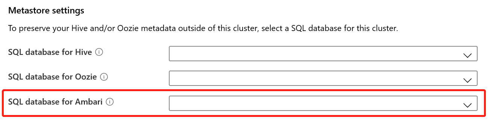

# Release notes

This article provides information about the **most recent** Azure HDInsight release updates. For information on earlier releases, see [HDInsight Release Notes Archive](hdinsight-release-notes-archive.md).

## Summary

Azure HDInsight is one of the most popular services among enterprise customers for open-source Apache Hadoop and Apache Spark analytics on Azure.

## Release date: 12/17/2019

This release applies both for HDInsight 3.6 and 4.0.

> [!IMPORTANT]  
> Linux is the only operating system used on HDInsight version 3.4 or greater. For more information, see [HDInsight versioning article](hdinsight-component-versioning.md).

## New features

### Service tags
Service tags simplify security for Azure virtual machines and Azure virtual networks by enabling you to easily restrict network access to the Azure services. You can use service tags in your network security group (NSG) rules to allow or deny traffic to a specific Azure service globally or per Azure region. Azure provides the maintenance of IP addresses underlying each tag. HDInsight service tags for network security groups (NSGs) are groups of IP addresses for health and management services. These groups help minimize complexity for security rule creation. HDInsight customers can enable service tag through Azure Portal, PowerShell, and REST API. For more information, see [Network security group (NSG) service tags for Azure HDInsight](https://docs.microsoft.com/azure/hdinsight/hdinsight-service-tags).

### Custom Ambari DB
HDInsight now allows you to use your own SQL DB for Apache Ambari. You can configure this custom Ambari DB from the Azure portal or through resource manager template.  This feature allows you to choose the right SQL DB for your processing and capacity needs. You can also upgrade easily to match business growth requirements. For more information, see [Set up HDInsight clusters with a custom Ambari DB](hdinsight-custom-ambari-db.md).

## Deprecation
No deprecations for this release. To get ready for upcoming deprecations, see [Upcoming changes](#upcoming-changes).

## Behavior changes
No behavior changes for this release. To get ready for upcoming behavior changes, see [Upcoming changes](#upcoming-changes).

## Upcoming changes
The following changes will happen in upcoming releases. 

### Transport Layer Security (TLS) 1.2 enforcement
Transport Layer Security (TLS) and Secure Sockets Layer (SSL) are cryptographic protocols that provide communications security over a computer network (learn more about TLS [here](https://en.wikipedia.org/wiki/Transport_Layer_Security#SSL_1.0.2C_2.0_and_3.0)). While Azure HDInsight clusters accept TLS 1.2 connections on public HTTPS endpoints, TLS 1.1 is still supported for backward compatibility with older clients.

Starting from the next release, you will be able to opt-in and configure your new HDInsight clusters to only accept TLS 1.2 connections. 

Later in the year, starting on 6/30/2020, Azure HDInsight will enforce TLS 1.2 or later versions for all HTTPS connections. We recommend that you ensure that all your clients are ready to handle TLS 1.2 or later versions.

### Moving to Azure virtual machine scale sets
HDInsight now uses Azure virtual machines to provision the cluster. Starting from December, HDInsight will use Azure virtual machine scale sets instead. See more about [Azure virtual machine scale sets](https://docs.microsoft.com/azure/virtual-machine-scale-sets/overview).

### ESP Spark cluster node size change 
In the upcoming release:
- The minimum allowed node size for ESP Spark cluster will be changed to Standard_D13_V2. 
- A-series VMs will be deprecated for creating new ESP clusters, as A-series VMs could cause ESP cluster issues because of relatively low CPU and memory capacity.

### HBase 2.0 to 2.1
In the upcoming HDInsight 4.0 release, HBase version will be upgraded from version 2.0 to 2.1.

## Bug fixes
HDInsight continues to make cluster reliability and performance improvements. 

## Component version change
We've extended HDInsight 3.6 support to December 31, 2020. You can find more details in [Supported HDInsight versions](hdinsight-component-versioning.md#supported-hdinsight-versions).

No component version change for HDInsight 4.0.

Apache Zeppelin on HDInsight 3.6: 0.7.0-->0.7.3. 

You can find the most up-to-date component versions from [this doc](https://docs.microsoft.com/azure/hdinsight/hdinsight-component-versioning#apache-hadoop-components-available-with-different-hdinsight-versions).

## New Regions

### UAE North
The management IPs of UAE North are: `65.52.252.96` and `65.52.252.97`.
