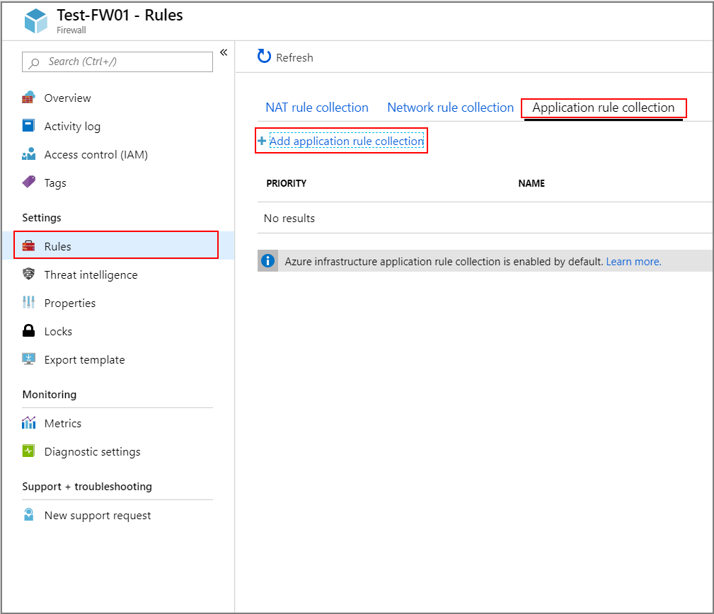
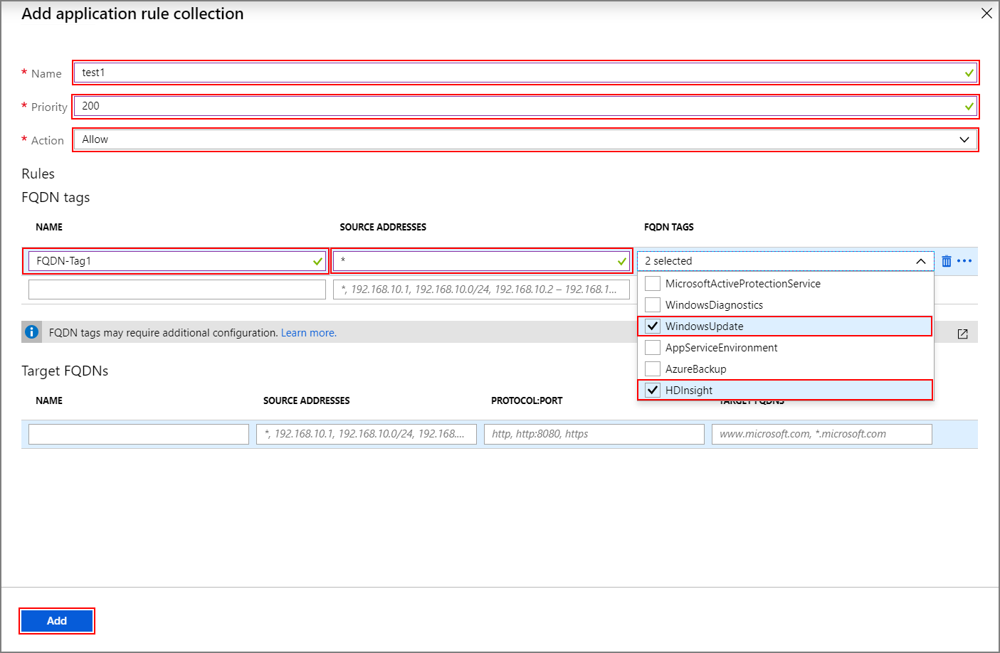
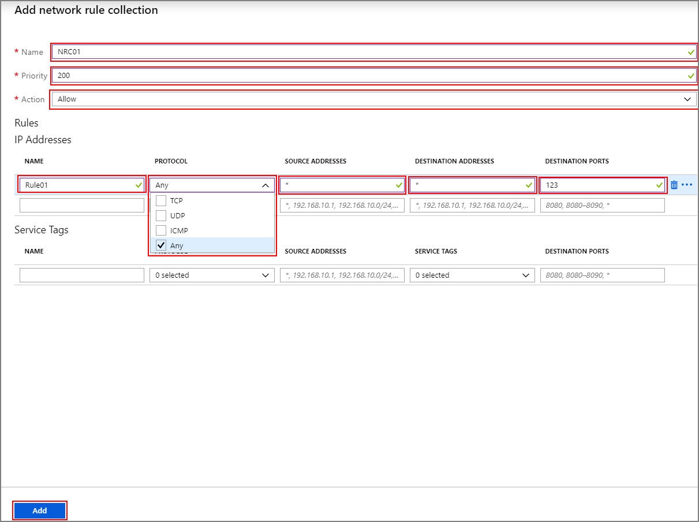
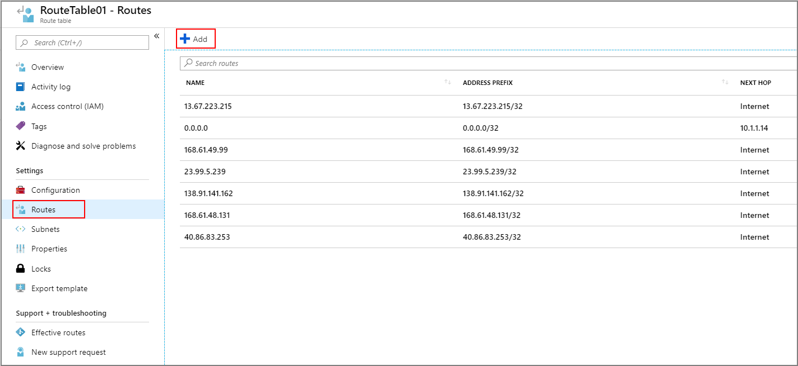
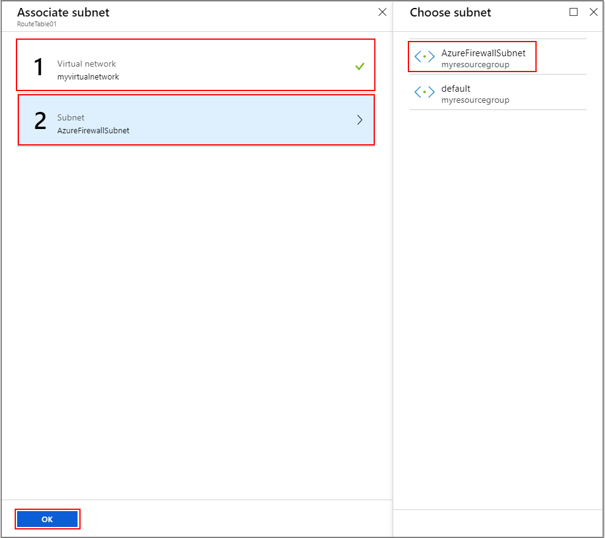

# Configure outbound network traffic restriction for Azure HDInsight clusters (Preview)

This article provides the steps for you to secure outbound traffic from your HDInsight cluster using Azure Firewall. The steps below assume that you are configuring an Azure Firewall for an existing cluster. If you are deploying a new cluster and behind a firewall, create your HDInsight cluster and subnet first and then follow the steps in this guide.

## Background

Azure HDInsight clusters are normally deployed in your own virtual network. The cluster has dependencies on services outside of that virtual network that require network access to function properly.

There are several dependencies that require inbound traffic. The inbound management traffic cannot be sent through a firewall device. The source addresses for this traffic are known and are published [here](hdinsight-extend-hadoop-virtual-network.md#hdinsight-ip). You can also create Network Security Group (NSG) rules with this information to secure inbound traffic to the clusters.

The HDInsight outbound traffic dependencies are almost entirely defined with FQDNs, which don't have static IP addresses behind them. The lack of static addresses means that Network Security Groups (NSGs) can't be used to lock down the outbound traffic from a cluster. The addresses change often enough that one can't set up rules based on the current name resolution and use that to set up NSG rules.

The solution to securing outbound addresses is to use a firewall device that can control outbound traffic based on domain names. Azure Firewall can restrict outbound HTTP and HTTPS traffic based on the FQDN of the destination or [FQDN tags](https://docs.microsoft.com/azure/firewall/fqdn-tags).

## Configuring Azure Firewall with HDInsight

A summary of the steps to lock down egress from your existing HDInsight with Azure Firewall are:
1. Create a firewall.
1. Add application rules to the firewall
1. Add network rules to the firewall.
1. Create a routing table.

### Create a new firewall for your cluster

1. Create a subnet named **AzureFirewallSubnet** in the virtual network where your cluster exists. 
1. Create a new firewall **Test-FW01** using the steps in [Tutorial: Deploy and configure Azure Firewall using the Azure portal](../firewall/tutorial-firewall-deploy-portal.md#deploy-the-firewall).

### Configure the firewall with application rules

Create an application rule collection that allows the cluster to send and receive important communications.

Select the new firewall **Test-FW01** from the Azure portal. Click **Rules** under **Settings** > **Application rule collection** > **Add application rule collection**.



On the **Add application rule collection** screen, complete the following steps:

1. Enter a **Name**, **Priority**, and click **Allow** from the **Action** dropdown menu.
1. Add the following rules:
    1. A rule to allow HDInsight and Windows Update traffic:
        1. In the **FQDN tags** section, provide a **Name**, and set **Source addresses** to `*`.
        1. Select **HDInsight** and the **WindowsUpdate** from the **FQDN Tags** dropdown menu.
    1. A rule to allow Windows login activity:
        1. In the **Target FQDNs** section, provide a **Name**, and set **Source addresses** to `*`.
        1. Enter `https:443` under **Protocol:Port** and `login.windows.net` under **Target FQDNS**.
    1. If your cluster is backed by WASB and you are not using the service endpoints above, then add a rule for WASB:
        1. In the **Target FQDNs** section, provide a **Name**, and set **Source addresses** to `*`.
        1. Enter `http` or `https` depending on if you are using wasb:// or wasbs:// under **Protocol:Port** and the storage account url under **Target FQDNS**.
1. Click **Add**.



### Configure the firewall with network rules

Create the network rules to correctly configure your HDInsight cluster.

1. Select the new firewall **Test-FW01** from the Azure portal.
1. Click **Rules** under **Settings** > **Network rule collection** > **Add network rule collection**.
1. On the **Add network rule collection** screen, enter a **Name**, **Priority**, and click **Allow** from the **Action** dropdown menu.
1. Create the following rules:
    1. A network rule that allows the cluster to perform clock sync using NTP.
        1. In the **Rules** section, provide a **Name** and select **Any** from the **Protocol** dropdown.
        1. Set **Source Addresses** and **Destination addresses** to `*`.
        1. Set **Destination Ports** to 123.
    1. If you are using Enterprise Security Package (ESP), then add a network rule that allows communication with AAD-DS for ESP clusters.
        1. Determine the two IP addresses for your domain controllers.
        1. In the next row in the **Rules** section, provide a **Name** and select **Any** from the **Protocol** dropdown.
        1. Set **Source Addresses** `*`.
        1. Enter all of the IP addresses for your domain controllers in **Destination addresses** separated by commas.
        1. Set **Destination Ports** to `*`.
    1. If you are using Azure Data Lake Storage, then you can add a network rule to address an SNI issue with ADLS Gen1 and Gen2. This option will route the traffic to firewall which might result in higher costs for large data loads but the traffic will be logged and auditable.
        1. Determine the IP address for your Data Lake Storage account. You can use a powershell command such as `[System.Net.DNS]::GetHostAddresses("STORAGEACCOUNTNAME.blob.core.windows.net")` to resolve the FQDN to an IP address.
        1. In the next row in the **Rules** section, provide a **Name** and select **Any** from the **Protocol** dropdown.
        1. Set **Source Addresses** `*`.
        1. Enter the IP address for your storage account in **Destination addresses**.
        1. Set **Destination Ports** to `*`.
    1. (Optional) If you are using Log Analytics, then create a network rule to enable communication with your Log Analytics workspace.
        1. In the next row in the **Rules** section, provide a **Name** and select **Any** from the **Protocol** dropdown.
        1. Set **Source Addresses** `*`.
        1. Set **Destination addresses** to `*`.
        1. Set **Destination Ports** to `12000`.
    1. Configure a service tag for SQL that will allow you to log and audit SQL traffic.
        1. In the next row in the **Rules** section, provide a **Name** and select **Any** from the **Protocol** dropdown.
        1. Set **Source Addresses** `*`.
        1. Set **Destination addresses** to `*`.
        1. Select **Sql** from the **Service Tags** dropdown.
        1. Set **Destination Ports** to `1433,11000-11999,14000-14999`.
1. Click **Add** to complete creation of your network rule collection.



### Create and configure a route table

Create a route table with the following entries:

1. Seven addresses from [this list of required HDInsight management IP addresses](../hdinsight/hdinsight-extend-hadoop-virtual-network.md#hdinsight-ip) with a next hop of **Internet**:
    1. Four IP addresses for all clusters in all regions
    1. Two IP addresses that are specific for the region where the cluster is created
    1. One IP address for Azure's recursive resolver
1. One Virtual Appliance route for IP address 0.0.0.0/0 with the next hop being your Azure Firewall private IP address.

For example, to configure the route table for a cluster created in the US region of "Central US", use following steps:

1. Sign in to the Azure portal.
1. Select your Azure firewall **Test-FW01**. Copy the **Private IP address** listed on the **Overview** page. For this example we will use a **sample address of 10.1.1.4**
1. Create a new route table.
1. Click **Routes** under **Settings**.
1. Click **Add** to create routes for the IP addresses in the table below.

| Route name | Address prefix | Next hop type | Next hop address |
|---|---|---|---|
| 168.61.49.99 | 168.61.49.99/32 | Internet | NA |
| 23.99.5.239 | 23.99.5.239/32 | Internet | NA |
| 168.61.48.131 | 168.61.48.131/32 | Internet | NA |
| 138.91.141.162 | 138.91.141.162/32 | Internet | NA |
| 13.67.223.215 | 13.67.223.215/32 | Internet | NA |
| 40.86.83.253 | 40.86.83.253/32 | Internet | NA |
| 168.63.129.16 | 168.63.129.16/32 | Internet | NA |
| 0.0.0.0 | 0.0.0.0/0 | Virtual appliance | 10.1.1.4 |



Complete the route table configuration:

1. Assign the route table you created to your HDInsight subnet by clicking **Subnets** under **Settings** and then **Associate**.
1. On the **Associate subnet** screen, select the virtual network that your cluster was created into and the **AzureFirewallSubnet** that you created for use with your firewall.
1. Click **OK**.



## Edge-node application traffic

The above steps will allow the cluster to operate without issues. You still need to configure dependencies to accommodate your custom applications running on the edge-nodes, if applicable.

Application dependencies must be identified and added to the Azure Firewall or the route table.

Routes must be created for the application traffic to avoid asymmetric routing issues.

If your applications have other dependencies, they need to be added to your Azure Firewall. Create Application rules to allow HTTP/HTTPS traffic and Network rules for everything else.

## Logging

Azure Firewall can send logs to a few different storage systems. For instructions on configuring logging for your firewall, follow the steps in [Tutorial: Monitor Azure Firewall logs and metrics](../firewall/tutorial-diagnostics.md).

Once you have completed the logging setup, if you are logging data to Log Analytics, you can view blocked traffic with a query such as the following:

```
AzureDiagnostics | where msg_s contains "Deny" | where TimeGenerated >= ago(1h)
```

Integrating your Azure Firewall with Azure Monitor logs is useful when first getting an application working when you are not aware of all of the application dependencies. You can learn more about Azure Monitor logs from [Analyze log data in Azure Monitor](../azure-monitor/log-query/log-query-overview.md)

## Configure another network virtual appliance

>[!Important]
> The following information is **only** required if you wish to configure a network virtual appliance (NVA) other than Azure Firewall.

The previous instructions help you configure Azure Firewall for restricting outbound traffic from your HDInsight cluster. Azure Firewall is automatically configured to allow traffic for many of the common important scenarios. If you want to use another network virtual appliance, you will need to manually configure a number of additional features. Keep the following in mind as your configure your network virtual appliance:

* Service Endpoint capable services should be configured with service endpoints.
* IP Address dependencies are for non-HTTP/S traffic (both TCP and UDP traffic).
* FQDN HTTP/HTTPS endpoints can be placed in your NVA device.
* Wildcard HTTP/HTTPS endpoints are dependencies that can vary based on a number of qualifiers.
* Assign the route table that you create to your HDInsight subnet.

### Service Endpoint capable dependencies

| **Endpoint** |
|---|
| Azure SQL |
| Azure Storage |
| Azure Active Directory |

#### IP Address dependencies

| **Endpoint** | **Details** |
|---|---|
| \*:123 | NTP clock check. Traffic is checked at multiple endpoints on port 123 |
| IPs published [here](hdinsight-extend-hadoop-virtual-network.md#hdinsight-ip) | These are HDInsight service |
| AAD-DS private IPs for ESP clusters |
| \*:16800 for KMS Windows Activation |
| \*12000 for Log Analytics |

#### FQDN HTTP/HTTPS dependencies

>[!Important]
> The list below only gives a few of the most important FQDNs. You can get the full list of FQDNs for configuring your NVA [in this file](https://github.com/Azure-Samples/hdinsight-fqdn-lists/blob/master/HDInsightFQDNTags.json).

| **Endpoint**                                                          |
|---|
| azure.archive.ubuntu.com:80                                           |
| security.ubuntu.com:80                                                |
| ocsp.msocsp.com:80                                                    |
| ocsp.digicert.com:80                                                  |
| wawsinfraprodbay063.blob.core.windows.net:443                         |
| registry-1.docker.io:443                                              |
| auth.docker.io:443                                                    |
| production.cloudflare.docker.com:443                                  |
| download.docker.com:443                                               |
| us.archive.ubuntu.com:80                                              |
| download.mono-project.com:80                                          |
| packages.treasuredata.com:80                                          |
| security.ubuntu.com:80                                                |
| azure.archive.ubuntu.com:80                                                |
| ocsp.msocsp.com:80                                                |
| ocsp.digicert.com:80                                                |

## Next steps

* [Azure HDInsight virtual network architecture](hdinsight-virtual-network-architecture.md)
