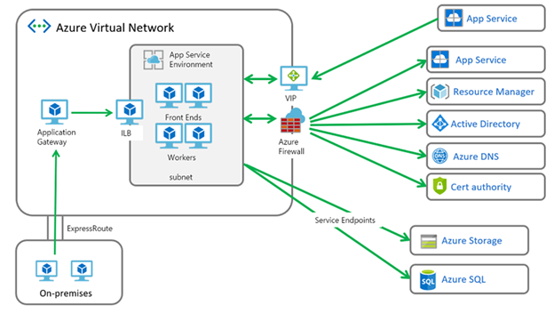
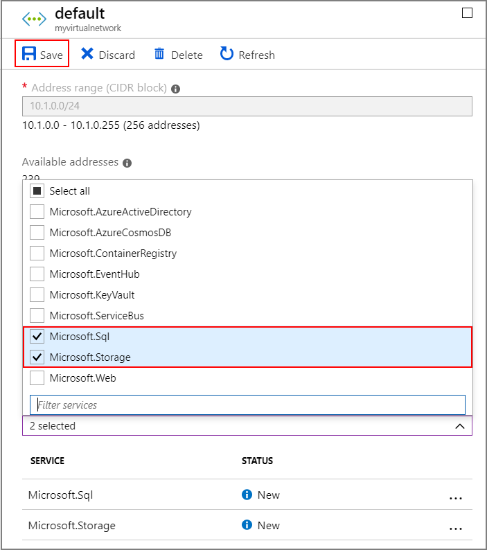
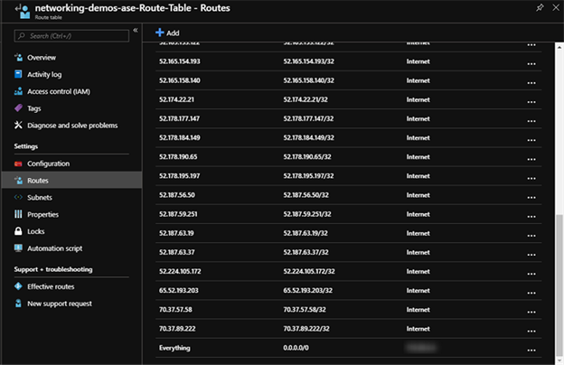

# Configure outbound traffic restriction for Azure HDInsight clusters

Azure HDInsight clusters have several external dependencies that it requires network access to function properly. The cluster usually lives in the customer specified virtual network.

There are several inbound dependencies. The inbound management traffic cannot be sent through a firewall device. The source addresses for this traffic are known and are published in this document. You can also create Network Security Group(NSG) rules with this information to secure inbound traffic to the clusters.

The HDInsight outbound dependencies are almost entirely defined with FQDNs, which do not have static IP addresses behind them. The lack of static addresses means that Network Security Groups (NSGs) cannot be used to lock down the outbound traffic from a cluster. The addresses change often enough that one cannot set up rules based on the current resolution and use that to setup NSG rules.

The solution to securing outbound addresses lies in use of a firewall device that can control outbound traffic based on domain names. Azure Firewall can restrict outbound HTTP and HTTPS traffic based on the FQDN of the destination.



## Configuring Azure Firewall with HDInsight

A summary of the steps to lock down egress from your existing HDInsight with Azure Firewall are:
1. Enable service endpoints.
1. Create a firewall.
1. Add application rules to the firewall for ???
1. Add network rules to the firewall to allow clock sync with NTP.
1. Create a routing table.

### Enable service endpoints

Enable service endpoints for SQL and storage on your HDInsight subnet. When you have service endpoints enabled to Azure SQL, any Azure SQL dependencies that your cluster has must be configured with service endpoints as well.

To enable the correct service endpoints, complete the following steps:

1. Sign in to the Azure portal and select the virtual network that your HDInsight cluster is deployed in.
1. Select **Subnets** under **Settings**.
1. Select the subnet where your cluster is deployed.
1. On the screen to edit the subnet settings, click **Microsoft.SQL** and **Microsoft.Storage** from the **Service endpoints** > **Services** dropdown box.
1. If you are using an ESP cluster, then you must also select the **Microsoft.AzureActiveDirectory** service endpoint.
1. Click **Save**.

    

### Create a new firewall for your cluster

1. Create a subnet named **AzureFirewallSubnet** in the virtual network where your cluster exists. 
1. Create a new firewall **Test-FW01** using the steps in [Tutorial: Deploy and configure Azure Firewall using the Azure portal](../firewall/tutorial-firewall-deploy-portal.md#deploy-the-firewall).
1. Select the new firewall from the Azure portal. Click **Rules** under **Settings** > **Application rule collection** > **Add application rule collection**.

    

### Configure the firewall with application rules

Create an Application rule that allows the cluster to <TODO: Add explanation>.

Select the new firewall **Test-FW01** from the Azure portal. Click **Rules** under **Settings** > **Application rule collection** > **Add application rule collection**.

On the **Add application rule collection** screen, do the following:

1. Enter a **Name**, **Priority**, and click **Allow** from the **Action** dropdown menu.
1. In the FQDN tags section, provide a **Name**, set **Source addresses** to `*`.
1. Select **HDInsight** and the **WindowsUpdate** from the **FQDN Tags** dropdown menu.
1. Click **Add**.


### Configure the firewall with network rules

Create a network rule that allows the cluster to perform clock sync using NTP.

Select the new firewall **Test-FW01** from the Azure portal. Click **Rules** under **Settings** > **Network rule collection** > **Add network rule collection**.

On the **Add network rule collection** screen, do the following:

1. Enter a **Name**, **Priority**, and click **Allow** from the **Action** dropdown menu.
1. In the Rules section, provide a **Name** and select **Any** from the **Protocol** dropdown.
1. Set **Source Addresses** and **Destination addresses** to `*`.
1. Set **Destination Ports** to 123.
1. Click **Add**.


### Create a route table

> [!Important]
> This section is unclear. Once they create a route table and go to **Add route**: What is the address prefix? Where do the IP addresses in the image come from?

Create a route table with the management addresses from this document with a next hop of Internet. The route table entries are required to avoid asymmetric routing problems. Add routes for these IP address dependencies in the IP address dependencies with a next hop of Internet. Add a Virtual Appliance route to your route table for 0.0.0.0/0 with the next hop being your Azure Firewall private IP address.

]

Assign the route table you created to your HDInsight subnet.

## Deploying HDInsight behind a firewall

The steps to deploy a cluster behind a firewall are the same as configuring your existing HDInsight cluster with an Azure Firewall except you will need to create your HDInsight subnet and then follow the previous steps.

## Edge node applications traffic

The above steps will allow the cluster to operate without issues. You still need to configure dependencies to accommodate your custom applications running on the edge nodes, if applicable.

Application dependencies must be identified and added to the Azure Firewall or the route table.

Routes must be created for the application traffic to avoid asymmetric routing issues

If your applications have other dependencies, they need to be added to your Azure Firewall. Create Application rules to allow HTTP/HTTPS traffic and Network rules for everything else.

## Logging

Azure Firewall can send logs to Azure Storage, Event Hub, or Azure Monitor logs. To integrate your app with any supported destination, complete the following steps:

>[!Important]
>The instructions in this section are unclear.

1. Go the Azure Firewall portal > Diagnostic Logs and enable the logs for your desired destination. If you integrate with Azure Monitor logs, then you can see logging for any traffic sent to Azure Firewall. 
1. To see the traffic that is being denied, open your Log Analytics workspace portal \> Logs and enter a query such as the following:

```
AzureDiagnostics | where msg_s contains "Deny" | where TimeGenerated >= ago(1h)
```

Integrating your Azure Firewall with Azure Monitor logs is very useful when first getting an application working when you are not aware of all of the application dependencies. You can learn more about Azure Monitor logs from [Analyze log data in Azure Monitor](../azure-monitor/log-query/log-query-overview.md)

## Dependencies

The following information is only required if you wish to configure a firewall appliance other than Azure Firewall.

* Service Endpoint capable services should be configured with service endpoints.
* IP Address dependencies are for non-HTTP/S traffic (both TCP and UDP traffic)
* FQDN HTTP/HTTPS endpoints can be placed in your firewall device.
* Wildcard HTTP/HTTPS endpoints are dependencies that can vary with your ASE based on a number of qualifiers.
* Linux dependencies are only a concern if you are deploying Linux apps into your ASE. If you are not deploying Linux apps into your ASE, then these addresses do not need to be added to your firewall.10.	Assign the route table you created to your HDInsight subnet.

### Service Endpoint capable dependencies

| **Endpoint** |
|---|
| Azure SQL |
| Azure Storage |

#### IP Address dependencies

| **Endpoint** | **Details** |
|---|---|
| \*:123 | NTP clock check. Traffic is checked at multiple endpoints on port 123 |
| IPs published [here](hdinsight-extend-hadoop-virtual-network.md#hdinsight-ip) | These are HDInsight service |

With an Azure Firewall, you automatically get everything below configured with the FQDN tags.

#### FQDN HTTP/HTTPS dependencies

| **Endpoint**                                                          |
|---|
| graph.windows.net:443                                                 |
| login.live.com:443                                                    |
| login.windows.com:443                                                 |
| login.windows.net:443                                                 |
| login.microsoftonline.com:443                                         |
| client.wns.windows.com:443                                            |
| definitionupdates.microsoft.com:443                                   |
| go.microsoft.com:80                                                   |
| go.microsoft.com:443                                                  |
| [www.microsoft.com:80](www.microsoft.com:80)                          |
| [www.microsoft.com:443](www.microsoft.com:443)                        |
| wdcpalt.microsoft.com:443                                             |
| wdcp.microsoft.com:443                                                |
| ocsp.msocsp.com:443                                                   |
| mscrl.microsoft.com:443                                               |
| mscrl.microsoft.com:80                                                |
| crl.microsoft.com:443                                                 |
| crl.microsoft.com:80                                                  |
| [www.thawte.com:443](www.thawte.com:443)                              |
| crl3.digicert.com:80                                                  |
| ocsp.digicert.com:80                                                  |
| csc3-2009-2.crl.verisign.com:80                                       |
| crl.verisign.com:80                                                   |
| ocsp.verisign.com:80                                                  |
| cacerts.digicert.com:80                                               |
| azperfcounters1.blob.core.windows.net:443                             |
| azurewatsonanalysis-prod.core.windows.net:443                         |
| global.metrics.nsatc.net:80                                           |
| global.metrics.nsatc.net:443                                          |
| az-prod.metrics.nsatc.net:443                                         |
| antares.metrics.nsatc.net:443                                         |
| azglobal-black.azglobal.metrics.nsatc.net:443                         |
| azglobal-red.azglobal.metrics.nsatc.net:443                           |
| antares-black.antares.metrics.nsatc.net:443                           |
| antares-red.antares.metrics.nsatc.net:443                             |
| maupdateaccount.blob.core.windows.net:443                             |
| clientconfig.passport.net:443                                         |
| packages.microsoft.com:443                                            |
| schemas.microsoft.com:80                                              |
| schemas.microsoft.com:443                                             |
| management.core.windows.net:443                                       |
| management.core.windows.net:80                                        |
| management.azure.com:443                                              |
| [www.msftconnecttest.com:80](www.msftconnecttest.com:80)              |
| shavamanifestcdnprod1.azureedge.net:443                               |
| validation-v2.sls.microsoft.com:443                                   |
| flighting.cp.wd.microsoft.com:443                                     |
| dmd.metaservices.microsoft.com:80                                     |
| admin.core.windows.net:443                                            |
| azureprofileruploads.blob.core.windows.net:443                        |
| azureprofileruploads2.blob.core.windows.net:443                       |
| azureprofileruploads3.blob.core.windows.net:443                       |
| azureprofileruploads4.blob.core.windows.net:443                       |
| azureprofileruploads5.blob.core.windows.net:443                       |

#### Wildcard HTTP/HTTPS dependencies

| **Endpoint**                                                          |
|---|
| gr-Prod-\*.cloudapp.net:443                                           |
| \*.management.azure.com:443                                           |
| \*.update.microsoft.com:443                                           |
| \*.windowsupdate.microsoft.com:443                                    |

#### Linux dependencies

| **Endpoint**                                                          |
|---|
| wawsinfraprodbay063.blob.core.windows.net:443                         |
| registry-1.docker.io:443                                              |
| auth.docker.io:443                                                    |
| production.cloudflare.docker.com:443                                  |
| download.docker.com:443                                               |
| us.archive.ubuntu.com:80                                              |
| download.mono-project.com:80                                          |
| packages.treasuredata.com:80                                          |
| security.ubuntu.com:80                                                |

## Next steps

* [Azure HDInsight virtual network architecture](https://docs.microsoft.com/en-us/azure/hdinsight/hdinsight-virtual-network-architecture)