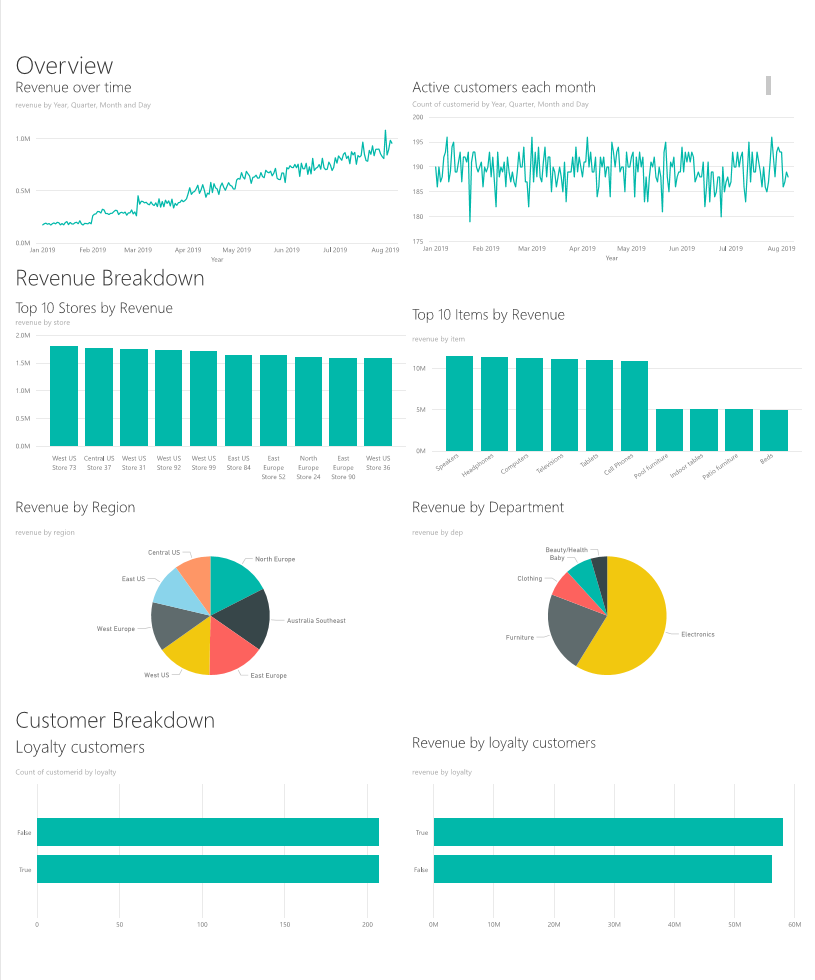

# Introduction

In this tutorial you will build an end to end data pipeline which performs Extract Transform and Load operations. The pipeline will use Apache Spark and Apache Hive clusters running on Azure HDInsight for querying and manipulating the data, Data Lake Storage Gen2 for storing your data and Power BI for visualization.

 This data pipeline combines the data from all of the different stores, removes any unwanted data, appends new data, and loads this back to your storage to visualize business insights. Read more about ETL pipelines [Extract, transform, and load (ETL) at scale](./hadoop/apache-hadoop-etl-at-scale.md).


## Prerequisites

If you don't have an Azure subscription, create a [free account](https://azure.microsoft.com/free/) before you begin.

Download [Power BI Desktop](https://www.microsoft.com/en-us/download/details.aspx?id=45331) to visualize business insights at the end of this tutorial.

## Create resources

1. Login to the [Azure portal](https://portal.azure.com)
1. Open the Cloud Shell from the top menu bar. Select your subscription for creating a file share if you are prompted by Azure Cloud Shell.

    
1. Select "Bash" from the "Select environment" drop down menu.
1. Log into your Azure account and set the subscription. 
1. Set up the resource group for the project.
    1. Pick a unique resource group name.
    1. Run the code snippet below in the Azure Cloud Shell to set variables that will be used in later steps

        ```azurecli-interactive 
        resourceGroup="<RESOURCE GROUP NAME>"
        subscriptionID="<SUBSCRIPTION ID>"

        az account set --subscription $subscriptionID
        az group create --name $resourceGroup --location westus
        ```

1. Download the data and scripts for this tutorial from the [HDInsight sales insights ETL repository](https://github.com/Azure-Samples/hdinsight-sales-insights-etl) by typing the following commands at the Cloud Shell:

        ```azurecli-interactive 
        git clone https://github.com/Azure-Samples/hdinsight-sales-insights-etl.git
        cd hdinsight-sales-insights-etl
        ```

1. Type `ls` at the shell prompt to see the following files and directories have been created:

    ```output
    /salesdata/
    /scripts/
    /templates/
    ```

## Deploy Azure resources needed for the pipeline 

1. Add execute permissions for the script `chmod +x scripts/resources.sh`
1. Use the command `./scripts/resources.sh <RESOURCE_GROUP_NAME> <LOCATION>` to run the script to deploy the following resources in Azure:

    1. An Azure Blob Storage account - this account will hold the company sales data
    2. An Azure Data Lake Storage Gen2 account - this account will serve as the storage account for both HDInsight clusters. Read more about HDInsight and Data Lake Storage Gen2 in [Azure HDInsight integration with Data Lake Storage Gen2](https://azure.microsoft.com/blog/azure-hdinsight-integration-with-data-lake-storage-gen-2-preview-acl-and-security-update/).
    3. A user-assigned managed identity - this account gives the HDInsight clusters access to the Data Lake Storage Gen2 account.
    4. An Apache Spark luster - this cluster will be used to clean up and transform the raw data
    5. An Apache Hive Interactive Query cluster - this cluster will allow querying the sales data visualizing it with Power BI
    6. An Azure virtual network supported by network security group (NSG) rules - this virtual network allows the clusters to communicate and also secures their communications. 

    The `resources.sh` script contains the command `az group deployment create` which uses a resource manager template (`resourcestemplate.json`) to create the specified resources with the desired configuration.
    
    ```azurecli-interactive 
    az group deployment create --name ResourcesDeployment \
        --resource-group $resourceGroup \
        --template-file resourcestemplate.json \
        --parameters "@resourceparameters.json"
    ```

1. The default password used for ssh access to the clusters is `Thisisapassword1`. If you'd like to change the password navigate to `resourcesparameters.json` file and change the password for the `sparksshPassword`, `sparkClusterLoginPassword`, `llapClusterLoginPassword`, `llapsshPassword` parameters.

    > [!Note]
    > Cluster creation can take around 20 minutes.

## Verify deployment and collect resource information

1. If you'd like to check on the status of your deployment, navigate to the resource group on the Azure portal. Click **Deployments** under **Settings**. Click the name of your deployment `ResourcesDeployment`. Here you can see the resources that have successfully deployed and those that are still being worked on.
1. Once the deployment has completed, go the Azure portal > **Resource groups** > <RESOURCE_GROUP_NAME>
1. Locate the new Azure storage account that was created for storing the sales files. The name of the storage account begins with `blob` and then contains a random string. 
    1. Make a note of the storage account name for later use.
    1. Click on the name of the blob storage account.
    1. On the left side of the portal under **Settings**, click **Access keys**.
    1. Copy the string in the box **Key1** and save it for later use.
1. Locate the Data Lake Storage Gen2 account that was created as storage for the HDInsight clusters. This account is located in the same resource group as the blob storage account, but begins with `adlsgen2`.
    1. Make a note of the name of the Data Lake Storage Gen2  account.
    1. Click on the name of the Data Lake Storage Gen2 account.
    1. On the left side of the portal, under **Settings**, click **Access keys**
    1. Copy the string in the box **Key1** and save it for later use.

> [!Note]
> Once you know the names of the storage accounts, you can also get the account keys using the following command at the Azure Cloud Shell prompt:
> ```azurecli-interactive
> az storage account keys list \
>    --account-name <STORAGE NAME> \
>    --resource-group $rg \
>    --output table
> ```

## Transfer sales data

1. Upload the sales data files by executing the following command:

```
az storage blob upload-batch -d rawdata \
    --account-name <BLOB STORAGE NAME> -s ./ --pattern *.csv
```

## Create an Azure Data Factory

Azure Data Factory is a tool that helps automate Azure Pipelines. It's not the only way to accomplish these tasks, but it's a great way to automate these processes. For more information on Azure Data Factory, see Read more about it [Azure Data Factory Documentation](https://azure.microsoft.com/en-us/services/data-factory/). 

This Azure Data Factory will have two pipelines: 

1. The first pipeline will copy the data from the Azure Blob Storage to the Data Lake Storage Gen 2 Storage Account to mimic data ingestion. 
2. The second pipeline will transform the data in the Spark cluster. The script transforms the data by removing unwanted columns as well as appending a new column that calculates the revenue generated by a single transaction.

To setup your Azure Data Factory pipelines, complete the following steps:

1. In `sparktransform.py`, fill in the Data Lake Storage Gen2 storage account name within the angle brackets.
    1. From the root of the `hdinsight-sales-insights-etl` folder open a text editor to edit the script by typing `nano scripts/sparktransform.py`
    1. Find the instances of `<ADLS GEN2 STORAGE NAME>` on lines 21 and 24 and replace them with the actual Data Lake Gen2 storage account name such as `adlsgen2abcd4aenar53q`
1. In `adfparameters.json` fill out the values of the account keys of both the blob and Data Lake Storage Gen2 storage accounts. 
    1. Insert the Data Lake Storage Gen2 account key in line 6 of the template as the value for the property **AzureDataLakeStorage1_accountKey**.
    1. Insert the Azure Blob Storage account key in line 15 of the template as the value for the property **AzureBlobStorage1_accountKey**.
1. In `adf.sh` fill in your subscription id, resource group name, and Data Lake Storage Gen2 Storage Account Name in the angle brackets on line 93. Save the file and exit out of the editor.
1. Add execute permissions on the file using `chmod +x adf.sh`
1. Execute the script with `./adf.sh` This creates a service principal with  Storage Blob Data Contributor permissions on the Data Lake Storage Gen2 storage account. It then obtains an authentication token to authorize POST requests to the [Data Lake Storage Gen2 FileSystem REST API](https://docs.microsoft.com/en-us/rest/api/storageservices/datalakestoragegen2/filesystem/create).

```
./adf.sh
```
Deploy the ADF using the following command: 

```azurecli-interactive 
az group deployment create --name ADFDeployment \
    --resource-group $resourceGroup \
    --template-file adftemplate.json \
    --parameters "@adfparameters.json"
```

### Trigger the Pipelines
To trigger the pipelines you can either:
1.  Run the following commands to trigger the ADF pipelines in PowerShell mode. 

This pipeline moves the data from blob storage to Data Lake Storage Gen2 Storage
```powershell
Invoke-AzDataFactoryV2Pipeline -DataFactory $df -PipelineName "CopyPipeline_k8z" 
```
This pipeline applies the spark transformations on the data and may take a few minutes. 
```powershell
Invoke-AzDataFactoryV2Pipeline -DataFactory $df -PipelineName "sparkTransformPipeline"
```
2. You can also open the Data Factory, select Author & Monitor, and trigger the copy pipeline, then the spark pipeline from the portal. [Here](https://docs.microsoft.com/en-us/azure/hdinsight/hdinsight-hadoop-create-linux-clusters-adf#trigger-a-pipeline) is a tutorial that shows you how to trigger pipelines from the portal. 

To verify that the pipelines executed you can either 
1. Navigate to the monitor section on ADF through the portal. 
2. Go to your Data Lake Storage Gen 2 storage account storage explorer, go to the `files` FileSystem, and navigate to the `transformed` folder and check its contents to see if the pipeline succeeded.

For other ways to transform data using HDInsight check out this article on using [Jupyter notebook](https://docs.microsoft.com/en-us/azure/hdinsight/spark/apache-spark-load-data-run-query)

## Create a table on the Interactive Query cluster to view data on Power BI

Now, SSH into the LLAP cluster using the following command and then enter your password. If you have not altered the `resourcesparameters.json` file this should be `Thisisapassword1`. 

```
ssh sshuser@<clustername>-ssh.azurehdinsight.net
```

Next, create a file that will contain the Hive query to create a table. 
```
nano query.hql
```
Copy the contents below into `query.hql` and substitute your storage account name in the angle brackets. 
```
DROP TABLE sales_raw;
-- Creates an external table over the csv file
CREATE EXTERNAL TABLE sales_raw(
  QUANT INT,
  REGION STRING,
  STORE STRING,
  SALEDATE STRING,
  DEP STRING,
  ITEM STRING,
  UNITSOLD INT,
  UNITPRICE INT,
  REVENUE INT)
--Format and location of the file
ROW FORMAT DELIMITED FIELDS TERMINATED BY ','
LINES TERMINATED BY '\n'
STORED AS TEXTFILE
LOCATION 'abfs://files@<ADLS GEN2 ACCOUNT NAME>.dfs.core.windows.net/transformed';
--Drop table sales if exists
--Drop table sales if exists
DROP TABLE sales;
--Create sales table and populate with data\
--pulled in from csv file (via external table defined previously)
CREATE TABLE sales AS
SELECT QUANT AS quant,
	REGION AS region,
	STORE as store,
	CAST(SALEDATE as DATE) as saledate, 
	DEP as dep,
	ITEM as item,
	UNITSOLD as unitsold,
	UNITPRICE as unitprice,
	REVENUE as revenue
FROM sales_raw;
```
Run the following command to execute the script
```
beeline -u 'jdbc:hive2://localhost:10001/;transportMode=http' -f query.hql
```

This script will create a table on the Interactive Query cluster that you can access from Power BI. 

Open up Power BI Desktop and select Get Data. Search for HDInsight Interactive Query cluster and paste the URI for your cluster there. It should be in the format `https://<LLAP CLUSTER NAME>.azurehdinsight.net` Type `default` for the database. 

Once the data is loaded, you can experiment with the dashboard you would like to create. Here is an example dashboard with the given data. 



## Clean up resources

If you're not going to continue to use this application, delete all resources with the following steps so that you are not charged for them. 

```azurecli-interactive 
az group delete -n $resourceGroup
```

## Next steps

Advance to the next article to learn how to create...
> [!div class="nextstepaction"]
> [Extract, transform, and load (ETL) at scale](./hadoop/apache-hadoop-etl-at-scale.md)
