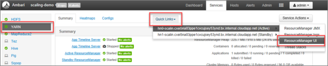

# Scale Azure HDInsight clusters

HDInsight provides elasticity with options to scale up and scale down the number of worker nodes in your clusters. This elasticity allows you to shrink a cluster after hours or on weekends. And expand it during peak business demands.

Scale up your cluster before periodic batch processing so the cluster has adequate resources.  After processing completes, and usage goes down, scale down the HDInsight cluster to fewer worker nodes.

You can scale a cluster manually using one of the methods outlined below. You can also use [autoscale](hdinsight-autoscale-clusters.md) options to automatically scale up and down in response to certain metrics.

> [!NOTE]  
> Only clusters with HDInsight version 3.1.3 or higher are supported. If you are unsure of the version of your cluster, you can check the Properties page.

## Utilities to scale clusters

Microsoft provides the following utilities to scale clusters:

|Utility | Description|
|---|---|
|[PowerShell Az](https://docs.microsoft.com/powershell/azure)|[`Set-AzHDInsightClusterSize`](https://docs.microsoft.com/powershell/module/az.hdinsight/set-azhdinsightclustersize) `-ClusterName CLUSTERNAME -TargetInstanceCount NEWSIZE`|
|[PowerShell AzureRM](https://docs.microsoft.com/powershell/azure/azurerm) |[`Set-AzureRmHDInsightClusterSize`](https://docs.microsoft.com/powershell/module/azurerm.hdinsight/set-azurermhdinsightclustersize) `-ClusterName CLUSTERNAME -TargetInstanceCount NEWSIZE`|
|[Azure CLI](https://docs.microsoft.com/cli/azure/?view=azure-cli-latest) | [`az hdinsight resize`](https://docs.microsoft.com/cli/azure/hdinsight?view=azure-cli-latest#az-hdinsight-resize) `--resource-group RESOURCEGROUP --name CLUSTERNAME --workernode-count NEWSIZE`|
|[Azure Classic CLI](hdinsight-administer-use-command-line.md)|`azure hdinsight cluster resize CLUSTERNAME NEWSIZE` |
|[Azure portal](https://portal.azure.com)|Open your HDInsight cluster pane, select **Cluster size** on the left-hand menu, then on the Cluster size pane, type in the number of worker nodes, and select Save.|  


Using any of these methods, you can scale your HDInsight cluster up or down within minutes.

> [!IMPORTANT]  
> * The Azure classic CLI is deprecated and should only be used with the classic deployment model. For all other deployments, use the [Azure CLI](https://docs.microsoft.com/cli/azure/?view=azure-cli-latest).
> * The PowerShell AzureRM module is deprecated.  Please use the [Az module](https://docs.microsoft.com/powershell/azure/new-azureps-module-az?view=azps-1.4.0) whenever possible.

## Impact of scaling operations

When you **add** nodes to your running HDInsight cluster (scale up), jobs won't be affected. New jobs can be safely submitted while the scaling process is running. If the scaling operation fails, the failure will leave your cluster in a functional state.

If you **remove** nodes (scale down), pending or running jobs will fail when the scaling operation completes. This failure is because of some of the services restarting during the scaling process. Your cluster may get stuck in safe mode during a manual scaling operation.

The impact of changing the number of data nodes varies for each type of cluster supported by HDInsight:

* Apache Hadoop

    You can seamlessly increase the number of worker nodes in a running Hadoop cluster without impacting any jobs. New jobs can also be submitted while the operation is in progress. Failures in a scaling operation are gracefully handled. The cluster is always left in a functional state.

    When a Hadoop cluster is scaled down with fewer data nodes, some services are restarted. This behavior causes all running and pending jobs to fail at the completion of the scaling operation. You can, however, resubmit the jobs once the operation is complete.

* Apache HBase

    You can seamlessly add or remove nodes to your HBase cluster while it's running. Regional Servers are automatically balanced within a few minutes of completing the scaling operation. However, you can manually balance the regional servers. Log in to the cluster headnode and run the following commands:

    ```bash
    pushd %HBASE_HOME%\bin
    hbase shell
    balancer
    ```

    For more information on using the HBase shell, see [Get started with an Apache HBase example in HDInsight](hbase/apache-hbase-tutorial-get-started-linux.md).

* Apache Storm

    You can seamlessly add or remove data nodes while Storm is running. However, after a successful completion of the scaling operation, you'll need to rebalance the topology. Rebalancing allows the topology to readjust [parallelism settings](https://storm.apache.org/documentation/Understanding-the-parallelism-of-a-Storm-topology.html) based on the new number of nodes in the cluster. To rebalance running topologies, use one of the following options:

  * Storm web UI

    Use the following steps to rebalance a topology using the Storm UI.

    1. Open `https://CLUSTERNAME.azurehdinsight.net/stormui` in your web browser, where `CLUSTERNAME` is the name of your Storm cluster. If prompted, enter the HDInsight cluster administrator (admin) name and password you specified when creating the cluster.

    1. Select the topology you wish to rebalance, then select the **Rebalance** button. Enter the delay before the rebalance operation is done.

        

  * Command-line interface (CLI) tool

    Connect to the server and use the following command to rebalance a topology:

    ```bash
     storm rebalance TOPOLOGYNAME
    ```

    You can also specify parameters to override the parallelism hints originally provided by the topology. For example, the code below reconfigures the `mytopology` topology to 5 worker processes, 3 executors for the blue-spout component, and 10 executors for the yellow-bolt component.

    ```bash
    ## Reconfigure the topology "mytopology" to use 5 worker processes,
    ## the spout "blue-spout" to use 3 executors, and
    ## the bolt "yellow-bolt" to use 10 executors
    $ storm rebalance mytopology -n 5 -e blue-spout=3 -e yellow-bolt=10
    ```

* Kafka

    You should rebalance partition replicas after scaling operations. For more information, see the [High availability of data with Apache Kafka on HDInsight](./kafka/apache-kafka-high-availability.md) document.

## How to safely scale down a cluster

### Scale down a cluster with running jobs

To avoid having your running jobs fail during a scale down operation, you can try three things:

1. Wait for the jobs to complete before scaling down your cluster.
1. Manually end the jobs.
1. Resubmit the jobs after the scaling operation has concluded.

To see a list of pending and running jobs, you can use the YARN **Resource Manager UI**, following these steps:

1. From the [Azure portal](https://portal.azure.com/), select your cluster.  The cluster is opened in a new portal page.
2. From the main view, navigate to **Cluster dashboards** > **Ambari home**. Enter your cluster  credentials.
3. From the Ambari UI, select **YARN** on the list of services on the left-hand menu.  
4. From the YARN page, select **Quick Links** and hover over the active head node, then select **Resource Manager UI**.

    

You may directly access the Resource Manager UI with `https://<HDInsightClusterName>.azurehdinsight.net/yarnui/hn/cluster`.

You  see a list of jobs, along with their current state. In the screenshot, there's  one job currently running:


To  manually kill that running application, execute the following command from the SSH shell:

```bash
yarn application -kill <application_id>
```

For example:

```bash
yarn application -kill "application_1499348398273_0003"
```

### Getting stuck in safe mode

When you scale down a cluster, HDInsight uses Apache Ambari management interfaces to first decommission the extra worker nodes. The nodes replicate their HDFS blocks to other online worker nodes. After that, HDInsight safely scales the cluster down. HDFS goes into safe mode during the scaling operation. HDFS is supposed to come out once the scaling is finished. In some cases, however, HDFS gets stuck in safe mode during a scaling operation because of file block under-replication.

By default, HDFS is configured with a `dfs.replication` setting of 1, which controls how many copies of each file block are available. Each copy of a file block is stored on a different node of the cluster.

When the expected number of block copies aren't available, HDFS enters safe mode and Ambari generates alerts. HDFS may enter safe mode for a scaling operation. The cluster may get stuck in safe mode if the required number of nodes aren't detected for replication.

### Example errors when safe mode is turned on

```output
org.apache.hadoop.hdfs.server.namenode.SafeModeException: Cannot create directory /tmp/hive/hive/819c215c-6d87-4311-97c8-4f0b9d2adcf0. Name node is in safe mode.
```

```output
org.apache.http.conn.HttpHostConnectException: Connect to active-headnode-name.servername.internal.cloudapp.net:10001 [active-headnode-name.servername. internal.cloudapp.net/1.1.1.1] failed: Connection refused
```

You can review the name node logs from the `/var/log/hadoop/hdfs/` folder, near the time when the cluster was scaled, to see when it entered safe mode. The log files are named `Hadoop-hdfs-namenode-<active-headnode-name>.*`.

The root cause was that Hive depends on temporary files in HDFS while running queries. When HDFS enters safe mode, Hive can't run queries because it can't write to HDFS. Temp files in HDFS are located in the local drive mounted to the individual worker node VMs. The files are replicated among other worker nodes at three replicas, minimum.

### How to prevent HDInsight from getting stuck in safe mode

There are several ways to prevent HDInsight from being left in safe mode:

* Stop all Hive jobs before scaling down HDInsight. Alternately, schedule the scale down process to avoid conflicting with running Hive jobs.
* Manually clean up Hive's scratch `tmp` directory files in HDFS before scaling down.
* Only scale down HDInsight to three worker nodes, minimum. Avoid going as low as one worker node.
* Run the command to leave safe mode, if needed.

The following sections describe these options.

#### Stop all Hive jobs

Stop all Hive jobs before scaling down to one worker node. If  your workload is scheduled, then execute your scale-down after Hive work is done.

Stopping the Hive jobs before scaling, helps minimize the number of scratch files in the tmp folder (if any).

#### Manually clean up Hive's scratch files

If Hive has left behind temporary files, then you can manually clean up those files before scaling down to avoid safe mode.

1. Check which location is being used for Hive temporary files by looking at the `hive.exec.scratchdir` configuration property. This parameter is set within `/etc/hive/conf/hive-site.xml`:

    ```xml
    <property>
        <name>hive.exec.scratchdir</name>
        <value>hdfs://mycluster/tmp/hive</value>
    </property>
    ```

1. Stop Hive services and be sure all queries and jobs are completed.

1. List the contents of the scratch directory found above, `hdfs://mycluster/tmp/hive/` to see if it contains any files:

    ```bash
    hadoop fs -ls -R hdfs://mycluster/tmp/hive/hive
    ```

    Here is a sample output when files exist:

    ```output
    sshuser@scalin:~$ hadoop fs -ls -R hdfs://mycluster/tmp/hive/hive
    drwx------   - hive hdfs          0 2017-07-06 13:40 hdfs://mycluster/tmp/hive/hive/4f3f4253-e6d0-42ac-88bc-90f0ea03602c
    drwx------   - hive hdfs          0 2017-07-06 13:40 hdfs://mycluster/tmp/hive/hive/4f3f4253-e6d0-42ac-88bc-90f0ea03602c/_tmp_space.db
    -rw-r--r--   3 hive hdfs         27 2017-07-06 13:40 hdfs://mycluster/tmp/hive/hive/4f3f4253-e6d0-42ac-88bc-90f0ea03602c/inuse.info
    -rw-r--r--   3 hive hdfs          0 2017-07-06 13:40 hdfs://mycluster/tmp/hive/hive/4f3f4253-e6d0-42ac-88bc-90f0ea03602c/inuse.lck
    drwx------   - hive hdfs          0 2017-07-06 20:30 hdfs://mycluster/tmp/hive/hive/c108f1c2-453e-400f-ac3e-e3a9b0d22699
    -rw-r--r--   3 hive hdfs         26 2017-07-06 20:30 hdfs://mycluster/tmp/hive/hive/c108f1c2-453e-400f-ac3e-e3a9b0d22699/inuse.info
    ```

1. If you know Hive is done with these files, you can remove them. Be sure that Hive doesn't have any queries running by looking in the Yarn Resource Manager UI page.

    Example command line to remove files from HDFS:

    ```bash
    hadoop fs -rm -r -skipTrash hdfs://mycluster/tmp/hive/
    ```

#### Scale HDInsight to three or more worker nodes

If your clusters get stuck in safe mode frequently when scaling down to fewer than three worker nodes, then keep at least three worker nodes.

Having three worker nodes is more costly than scaling down to only one worker node. However, this action will prevent your cluster from getting stuck in safe mode.

### Scale HDInsight down to one worker node

Even when the cluster is scaled down to one node, worker node 0 will still survive. Worker node 0 can never be decommissioned.

#### Run the command to leave safe mode

The final option is to execute the leave safe mode command. If HDFS entered safe mode because of Hive file under-replication, execute the following command to leave safe mode:

```bash
hdfs dfsadmin -D 'fs.default.name=hdfs://mycluster/' -safemode leave
```

### Scale down an Apache HBase cluster

Region servers are automatically balanced within a few minutes after completing a scaling operation. To manually balance region servers, complete the following steps:

1. Connect to the HDInsight cluster using SSH. For more information, see [Use SSH with HDInsight](hdinsight-hadoop-linux-use-ssh-unix.md).

2. Start the HBase shell:

    ```bash
    hbase shell
    ```

3. Use the following command to manually balance the region servers:

    ```bash
    balancer
    ```

## Next steps

* [Automatically scale Azure HDInsight clusters](hdinsight-autoscale-clusters.md)

For specific information on scaling your HDInsight cluster, see:

* [Manage Apache Hadoop clusters in HDInsight by using the Azure portal](hdinsight-administer-use-portal-linux.md#scale-clusters)
* [Manage Apache Hadoop clusters in HDInsight by using Azure CLI](hdinsight-administer-use-command-line.md#scale-clusters)
