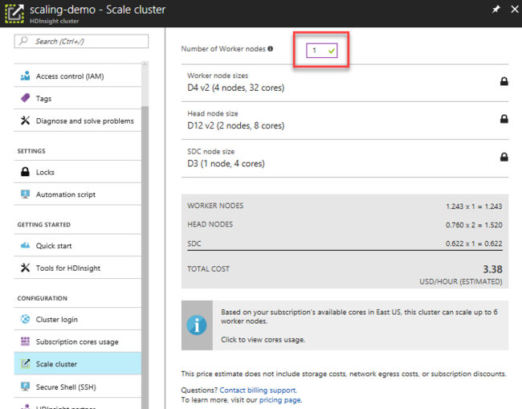
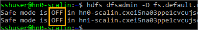
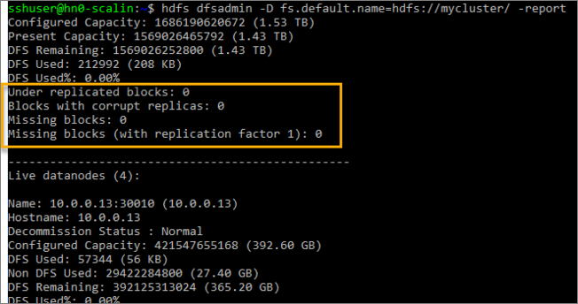
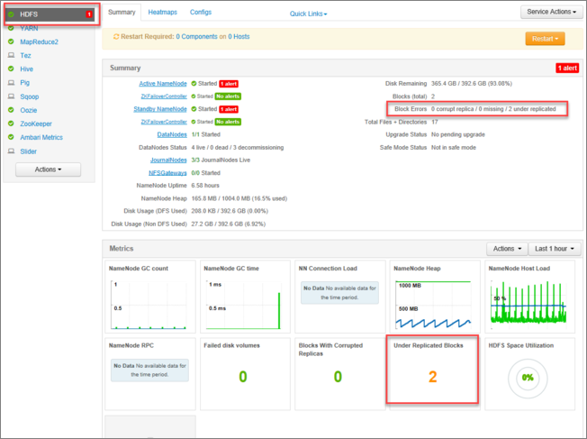
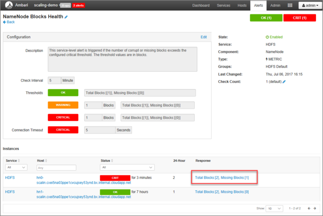

# Scale HDInsight clusters

HDInsight provides elasticity by giving you the option to scale up and scale down the number of worker nodes in your clusters. This allows you to shrink a cluster after hours or on weekends, and expand it during peak business demands.

For example, if you have some batch processing that happens once a day or once a month, the HDInsight cluster can be scaled up a few minutes prior to that scheduled event so  there will be adequate  memory and CPU compute power. You can automate scaling with the PowerShell cmdlet [`Set–AzureRmHDInsightClusterSize`](hdinsight-administer-use-powershell.md#scale-clusters).  Later, after the processing is done, and usage goes down again, you can scale down the HDInsight cluster to fewer worker nodes.

* To scale your cluster through [PowerShell](hdinsight-administer-use-powershell.md):

    ```powershell
    Set-AzureRmHDInsightClusterSize -ClusterName <Cluster Name> -TargetInstanceCount <NewSize>
    ```
    
* To scale your cluster through the [Azure Classic CLI](hdinsight-administer-use-command-line.md):

    ```
    azure hdinsight cluster resize [options] <clusterName> <Target Instance Count>
    ```

[!INCLUDE [classic-cli-warning](../../includes/requires-classic-cli.md)]
    
* To scale your cluster through the [Azure portal](https://portal.azure.com), open your HDInsight cluster pane, select **Scale cluster** on the left-hand menu, then on the Scale cluster pane, type in the number of worker nodes, and select Save.

    

Using any of these methods, you can scale your HDInsight cluster up or down within minutes.

## Scaling impacts on running jobs

When you **add** nodes to your running HDInsight cluster, any pending or running jobs will not be impacted. In addition, new jobs can be safely submitted while the scaling process is running. If the scaling operations fail for any reason, the failure is gracefully handled, leaving the cluster in a functional state.

However, if you are scaling down your cluster by **removing** nodes, any pending or running jobs will fail when the scaling operation completes. This failure is due to some of the services restarting during the process.

To address this issue, you can wait for the jobs to complete before scaling down your cluster, manually terminate the jobs, or  resubmit the jobs after the scaling operation has concluded.

To see a list of pending and running jobs, you can use the YARN ResourceManager UI, following these steps:

1. Sign in to [Azure portal](https://portal.azure.com).
2. On the left menu, select **Browse**, select **HDInsight Clusters**, and then select your cluster.
3. From your HDInsight cluster pane, select **Dashboard** on the top menu to open the Ambari UI. Enter your cluster login credentials.
4. Click **YARN** on the list of services on the left-hand menu. On the YARN page, select **Quick Links** and hover over the active head node, then click **ResourceManager UI**.

    

You may directly access the ResourceManager UI with `https://<HDInsightClusterName>.azurehdinsight.net/yarnui/hn/cluster`.

You  see a list of jobs, along with their current state. In the screenshot, there is  one job currently running:


To  manually kill that running application, execute the following command from the SSH shell:

```bash
yarn application -kill <application_id>
```

For example:

```bash
yarn application -kill "application_1499348398273_0003"
```

## Rebalancing an HBase cluster

Region servers are automatically balanced within a few minutes after completion of the scaling operation. To manually balance region servers, use the following steps:

1. Connect to the HDInsight cluster using SSH. For more information, see [Use SSH with HDInsight](hdinsight-hadoop-linux-use-ssh-unix.md).

2. Start the HBase shell:

        hbase shell

3. Use the following command to manually balance the region servers:

        balancer

## Scale down implications

As mentioned previously, any pending or running jobs are terminated at the completion of a scaling down operation. However, there are other potential implications to scaling down that may occur.

## HDInsight name node stays in safe mode after scaling down



If you shrink your cluster down to the minimum of one worker node, as shown in the previous image,  HDFS may become stuck in safe mode when worker nodes are rebooted due to patching, or immediately after the scaling operation.

The primary cause of this is that Hive uses a few `scratchdir` files, and by default expects three replicas of each block, but there is only one replica possible if you scale down to the minimum one worker node. As a consequence, the files in the `scratchdir` become *under-replicated*. This could cause HDFS to stay in safe mode when the services are restarted after the scale operation.

When a scale down attempt happens, HDInsight relies upon the Ambari management interfaces to first decommission the extra unwanted worker nodes, which replicates their HDFS blocks to other online worker nodes, and then safely scale the cluster down. HDFS goes into a safe mode during the maintenance window, and is supposed to come out once the scaling is finished. It is at this point that HDFS can become stuck in safe mode.

HDFS is configured with a `dfs.replication` setting of 3. Thus, the blocks of the scratch files are under-replicated whenever there are fewer than three worker nodes online, because there are not the expected three copies of each file block available.

You can execute a command  to bring HDFS out of safe mode. For example, if you know that the only reason safe mode is on is because the temporary files are under-replicated, then you can safely leave safe mode. This is  because the under-replicated files are Hive temporary scratch files.

```bash
hdfs dfsadmin -D 'fs.default.name=hdfs://mycluster/' -safemode leave
```

After leaving safe mode, you can manually remove the  temporary files, or wait for Hive to eventually clean them up automatically.

### Example errors when safe mode is turned on

* H070 Unable to open Hive session. org.apache.hadoop.ipc.RemoteException(org.apache.hadoop.ipc.RetriableException): org.apache.hadoop.hdfs.server.namenode.SafeModeException: **Cannot create directory** /tmp/hive/hive/819c215c-6d87-4311-97c8-4f0b9d2adcf0. **Name node is in safe mode**. The reported blocks 75 needs additional 12 blocks to reach the threshold 0.9900 of total blocks 87. The number of live datanodes 10 has reached the minimum number 0. Safe mode will be turned off automatically once the thresholds have been reached.

* H100 Unable to submit statement show databases: org.apache.thrift.transport.TTransportException: org.apache.http.conn.HttpHostConnectException: Connect to hn0-clustername.servername.internal.cloudapp.net:10001 [hn0-clustername.servername. internal.cloudapp.net/1.1.1.1] failed: **Connection refused**

* H020 Could not establish connection to hn0-hdisrv.servername.bx.internal.cloudapp.net:10001:
org.apache.thrift.transport.TTransportException: Could not create http connection to http://hn0-hdisrv.servername.bx.internal.cloudapp.net:10001/. org.apache.http.conn.HttpHostConnectException: Connect to hn0-hdisrv.servername.bx.internal.cloudapp.net:10001
[hn0-hdisrv.servername.bx.internal.cloudapp.net/10.0.0.28] failed: Connection refused: org.apache.thrift.transport.TTransportException: Could not create http connection to http://hn0-hdisrv.servername.bx.internal.cloudapp.net:10001/. org.apache.http.conn.HttpHostConnectException: Connect to hn0-hdisrv.servername.bx.internal.cloudapp.net:10001 [hn0-hdisrv.servername.bx.internal.cloudapp.net/10.0.0.28] failed: **Connection refused**

* From the Hive logs:
    WARN [main]: server.HiveServer2 (HiveServer2.java:startHiveServer2(442)) – Error starting HiveServer2 on attempt 21, will retry in 60 seconds
    java.lang.RuntimeException: Error applying authorization policy on hive configuration: org.apache.hadoop.ipc.RemoteException(org.apache.hadoop.ipc.RetriableException): org.apache.hadoop.hdfs.server.namenode.SafeModeException: **Cannot create directory** /tmp/hive/hive/70a42b8a-9437-466e-acbe-da90b1614374. **Name node is in safe mode**.
    The reported blocks 0 needs additional 9 blocks to reach the threshold 0.9900 of total blocks 9.
    The number of live datanodes 10 has reached the minimum number 0. **Safe mode will be turned off automatically once the thresholds have been reached**.
    at org.apache.hadoop.hdfs.server.namenode.FSNamesystem.checkNameNodeSafeMode(FSNamesystem.java:1324)

You can review the name node logs from the `/var/log/hadoop/hdfs/` folder, near the time when the cluster was scaled, to see when it entered safe mode. The log files are named `Hadoop-hdfs-namenode-hn0-clustername.*`.

The root cause of the previous errors is that Hive depends on temporary files in HDFS while running queries. When HDFS enters safe mode, Hive cannot run queries because it cannot write to HDFS. The temp files in HDFS are located in the local drive mounted to the individual worker node VMs, and replicated amongst other worker nodes at three replicas, minimum.

The `hive.exec.scratchdir` parameter in Hive is configured within `/etc/hive/conf/hive-site.xml`:

```xml
<property>
    <name>hive.exec.scratchdir</name>
    <value>hdfs://mycluster/tmp/hive</value>
</property>
```

### View the health and state of your HDFS file system

You can view a status report from each name node to see whether nodes are in safe mode. To view the report, SSH into each head node and run the following command:

```
hdfs dfsadmin -D 'fs.default.name=hdfs://mycluster/' -safemode get
```



> [!NOTE]
> The `-D` switch is necessary because the default file system in HDInsight is either Azure Storage or Azure Data Lake Store. `-D` specifies that the commands execute against the local HDFS file system.

Next, you can view a report that shows the details of the HDFS state:

```
hdfs dfsadmin -D 'fs.default.name=hdfs://mycluster/' -report
```

This command results in the following on a healthy cluster where all blocks are replicated to the expected degree:



HDFS supports the `fsck` command to check for  inconsistencies with various files, such as missing blocks for a file or under-replicated blocks. To run the `fsck` command against the `scratchdir` (temporary scratch disk) files:

```
hdfs fsck -D 'fs.default.name=hdfs://mycluster/' /tmp/hive/hive
```

When executed on a healthy HDFS file system with no under-replicated blocks, you see an output similar to the following:

```
Connecting to namenode via http://hn0-scalin.name.bx.internal.cloudapp.net:30070/fsck?ugi=sshuser&path=%2Ftmp%2Fhive%2Fhive
FSCK started by sshuser (auth:SIMPLE) from /10.0.0.21 for path /tmp/hive/hive at Thu Jul 06 20:07:01 UTC 2017
..Status: HEALTHY
 Total size:    53 B
 Total dirs:    5
 Total files:   2
 Total symlinks:                0 (Files currently being written: 2)
 Total blocks (validated):      2 (avg. block size 26 B)
 Minimally replicated blocks:   2 (100.0 %)
 Over-replicated blocks:        0 (0.0 %)
 Under-replicated blocks:       0 (0.0 %)
 Mis-replicated blocks:         0 (0.0 %)
 Default replication factor:    3
 Average block replication:     3.0
 Corrupt blocks:                0
 Missing replicas:              0 (0.0 %)
 Number of data-nodes:          4
 Number of racks:               1
FSCK ended at Thu Jul 06 20:07:01 UTC 2017 in 3 milliseconds


The filesystem under path '/tmp/hive/hive' is HEALTHY
```

In contrast, when the `fsck` command is executed on an HDFS file system with some under-replicated blocks, the output is similar to the following:

```
Connecting to namenode via http://hn0-scalin.name.bx.internal.cloudapp.net:30070/fsck?ugi=sshuser&path=%2Ftmp%2Fhive%2Fhive
FSCK started by sshuser (auth:SIMPLE) from /10.0.0.21 for path /tmp/hive/hive at Thu Jul 06 20:13:58 UTC 2017
.
/tmp/hive/hive/4f3f4253-e6d0-42ac-88bc-90f0ea03602c/inuse.info:  Under replicated BP-1867508080-10.0.0.21-1499348422953:blk_1073741826_1002. Target Replicas is 3 but found 1 live replica(s), 0 decommissioned replica(s) and 0 decommissioning replica(s).
.
/tmp/hive/hive/e7c03964-ff3a-4ee1-aa3c-90637a1f4591/inuse.info: CORRUPT blockpool BP-1867508080-10.0.0.21-1499348422953 block blk_1073741825

/tmp/hive/hive/e7c03964-ff3a-4ee1-aa3c-90637a1f4591/inuse.info: MISSING 1 blocks of total size 26 B.Status: CORRUPT
 Total size:    53 B
 Total dirs:    5
 Total files:   2
 Total symlinks:                0 (Files currently being written: 2)
 Total blocks (validated):      2 (avg. block size 26 B)
  ********************************
  UNDER MIN REPL'D BLOCKS:      1 (50.0 %)
  dfs.namenode.replication.min: 1
  CORRUPT FILES:        1
  MISSING BLOCKS:       1
  MISSING SIZE:         26 B
  CORRUPT BLOCKS:       1
  ********************************
 Minimally replicated blocks:   1 (50.0 %)
 Over-replicated blocks:        0 (0.0 %)
 Under-replicated blocks:       1 (50.0 %)
 Mis-replicated blocks:         0 (0.0 %)
 Default replication factor:    3
 Average block replication:     0.5
 Corrupt blocks:                1
 Missing replicas:              2 (33.333332 %)
 Number of data-nodes:          1
 Number of racks:               1
FSCK ended at Thu Jul 06 20:13:58 UTC 2017 in 28 milliseconds


The filesystem under path '/tmp/hive/hive' is CORRUPT
```

You can also view the HDFS status in Ambari UI by selecting the **HDFS** service on the left, or with  `https://<HDInsightClusterName>.azurehdinsight.net/#/main/services/HDFS/summary`.



You may also see one or more critical errors on the active or standby NameNodes. To view the NameNode Blocks Health, select the NameNode link next to the alert.



To clean up the scratch files, which removes the block replication errors, SSH into each head node and run the following command:

```
hadoop fs -rm -r -skipTrash hdfs://mycluster/tmp/hive/
```

> [!NOTE]
> This command can break Hive if some jobs are still running.

### How to prevent HDInsight from getting stuck in safe mode due to under-replicated blocks

There are several ways to prevent HDInsight from being left in safe mode:

* Stop all Hive jobs before scaling down HDInsight. Alternately, schedule the scale down process to avoid conflicting with running Hive jobs.
* Manually clean up Hive's scratch `tmp` directory files in HDFS before scaling down.
* Only scale down HDInsight to three worker nodes, minimum. Avoid going as low as one worker node.
* Run the command to leave safe mode, if needed.

The following sections describe these options.

#### Stop all Hive jobs

Stop all Hive jobs before scaling down to one worker node. If  your workload is scheduled, then execute your scale-down after Hive work is done.

This helps minimize the number of scratch files in the tmp folder (if any).

#### Manually clean up Hive's scratch files

If Hive has left behind temporary files, then you can manually clean up those files before scaling down to avoid safe mode.

1. Stop Hive services and be sure all queries and jobs are completed.

2. List the contents of the `hdfs://mycluster/tmp/hive/` directory to see if it contains any files:

    ```
    hadoop fs -ls -R hdfs://mycluster/tmp/hive/hive
    ```
    
    Here is a sample output when files exist:

    ```
    sshuser@hn0-scalin:~$ hadoop fs -ls -R hdfs://mycluster/tmp/hive/hive
    drwx------   - hive hdfs          0 2017-07-06 13:40 hdfs://mycluster/tmp/hive/hive/4f3f4253-e6d0-42ac-88bc-90f0ea03602c
    drwx------   - hive hdfs          0 2017-07-06 13:40 hdfs://mycluster/tmp/hive/hive/4f3f4253-e6d0-42ac-88bc-90f0ea03602c/_tmp_space.db
    -rw-r--r--   3 hive hdfs         27 2017-07-06 13:40 hdfs://mycluster/tmp/hive/hive/4f3f4253-e6d0-42ac-88bc-90f0ea03602c/inuse.info
    -rw-r--r--   3 hive hdfs          0 2017-07-06 13:40 hdfs://mycluster/tmp/hive/hive/4f3f4253-e6d0-42ac-88bc-90f0ea03602c/inuse.lck
    drwx------   - hive hdfs          0 2017-07-06 20:30 hdfs://mycluster/tmp/hive/hive/c108f1c2-453e-400f-ac3e-e3a9b0d22699
    -rw-r--r--   3 hive hdfs         26 2017-07-06 20:30 hdfs://mycluster/tmp/hive/hive/c108f1c2-453e-400f-ac3e-e3a9b0d22699/inuse.info
    ```

3. If you know Hive is done with these files, you can remove them. Be sure that Hive does not have any queries running by looking in the Yarn ResourceManager UI page.

    Example command line to remove files from HDFS:

    ```
    hadoop fs -rm -r -skipTrash hdfs://mycluster/tmp/hive/
    ```
    
#### Scale  HDInsight to three worker nodes

If getting stuck in safe mode is a persistent problem, and the previous steps are not options, then you may want to avoid the problem by only scaling down to three worker nodes. This may not be optimal, due to cost constraints, compared to scaling down to one node. However, with only one worker node, HDFS cannot guarantee three replicas of the data are available to the cluster.

#### Run the command to leave safe mode

The final option is to watch for the rare occasion in which HDFS enters safe mode, then execute the leave safe mode command. Once you have determined that the reason HDFS has entered safe mode is due to the Hive files being under-replicated, execute the following command to leave safe mode:

* HDInsight on Linux:

    ```bash
    hdfs dfsadmin -D 'fs.default.name=hdfs://mycluster/' -safemode leave
    ```
    
* HDInsight on Windows:

    ```bash
    hdfs dfsadmin -fs hdfs://headnodehost:9000 -safemode leave
    ```
    
## Next steps

* [Introduction to Azure HDInsight](hadoop/apache-hadoop-introduction.md)
* [Scale clusters](hdinsight-administer-use-portal-linux.md#scale-clusters)
* [Manage HDInsight clusters by using the Ambari Web UI](hdinsight-hadoop-manage-ambari.md)
