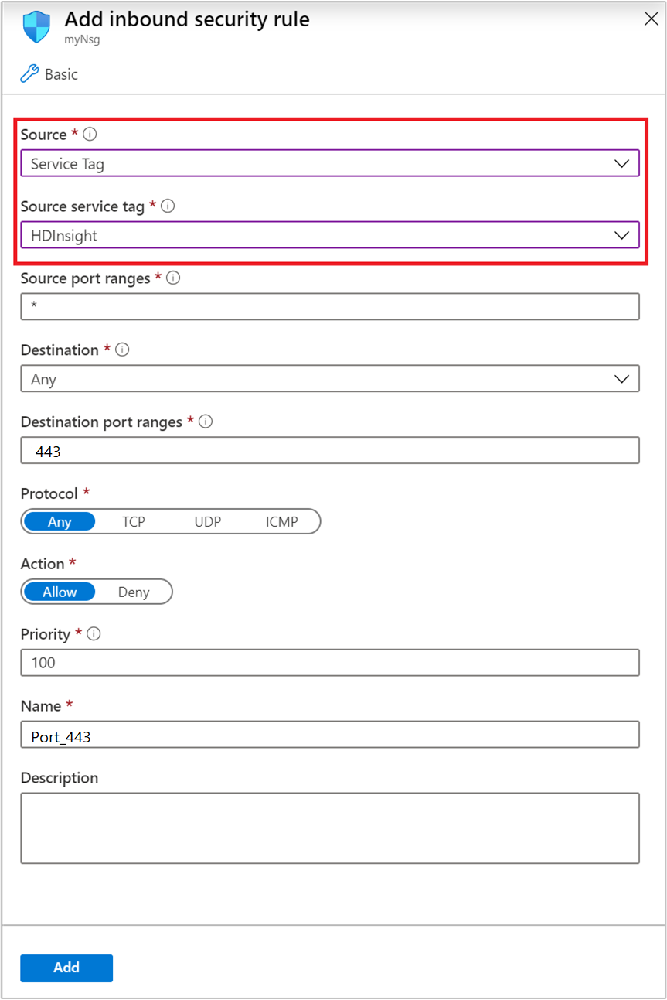

# NSG service tags for Azure HDInsight

Azure HDInsight service tags for network security groups (NSGs) are groups of IP addresses for health and management services. These groups help minimize complexity for security rule creation. [Service tags](../virtual-network/security-overview.md#service-tags) allow inbound traffic from specific IPs without entering each of the [management IP addresses](hdinsight-management-ip-addresses.md) in your NSGs.

The HDInsight service manages these service tags. You can't create your own service tag or modify an existing tag. Microsoft manages the address prefixes that match to the service tag and automatically updates the service tag as addresses change.

## Get started with service tags

You have two options for using service tags in your network security groups:

- **Use a single global HDInsight service tag**: This option opens your virtual network to all IP addresses that the HDInsight service uses to monitor clusters across all regions. This option is the simplest method, but might not be appropriate if you have restrictive security requirements.

- **Use multiple regional service tags**: This option opens your virtual network to only the IP addresses that HDInsight uses in that specific region. However, if you're using multiple regions, you'll need to add multiple service tags to your virtual network.

## Use a single global HDInsight service tag

The easiest way to begin using service tags with your HDInsight cluster is to add the global tag `HDInsight` to an NSG rule.

1. From the [Azure portal](https://portal.azure.com/), select your network security group.

1. Under **Settings**, select **Inbound security rules**, and then select **+ Add**.

1. From the **Source** drop-down list, select **Service Tag**.

1. From the **Source service tag** drop-down list, select **HDInsight**.

    

This tag contains the IP addresses of health and management services for all regions where HDInsight is available. The tag will ensure that your cluster can communicate with the necessary health and management services no matter where it's created.

## Use regional HDInsight service tags

If the global tag option won't work because you need more restrictive permissions, you can allow only the service tags  applicable for your region. There may be multiple service tags, depending on the region where your cluster is created.

To find out which service tags to add for your region, read the following sections of the article.

### Use a single regional service tag

If your cluster is located in a region listed in this table, you only need to add a single regional service tag to your NSG.

| Country | Region | Service tag |
| ---- | ---- | ---- |
| Australia | Australia East | HDInsight.AustraliaEast |
| &nbsp; | Australia Southeast | HDInsight.AustraliaSoutheast |
| &nbsp; | Australia Central | HDInsight.AustraliaCentral |
| China | China East 2 | HDInsight.ChinaEast2 |
| &nbsp; | China North 2 | HDInsight.ChinaNorth2 |
| United States | North Central US | HDInsight.NorthCentralUS |
| &nbsp; | West US 2 | HDInsight.WestUS2 |
| &nbsp; | West Central US | HDInsight.WestCentralUS |
| Canada | Canada East | HDInsight.CanadaEast |
| Brazil | Brazil South | HDInsight.BrazilSouth |
| Korea | Korea Central | HDInsight.KoreaCentral |
| &nbsp; | Korea South | HDInsight.KoreaSouth |
| India | Central India | HDInsight.CentralIndia |
| &nbsp; | South India | HDInsight.SouthIndia |
| Japan | Japan West | HDInsight.JapanWest |
| France | France Central| HDInsight.FranceCentral |
| UK | UK South | HDInsight.UKSouth |
| Azure Government | USDoD Central | HDInsight.USDoDCentral |
| &nbsp; | USGov Texas | HDInsight.USGovTexas |
| &nbsp; | UsDoD East | HDInsight.USDoDEast |
| &nbsp; | USGov Arizona | HDInsight.USGovArizona |

### Use multiple regional service tags

If the region where your cluster was created isn't listed in the preceding table, you need to allow multiple regional service tags. The need to use more than one is because of differences in the arrangement of resource providers for the various regions.

The remaining regions are divided into groups based on which regional service tags they use.

#### Group 1

If your cluster is created in one of the regions in the following table, allow the service tags `HDInsight.WestUS` and `HDInsight.EastUS`. Also, the regional service tag listed. Regions in this section require three service tags.

For example, if your cluster is created in the `East US 2` region, you'll need to add the following service tags to your network security group:

- `HDInsight.EastUS2`
- `HDInsight.WestUS`
- `HDInsight.EastUS`

| Country | Region | Service tag |
| ---- | ---- | ---- |
| United States | East US 2 | HDInsight.EastUS2 |
| &nbsp; | Central US | HDInsight.CentralUS |
| &nbsp; | NorthCentral US | HDInsight. NorthCentralUS |
| &nbsp; | South Central US | HDInsight.SouthCentralUS |
| &nbsp; | East US | HDInsight.EastUS |
| &nbsp; | West US | HDInsight.WestUS |
| Japan | Japan East | HDInsight.JapanEast |
| Europe | North Europe | HDInsight.NorthEurope |
| &nbsp; | West Europe| HDInsight.WestEurope |
| Asia | East Asia | HDInsight.EastAsia |
| &nbsp; | Southeast Asia | HDInsight.SoutheastAsia |
| Australia | Australia East | HDInsight.AustraliaEast |

#### Group 2

Clusters in the regions of *China North* and *China East* need to allow two service tags: `HDInsight.ChinaNorth` and `HDInsight.ChinaEast`.

#### Group 3

Clusters in the regions of *US Gov Iowa* and *US Gov Virginia* need to allow two service tags: `HDInsight.USGovIowa` and `HDInsight.USGovVirginia`.

#### Group 4

Clusters in the regions of *Germany Central* and *Germany Northeast* need to allow two service tags: `HDInsight.GermanyCentral` and `HDInsight.GermanyNortheast`.

## Next steps

- [Network security groups: service tags](../virtual-network/security-overview.md#security-rules)
- [Create virtual networks for Azure HDInsight clusters](hdinsight-create-virtual-network.md)
