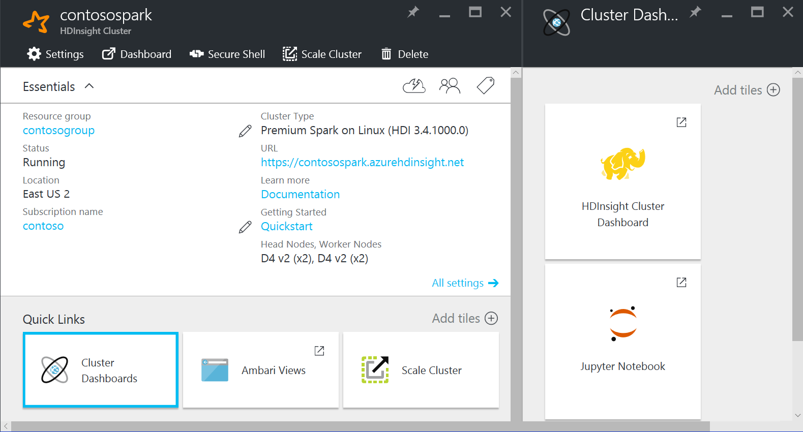

<properties
pageTitle="Analyze Application Insight logs with Spark on HDInsight | Azure"
description="Learn how to export Application Insight logs to blob storage, and then analyze the logs with Spark on HDInsight."
services="hdinsight"
documentationCenter=""
authors="Blackmist"
manager="paulettm"
editor="cgronlun"/>

<tags
ms.service="hdinsight"
ms.devlang="na"
ms.topic="article"
ms.tgt_pltfrm="na"
ms.workload="big-data"
ms.date="08/11/2016"
ms.author="larryfr"/>

# Analyze Application Insights telemetry logs with Spark on HDInsight

[Visual Studio Application Insights](../application-insights/app-insights-overview.md) is an analytics service that monitors your web applications. Telemetry data generated by Application Insights can be exported to Azure Storage, and from there it can be analyzed by HDInsight.

In this document, you will learn how to use HDInsight to analyze Application Insight telemetry data using Apache Spark.

## Prerequisites

* An Azure subscription.

* An application that is configured to use Application Insights. 

* Familiarity with creating a Linux-based HDInsight cluster. If you are not familiar with creating a cluster, see [Create Spark on HDInsight](hdinsight-apache-spark-jupyter-spark-sql.md) for more information.

    > [AZURE.NOTE] This document does not provide a walk-through of creating a new cluster, but does provide guidance on how to add access to the Application Insights telemetry to an existing or new HDInsight cluster.

* A web browser. This will be used to run interactively run analysis using a Jupyter Notebook.

The following were used in developing and testing this document:

* Application Insights telemetry data was generated using a [Node.js web app configured to use Application Insights](../application-insights/app-insights-nodejs.md).

* A Linux-based Spark on HDInsight cluster version 3.4 was used to analyze the data.

## Architecture and planning

The following diagram illustrates the overall architecture of this example:

### Azure storage

An HDInsight cluster can directly access block blobs from an Azure storage account, and Application Insights can be configured to continuously export telemetry information to blobs in Azure storage. However, there are some things to take into consideration when planning the storage account that you will use:

* __Location__: The storage account should be located in the same region as HDInsight in order to reduce latency and egress charges when moving data from one region to another.

* __Blob type__: HDInsight only supports block blobs. Application Insights defaults to using block blobs, so should work by default with HDInsight.

* __Access permissions__: If you use the same storage account for both Application Insights continuous export and HDInsight's default storage, HDInsight will have full access to the Application Insight telemetry data. This increases the chance that the data may be accidentally modified or deleted.

    Instead, it is recommended that you use separate storage accounts for HDInsight and Application Insights telemetry, and [use Shared Access Signatures (SAS) to restrict access to the data from HDInsight](hdinsight-storage-sharedaccesssignature-permissions.md). Using an SAS allows you to grant HDInsight read-only access to the telemetry data.

### Data schema

Application Insights provides [export data model](../application-insights/app-insights-export-data-model.md) information for the telemetry data format exported to blobs. The steps in this document use Spark SQL to work with the data; Spark SQL can automatically generate a schema for the JSON data structure logged by Application Insights, so you should not have to manually define the schema when performing analysis.

## Configure Application Insights to export telemetry

Follow the steps in [Set up Continous Export](../application-insights/app-insights-export-telemetry.md) to configure your Application Insights to export telemetry information to an Azure storage blob.

## Configure HDInsight to access the stored telemetry data

Use the information in [Use Shared Access Signatures (SAS) to restrict access to the data from HDInsight](hdinsight-storage-sharedaccesssignature-permissions.md) to create a shared access signature for the blob container that holds the exported telemetry. The SAS should provide read-only access to the data.

The Shared Access Signature document also provides information on how you can either add the SAS storage to an existing Linux-based Spark on HDInsight cluster, or add it when creating a new cluster.

## Analyze the data from Spark SQL using Python (PySpark)

1. From the [Azure Portal](https://portal.azure.com), select your Spark on HDInsight cluster. From the __Quick Links__ section, select __Cluster Dashboards__, and then select __Jupyter Notebook__ from the Cluster Dashboard__ blade.

    

2. In the upper right corner of the Jupyter page, select __New__, and then __PySpark__. This will open a new browser tab containing a Python-based Jupyter Notebook.

3. In the first field (called a __cell__) on the page, enter the following:

        sc._jsc.hadoopConfiguration().set('mapreduce.input.fileinputformat.input.dir.recursive', 'true')

    This configures Spark to recursively access the directory structure for the input data. Application Insights telemetry is logged into a directory structure similar to the following:

        /{telemetry type}/YYYY-MM-DD/{##}/
    
    Setting `mapreduce.input.fileinputformat.input.dir.recursive` to true allows you to specify the top level telemetry type (for example, __Requests__,) and retrieve data logged in all the subdirectories. 

4. Use __SHIFT+ENTER__ to run the code. On the left side of the cell, an '\*' will appear between the brackets to indicate that the code in this cell is being executed. Once it completes, the '\*' will change to a number, and output similiar to the following will be displayed below the cell:

        Creating SparkContext as 'sc'

        ID	YARN Application ID	Kind	State	Spark UI	Driver log	Current session?
        3	application_1468969497124_0001	pyspark	idle	Link	Link	✔

        Creating HiveContext as 'sqlContext'
        SparkContext and HiveContext created. Executing user code ...

5. A new cell will have been created below the first one. Enter the following in the new cell. Replace __CONTAINER__ and __STORAGEACCOUNT__ with the Azure storage account name and  blob container name that you used when configuring the Application Insights continuous export.

        %%bash
        hdfs dfs -ls wasb://CONTAINER@STORAGEACCOUNT.blob.core.windows.net/
    
    Use __SHIFT+ENTER__ to execute this cell. You will see a result similar to the following:

        Found 1 items
        drwxrwxrwx   -          0 1970-01-01 00:00 wasb://appinsights@contosostore.blob.core.windows.net/contosoappinsights_2bededa61bc741fbdee6b556571a4831
    
    The wasb path returned is the location of the Application Insights telemetry data. Change the `hdfs dfs -ls` line in the cell to use the wasb path returned, and then use __SHIFT+ENTER__ to run the cell again. This time, the results should display the directories that contain telemetry data.

    > [AZURE.NOTE] For the remainder of the steps in this document, the `wasb://appinsights@contosostore.blob.core.windows.net/contosoappinsights_2bededa61bc741fbdee6b556571a4831/Requests` directory was used. This directory may not exist unless your telemetry data is for a web app. If you are using telemetry data that does not include a requests directory, pick another directory and adjust the rest of the steps to use that directory and the schema for the data stored within it.

6. In the next cell, enter the following. Replace __WASB\_PATH__ with the path from the previous step.

        jsonFiles = sc.textFile('WASB_PATH')
        jsonData = sqlContext.read.json(jsonFiles)

    This creates a new dataframe from the JSON files exported by the continuous export process. Use __SHIFT+ENTER__ to run this cell.

7. In the next cell, enter and run the following to view the schema that Spark created for the JSON files:

        jsonData.printSchema()
    
    The schema for each type of telemetry will be different. The following is the schema that is generated for web requests (data stored in the `Requests` subdirectory):

        root
        |-- context: struct (nullable = true)
        |    |-- application: struct (nullable = true)
        |    |    |-- version: string (nullable = true)
        |    |-- custom: struct (nullable = true)
        |    |    |-- dimensions: array (nullable = true)
        |    |    |    |-- element: string (containsNull = true)
        |    |    |-- metrics: array (nullable = true)
        |    |    |    |-- element: string (containsNull = true)
        |    |-- data: struct (nullable = true)
        |    |    |-- eventTime: string (nullable = true)
        |    |    |-- isSynthetic: boolean (nullable = true)
        |    |    |-- samplingRate: double (nullable = true)
        |    |    |-- syntheticSource: string (nullable = true)
        |    |-- device: struct (nullable = true)
        |    |    |-- browser: string (nullable = true)
        |    |    |-- browserVersion: string (nullable = true)
        |    |    |-- deviceModel: string (nullable = true)
        |    |    |-- deviceName: string (nullable = true)
        |    |    |-- id: string (nullable = true)
        |    |    |-- osVersion: string (nullable = true)
        |    |    |-- type: string (nullable = true)
        |    |-- location: struct (nullable = true)
        |    |    |-- city: string (nullable = true)
        |    |    |-- clientip: string (nullable = true)
        |    |    |-- continent: string (nullable = true)
        |    |    |-- country: string (nullable = true)
        |    |    |-- province: string (nullable = true)
        |    |-- operation: struct (nullable = true)
        |    |    |-- name: string (nullable = true)
        |    |-- session: struct (nullable = true)
        |    |    |-- id: string (nullable = true)
        |    |    |-- isFirst: boolean (nullable = true)
        |    |-- user: struct (nullable = true)
        |    |    |-- anonId: string (nullable = true)
        |    |    |-- isAuthenticated: boolean (nullable = true)
        |-- internal: struct (nullable = true)
        |    |-- data: struct (nullable = true)
        |    |    |-- documentVersion: string (nullable = true)
        |    |    |-- id: string (nullable = true)
        |-- request: array (nullable = true)
        |    |-- element: struct (containsNull = true)
        |    |    |-- count: long (nullable = true)
        |    |    |-- durationMetric: struct (nullable = true)
        |    |    |    |-- count: double (nullable = true)
        |    |    |    |-- max: double (nullable = true)
        |    |    |    |-- min: double (nullable = true)
        |    |    |    |-- sampledValue: double (nullable = true)
        |    |    |    |-- stdDev: double (nullable = true)
        |    |    |    |-- value: double (nullable = true)
        |    |    |-- id: string (nullable = true)
        |    |    |-- name: string (nullable = true)
        |    |    |-- responseCode: long (nullable = true)
        |    |    |-- success: boolean (nullable = true)
        |    |    |-- url: string (nullable = true)
        |    |    |-- urlData: struct (nullable = true)
        |    |    |    |-- base: string (nullable = true)
        |    |    |    |-- hashTag: string (nullable = true)
        |    |    |    |-- host: string (nullable = true)
        |    |    |    |-- protocol: string (nullable = true)

8. Use the following to register the dataframe as a temporary table and run a query against the data:

        jsonData.registerTempTable("requests")
        sqlContext.sql("select context.location.city from requests where context.location.city is not null")

    This query will return the city information for the top 20 records where context.location.city is not null.

    > [AZURE.NOTE] The context structure is present in all telemetry logged by Application Insights; however, the city element may not be populated in your logs. Use the schema to identify other elements that you can query that may contain data for your logs.

    This query will return information similar to the following:

        +---------+
        |     city|
        +---------+
        | Bellevue|
        |  Redmond|
        |  Seattle|
        |Charlotte|
        ...
        +---------+

## Analyze the data from Spark SQL using Scala

1. From the [Azure Portal](https://portal.azure.com), select your Spark on HDInsight cluster. From the __Quick Links__ section, select __Cluster Dashboards__, and then select __Jupyter Notebook__ from the Cluster Dashboard__ blade.

    

2. In the upper right corner of the Jupyter page, select __New__, and then __Scala__. This will open a new browser tab containing a Scala-based Jupyter Notebook.

3. In the first field (called a __cell__) on the page, enter the following:

        sc.hadoopConfiguration.set("mapreduce.input.fileinputformat.input.dir.recursive", "true")

    This configures Spark to recursively access the directory structure for the input data. Application Insights telemetry is logged into a directory structure similar to the following:

        /{telemetry type}/YYYY-MM-DD/{##}/
    
    Setting `mapreduce.input.fileinputformat.input.dir.recursive` to true allows you to specify the top level telemetry type (for example, __Requests__,) and retrieve data logged in all the subdirectories. 

4. Use __SHIFT+ENTER__ to run the code. On the left side of the cell, an '\*' will appear between the brackets to indicate that the code in this cell is being executed. Once it completes, the '\*' will change to a number, and output similar to the following will be displayed below the cell:

        Creating SparkContext as 'sc'

        ID	YARN Application ID	Kind	State	Spark UI	Driver log	Current session?
        3	application_1468969497124_0001	spark	idle	Link	Link	✔

        Creating HiveContext as 'sqlContext'
        SparkContext and HiveContext created. Executing user code ...

5. A new cell will have been created below the first one. Enter the following in the new cell. Replace __CONTAINER__ and __STORAGEACCOUNT__ with the Azure storage account name and  blob container name that you used when configuring the Application Insights continuous export.

        %%bash
        hdfs dfs -ls wasb://CONTAINER@STORAGEACCOUNT.blob.core.windows.net/
    
    Use __SHIFT+ENTER__ to execute this cell. You will see a result similar to the following:

        Found 1 items
        drwxrwxrwx   -          0 1970-01-01 00:00 wasb://appinsights@contosostore.blob.core.windows.net/contosoappinsights_2bededa61bc741fbdee6b556571a4831
    
    The wasb path returned is the location of the Application Insights telemetry data. Change the `hdfs dfs -ls` line in the cell to use the wasb path returned, and then use __SHIFT+ENTER__ to run the cell again. This time, the results should display the directories that contain telemetry data.

    > [AZURE.NOTE] For the remainder of the steps in this document, the `wasb://appinsights@contosostore.blob.core.windows.net/contosoappinsights_2bededa61bc741fbdee6b556571a4831/Requests` directory was used. This directory may not exist unless your telemetry data is for a web app. If you are using telemetry data that does not include a requests directory, pick another directory and adjust the rest of the steps to use that directory and the schema for the data stored within it.

6. In the next cell, enter the following. Replace __WASB\_PATH__ with the path from the previous step.

        jsonFiles = sc.textFile('WASB_PATH')
        jsonData = sqlContext.read.json(jsonFiles)

    This creates a new dataframe from the JSON files exported by the continuous export process. Use __SHIFT+ENTER__ to run this cell.

7. In the next cell, enter and run the following to view the schema that Spark created for the JSON files:

        jsonData.printSchema
    
    The schema for each type of telemetry will be different. The following is the schema that is generated for web requests (data stored in the `Requests` subdirectory):

        root
        |-- context: struct (nullable = true)
        |    |-- application: struct (nullable = true)
        |    |    |-- version: string (nullable = true)
        |    |-- custom: struct (nullable = true)
        |    |    |-- dimensions: array (nullable = true)
        |    |    |    |-- element: string (containsNull = true)
        |    |    |-- metrics: array (nullable = true)
        |    |    |    |-- element: string (containsNull = true)
        |    |-- data: struct (nullable = true)
        |    |    |-- eventTime: string (nullable = true)
        |    |    |-- isSynthetic: boolean (nullable = true)
        |    |    |-- samplingRate: double (nullable = true)
        |    |    |-- syntheticSource: string (nullable = true)
        |    |-- device: struct (nullable = true)
        |    |    |-- browser: string (nullable = true)
        |    |    |-- browserVersion: string (nullable = true)
        |    |    |-- deviceModel: string (nullable = true)
        |    |    |-- deviceName: string (nullable = true)
        |    |    |-- id: string (nullable = true)
        |    |    |-- osVersion: string (nullable = true)
        |    |    |-- type: string (nullable = true)
        |    |-- location: struct (nullable = true)
        |    |    |-- city: string (nullable = true)
        |    |    |-- clientip: string (nullable = true)
        |    |    |-- continent: string (nullable = true)
        |    |    |-- country: string (nullable = true)
        |    |    |-- province: string (nullable = true)
        |    |-- operation: struct (nullable = true)
        |    |    |-- name: string (nullable = true)
        |    |-- session: struct (nullable = true)
        |    |    |-- id: string (nullable = true)
        |    |    |-- isFirst: boolean (nullable = true)
        |    |-- user: struct (nullable = true)
        |    |    |-- anonId: string (nullable = true)
        |    |    |-- isAuthenticated: boolean (nullable = true)
        |-- internal: struct (nullable = true)
        |    |-- data: struct (nullable = true)
        |    |    |-- documentVersion: string (nullable = true)
        |    |    |-- id: string (nullable = true)
        |-- request: array (nullable = true)
        |    |-- element: struct (containsNull = true)
        |    |    |-- count: long (nullable = true)
        |    |    |-- durationMetric: struct (nullable = true)
        |    |    |    |-- count: double (nullable = true)
        |    |    |    |-- max: double (nullable = true)
        |    |    |    |-- min: double (nullable = true)
        |    |    |    |-- sampledValue: double (nullable = true)
        |    |    |    |-- stdDev: double (nullable = true)
        |    |    |    |-- value: double (nullable = true)
        |    |    |-- id: string (nullable = true)
        |    |    |-- name: string (nullable = true)
        |    |    |-- responseCode: long (nullable = true)
        |    |    |-- success: boolean (nullable = true)
        |    |    |-- url: string (nullable = true)
        |    |    |-- urlData: struct (nullable = true)
        |    |    |    |-- base: string (nullable = true)
        |    |    |    |-- hashTag: string (nullable = true)
        |    |    |    |-- host: string (nullable = true)
        |    |    |    |-- protocol: string (nullable = true)

8. Use the following to register the dataframe as a temporary table and run a query against the data:

        jsonData.registerTempTable("requests")
        var city = sqlContext.sql("select context.location.city from requests where context.location.city is not null limit 10").show()

    This query will return the city information for the top 20 records where context.location.city is not null.

    > [AZURE.NOTE] The context structure is present in all telemetry logged by Application Insights; however, the city element may not be populated in your logs. Use the schema to identify other elements that you can query that may contain data for your logs.

    This query will return information similar to the following:

        +---------+
        |     city|
        +---------+
        | Bellevue|
        |  Redmond|
        |  Seattle|
        |Charlotte|
        ...
        +---------+

## Next steps

For more examples of using Spark to work with data and services in Azure, see the following documents:

* [Spark with BI: Perform interactive data analysis using Spark in HDInsight with BI tools](hdinsight-apache-spark-use-bi-tools.md)

* [Spark with Machine Learning: Use Spark in HDInsight for analyzing building temperature using HVAC data](hdinsight-apache-spark-ipython-notebook-machine-learning.md)

* [Spark with Machine Learning: Use Spark in HDInsight to predict food inspection results](hdinsight-apache-spark-machine-learning-mllib-ipython.md)

* [Spark Streaming: Use Spark in HDInsight for building real-time streaming applications](hdinsight-apache-spark-eventhub-streaming.md)

* [Website log analysis using Spark in HDInsight](hdinsight-apache-spark-custom-library-website-log-analysis.md)

For information on creating and running Spark applications, see the following documents:

* [Create a standalone application using Scala](hdinsight-apache-spark-create-standalone-application.md)

* [Run jobs remotely on a Spark cluster using Livy](hdinsight-apache-spark-livy-rest-interface.md)