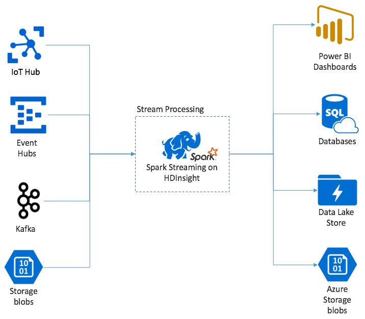

# What is Spark Streaming?

Spark Streaming enables you to implement scalable, high-throughput, fault-tolerant applications for data stream processing. You can run your Spark Streaming applications on HDInsight Spark clusters, and connect it to process data from a variety of sources such as Azure Event Hubs, Azure IoT Hub, Kafka, Flume, Twitter, ZeroMQ, raw TCP sockets, or even by monitoring the HDFS filesystem for changes. 

Spark Streaming creates a long running job during which you are able to apply transformations to the data (such as map, reduce, join and extract data by windows of time) and then push out the results to filesystems, databases, dashboards and the console. 

Spark Streaming takes a micro-batch approach to how it processes data. This means that it must first wait to collect a time-defined batch of events (usually configred in the range of less than a second to a few seconds), before it sends the batch of events on for processing. This is in contrast to approaches that would receive a single event and process that single event immediately. The benefit of the micro-batch approach, as you will see, is it lets more efficiently process data that is rapidly ingested into your solution and gives you an abstraction that makes applying aggregate calculations on the events a little easier. 

The design goals of Spark Streaming include low latency (measured in seconds) and linear scalability. However, what sets Spark Streaming apart are its support for fault tolerance with the guarantee that any given event would be processed exactly once, even in the face of a node failure. Additionally, Spark Streaming is integrated with the Spark core API, giving Spark developers a familiar programming model and new developers one less new framework to learn when first starting with Spark. 

## Introducing the DStream  
Spark Streaming represents a continous stream of data using a discretized stream or DStream. This DStream can be created from input sources like Event Hubs or Kafka, or by applying transformation on another DStream. 

The DStream represents a few layers of abstraction on top of the raw event data. To understand how they work, it helps to build up a DStream from a single event. 

Start with a single event, say a temperature reading from a connected thermostat. When this event arrives at your Spark Streaming application, the first thing that happens is the event is stored in a reliable way- it is replicated so that multiple nodes have a copy of your event. This ensures that the failure of any single node will not result in the loss of your event. Spark core has a data structure that distributes data across multiple nodes in the cluster, where each node generally maintains its data completely in-memory for best performance. This data structure is called a resilient distributed dataset or RDD. The temperature reading event will be stored in an RDD. 

Each RDD represents events collected over some user defined timeframe called the batch interval. Everytime the batch interval elapses a new RDD is produced that contains all the data in the interval of time that just completed. It is this continuous set of RDD's that are collected into a DStream. So for example, if the batch interval was configured to be 1 second long, your DStream emits a batch every second containing one RDD that contains all the data ingested during that second. When processing the DStream, the temperature event would appear in one of these batches. A Spark Streaming application that processes these events, processes the batches that contains the events and ultimately acts on the data stored in the RDD each batch contains. 

## Structure of a Spark Streaming Application
A Spark Streaming application is a long running application that receives data from ingest sources, applies transformation to process the data and then pushes the data out to one or more destinations. The structure of a Spark Streaming application has two main parts. First, you define the processing logic that includes where the data comes from, what processing to do on the data and where the results should go. Second, you run the defined application indefinitely, waiting for any signals to stop the long running application.

To give you a sense for the structure of a Spark Streaming Application, we will show a simple application that receives a line of text over a TCP socket and counts the number of times each word appears. 

### Define the application
The application definition consists of four main steps: creating a StreamingContext, creating a DStream from the StreamingContext, applying transformations to the DStream and ouputting the results. During this phase you are just describing the application logic, no actual transformations are applied or is output emitted until you run the application (as shown in the second phase).

#### Create a StreamingContext
Create a StreamingContext from the SparkContext that points to your cluster. When creating a StreamingContext you specify the size of the batch in seconds. In this example, we create the StreamingContext so it has a batch size of one second.

    val ssc = new StreamingContext(spark, Seconds(1))

#### Create a DStream
Using the StreamingContext instance you created, create an input DStream for your input source. In this case, we are opening watching for the appearance of new files in default storage attached to the HDInsight cluster. 

    val lines = ssc.textFileStream("/uploads/2017/01/")

#### Apply transformations
You implement the processing by applying transformations on the DStream. Our application will receive one line of text at a time from the file, split each line into words, and then follows the map reduce pattern to count the number of times each word appears.

    val words = lines.flatMap(_.split(" "))
    val pairs = words.map(word => (word, 1))
    val wordCounts = pairs.reduceByKey(_ + _)

#### Output results
Push the transformation results out to the destination systems by applying output operations. In this case, we show the result of each run thru the computation in the console output. 

    wordCounts.print()

### Run the application
Start the streaming application and run until a termination signal is received. 

    ssc.start()            
    ssc.awaitTermination()

For details on the Spark Stream API, along with the event sources, transformations and output operations it supports see [Spark Streaming Programming Guide](https://people.apache.org/~pwendell/spark-releases/latest/streaming-programming-guide.html).

Here is another sample application that is completely self-contained that you can run inside a [Jupyter Notebook](hdinsight-apache-spark-jupyter-notebook-kernels.md). In the example below, we create a mock data source in the class DummySource that outputs the value of a counter and the current time in milliseconds every 5 seconds. We create a new StreamingContext object that has a batch interval of 30 seconds. Every time a batch is created, it examines the RDD produced, converts it to a Spark DataFrame and creates a temporary table over the DataFrame. 

    class DummySource extends org.apache.spark.streaming.receiver.Receiver[(Int, Long)](org.apache.spark.storage.StorageLevel.MEMORY_AND_DISK_2) {

        /** Start the thread that simulates receiving data */
        def onStart() {
            new Thread("Dummy Source") { override def run() { receive() } }.start()
        }

        def onStop() {  }

        /** Periodically generate a random number from 0 to 9, and the timestamp */
        private def receive() {
            var counter = 0  
            while(!isStopped()) {
            store(Iterator((counter, System.currentTimeMillis)))
            counter += 1
            Thread.sleep(5000)
            }
        }
    }

    // A batch is created every 30 seconds
    val ssc = new org.apache.spark.streaming.StreamingContext(spark.sparkContext, org.apache.spark.streaming.Seconds(30))

    // Set the active SQLContext so that we can access it statically within the foreachRDD
    org.apache.spark.sql.SQLContext.setActive(spark.sqlContext)

    // Create the stream
    val stream = ssc.receiverStream(new DummySource())

    // Process RDDs in the batch
    stream.foreachRDD { rdd =>

        // Access the SQLContext and create a table called demo_numbers we can query
        val _sqlContext = org.apache.spark.sql.SQLContext.getOrCreate(rdd.sparkContext)
        _sqlContext.createDataFrame(rdd).toDF("value", "time")
            .registerTempTable("demo_numbers")
    } 

    // Start the stream processing
    ssc.start()

We can then query the DataFrame periodically to see the current set of values present in the batch. In this case, we use the following SQL query. 

    %%sql
    SELECT * FROM demo_numbers

The resulting output looks similar to the following:

| value	| time |
| --- | --- |
|10 | 1497314465256 |
|11 | 1497314470272 |
|12	| 1497314475289 |
|13	| 1497314480310 |
|14	| 1497314485327 |
|15	| 1497314490346 |

In the above expect six values in the typical case, because the DummySource creates a value every 5 seconds, and we emit a batch every 30 seconds.

## Sliding Windows
If you want to perform aggregate calculations on your DStream over some time period, for example to get an average temperature over the last 2 seconds, you can use the sliding window operations included with Spark Streaming. A sliding window is defined as having a duration (referred to as the window length) and the interval at which the window's content are evaluated (referred toas the slide interval). 

These sliding windows can overlap, for example you can define a window with a length of 2 seconds, that slides every 1 second. This means every time you perform an aggregation calculation, the window will include data from the last 1 second of the previous window as well as any new data in the next 1 second. 

By way of example, we can enhance the code that uses the DummySource above to first collect the batches into a window with a 1 minute duration, that slides by 1 minute as well.

    // A batch is created every 30 seconds
    val ssc = new org.apache.spark.streaming.StreamingContext(spark.sparkContext, org.apache.spark.streaming.Seconds(30))

    // Set the active SQLContext so that we can access it statically within the foreachRDD
    org.apache.spark.sql.SQLContext.setActive(spark.sqlContext)

    // Create the stream
    val stream = ssc.receiverStream(new DummySource())

    // Process batches in 1 minute windows
    stream.window(org.apache.spark.streaming.Minutes(1)).foreachRDD { rdd =>

        // Access the SQLContext and create a table called demo_numbers we can query
        val _sqlContext = org.apache.spark.sql.SQLContext.getOrCreate(rdd.sparkContext)
        _sqlContext.createDataFrame(rdd).toDF("value", "time")
        .registerTempTable("demo_numbers")
    } 

    // Start the stream processing
    ssc.start()

After the first minute, this will yield 12 entries or six entries from each of the two batches collected in the window.

| value	| time |
| --- | --- |
| 1 |	1497316294139 |
| 2 |	1497316299158
| 3	| 1497316304178
| 4	| 1497316309204
| 5	| 1497316314224
| 6	| 1497316319243
| 7	| 1497316324260
| 8	| 1497316329278
| 9	| 1497316334293
| 10 | 1497316339314
| 11 | 1497316344339
| 12 | 1497316349361

The sliding window functions available in the Spark Streaming API include window, countByWindow, reduceByWindow and countByValueAndWindow. For details on these functions see [Transformations on DStreams](https://people.apache.org/~pwendell/spark-releases/latest/streaming-programming-guide.html#transformations-on-dstreams).

## Checkpointing
In order to deliver resiliency and fault tolerance, Spark Streaming relies on checkpointing to insure that stream processing can continue uninterrupted, even in the face of node failures. In HDInsight, Spark creates checkpoints to durable storage (Azure Storage or Data Lake Store). These checkpoints store the metadata about the streaming application- such as the configuration, the operations defined by the application and any batches that were queued but not yet processed. In some cases, the checkpoints will also include the saving of the data in the RDD's to shorten the time it takes to rebuild the state of the data from what is presend in the RDD's managed by Spark. 

## Deploying Spark Streaming Applications
You typically build your Spark Streaming application locally and then deploy it to Spark on HDInsight by copying the JAR file that contains your application to the default storage attached to your HDInsight cluster. Then you can start your application by using the LIVY REST API's available from your cluster. This is a POST operation where the body of the POST includes a JSON document that provides the path to your JAR, the name of the class whose main method defines and runs the streaming application, and optionally the resource requirements of the job (e.g., number of executors, memory and cores), and any configuration settings your application code requires. 

The status of all applications can also be checked with a GET request against a LIVY endpoint. Finally, you can terminate a running application by issuing a DELETE request against the LIVE endpoint. For details on the LIVY API, see [Remote jobs with LIVY](hdinsight-apache-spark-livy-rest-interface.md)

## See also

* [Create an Apache Spark Cluster in HDInsight](hdinsight-hadoop-create-linux-clusters-portal.md)
* [Spark Streaming Programming Guide](https://people.apache.org/~pwendell/spark-releases/latest/streaming-programming-guide.html)
* [Launch Spark jobs remotely with LIVY](hdinsight-apache-spark-livy-rest-interface.md)