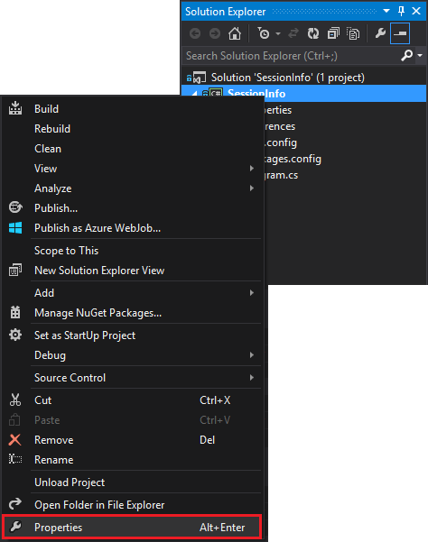
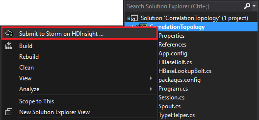
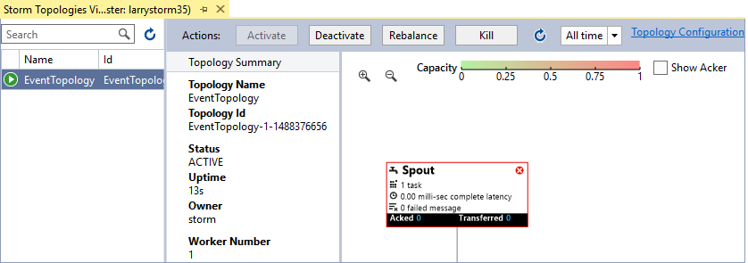

<properties
 pageTitle="Correlate events over time with Storm and HBase on HDInsight"
 description="Learn how to correlate events that arrive at different times by using Storm and HBase on HDInsight."
 services="hdinsight"
 documentationCenter=""
 authors="Blackmist"
 manager="paulettm"
 editor="cgronlun"
 tags="azure-portal"/>

<tags
 ms.service="hdinsight"
 ms.devlang="dotnet"
 ms.topic="article"
 ms.tgt_pltfrm="na"
 ms.workload="big-data"
 ms.date="07/05/2016"
 ms.author="larryfr"/>

# Correlate events over time with Storm and HBase on HDInsight

By using a persistent data store with Apache Storm, you can correlate data entries that arrive at different times. For example, linking login and logout events for a user session to calculate how long the session lasted.

In this document, you will learn how to create a basic C# Storm topology that tracks login and logout events for user sessions, and calculates the duration of the session. The topology uses HBase as a persistent data store. HBase also allows you to perform batch queries on the historical data to produce additional insights, such as how many user sessions were started or ended during a specific time period.

[AZURE.INCLUDE [windows-only](../../includes/hdinsight-windows-only.md)]

## Prerequisites

-	Visual Studio and the HDInsight tools for Visual Studio: See [Get started using the HDInsight tools for Visual Studio](../HDInsight/hdinsight-hadoop-visual-studio-tools-get-started.md) for installation information.

-	Apache Storm on HDInsight cluster (Windows-based). This runs the Storm topology, which processes incoming data and stores it to HBase.

-	Apache HBase on HDInsight cluster (Windows or Linux-based). This is the data store for this example.

## Architecture

Correlating events requires a common identifier for the event source. For example, a user ID, session ID, or other piece of data that is a) unique and b) included in all data sent to Storm. This example uses a GUID value to represent a session ID.

This example consists of two HDInsight clusters:

-	HBase: persistent data store for historical data

-	Storm: used to ingest incoming data

The data is randomly generated by the Storm topology, and consists of the following items:

-	Session ID: a GUID that uniquely identifies each session

-	Event: a START or END event. For this example, START always occurs before END

-	Time: the time of the event.

This data is processed and stored in HBase.

### Storm topology

When a session starts, a **START** event is received by the topology and logged to HBase. When an **END** event is received, the topology retrieves the **START** event and calculates the time between the two events. This **Duration** value is then stored in HBase along with the **END** event information.

> [AZURE.IMPORTANT] While this topology demonstrates the basic pattern, a production solution would need to take design for the following scenarios:
>
> - Events arriving out of order
> - Duplicate events
> - Dropped events

The sample topology is composed of the following components:

- 	Session.cs: simulates a user session by creating a random session ID, start time, and how long the session will last

- 	Spout.cs: creates 100 sessions, emits a START event, waits the random timeout for each session and then emits an END event. Then recycles ended sessions to generate new ones.

-	HBaseLookupBolt.cs: uses the session ID to look up session information from HBase. When an END event is processed, it finds the corresponding START event and calculates the duration of the session.

-	HBaseBolt.cs: Stores information into HBase.

-	TypeHelper.cs: Helps with type conversion when reading from/writing to HBase.

### HBase schema

In HBase, the data is stored in a table with the following schema/settings:

-	Row key: the session ID is used as the key for rows in this table

-	Column family: the family name is 'cf'. Columns stored in this family are:

	- 	event: START or END

	- 	time: the time in milliseconds that the event occured

	-	duration: the length between START and END event

-	VERSIONS: the 'cf' family is set to retain 5 versions of each row

	> [AZURE.NOTE] Versions are a log of previous values stored for a specific row key. By default, HBase only returns the value for the most recent version of a row. In this case, the same row is used for all events (START, END.) each version of a row is identified by the timestamp value. This provides a historical view of events logged for a specific ID.

## Download the project

The sample project can be downloaded from [https://github.com/Azure-Samples/hdinsight-storm-dotnet-event-correlation](https://github.com/Azure-Samples/hdinsight-storm-dotnet-event-correlation).

This download contains the following C# projects:

-	CorrelationTopology: C# Storm topology that randomly emits start and end events for user sessions. Each session lasts between 1 and 5 minutes.

-	SessionInfo: C# console application that creates the HBase table, and provides example queries to return information about stored session data.

## Create the table

1. Open the **SessionInfo** project in Visual Studio.

2. In **Solution Explorer**, right-click the **SessionInfo** project and select **Properties**.

	

3. Select **Settings**, then set the following values:

	- 	HBaseClusterURL: the URL to your HBase cluster. For example, https://myhbasecluster.azurehdinsight.net

	- 	HBaseClusterUserName: the admin/HTTP user account for your cluster

	- 	HBaseClusterPassword: the password for the admin/HTTP user account

	- 	HBaseTableName: the name of the table to use with this example

	-	HBaseTableColumnFamily: The column family name

	

5. Run the solution. When prompted, select the 'c' key to create the table on your HBase cluster.

## Build and deploy the Storm topology

1.	Open the **CorrelationTopology** solution in Visual Studio.

2.	In **Solution Explorer**, right click the **CorrelationTopology** project and select properties.

3.	In the properties window, select **Settings** and provide the following information. The first 5 should be the same values used by the **SessionInfo** project:

	- 	HBaseClusterURL: the URL to your HBase cluster. For example, https://myhbasecluster.azurehdinsight.net

	- 	HBaseClusterUserName: the admin/HTTP user account for your cluster

	- 	HBaseClusterPassword: the password for the admin/HTTP user account

	- 	HBaseTableName: the name of the table to use with this example. This should contain the same table name as that used in the SessionInfo project

	- 	HBaseTableColumnFamily: The column family name. This should contain the same column family name as that used in the SessionInfo project

	> [AZURE.IMPORTANT] Do not change the HBaseTableColumnNames, as the defaults are the names used by **SessionInfo** to retrieve data.

4.  Save the properties, then build the project.

5.	In **Solution Explorer**, right click the project and select **Submit to Storm on HDInsight**. If prompted, enter the credentials for your Azure subscription.

	

6.	In the **Submit Topology** dialog, select the Storm cluster that will run this topology.

	> [AZURE.NOTE] The first time you submit a topology, it may take a few seconds to retrieve the name of your HDInsight clusters.

7.	Once the topology has been uploaded and submitted to the cluster, the **Storm Topology View** will open and display the running topology. Select the **CorrelationTopology** and use the refresh button at the top right of the page to refresh the topology information.

	

	When the topology begins generating data, the value in the **Emitted** column will increment.

	> [AZURE.NOTE] If the **Storm Topology View** does not open automatically, use the following steps to open it:
	>
	> 1. In **Solution Explorer**, expand **Azure**, and then expand **HDInsight**.
	>
	> 2. Right click the Storm cluster that the topology is running on, and then select **View Storm Topologies**

## Query the data

Once data has been emitted, use the following steps to query the data.

1. Return to the **SessionInfo** project. If not running, start a new instance of it.

2. When prompted, select **s** to search for START event. You will be prompted to enter a start and end time to define a time range - only events between these two times will be returned.

	Use the following format when entering the start and end times: HH:MM and 'am' or 'pm'. For example, 11:20pm.

	Since the topology has just started, use a start time from before it was deployed, and an end time of now. This should capture most of the START events that were generated when it started. When the query runs, you should see a list of entries similar to the following:

		Session e6992b3e-79be-4991-afcf-5cb47dd1c81c started at 6/5/2015 6:10:15 PM. Timestamp = 1433527820737

Searching for END events works the same as START events. However, END events are generated randomly between 1 and 5 minutes after the START event. So you may have to try a few time ranges in order to find the END events. END events will also contain the duration of the session - the difference between the START event time and END event time. Here is an example of data for END events:

	Session fc9fa8e6-6892-4073-93b3-a587040d892e lasted 2 minutes, and ended at 6/5/2015 6:12:15 PM

> [AZURE.NOTE] While the time values you enter are in local time, the time returned from the query will be UTC.

##Stop the topology

When you are ready to stop the topology, return to the **CorrelationTopology** project in Visual Studio. In the **Storm Topology View**, select the topology and then use the **Kill** button at the top of the topology view.

##Delete your cluster

[AZURE.INCLUDE [delete-cluster-warning](../../includes/hdinsight-delete-cluster-warning.md)]

##Next steps

For more Storm examples, see [Example topologies for Storm on HDInsight](hdinsight-storm-example-topology.md).
 