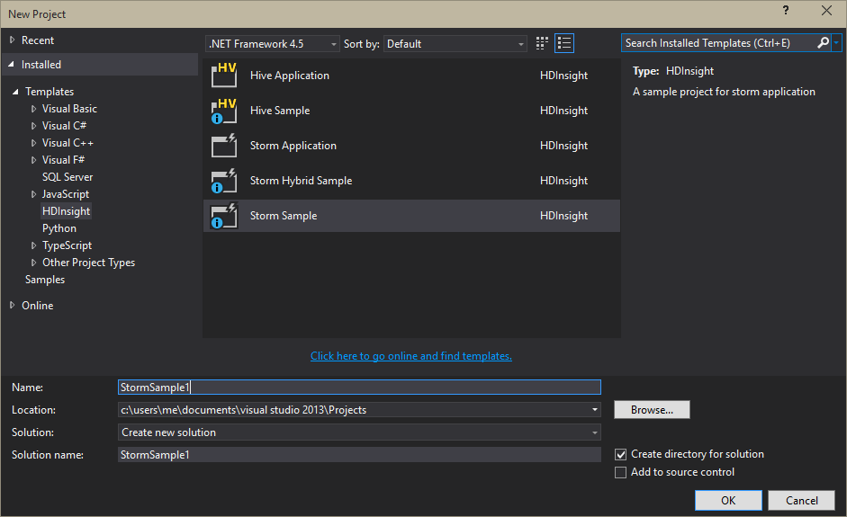

<properties
   pageTitle="Deploy and manage Apache Storm topologies on HDInsight | Microsoft Azure"
   description="Learn how to deploy, monitor and manage Apache Storm topologies using the Storm Dashboard on HDInsight. Use Hadoop tools for Visual Studio."
   services="hdinsight"
   documentationCenter=""
   authors="Blackmist"
   manager="paulettm"
   editor="cgronlun"
	tags="azure-portal"/>

<tags
   ms.service="hdinsight"
   ms.devlang="java"
   ms.topic="article"
   ms.tgt_pltfrm="na"
   ms.workload="big-data"
   ms.date="07/26/2016"
   ms.author="larryfr"/>

#Deploy and manage Apache Storm topologies on Windows-based HDInsight

The Storm Dashboard allows you to easily deploy and run Apache Storm topologies to your HDInsight cluster by using your web browser. You can also use the dashboard to monitor and manage running topologies. If you use Visual Studio, the HDInsight Tools for Visual Studio provide similar features in Visual Studio.

The Storm Dashboard and the Storm features in the HDInsight Tools rely on the Storm REST API, which can be used to create your own monitoring and management solutions.

> [AZURE.IMPORTANT] The steps in this document require a Windows-based Storm on HDInsight cluster. For information on using a Linux-based cluster, see [Deploy and manage Apache Storm topologies on Linux-based HDInsight](hdinsight-storm-deploy-monitor-topology-linux.md)

##Prerequisites

* **Apache Storm on HDInsight** - see <a href="../hdinsight-storm-getting-started/" target="_blank">Get started with Apache Storm on HDInsight</a> for steps on creating a cluster

* For the **Storm Dashboard**: A modern web browser that supports HTML5

* For **Visual Studio** - Azure SDK 2.5.1 or newer and the HDInsight Tools for Visual Studio. See <a href="../hdinsight-hadoop-visual-studio-tools-get-started/" target="_blank">Get started using HDInsight Tools for Visual Studio</a> to install and configure the HDInsight tools for Visual Studio.

	One of the following versions of Visual Studio:

	* Visual Studio 2012 with <a href="http://www.microsoft.com/download/details.aspx?id=39305" target="_blank">Update 4</a>

	* Visual Studio 2013 with <a href="http://www.microsoft.com/download/details.aspx?id=44921" target="_blank">Update 4</a> or <a href="http://go.microsoft.com/fwlink/?LinkId=517284" target="_blank">Visual Studio 2013 Community</a>

	* <a href="http://visualstudio.com/downloads/visual-studio-2015-ctp-vs" target="_blank">Visual Studio 2015 CTP6</a>

	> [AZURE.NOTE] Currently the HDInsight Tools for Visual Studio only support Storm on HDInsight cluster version 3.2.

##Storm Dashboard

The Storm Dashboard is a web page available on your Storm cluster. The URL is **https://&lt;clustername>.azurehdinsight.net/**, where **clustername** is the name of your Storm on HDInsight cluster.

From the top of the Storm Dashboard, select **Submit Topology**. Follow the instructions on the page to run a sample topology or to upload and run a topology that you created.

![the submit topology page][storm-dashboard-submit]

###Storm UI

From the Storm Dashboard, select the **Storm UI** link. This will display information about the cluster, in addition to any running topologies.

![the storm ui][storm-dashboard-ui]

> [AZURE.NOTE] With some versions of Internet Explorer, you may discover that the Storm UI does not refresh after you have first visited it. For example, it may not show the new topologies you submitted, or it may show a topology as active when you previously deactivated it. Microsoft is aware of this issue and is working on a solution.

####Main page

The main page of the Storm UI provides the following information:

* **Cluster summary**: Basic information about the Storm cluster.

* **Topology summary**: A list of running topologies. Use the links in this section to view more information about specific topologies.

* **Supervisor summary**: Information about the Storm supervisor.

* **Nimbus configuration**: Nimbus configuration for the cluster.

####Topology summary

Selecting a link from the **Topology summary** section displays the following information about the topology:

* **Topology summary**: Basic information about the topology.

* **Topology actions**: Management actions that you can perform for the topology.

	* **Activate**: Resumes processing of a deactivated topology.

	* **Deactivate**: Pauses a running topology.

	* **Rebalance**: Adjusts the parallelism of the topology. You should rebalance running topologies after you have changed the number of nodes in the cluster. This allows the topology to adjust parallelism to compensate for the increased or decreased number of nodes in the cluster.

		For more information, see <a href="http://storm.apache.org/documentation/Understanding-the-parallelism-of-a-Storm-topology.html" target="_blank">Understanding the parallelism of a Storm topology</a>.

	* **Kill**: Terminates a Storm topology after the specified timeout.

* **Topology stats**: Statistics about the topology. Use the links in the **Window** column to set the timeframe for the remaining entries on the page.

* **Spouts**: The spouts used by the topology. Use the links in this section to view more information about specific spouts.

* **Bolts**: The bolts used by the topology. Use the links in this section to view more information about specific bolts.

* **Topology configuration**: The configuration of the selected topology.

####Spout and Bolt summary

Selecting a spout from the **Spouts** or **Bolts** sections displays the following information about the selected item:

* **Component summary**: Basic information about the spout or bolt.

* **Spout/Bolt stats**: Statistics about the spout or bolt. Use the links in the **Window** column to set the timeframe for the remaining entries on the page.

* **Input stats** (bolt only): Information about the input streams consumed by the bolt.

* **Output stats**: Information about the streams emitted by this spout or bolt.

* **Executors**: Information about the instances of the spout or bolt. Select the **Port** entry for a specific executor to view a log of diagnostic information produced for this instance.

* **Errors**: Any error information for this spout or bolt.

##HDInsight Tools for Visual Studio

The HDInsight Tools can be used to submit C# or hybrid topologies to your Storm cluster. The following steps use a sample application. For information about creating your own topologies by using the HDInsight Tools, see [Develop C# topologies using the HDInsight Tools for Visual Studio](hdinsight-storm-develop-csharp-visual-studio-topology.md).

Use the following steps to deploy a sample to your Storm on HDInsight cluster, then view and manage the topology.

1. If you have not already installed the latest version of the HDInsight Tools for Visual Studio, see <a href="../hdinsight-hadoop-visual-studio-tools-get-started/" target="_blank">Get started using HDInsight Tools for Visual Studio</a>.

2. Open Visual Studio, select **File** > **New** > **Project**.

3. In the **New Project** dialog box, expand **Installed** > **Templates**, and then select **HDInsight**. From the list of templates, select **Storm Sample**. At the bottom of the dialog box, type a name for the application.

	

1. In **Solution Explorer**, right-click the project, and select **Submit to Storm on HDInsight**.

	> [AZURE.NOTE] If prompted, enter the login credentials for your Azure subscription. If you have more than one subscription, log in to the one that contains your Storm on HDInsight cluster.

2. Select your Storm on HDInsight cluster from the **Storm Cluster** drop-down list, and then select **Submit**. You can monitor whether the submission is successful by using the **Output** window.

3. When the topology has been successfully submitted, the **Storm Topologies** for the cluster should appear. Select the topology from the list to view information about the running topology.

	

	> [AZURE.NOTE] You can also view **Storm Topologies** from **Server Explorer** by expanding **Azure** > **HDInsight**, and then right-clicking a Storm on HDInsight cluster, and selecting **View Storm Topologies**.

	Select the shape for the spouts or bolts to view information about these components. A new window will open for each item selected.
    
    > [AZURE.NOTE] The name of the topology is the class name of the topology (in this case, `HelloWord`,) with a timestamp appended.

4. From the **Topology Summary** view, select **Kill** to stop the topology.

	> [AZURE.NOTE] Storm topologies continue running until they are stopped or the cluster is deleted.

##REST API

The Storm UI is built on top of the REST API, so you can perform similar management and monitoring functionality by using the REST API. You can use the REST API to create custom tools for managing and monitoring Storm topologies.

For more information, see [Storm UI REST API](https://github.com/apache/storm/blob/0.9.3-branch/STORM-UI-REST-API.md). The following information is specific to using the REST API with Apache Storm on HDInsight.

###Base URI

The base URI for the REST API on HDInsight clusters is **https://&lt;clustername>.azurehdinsight.net/stormui/api/v1/**, where **clustername** is the name of your Storm on HDInsight cluster.

###Authentication

Requests to the REST API must use **basic authentication**, so you use the HDInsight cluster administrator name and password.

> [AZURE.NOTE] Because basic authentication is sent by using clear text, you should **always** use HTTPS to secure communications with the cluster.

###Return values

Information that is returned from the REST API may only be usable from within the cluster or virtual machines on the same Azure Virtual Network as the cluster. For example, the fully qualified domain name (FQDN) returned for Zookeeper servers will not be accessible from the Internet.

##Next Steps

Now that you've learned how to deploy and monitor topologies by using the Storm Dashboard, learn how to:

* [Develop C# topologies using the HDInsight Tools for Visual Studio](hdinsight-storm-develop-csharp-visual-studio-topology.md)

* [Develop Java-based topologies using Maven](hdinsight-storm-develop-java-topology.md)

For a list of more example topologies, see [Example topologies for Storm on HDInsight](hdinsight-storm-example-topology.md).

[hdinsight-dashboard]: ./media/hdinsight-storm-deploy-monitor-topology/dashboard-link.png
[storm-dashboard-submit]: ./media/hdinsight-storm-deploy-monitor-topology/submit.png
[storm-dashboard-ui]: ./media/hdinsight-storm-deploy-monitor-topology/storm-ui-summary.png
