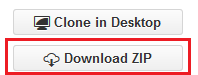
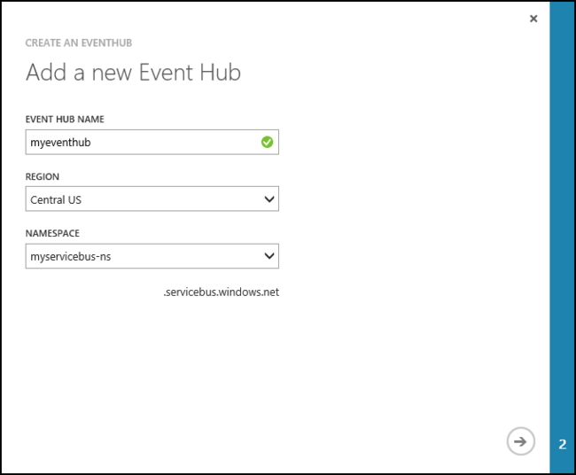
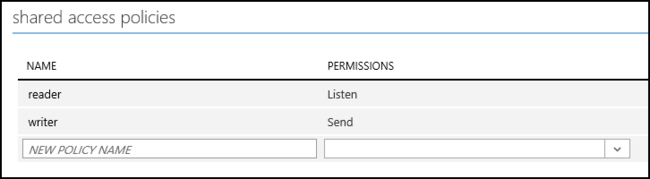
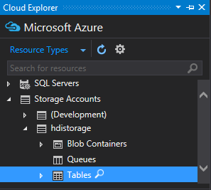
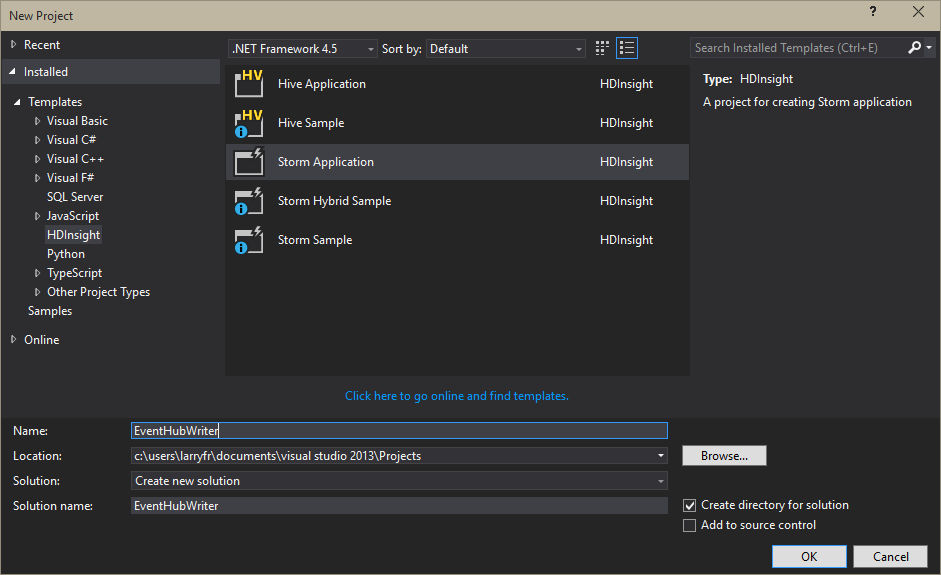
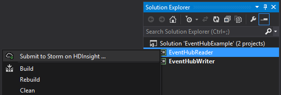
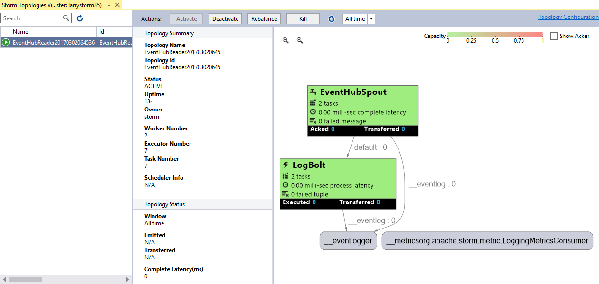
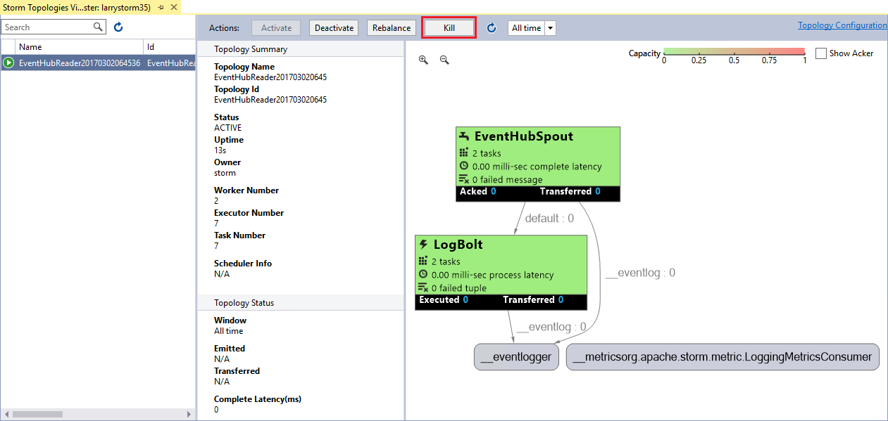

<properties
   pageTitle="Process events from Event Hubs with Storm on HDInsight | Microsoft Azure"
   description="Learn how to process Event Hubs data with a C# Storm topology created in Visual Studio using the HDInsight Tools for Visual Studio."
   services="hdinsight,notification hubs"
   documentationCenter=""
   authors="Blackmist"
   manager="paulettm"
   editor="cgronlun"/>

<tags
   ms.service="hdinsight"
   ms.devlang="dotnet"
   ms.topic="article"
   ms.tgt_pltfrm="na"
   ms.workload="big-data"
   ms.date="08/02/2016"
   ms.author="larryfr"/>

# Process events from Azure Event Hubs with Storm on HDInsight (C#)

Azure Event Hubs allows you to process massive amounts of data from websites, apps, and devices. The Event Hubs spout makes it easy to use Apache Storm on HDInsight to analyze this data in real time. You can also write data to Event Hubs from Storm by using the Event Hubs bolt.

In this tutorial, you will learn how to use the Visual Studio templates installed with HDInsight Tools for Visual Studio to create two topologies that work with Azure Event Hubs.

* **EventHubWriter**: Randomly generates data and writes it to Event Hubs

* **EventHubReader**: Reads data from Event Hubs and stores it in Azure Table storage

> [AZURE.NOTE] The steps in this document only work with a Windows-based HDInsight cluster. For a Java version of this project, which will work with either a Linux-based or Windows-based cluster, see [Process events from Azure Event Hubs with Storm on HDInsight (Java)](hdinsight-storm-develop-java-event-hub-topology.md).

## Prerequisites

* An [Apache Storm on HDInsight cluster](hdinsight-apache-storm-tutorial-get-started.md)

* An [Azure Event Hub](../event-hubs/event-hubs-csharp-ephcs-getstarted.md)

* The [Azure .NET SDK](http://azure.microsoft.com/downloads/)

* The [HDInsight Tools for Visual Studio](hdinsight-hadoop-visual-studio-tools-get-started.md)

## Completed project

You can download a complete version of the project created in this tutorial from GitHub: [eventhub-storm-hybrid](https://github.com/Azure-Samples/hdinsight-dotnet-java-storm-eventhub). However, you still need to provide configuration settings by following the steps in this tutorial.

> [AZURE.NOTE] When you use the completed project, you must use the **NuGet Package Manager** to restore the packages that are required by this solution.

## Event Hubs spout and bolt

The Event Hubs spout and bolt are Java components that allow you to easily work with Event Hubs from Apache Storm. Although these components are written in Java, the HDInsight Tools for Visual Studio allow you to create hybrid topologies that mix C# and Java components.

The spout and bolt are distributed as a single Java archive (.jar) file named **eventhubs-storm-spout-0.9-jar-with-dependencies.jar**.

### Download the .jar file

The most recent version of the **eventhubs-storm-spout-0.9-jar-with-dependencies.jar** file is included in the [HDInsight Storm examples](https://github.com/hdinsight/hdinsight-storm-examples) project under the **lib** folder. To download the file, use one of the following methods.

> [AZURE.NOTE] The spout and bolt have been submitted for inclusion in the Apache Storm project. For more information, see [STORM-583: Initial check-in for storm-event hubs](https://github.com/apache/storm/pull/336/files) in GitHub.

* **Download a ZIP file**: From the [HDInsight Storm examples](https://github.com/hdinsight/hdinsight-storm-examples) site, select **Download ZIP** in the right pane to download a .zip file that contains the project.

	

	After the file is downloaded, you can extract the archive, and the file will be in the **lib** directory.

* **Clone the project**: If you have [Git](http://git-scm.com/) installed, use the following command to clone the repository locally, then find the file in the **lib** directory.

		git clone https://github.com/hdinsight/hdinsight-storm-examples

## Configure Event Hubs

Event Hubs is the data source for this example. Use the following steps to create a new Event Hub.

1. From the [Azure Classic Portal](https://manage.windowsazure.com), select **NEW** > __APP SERVICES__ > **SERVICE BUS** > **EVENT HUB** > **CUSTOM CREATE**.

2. On the **Add a new Event Hub** screen, enter an **Event Hub Name**, select the **Region** to create the hub in, and create a new namespace or select an existing one. Click the **Arrow** to continue.

	

	> [AZURE.NOTE] You should select the same **Location** as your Storm on HDInsight server to reduce latency and costs.

2. On the **Configure Event Hub** screen, enter the **Partition count** and **Message Retention** values. For this example, use a partition count of 8 and a message retention of 1. Note the partition count because you will need this value later.

3. After the event hub has been created, select the namespace, select **Event Hubs**, and then select the event hub that you created earlier.

4. Select **Configure**, then create two new access policies by using the following information.

	| Name | Permissions |
    | ----- | ----- |
	| Writer | Send |
	| Reader | Listen |

	After You create the permissions, select the **Save** icon at the bottom of the page. This creates the shared access policies that will be used to send (writer) and listen (reader) to this Event Hub.

	

5. After you save the policies, use the **Shared access key generator** at the bottom of the page to retrieve the key for the **writer** and **reader** policies. Save these because they will be used later.

## Configure Table storage

Table storage will be used to hold the values that are read from Event Hubs because you can easily view Table storage from inside Visual Studio through **Server Explorer**. Use the following steps to create new Table storage:

1. From the [Azure Classic Portal](https://manage.windowsazure.com), select **NEW** > **Data Services** > **Storage** > **Quick Create**.

	

2. Enter a **Name** for the storage account, select a **Location**, and then click the **check mark** to create the storage account.

	> [AZURE.NOTE] You should select the same **Location** as your Event Hubs and Storm on HDInsight server to reduce latency and costs.

3. Once the new storage account has been created, select the account and then use the **Manage Access Keys** link at the bottom of the page to retrieve the **Storage Account Name** and **Primary Access Key**. Save this information because it will be used later.

	

4. Open Visual Studio. From the __View__ menu, select __Cloud Explorer__. In __Cloud Explorer__, expand __Storage Accounts__, and then the storage account you created earlier.

    

5. Right click __Tables__ for your storage account, and then select __Create Table__. When prompted, enter **events** as the name of your table. Save the name as you will need it in later steps.

## Create EventHubWriter

In this section, you will create a topology that writes data to Event Hubs by using the Event Hubs bolt.

1. If you have not already installed the latest version of the HDInsight Tools for Visual Studio, see [Get started using HDInsight Tools for Visual Studio](hdinsight-hadoop-visual-studio-tools-get-started.md).

2. Open Visual Studio, select **File** > **New** and then **Project**.

3. From the **New Project** screen, expand **Installed** > **Templates**, and select **HDInsight**. From the list of templates, select **Storm Application**. At the bottom of the screen, enter **EventHubWriter** as the name of the application.

	

4. After the project is created, you should have the following files:

	* **Program.cs**: This defines the topology for your project. Note that a default topology that consists of one spout and one bolt is created by default.

	* **Spout.cs**: An example spout.

	* **Bolt.cs**: An example bolt. This will be deleted because you will use the Event Hubs bolt to write to Event Hub.

### Configuration

1. In **Solution Explorer**, right-click **EventHubWriter**, and then select **Properties**.

2. In the project properties, select **Settings**, and then select **This project does not contain a default settings file. Click here to create one.**

3. Enter the following settings. Use the information for the Event Hub you created earlier in the **Value** column.

	| Name | Type | Scope |
    | ----- | ----- | ----- |
	| EventHubPolicyName | string | Application |
	| EventHubPolicyKey | string | Application |
	| EventHubNamespace | string | Application |
	| EventHubName | string | Application |
	| EventHubPartitionCount | int | Application |

4. Save and close the **Properties** page.

### Define the topology

1. In **Solution Explorer**, right-click **Bolt.cs**, and select **Delete**. You are using the Java Event Hubs bolt, so you do not need this file.

2. Open the **Program.cs** file and add the following code immediately after the `TopologyBuilder topologyBuilder = new TopologyBuilder("EventHubWriter" + DateTime.Now.ToString("yyyyMMddHHmmss"));` line.

		int partitionCount = Properties.Settings.Default.EventHubPartitionCount;
		List<string> javaDeserializerInfo =
            new List<string>() { "microsoft.scp.storm.multilang.CustomizedInteropJSONDeserializer", "java.lang.String" };

	The first line reads the partition count from the properties defined earlier. The second line defines a deserializer that is used to deseralize JSON data produced by the spout, into a `java.lang.String` so that Java components can consume the data.

4. Find the following code:

		topologyBuilder.SetSpout(
            "Spout",
            Spout.Get,
            new Dictionary<string, List<string>>()
            {
                {Constants.DEFAULT_STREAM_ID, new List<string>(){"count"}}
            },
            1);

	Replace it with the following:

		topologyBuilder.SetSpout(
            "Spout",
            Spout.Get,
            new Dictionary<string, List<string>>()
            {
                {Constants.DEFAULT_STREAM_ID, new List<string>(){"Event"}}
            },
            partitionCount).
            DeclareCustomizedJavaDeserializer(javaDeserializerInfo);

	This creates a spout and uses the Event Hubs partition count as the parallelism hint for this component. This should create an instance of the spout for each partition.

	This also associates the deserializer created previously with the output stream from this component. This allows the downstream EventHubSpout component to consume the data produced from the C# spout.

5. Immediately after the previous code, add the following:

		JavaComponentConstructor constructor =
            JavaComponentConstructor.CreateFromClojureExpr(
            String.Format(@"(com.microsoft.eventhubs.bolt.EventHubBolt. (com.microsoft.eventhubs.bolt.EventHubBoltConfig. " +
            @"""{0}"" ""{1}"" ""{2}"" ""{3}"" ""{4}"" {5}))",
            Properties.Settings.Default.EventHubPolicyName,
            Properties.Settings.Default.EventHubPolicyKey,
            Properties.Settings.Default.EventHubNamespace,
            "servicebus.windows.net", //suffix for servicebus fqdn
            Properties.Settings.Default.EventHubName,
			"true"));

	This creates a new constructor for the Java bolt, which is used at run time to configure a new instance of the bolt. In this case, you are using the <a href="http://storm.apache.org/documentation/Clojure-DSL.html" target="_blank">Apache Storm Clojure DSL</a> to configure the spout with the Event Hubs configuration information you added previously. More specifically, this code is used by HDInsight at run time to do the following:

	* Create a new instance of **com.microsoft.eventhubs.bolt.EventHubBoltConfig** using the Event Hubs information you provide.
	* Create a new instance of **com.microsoft.eventhubs.bolt.EventHubBolt**, passing in the **EventHubBoltConfig** instance.

6. Find the following code:

		topologyBuilder.SetBolt(
            "Bolt",
            Bolt.Get,
            new Dictionary<string, List<string>>(),
            1).shuffleGrouping("Spout");

	Replace it with the following:

		topologyBuilder.SetJavaBolt(
            "EventHubBolt",
            constructor,
            partitionCount).
            shuffleGrouping("Spout");

	This instructs the topology to use the **JavaComponentConstructor** from the previous step as the bolt. The component can be referred to in this topology by the friendly name of "EventHubBolt." The parallelism hint is set to the number of partitions for the Event Hub, and it subscribes to data produced by the spout ("Spout").

At this point, you are done with the **Program.cs**. The topology has been defined, but now you must modify **Spout.cs** so that it produces data in a format that the Event Hubs bolt can use.

> [AZURE.NOTE] This topology will default to creating one worker process, which is sufficient for example purposes. If you are adapting this for a production cluster, you should add the following to change the number of workers:

    StormConfig config = new StormConfig();
    config.setNumWorkers(1);
    topologyBuilder.SetTopologyConfig(config);

### Modify the spout

The Event Hubs bolt expects a single string value, which it will route to Event Hub. In the following example, you will modify the default **Spout.cs** file to produce a JSON string.

1. In **Solution Explorer**, open **Spout.cs** and add the following at the top of the file:

		using Newtonsoft.Json;
		using Newtonsoft.Json.Linq;

	This allows you to more easily work with JSON data.
    
    > [AZURE.NOTE] The JSON.NET package should already be installed, as it is required by the SCP.NET framework used for C# Storm topologies.

3. Find the following code:

		Dictionary<string, List<Type>> outputSchema = new Dictionary<string, List<Type>>();
        outputSchema.Add("default", new List<Type>() { typeof(int) });
        this.ctx.DeclareComponentSchema(new ComponentStreamSchema(null, outputSchema));

	Replace it with the following:

		Dictionary<string, List<Type>> outputSchema = new Dictionary<string, List<Type>>();
        outputSchema.Add("default", new List<Type>() { typeof(string) });
        this.ctx.DeclareComponentSchema(new ComponentStreamSchema(null, outputSchema));
        this.ctx.DeclareCustomizedSerializer(new CustomizedInteropJSONSerializer());

	This changes the definition of the data created by the spout to use **string** data, and the **CustomizedInteropJSONSerializer** declared earlier in the topology (in program.cs).

2. Replace the **NextTuple** method with the following:

		public void NextTuple(Dictionary<string, Object> parms)
        {
            JObject eventData = new JObject();
            eventData.Add("deviceId", r.Next(10));
            eventData.Add("deviceValue", r.Next());
            ctx.Emit(new Values(eventData.ToString(Formatting.None)));
        }

	This randomly generates a device ID, a value, and then uses Json.NET to emit a JSON object using these values.

3. Save the **Spout.cs** file.

At this point, you have a basic topology that will generate random data and store it in Event Hubs by using the Event Hubs bolt. Next, you will create the reader.

## Create EventHubReader

In this section, you will create a topology that reads data from Event Hubs by using the Event Hubs spout.

2. Open Visual Studio, select **File** > **New** > **Project**.

3. From the **New Project** screen, expand **Installed** > **Templates**, and select **HDInsight**. From the list of templates, select **Storm Application**. At the bottom of the screen, enter **EventHubReader** as the name of the application.

### Configuration

1. In **Solution Explorer**, right-click **EventHubReader** and then select **Properties**.

2. Select **Tools**, **NuGet Package Manager**, and then **Package Manager Console**. When the console appears, use the following command to install the Azure Storage packages.

        NuGet install WindowsAzure.Storage

2. In the project properties, select **Settings**, and then select **This project does not contain a default settings file. Click here to create one.**

3. Enter the following settings. Use the information for the Event Hub and storage account you created earlier in the **Value** column.

	| Name | Type | Scope |
    | ----- | ----- | ----- |
	| EventHubPolicyName | string | Application |
	| EventHubPolicyKey | string | Application |
	| EventHubNamespace | string | Application |
	| EventHubName | string | Application |
	| EventHubPartitionCount | int | Application |
	| StorageConnection | (Connection String) | Application |
	| TableName | string | Application |

	For **TableName**, enter the name of the table that you want events to be stored in.

    For **StorageConnection**, enter a value of `DefaultEndpointsProtocol=https;AccountName=myAccount;AccountKey=myKey;`. Replace **myAccount** and **myKey** with the storage account name and key obtained earlier.

	These values will be used by the topology to communicate with Event Hubs and Table Storage.

4. Save and close the **Properties** page.

### Define the topology

1. In **Solution Explorer**, right-click **Spout.cs** and select **Delete**. You are using the Java Event Hubs spout, so you do not need this file.

2. Open the **Program.cs** file and add the following code immediately after the `TopologyBuilder topologyBuilder = new TopologyBuilder("EventHubReader" + DateTime.Now.ToString("yyyyMMddHHmmss"));` line:

		int partitionCount = Properties.Settings.Default.EventHubPartitionCount;
		EventHubSpoutConfig ehConfig = new EventHubSpoutConfig(
                Properties.Settings.Default.EventHubPolicyName,
                Properties.Settings.Default.EventHubPolicyKey,
                Properties.Settings.Default.EventHubNamespace,
                Properties.Settings.Default.EventHubName,
                partitionCount);

	The partition count is read and assigned to a local variable. It will be used multiple times.

	The `EventHubSpoutConfig` defines the configuration for the Event Hub spout. In this case, the Event Hubs configuration information you added previously. Behind the scenes this uses the Java Event Hub spout, and will create a new instance of **com.microsoft.eventhubs.spout.EventHubSpoutConfig** using the Event Hubs information.

5. Find the following code:

		topologyBuilder.SetSpout(
            "Spout",
            Spout.Get,
            new Dictionary<string, List<string>>()
            {
                {Constants.DEFAULT_STREAM_ID, new List<string>(){"count"}}
            },
            1);

	Replace it with the following:

        topologyBuilder.SetEventHubSpout(
            "EventHubSpout", 
            ehConfig, 
            partitionCount); 

	This instructs the topology to create a new Event Hub spout and use the `EventHubSpoutConfig` from the previous step as the configuration. "EventHubSpout" sets the friendly name of the spout, and `partitionCount` is used to set the parallelism hint. Behind the scenes this creates a new instance of **com.microsoft.eventhubs.spout.EventHubSpout** Java component using the provided configuration information.

2. Add the following immediately after the previous code:

         List<string> javaSerializerInfo = new List<string>() { "microsoft.scp.storm.multilang.CustomizedInteropJSONSerializer" };

	This creates a custom serializer, which will be used to serialize information produced by the Java components (such as the EventHubSpout) into a JSON format that downstream C# components can use.

3. Find the following code:

		topologyBuilder.SetBolt(
            "Bolt",
            Bolt.Get,
            new Dictionary<string, List<string>>(),
            1).shuffleGrouping("Spout");

	Replace it with the following:

		topologyBuilder.SetBolt(
            "Bolt",
            Bolt.Get,
            new Dictionary<string, List<string>>(),
            partitionCount,
            true).
            DeclareCustomizedJavaSerializer(javaSerializerInfo).
            shuffleGrouping("EventHubSpout");

	This code instructs the topology to use a bolt (defined in Bolt.cs). The custom serializer defined earlier is used here so that this bolt can consume data produced by upstream Java components. In this case, the EventHubSpout.

    > [AZURE.IMPORTANT] The last parameter for SetBolt, (with a value of `true`,) enables ACK functionality for this bolt. This is required, as the EventHubSpout component expects an ACK for data that it emits. If ACKs are not returned by downstream components, the spout will stop receiving after processing around 1000 messages.

At this point, you are done with **Program.cs**. The topology has been defined, but now you must create a helper class to write data to Table storage, then you must modify **Bolt.cs** so that it can understand the data produced by the spout.

> [AZURE.NOTE] This topology will default to creating one worker process, which is sufficient for example purposes. If you are adapting this for a production cluster, you should can add the following to change the number of workers:

    StormConfig config = new StormConfig();
    config.setNumWorkers(1);
    topologyBuilder.SetTopologyConfig(config);

### Create a helper class

When writing data to Table storage, you must create a class that describes the data that will be written.

1. In **Solution Explorer**, right-click the **EventHubReader** project, and select **Add**, then **Class**. Name the new class **Device.cs**.

2. Open **Device.cs** and replace the default code with the following:

		using System;
		using System.Collections.Generic;
		using System.Linq;
		using System.Text;
		using System.Threading.Tasks;
		using Microsoft.WindowsAzure.Storage.Table;

		namespace EventHubReader
		{
		    class Device : TableEntity
		    {
		        public int value { get; set; }

		        public Device() { }
		        public Device(int id)
		        {
		            this.PartitionKey = id.ToString();
		            this.RowKey = System.Guid.NewGuid().ToString();
		        }
		    }
		}

	This creates entities in Table storage that consist of a partition key (which will be set to the device ID read from Event Hub,) a unique row key, and a value that is read from Event Hub. Each entity will also have a timestamp, which will be created automatically when the entity is inserted in the table.

### Modify the bolt

1. In **Solution Explorer**, expand the **EventHubReader** project and open the **Bolt.cs** file. Add the following at the top of the file:

		using Newtonsoft.Json.Linq;
		using Microsoft.WindowsAzure.Storage;
		using Microsoft.WindowsAzure.Storage.Table;

	This allows you to more easily work with JSON data from the bolt and write data to Table storage.

2. Find the `private int count;` statement and replace it with the following:

        private CloudTable table;

	This will be used when connecting to the table.

4. Find the following code:

		Dictionary<string, List<Type>> inputSchema = new Dictionary<string, List<Type>>();
        inputSchema.Add("default", new List<Type>() { typeof(int) });
        this.ctx.DeclareComponentSchema(new ComponentStreamSchema(inputSchema, null));

	Replace it with the following:

		Dictionary<string, List<Type>> inputSchema = new Dictionary<string, List<Type>>();
        inputSchema.Add("default", new List<Type>() { typeof(string) });
        this.ctx.DeclareComponentSchema(new ComponentStreamSchema(inputSchema, null));
        this.ctx.DeclareCustomizedDeserializer(new CustomizedInteropJSONDeserializer());

	This instructs the bolt that it will be receiving a **string** value instead of an **int**, and that the data should be deserialized using the **CustomizedInteropJSONDeserialzer** that was declared in the topology earlier (in the program.cs file).

3. Immediately after the previous code, add the following:

		CloudStorageAccount storageAccount = CloudStorageAccount.Parse(Properties.Settings.Default.StorageConnection);
        CloudTableClient tableClient = storageAccount.CreateCloudTableClient();
        table = tableClient.GetTableReference(Properties.Settings.Default.TableName);
        table.CreateIfNotExists();

	This connects to the Azure Storage table that you created earlier by using the connection string stored in `TableName`.

2. Find the **Execute** method and replace it with the following:

		public void Execute(SCPTuple tuple)
        {
            Context.Logger.Info("Processing events");
            string eventValue = (string)tuple.GetValue(0);
            if (eventValue != null)
            {
                JObject eventData = JObject.Parse(eventValue);

                Device device = new Device((int)eventData["deviceId"]);
                device.value = (int)eventData["deviceValue"];

                TableOperation insertOperation = TableOperation.Insert(device);

                table.Execute(insertOperation);
                this.ctx.Ack(tuple);
            }
        }

	This uses Json.NET to parse the JSON data from the spout, and then picks out the **deviceId** and **deviceValue** fields. A new **Device** object is then created by using the **deviceId** during initialization to set the partition key for the table. The value is then set to the **deviceValue**, and finally the entity is inserted into the table.

    After the entity is inserted into the table, `Ack()` is called for the tuple, to inform the spout that we have successfully processed the data.

    > [AZURE.IMPORTANT] The EventHubSpout component expects an ACK for each tuple from downstream components such as this bolt. If ACKS are not received, the EventHubSpout will assume processing for the tuple has failed.

At this point, you have a complete topology that will read data from Event Hub, and store it in Table Storage in the table you created earlier.

## Deploy the topologies

1. From **Solution Explorer**, right-click the **EventHubReader** project and select **Submit to Storm on HDInsight**.

	

2. On the **Submit Topology** screen, select your **Storm Cluster**. Expand **Additional Configurations**, select **Java File Paths**, select **...** and select the directory that contains the **eventhubs-storm-spout-0.9-jar-with-dependencies.jar** file that you downloaded earlier. Finally, click **Submit**.

	

3. When the topology has been submitted, the **Storm Topologies Viewer** will appear. Select the **EventHubReader** topology in the left pane to view statistics for the topology. Currently, nothing should be happening because no events have been written to Event Hubs yet.

	

4. From **Solution Explorer**, right-click the **EventHubWriter** project and select **Submit to Storm on HDInsight**.

2. On the **Submit Topology** screen, select your **Storm Cluster**. Expand **Additional Configurations**, select **Java File Paths**, select **...** and select the directory that contains the **eventhubs-storm-spout-0.9-jar-with-dependencies.jar** file you downloaded earlier. Finally, click **Submit**.

5. When the topology has been submitted, refresh the topology list in the **Storm Topologies Viewer** to verify that both topologies are running on the cluster.

6. When both topologies are running, select **Server Explorer**, then expand **Azure** > **Storage**, and select the Storage Account you created earlier. Under the Storage Account, expand **Tables**. Finally, double-click the **events** table to open the table. You should see data that has been stored in the table from the **EventHubReader** topology.

	* The events are being generated by the **EventHubWriter** topology, which writes them to Event Hub.

	* The **EventHubReader** then reads the events from Event Hubs and stores them in Table storage in the **events** table.

## Stop the topologies

To stop the topologies, select each topology in the **Storm Topology Viewer**, then click **Kill**.

##Delete your cluster

[AZURE.INCLUDE [delete-cluster-warning](../../includes/hdinsight-delete-cluster-warning.md)]

## Notes

### Checkpointing

The EventHubSpout periodically checkpoints its state to the Zookeeper node, which saves the current offset for messages read from the queue. This allows the component to start receiving messages at the saved offset in the following scenarios:

* The component instance fails and is restarted.

* You grow or shrink the cluster by adding or removing nodes.

* The topology is killed and restarted **with the same name**.

You can also export and import the persisted checkpoints to WASB (the Azure Storage used by your HDInsight cluster.) The scripts to do this are located on the Storm on HDInsight cluster, at **c:\apps\dist\storm-0.9.3.2.2.1.0-2340\zkdatatool-1.0\bin**.

>[AZURE.NOTE] The version number in the path may be different, as the version of Storm installed on the cluster may change in the future.

The scripts in this directory are:

* **stormmeta_import.cmd**: Import all Storm metadata from the cluster default storage container into Zookeeper.

* **stormmeta_export.cmd**: Export all Storm metadata from Zookeeper to the cluster default storage container.

* **stormmeta_delete.cmd**: Delete all Storm metadata from Zookeeper.

Export an import allows you to persist checkpoint data when you need to delete the cluster, but want to resume processing from the current offset in the hub when you bring a new cluster back online.

> [AZURE.NOTE] Since the data is persisted to the default storage container, the new cluster **must** use the same storage account and container as the previous cluster.

## Next Steps

In this document, you have learned how to use the Java Event Hubs Spout and Bolt from a C# topology to work with data in Azure Event Hub. To learn more about creating C# topologies, see the following.

* [Develop C# topologies for Apache Storm on HDInsight using Visual Studio](hdinsight-storm-develop-csharp-visual-studio-topology.md)

* [SCP programming guide](hdinsight-storm-scp-programming-guide.md)

* [Example topologies for Storm on HDInsight](hdinsight-storm-example-topology.md)
 
