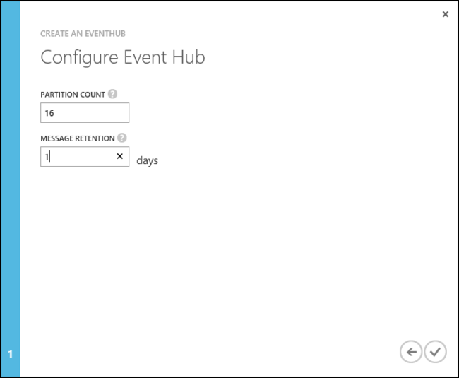

<properties
   pageTitle="Process events from Event Hubs with Storm on HDInsight using Java | Azure"
   description="Learn how to process Event Hubs data with a Java Storm topology created with Maven."
   services="hdinsight,notification hubs"
   documentationCenter=""
   authors="Blackmist"
   manager="paulettm"
   editor="cgronlun"/>

<tags
   ms.service="hdinsight"
   ms.devlang="dotnet"
   ms.topic="article"
   ms.tgt_pltfrm="na"
   ms.workload="big-data"
   ms.date="07/25/2016"
   ms.author="larryfr"/>

# Process events from Azure Event Hubs with Storm on HDInsight (Java)

Azure Event Hubs allows you to process massive amounts of data from websites, apps, and devices. The Event Hubs spout makes it easy to use Apache Storm on HDInsight to analyze this data in real time. You can also write data to Event Hubs from Storm by using the Event Hubs bolt.

In this tutorial, you will learn how to use the Event Hubs spout and bolt to read and write data in a Java-based Storm topology.

## Prerequisites

* An Apache Storm on HDInsight cluster. Use one of the following getting started articles to create a cluster:

    - A [Linux-based Storm on HDInsight cluster](hdinsight-apache-storm-tutorial-get-started-linux.md): Select this if you want to use SSH to work with the cluster from Linux, Unix, OS X, or Windows clients

    - A [Windows-based Storm on HDInsight cluster](hdinsight-apache-storm-tutorial-get-started.md): Select this if you want to use PowerShell to work with the cluster from a Windows client

    > [AZURE.NOTE] The steps in this document are based on using a Storm on HDInsight cluster 3.3 or higher. These clusters provide Storm 0.10.0, and Hadoop 2.7, which reduce the number of steps required to get this example working.
    >
    > For a version of this example that works with Storm 0.9.3 on HDInsight 3.2, see the [Storm v0.9.3](https://github.com/Azure-Samples/hdinsight-java-storm-eventhub/tree/Storm_v0.9.3) branch of the example repository.

* An [Azure Event Hub](../event-hubs/event-hubs-csharp-ephcs-getstarted.md)

* [Oracle Java Developer Kit (JDK) version 7](https://www.oracle.com/technetwork/java/javase/downloads/jdk7-downloads-1880260.html) or equivalent, such as [OpenJDK](http://openjdk.java.net/)

* [Maven](https://maven.apache.org/download.cgi): Maven is a project build system for Java projects

* A text editor or Java integrated development environment (IDE)

	> [AZURE.NOTE] Your editor or IDE may have specific functionality for working with Maven that is not addressed in this document. For information about the capabilities of your editing environment, see the documentation for the product you are using.

 * An SSH client. See one of the following articles for more information on using SSH with HDInsight:

    - [Use SSH with Linux-based Hadoop on HDInsight from Linux, Unix, or OS X](hdinsight-hadoop-linux-use-ssh-unix.md)

    - [Use SSH with Linux-based Hadoop on HDInsight from Windows](hdinsight-hadoop-linux-use-ssh-windows.md)

* An SCP client. This is provided with all Linux, Unix, and OS X systems. For Windows clients, we recommend PSCP, which is available from the [PuTTY download page](http://www.chiark.greenend.org.uk/~sgtatham/putty/download.html).

##Understanding the example

The [hdinsight-java-storm-eventhub](https://github.com/Azure-Samples/hdinsight-java-storm-eventhub) example contains two topologies:

__com.microsoft.example.EventHubWriter__ writes random data to an Azure Event Hub. The data is generated by a spout, and is a random device ID and device value. So it's simulating some hardware that emits a string ID and a numeric value.

__com.microsoft.example.EventHubReader__ reads data from Event Hub (the data written by EventHubWriter,) and stores it to HDFS (WASB in this case, since this was written and tested with Azure HDInsight) in the /devicedata directory.

The data is formatted as a JSON document before it is written to Event Hub, and when read by the reader it is parsed out of JSON and into tuples. The JSON format is as follows:

    { "deviceId": "unique identifier", "deviceValue": some value }

The reason for using a JSON document to store the data into Event Hub is so that we know what the format is, instead of relying on the internal formatting mechanics of the Event Hub Spout and Bolt.

###Project configuration

The **POM.xml** file contains configuration information for this Maven project. The interesting pieces are:

####The EventHubs Storm Spout dependency

    <dependency>
      <groupId>org.apache.storm</groupId>
      <artifactId>storm-eventhubs</artifactId>
      <version>0.10.0</version>
    </dependency>

This adds a dependency for the storm-eventhubs package, which contains both a spout for reading from Event Hubs, and a bolt for writing to it.

> [AZURE.NOTE] This package is only available for Storm version 0.10.0 and higher. When using Storm 0.9.3, you must manually install the spout package provided by Microsoft. For an example of working with Storm 0.9.3, see the [Storm v0.9.3](https://github.com/Azure-Samples/hdinsight-java-storm-eventhub/tree/Storm_v0.9.3) branch of the example repository.

####The HdfsBolt and WASB components

The HdfsBolt is normally used to store data to the Hadoop Distributed File System HDFS. However HDInsight clusters use Azure Storage (WASB) as the default data store, so we have to load several components that allow HdfsBolt to understand the WASB file system.

      <!--HdfsBolt stuff -->
        <dependency>
        <groupId>org.apache.storm</groupId>
        <artifactId>storm-hdfs</artifactId>
        <exclusions>
            <exclusion>
            <groupId>org.apache.hadoop</groupId>
            <artifactId>hadoop-client</artifactId>
            </exclusion>
            <exclusion>
            <groupId>org.apache.hadoop</groupId>
            <artifactId>hadoop-hdfs</artifactId>
            </exclusion>
        </exclusions>
        <version>0.10.0</version>
        </dependency>
    <!--So HdfsBolt knows how to talk to WASB -->
    <dependency>
        <groupId>org.apache.hadoop</groupId>
        <artifactId>hadoop-client</artifactId>
        <version>2.7.1</version>
    </dependency>
    <dependency>
        <groupId>org.apache.hadoop</groupId>
        <artifactId>hadoop-hdfs</artifactId>
        <version>2.7.1</version>
    </dependency>
    <dependency>
        <groupId>org.apache.hadoop</groupId>
        <artifactId>hadoop-azure</artifactId>
        <version>2.7.1</version>
    </dependency>
    <dependency>
        <groupId>org.apache.hadoop</groupId>
        <artifactId>hadoop-common</artifactId>
        <version>2.7.1</version>
        <exclusions>
        <exclusion>
            <groupId>org.slf4j</groupId>
            <artifactId>slf4j-log4j12</artifactId>
        </exclusion>
        </exclusions>
    </dependency>

> [AZURE.NOTE] When working with an earlier version of HDInsight, such as version 3.2, you must manually register these components. For an example of this, along with the custom bits required for older HDInsight clusters, see the see the [Storm v0.9.3](https://github.com/Azure-Samples/hdinsight-java-storm-eventhub/tree/Storm_v0.9.3) branch of the example repository.

####The maven-compiler-plugin

    <plugin>
      <groupId>org.apache.maven.plugins</groupId>
      <artifactId>maven-compiler-plugin</artifactId>
      <version>2.3.2</version>
      <configuration>
        <source>1.7</source>
        <target>1.7</target>
      </configuration>
    </plugin>

This tells Maven that the project should be compiled with compatibility for Java 7, which is what is used by HDInsight clusters.

####The maven-shade-plugin

      <!-- build an uber jar -->
      <plugin>
        <groupId>org.apache.maven.plugins</groupId>
        <artifactId>maven-shade-plugin</artifactId>
        <version>2.3</version>
        <configuration>
          <transformers>
            <!-- Keep us from getting a can't overwrite file error -->
            <transformer implementation="org.apache.maven.plugins.shade.resource.ApacheLicenseResourceTransformer"/>
            <!-- Keep us from getting errors when trying to use WASB from the storm-hdfs bolt -->
            <transformer implementation="org.apache.maven.plugins.shade.resource.ServicesResourceTransformer"/>
          </transformers>
          <!-- Keep us from getting a bad signature error -->
          <filters>
            <filter>
                <artifact>*:*</artifact>
                <excludes>
                    <exclude>META-INF/*.SF</exclude>
                    <exclude>META-INF/*.DSA</exclude>
                    <exclude>META-INF/*.RSA</exclude>
                </excludes>
            </filter>
          </filters>
        </configuration>
        <executions>
          <execution>
            <phase>package</phase>
            <goals>
              <goal>shade</goal>
            </goals>
          </execution>
        </executions>
      </plugin>

This is used to package the solution into an uber jar that contains both the project code and required dependencies. It is also used to:

* Rename license files for the dependencies: if this isn't done it can result in an error at runtime on Windows-based HDInsight clusters.

* Exclude security/signatures: if this isn't done it can result in an error at runtime on the HDInsight cluster.

* Ensure that multiple implementations of the same interface are merged into one entry. If this isn't done, you will receive errors that the Storm-HDFS bolt doesn't understand how to communicate with the WASB file system.

####The exec-maven-plugin

    <plugin>
      <groupId>org.codehaus.mojo</groupId>
      <artifactId>exec-maven-plugin</artifactId>
      <version>1.2.1</version>
      <executions>
        <execution>
        <goals>
          <goal>exec</goal>
        </goals>
        </execution>
      </executions>
      <configuration>
        <executable>java</executable>
        <includeProjectDependencies>true</includeProjectDependencies>
        <includePluginDependencies>false</includePluginDependencies>
        <classpathScope>compile</classpathScope>
        <mainClass>${storm.topology}</mainClass>
      </configuration>
    </plugin>

This allows you to run the topology locally on your development environment using the following command:

    mvn compile exec:java -Dstorm.topology=<CLASSNAME>

For example, `mvn compile exec:java -Dstorm.topology=com.microsoft.example.EventHubWriter`.

####The resources section

    <resources>
      <resource>
        <directory>${basedir}/conf</directory>
        <filtering>false</filtering>
        <includes>
          <include>EventHubs.properties</include>
          <include>core-site.xml</include>
        </includes>
      </resource>
    </resources>

This defines resources required by the project:

- **EventHubs.properties**: contains information used to connect to an Azure Event Hub
- **core-site.xml**: contains information about the Azure Storage used by the HDInsight cluster.

You must populate both of these with information about your Event Hub and HDInsight cluster.

##Configure environment variables

The following environment variables may be set when you install Java and the JDK on your development workstation. However, you should check that they exist and that they contain the correct values for your system.

* **JAVA_HOME** - should point to the directory where the Java runtime environment (JRE) is installed. For example, in a Unix or Linux distribution, it should have a value similar to `/usr/lib/jvm/java-7-oracle`. In Windows, it would have a value similar to `c:\Program Files (x86)\Java\jre1.7`

* **PATH** - should contain the following paths:

	* **JAVA_HOME** (or the equivalent path)

	* **JAVA_HOME\bin** (or the equivalent path)

	* The directory where Maven is installed

## Configure Event Hub

Event Hubs is the data source for this example. Use the following steps to create a new Event Hub.

1. From the [Azure Classic Portal](https://manage.windowsazure.com), select **NEW** > **Service Bus** > **Event Hub** > **Custom Create**.

2. On the **Add a new Event Hub** screen, enter an **Event Hub Name**, select the **Region** to create the hub in, and create a new namespace or select an existing one. Click the **Arrow** to continue.

	

	> [AZURE.NOTE] You should select the same **Location** as your Storm on HDInsight server to reduce latency and costs.

2. On the **Configure Event Hub** screen, enter the **Partition count** and **Message Retention** values. For this example, use a partition count of 10 and a message retention of 1. Note the partition count because you will need this value later.

	

3. After the event hub has been created, select the namespace, select **Event Hubs**, and then select the event hub that you created earlier.

4. Select **Configure**, then create two new access policies by using the following information.

	<table>
	<tr><th>Name</th><th>Permissions</th></tr>
	<tr><td>Writer</td><td>Send</td></tr>
	<tr><td>Reader</td><td>Listen</td></tr>
	</table>

	After You create the permissions, select the **Save** icon at the bottom of the page. This creates the shared access policies that will be used to send (writer) and listen (reader) to this Event Hub.

	

5. After you save the policies, use the **Shared access key generator** at the bottom of the page to retrieve the key for the **writer** and **reader** policies. Save these because they will be used later.

## Download and build the project

1. Download the project from GitHub: [hdinsight-java-storm-eventhub](https://github.com/Azure-Samples/hdinsight-java-storm-eventhub). You can either download the package as a zip archive, or use [git](https://git-scm.com/) to clone the project locally.

2. Use the following to build and package the project:

        mvn package

    This will download required dependencies, build, and then package the project. The output will be stored in the __/target__ directory as __EventHubExample-1.0-SNAPSHOT.jar__.

## Deploy the topologies

The jar created by this project contains two topologies; __com.microsoft.example.EventHubWriter__ and __com.microsoft.example.EventHubReader__. The EventHubWriter topology should be started first, as it writes events in to Event Hub that are then read by the EventHubReader.

###If using a Linux-based cluster

1. Use SCP to copy the jar package to your HDInsight cluster. Replace USERNAME with the SSH user for your cluster. Replace CLUSTERNAME with the name of your HDInsight cluster:

        scp ./target/EventHubExample-1.0-SNAPSHOT.jar USERNAME@CLUSTERNAME-ssh.azurehdinsight.net:.

    If you used a password for your SSH account, you will be prompted to enter the password. If you used an SSH key with the account, you may need to use the `-i` parameter to specify the path to the key file. For example, `scp -i ~/.ssh/id_rsa ./target/EventHubExample-1.0-SNAPSHOT.jar USERNAME@CLUSTERNAME-ssh.azurehdinsight.net:.`.

    > [AZURE.NOTE] If your client is a Windows workstation, you may not have an SCP command installed. We recommend PSCP, which can be downloaded from the [PuTTY download page](http://www.chiark.greenend.org.uk/~sgtatham/putty/download.html).

    This command will copy the file to the home directory of your SSH user on the cluster.

1. Once the file has finished uploading, use SSH to connect to the HDInsight cluster. Replace **USERNAME** the the name of your SSH login. Replace **CLUSTERNAME** with your HDInsight cluster name:

        ssh USERNAME@CLUSTERNAME-ssh.azurehdinsight.net

    > [AZURE.NOTE] If you used a password for your SSH account, you will be prompted to enter the password. If you used an SSH key with the account, you may need to use the `-i` parameter to specify the path to the key file. The following example will load the private key from `~/.ssh/id_rsa`:
    >
    > `ssh -i ~/.ssh/id_rsa USERNAME@CLUSTERNAME-ssh.azurehdinsight.net`

    If you are using PuTTY, enter `CLUSTERNAME-ssh.azurehdinsight.net` in the __Host Name (or IP address)__ field, and then click __Open__ to connect. You will be prompted to enter your SSH account name.

    > [AZURE.NOTE] If you used a password for your SSH account, you will be prompted to enter the password. If you used an SSH key with the account, you may need to use the following steps to select the key:
    >
    > 1. In **Category**, expand **Connection**, expand **SSH**, and select **Auth**.
    > 2. Click **Browse** and select the .ppk file that contains your private key.
    > 3. Click __Open__ to connect.

2. Use the following command to start the topologies:

        storm jar EventHubExample-1.0-SNAPSHOT.jar com.microsoft.example.EventHubWriter writer
        storm jar EventHubExample-1.0-SNAPSHOT.jar com.microsoft.example.EventHubReader reader

    This will start the topologies and give them a friendly name of "reader" and "writer".

3. Wait a minute or two to allow the topologies to write and read events from event hub, then use the following command to verify that the EventHubReader is storing data to your HDInsight storage:

        hadoop fs -ls /devicedata

    This should return a list of files similar to the following:

        -rw-r--r--   1 storm supergroup      10283 2015-08-11 19:35 /devicedata/wasbbolt-14-0-1439321744110.txt
        -rw-r--r--   1 storm supergroup      10277 2015-08-11 19:35 /devicedata/wasbbolt-14-1-1439321748237.txt
        -rw-r--r--   1 storm supergroup      10280 2015-08-11 19:36 /devicedata/wasbbolt-14-10-1439321760398.txt
        -rw-r--r--   1 storm supergroup      10267 2015-08-11 19:36 /devicedata/wasbbolt-14-11-1439321761090.txt
        -rw-r--r--   1 storm supergroup      10259 2015-08-11 19:36 /devicedata/wasbbolt-14-12-1439321762679.txt

    > [AZURE.NOTE] Some files may show a size of 0, as they have been created by the EventHubReader, but data has not been stored to them yet.

    You can view the contents of these files by using the following command:

        hadoop fs -text /devicedata/*.txt

    This will return data similar to the following:

        3409e622-c85d-4d64-8622-af45e30bf774,848981614
        c3305f7e-6948-4cce-89b0-d9fbc2330c36,-1638780537
        788b9796-e2ab-49c4-91e3-bc5b6af1f07e,-1662107246
        6403df8a-6495-402f-bca0-3244be67f225,275738503
        d7c7f96c-581a-45b1-b66c-e32de6d47fce,543829859
        9a692795-e6aa-4946-98c1-2de381b37593,1857409996
        3c8d199b-0003-4a79-8d03-24e13bde7086,-1271260574

    The first column contains the device ID value and the second column is the device value.

4. Use the following commands to stop the topologies:

        storm kill reader
        storm kill writer

###If using a Windows-based cluster

1. Open your browser to https://CLUSTERNAME.azurehdinsight.net. When prompted, enter the administrator credentials for your HDInsight cluster. You will arrive at the Storm Dashboard.

2. Use the __Jar File__ dropdown to browse and select the EventHubExample-1.0-SNAPSHOT.jar file from your build environment.

3. For __Class Name__, enter `com.mirosoft.example.EventHubWriter`.

4. For __Additional Parameters__, enter `writer`. Finally, click __Submit__ to upload the jar and start the EventHubWriter topology.

5. Once the topology has started, use the form to start the EventHubReader:

    * __Jar File__: select the EventHubExample-1.0-SNAPSHOT.jar that was previously uploaded
    * __Class Name__: enter `com.microsoft.example.EventHubReader`
    * __Additional Parameters__: enter `reader`

    Click submit to start the EventHubReader topology.

6. Wait a few minutes to allow the topologies to generate events and store then to Azure Storage, then select the __Hadoop Query Console__ tab at the top of the __Storm Dashboard__ page.

7. On the __Query Console__, select __Hive Editor__ and replace the default `select * from hivesampletable` with the following:

        create external table devicedata (deviceid string, devicevalue int) row format delimited fields terminated by ',' stored as textfile location 'wasbs:///devicedata/';
        select * from devicedata limit 10;

    Click __Select__ to run the query. This will return 10 rows from the data written to Azure Storage (WASB) by the EventHubReader. Once the query completes, you should see data similar to the following:

        3409e622-c85d-4d64-8622-af45e30bf774,848981614
        c3305f7e-6948-4cce-89b0-d9fbc2330c36,-1638780537
        788b9796-e2ab-49c4-91e3-bc5b6af1f07e,-1662107246
        6403df8a-6495-402f-bca0-3244be67f225,275738503
        d7c7f96c-581a-45b1-b66c-e32de6d47fce,543829859
        9a692795-e6aa-4946-98c1-2de381b37593,1857409996
        3c8d199b-0003-4a79-8d03-24e13bde7086,-1271260574

8. Select the __Storm Dashboard__ at the top of the page, then select __Storm UI__. From the __Storm UI__, select the link for the __reader__ topology and then use the __Kill__ button to stop the topology. Repeat the process for the __writer__ topology.

### Checkpointing

The EventHubSpout periodically checkpoints its state to the Zookeeper node, which saves the current offset for messages read from the queue. This allows the component to start receiving messages at the saved offset in the following scenarios:

* The component instance fails and is restarted.

* You grow or shrink the cluster by adding or removing nodes.

* The topology is killed and restarted **with the same name**.

####On Windows-based HDInsight clusters

You can export and import the persisted checkpoints to WASB (the Azure Storage used by your HDInsight cluster.) The scripts to do this are located on the Storm on HDInsight cluster, at **c:\apps\dist\storm-0.9.3.2.2.1.0-2340\zkdatatool-1.0\bin**.

>[AZURE.NOTE] The version number in the path may be different, as the version of Storm installed on the cluster may change in the future.

The scripts in this directory are:

* **stormmeta_import.cmd**: Import all Storm metadata from the cluster default storage container into Zookeeper.

* **stormmeta_export.cmd**: Export all Storm metadata from Zookeeper to the cluster default storage container.

* **stormmeta_delete.cmd**: Delete all Storm metadata from Zookeeper.

Export an import allows you to persist checkpoint data when you need to delete the cluster, but want to resume processing from the current offset in the hub when you bring a new cluster back online.

> [AZURE.NOTE] Since the data is persisted to the default storage container, the new cluster **must** use the same storage account and container as the previous cluster.

## Delete your cluster

[AZURE.INCLUDE [delete-cluster-warning](../../includes/hdinsight-delete-cluster-warning.md)]

##Troubleshooting

If you do not see files being stored to the the /devicedata location (either using the `hadoop fs -ls /devicedata` command or the Hive commandd in the Query Console,) use the Storm UI to look for any errors returned by the topologies.

For more information on using the Storm UI, see the following topics:

* If you are using a __Linux-based__ Storm on HDInsight cluster, see [Deploy and manage Apache Storm topologies on Linux-based HDInsight](hdinsight-storm-deploy-monitor-topology-linux.md)

* If you are using a __Windows-based__ Storm on HDInsight cluster, see [Deploy and manage Apache Storm topologies on Windows-based HDInsight](hdinsight-storm-deploy-monitor-topology-linux.md)

##Next steps

* [Example topologies for Storm on HDInsight](hdinsight-storm-example-topology.md)
