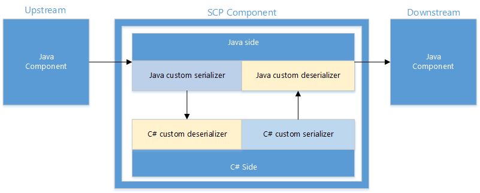

<properties
pageTitle="SCP.NET programming guide | Azure"
description="Learn how to use SCP.NET to create .NET-based Storm topologies for use with Storm on HDInsight."
services="hdinsight"
documentationCenter=""
authors="rperi"
manager="paulettm"
editor="cgronlun"/>

<tags
ms.service="hdinsight"
ms.devlang="dotnet"
ms.topic="article"
ms.tgt_pltfrm="na"
ms.workload="big-data"
ms.date="05/16/2016"
ms.author="raviperi"/>

#SCP programming guide

SCP is a platform to build real time, reliable, consistent and high performance data processing application. It is built on top of [Apache Storm](http://storm.incubator.apache.org/) -- a stream processing system designed by the OSS communities. Storm is designed by Nathan Marz and open sourced by Twitter. It leverages [Apache ZooKeeper](http://zookeeper.apache.org/), another Apache project to enable highly reliable distributed coordination and state management. 

Not only the SCP project ported Storm on Windows but also the project added extensions and customization for the Windows ecosystem. The extensions include .NET developer experience, and libraries, the customization includes Windows-based deployment. 

The extension and customization is done in such a way that we do not need to fork the OSS projects and we could leverage derived ecosystems built on top of Storm. 

## Processing model 

The data in SCP is modeled as continuous streams of tuples. Typically the tuples flow into some queue first, then picked up, and transformed by business logic hosted inside a Storm topology, finally the output could be piped as tuples to another SCP system, or be committed to stores like distributed file system or databases like SQL Server.

In Storm, an application topology defines a graph of computation. Each node in a topology contains processing logic, and links between nodes indicate data flow. The nodes to inject input data into the topology are called Spouts, which can be used to sequence the data. The input data could reside in file logs, transactional database, system performance counter etc. The nodes with both input and output data flows are called Bolts, which do the actual data filtering and selections and aggregation.

SCP supports best efforts, at-least-once and exactly-once data processing. In a distributed streaming processing application, various errors may happen during data processing, such as network outage, machine failure, or user code error etc. At-least-once processing ensures all data will be processed at least once by replaying automatically the same data when error happens. At-least-once processing is simple and reliable and suits well in many applications. However, when the application requires exact counting, for example, at-least-once processing is insufficient since the same data could potentially be played in the application topology. In that case, exactly-once processing is designed to make sure the result is correct even when the data may be replayed and processed multiple times.

SCP enables .NET developers to develop real time data process applications while leverage the Java Virtual Machine (JVM) based Storm under the cover. The .NET and JVM communicate via TCP local socket. Basically each Spout/Bolt is a .Net/Java process pair, where the user logic runs in .Net process as a plugin.

To build a data processing application on top of SCP, several steps are needed:

-   Design and implement the Spouts to pull in data from queue.

-   Design and implement Bolts to process the input data, and save data to external stores such as Database.

-   Design the topology, then submit and run the topology. The topology defines vertexes and the data flows between the vertexes. SCP will take the topology specification and deploy it on a Storm cluster, where each vertex runs on one logical node. The failover and scaling will be taken care of by the Storm task scheduler.

This document will use some simple examples to walk through how to build data processing application with SCP.

## SCP Plugin Interface 

SCP plugins (or applications) are standalone EXEs that can both run inside Visual Studio during the development phase, and be plugged into the Storm pipeline after deployment in production. Writing the SCP plugin is just the same as writing any other standard Windows console applications. SCP.NET platform declares some interface for spout/bolt, and the user plugin code should implement these interfaces. The main purpose of this design is that the user can focus on their own business logics, and leaving other things to be handled by SCP.NET platform.

The user plugin code should implement one of the followings interfaces, depends on whether the topology is transactional or non-transactional, and whether the component is spout or bolt.

-   ISCPSpout

-   ISCPBolt

-   ISCPTxSpout

-   ISCPBatchBolt

### ISCPPlugin

ISCPPlugin is the common interface for all kinds of plugins. Currently, it is a dummy interface.

	public interface ISCPPlugin 
	{
	}

### ISCPSpout

ISCPSpout is the interface for non-transactional spout.

	 public interface ISCPSpout : ISCPPlugin                    
	 {
		 void NextTuple(Dictionary<string, Object> parms);         
		 void Ack(long seqId, Dictionary<string, Object> parms);   
		 void Fail(long seqId, Dictionary<string, Object> parms);  
	 }

When `NextTuple()` is called, the C\# user code can emit one or more tuples. If there is nothing to emit, this method should return without emitting anything. It should be noted that `NextTuple()`, `Ack()`, and `Fail()` are all called in a tight loop in a single thread in C\# process. When there are no tuples to emit, it is courteous to have NextTuple sleep for a short amount of time (such as 10 milliseconds) so as not to waste too much CPU.

`Ack()` and `Fail()` will be called only when ack mechanism is enabled in spec file. The `seqId` is used to identify the tuple which is acked or failed. So if ack is enabled in non-transactional topology, the following emit function should be used in Spout:

	public abstract void Emit(string streamId, List<object> values, long seqId); 

If ack is not supported in non-transactional topology, the `Ack()` and `Fail()` can be left as empty function.

The `parms` input parameters in these functions are just empty Dictionary, they are reserved for future use.

### ISCPBolt

ISCPBolt is the interface for non-transactional bolt.

	public interface ISCPBolt : ISCPPlugin 
	{
	void Execute(SCPTuple tuple);           
	}

When new tuple is available, the `Execute()` function will be called to process it.

### ISCPTxSpout

ISCPTxSpout is the interface for transactional spout.

	public interface ISCPTxSpout : ISCPPlugin
	{
		void NextTx(out long seqId, Dictionary<string, Object> parms);  
		void Ack(long seqId, Dictionary<string, Object> parms);         
		void Fail(long seqId, Dictionary<string, Object> parms);        
	}

Just like their non-transactional counter-part, `NextTx()`, `Ack()`, and `Fail()` are all called in a tight loop in a single thread in C\# process. When there are no data to emit, it is courteous to have `NextTx` sleep for a short amount of time (10 milliseconds) so as not to waste too much CPU.

`NextTx()` is called to start a new transaction, the out parameter `seqId` is used to identify the transaction, which is also used in `Ack()` and `Fail()`. In `NextTx()`, user can emit data to Java side. The data will be stored in ZooKeeper to support replay. Because the capacity of ZooKeeper is very limited, user should only emit metadata, not bulk data in transactional spout.

Storm will replay a transaction automatically if it fails, so `Fail()` should not be called in normal case. But if SCP can check the metadata emitted by transactional spout, it can call `Fail()` when the metadata is invalid.

The `parms` input parameters in these functions are just empty Dictionary, they are reserved for future use.

### ISCPBatchBolt

ISCPBatchBolt is the interface for transactional bolt.

	public interface ISCPBatchBolt : ISCPPlugin           
	{
		void Execute(SCPTuple tuple);
		void FinishBatch(Dictionary<string, Object> parms);  
	}

`Execute()` is called when there is new tuple arriving at the bolt. `FinishBatch()` is called when this transaction is ended. The `parms` input parameter is reserved for future use.

For transactional topology, there is an important concept – `StormTxAttempt`. It has two fields, `TxId` and `AttemptId`. `TxId` is used to identify a specific transaction, and for a given transaction, there may be multiple attempt if the transaction fails and is replayed. SCP.NET will new a different ISCPBatchBolt object to process each `StormTxAttempt`, just like what Storm do in Java side. The purpose of this design is to support parallel transactions processing. User should keep it in mind that if transaction attempt is finished, the corresponding ISCPBatchBolt object will be destroyed and garbage collected.

## Object Model

SCP.NET also provides a simple set of key objects for developers to program with. They are **Context**, **StateStore**, and **SCPRuntime**. They will be discussed in the rest part of this section.

### Context

Context provides a running environment to the application. Each ISCPPlugin instance (ISCPSpout/ISCPBolt/ISCPTxSpout/ISCPBatchBolt) has a corresponding Context instance. The functionality provided by Context can be divided into two parts: (1) the static part which is available in the whole C\# process, (2) the dynamic part which is only available for the specific Context instance.

### Static Part

	public static ILogger Logger = null;
	public static SCPPluginType pluginType;                      
	public static Config Config { get; set; }                    
	public static TopologyContext TopologyContext { get; set; }  

`Logger` is provided for log purpose.

`pluginType` is used to indicate the plugin type of the C\# process. If the C\# process is run in local test mode (without Java), the plugin type is `SCP_NET_LOCAL`.

	public enum SCPPluginType 
	{
		SCP_NET_LOCAL = 0,       
		SCP_NET_SPOUT = 1,       
		SCP_NET_BOLT = 2,        
		SCP_NET_TX_SPOUT = 3,   
		SCP_NET_BATCH_BOLT = 4  
	}

`Config` is provided to get configuration parameters from Java side. The parameters are passed from Java side when C\# plugin is initialized. The `Config` parameters are divided into two parts: `stormConf` and `pluginConf`.

	public Dictionary<string, Object> stormConf { get; set; }  
	public Dictionary<string, Object> pluginConf { get; set; }  

`stormConf` is parameters defined by Storm and `pluginConf` is the parameters defined by SCP. For example:

	public class Constants
	{
		… …

		// constant string for pluginConf
		public static readonly String NONTRANSACTIONAL_ENABLE_ACK = "nontransactional.ack.enabled";  

		// constant string for stormConf
		public static readonly String STORM_ZOOKEEPER_SERVERS = "storm.zookeeper.servers";           
		public static readonly String STORM_ZOOKEEPER_PORT = "storm.zookeeper.port";                 
	}

`TopologyContext` is provided to get the topology context, it is most useful for components with multiple parallelism. Here is an example:

	//demo how to get TopologyContext info
	if (Context.pluginType != SCPPluginType.SCP_NET_LOCAL)                      
	{
		Context.Logger.Info("TopologyContext info:");
		TopologyContext topologyContext = Context.TopologyContext;                    
		Context.Logger.Info("taskId: {0}", topologyContext.GetThisTaskId());          
		taskIndex = topologyContext.GetThisTaskIndex();
		Context.Logger.Info("taskIndex: {0}", taskIndex);
		string componentId = topologyContext.GetThisComponentId();                    
		Context.Logger.Info("componentId: {0}", componentId);
		List<int> componentTasks = topologyContext.GetComponentTasks(componentId);  
		Context.Logger.Info("taskNum: {0}", componentTasks.Count);                    
	}

### Dynamic Part

The following interfaces are pertinent to a certain Context instance. The Context instance is created by SCP.NET platform and passed to the user code:

	\* Declare the Output and Input Stream Schemas \*                

	public void DeclareComponentSchema(ComponentStreamSchema schema);   

	\* Emit tuple to default stream. \*
	public abstract void Emit(List<object> values);                   

	\* Emit tuple to the specific stream. \*
	public abstract void Emit(string streamId, List<object> values);  

For non-transactional spout supporting ack, the following method is provided:

	\* for non-transactional Spout which supports ack \*
	public abstract void Emit(string streamId, List<object> values, long seqId);  

For non-transactional bolt supporting ack, it should explicitly `Ack()` or `Fail()` the tuple it received. And when emitting new tuple, it must also specify the anchors of the new tuple. The following methods are provided.

	public abstract void Emit(string streamId, IEnumerable<SCPTuple> anchors, List<object> values); 
	public abstract void Ack(SCPTuple tuple);
	public abstract void Fail(SCPTuple tuple);

### StateStore

`StateStore` provides metadata services, monotonic sequence generation, and wait-free coordination. Higher-level distributed concurrency abstractions can be built on `StateStore`, including distributed locks, distributed queues, barriers, and transaction services.

SCP applications may use the `State` object to persist some information in ZooKeeper, especially for transactional topology. Doing so, if transactional spout crashes and restart, it can retrieve the necessary information from ZooKeeper and restart the pipeline.

The `StateStore` object mainly has these methods:

	/// 

	/// Static method to retrieve a state store of the given path and connStr 
	/// 

	/// <param name="storePath">StateStore Path</param>
	/// <param name="connStr">StateStore Address</param>
	/// <returns>Instance of StateStore</returns>
	public static StateStore Get(string storePath, string connStr);

	/// 

	/// Create a new state object in this state store instance
	/// 

	/// <returns>State from StateStore</returns>
	public State Create();

	/// 

	/// Retrieve all states that were previously uncommitted, excluding all aborted states 
	/// 

	/// <returns>Uncommited States</returns>
	public IEnumerable<State> GetUnCommitted();

	/// 

	/// Get all the States in the StateStore
	/// 

	/// <returns>All the States</returns>
	public IEnumerable<State> States();

	/// 

	/// Get state or registry object
	/// 

	/// <param name="info">Registry Name(Registry only)</param>
	/// <typeparam name="T">Type, Registry or State</typeparam>
	/// <returns>Return Registry or State</returns>
	public T Get<T>(string info = null);

	/// 

	/// List all the committed states
	/// 

	/// <returns>Registries contain the Committed State </returns> 
	public IEnumerable<Registry> Commited();

	/// 

	/// List all the Aborted State in the StateStore
	/// 

	/// <returns>Registries contain the Aborted State</returns>
	public IEnumerable<Registry> Aborted();

	/// 

	/// Retrieve an existing state object from this state store instance 
	/// 

	/// <returns>State from StateStore</returns>
	/// <typeparam name="T">stateId, id of the State</typeparam>
	public State GetState(long stateId)

The `State` object mainly has these methods:

	/// 

	/// Set the status of the state object to commit 
	/// 

	public void Commit(bool simpleMode = true); 

	/// 

	/// Set the status of the state object to abort 
	/// 

	public void Abort();

	/// 

	/// Put an attribute value under the give key 
	/// 

	/// <param name="key">Key</param> 
	/// <param name="attribute">State Attribute</param> 
	public void PutAttribute<T>(string key, T attribute); 

	/// 

	/// Get the attribute value associated with the given key 
	/// 

	/// <param name="key">Key</param> 
	/// <returns>State Attribute</returns>               
	public T GetAttribute<T>(string key);                    

For the `Commit()` method, when simpleMode is set to true, it will simply delete the corresponding ZNode in ZooKeeper. Otherwise, it will delete the current ZNode, and adding a new node in the COMMITTED\_PATH.

### SCPRuntime

SCPRuntime provides the following two methods.

	public static void Initialize();
	
	public static void LaunchPlugin(newSCPPlugin createDelegate);  

`Initialize()` is used to initialize the SCP runtime environment. In this method, the C\# process will connect to the Java side, and gets configuration parameters and topology context.

`LaunchPlugin()` is used to kick off the message processing loop. In this loop, the C\# plugin will receive messages form Java side (including tuples and control signals), and then process the messages, perhaps calling the interface method provide by the user code. The input parameter for method `LaunchPlugin()` is a delegate that can return an object that implement ISCPSpout/IScpBolt/ISCPTxSpout/ISCPBatchBolt interface.

	public delegate ISCPPlugin newSCPPlugin(Context ctx, Dictionary\<string, Object\> parms); 

For ISCPBatchBolt, we can get `StormTxAttempt` from `parms`, and use it to judge whether it is a replayed attempt. This is usually done at the commit bolt, and it is demonstrated in the `HelloWorldTx` example.

Generally speaking, the SCP plugins may run in two modes here:

1. Local Test Mode: In this mode, the SCP plugins (the C\# user code) run inside Visual Studio during the development phase. `LocalContext` can be used in this mode, which provides method to serialize the emitted tuples to local files, and read them back to memory.

        public interface ILocalContext
        {
            List\<SCPTuple\> RecvFromMsgQueue();
            void WriteMsgQueueToFile(string filepath, bool append = false);  
            void ReadFromFileToMsgQueue(string filepath);                    
        }

2. Regular Mode: In this mode, the SCP plugins are launched by storm java process.

    Here is an example of launching SCP plugin:

        namespace Scp.App.HelloWorld
        {
        public class Generator : ISCPSpout
        {
            … …
            public static Generator Get(Context ctx, Dictionary<string, Object> parms)
            {
            return new Generator(ctx);
            }
        }
    
        class HelloWorld
        {
            static void Main(string[] args)
            {
            /* Setting the environment variable here can change the log file name */
            System.Environment.SetEnvironmentVariable("microsoft.scp.logPrefix", "HelloWorld");
    
            SCPRuntime.Initialize();
            SCPRuntime.LaunchPlugin(new newSCPPlugin(Generator.Get));
            }
        }
        }

## Topology Specification Language 

SCP Topology Specification is a domain specific language for describing and configuring SCP topologies. It is based on Storm’s Clojure DSL (<http://storm.incubator.apache.org/documentation/Clojure-DSL.html>) and is extended by SCP.

Topology specifications can be submitted directly to storm cluster for execution via the ***runspec*** command.

SCP.NET has add follow functions to define the Transactional Topology:

|**New Functions**|**Parameters**|**Description**|
|---|---|---|
|**tx-topolopy**|topology-name spout-map bolt-map|Define a transactional topology with the topology name, &nbsp;spouts definition map and the bolts definition map|
|**scp-tx-spout**|exec-name args fields|Define a transactional spout. It will run the application with ***exec-name*** using ***args***.  The ***fields*** is the Output Fields for spout|
|**scp-tx-batch-bolt**|exec-name args fields|Define a transactional Batch Bolt. It will run the application with ***exec-name*** using ***args.***  The Fields is the Output Fields for bolt.|
|**scp-tx-commit-bolt**|exec-name args fields|Define a transactional Committer Bolt. It will run the application with ***exec-name*** using ***args***.  The ***fields*** is the Output Fields for bolt|
|**nontx-topolopy**|topology-name spout-map bolt-map|Define a nontransactional topology with the topology name,&nbsp; spouts definition map and the bolts definition map|
|**scp-spout**|exec-name args fields parameters|Define a nontransactional spout. It will run the application with ***exec-name*** using ***args***.  The ***fields*** is the Output Fields for spout  The ***parameters*** is optional, using it to specify some parameters such as "nontransactional.ack.enabled".|
|**scp-bolt**|exec-name args fields parameters|Define a nontransactional Bolt. It will run the application with ***exec-name*** using ***args***.  The ***fields*** is the Output Fields for bolt  The ***parameters*** is optional, using it to specify some parameters such as "nontransactional.ack.enabled".|

SCP.NET has follow keys words defined:

|**Key Words**|**Description**|
|---|---|
|**:name**|Define the Topology Name|
|**:topology**|Define the Topology using the above functions and build in ones.|
|**:p**|Define the parallelism hint for each spout or bolt.|
|**:config**|Define configure parameter or update the existing ones|
|**:schema**|Define the Schema of Stream.|

And frequently-used parameters:

|**Parameter**|**Description**|
|---|---|
|**"plugin.name"**|exe file name of the C# plugin|
|**"plugin.args"**|plugin args|
|**"output.schema"**|Output schema|
|**"nontransactional.ack.enabled"**|Whether ack is enabled for nontransactional topology|

The runspec command will be deployed together with the bits, the usage is like:

	.\bin\runSpec.cmd
	usage: runSpec [spec-file target-dir [resource-dir] [-cp classpath]]
	ex: runSpec examples\HelloWorld\HelloWorld.spec specs examples\HelloWorld\Target

The ***resource-dir*** parameter is optional, you need to specify it when you want to plug a C\# application, and this directory will contain the application, the dependencies and configurations.

The ***classpath*** parameter is also optional. It is used to specify the Java classpath if the spec file contains Java Spout or Bolt.

## Miscellaneous Features

### Input and Output Schema Declaration

The user can emit tuple in C\# process, the platform needs to serialize the tuple into byte[], transfer to Java side, and Storm will transfer this tuple to the targets. Meanwhile in downstream component, the C\# process will receive tuple back from java side, and convert it to the original types by platform, all these operations are hidden by the Platform.

To support the serialization and deserialization, user code needs to declare the schema of the inputs and outputs.

The input/output stream schema is defined as a dictionary, the key is the StreamId and the value is the Types of the columns. The component can have multi-streams declared.

    public class ComponentStreamSchema
    {
        public Dictionary<string, List<Type>> InputStreamSchema { get; set; }
        public Dictionary<string, List<Type>> OutputStreamSchema { get; set; }
        public ComponentStreamSchema(Dictionary<string, List<Type>> input, Dictionary<string, List<Type>> output)
        {
            InputStreamSchema = input;
            OutputStreamSchema = output;
        }
    }

In Context object, we have the following API added:

	public void DeclareComponentSchema(ComponentStreamSchema schema)

User code must make sure the tuples emitted obey the schema defined for that stream, or the system will throw a runtime exception.

### Multi-Stream Support

SCP supports user code to emit or receive from multiple distinct streams at the same time. The support reflects in the Context object as the Emit method takes an optional stream ID parameter.

Two methods in the SCP.NET Context object have been added. They are used to emit Tuple or Tuples to specify StreamId. The StreamId is a string and it needs to be consistent in both C\# and the Topology Definition Spec.

        /* Emit tuple to the specific stream. */
        public abstract void Emit(string streamId, List<object> values);

        /* for non-transactional Spout only */
        public abstract void Emit(string streamId, List<object> values, long seqId);

The emitting to a non-existing stream will cause runtime exceptions.

### Fields Grouping

The build-in Fields Grouping in Strom is not working properly in SCP.NET. On the Java Proxy side, all the fields data types are actually byte[], and the fields grouping uses the byte[] object hash code to perform the grouping. The byte[] object hash code is the address of this object in memory. So the grouping will be wrong for two byte[] objects that share the same content but not the same address.

SCP.NET adds a customized grouping method, and it will use the content of the byte[] to do the grouping. In **SPEC** file, the syntax is like:

	(bolt-spec
	    {
	        "spout_test" (scp-field-group :non-tx [0,1])
	    }
	    …
	)

Here,

1.  "scp-field-group" means "Customized field grouping implemented by SCP".

2.  ":tx" or ":non-tx" means if it’s transactional topology. We need this information since the starting index is different in tx vs. non-tx topologies.

3.  [0,1] means a hashset of field Ids, starting from 0.

### Hybrid topology

The native Storm is written in Java. And SCP.Net has enhanced it to enable our customs to write C\# code to handle their business logic. But we also support hybrid topologies, which contains not only C\# spouts/bolts, but also Java Spout/Bolts.

### Specify Java Spout/Bolt in spec file

In spec file, "scp-spout" and "scp-bolt" can also be used to specify Java Spouts and Bolts, here is an example:

    (spout-spec 
      (microsoft.scp.example.HybridTopology.Generator.)           
      :p 1)

Here `microsoft.scp.example.HybridTopology.Generator` is the name of the Java Spout class.

### Specify Java Classpath in runSpec Command

If you want to submit topology containing Java Spouts or Bolts, you need to first compile the Java Spouts or Bolts and get the Jar files. Then you should specify the java classpath that contains the Jar files when submitting topology. Here is an example:

	bin\runSpec.cmd examples\HybridTopology\HybridTopology.spec specs examples\HybridTopology\net\Target -cp examples\HybridTopology\java\target\*

Here **examples\\HybridTopology\\java\\target\\** is the folder containing the Java Spout/Bolt Jar file.

### Serialization and Deserialization between Java and C\#

Our SCP component includes Java side and C\# side. In order to interact with native Java Spouts/Bolts, Serialization/Deserialization must be carried out between Java side and C\# side, as illustrated in the following graph.

1.  **Serialization in Java side and Deserialization in C\# side**
	
	First we provide default implementation for serialization in Java side and deserialization in C\# side. The serialization method in Java side can be specified in SPEC file:
	
        (scp-bolt
            {
                "plugin.name" "HybridTopology.exe"
                "plugin.args" ["displayer"]
                "output.schema" {}
                "customized.java.serializer" ["microsoft.scp.storm.multilang.CustomizedInteropJSONSerializer"]
            })
	
	The deserialization method in C\# side should be specified in C\# user code:
	
        Dictionary<string, List<Type>> inputSchema = new Dictionary<string, List<Type>>();
        inputSchema.Add("default", new List<Type>() { typeof(Person) });
        this.ctx.DeclareComponentSchema(new ComponentStreamSchema(inputSchema, null));
        this.ctx.DeclareCustomizedDeserializer(new CustomizedInteropJSONDeserializer());	        
	
    This default implementation should handle most cases if the data type is not too complex. For certain cases, either because the user data type is too complex, or because the performance of our default implementation does not meet the user's requirement, user can plug-in their own implementation.

    The serialize interface in java side is defined as:
	
        public interface ICustomizedInteropJavaSerializer {
            public void prepare(String[] args);
            public List<ByteBuffer> serialize(List<Object> objectList);
        }
	
	The deserialize interface in C\# side is defined as:
	
	public interface ICustomizedInteropCSharpDeserializer
	
	    public interface ICustomizedInteropCSharpDeserializer
	    {
	        List<Object> Deserialize(List<byte[]> dataList, List<Type> targetTypes);
	    }

2.  **Serialization in C\# side and Deserialization in Java side side**

	The serialization method in C\# side should be specified in C\# user code:
	
		this.ctx.DeclareCustomizedSerializer(new CustomizedInteropJSONSerializer()); 
	
	The Deserialization method in Java side should be specified in SPEC file:
	
	  (scp-spout
	    {
	      "plugin.name" "HybridTopology.exe"
	      "plugin.args" ["generator"]
	      "output.schema" {"default" ["person"]}
	      "customized.java.deserializer" ["microsoft.scp.storm.multilang.CustomizedInteropJSONDeserializer" "microsoft.scp.example.HybridTopology.Person"]
	    })
	
	Here "microsoft.scp.storm.multilang.CustomizedInteropJSONDeserializer" is the name of Deserializer, and "microsoft.scp.example.HybridTopology.Person" is the target class the data is deserialized to.
	
	User can also plug-in their own implementation of C\# serializer and Java Deserializer. This is the interface for C\# serializer:
	
	    public interface ICustomizedInteropCSharpSerializer
	    {
	        List<byte[]> Serialize(List<object> dataList);
	    }
	
	This is the interface for Java Deserializer:
	
	    public interface ICustomizedInteropJavaDeserializer {
	        public void prepare(String[] targetClassNames);
	        public List<Object> Deserialize(List<ByteBuffer> dataList);
	    }

## SCP Host Mode

In this mode, user can compile their codes to DLL, and use SCPHost.exe provided by SCP to submit topology. The spec file looks like this:

    (scp-spout
      {
        "plugin.name" "SCPHost.exe"
        "plugin.args" ["HelloWorld.dll" "Scp.App.HelloWorld.Generator" "Get"]
        "output.schema" {"default" ["sentence"]}
      })

Here, `plugin.name` is specified as `SCPHost.exe` provided by SCP SDK. SCPHost.exe which accepts exactly three parameters:

1.  The first one is the DLL name, which is `"HelloWorld.dll"` in this example.

2.  The second one is the Class name, which is `"Scp.App.HelloWorld.Generator"` in this example.

3.  The third one is the name of a public static method, which can be invoked to get an instance of ISCPPlugin.

In host mode, user code is compiled as DLL, and is invoked by SCP platform. So SCP platform can get full control of the whole processing logic. So we recommend our customers to submit topology in SCP host mode since it can simplify the development experience and bring us more flexibility and better backward compatibility for later release as well.

## SCP Programming Examples 

### HelloWorld

**HelloWorld** is a very simple example to show a taste of SCP.Net. It uses a non-transactional topology, with a spout called **generator**, and two bolts called **splitter** and **counter**. The spout **generator** will randomly generate some sentences, and emit these sentences to **splitter**. The bolt **splitter** will split the sentences to words and emit these words to **counter** bolt. The bolt "counter" uses a dictionary to record the occurrence number of each word.

There are two spec files, **HelloWorld.spec** and **HelloWorld\_EnableAck.spec** for this example. In the C\# code, it can find out whether ack is enabled by getting the pluginConf from Java side.

    /* demo how to get pluginConf info */
    if (Context.Config.pluginConf.ContainsKey(Constants.NONTRANSACTIONAL_ENABLE_ACK))
    {
        enableAck = (bool)(Context.Config.pluginConf[Constants.NONTRANSACTIONAL_ENABLE_ACK]);
    }
    Context.Logger.Info("enableAck: {0}", enableAck);

In the spout, if ack is enabled, a dictionary is used to cache the tuples that have not been acked. If Fail() is called, the failed tuple will be replayed:

    public void Fail(long seqId, Dictionary<string, Object> parms)
    {
        Context.Logger.Info("Fail, seqId: {0}", seqId);
        if (cachedTuples.ContainsKey(seqId))
        {
            /* get the cached tuple */
            string sentence = cachedTuples[seqId];

            /* replay the failed tuple */
            Context.Logger.Info("Re-Emit: {0}, seqId: {1}", sentence, seqId);
            this.ctx.Emit(Constants.DEFAULT_STREAM_ID, new Values(sentence), seqId);
        }
        else
        {
            Context.Logger.Warn("Fail(), can't find cached tuple for seqId {0}!", seqId);
        }
    }

### HelloWorldTx

The **HelloWorldTx** example demonstrates how to implement transactional topology. It have one spout called **generator**, a batch bolts called **partial-count**, and a commit bolt called **count-sum**. There are also three pre-created txt files: **DataSource0.txt**, **DataSource1.txt** and **DataSource2.txt**.

In each transaction, the spout **generator** will randomly choose two files from the pre-created three files, and emit the two file names to the **partial-count** bolt. The bolt **partial-count** will first get the file name from the received tuple, then open the file and count the number of words in this file, and finally emit the word number to the **count-sum** bolt. The **count-sum** bolt will summarize the total count.

To achieve **exactly once** semantics, the commit bolt **count-sum** need to judge whether it is a replayed transaction. In this example, it has a static member variable:

	public static long lastCommittedTxId = -1; 

When an ISCPBatchBolt instance is created, it will get the `txAttempt` from input parameters:

    public static CountSum Get(Context ctx, Dictionary<string, Object> parms)
    {
        /* for transactional topology, we can get txAttempt from the input parms */
        if (parms.ContainsKey(Constants.STORM_TX_ATTEMPT))
        {
            StormTxAttempt txAttempt = (StormTxAttempt)parms[Constants.STORM_TX_ATTEMPT];
            return new CountSum(ctx, txAttempt);
        }
        else
        {
            throw new Exception("null txAttempt");
        }
    }

When `FinishBatch()` is called, the `lastCommittedTxId` will be update if it is not a replayed transaction.

    public void FinishBatch(Dictionary<string, Object> parms)
    {
        /* judge whether it is a replayed transaction? */
        bool replay = (this.txAttempt.TxId <= lastCommittedTxId);
 
        if (!replay)
        {
            /* If it is not replayed, update the toalCount and lastCommittedTxId vaule */
            totalCount = totalCount + this.count;
            lastCommittedTxId = this.txAttempt.TxId;
        }
        … …
    }

### HybridTopology

This topology contains a Java Spout and a C\# Bolt. It uses the default serialization and deserialization implementation provided by SCP platform. Please ref the **HybridTopology.spec** in **examples\\HybridTopology** folder for the spec file details, and **SubmitTopology.bat** for how to specify Java classpath.

### SCPHostDemo

This example is the same as HelloWorld in essence. The only difference is that the user code is compiled as DLL and the topology is submitted by using SCPHost.exe. Please ref the section "SCP Host Mode" for more detailed explanation.

##Next Steps

For examples of Storm topologies created using SCP, see the following:

* [Develop C# topologies for Apache Storm on HDInsight using Visual Studio](hdinsight-storm-develop-csharp-visual-studio-topology.md)
* [Process events from Azure Event Hubs with Storm on HDInsight](hdinsight-storm-develop-csharp-event-hub-topology.md)
* [Create multiple data streams in a C# Storm topology](hdinsight-storm-twitter-trending.md)
* [Use Power Bi to visualize data from a Storm topology](hdinsight-storm-power-bi-topology.md)
* [Process vehicle sensor data from Event Hubs using Storm on HDInsight](https://github.com/hdinsight/hdinsight-storm-examples/tree/master/IotExample)
* [Extract, Transform, and Load (ETL) from Azure Event Hubs to HBase](https://github.com/hdinsight/hdinsight-storm-examples/blob/master/RealTimeETLExample)
* [Correlate events using Storm and HBase on HDInsight](hdinsight-storm-correlation-topology.md)