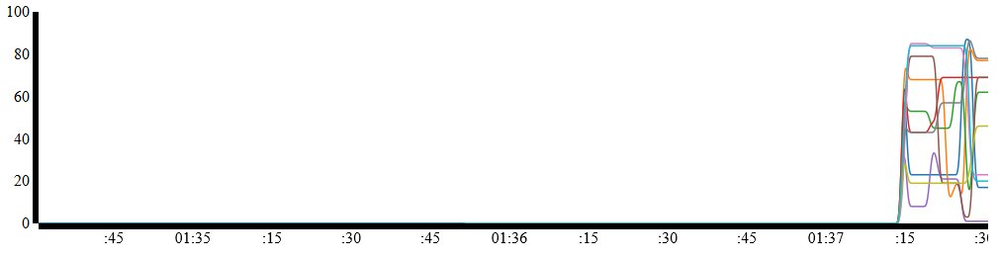
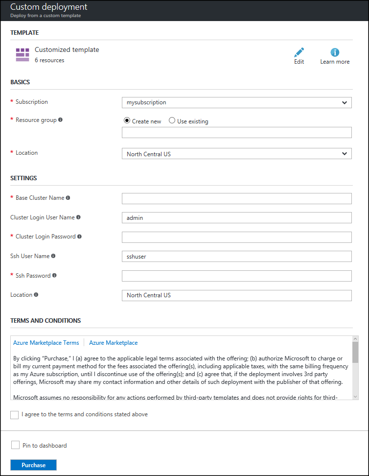

# Analyze sensor data with Apache Storm, Event Hub, and HBase in HDInsight (Hadoop)

Learn how to use Apache Storm on HDInsight to process sensor data from Azure Event Hub. The data is then stored into Apache HBase on HDInsight, and visualized using D3.js.

The Azure Resource Manager template used in this document demonstrates how to create multiple Azure resources in a resource group. The template creates a Azure Virtual Network, two HDInsight clusters (Storm and HBase) and an Azure Web App. A node.js implementation of a real-time web dashboard is automatically deployed to the web app.

> [!NOTE]
> The information in this document and example in this document require HDInsight version 3.5.
>
> Linux is the only operating system used on HDInsight version 3.4 or greater. For more information, see [HDInsight retirement on Windows](hdinsight-component-versioning.md#hdi-version-33-nearing-retirement-date).

## Prerequisites

* An Azure subscription. See [Get Azure free trial](http://azure.microsoft.com/documentation/videos/get-azure-free-trial-for-testing-hadoop-in-hdinsight/).
  
  > [!IMPORTANT]
  > You do not need an existing HDInsight cluster. The steps in this document create the following resources:
  > 
  > * A Azure Virtual Network
  > * A Storm on HDInsight cluster (Linux-based, two worker nodes)
  > * An HBase on HDInsight cluster (Linux-based, two worker nodes)
  > * An Azure Web App that hosts the web dashboard

* [Node.js](http://nodejs.org/):Used to preview the web dashboard locally on your development environment.
* [Java and the JDK 1.7](http://www.oracle.com/technetwork/java/javase/downloads/index.html): Used to develop the Storm topology.
* [Maven](http://maven.apache.org/what-is-maven.html): Used to build and compile the project.
* [Git](http://git-scm.com/): Used to download the project from GitHub.
* An **SSH** client: Used to connect to the Linux-based HDInsight clusters. For more information, see [Use SSH with HDInsight](hdinsight-hadoop-linux-use-ssh-unix.md).
    
    > [!NOTE]
    > You must also have access to the `scp` command, which is used to copy files between your local development environment and the HDInsight cluster using SSH.

## Architecture

This example consists of the following components:

* **Azure Event Hubs**: Contains data that is collected from sensors.
* **Storm on HDInsight**: Provides real-time processing of data from Event Hub.
* **HBase on HDInsight**: Provides a persistent NoSQL data store for data after it has been processed by Storm.
* **Azure Virtual Network service**: Enables secure communications between the Storm on HDInsight and HBase on HDInsight clusters.
  
  > [!NOTE]
  > A virtual network is required when using the Java HBase client API. It is not exposed over the public gateway for HBase clusters. Installing HBase and Storm clusters into the same virtual network allows the Storm cluster (or any other system on the virtual network) to directly access HBase using client API.

* **Dashboard website**: An example dashboard that charts data in real time.
  
  * The website is implemented in Node.js, so it can run on any client operating system for testing, or it can be deployed to Azure Websites.
  * [Socket.io](http://socket.io/) is used for real-time communication between the Storm topology and the website.
    
    > [!NOTE]
    > Using Socket.io for communication is an implementation detail. You can use any communications framework, such as raw WebSockets or SignalR.

  * [D3.js](http://d3js.org/) is used to graph the data that is sent to the website.

> [!IMPORTANT]
> Two clusters are required, as there is no supported method to create one HDInsight cluster for both Storm and HBase.

The topology reads data from Event Hub by using the [org.apache.storm.eventhubs.spout.EventHubSpout](http://storm.apache.org/releases/0.10.1/javadocs/org/apache/storm/eventhubs/spout/class-use/EventHubSpout.html) class, and writes data into HBase using the [org.apache.storm.hbase.bolt.HBaseBolt](https://storm.apache.org/javadoc/apidocs/org/apache/storm/hbase/bolt/class-use/HBaseBolt.html) class. Communication with the website is accomplished by using [socket.io-client.java](https://github.com/nkzawa/socket.io-client.java).

The following diagram explains the layout of the topology:

> [!NOTE]
> This is a simplified view of the topology. At run time, an instance of each component is created for each partition for the Event Hub that is being read. These instances are distributed across the nodes in the cluster, and data is routed between them as follows:
> 
> * Data from the spout to the parser is load balanced.
> * Data from the parser to the Dashboard and HBase is grouped by Device ID, so that messages from the same device always flow to the same component.

### Topology components

* **EventHub Spout**: The spout is provided as part of Apache Storm version 0.10.0 and higher.
  
  > [!NOTE]
  > The Event Hub spout used in this example requires a Storm on HDInsight cluster version 3.3 or 3.4. For information on how to use Event Hubs with an older version of Storm on HDInsight, see [Process events from Azure Event Hubs with Storm on HDInsight](hdinsight-storm-develop-java-event-hub-topology.md).

* **ParserBolt.java**: The data that is emitted by the spout is raw JSON, and occasionally more than one event is emitted at a time. This bolt demonstrates how to read the data emitted by the spout, and emit it to a new stream as a tuple that contains multiple fields.
* **DashboardBolt.java**: This component demonstrates how to use the Socket.io client library for Java to send data in real time to the web dashboard.
* **Temperature.java**: This defines the topology and loads configuration data from the **Config.properties** file.

## Prepare your environment

Before you use this example, you must create an Azure Event Hub, which the Storm topology reads from.

### Configure Event Hub

Event Hub is the data source for this example. Use the following steps to create an Event Hub.

1. From the [Azure portal](https://portal.azure.com), select **+ New** -> **Internet of Things** -> **Event Hubs**.
2. On the **Create Namespace** blade, perform the following tasks:
   
   1. Enter a **Name** for the namespace.
   2. Select a pricing tier. **Basic** is sufficient for this example.
   3. Select the Azure **Subscription** to use.
   4. Either select an existing resource group or create a new one.
   5. Select the **Location** for the Event Hub.
   6. Select **Pin to dashboard**, and then click **Create**.

3. When the creation process completes, the Event Hubs blade for your namespace is displayed. From here, select **+ Add Event Hub**. On the **Create Event Hub** blade, enter a name of **sensordata**, and then select **Create**. Leave the other fields at the default values.
4. From the Event Hubs blade for your namespace, select **Event Hubs**. Select the **sensordata** entry.
5. From the blade for the sensordata Event Hub, select **Shared access policies**. Use the **+ Add** link to add the following policies:

    | Policy name | Claims |
    | ----- | ----- |
    | devices | Send |
    | storm | Listen |

1. Select both policies and make a note of the **PRIMARY KEY** value. You need the value for both policies in future steps.

## Download and configure the project

Use the following to download the project from GitHub.

    git clone https://github.com/Blackmist/hdinsight-eventhub-example

After the command completes, you have the following directory structure:

    hdinsight-eventhub-example/
        TemperatureMonitor/ - this contains the topology
            resources/
                log4j2.xml - set logging to minimal.
                hbase-site.xml - connection information for the HBase cluster.
                Config.properties - configuration information for the topology. How to read from Event Hub and the URI to the dashboard.
            src/ - the Java bolts and topology definition.
        dashboard/nodejs/ - this is the node.js web dashboard.
        SendEvents/ - utilities to send fake sensor data.

> [!NOTE]
> This document does not go in to full details of the code included in this sample. However, the code is fully commented.

Open the **hdinsight-eventhub-example/TemperatureMonitor/resources/Config.properties** file and add your Event Hub information to the following lines:

    eventhubspout.username = <shared access policy name that can read from Event Hub>
    eventhubspout.password = <shared access policy key>
    eventhubspout.namespace = <namespace of your Event Hub
    eventhubspout.entitypath = <name of your event hub>
    eventhubspout.partitions.count = 2

Save the file after you add this information.

## Compile and test locally

Before testing, you must start the dashboard to view the output of the topology and generate data to store in Event Hub.

> [!IMPORTANT]
> The HBase component of this topology is not active when testing locally. This is because the Java API for the HBase cluster cannot be accessed from outside the Azure Virtual Network that contains the clusters.

### Start the web application

1. Open a new command prompt or terminal, and change directories to the **hdinsight-eventhub-example/dashboard**. Use the following command to install the dependencies needed by the web application:
   
        npm install

2. Use the following command to start the web application:
   
        node server.js
   
    You see a message similar to the following text:
   
        Server listening at port 3000

3. Open a web browser and enter **http://localhost:3000/** as the address. You should see a page similar to the following image:
   
    
   
    Leave this command prompt or terminal open. After testing, use Ctrl-C to stop the web server.

### Start generating data

> [!NOTE]
> The steps in this section use Node.js so that they can be used on any platform. For other language examples, see the **SendEvents** directory.

1. Open a new prompt, shell, or terminal, and change directories to **hdinsight-eventhub-example/SendEvents/nodejs**. To install the dependencies needed by the application, use the following command:
   
        npm install

2. Open the **app.js** file in a text editor and add the Event Hub information you obtained earlier:
   
        // ServiceBus Namespace
        var namespace = 'YourNamespace';
        // Event Hub Name
        var hubname ='sensordata';
        // Shared access Policy name and key (from Event Hub configuration)
        var my_key_name = 'devices';
        var my_key = 'YourKey';
   
   > [!NOTE]
   > This example assumes that you have used **sensordata** as the name of your Event Hub, and **devices** as the name of the policy that has a **Send** claim.

3. Use the following command to insert new entries in Event Hub:
   
        node app.js
   
    You see several lines of output that contain the data sent to Event Hub:
   
        {"TimeStamp":"2015-02-10T14:43.05.00320Z","DeviceId":"0","Temperature":7}
        {"TimeStamp":"2015-02-10T14:43.05.00320Z","DeviceId":"1","Temperature":39}
        {"TimeStamp":"2015-02-10T14:43.05.00320Z","DeviceId":"2","Temperature":86}
        {"TimeStamp":"2015-02-10T14:43.05.00320Z","DeviceId":"3","Temperature":29}
        {"TimeStamp":"2015-02-10T14:43.05.00320Z","DeviceId":"4","Temperature":30}
        {"TimeStamp":"2015-02-10T14:43.05.00320Z","DeviceId":"5","Temperature":5}
        {"TimeStamp":"2015-02-10T14:43.05.00320Z","DeviceId":"6","Temperature":24}
        {"TimeStamp":"2015-02-10T14:43.05.00320Z","DeviceId":"7","Temperature":40}
        {"TimeStamp":"2015-02-10T14:43.05.00320Z","DeviceId":"8","Temperature":43}
        {"TimeStamp":"2015-02-10T14:43.05.00320Z","DeviceId":"9","Temperature":84}

### Start the topology

1. Open a new command prompt, shell, or terminal and change directories to **hdinsight-eventhub-example/TemperatureMonitor**, and then use the following command to start the topology:
   
        mvn compile exec:java
   
    This command starts the topology in local mode. The values contained in the **Config.properties** file provide the connection information for Event Hubs and the local dashboard web site. Once started, the topology reads entries from Event Hub, and sends them to the dashboard running on your local machine. You should see lines appear in the web dashboard, similar to the following image:
   
    

2. While the dashboard is running, use the `node app.js` command from the previous steps to send new data to Event Hubs. Because the temperature values are randomly generated, the graph should update to show large changes in temperature.
   
   > [!NOTE]
   > You must be in the **hdinsight-eventhub-example/SendEvents/Nodejs** directory when using the `node app.js` command.

3. After verifying that the dashboard updates, stop the topology using Ctrl+C. You can use Ctrl+C to stop the local web server also.

## Create a Storm and HBase cluster

The steps in this section use an [Azure Resource Manager template](../azure-resource-manager/resource-group-template-deploy.md) to create a Azure Virtual Network and a Storm and HBase cluster on the virtual network. The template also creates an Azure Web App and deploys a copy of the dashboard into it.

> [!NOTE]
> A virtual network is used so that the topology running on the Storm cluster can directly communicate with the HBase cluster using the HBase Java API.

The Resource Manager template used in this document is located in a public blob container at **https://hditutorialdata.blob.core.windows.net/armtemplates/create-linux-based-hbase-storm-cluster-in-vnet.json**.

1. Click the following button to sign in to Azure and open the Resource Manager template in the Azure portal.
   
    

2. From the **Custom deployment** blade, enter the following values:
   
    
   
   * **Base Cluster Name**: This value is used as the base name for the Storm and HBase clusters. For example, entering **abc** creates a Storm cluster named **storm-abc** and an HBase cluster named **hbase-abc**.
   * **Cluster Login User Name**: The admin user name for the Storm and HBase clusters.
   * **Cluster Login Password**: The admin user password for the Storm and HBase clusters.
   * **SSH User Name**: The SSH user to create for the Storm and HBase clusters.
   * **SSH Password**: The password for the SSH user for the Storm and HBase clusters.
   * **Location**: The region that the clusters are created in.
     
     Click **OK** to save the parameters.

3. Use the **Basics** section to create a resource group or select an existing one.
4. In the **Resource group location** dropdown menu, select the same location as you selected for the **Location** parameter in the **Settings** section.
5. Read the terms and conditions, and then select **I agree to the terms and conditions stated above**.
6. Finally, check **Pin to dashboard** and then select **Purchase**. It takes about 20 minutes to create the clusters.

Once the resources have been created, you are redirected to a blade for the resource group that contains the clusters and web dashboard.

> [!IMPORTANT]
> Notice that the names of the HDInsight clusters are **storm-BASENAME** and **hbase-BASENAME**, where BASENAME is the name you provided to the template. You use these names in a later step when connecting to the clusters. Also note that the name of the dashboard site is **basename-dashboard**. This value is used later in this document.

## Configure the Dashboard bolt

To send data to the dashboard deployed as a web app, you must modify the following line in the **Config.properties** file:

    dashboard.uri: http://localhost:3000

Change `http://localhost:3000` to `http://BASENAME-dashboard.azurewebsites.net` and save the file. Replace **BASENAME** with the base name you provided in the previous step. You can also use the resource group created previously to select the dashboard and view the URL.

## Create the HBase table

To store data in HBase, we must first create a table. Pre-create resources that Storm needs to write to, as trying to create resources from inside a Storm topology can result in multiple instances trying to create the same resource. Create the resources outside the topology and use Storm for reading/writing and analytics.

1. Use SSH to connect to the HBase cluster using the SSH user and password you supplied to the template during cluster creation. For example, if connecting using the `ssh` command, you would use the following syntax:
   
        ssh USERNAME@hbase-BASENAME-ssh.azurehdinsight.net
   
    In this command, replace **USERNAME** with the SSH user name you provided when creating the cluster, and **BASENAME** with the base name you provided. When prompted, enter the password for the SSH user.

2. From the SSH session, start the HBase shell.
   
        hbase shell
   
    Once the shell has loaded, you see an `hbase(main):001:0>` prompt.

3. From the HBase shell, enter the following command to create a table to store the sensor data:
   
        create 'SensorData', 'cf'

4. Verify that the table has been created by using the following command:
   
        scan 'SensorData'
   
    This returns information similar to the following example, indicating that there are 0 rows in the table.
   
        ROW                   COLUMN+CELL                                       0 row(s) in 0.1900 seconds

5. Enter `exit` to exit the HBase shell:

## Configure the HBase bolt

To write to HBase from the Storm cluster, you must provide the HBase bolt with the configuration details of your HBase cluster. This example uses the **hbase-site.xml** file from the HBase cluster.

### Download the hbase-site.xml

From a command prompt, use SCP to download the **hbase-site.xml** file from the cluster. In the following example, replace **USERNAME** with the SSH user you provided when creating the cluster, and **BASENAME** with the base name you provided earlier. When prompted, enter the password for the SSH user. Replace the `/path/to/TemperatureMonitor/resources/hbase-site.xml` with the path to this file in the TemperatureMonitor project.

    scp USERNAME@hbase-BASENAME-ssh.azurehdinsight.net:/etc/hbase/conf/hbase-site.xml /path/to/TemperatureMonitor/resources/hbase-site.xml

This command downloads the **hbase-site.xml** to the path specified.

### Enable the HBase bolt

To enable the HBase bolt component, open the **TemperatureMonitor/src/main/java/com/microsoft/examples/Temperature.java** file and uncomment the following lines:

    // topologyBuilder.setBolt("HBase", new HBaseBolt("SensorData", mapper).withConfigKey("hbase.conf"), spoutConfig.getPartitionCount())
    //  .fieldsGrouping("Parser", "hbasestream", new Fields("deviceid")).setNumTasks(spoutConfig.getPartitionCount());

After uncommenting the lines, save the file.

## Build, package, and deploy the solution to HDInsight

In your development environment, use the following steps to deploy the Storm topology to the storm cluster.

1. From the **TemperatureMonitor** directory, use the following command to perform a new build and create a JAR package from your project:
   
        mvn clean compile package
   
    This command creates a file named **TemperatureMonitor-1.0-SNAPSHOT.jar** in the **target** directory of your project.

2. Use scp to upload the **TemperatureMonitor-1.0-SNAPSHOT.jar** file to your Storm cluster. In the following example, replace **USERNAME** with the SSH user you provided when creating the cluster, and **BASENAME** with the base name you provided earlier. When prompted, enter the password for the SSH user.
   
        scp target/TemperatureMonitor-1.0-SNAPSHOT.jar USERNAME@storm-BASENAME-ssh.azurehdinsight.net:TemperatureMonitor-1.0-SNAPSHOT.jar

   > [!NOTE]
   > It may take several minutes to upload the file.

3. Once the file has been uploaded, connect to the cluster using SSH.
   
        ssh USERNAME@storm-BASENAME-ssh.azurehdinsight.net

4. To start the topology, use the following command from the SSH session:
   
        storm jar TemperatureMonitor-1.0-SNAPSHOT.jar com.microsoft.examples.Temperature temperature

5. After the topology has started, open a browser to the website you published on Azure, then use the `node app.js` command to send data to Event Hub. You should see the web dashboard update to display the information.
   
    

## View HBase data

Use the following steps to connect to HBase and verify that the data has been written to the table:

1. Use SSH to connect to the HBase cluster.
   
        ssh USERNAME@hbase-BASENAME-ssh.azurehdinsight.net

2. From the SSH session, start the HBase shell.
   
        hbase shell
   
    Once the shell has loaded, you see an `hbase(main):001:0>` prompt.

3. View rows from the table:
   
        scan 'SensorData'
   
    This command returns information similar to the following text, indicating that there is data in the table.
   
        hbase(main):002:0> scan 'SensorData'
        ROW                             COLUMN+CELL
        \x00\x00\x00\x00               column=cf:temperature, timestamp=1467290788277, value=\x00\x00\x00\x04
        \x00\x00\x00\x00               column=cf:timestamp, timestamp=1467290788277, value=2015-02-10T14:43.05.00320Z
        \x00\x00\x00\x01               column=cf:temperature, timestamp=1467290788348, value=\x00\x00\x00M
        \x00\x00\x00\x01               column=cf:timestamp, timestamp=1467290788348, value=2015-02-10T14:43.05.00320Z
        \x00\x00\x00\x02               column=cf:temperature, timestamp=1467290788268, value=\x00\x00\x00R
        \x00\x00\x00\x02               column=cf:timestamp, timestamp=1467290788268, value=2015-02-10T14:43.05.00320Z
        \x00\x00\x00\x03               column=cf:temperature, timestamp=1467290788269, value=\x00\x00\x00#
        \x00\x00\x00\x03               column=cf:timestamp, timestamp=1467290788269, value=2015-02-10T14:43.05.00320Z
        \x00\x00\x00\x04               column=cf:temperature, timestamp=1467290788356, value=\x00\x00\x00>
        \x00\x00\x00\x04               column=cf:timestamp, timestamp=1467290788356, value=2015-02-10T14:43.05.00320Z
        \x00\x00\x00\x05               column=cf:temperature, timestamp=1467290788326, value=\x00\x00\x00\x0D
        \x00\x00\x00\x05               column=cf:timestamp, timestamp=1467290788326, value=2015-02-10T14:43.05.00320Z
        \x00\x00\x00\x06               column=cf:temperature, timestamp=1467290788253, value=\x00\x00\x009
        \x00\x00\x00\x06               column=cf:timestamp, timestamp=1467290788253, value=2015-02-10T14:43.05.00320Z
        \x00\x00\x00\x07               column=cf:temperature, timestamp=1467290788229, value=\x00\x00\x00\x12
        \x00\x00\x00\x07               column=cf:timestamp, timestamp=1467290788229, value=2015-02-10T14:43.05.00320Z
        \x00\x00\x00\x08               column=cf:temperature, timestamp=1467290788336, value=\x00\x00\x00\x16
        \x00\x00\x00\x08               column=cf:timestamp, timestamp=1467290788336, value=2015-02-10T14:43.05.00320Z
        \x00\x00\x00\x09               column=cf:temperature, timestamp=1467290788246, value=\x00\x00\x001
        \x00\x00\x00\x09               column=cf:timestamp, timestamp=1467290788246, value=2015-02-10T14:43.05.00320Z
        10 row(s) in 0.1800 seconds
   
   > [!NOTE]
   > This scan operation returns a maximum of 10 rows from the table.

## Delete your clusters
[!INCLUDE [delete-cluster-warning](../../includes/hdinsight-delete-cluster-warning.md)]

To delete the clusters, storage, and web app at one time, delete the resource group that contains them.

## Next steps

For more examples of Storm topologies with HDInsight, see [Example topologies for Storm on HDInsight](hdinsight-storm-example-topology.md)

For more information about Apache Storm, see the [Apache Storm](https://storm.incubator.apache.org/) site.

For more information about HBase on HDInsight, see the [HBase with HDInsight Overview](hdinsight-hbase-overview.md).

For more information about Socket.io, see the [socket.io](http://socket.io/) site.

For more information about D3.js, see [D3.js - Data Driven Documents](http://d3js.org/).

For information about creating topologies in Java, see [Develop Java topologies for Apache Storm on HDInsight](hdinsight-storm-develop-java-topology.md).

For information about creating topologies in .NET, see [Develop C# topologies for Apache Storm on HDInsight using Visual Studio](hdinsight-storm-develop-csharp-visual-studio-topology.md).

[azure-portal]: https://portal.azure.com
