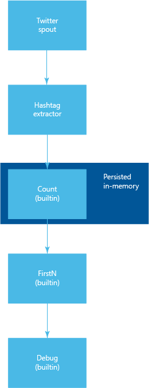

# Determine Twitter trending topics with Apache Storm on HDInsight

Learn how to use Trident to create a Storm topology that determines trending topics (hash tags) on Twitter.

Trident is a high-level abstraction that provides tools such as joins, aggregations, grouping, functions, and filters. Additionally, Trident adds primitives for doing stateful, incremental processing. The example used in this document is a Trident topology with a custom spout and function. It also uses several built-in functions provided by Trident.

## Requirements

* <a href="http://www.oracle.com/technetwork/java/javase/downloads/index.html" target="_blank">Java and the JDK 1.8</a>

* <a href="http://maven.apache.org/what-is-maven.html" target="_blank">Maven</a>

* <a href="http://git-scm.com/" target="_blank">Git</a>

* A Twitter developer account

## Download the project

Use the following code to clone the project locally.

    git clone https://github.com/Blackmist/TwitterTrending

## Understanding the topology

The following diagram shows of how data flows through this topology:

> [!NOTE]
> This diagram is a simplified view of the topology. Multiple instances of the components are distributed across the nodes in the cluster.

The Trident code that implements the topology is as follows:

    topology.newStream("spout", spout)
        .each(new Fields("tweet"), new HashtagExtractor(), new Fields("hashtag"))
        .groupBy(new Fields("hashtag"))
        .persistentAggregate(new MemoryMapState.Factory(), new Count(), new Fields("count"))
        .newValuesStream()
        .applyAssembly(new FirstN(10, "count"))
        .each(new Fields("hashtag", "count"), new Debug());

This code performs the following actions:

1. Creates a stream from the spout. The spout retrieves tweets from Twitter, and filters them for specific keywords (love, music, and coffee in this example).

2. HashtagExtractor, a custom function, is used to extract hash tags from each tweet. The hash tags are emitted to the stream.

3. The stream is grouped by hash tag, and passed to an aggregator. This aggregator creates a count of how many times each hash tag has occurred. This data is persisted in memory. Finally, a new stream is emitted that contains the hash tag and the count.

4. The **FirstN** assembly is applied to return only the top 10 values, based on the count field.

> [!NOTE]
> For more information on working with Trident, see the [Trident API overview](http://storm.apache.org/releases/current/Trident-API-Overview.html) document.

### The spout

The spout, **TwitterSpout**, uses [Twitter4j](http://twitter4j.org/en/) to retrieve tweets from Twitter. A filter is created for the words __love__, **music**, and **coffee**. Incoming tweets (status) that match the filter are stored in a linked blocking queue. Finally, items are pulled off the queue and emitted to the topology.

### The HashtagExtractor

To extract hash tags, [getHashtagEntities](http://twitter4j.org/javadoc/twitter4j/EntitySupport.html#getHashtagEntities--) is used to retrieve all hash tags that are contained in the tweet. These are then emitted to the stream.

## Configure Twitter

Use the following steps to register a new Twitter application and obtain the consumer and access token information needed to read from Twitter:

1. Go to [Twitter Apps](https://apps.twitter.com) and click the **Create new app** button. When filling in the form, leave the **Callback URL** field empty.

2. When the app is created, click the **Keys and Access Tokens** tab.

3. Copy the **Consumer Key** and **Consumer Secret** information.

4. At the bottom of the page, select **Create my access token** if no tokens exist. When the tokens have been created, copy the **Access Token** and **Access Token Secret** information.

5. In the **TwitterSpoutTopology** project you previously cloned, open the **resources/twitter4j.properties** file, add the information you gathered in the previous steps, and then save the file.

## Build the topology

Use the following code to build the project:

        cd [directoryname]
        mvn compile

## Test the topology

Use the following command to test the topology locally:

    mvn compile exec:java -Dstorm.topology=com.microsoft.example.TwitterTrendingTopology

After the topology starts, you should see debug information that contains the hash tags and counts emitted by the topology. The output should appear similar to the following text:

    DEBUG: [Quicktellervalentine, 7]
    DEBUG: [GRAMMYs, 7]
    DEBUG: [AskSam, 7]
    DEBUG: [poppunk, 1]
    DEBUG: [rock, 1]
    DEBUG: [punkrock, 1]
    DEBUG: [band, 1]
    DEBUG: [punk, 1]
    DEBUG: [indonesiapunkrock, 1]

## Next steps

Now that you have tested the topology locally, discover how to deploy the topology: [Deploy and manage Apache Storm topologies on HDInsight](hdinsight-storm-deploy-monitor-topology.md).

You may also be interested in the following Storm topics:

* [Develop Java topologies for Storm on HDInsight using Maven](hdinsight-storm-develop-java-topology.md)
* [Develop C# topologies for Storm on HDInsight using Visual Studio](hdinsight-storm-develop-csharp-visual-studio-topology.md)

For more Storm examples for HDInsight:

* [Example topologies for Storm on HDInsight](hdinsight-storm-example-topology.md)

