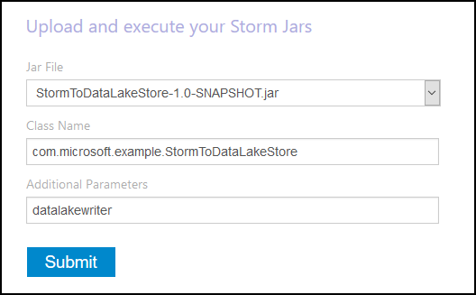
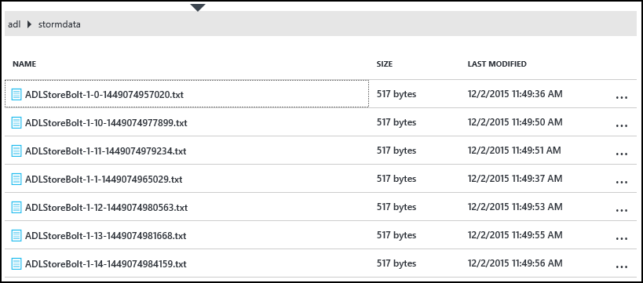
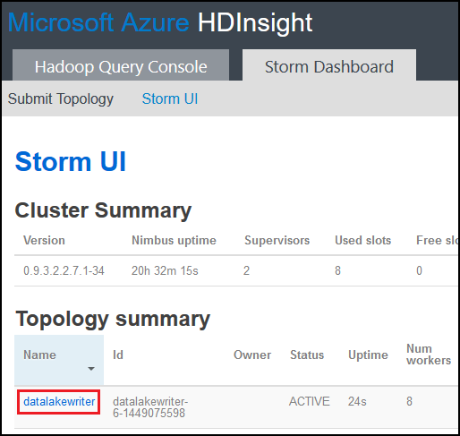
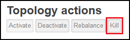

<properties
pageTitle="Use Azure Data Lake Store with Apache Storm on Azure HDInsight"
description="Learn how to write data to Azure Data Lake Store from an Apache Storm topology on HDInsight. This document, and the associated example, demonstrate how the HdfsBolt component can be used to write to Data Lake Store."
services="hdinsight"
documentationCenter="na"
authors="Blackmist"
manager="paulettm"
editor="cgronlun"/>

<tags
ms.service="hdinsight"
ms.devlang="na"
ms.topic="article"
ms.tgt_pltfrm="na"
ms.workload="big-data"
ms.date="06/17/2016"
ms.author="larryfr"/>

#Use Azure Data Lake Store with Apache Storm with HDInsight

Azure Data Lake Store is an HDFS compatible cloud storage service that provides high throughput, availability, durability, and reliability for your data. In this document, you will learn how to use a Java-based Storm topology to write data to Azure Data Lake Store using the [HdfsBolt](http://storm.apache.org/javadoc/apidocs/org/apache/storm/hdfs/bolt/HdfsBolt.html) component, which is provided as part of Apache Storm.

> [AZURE.IMPORTANT] The example topology used in this document relies on components that are included with Storm on HDInsight clusters, and may require modification to work with Azure Data Lake Store when used with other Apache Storm clusters.

##Prerequisites

* [Java JDK 1.7](https://www.oracle.com/technetwork/java/javase/downloads/jdk7-downloads-1880260.html) or higher
* [Maven 3.x](https://maven.apache.org/download.cgi)
* An Azure subscription
* A Storm on HDInsight cluster version 3.2. To create a new Storm on HDInsight cluster, use the steps in the [Use HDInsight with Data Lake Store using Azure](../data-lake-store/data-lake-store-hdinsight-hadoop-use-portal.md) document. The steps in this document will walk you through creating a new HDInsight cluster and Azure Data Lake Store.  

    > [AZURE.IMPORTANT] When you create the HDInsight cluster, you must select __Storm__ as the cluster type, and __3.2__ as the version. The OS can be either Windows or Linux.  

###Configure environment variables

The following environment variables may be set when you install Java and the JDK on your development workstation. However, you should check that they exist and that they contain the correct values for your system.

* __JAVA_HOME__ - should point to the directory where the Java runtime environment (JRE) is installed. For example, in a Unix or Linux distribution, it should have a value similar to `/usr/lib/jvm/java-7-oracle`. In Windows, it would have a value similar to `c:\Program Files (x86)\Java\jre1.7`.

* __PATH__ - should contain the following paths:

    * __JAVA\_HOME__ (or the equivalent path)
    
    * __JAVA\_HOME\bin__ (or the equivalent path)
    
    * The directory where Maven is installed

##Topology implementation

The example used in this document is written in Java, and uses the following components:

* __TickSpout__: Generates the data used by other components in the topology.

* __PartialCount__: Counts events generated by TickSpout.

* __FinalCount__: Aggregates count data from PartialCount.

* __ADLStoreBolt__: Writes data to Azure Data Lake Store using the [HdfsBolt](http://storm.apache.org/javadoc/apidocs/org/apache/storm/hdfs/bolt/HdfsBolt.html) component.

The project containing this topology is available as a download from [https://github.com/Azure-Samples/hdinsight-storm-azure-data-lake-store](https://github.com/Azure-Samples/hdinsight-storm-azure-data-lake-store).

###Understanding ADLStoreBolt

The ADLStoreBolt is the name used for the HdfsBolt instance in the topology that writes to Azure Data Lake. This is not a special version of HdfsBolt created by Microsoft; however it does rely on core-site configuration values, as well as Hadoop components that are included with Azure HDInsight to communication with Data Lake.

Specifically, when you create an HDInsight cluster, you can associate it with an Azure Data Lake Store. This writes entries into core-site for the Data Lake Store you selected, which are used by components such as hadoop-client and hadoop-hdfs to enable communication with Data Lake Store.

> [AZURE.NOTE] Microsoft has contributed code to the Apache Hadoop and Storm projects that enables communication with Azure Data Lake Store and Azure Blob storage, but this functionality may not be included by default in other Hadoop and Storm distributions.

The configuration for HdfsBolt in the topology is as follows:

    // 1. Create sync and rotation policies to control when data is synched
    //    (written) to the file system and when to roll over into a new file.
    SyncPolicy syncPolicy = new CountSyncPolicy(1000);
    FileRotationPolicy rotationPolicy = new FileSizeRotationPolicy(0.5f, Units.KB);
    // 2. Set the format. In this case, comma delimited
    RecordFormat recordFormat = new DelimitedRecordFormat().withFieldDelimiter(",");
    // 3. Set the directory name. In this case, '/stormdata/'
    FileNameFormat fileNameFormat = new DefaultFileNameFormat().withPath("/stormdata/");
    // 4. Create the bolt using the previously created settings,
    //    and also tell it the base URL to your Data Lake Store.
    // NOTE! Replace 'MYDATALAKE' below with the name of your data lake store.
    HdfsBolt adlsBolt = new HdfsBolt()
		.withFsUrl("adl://MYDATALAKE.azuredatalakestore.net/")
      	.withRecordFormat(recordFormat)
      	.withFileNameFormat(fileNameFormat)
      	.withRotationPolicy(rotationPolicy)
      	.withSyncPolicy(syncPolicy);
    // 4. Give it a name and wire it up to the bolt it accepts data
    //    from. NOTE: The name used here is also used as part of the
    //    file name for the files written to Data Lake Store.
    builder.setBolt("ADLStoreBolt", adlsBolt, 1)
      .globalGrouping("finalcount");
      
If you are familiar with using HdfsBolt, you will notice that this is all pretty standard configuration except for the URL. The URL provides the path to the root of your Azure Data Lake Store.

Since writing to Data Lake Store uses HdfsBolt, and is just a URL change, you should be able to take any existing topology that writes to HDFS or WASB using HdfsBolt, and easily change it to use Azure Data Lake Store.

##Build and package the topology

1. Download the example project from [https://github.com/Azure-Samples/hdinsight-storm-azure-data-lake-store
](https://github.com/Azure-Samples/hdinsight-storm-azure-data-lake-store
) to your development environment.

2. Open the `StormToDataLake\src\main\java\com\microsoft\example\StormToDataLakeStore.java` file in an editor and find the line that contains `.withFsUrl("adl://MYDATALAKE.azuredatalakestore.net/")`. Change __MYDATALAKE__ to the name of the Azure Data Lake Store you used when creating your HDInsight server.

3. From a command prompt, terminal, or shell session, change directories to the root of the downloaded project, and run the following commands to build and package the topology.

        mvn compile
        mvn package
    
    Once the build and packaging completes, there will be a new directory named `target`, that contains a file named `StormToDataLakeStore-1.0-SNAPSHOT.jar`. This contains the compiled topology.

##Deploy and run on Linux-based HDInsight

If you created a Linux-based Storm on HDInsight cluster, use the steps below to deploy and run the topology.

1. Use the following command to copy the topology to the HDInsight cluster. Replace __USER__ with the SSH user name you used when creating the cluster. Replace __CLUSTERNAME__ with the name of the cluster.

        scp target\StormToDataLakeStore-1.0-SNAPSHOT.jar USER@CLUSTERNAME-ssh.azurehdinsight.net:StormToDataLakeStore-1.0-SNAPSHOT.jar
    
    When prompted, enter the password used when creating the SSH user for the cluster. If you used a public key instead of a password, you may need to use the `-i` parameter to specify the path to the matching private key.
    
    > [AZURE.NOTE] If you are using a Windows client for development, you may not have an `scp` command. If so, you can use `pscp`, which is available from [http://www.chiark.greenend.org.uk/~sgtatham/putty/download.html](http://www.chiark.greenend.org.uk/~sgtatham/putty/download.html).

2. Once the upload completes, use the following to connect to the HDInsight cluster using SSH. Replace __USER__ with the SSH user name you used when creating the cluster. Replace __CLUSTERNAME__ with the name of the cluster.

        ssh USER@CLUSTERNAME-ssh.azurehdinsight.net

    When prompted, enter the password used when creating the SSH user for the cluster. If you used a public key instead of a password, you may need to use the `-i` parameter to specify the path to the matching private key.
    
    > [AZURE.NOTE] If you are using a Windows client for development, follow the information in [Connect to Linux-based HDInsight with SSH from Windows](hdinsight-hadoop-linux-use-ssh-windows.md) for information on using the PuTTY client to connect to the cluster.
    
3. Once connected, use the following to start the topology:

        storm jar StormToDataLakeStore-1.0-SNAPSHOT.jar com.microsoft.example.StormToDataLakeStore datalakewriter
    
    This will start the topology with a friendly name of `datalakewriter`.

##Deploy and run on Windows-based HDInsight

1. Open a web browser and go to HTTPS://CLUSTERNAME.azurehdinsight.net, where __CLUSTERNAME__ is the name of your HDInsight cluster. When prompted, provide the admin user name (`admin`) and the password that you used for this account when the cluster was created.

2. From the Storm Dashboard, select __Browse__ from the __Jar File__ drop-down, then select the StormToDataLakeStore-1.0-SNAPSHOT.jar file from the `target` directory. Use the following values for the other entries on the form:

    * Class Name: com.microsoft.example.StormToDataLakeStore
    * Additional Parameters: datalakewriter
    
    

3. Select the __Submit__ button to upload and start the topology. The result field below the __Submit__ button should display information similar to the following once the topology has started:

        Process exit code: 0
        Currently running topologies:
        Topology_name        Status     Num_tasks  Num_workers  Uptime_secs
        -------------------------------------------------------------------
        datalakewriter       ACTIVE     68         8            10        

##View output data

There are several ways to view the data. In this section we use the Azure Portal and the `hdfs` command to view the data.

> [AZURE.NOTE] You should allow the topologies to run for several minutes before checking the output data, so that data has been synched to several files on Azure Data Lake Store.

* __From the [Azure Portal](https://portal.azure.com)__: In the portal, select the Azure Data Lake Store that you used with HDInsight.

    > [AZURE.NOTE] If you did not pin the Data Lake Store to the Azure portal dashboard, you can find it by selecting __Browse__ at the bottom of the list on the left, then __Data Lake Store__, and finally selecting the store.
    
    From the icons at the top of the Data Lake Store, select __Data Explorer__.
    
    
    
    Next, select the __stormdata__ folder. A list of text files should be displayed.
    
    
    
    Select one of the files to view its contents.

* __From the cluster__: If you have connected to the HDInsight cluster using SSH (Linux cluster,) or Remote Desktop (Windows cluster,) you can use the following to view the data. Replace __DATALAKE__ with the name of your Data Lake Store

        hdfs dfs -cat adl://DATALAKE.azuredatalakestore.net/stormdata/*.txt

    This will concatenate the text files stored in the directory, and display information similar to the following:
    
        406000000
        407000000
        408000000
        409000000
        410000000
        411000000
        412000000
        413000000
        414000000
        415000000
        
##Stop the topology

Storm topologies will run until stopped, or the cluster is deleted. To stop the topologies, use the following information.

__For Linux-based HDInsight__:

From an SSH session to the cluster, use the following command:

    storm kill datalakewriter

__For Windows-based HDInsight__:

1. From the Storm Dashboard (https://CLUSTERNAME.azurehdinsight.net,) select the __Storm UI__ link at the top of the page.

2. Once the Storm UI loads, select the __datalakewriter__ link.

    

3. In the __Topology Actions__ section, select __Kill__ and then select OK on the dialog box that appears.

    

## Delete your cluster

[AZURE.INCLUDE [delete-cluster-warning](../../includes/hdinsight-delete-cluster-warning.md)]

##Next steps

Now that you have learned how to use Storm to write to Azure Data Lake Store, discover other [Storm examples for HDInsight](hdinsight-storm-example-topology.md).
