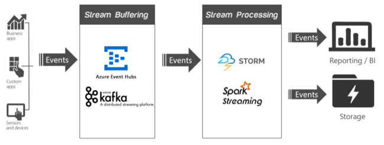

# Streaming at scale in HDInsight

Real-time big data solutions  act on data that is in motion. Typically, this data is most valuable at its time of arrival. If the incoming data stream becomes greater than can be handled at that moment, you may need to throttle down resources. Alternatively, an HDInsight cluster can   scale up to meet your streaming solution by adding nodes on demand.

In a streaming application, one or more data sources are generating events (sometimes in the millions per second) that need to be ingested  quickly  without dropping any useful information. The incoming events are handled with *stream buffering*, also called *event queuing*, by a service such as [Apache Kafka](kafka/apache-kafka-introduction.md) or [Event Hubs](https://azure.microsoft.com/services/event-hubs/). After you collect the events, you can then analyze the data using a real-time analytics system within the *stream processing* layer, such as [Apache Storm](storm/apache-storm-overview.md) or [Apache Spark Streaming](spark/apache-spark-streaming-overview.md). The processed data can be stored in long-term storage systems, like [Azure Data Lake Storage](https://azure.microsoft.com/services/storage/data-lake-storage/), and displayed in real time on a business intelligence dashboard, such as [Power BI](https://powerbi.microsoft.com), Tableau, or a custom web page.

## Apache Kafka

Apache Kafka provides a high-throughput, low-latency message queueing service, and is now part of the Apache suite of Open Source Software (OSS). Kafka uses a publish and subscribe messaging model and stores streams of partitioned data safely in a distributed, replicated cluster. Kafka  scales linearly as throughput increases.

For more information, see [Introducing Apache Kafka on HDInsight](kafka/apache-kafka-introduction.md).

## Apache Storm

Apache Storm is a distributed, fault-tolerant, open-source computation system that is optimized for processing streams of data in real time with Hadoop. The core unit of data for an incoming event is  a Tuple, which is an immutable set of key/value pairs. An unbounded sequence of these Tuples forms a Stream, which is comes from a Spout. The Spout wraps a streaming data source (such as Kafka), and emits Tuples. A storm Topology is a sequence of transformations on these streams.

For more information, see [What is Apache Storm on Azure HDInsight?](storm/apache-storm-overview.md).

## Spark Streaming

Spark Streaming  is an extension to Spark, which allows you to reuse the same code that you use for batch processing. You can  combine both batch and interactive queries in the same application. Unlike Storm, Spark Streaming provides stateful exactly-once processing semantics. When used in combination with the [Kafka Direct API](https://spark.apache.org/docs/latest/streaming-kafka-integration.html), which ensures that all Kafka data is received by Spark Streaming exactly once, it is possible to achieve end-to-end exactly-once guarantees. One of Spark Streaming's strengths is its fault-tolerant capabilities, recovering faulted nodes rapidly when multiple nodes are being used within the cluster.

For more information, see [What is Apache Spark Streaming?](hdinsight-spark-streaming-overview.md).

## Scaling a cluster

Although you can specify the number of nodes in your cluster during creation, you may want to grow or shrink the cluster to match the workload. All HDInsight clusters allow you to [change the number of nodes in the cluster](hdinsight-administer-use-portal-linux.md#scale-clusters). Spark clusters can be dropped with no loss of data, as all  data is stored in Azure Storage or Data Lake Storage.

There are advantages to decoupling technologies. For instance, Kafka is an event buffering technology, so it is very IO intensive and does not need much processing power. In comparison, stream processors such as Spark Streaming are compute-intensive, requiring more powerful VMs. By having these technologies decoupled into different clusters, you can scale them independently while best utilizing the VMs.

### Scale the stream buffering layer

The stream buffering technologies Event Hubs and Kafka both use partitions, and consumers read from those partitions. Scaling the input throughput requires scaling up the number of partitions, and adding partitions provides increasing parallelism. In Event Hubs, the partition count cannot be changed after deployment so it is important to start with the target scale in mind. With Kafka, it is possible to [add partitions](https://kafka.apache.org/documentation.html#basic_ops_cluster_expansion), even while Kafka is processing data. Kafka provides a tool to reassign partitions,  `kafka-reassign-partitions.sh`. HDInsight provides a [partition replica rebalancing tool](https://github.com/hdinsight/hdinsight-kafka-tools),  `rebalance_rackaware.py`. This rebalancing tool calls the `kafka-reassign-partitions.sh` tool in such a way that each replica is in a separate fault domain and update domain, making Kafka rack aware and increasing fault tolerance.

### Scale the stream processing layer

Both Apache Storm and Spark Streaming support adding worker nodes to their clusters, even while data is being processed.

To take advantage of new nodes added through scaling  Storm, you need to rebalance any Storm topologies started before the cluster size was increased. This rebalancing can be done using the Storm web UI or its CLI. For more information, see the [Apache Storm documentation](https://storm.apache.org/documentation/Understanding-the-parallelism-of-a-Storm-topology.html).

Apache Spark uses three key parameters for configuring its environment, depending on application requirements: `spark.executor.instances`, `spark.executor.cores`, and `spark.executor.memory`. An *executor* is a process that is launched for a Spark application. An executor runs on the worker node and is responsible for carrying out the  application's tasks. The default number of executors and the executor sizes for each cluster are calculated based on the number of worker nodes and the worker node size. These numbers are stored in the `spark-defaults.conf`file on each cluster head node.

These three  parameters can be configured at the cluster level, for all applications that run on the cluster, and can also  be specified for each individual application. For more information, see [Managing resources for Apache Spark clusters](spark/apache-spark-resource-manager.md).

## Next steps

* [Create and monitor an Apache Storm topology in Azure HDInsight](storm/apache-storm-quickstart.md)
* [Example topologies for Apache Storm on HDInsight](storm/apache-storm-example-topology.md)
* [Introduction to Apache Spark on HDInsight](spark/apache-spark-overview.md)
* [Start with Apache Kafka on HDInsight](kafka/apache-kafka-get-started.md)
