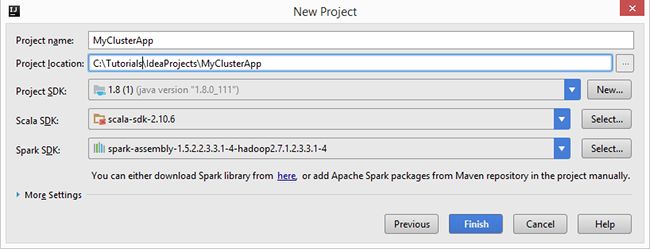
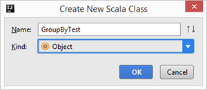
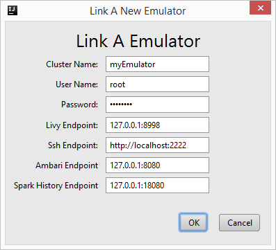

#Use HDInsight Tools for IntelliJ with Hortonworks Sandbox

Learn how to use HDInsight Tools for IntelliJ to develop Apache Scala applications and test the applications on [Hortonworks Sandbox](http://hortonworks.com/products/sandbox/) running on your workstation. [IntelliJ IDEA](https://www.jetbrains.com/idea/) is a Java-integrated development environment (IDE) for developing computer software. After you have developed and tested your applications on Hortonworks Sandbox, you can move them to [Azure HDInsight](hdinsight-hadoop-introduction.md).

##Prerequisites

Before you begin this tutorial, you must have:

- The HDP 2.4 on Hortonworks Sandbox running on your local environment. To cofigure, see [Get started in the Hadoop ecosystem with a Hadoop sandbox on a virtual machine](hdinsight-hadoop-emulator-get-started.md). Please note HDInsight Tools for IntelliJ has been only tested with HDP 2.4. From the [Hortonworks Sandbox download site](http://hortonworks.com/downloads/#sandbox), expand **Hortonworks Sandbox Archive** to get it.
- [Java Developer Kit (JDK) version 1.8 or later](http://www.oracle.com/technetwork/java/javase/downloads/jdk8-downloads-2133151.html). JDK is required by the Azure Toolkit for IntelliJ.
- [IntelliJ IDEA community edition](https://www.jetbrains.com/idea/download) with the [Scala](https://plugins.jetbrains.com/idea/plugin/1347-scala) plugin and the [Azure Toolkit for IntelliJ](../azure-toolkit-for-intellij.md) plugin. HDInsight Tools for IntelliJ are available as a part of the Azure Toolkit for IntelliJ. 

  **To install the plugins:**

  1. Open IntelliJ IDEA.
  2. From the Welcome screen, click **Configure**, and then click **Plugins**.
  3. Click **Install JetBrains plugin** from the lower left corner.
  4. Use the search function to search **Scala**, and then click **Install**.
  5. Click **Restart IntelliJ IDEA** to complete the installation.
  6. Repeat step 4 and 5 to install the **Azure Toolkit for IntelliJ**. For more information, see [Install the Azure Toolkit for IntelliJ](../azure-toolkit-for-intellij-installation.md).

## Create a Spark Scala application

In this section, you create a sample scala project using IntelliJ IDEA. In the next section, you link IntelliJ IDEA to the Hortonworks Sandbox (emulator) before you submit the project.

1. Open IntelliJ IDEA from your workstation.
2. Click **Create New Project**.
3. Click **HDInsight** from the left pane, click **Spark on HDInsight(Scala)** from the right pane, and then click **Next**.

    
4. Enter the following information:

    

    - **Project name**: Provide a project name.
    - **Project location**: Provide a project location.
    - **Project SDK**: Click **New**, click **JDK**, and then specify the folder of Java JDK version 7 or later.  The default location is C:\Program Files\Java\jdk1.8.x_xxx.
    - **Scala SDK**: Click **Select**, select version **2.10.6**, and then click **OK**. If the version is not listed, click **Download**, select **Scala version**, and then click **OK**. Make sure not to use version 2.11.x. This article uses version 2.10.6.
    - **Spark SDK**: Download the [SDK](http://go.microsoft.com/fwlink/?LinkID=723585&clcid=0x409). You can also ignore this and use the Spark Maven repository instead, however please make sure you have the right maven repository installed to develop your Spark applications. (For example, you need to make sure you have the Spark Streaming part installed if you are using Spark Streaming; Also please make sure you are using the repository marked as Scala 2.10 - do not use the repository marked as Scala 2.11.)
5. Click **Finish**.
6. Press **[ALT]+1** to open the Project view if it is not opened.
7. From **Project Explorer**, expand the project, and then click **src**.
8. Right-click **src**, point to **New**, and then click **Scala class**.
9. Enter a name, select **Object** in **Kind**, and then click **OK**.

    
10. In the .scala file, paste the following code:

        import java.util.Random
        import org.apache.spark.{SparkConf, SparkContext}
        import org.apache.spark.SparkContext._

        /**
        * Usage: GroupByTest [numMappers] [numKVPairs] [valSize] [numReducers]
        */
        object GroupByTest {
            def main(args: Array[String]) {
                val sparkConf = new SparkConf().setAppName("GroupBy Test")
                var numMappers = 3
                var numKVPairs = 10
                var valSize = 10
                var numReducers = 2

                val sc = new SparkContext(sparkConf)

                val pairs1 = sc.parallelize(0 until numMappers, numMappers).flatMap { p =>
                val ranGen = new Random
                var arr1 = new Array[(Int, Array[Byte])](numKVPairs)
                for (i <- 0 until numKVPairs) {
                    val byteArr = new Array[Byte](valSize)
                    ranGen.nextBytes(byteArr)
                    arr1(i) = (ranGen.nextInt(Int.MaxValue), byteArr)
                }
                arr1
                }.cache
                // Enforce that everything has been calculated and in cache
                pairs1.count

                println(pairs1.groupByKey(numReducers).count)
            }
        }

11. From the **Build** menu, click **Build project**. Make sure the compilation is completed successfully.

## Link to the HortonWorks Sandbox

You need to have an existing IntelliJ application before you can link to a Hortonworks Sandbox(emulator).

**To link to an emulator**

1. Open the project in IntelliJ if it is not opened yet.
2. From the **View** menu, click **Tools Windows**, and then click **Azure Explorer**.
3. Expand **Azure**, right-click **HDInsight**, and then click **Link an Emulator**.
4. Enter the password you have configured for the root account of the Hortonworks Sandbox, and the rest of the values simliar to the following screenshot, and then click **OK**. 

  

5. Click **Yes** to configure the emulator.

  When it is connected successfully, you can see the emulator (Hortonworks Sandbox) listed under the HDInsight node.

## Submit the Spark Scala application to the Sandbox

After you have linked the IntelliJ IDEA to the emulator, you can submit your project.

**To submit a project to an emulator**

1. From the **Project explorer**, right-click the project, and then click **Submit Spark application to HDInsight**.
2. Specify the following fields:

    - **Spark cluster (Linux only)**: Select your local Hortonworks Sandbox.
    - **Main class name**: Choose or enter the main class name.  For this tutorial, it is **GroupByTest**.
3. Click **Submit**. The job submission logs are shown in the Spark submission tool window.

##Next steps:

- To learn how to create Spark applications for HDInsight using HDInsight Tools for IntelliJ, see [Use HDInsight Tools in Azure Toolkit for IntelliJ to create Spark applications for HDInsight Spark Linux cluster](hdinsight-apache-spark-intellij-tool-plugin.md).
- To watch a video of HDInsight Tools for IntelliJ, see [Introduce HDInsight Tools for IntelliJ for Spark Development](https://mix.office.com/watch/1nqkqjt5xonza).
- To learn how to debug Spark applications using the toolkit remotely on HDInsight, see [Use HDInsight Tools in Azure Toolkit for IntelliJ to debug Spark applications remotely on HDInsight Spark Linux cluster](hdinsight-apache-spark-intellij-tool-plugin-debug-jobs-remotely.md).
- To learn how to use HDInsight Tools for Eclipse to create Spark application, see [Use HDInsight Tools in Azure Toolkit for Eclipse to create Spark applications](hdinsight-apache-spark-eclipse-tool-plugin.md).
- To watch a video of HDInsight Tools for Eclipse, see [Use HDInsight Tool for Eclipse to create Spark applications](https://mix.office.com/watch/1rau2mopb6fha).