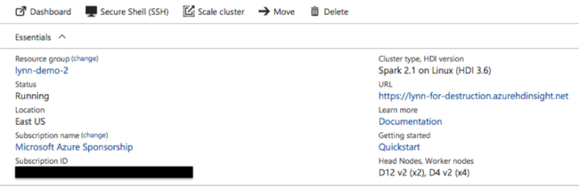
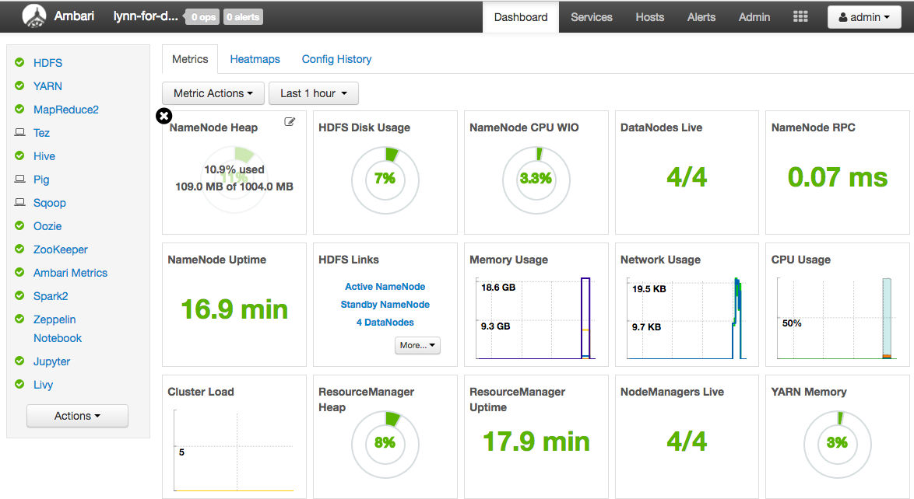
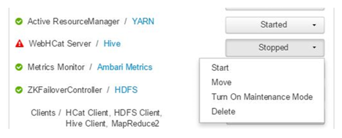
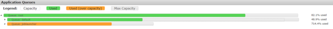
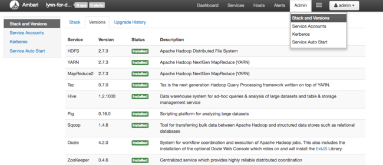

# Troubleshoot a slow or failing job on a HDInsight cluster

If an application processing data on a HDInsight cluster  is either running slowly or failing with an  error code, you have several troubleshooting options. If your jobs are taking longer to run than expected, or you are seeing slow response times in general, there may be failures upstream from your cluster, such as the services on which the cluster runs. However, the most common cause of these slowdowns is insufficient scaling. When you create a new HDInsight cluster, select the appropriate [virtual machine sizes](hdinsight-component-versioning.md#default-node-configuration-and-virtual-machine-sizes-for-clusters).

To diagnose a slow or failing cluster, gather information about all aspects of the environment, such as  associated Azure Services, cluster configuration, and job execution information. A helpful diagnostic is to try to reproduce the  error state on another cluster.

* Step 1: Gather data about the issue.
* Step 2: Validate the HDInsight cluster environment.
* Step 3: View your cluster's health.
* Step 4: Review the environment stack and versions.
* Step 5: Examine the cluster log files.
* Step 6: Check configuration settings.
* Step 7: Reproduce the failure on a different cluster.

## Step 1: Gather data about the issue

HDInsight provides many tools that you can use to identify and troubleshoot issues with clusters. The following steps guide you through these tools and provide  suggestions for pinpointing the issue.

### Identify the problem

To help identify  the problem, consider the following questions:

* What did I expect to happen? What happened instead?
* How long did the process take to run? How long should it have run?
* Have my tasks always run slowly on this cluster? Did they run faster on a different cluster?
* When did this problem first occur? How often has it happened since?
* Has anything changed in my cluster configuration?

### Cluster details

Important cluster information includes:

* Cluster name.
* Cluster region -  check for [region outages](https://azure.microsoft.com/status/).
* HDInsight cluster type and version.
* Type and number of HDInsight instances specified for the head and worker nodes.

The Azure portal can provide this information:



You can also use [Azure CLI](https://docs.microsoft.com/cli/azure/?view=azure-cli-latest):

```azurecli
az hdinsight list --resource-group <ResourceGroup>
az hdinsight show --resource-group <ResourceGroup> --name <ClusterName>
```

Another option is using  PowerShell. For more information, see  [Manage Apache Hadoop clusters in HDInsight with Azure PowerShell](hdinsight-administer-use-powershell.md).

## Step 2: Validate the HDInsight cluster environment

Each HDInsight cluster relies on various Azure services, and on open-source software such as Apache HBase and Apache Spark. HDInsight clusters can also call on other Azure services, such as Azure Virtual Networks.  A cluster failure can be caused by any of the running services on your cluster, or by an external service.  A  cluster service configuration change can also cause the cluster to fail.

### Service details

* Check the open-source library release versions.
* Check for [Azure Service Outages](https://azure.microsoft.com/status/).  
* Check for Azure Service usage limits. 
* Check the Azure Virtual Network subnet configuration.  

### View cluster configuration settings with the Ambari UI

Apache Ambari provides management and monitoring of a HDInsight cluster with a web UI and a REST API. 
Ambari is included on Linux-based HDInsight clusters. Select the **Cluster Dashboard** pane on the Azure portal HDInsight page.  Select the **HDInsight cluster dashboard** pane to open the Ambari UI, and enter the  cluster login credentials.  



To open a list of service views, select **Ambari Views** on the Azure portal page.  This list depends on which libraries are installed. For example, you may see YARN Queue Manager, Hive View, and Tez View.  Select a  service link to see configuration and service information.

#### Check for Azure service outages

HDInsight relies on several Azure services. It runs virtual servers on Azure HDInsight, stores data and scripts on Azure Blob storage or Azure Data Lake Storage, and indexes log files in Azure Table storage. Disruptions to these services, although rare, can cause issues in HDInsight. If you have unexpected slowdowns or failures in your cluster,  check the [Azure Status Dashboard](https://azure.microsoft.com/status/). The status of each service is listed by region. Check your cluster's region and also regions for any related services.

#### Check Azure service usage limits

If you are launching a large cluster, or have launched many clusters simultaneously, a cluster can fail if  you have exceeded an Azure service limit. Service limits vary, depending on your Azure subscription. For more information, see [Azure subscription and service limits, quotas, and constraints](https://docs.microsoft.com/azure/azure-subscription-service-limits).
You can request that Microsoft increase the number of HDInsight resources available (such as VM cores and VM instances) with a [Resource Manager core quota increase request](https://docs.microsoft.com/azure/azure-supportability/resource-manager-core-quotas-request).

#### Check the release version

Compare the cluster version with the latest HDInsight release. Each   HDInsight release includes improvements such as new applications, features, patches, and bug
fixes. The issue that is affecting your cluster may have been fixed in the latest release version. If possible, re-run your cluster using the latest version of HDInsight and associated libraries such as Apache HBase, Apache Spark, and others.

#### Restart your cluster services

If you are experiencing slowdowns in your cluster, consider restarting your services through the Ambari UI or the Azure Classic CLI. The cluster may be experiencing transient errors, and restarting is the quickest way to stabilize your environment and possibly improve performance.

## Step 3: View your cluster's health

HDInsight clusters are composed of different types of nodes running on virtual machine instances. Each node can be monitored for resource starvation, network connectivity issues, and other problems that can slow down the cluster. Every cluster contains two head nodes, and most cluster types contain a combination of worker and edge nodes. 

For a description of the various nodes each cluster type uses, see [Set up clusters in HDInsight with Apache Hadoop, Apache Spark, Apache Kafka, and more](hdinsight-hadoop-provision-linux-clusters.md).

The following sections describe how to  check the health of each node and of the overall cluster.

### Get a snapshot of the cluster health using the Ambari UI dashboard

The [Ambari UI dashboard](#view-cluster-configuration-settings-with-the-ambari-ui) (`https://<clustername>.azurehdinsight.net`) provides an overview of cluster health, such as uptime, memory, network and CPU usage, HDFS disk usage, and so forth. Use the Hosts section of Ambari to view resources at a host level. You can also stop and restart services.

### Check your WebHCat service

One common scenario for Apache Hive, Apache Pig, or Apache Sqoop jobs failing is a failure with the [WebHCat](hdinsight-hadoop-templeton-webhcat-debug-errors.md) (or *Templeton*) service. WebHCat is a REST interface for remote job execution, such as Hive, Pig, Scoop, and MapReduce. WebHCat translates the job submission requests into Apache Hadoop YARN applications, and returns a status derived from the YARN application status.  The following sections describe common WebHCat  HTTP status codes.

#### BadGateway (502 status code)

This is a generic message from gateway nodes, and is the most common failure status code. One possible cause for this is  the WebHCat service being down on the active head node. To check for this possibility, use the following CURL command:

```bash
curl -u admin:{HTTP PASSWD} https://{CLUSTERNAME}.azurehdinsight.net/templeton/v1/status?user.name=admin
```

Ambari  displays an alert showing the hosts on which the WebHCat service is down. You can try to bring the WebHCat service back up by restarting the service on its host.



If a WebHCat server still does not come up, then check the  operations log  for failure messages. For more detailed information, check the `stderr` and `stdout` files referenced on the node.

#### WebHCat times out

An HDInsight Gateway times out responses that take longer than two minutes, returning `502 BadGateway`. WebHCat queries YARN services for job statuses, and if YARN takes longer than two minutes to respond, that request can time out.

In this case, review the following logs in the `/var/log/webhcat` directory:

* **webhcat.log** is the log4j log to which server writes logs
* **webhcat-console.log** is the stdout of the server when started
* **webhcat-console-error.log** is the stderr of the server process

> [!NOTE]  
> Each `webhcat.log` is rolled over  daily, generating files named `webhcat.log.YYYY-MM-DD`. Select the appropriate file for the time range you are investigating.

The following sections describe some possible causes for WebHCat timeouts.

##### WebHCat level timeout

When WebHCat is under load, with more than 10 open sockets, it takes longer to establish new socket connections, which can result in a timeout. To list the  network connections to and from WebHCat, use `netstat`  on the current active headnode:

```bash
netstat | grep 30111
```

30111 is the port WebHCat listens on. The number of open sockets should be less than 10.

If there are no open sockets, the previous command does not produce a result. To check if Templeton is up and listening on port 30111, use:

```bash
netstat -l | grep 30111
```

##### YARN level timeout

Templeton calls YARN to run jobs, and the communication between Templeton and YARN can cause a timeout.

At the YARN level, there are two types of timeouts:

1. Submitting a YARN job can take long enough to cause a timeout.

    If you open the `/var/log/webhcat/webhcat.log` log file and search for "queued job", you may see multiple entries where the execution time is excessively long (>2000 ms), with entries showing increasing wait times.

    The time for the queued jobs continues to increase because the rate at which new jobs get submitted is  higher than the rate at which the old jobs are completed. Once the YARN memory is 100% used,  the *joblauncher queue* can no longer borrow capacity from the *default queue*. Therefore, no more new jobs can be accepted into the joblauncher queue. This behavior can  cause the waiting time to become longer and longer, causing a timeout error that is usually followed by many others.

    The  following  image shows the joblauncher queue at 714.4% overused. This is acceptable so long as there is still free capacity in the default queue to borrow from. However, when the cluster is fully utilized and the YARN memory is at 100% capacity, new jobs must wait, which eventually causes timeouts.

    

    There are two ways to resolve this issue: either reduce the speed of new jobs being submitted, or increase the consumption speed of old jobs by scaling up the cluster.

2. YARN processing can take a long time, which can cause timeouts.

    * List all jobs: This is a time-consuming call. This call enumerates the applications from the YARN ResourceManager, and for each completed application, gets the status from the YARN JobHistoryServer. With  higher numbers of jobs, this call can time out.

    * List jobs older than seven days: The HDInsight YARN JobHistoryServer is configured to retain completed job information for seven days (`mapreduce.jobhistory.max-age-ms` value). Trying to enumerate purged jobs results in a timeout.

To diagnose these issues:

1. Determine the UTC time range to troubleshoot
2. Select the appropriate `webhcat.log` file(s)
3. Look for WARN and ERROR messages during that time

#### Other WebHCat failures

1. HTTP status code 500

    In most cases where WebHCat returns 500, the error message contains details on the failure. Otherwise, look through `webhcat.log` for WARN and ERROR messages.

2. Job failures

    There may be cases where interactions with WebHCat are successful, but the jobs are failing.

    Templeton collects the job console output as `stderr` in `statusdir`, which is often useful for troubleshooting. `stderr` contains the YARN application identifier of the actual query.

## Step 4: Review the environment stack and versions

The Ambari UI **Stack and Version** page provides information about cluster services configuration and service version history.  Incorrect Hadoop service library versions can be a cause of cluster failure.  In the Ambari UI, select the **Admin** menu and then  **Stacks and Versions**.  Select the **Versions** tab on the page to see service version information:



## Step 5: Examine the log files

There are many types of logs that are generated from the many services and components that comprise an HDInsight cluster. [WebHCat log files](#check-your-webhcat-service) are described previously. There are several other useful log files you can investigate to narrow down issues with your cluster, as described in the following sections.

* HDInsight clusters consist of several nodes, most of which are tasked to run submitted jobs. Jobs run concurrently, but log files can only display results linearly. HDInsight executes new tasks, terminating others that fail to complete first. All this activity is logged to the `stderr` and `syslog` files.

* The script action log files show errors or unexpected configuration changes during your cluster's creation process.

* The Hadoop step logs identify Hadoop jobs launched as part of a step containing errors.

### Check the script action logs

HDInsight [script actions](hdinsight-hadoop-customize-cluster-linux.md) run scripts on the cluster manually or when specified. For example, script actions can be used to install additional software on the cluster or to alter configuration settings from the default values. Checking the script action logs can provide insight into errors that occurred during cluster setup and  configuration.  You can view the status of a script action by selecting the **ops** button in the Ambari UI, or by accessing the logs from the default storage account.

The script action logs reside in the `\STORAGE_ACCOUNT_NAME\DEFAULT_CONTAINER_NAME\custom-scriptaction-logs\CLUSTER_NAME\DATE` directory.

### View HDInsight logs using Ambari Quick Links

The HDInsight Ambari UI includes a number of **Quick Links** sections.  To access the log links for a particular service in your HDInsight cluster, open the Ambari UI for your cluster, then select the service link from the list at left. Select  the **Quick Links** dropdown,  then the HDInsight node of interest, and then select the link for its associated log.

For example, for HDFS logs:


### View Hadoop-generated log files

An HDInsight cluster generates logs that are written to Azure tables and Azure Blob storage. YARN creates its own execution logs. For more information, see [Manage logs for an HDInsight cluster](hdinsight-log-management.md#access-the-hadoop-log-files).

### Review heap dumps

Heap dumps contain a snapshot of the application's memory, including the values of variables at that time, which are useful for diagnosing problems that occur at runtime. For more information, see [Enable heap dumps for Apache Hadoop services on Linux-based HDInsight](hdinsight-hadoop-collect-debug-heap-dump-linux.md).

## Step 6: Check configuration settings

HDInsight clusters are pre-configured with default settings for related services, such as Hadoop, Hive, HBase, and so on. Depending on the type of cluster, its hardware configuration, its number of nodes, the types of jobs you are running, and the data you are working with (and how that data is being processed), you may need to optimize your configuration.

For detailed instructions on optimizing performance configurations for most scenarios, see [Optimize cluster configurations with Apache Ambari](hdinsight-changing-configs-via-ambari.md). When using Spark, see [Optimize Apache Spark jobs for performance](spark/apache-spark-perf.md). 

## Step 7: Reproduce the failure on a different cluster

To help diagnose the source of a cluster error, start a new cluster with the same configuration and then resubmit the failed job's steps one by one. Check the results of each step before processing the next one. This method gives you the opportunity to correct and re-run a single failed step. This method also has the advantage of  only loading your input data once.

1. Create a new test cluster with the same configuration as the failed cluster.
2. Submit the first job step to the test cluster.
3. When the step completes processing, check for errors in the step log files. Connect to the test cluster's master node and view the log files there. The step log files only  appear after the step runs for some time, finishes, or fails.
4. If the first step succeeded, run the next step. If there were errors, investigate the error in the log files. If it was an error in your code, make the correction and re-run the step.
5. Continue until all steps run without error.
6. When you are done debugging the test cluster, delete it.

## Next steps

* [Manage HDInsight clusters by using the Apache Ambari Web UI](hdinsight-hadoop-manage-ambari.md)
* [Analyze HDInsight Logs](hdinsight-debug-jobs.md)
* [Access Apache Hadoop YARN application sign in Linux-based HDInsight](hdinsight-hadoop-access-yarn-app-logs-linux.md)
* [Enable heap dumps for Apache Hadoop services on Linux-based HDInsight](hdinsight-hadoop-collect-debug-heap-dump-linux.md)
* [Known Issues for Apache Spark cluster on HDInsight](hdinsight-apache-spark-known-issues.md)
