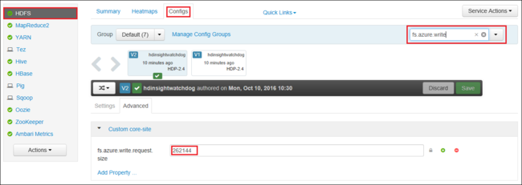

# Troubleshoot Apache Hadoop HDFS by using Azure HDInsight

Learn top issues and resolutions when working with Hadoop Distributed File System (HDFS). For a full list of commands, see the [HDFS Commands Guide](https://hadoop.apache.org/docs/current/hadoop-project-dist/hadoop-hdfs/HDFSCommands.html) and the [File System Shell Guide](https://hadoop.apache.org/docs/current/hadoop-project-dist/hadoop-common/FileSystemShell.html).

## <a name="how-do-i-access-local-hdfs-from-inside-a-cluster"></a>How do I access the local HDFS from inside a cluster?

### Issue

Access the local HDFS from the command line and application code instead of by using Azure Blob storage or Azure Data Lake Storage from inside the HDInsight cluster.

### Resolution steps

1. At the command prompt, use `hdfs dfs -D "fs.default.name=hdfs://mycluster/" ...` literally, as in the following command:

    ```output
    hdfs dfs -D "fs.default.name=hdfs://mycluster/" -ls /
    Found 3 items
    drwxr-xr-x   - hdiuser hdfs          0 2017-03-24 14:12 /EventCheckpoint-30-8-24-11102016-01
    drwx-wx-wx   - hive    hdfs          0 2016-11-10 18:42 /tmp
    drwx------   - hdiuser hdfs          0 2016-11-10 22:22 /user
    ```

2. From source code, use the URI `hdfs://mycluster/` literally, as in the following sample application:

    ```Java
    import java.io.IOException;
    import java.net.URI;
    import org.apache.commons.io.IOUtils;
    import org.apache.hadoop.conf.Configuration;
    import org.apache.hadoop.fs.*;

    public class JavaUnitTests {

        public static void main(String[] args) throws Exception {

            Configuration conf = new Configuration();
            String hdfsUri = "hdfs://mycluster/";
            conf.set("fs.defaultFS", hdfsUri);
            FileSystem fileSystem = FileSystem.get(URI.create(hdfsUri), conf);
            RemoteIterator<LocatedFileStatus> fileStatusIterator = fileSystem.listFiles(new Path("/tmp"), true);
            while(fileStatusIterator.hasNext()) {
                System.out.println(fileStatusIterator.next().getPath().toString());
            }
        }
    }
    ```

3. Run the compiled .jar file (for example, a file named `java-unit-tests-1.0.jar`) on the HDInsight cluster with the following command:

    ```apache
    hadoop jar java-unit-tests-1.0.jar JavaUnitTests
    hdfs://mycluster/tmp/hive/hive/5d9cf301-2503-48c7-9963-923fb5ef79a7/inuse.info
    hdfs://mycluster/tmp/hive/hive/5d9cf301-2503-48c7-9963-923fb5ef79a7/inuse.lck
    hdfs://mycluster/tmp/hive/hive/a0be04ea-ae01-4cc4-b56d-f263baf2e314/inuse.info
    hdfs://mycluster/tmp/hive/hive/a0be04ea-ae01-4cc4-b56d-f263baf2e314/inuse.lck
    ```

## Storage exception for write on blob

### Issue

When using the `hadoop` or `hdfs dfs` commands to write files that are ~12 GB or larger on an HBase cluster, you may come across the following error:

```error
ERROR azure.NativeAzureFileSystem: Encountered Storage Exception for write on Blob : example/test_large_file.bin._COPYING_ Exception details: null Error Code : RequestBodyTooLarge
copyFromLocal: java.io.IOException
        at com.microsoft.azure.storage.core.Utility.initIOException(Utility.java:661)
        at com.microsoft.azure.storage.blob.BlobOutputStream$1.call(BlobOutputStream.java:366)
        at com.microsoft.azure.storage.blob.BlobOutputStream$1.call(BlobOutputStream.java:350)
        at java.util.concurrent.FutureTask.run(FutureTask.java:262)
        at java.util.concurrent.Executors$RunnableAdapter.call(Executors.java:471)
        at java.util.concurrent.FutureTask.run(FutureTask.java:262)
        at java.util.concurrent.ThreadPoolExecutor.runWorker(ThreadPoolExecutor.java:1145)
        at java.util.concurrent.ThreadPoolExecutor$Worker.run(ThreadPoolExecutor.java:615)
        at java.lang.Thread.run(Thread.java:745)
Caused by: com.microsoft.azure.storage.StorageException: The request body is too large and exceeds the maximum permissible limit.
        at com.microsoft.azure.storage.StorageException.translateException(StorageException.java:89)
        at com.microsoft.azure.storage.core.StorageRequest.materializeException(StorageRequest.java:307)
        at com.microsoft.azure.storage.core.ExecutionEngine.executeWithRetry(ExecutionEngine.java:182)
        at com.microsoft.azure.storage.blob.CloudBlockBlob.uploadBlockInternal(CloudBlockBlob.java:816)
        at com.microsoft.azure.storage.blob.CloudBlockBlob.uploadBlock(CloudBlockBlob.java:788)
        at com.microsoft.azure.storage.blob.BlobOutputStream$1.call(BlobOutputStream.java:354)
        ... 7 more
```

### Cause

HBase on HDInsight clusters default to a block size of 256 KB when writing to Azure storage. While it works for HBase APIs or REST APIs, it results in an error when using the `hadoop` or `hdfs dfs` command-line utilities.

### Resolution

Use `fs.azure.write.request.size` to specify a larger block size. You can do this modification on a per-use basis by using the `-D` parameter. The following command is an example using this parameter with the `hadoop` command:

```bash
hadoop -fs -D fs.azure.write.request.size=4194304 -copyFromLocal test_large_file.bin /example/data
```

You can also increase the value of `fs.azure.write.request.size` globally by using Apache Ambari. The following steps can be used to change the value in the Ambari Web UI:

1. In your browser, go to the Ambari Web UI for your cluster. The URL is `https://CLUSTERNAME.azurehdinsight.net`, where `CLUSTERNAME` is the name of your cluster. When prompted, enter the admin name and password for the cluster.
2. From the left side of the screen, select **HDFS**, and then select the **Configs** tab.
3. In the **Filter...** field, enter `fs.azure.write.request.size`.
4. Change the value from 262144 (256 KB) to the new value. For example, 4194304 (4 MB).

    

For more information on using Ambari, see [Manage HDInsight clusters using the Apache Ambari Web UI](hdinsight-hadoop-manage-ambari.md).

## du

The [`-du`](https://hadoop.apache.org/docs/current/hadoop-project-dist/hadoop-common/FileSystemShell.html#du) command displays sizes of files and directories contained in the given directory or the length of a file in case it's just a file.

The `-s` option produces an aggregate summary of file lengths being displayed.  
The `-h` option formats the file sizes.

Example:

```bash
hdfs dfs -du -s -h hdfs://mycluster/
hdfs dfs -du -s -h hdfs://mycluster/tmp
```

## rm

The [-rm](https://hadoop.apache.org/docs/current/hadoop-project-dist/hadoop-common/FileSystemShell.html#rm) command deletes files specified as arguments.

Example:

```bash
hdfs dfs -rm hdfs://mycluster/tmp/testfile
```

## Next steps

If you didn't see your problem or are unable to solve your issue, visit one of the following channels for more support:

* Get answers from Azure experts through [Azure Community Support](https://azure.microsoft.com/support/community/).

* Connect with [@AzureSupport](https://twitter.com/azuresupport) - the official Microsoft Azure account for improving customer experience. Connecting the Azure community to the right resources: answers, support, and experts.

* If you need more help, you can submit a support request from the [Azure portal](https://portal.azure.com/?#blade/Microsoft_Azure_Support/HelpAndSupportBlade/). Select **Support** from the menu bar or open the **Help + support** hub. For more detailed information, review [How to create an Azure support request](https://docs.microsoft.com/azure/azure-portal/supportability/how-to-create-azure-support-request). Access to Subscription Management and billing support is included with your Microsoft Azure subscription, and Technical Support is provided through one of the [Azure Support Plans](https://azure.microsoft.com/support/plans/).
