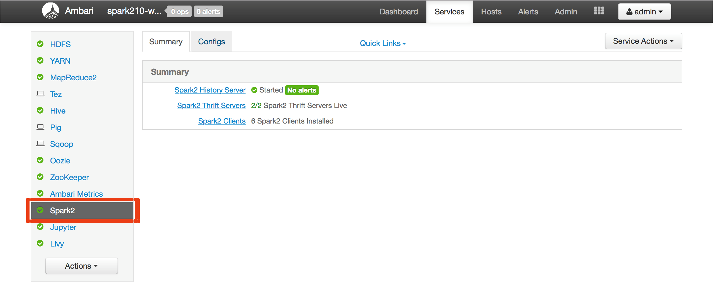
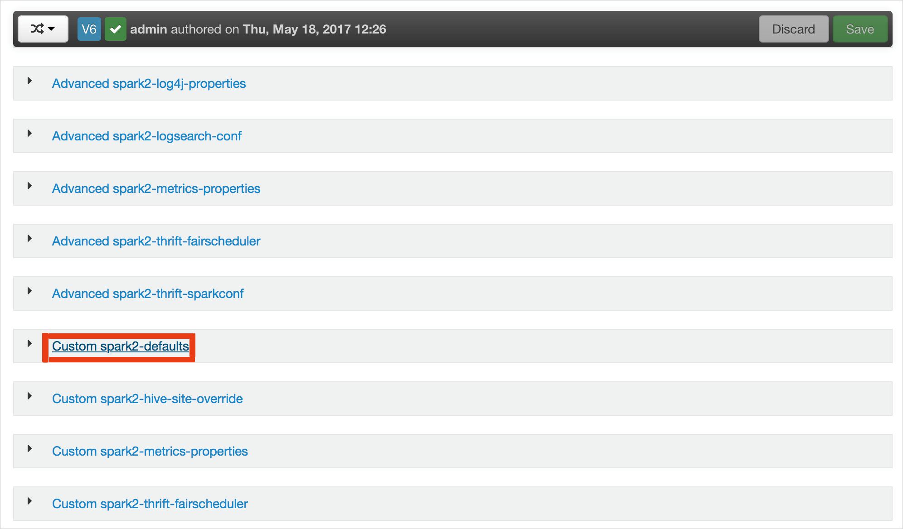
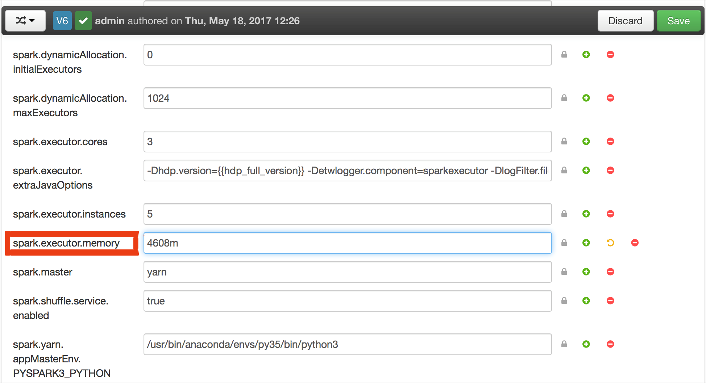
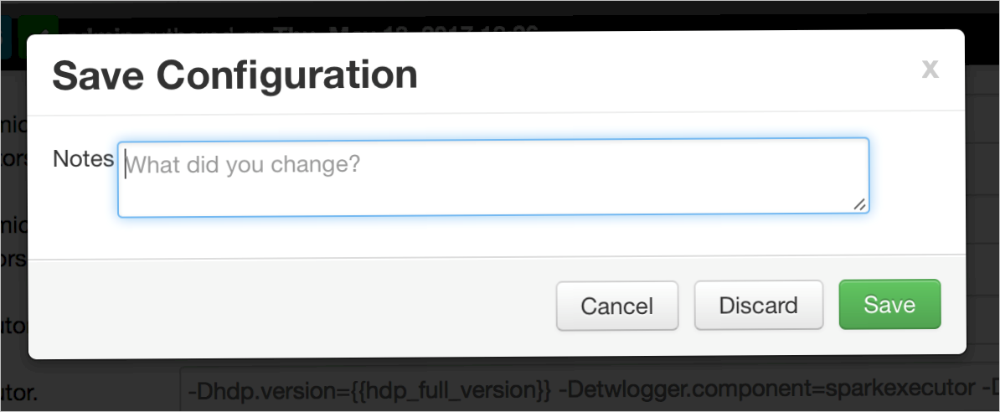
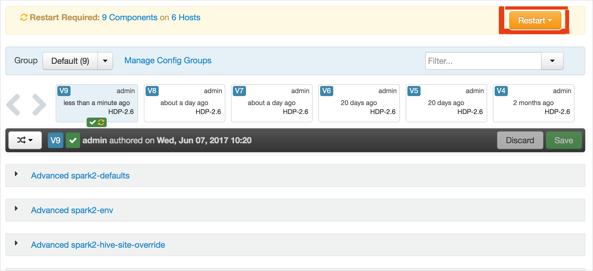
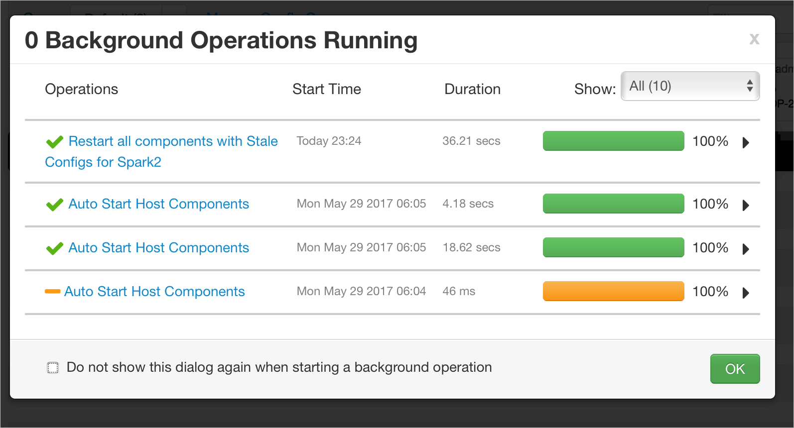
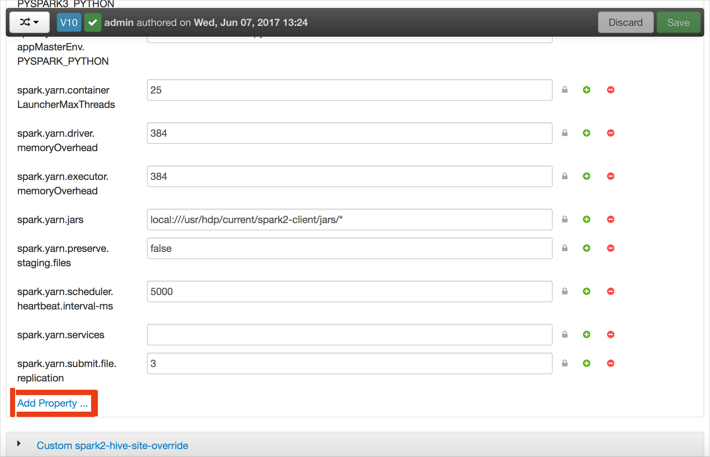
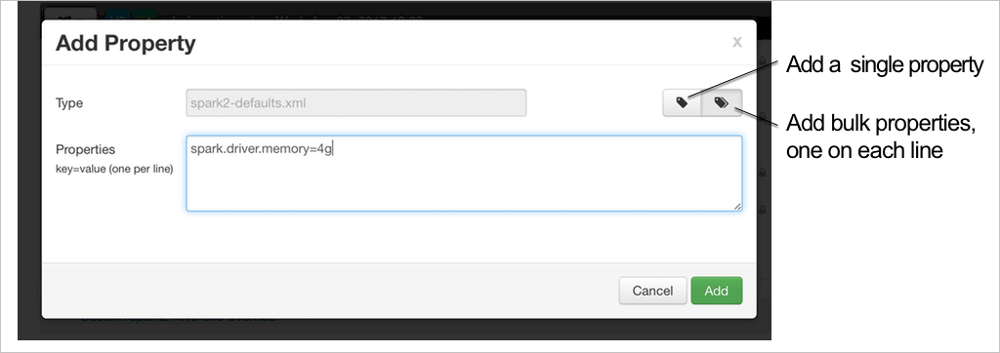

# Spark troubleshooting

This article describes the top issues and their resolutions for working with Spark payloads in Apache Ambari.

## How do I configure a Spark application through Ambari on clusters

### Issue:

Need to configure in Ambari the amount of memory and number of cores that a Spark application can use.  

### Resolution Steps: 

This procedure configuration values previously set in HDInsight Spark clusters. Refer to [Why did my Spark application fail with an OutOfMemoryError?](#why-did-my-spark-application-fail-with-an-outofmemoryerror) to determine which Spark configurations need to be set and to what values.

1. Choose **Spark2** from the list of clusters.

    

1. Click the **Configs** tab.

    

1. In the list of configurations, choose **Custom-spark2-defaults**.

    

1. Look for the value setting that you need to adjust, such as **spark.executor.memory**. In this case, the value of 4608m is too high.

    

1. Set the value as reccommended. In this case, 2048 is reccommended for this setting.

    

1. Save the setting value and then save the configuration. 

    Click **Save** on the toolbar.

    

    You are notified if any configurations need attention. Take note of them and click **Proceed Anyway**. 

    

    Write a note about the configuration changes and click **Save**.

    

1. Whenever a configuration is saved, you are prompted to restart the service. Click **Restart**.

    

    Confirm the restart.

    

    You can review the running processes.

    

1. You can also add configurations. In the list of configurations, choose **Custom-spark2-defaults** as you did in Step 3, and then choose **Add Property**.

    

1. Define a new property. You can either define a single property, with a dialog for specific settings such as the data type, or you can define multiple properties with with one definition per line. 

    In this example, the **spark.driver.memory** property is defined with a value of 4g.

    

1. Save the configuration and restart the service as described in steps 6 and 7.

Note: These changes are cluster wide but can be overridden at actual Spark job submission time.

### Further Reading:

[Spark job submission on HDInsight clusters](https://blogs.msdn.microsoft.com/azuredatalake/2017/01/06/spark-job-submission-on-hdinsight-101/)


## How do I configure a Spark application through a Jupyter notebook on clusters

### Issue:

Need to configure the amount of memory and number of cores that a Spark application can use when using Jupyter notebook on HDInsight clusters. 

1. Refer to the topic [Why did my Spark application fail with OutOfMemoryError?](#spark-application-failure-outofmemory) to determine 
which Spark configurations need to be set and to what values.
1.  Specify the Spark configurations in valid JSON format in the first cell of the Jupyter notebook after the %%configure directive (change the actual values as applicable): 

>

### Further Reading:

[Spark job submission on HDInsight clusters](https://blogs.msdn.microsoft.com/azuredatalake/2017/01/06/spark-job-submission-on-hdinsight-101/)


## How do I configure a Spark application through LIVY on clusters

### Issue:

Need to configure at submit time through LIVY, the amount of memory and number of cores that a Spark application can use on HDInsight clusters. 

1. Refer to the topic [Why did my Spark application fail with OutOfMemoryError?](#spark-application-failure-outofmemory) to determine which Spark configurations need to be set and to what values.
1. Submit the Spark application to LIVY using a REST client like CURL with a command similar to the following (change the actual values as applicable):

```apache
curl -k --user 'username:password' -v -H 'Content-Type: application/json' -X POST -d '{ "file":"wasb://container@storageaccountname.blob.core.windows.net/example/jars/sparkapplication.jar", "className":"com.microsoft.spark.application", "numExecutors":4, "executorMemory":"4g", "executorCores":2, "driverMemory":"8g", "driverCores":4}'  
```

### Further Reading:

[Spark job submission on HDInsight clusters](https://blogs.msdn.microsoft.com/azuredatalake/2017/01/06/spark-job-submission-on-hdinsight-101/)


## How do I configure a Spark application through spark-submit on clusters

### Issue: 

Need to configure at submit time through spark-submit, the amount of memory and number of cores that a Spark application can use on HDInsight clusters.

1. Refer to the topic [Why did my Spark application fail with OutOfMemoryError?](#spark-application-failure-outofmemory) to determine 
which Spark configurations need to be set and to what values.
1. Launch spark-shell with a command similar to the following (change the actual value of the configurations as applicable): 

```apache
spark-submit --master yarn-cluster --class com.microsoft.spark.application --num-executors 4 --executor-memory 4g --executor-cores 2 --driver-memory 8g --driver-cores 4 /home/user/spark/sparkapplication.jar
```

### Further Reading:

[Spark job submission on HDInsight clusters](https://blogs.msdn.microsoft.com/azuredatalake/2017/01/06/spark-job-submission-on-hdinsight-101/)


## What causes a Spark application OutOfMemoryError exception

### Error:

Spark application failed with OutOfMemoryError exception.

### Detailed Description:

Spark application fails with the following types of uncaught exceptions.  
```apache
ERROR Executor: Exception in task 7.0 in stage 6.0 (TID 439) 

java.lang.OutOfMemoryError 
    at java.io.ByteArrayOutputStream.hugeCapacity(Unknown Source) 
    at java.io.ByteArrayOutputStream.grow(Unknown Source) 
    at java.io.ByteArrayOutputStream.ensureCapacity(Unknown Source) 
    at java.io.ByteArrayOutputStream.write(Unknown Source) 
    at java.io.ObjectOutputStream$BlockDataOutputStream.drain(Unknown Source) 
    at java.io.ObjectOutputStream$BlockDataOutputStream.setBlockDataMode(Unknown Source) 
    at java.io.ObjectOutputStream.writeObject0(Unknown Source) 
    at java.io.ObjectOutputStream.writeObject(Unknown Source) 
    at org.apache.spark.serializer.JavaSerializationStream.writeObject(JavaSerializer.scala:44) 
    at org.apache.spark.serializer.JavaSerializerInstance.serialize(JavaSerializer.scala:101) 
    at org.apache.spark.executor.Executor$TaskRunner.run(Executor.scala:239) 
    at java.util.concurrent.ThreadPoolExecutor.runWorker(Unknown Source) 
    at java.util.concurrent.ThreadPoolExecutor$Worker.run(Unknown Source) 
    at java.lang.Thread.run(Unknown Source) 
```

```apache
ERROR SparkUncaughtExceptionHandler: Uncaught exception in thread Thread[Executor task launch worker-0,5,main] 

java.lang.OutOfMemoryError 
    at java.io.ByteArrayOutputStream.hugeCapacity(Unknown Source) 
    at java.io.ByteArrayOutputStream.grow(Unknown Source) 
    at java.io.ByteArrayOutputStream.ensureCapacity(Unknown Source) 
    at java.io.ByteArrayOutputStream.write(Unknown Source) 
    at java.io.ObjectOutputStream$BlockDataOutputStream.drain(Unknown Source) 
    at java.io.ObjectOutputStream$BlockDataOutputStream.setBlockDataMode(Unknown Source) 
    at java.io.ObjectOutputStream.writeObject0(Unknown Source) 
    at java.io.ObjectOutputStream.writeObject(Unknown Source) 
    at org.apache.spark.serializer.JavaSerializationStream.writeObject(JavaSerializer.scala:44) 
    at org.apache.spark.serializer.JavaSerializerInstance.serialize(JavaSerializer.scala:101) 
    at org.apache.spark.executor.Executor$TaskRunner.run(Executor.scala:239) 
    at java.util.concurrent.ThreadPoolExecutor.runWorker(Unknown Source) 
    at java.util.concurrent.ThreadPoolExecutor$Worker.run(Unknown Source) 
    at java.lang.Thread.run(Unknown Source) 
```

### Probable Cause:

The most likely cause of this exception is not enough heap memory allocated to the Java Virtual Machine (JVM) that are launched as executors or driver as part of the Spark application. 

### Resolution Steps:

1. Determine the maximum size of the data the Spark application will handle. A guess can be made based on the maximum of the size of input data, the intermediate data produced by transforming the input data and the output data produced further transforming the intermediate data. This can be an iterative process also if formal initial guess is not possible. 
1. Make sure that the HDInsight cluster to be used has enough resources in terms of memory and also cores to accommodate the Spark application. This can be determined by viewing the Cluster Metrics section of the YARN UI of the cluster for the values of Memory Used vs. Memory Total and VCores Used vs. VCores Total.

1. Set the following Spark configurations to appropriate values that do not exceed 90% of the available memory and cores as viewed by YARN yet well within the memory requirement of the Spark application: 

```apache
spark.executor.instances (Example: 8 for 8 executor count) 
spark.executor.memory (Example: 4g for 4 GB) 
spark.yarn.executor.memoryOverhead (Example: 384m for 384 MB) 
spark.executor.cores (Example: 2 for 2 cores per executor) 
spark.driver.memory (Example: 8g for 8GB) 
spark.driver.cores (Example: 4 for 4 cores)   
spark.yarn.driver.memoryOverhead (Example: 384m for 384MB) 
```

Total memory used by all executors = 
```apache
spark.executor.instances * (spark.executor.memory + spark.yarn.executor.memoryOverhead) 
```
Total memory used by driver = 
```apache
spark.driver.memory + spark.yarn.driver.memoryOverhead
```

### Further Reading:

- [Spark memory management overview](http://spark.apache.org/docs/latest/tuning.html#memory-management-overview)
- [Debugging Spark application on HDInsight clusters](https://blogs.msdn.microsoft.com/azuredatalake/2016/12/19/spark-debugging-101/)


