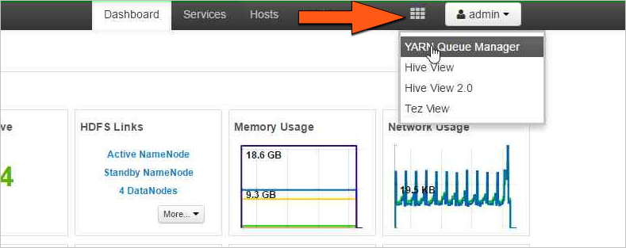
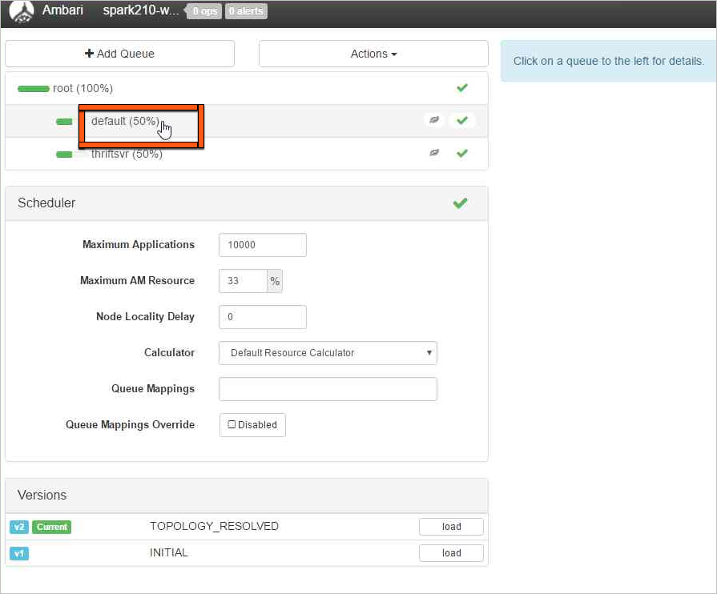
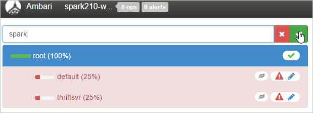
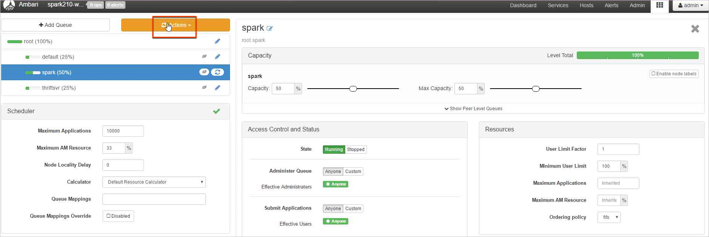

# YARN troubleshooting

This article describes the top issues and their resolutions for working with YARN payloads in Apache Ambari.

## How do I create a new Yarn queue on a cluster

### Issue:

Create a new Yarn queue with capacity allocation on HDInsight cluster.  

### Resolution Steps: 

Use the following steps through Ambari to create a new Yarn queue and balance the capacity allocation among all the queues. 

In this example, two existing queues (default and thriftsvr) are both changed from a 50% capcity to a 25% capacity that allows for the new queue (Spark) to have a 50% capacity.
| Queue | Capcity | Max. Capacity |
| --- | --- | --- | --- |
| default | 25% | 50% |
| thrftsvr | 25% | 50% |
| spark | 50% | 50% |
1. Click the Abari Views icon, the grid pattern, and choose **Yarn Queue Manager**.
    
1. Select the **default** queue.
    
1. Change the **Capacity** from 50% to 25% for the **default** queue and also change it to 25% for the **thriftsvr** queue.
    
1. Click **Add Queue** to create a new queue.
    
1. Name the new queue.
      
1. Leave the **Capacity** values at 50% and click the **Actions** button.
      
1. Choose **Save and Refresh Queues**.
      

Note: These changes will be visible immediately on the Yarn Scheduler UI.

### Further Reading:

- [Yarn Capacity Scheduler](https://hadoop.apache.org/docs/r2.7.2/hadoop-yarn/hadoop-yarn-site/CapacityScheduler.html)


## How do I download Yarn logs from a cluster

#### Issue:

Need to download Yarn application master and other container logs from HDInsight cluster.  

#### Resolution Steps: 

1. Connect to the HDInsight cluster with an Secure Shell (SSH) client (check Further Reading section below).
1. List all the application ids of the currently running Yarn applications with the following command:

```apache
yarn top
```
Note the application id from the `APPLICATIONID` column whose logs are to be downloaded.

```apache
YARN top - 18:00:07, up 19d, 0:14, 0 active users, queue(s): root
NodeManager(s): 4 total, 4 active, 0 unhealthy, 0 decommissioned, 0 lost, 0 rebooted
Queue(s) Applications: 2 running, 10 submitted, 0 pending, 8 completed, 0 killed, 0 failed
Queue(s) Mem(GB): 97 available, 3 allocated, 0 pending, 0 reserved
Queue(s) VCores: 58 available, 2 allocated, 0 pending, 0 reserved
Queue(s) Containers: 2 allocated, 0 pending, 0 reserved

                  APPLICATIONID USER             TYPE      QUEUE   #CONT  #RCONT  VCORES RVCORES     MEM    RMEM  VCORESECS    MEMSECS %PROGR       TIME NAME
 application_1490377567345_0007 hive            spark  thriftsvr       1       0       1       0      1G      0G    1628407    2442611  10.00   18:20:20 Thrift JDBC/ODBC Server
 application_1490377567345_0006 hive            spark  thriftsvr       1       0       1       0      1G      0G    1628430    2442645  10.00   18:20:20 Thrift JDBC/ODBC Server
```

Download Yarn containers logs for all application masters with the following command:
   
```apache
yarn logs -applicationIdn logs -applicationId <application_id> -am ALL > amlogs.txt
```

This will create the log file named `amlogs.txt` in text format. 

Download Yarn container logs for only the latest application master with the following command:

```apache
yarn logs -applicationIdn logs -applicationId <application_id> -am -1 > latestamlogs.txt
```

This will create the log file named `latestamlogs.txt` in text format. 

Download YARN container logs for first two application masters with the following command:

```apache
yarn logs -applicationIdn logs -applicationId <application_id> -am 1,2 > first2amlogs.txt 
```

This will create the log file named `first2amlogs.txt` in text format. 

Download all Yarn container logs with the following command:

```apache
yarn logs -applicationIdn logs -applicationId <application_id> > logs.txt
```

This will create the log file named `logs.txt` in text format. 

Download yarn container log for a particular container with the following command:

```apache
yarn logs -applicationIdn logs -applicationId <application_id> -containerId <container_id> > containerlogs.txt 
```

This will create the log file named `containerlogs.txt` in text format.

#### Further Readings:

- [Connect to HDInsight Cluster using SSH](https://docs.microsoft.com/en-us/azure/hdinsight/hdinsight-hadoop-linux-use-ssh-unix)

- [Apache Hadoop Yarn concepts and applications](https://hortonworks.com/blog/apache-hadoop-yarn-concepts-and-applications/)


