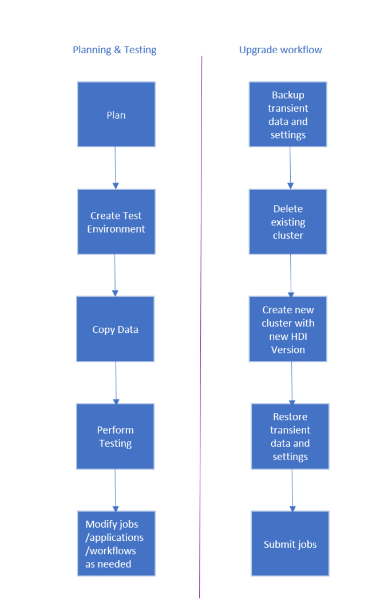

# Migrate HDInsight cluster to a newer version

To take advantage of the latest HDInsight features, we recommend that HDInsight clusters be regularly migrated to latest version. HDInsight does not support in-place upgrades where an existing cluster is upgraded to a newer component version. You must create a new cluster with the desired component and platform version and then migrate your applications to use the new cluster. Follow the below guidelines to migrate your HDInsight cluster versions.

> [!NOTE]  
> For information on supported versions of HDInsight, see [HDInsight component versions](hdinsight-component-versioning.md#supported-hdinsight-versions).

## Migration tasks

The workflow to upgrade HDInsight Cluster is as follows.

1. Read each section of this document to understand changes that may be required when upgrading your HDInsight cluster.
2. Create a cluster as a test/quality assurance environment. For more information on creating a cluster, see [Learn how to create Linux-based HDInsight clusters](hdinsight-hadoop-provision-linux-clusters.md)
3. Copy existing jobs, data sources, and sinks to the new environment.
4. Perform validation testing to make sure that your jobs work as expected on the new cluster.

Once you have verified that everything works as expected, schedule downtime for the migration. During this downtime, do the following actions:

1. Back up any transient data stored locally on the cluster nodes. For example, if you have data stored directly on a head node.
1. [Delete the existing cluster](./hdinsight-delete-cluster.md).
1. Create a cluster in the same VNET subnet with latest (or supported) HDI version using the same default data store that the previous cluster used. This allows the new cluster to continue working against your existing production data.
1. Import any transient data you backed up.
1. Start jobs/continue processing using the new cluster.

## Workload specific guidance

The following documents provide guidance on how to migrate specific workloads:

* [Migrate HBase](./hbase/apache-hbase-migrate-new-version.md)
* [Migrate Kafka](./kafka/migrate-versions.md)
* [Migrate Hive/Interactive Query](./interactive-query/apache-hive-migrate-workloads.md)

## Backup and restore

For more information about database backup and restore, see [Recover a database in Azure SQL Database by using automated database backups](../azure-sql/database/recovery-using-backups.md).

## Next steps

* [Learn how to create Linux-based HDInsight clusters](hdinsight-hadoop-provision-linux-clusters.md)
* [Connect to HDInsight using SSH](hdinsight-hadoop-linux-use-ssh-unix.md)
* [Manage a Linux-based cluster using Apache Ambari](hdinsight-hadoop-manage-ambari.md)
* [HDInsight release notes](./hdinsight-version-release.md)
