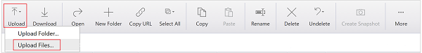
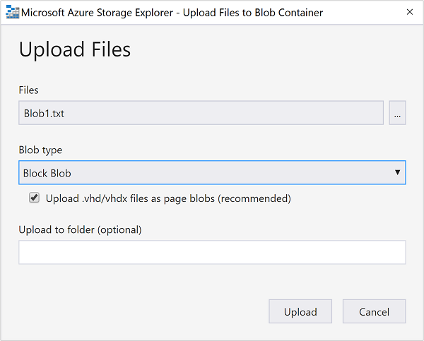

---
title: Upload data for Hadoop jobs in HDInsight | Microsoft Docs
description: Learn how to upload and access data for Hadoop jobs in HDInsight using the Azure CLI, Azure Storage Explorer, Azure PowerShell, the Hadoop command line, or Sqoop.
keywords: etl hadoop, getting data into hadoop, hadoop load data
services: hdinsight,storage
documentationcenter: ''
tags: azure-portal
author: mumian
manager: jhubbard
editor: cgronlun

ms.assetid: 56b913ee-0f9a-4e9f-9eaf-c571f8603dd6
ms.service: hdinsight
ms.custom: hdinsightactive,hdiseo17may2017
ms.workload: big-data
ms.tgt_pltfrm: na
ms.devlang: na
ms.topic: article
ms.date: 05/12/2017
ms.author: jgao

---
# Upload data for Hadoop jobs in HDInsight
Azure HDInsight provides a full-featured Hadoop distributed file system (HDFS) over Azure Blob storage. It is designed as an HDFS extension to provide a seamless experience to customers. It enables the full set of components in the Hadoop ecosystem to operate directly on the data it manages. Azure Blob storage and HDFS are distinct file systems that are optimized for storage of data and computations on that data. For information about the benefits of using Azure Blob storage, see [Use Azure Blob storage with HDInsight][hdinsight-storage].

**Prerequisites**

Note the following requirement before you begin:

* An Azure HDInsight cluster. For instructions, see [Get started with Azure HDInsight][hdinsight-get-started] or [Provision HDInsight clusters][hdinsight-provision].

## Why blob storage?
Azure HDInsight clusters are typically deployed to run MapReduce jobs, and the clusters are dropped after these jobs complete. Keeping the data in the HDFS clusters after computations are complete would be an expensive way to store this data. Azure Blob storage is a highly available, highly scalable, high capacity, low cost, and shareable storage option for data that is to be processed using HDInsight. Storing data in a blob enables the HDInsight clusters that are used for computation to be safely released without losing data.

### Directories
Azure Blob storage containers store data as key/value pairs, and there is no directory hierarchy. However the "/" character can be used within the key name to make it appear as if a file is stored within a directory structure. HDInsight sees these as if they are actual directories.

For example, a blob's key may be *input/log1.txt*. No actual "input" directory exists, but due to the presence of the "/" character in the key name, it has the appearance of a file path.

Because of this, if you use Azure Explorer tools you may notice some 0 byte files. These files serve two purposes:

* If there are empty folders, they mark of the existence of the folder. Azure Blob storage is clever enough to know that if a blob called foo/bar exists, there is a folder called **foo**. But the only way to signify an empty folder called **foo** is by having this special 0 byte file in place.
* They hold special metadata that is needed by the Hadoop file system, notably the permissions and owners for the folders.

## Command-line utilities
Microsoft provides the following utilities to work with Azure Blob storage:

| Tool | Linux | OS X | Windows |
| --- |:---:|:---:|:---:|
| [Azure Command-Line Interface][azurecli] |✔ |✔ |✔ |
| [Azure PowerShell][azure-powershell] | | |✔ |
| [AzCopy][azure-azcopy] | | |✔ |
| [Hadoop command](#commandline) |✔ |✔ |✔ |

> [!NOTE]
> While the Azure CLI, Azure PowerShell, and AzCopy can all be used from outside Azure, the Hadoop command is only available on the HDInsight cluster and only allows loading data from the local file system into Azure Blob storage.
>
>

### Azure CLI
The Azure CLI is a cross-platform tool that allows you to manage Azure services. Use the following steps to upload data to Azure Blob storage:

[!INCLUDE [use-latest-version](../../includes/hdinsight-use-latest-cli.md)]

1. [Install and configure the Azure CLI for Mac, Linux and Windows](../cli-install-nodejs.md).
2. Open a command prompt, bash, or other shell, and use the following to authenticate to your Azure subscription.

        azure login

    When prompted, enter the user name and password for your subscription.
3. Enter the following command to list the storage accounts for your subscription:

        azure storage account list
4. Select the storage account that contains the blob you want to work with, then use the following command to retrieve the key for this account:

        azure storage account keys list <storage-account-name>

    This should return **Primary** and **Secondary** keys. Copy the **Primary** key value because it will be used in the next steps.
5. Use the following command to retrieve a list of blob containers within the storage account:

        azure storage container list -a <storage-account-name> -k <primary-key>
6. Use the following commands to upload and download files to the blob:

   * To upload a file:

           azure storage blob upload -a <storage-account-name> -k <primary-key> <source-file> <container-name> <blob-name>
   * To download a file:

           azure storage blob download -a <storage-account-name> -k <primary-key> <container-name> <blob-name> <destination-file>

> [!NOTE]
> If you will always be working with the same storage account, you can set the following environment variables instead of specifying the account and key for every command:
>
> * **AZURE\_STORAGE\_ACCOUNT**: The storage account name
> * **AZURE\_STORAGE\_ACCESS\_KEY**: The storage account key
>
>

### Azure PowerShell
Azure PowerShell is a scripting environment that you can use to control and automate the deployment and management of your workloads in Azure. For information about configuring your workstation to run Azure PowerShell, see [Install and configure Azure PowerShell](/powershell/azure/overview).

[!INCLUDE [use-latest-version](../../includes/hdinsight-use-latest-powershell.md)]

**To upload a local file to Azure Blob storage**

1. Open the Azure PowerShell console as instructed in [Install and configure Azure PowerShell](/powershell/azure/overview).
2. Set the values of the first five variables in the following script:

        $resourceGroupName = "<AzureResourceGroupName>"
        $storageAccountName = "<StorageAccountName>"
        $containerName = "<ContainerName>"

        $fileName ="<LocalFileName>"
        $blobName = "<BlobName>"

        # Get the storage account key
        $storageAccountKey = (Get-AzureRmStorageAccountKey -ResourceGroupName $resourceGroupName -Name $storageAccountName)[0].Value
        # Create the storage context object
        $destContext = New-AzureStorageContext -StorageAccountName $storageAccountName -StorageAccountKey $storageaccountkey

        # Copy the file from local workstation to the Blob container
        Set-AzureStorageBlobContent -File $fileName -Container $containerName -Blob $blobName -context $destContext
3. Paste the script into the Azure PowerShell console to run it to copy the file.

For example PowerShell scripts created to work with HDInsight, see [HDInsight tools](https://github.com/blackmist/hdinsight-tools).

### AzCopy
AzCopy is a command-line tool that is designed to simplify the task of transferring data into and out of an Azure Storage account. You can use it as a standalone tool or incorporate this tool in an existing application. [Download AzCopy][azure-azcopy-download].

The AzCopy syntax is:

    AzCopy <Source> <Destination> [filePattern [filePattern...]] [Options]

For more information, see [AzCopy - Uploading/Downloading files for Azure Blobs][azure-azcopy].

### Hadoop command line
The Hadoop command line is only useful for storing data into blob storage when the data is already present on the cluster head node.

In order to use the Hadoop command, you must first connect to the headnode using one of the following methods:

* **Windows-based HDInsight**: [Connect using Remote Desktop](hdinsight-administer-use-management-portal.md#connect-to-clusters-using-rdp)
* **Linux-based HDInsight**: Connect using SSH ([the SSH command](hdinsight-hadoop-linux-use-ssh-unix.md) or [PuTTY](hdinsight-hadoop-linux-use-ssh-windows.md))

Once connected, you can use the following syntax to upload a file to storage.

    hadoop -copyFromLocal <localFilePath> <storageFilePath>

For example, `hadoop fs -copyFromLocal data.txt /example/data/data.txt`

Because the default file system for HDInsight is in Azure Blob storage, /example/data.txt is actually in Azure Blob storage. You can also refer to the file as:

    wasb:///example/data/data.txt

or

    wasb://<ContainerName>@<StorageAccountName>.blob.core.windows.net/example/data/davinci.txt

For a list of other Hadoop commands that work with files, see [http://hadoop.apache.org/docs/r2.7.0/hadoop-project-dist/hadoop-common/FileSystemShell.html](http://hadoop.apache.org/docs/r2.7.0/hadoop-project-dist/hadoop-common/FileSystemShell.html)

> [!WARNING]
> On HBase clusters, the default block size used when writing data is 256KB. While this works fine when using HBase APIs or REST APIs, using the `hadoop` or `hdfs dfs` commands to write data larger than ~12GB results in an error. See the [storage exception for write on blob](#storageexception) section below for more information.
>
>

## Graphical clients
There are also several applications that provide a graphical interface for working with Azure Storage. The following is a list of a few of these applications:

| Client | Linux | OS X | Windows |
| --- |:---:|:---:|:---:|
| [Microsoft Visual Studio Tools for HDInsight](hdinsight-hadoop-visual-studio-tools-get-started.md#navigate-the-linked-resources) |✔ |✔ |✔ |
| [Azure Storage Explorer](http://storageexplorer.com/) |✔ |✔ |✔ |
| [Cloud Storage Studio 2](http://www.cerebrata.com/Products/CloudStorageStudio/) | | |✔ |
| [CloudXplorer](http://clumsyleaf.com/products/cloudxplorer) | | |✔ |
| [Azure Explorer](http://www.cloudberrylab.com/free-microsoft-azure-explorer.aspx) | | |✔ |
| [Cyberduck](https://cyberduck.io/) | |✔ |✔ |

### Visual Studio Tools for HDInsight
For more information, see [Navigate the linked resources](hdinsight-hadoop-visual-studio-tools-get-started.md#navigate-the-linked-resources).

### Azure Storage Explorer
*Azure Storage Explorer* is a useful tool for inspecting and altering the data in blobs. It is a free, open source tool that can be downloaded from [http://storageexplorer.com/](http://storageexplorer.com/). The source code is available from this link as well.

Before using the tool, you must know your Azure storage account name and account key. For instructions about getting this information, see the "How to: View, copy and regenerate storage access keys" section of [Create, manage, or delete a storage account][azure-create-storage-account].

1. Run Azure Storage Explorer. If this is the first time you have run the Storage Explorer, you will be prompted for the **_Storage account name** and **Storage account key**. If you have run it before, use the **Add** button to add a new storage account name and key.

    Enter the name and key for the storage account used by your HDInsight cluster and then select **SAVE & OPEN**.

    ![HDI.AzureStorageExplorer][image-azure-storage-explorer]
2. In the list of containers to the left of the interface, click the name of the container that is associated with your HDInsight cluster. By default, this is the name of the HDInsight cluster, but may be different if you entered a specific name when creating the cluster.
3. From the tool bar, select the upload icon.

    
4. Specify a file to upload, and then click **Open**. When prompted, select **Upload** to upload the file to the root of the storage container. If you want to upload the file to a specific path, enter the path in the **Destination** field and then select **Upload**.

    

    Once the file has finished uploading, you can use it from jobs on the HDInsight cluster.

## Mount Azure Blob Storage as Local Drive
See [Mount Azure Blob Storage as Local Drive](http://blogs.msdn.com/b/bigdatasupport/archive/2014/01/09/mount-azure-blob-storage-as-local-drive.aspx).

## Services
### Azure Data Factory
The Azure Data Factory service is a fully managed service for composing data storage, data processing, and data movement services into streamlined, scalable, and reliable data production pipelines.

Azure Data Factory can be used to move data into Azure Blob storage, or to create data pipelines that directly use HDInsight features such as Hive and Pig.

For more information, see the [Azure Data Factory documentation](https://azure.microsoft.com/documentation/services/data-factory/).

### Apache Sqoop
Sqoop is a tool designed to transfer data between Hadoop and relational databases. You can use it to import data from a relational database management system (RDBMS), such as SQL Server, MySQL, or Oracle into the Hadoop distributed file system (HDFS), transform the data in Hadoop with MapReduce or Hive, and then export the data back into an RDBMS.

For more information, see [Use Sqoop with HDInsight][hdinsight-use-sqoop].

## Development SDKs
Azure Blob storage can also be accessed using an Azure SDK from the following programming languages:

* .NET
* Java
* Node.js
* PHP
* Python
* Ruby

For more information on installing the Azure SDKs, see [Azure downloads](https://azure.microsoft.com/downloads/)

## Troubleshooting
### Storage exception for write on blob
**Symptoms**: When using the `hadoop` or `hdfs dfs` commands to write files that are ~12GB or larger on an HBase cluster, you may encounter the following error:

    ERROR azure.NativeAzureFileSystem: Encountered Storage Exception for write on Blob : example/test_large_file.bin._COPYING_ Exception details: null Error Code : RequestBodyTooLarge
    copyFromLocal: java.io.IOException
            at com.microsoft.azure.storage.core.Utility.initIOException(Utility.java:661)
            at com.microsoft.azure.storage.blob.BlobOutputStream$1.call(BlobOutputStream.java:366)
            at com.microsoft.azure.storage.blob.BlobOutputStream$1.call(BlobOutputStream.java:350)
            at java.util.concurrent.FutureTask.run(FutureTask.java:262)
            at java.util.concurrent.Executors$RunnableAdapter.call(Executors.java:471)
            at java.util.concurrent.FutureTask.run(FutureTask.java:262)
            at java.util.concurrent.ThreadPoolExecutor.runWorker(ThreadPoolExecutor.java:1145)
            at java.util.concurrent.ThreadPoolExecutor$Worker.run(ThreadPoolExecutor.java:615)
            at java.lang.Thread.run(Thread.java:745)
    Caused by: com.microsoft.azure.storage.StorageException: The request body is too large and exceeds the maximum permissible limit.
            at com.microsoft.azure.storage.StorageException.translateException(StorageException.java:89)
            at com.microsoft.azure.storage.core.StorageRequest.materializeException(StorageRequest.java:307)
            at com.microsoft.azure.storage.core.ExecutionEngine.executeWithRetry(ExecutionEngine.java:182)
            at com.microsoft.azure.storage.blob.CloudBlockBlob.uploadBlockInternal(CloudBlockBlob.java:816)
            at com.microsoft.azure.storage.blob.CloudBlockBlob.uploadBlock(CloudBlockBlob.java:788)
            at com.microsoft.azure.storage.blob.BlobOutputStream$1.call(BlobOutputStream.java:354)
            ... 7 more

**Cause**: HBase on HDInsight clusters default to a block size of 256KB when writing to Azure storage. While this works for HBase APIs or REST APIs, it will result in an error when using the `hadoop` or `hdfs dfs` command-line utilities.

**Resolution**: Use `fs.azure.write.request.size` to specify a larger block size. You can do this on a per-use basis by using the `-D` parameter. The following is an example using this parameter with the `hadoop` command:

    hadoop -fs -D fs.azure.write.request.size=4194304 -copyFromLocal test_large_file.bin /example/data

You can also increase the value of `fs.azure.write.request.size` globally by using Ambari. The following steps can be used to change the value in the Ambari Web UI:

1. In your browser, go to the Ambari Web UI for your cluster. This is https://CLUSTERNAME.azurehdinsight.net, where **CLUSTERNAME** is the name of your cluster.

    When prompted, enter the admin name and password for the cluster.
2. From the left side of the screen, select **HDFS**, and then select the **Configs** tab.
3. In the **Filter...** field, enter `fs.azure.write.request.size`. This will display the field and current value in the middle of the page.
4. Change the value from 262144 (256KB) to the new value. For example, 4194304 (4MB).

For more information on using Ambari, see [Manage HDInsight clusters using the Ambari Web UI](hdinsight-hadoop-manage-ambari.md).

## Next steps
Now that you understand how to get data into HDInsight, read the following articles to learn how to perform analysis:

* [Get started with Azure HDInsight][hdinsight-get-started]
* [Submit Hadoop jobs programmatically][hdinsight-submit-jobs]
* [Use Hive with HDInsight][hdinsight-use-hive]
* [Use Pig with HDInsight][hdinsight-use-pig]

[azure-management-portal]: https://porta.azure.com
[azure-powershell]: http://msdn.microsoft.com/library/windowsazure/jj152841.aspx

[azure-storage-client-library]: /develop/net/how-to-guides/blob-storage/
[azure-create-storage-account]: ../storage/storage-create-storage-account.md
[azure-azcopy-download]: ../storage/storage-use-azcopy.md
[azure-azcopy]: ../storage/storage-use-azcopy.md

[hdinsight-use-sqoop]: hdinsight-use-sqoop.md

[hdinsight-storage]: hdinsight-hadoop-use-blob-storage.md
[hdinsight-submit-jobs]: hdinsight-submit-hadoop-jobs-programmatically.md
[hdinsight-get-started]: hdinsight-hadoop-linux-tutorial-get-started.md

[hdinsight-use-hive]: hdinsight-use-hive.md
[hdinsight-use-pig]: hdinsight-use-pig.md
[hdinsight-provision]: hdinsight-hadoop-provision-linux-clusters.md

[sqldatabase-create-configure]: ../sql-database-create-configure.md

[apache-sqoop-guide]: http://sqoop.apache.org/docs/1.4.4/SqoopUserGuide.html

[Powershell-install-configure]: /powershell/azureps-cmdlets-docs

[azurecli]: ../cli-install-nodejs.md

[image-azure-storage-explorer]: ./media/hdinsight-upload-data/HDI.AzureStorageExplorer.png
[image-ase-addaccount]: ./media/hdinsight-upload-data/HDI.ASEAddAccount.png
[image-ase-blob]: ./media/hdinsight-upload-data/HDI.ASEBlob.png
