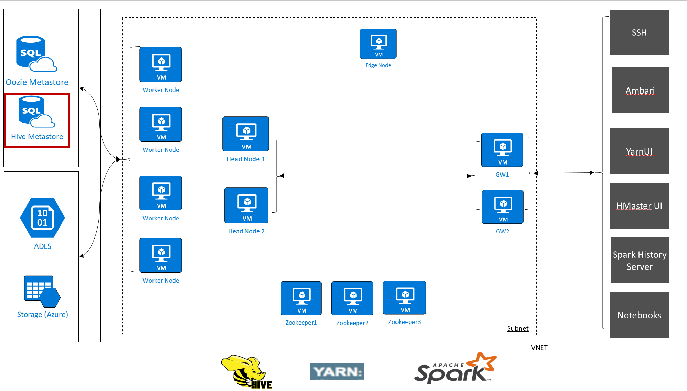
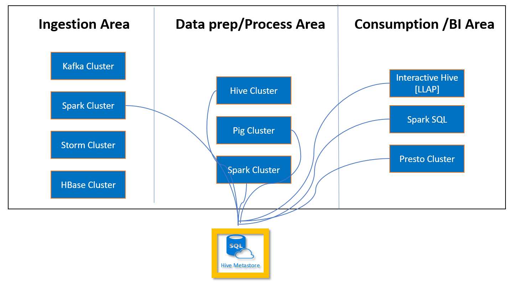
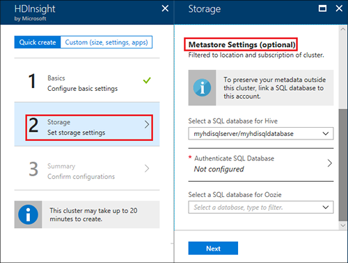
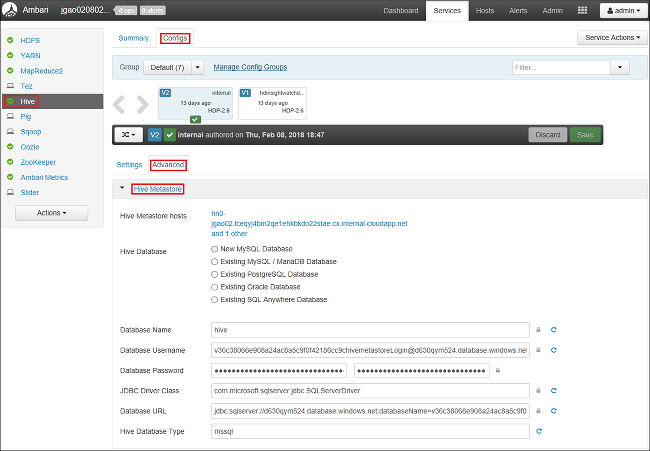

# Use external metadata stores in Azure HDInsight

The Hive metastore in HDInsight is an essential part of Hadoop architecture. A metastore is the central schema repository that can be used by other big data access tools such as Spark, Interactive Query (LLAP), Presto, or Pig. HDInsight uses an Azure SQL Database as the Hive metastore.

There are two ways you can set up a metastore for your HDInsight clusters:

* [Default metastore](#default-metastore)
* [Custom metastore](#custom-metastore)

## Default metastore

By default, HDInsight provisions a metastore with every cluster type. You can instead specify a custom metastore. The default metastore includes the following considerations:
- No additional cost. HDInsight provisions a metastore with every cluster type without any additional cost to you.
- Each default metastore is part of the cluster lifecycle. When you delete a cluster that metastore and metadata are also deleted.
- You cannot share the default metastore with other clusters.
- The default metastore uses the basic Azure SQL DB, which has a 5 DTU (database transaction unit) limit.
This default metastore is typically used for relatively simple workloads that don't require multiple clusters and don’t need metadata preserved beyond the cluster's lifecycle.

## Custom metastore

HDInsight also supports custom metastores, which are recommended for production clusters:
- You specify your own Azure SQL Database as the metastore.
- The lifecycle of the metastore is not tied to a clusters lifecycle, so you can create and delete clusters without losing metadata. Metadata such as your Hive schemas will persist even after you delete and re-create the HDInsight cluster.
- A custom metastore lets you attach multiple clusters and cluster types to that metastore. For example, a single metastore can be shared across Interactive Query, Hive, and Spark clusters in HDInsight.
- You pay for the cost of a metastore (Azure SQL DB) according to the performance level you choose.
- You can scale up the metastore as needed.

<!-- Image – Typical shared custom Metastore scenario in HDInsight (?) -->

### Select a custom metastore during cluster creation

You can point your cluster to a previously created Azure SQL Database during cluster creation, or you can configure the SQL Database after the cluster is created. This option is specified with the Storage > Metastore settings while creating a new Hadoop, Spark, or interactive Hive cluster from Azure portal.

You can also add additional clusters to a custom metastore from Azure portal or from Ambari configurations (Hive > Advanced)

## Hive metastore best practices

Here are some general HDInsight Hive metastore best practices:

- Use a custom metastore whenever possible, as this will help separate compute resources (your running cluster) and metadata (stored in the metastore).
- Start with an S2 tier, which provides  50 DTU and 250 GB of storage. If you see a bottleneck, you can scale the database up.
- Ensure that the metastore created for one HDInsight cluster version is not shared across different HDInsight cluster versions. Different Hive versions use different schemas. For example, you cannot share a metastore with both Hive 1.2 and Hive 2.1 clusters.
- Back up your custom metastore periodically.
- Keep your metastore and HDInsight cluster in the same region.
- Monitor your metastore for performance and availability using Azure SQL Database Monitoring tools, such as the Azure portal or Azure Log Analytics.

## Oozie Metastore

Apache Oozie is a workflow coordination system that manages Hadoop jobs.  Oozie supports Hadoop jobs for Apache MapReduce, Pig, Hive, and others.  Oozie uses a metastore to store details about current and completed workflows. To increase performance when using Oozie, you can use Azure SQL Database as a custom metastore. The metastore can also provide access to Oozie job data after you delete your cluster.

For instructions on creating an Oozie metastore with Azure SQL Database, see [Use Oozie for workflows](hdinsight-use-oozie-linux-mac.md).

## Next steps

- [Set up clusters in HDInsight with Hadoop, Spark, Kafka, and more](./hdinsight-hadoop-provision-linux-clusters.md)
