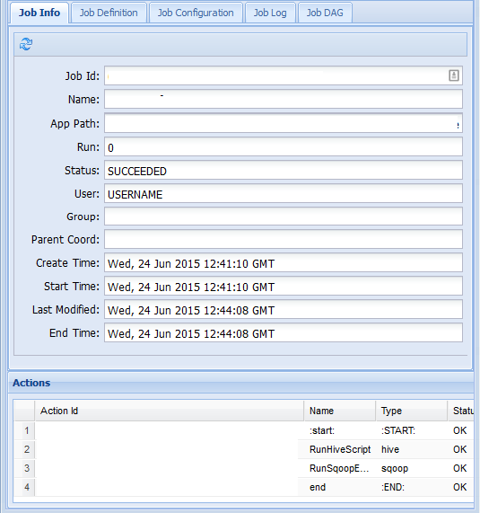

# Use Apache Oozie with Apache Hadoop to define and run a workflow on Linux-based Azure HDInsight

Learn how to use Apache Oozie with Apache Hadoop on Azure HDInsight. Oozie is a workflow and coordination system that manages Hadoop jobs. Oozie is integrated with the Hadoop stack, and it supports the following jobs:

* Apache Hadoop MapReduce
* Apache Pig
* Apache Hive
* Apache Sqoop

You can also use Oozie to schedule jobs that are specific to a system, like Java programs or shell scripts.

> [!NOTE]  
> Another option to define workflows with HDInsight is to use Azure Data Factory. To learn more about Data Factory, see [Use Apache Pig and Apache Hive with Data Factory](../data-factory/transform-data.md). To use Oozie on clusters with Enterprise Security Package please see [Run Apache Oozie in HDInsight Hadoop clusters with Enterprise Security Package](domain-joined/hdinsight-use-oozie-domain-joined-clusters.md).

## Prerequisites

* **A Hadoop cluster on HDInsight**. See [Get Started with HDInsight on Linux](hadoop/apache-hadoop-linux-tutorial-get-started.md).

* **An SSH client**. See [Connect to HDInsight (Apache Hadoop) using SSH](hdinsight-hadoop-linux-use-ssh-unix.md).

* **An Azure SQL Database**.  See [Create an Azure SQL database in the Azure portal](../sql-database/sql-database-get-started.md).  This article uses a database named **oozietest**.

* The URI scheme for your clusters primary storage. `wasb://` for Azure Storage, `abfs://` for Azure Data Lake Storage Gen2 or `adl://` for Azure Data Lake Storage Gen1. If secure transfer is enabled for Azure Storage, the URI would be `wasbs://`. See also, [secure transfer](../storage/common/storage-require-secure-transfer.md).

## Example workflow

The workflow used in this document contains two actions. Actions are definitions for tasks, such as running Hive, Sqoop, MapReduce, or other processes:


1. A Hive action runs an HiveQL script to extract records from the `hivesampletable` that's included with HDInsight. Each row of data describes a visit from a specific mobile device. The record format appears like the following text:

        8       18:54:20        en-US   Android Samsung SCH-i500        California     United States    13.9204007      0       0
        23      19:19:44        en-US   Android HTC     Incredible      Pennsylvania   United States    NULL    0       0
        23      19:19:46        en-US   Android HTC     Incredible      Pennsylvania   United States    1.4757422       0       1

    The Hive script used in this document counts the total visits for each platform, such as Android or iPhone, and stores the counts to a new Hive table.

    For more information about Hive, see [Use Apache Hive with HDInsight][hdinsight-use-hive].

2. A Sqoop action exports the contents of the new Hive table to a table created in Azure SQL Database. For more information about Sqoop, see [Use Apache Sqoop with HDInsight](hadoop/apache-hadoop-use-sqoop-mac-linux.md).

> [!NOTE]  
> For supported Oozie versions on HDInsight clusters, see [What's new in the Hadoop cluster versions provided by HDInsight](hdinsight-component-versioning.md).

## Create the working directory

Oozie expects you to store all the resources required for a job in the same directory. This example uses `wasbs:///tutorials/useoozie`. To create this directory, complete the following steps:

1. Edit the code below to replace `sshuser` with the SSH user name for the cluster, and replace `CLUSTERNAME` with the name of the cluster.  Then enter the code to connect to the HDInsight cluster by [using SSH](hdinsight-hadoop-linux-use-ssh-unix.md).  

    ```bash
    ssh sshuser@CLUSTERNAME-ssh.azurehdinsight.net
    ```

2. To create the directory, use the following command:

    ```bash
    hdfs dfs -mkdir -p /tutorials/useoozie/data
    ```

    > [!NOTE]  
    > The `-p` parameter causes the creation of all directories in the path. The `data` directory is used to hold the data used by the `useooziewf.hql` script.

3. Edit the code below to replace `sshuser` with your SSH user name.  To make sure that Oozie can impersonate your user account, use the following command:

    ```bash
    sudo adduser sshuser users
    ```

    > [!NOTE]  
    > You can ignore errors that indicate the user is already a member of the `users` group.

## Add a database driver

This workflow uses Sqoop to export data to the SQL database. So you must provide a copy of the JDBC driver used to interact with the SQL database. To copy the JDBC driver to the working directory, use the following command from the SSH session:

```bash
hdfs dfs -put /usr/share/java/sqljdbc_7.0/enu/mssql-jdbc*.jar /tutorials/useoozie/
```

> [!IMPORTANT]  
> Verify the actual JDBC driver that exists at `/usr/share/java/`.

If your workflow used other resources, such as a jar that contains a MapReduce application, you need to add those resources as well.

## Define the Hive query

Use the following steps to create a Hive query language (HiveQL) script that defines a query. You'll use the query in an Oozie workflow later in this document.

1. From the SSH connection, use the following command to create a file named `useooziewf.hql`:

    ```bash
    nano useooziewf.hql
    ```

1. After the GNU nano editor opens, use the following query as the contents of the file:

    ```hiveql
    DROP TABLE ${hiveTableName};
    CREATE EXTERNAL TABLE ${hiveTableName}(deviceplatform string, count string) ROW FORMAT DELIMITED
    FIELDS TERMINATED BY '\t' STORED AS TEXTFILE LOCATION '${hiveDataFolder}';
    INSERT OVERWRITE TABLE ${hiveTableName} SELECT deviceplatform, COUNT(*) as count FROM hivesampletable GROUP BY deviceplatform;
    ```

    There are two variables used in the script:

   * `${hiveTableName}`: Contains the name of the table to be created.

   * `${hiveDataFolder}`: Contains the location to store the data files for the table.

     The workflow definition file, workflow.xml in this article, passes these values to this HiveQL script at runtime.

1. To save the file, select **Ctrl+X**, enter **Y**, and then select **Enter**.  

1. Use the following command to copy `useooziewf.hql` to `wasbs:///tutorials/useoozie/useooziewf.hql`:

    ```bash
    hdfs dfs -put useooziewf.hql /tutorials/useoozie/useooziewf.hql
    ```

    This command stores the `useooziewf.hql` file in the HDFS-compatible storage for the cluster.

## Define the workflow

Oozie workflow definitions are written in Hadoop Process Definition Language (hPDL), which is an XML process definition language. Use the following steps to define the workflow:

1. Use the following statement to create and edit a new file:

    ```bash
    nano workflow.xml
    ```

2. After the nano editor opens, enter the following XML as the file contents:

    ```xml
    <workflow-app name="useooziewf" xmlns="uri:oozie:workflow:0.2">
        <start to = "RunHiveScript"/>
        <action name="RunHiveScript">
        <hive xmlns="uri:oozie:hive-action:0.2">
            <job-tracker>${jobTracker}</job-tracker>
            <name-node>${nameNode}</name-node>
            <configuration>
            <property>
                <name>mapred.job.queue.name</name>
                <value>${queueName}</value>
            </property>
            </configuration>
            <script>${hiveScript}</script>
            <param>hiveTableName=${hiveTableName}</param>
            <param>hiveDataFolder=${hiveDataFolder}</param>
        </hive>
        <ok to="RunSqoopExport"/>
        <error to="fail"/>
        </action>
        <action name="RunSqoopExport">
        <sqoop xmlns="uri:oozie:sqoop-action:0.2">
            <job-tracker>${jobTracker}</job-tracker>
            <name-node>${nameNode}</name-node>
            <configuration>
            <property>
                <name>mapred.compress.map.output</name>
                <value>true</value>
            </property>
            </configuration>
            <arg>export</arg>
            <arg>--connect</arg>
            <arg>${sqlDatabaseConnectionString}</arg>
            <arg>--table</arg>
            <arg>${sqlDatabaseTableName}</arg>
            <arg>--export-dir</arg>
            <arg>${hiveDataFolder}</arg>
            <arg>-m</arg>
            <arg>1</arg>
            <arg>--input-fields-terminated-by</arg>
            <arg>"\t"</arg>
            <archive>mssql-jdbc-7.0.0.jre8.jar</archive>
            </sqoop>
        <ok to="end"/>
        <error to="fail"/>
        </action>
        <kill name="fail">
        <message>Job failed, error message[${wf:errorMessage(wf:lastErrorNode())}] </message>
        </kill>
        <end name="end"/>
    </workflow-app>
    ```

    There are two actions defined in the workflow:

   * `RunHiveScript`: This action is the start action and runs the `useooziewf.hql` Hive script.

   * `RunSqoopExport`: This action exports the data created from the Hive script to a SQL database by using Sqoop. This action only runs if the `RunHiveScript` action is successful.

     The workflow has several entries, such as `${jobTracker}`. You'll replace these entries with the values you use in the job definition. You'll create the job definition later in this document.

     Also note the `<archive>mssql-jdbc-7.0.0.jre8.jar</archive>` entry in the Sqoop section. This entry instructs Oozie to make this archive available for Sqoop when this action runs.

3. To save the file, select **Ctrl+X**, enter **Y**, and then select **Enter**.  

4. Use the following command to copy the `workflow.xml` file to `/tutorials/useoozie/workflow.xml`:

    ```bash
    hdfs dfs -put workflow.xml /tutorials/useoozie/workflow.xml
    ```

## Create a table

> [!NOTE]  
> There are many ways to connect to SQL Database to create a table. The following steps use [FreeTDS](https://www.freetds.org/) from the HDInsight cluster.

1. Use the following command to install FreeTDS on the HDInsight cluster:

    ```bash
    sudo apt-get --assume-yes install freetds-dev freetds-bin
    ```

2. Edit the code below to replace `<serverName>` with your [logical SQL server](../azure-sql/database/logical-servers.md) name, and `<sqlLogin>` with the server login.  Enter the command to connect to the prerequisite SQL database.  Enter the password at the prompt.

    ```bash
    TDSVER=8.0 tsql -H <serverName>.database.windows.net -U <sqlLogin> -p 1433 -D oozietest
    ```

    You receive output like the following text:

        locale is "en_US.UTF-8"
        locale charset is "UTF-8"
        using default charset "UTF-8"
        Default database being set to oozietest
        1>

3. At the `1>` prompt, enter the following lines:

    ```sql
    CREATE TABLE [dbo].[mobiledata](
    [deviceplatform] [nvarchar](50),
    [count] [bigint])
    GO
    CREATE CLUSTERED INDEX mobiledata_clustered_index on mobiledata(deviceplatform)
    GO
    ```

    When the `GO` statement is entered, the previous statements are evaluated. These statements create a table, named `mobiledata`, that's used by the workflow.

    To verify that the table has been created, use the following commands:

    ```sql
    SELECT * FROM information_schema.tables
    GO
    ```

    You see output like the following text:

        TABLE_CATALOG   TABLE_SCHEMA    TABLE_NAME      TABLE_TYPE
        oozietest       dbo             mobiledata      BASE TABLE

4. Exit the tsql utility by entering `exit` at the `1>` prompt.

## Create the job definition

The job definition describes where to find the workflow.xml. It also describes where to find other files used by the workflow, such as `useooziewf.hql`. Also, it defines the values for properties used within the workflow and the associated files.

1. To get the full address of the default storage, use the following command. This address is used in the configuration file you create in the next step.

    ```bash
    sed -n '/<name>fs.default/,/<\/value>/p' /etc/hadoop/conf/core-site.xml
    ```

    This command returns information like the following XML:

    ```xml
    <name>fs.defaultFS</name>
    <value>wasbs://mycontainer@mystorageaccount.blob.core.windows.net</value>
    ```

    > [!NOTE]  
    > If the HDInsight cluster uses Azure Storage as the default storage, the `<value>` element contents begin with `wasbs://`. If Azure Data Lake Storage Gen1 is used instead, it begins with `adl://`. If Azure Data Lake Storage Gen2 is used, it begins with `abfs://`.

    Save the contents of the `<value>` element, as it's used in the next steps.

2. Edit the xml below as follows:

    |Placeholder value| Replaced value|
    |---|---|
    |wasbs://mycontainer\@mystorageaccount.blob.core.windows.net| Value received from step 1.|
    |admin| Your login name for the HDInsight cluster if not admin.|
    |serverName| Azure SQL Database server name.|
    |sqlLogin| Azure SQL Database server login.|
    |sqlPassword| Azure SQL Database server login password.|

    ```xml
    <?xml version="1.0" encoding="UTF-8"?>
    <configuration>

        <property>
        <name>nameNode</name>
        <value>wasbs://mycontainer@mystorageaccount.blob.core.windows.net</value>
        </property>

        <property>
        <name>jobTracker</name>
        <value>headnodehost:8050</value>
        </property>

        <property>
        <name>queueName</name>
        <value>default</value>
        </property>

        <property>
        <name>oozie.use.system.libpath</name>
        <value>true</value>
        </property>

        <property>
        <name>hiveScript</name>
        <value>wasbs://mycontainer@mystorageaccount.blob.core.windows.net/tutorials/useoozie/useooziewf.hql</value>
        </property>

        <property>
        <name>hiveTableName</name>
        <value>mobilecount</value>
        </property>

        <property>
        <name>hiveDataFolder</name>
        <value>wasbs://mycontainer@mystorageaccount.blob.core.windows.net/tutorials/useoozie/data</value>
        </property>

        <property>
        <name>sqlDatabaseConnectionString</name>
        <value>"jdbc:sqlserver://serverName.database.windows.net;user=sqlLogin;password=sqlPassword;database=oozietest"</value>
        </property>

        <property>
        <name>sqlDatabaseTableName</name>
        <value>mobiledata</value>
        </property>

        <property>
        <name>user.name</name>
        <value>admin</value>
        </property>

        <property>
        <name>oozie.wf.application.path</name>
        <value>wasbs://mycontainer@mystorageaccount.blob.core.windows.net/tutorials/useoozie</value>
        </property>
    </configuration>
    ```

    Most of the information in this file is used to populate the values used in the workflow.xml or ooziewf.hql files, such as `${nameNode}`.  If the path is a `wasbs` path, you must use the full path. Don't shorten it to just `wasbs:///`. The `oozie.wf.application.path` entry defines where to find the workflow.xml file. This file contains the workflow that was run by this job.

3. To create the Oozie job definition configuration, use the following command:

    ```bash
    nano job.xml
    ```

4. After the nano editor opens, paste the edited XML as the contents of the file.

5. To save the file, select **Ctrl+X**, enter **Y**, and then select **Enter**.

## Submit and manage the job

The following steps use the Oozie command to submit and manage Oozie workflows on the cluster. The Oozie command is a friendly interface over the [Oozie REST API](https://oozie.apache.org/docs/4.1.0/WebServicesAPI.html).

> [!IMPORTANT]  
> When you use the Oozie command, you must use the FQDN for the HDInsight head node. This FQDN is only accessible from the cluster, or if the cluster is on an Azure virtual network, from other machines on the same network.

1. To obtain the URL to the Oozie service, use the following command:

    ```bash
    sed -n '/<name>oozie.base.url/,/<\/value>/p' /etc/oozie/conf/oozie-site.xml
    ```

    This returns information like the following XML:

    ```xml
    <name>oozie.base.url</name>
    <value>http://ACTIVE-HEADNODE-NAME.UNIQUEID.cx.internal.cloudapp.net:11000/oozie</value>
    ```

    The `http://ACTIVE-HEADNODE-NAME.UNIQUEID.cx.internal.cloudapp.net:11000/oozie` portion is the URL to use with the Oozie command.

2. Edit the code to replace the URL with the one you received earlier. To create an environment variable for the URL, use the following, so you don't have to enter it for every command:

    ```bash
    export OOZIE_URL=http://HOSTNAMEt:11000/oozie
    ```

3. To submit the job, use the following code:

    ```bash
    oozie job -config job.xml -submit
    ```

    This command loads the job information from `job.xml` and submits it to Oozie, but doesn't run it.

    After the command finishes, it should return the ID of the job, for example, `0000005-150622124850154-oozie-oozi-W`. This ID is used to manage the job.

4. Edit the code below to replace `<JOBID>` with the ID returned in the previous step.  To view the status of the job, use the following command:

    ```bash
    oozie job -info <JOBID>
    ```

    This returns information like the following text:

        Job ID : 0000005-150622124850154-oozie-oozi-W
        ------------------------------------------------------------------------------------------------------------------------------------
        Workflow Name : useooziewf
        App Path      : wasb:///tutorials/useoozie
        Status        : PREP
        Run           : 0
        User          : USERNAME
        Group         : -
        Created       : 2015-06-22 15:06 GMT
        Started       : -
        Last Modified : 2015-06-22 15:06 GMT
        Ended         : -
        CoordAction ID: -
        ------------------------------------------------------------------------------------------------------------------------------------

    This job has a status of `PREP`. This status indicates that the job was created, but not started.

5. Edit the code below to replace `<JOBID>` with the ID returned previously.  To start the job, use the following command:

    ```bash
    oozie job -start <JOBID>
    ```

    If you check the status after this command, it's in a running state, and information is returned for the actions within the job.  The job will take a few minutes to complete.

6. Edit the code below to replace `<serverName>` with your server name, and `<sqlLogin>` with the server login.  *After the task finishes* successfully, you can verify that the data was generated and exported to the SQL database table by using the following command.  Enter the password at the prompt.

    ```bash
    TDSVER=8.0 tsql -H <serverName>.database.windows.net -U <sqlLogin> -p 1433 -D oozietest
    ```

    At the `1>` prompt, enter the following query:

    ```sql
    SELECT * FROM mobiledata
    GO
    ```

    The information returned is like the following text:

        deviceplatform  count
        Android 31591
        iPhone OS       22731
        proprietary development 3
        RIM OS  3464
        Unknown 213
        Windows Phone   1791
        (6 rows affected)

For more information on the Oozie command, see [Apache Oozie command-line tool](https://oozie.apache.org/docs/4.1.0/DG_CommandLineTool.html).

## Oozie REST API

With the Oozie REST API, you can build your own tools that work with Oozie. The following HDInsight-specific information about the use of the Oozie REST API:

* **URI**: You can access the REST API from outside the cluster at `https://CLUSTERNAME.azurehdinsight.net/oozie`.

* **Authentication**: To authenticate, use the API the cluster HTTP account (admin) and password. For example:

    ```bash
    curl -u admin:PASSWORD https://CLUSTERNAME.azurehdinsight.net/oozie/versions
    ```

For more information on how to use the Oozie REST API, see [Apache Oozie Web Services API](https://oozie.apache.org/docs/4.1.0/WebServicesAPI.html).

## Oozie web UI

The Oozie web UI provides a web-based view into the status of Oozie jobs on the cluster. With the web UI you can view the following information:

   * Job status
   * Job definition
   * Configuration
   * A graph of the actions in the job
   * Logs for the job

You can also view the details for the actions within a job.

To access the Oozie web UI, complete the following steps:

1. Create an SSH tunnel to the HDInsight cluster. For more information, see [Use SSH Tunneling with HDInsight](hdinsight-linux-ambari-ssh-tunnel.md).

2. After you create a tunnel, open the Ambari web UI in your web browser using URI `http://headnodehost:8080`.

3. From the left side of the page, select **Oozie** > **Quick Links** > **Oozie Web UI**.

    

4. The Oozie web UI defaults to display the running workflow jobs. To see all the workflow jobs, select **All Jobs**.

    

5. To view more information about a job, select the job.

    

6. From the **Job Info** tab, you can see the basic job information and the individual actions within the job. You can use the tabs at the top to view the **Job Definition**, **Job Configuration**, access the **Job Log**, or view a directed acyclic graph (DAG) of the job under **Job DAG**.

   * **Job Log**: Select the **Get Logs** button to get all logs for the job, or use the **Enter Search Filter** field to filter the logs.

       

   * **Job DAG**: The DAG is a graphical overview of the data paths taken through the workflow.

       

7. If you select one of the actions from the **Job Info** tab, it brings up information for the action. For example, select the **RunSqoopExport** action.

    

8. You can see details for the action, such as a link to the **Console URL**. Use this link to view job tracker information for the job.

## Schedule jobs

You can use the coordinator to specify a start, an end, and the occurrence frequency for jobs. To define a schedule for the workflow, complete the following steps:

1. Use the following command to create a file named **coordinator.xml**:

    ```bash
    nano coordinator.xml
    ```

    Use the following XML as the contents of the file:

    ```xml
    <coordinator-app name="my_coord_app" frequency="${coordFrequency}" start="${coordStart}" end="${coordEnd}" timezone="${coordTimezone}" xmlns="uri:oozie:coordinator:0.4">
        <action>
        <workflow>
            <app-path>${workflowPath}</app-path>
        </workflow>
        </action>
    </coordinator-app>
    ```

    > [!NOTE]  
    > The `${...}` variables are replaced by values in the job definition at runtime. The variables are:
    >
    > * `${coordFrequency}`: The time between running instances of the job.
    > * `${coordStart}`: The job start time.
    > * `${coordEnd}`: The job end time.
    > * `${coordTimezone}`: Coordinator jobs are in a fixed time zone with no daylight savings time, typically represented by using UTC. This time zone is referred as the *Oozie processing timezone.*
    > * `${wfPath}`: The path to the workflow.xml.

2. To save the file, select **Ctrl+X**, enter **Y**, and then select **Enter**.

3. To copy the file to the working directory for this job, use the following command:

    ```bash
    hadoop fs -put coordinator.xml /tutorials/useoozie/coordinator.xml
    ```

4. To modify the `job.xml` file you created earlier, use the following command:

    ```bash
    nano job.xml
    ```

    Make the following changes:

   * To instruct Oozie to run the coordinator file instead of the workflow, change `<name>oozie.wf.application.path</name>` to `<name>oozie.coord.application.path</name>`.

   * To set the `workflowPath` variable used by the coordinator, add the following XML:

        ```xml
        <property>
            <name>workflowPath</name>
            <value>wasbs://mycontainer@mystorageaccount.blob.core.windows.net/tutorials/useoozie</value>
        </property>
        ```

       Replace the `wasbs://mycontainer@mystorageaccount.blob.core.windows` text with the value used in the other entries in the job.xml file.

   * To define the start, end, and frequency for the coordinator, add the following XML:

        ```xml
        <property>
            <name>coordStart</name>
            <value>2018-05-10T12:00Z</value>
        </property>

        <property>
            <name>coordEnd</name>
            <value>2018-05-12T12:00Z</value>
        </property>

        <property>
            <name>coordFrequency</name>
            <value>1440</value>
        </property>

        <property>
            <name>coordTimezone</name>
            <value>UTC</value>
        </property>
        ```

       These values set the start time to 12:00 PM on May 10, 2018, and the end time to May 12, 2018. The interval for running this job is set to daily. The frequency is in minutes, so 24 hours x 60 minutes = 1440 minutes. Finally, the time zone is set to UTC.

5. To save the file, select **Ctrl+X**, enter **Y**, and then select **Enter**.

6. To submit and start the job, use the following command:

    ```bash
    oozie job -config job.xml -run
    ```

7. If you go to the Oozie web UI and select the **Coordinator Jobs** tab, you see information like in the following image:

    

    The **Next Materialization** entry contains the next time that the job runs.

8. Like the earlier workflow job, if you select the job entry in the web UI it displays information on the job:

    

    > [!NOTE]  
    > This image only shows successful runs of the job, not the individual actions within the scheduled workflow. To see the individual actions, select one of the **Action** entries.

    

## Next steps

In this article, you learned how to define an Oozie workflow and how to run an Oozie job. To learn more about how to work with HDInsight, see the following articles:

* [Upload data for Apache Hadoop jobs in HDInsight](hdinsight-upload-data.md)
* [Use Apache Sqoop with Apache Hadoop in HDInsight](hadoop/apache-hadoop-use-sqoop-mac-linux.md)
* [Use Apache Hive with Apache Hadoop on HDInsight](hadoop/hdinsight-use-hive.md)
* [Troubleshoot Apache Oozie](./troubleshoot-oozie.md)
