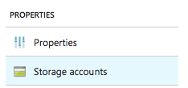
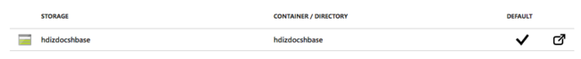
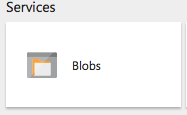
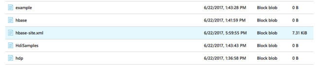
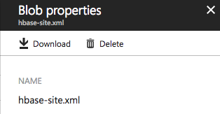
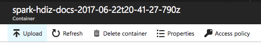
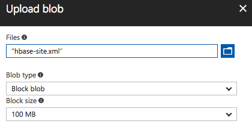

# Use Spark to read and write HBase data

Apache HBase is typically queried either with its low-level API (scans, gets, and puts) or with a SQL syntax using Phoenix. Apache also provides the Spark HBase Connector, which is a convenient and performant alternative to query and modify data stored by HBase.

## Prerequisites

* Two separate HDInsight clusters, one HBase, and one Spark with Spark 2.1 (HDInsight 3.6) installed.
* The Spark cluster needs to communicate directly with the HBase cluster with minimal latency, so the recommended configuration is deploying both clusters in the same virtual network. For more information, see [Create Linux-based clusters in HDInsight using the Azure portal](hdinsight-hadoop-create-linux-clusters-portal.md).
* SSH access to each cluster.
* Access to each cluster's default storage.

## Overall process

The high-level process for enabling your Spark cluster to query your HDInsight cluster is as follows:

1. Prepare some sample data in HBase.
2. Acquire the hbase-site.xml file from your HBase cluster configuration folder (/etc/hbase/conf).
3. Place a copy of hbase-site.xml in your Spark 2 configuration folder (/etc/spark2/conf).
4. Run `spark-shell` referencing the Spark HBase Connector by its Maven coordinates in the `packages` option.
5. Define a catalog that maps the schema from Spark to HBase.
6. Interact with the HBase data using either the RDD or DataFrame APIs.

## Prepare sample data in HBase

In this step, you create and populate a simple table in HBase that you can then query using Spark.

1. Connect to the head node of your HBase cluster using SSH. For more information, see [Connect to HDInsight using SSH](hdinsight-hadoop-linux-use-ssh-unix.md).
2. Run the HBase shell:

        hbase shell

3. Create a `Contacts` table with the column families `Personal` and `Office`:

        create 'Contacts', 'Personal', 'Office'

4. Load a few sample rows of data:

        put 'Contacts', '1000', 'Personal:Name', 'John Dole'
        put 'Contacts', '1000', 'Personal:Phone', '1-425-000-0001'
        put 'Contacts', '1000', 'Office:Phone', '1-425-000-0002'
        put 'Contacts', '1000', 'Office:Address', '1111 San Gabriel Dr.'
        put 'Contacts', '8396', 'Personal:Name', 'Calvin Raji'
        put 'Contacts', '8396', 'Personal:Phone', '230-555-0191'
        put 'Contacts', '8396', 'Office:Phone', '230-555-0191'
        put 'Contacts', '8396', 'Office:Address', '5415 San Gabriel Dr.'

## Acquire hbase-site.xml from your HBase cluster

1. Connect to the head node of your HBase cluster using SSH.
2. Copy the hbase-site.xml from local storage to the root of your HBase cluster's default storage:

        hdfs dfs -copyFromLocal /etc/hbase/conf/hbase-site.xml /

3. Navigate to your HBase cluster using the [Azure portal](https://portal.azure.com).
4. Select Storage accounts. 

    

5. Select the Storage account in the list that has a checkmark under the Default column.

    

6. On the Storage account pane, select the Blobs tile.

    

7. In the list of containers, select the container that is used by your HBase cluster.
8. In the file list, select `hbase-site.xml`.

    

9. On the Blob properties panel, select Download and save `hbase-site.xml` to a location on your local machine.

    

## Put hbase-site.xml on your Spark cluster

1. Navigate to your Spark cluster using the [Azure portal](https://portal.azure.com).
2. Select Storage accounts.

    

3. Select the Storage account in the list that has a checkmark under the Default column.

    

4. On the Storage account pane, select the Blobs tile.

    

5. In the list of containers, select the container that is used by your Spark cluster.
6. Select upload.

    

7. Select the `hbase-site.xml` file you previously downloaded to your local machine.

    

8. Select Upload.
9. Connect to the head node of your Spark cluster using SSH.
10. Copy `hbase-site.xml` from your Spark cluster's default storage to the Spark 2 configuration folder on the cluster's local storage:

        sudo hdfs dfs -copyToLocal /hbase-site.xml /etc/spark2/conf

## Run Spark Shell referencing the Spark HBase Connector

1. Connect to the head node of your Spark cluster using SSH.
2. Start the spark shell, specifying the Spark HBase Connector package:

        spark-shell --packages com.hortonworks:shc-core:1.1.0-2.1-s_2.11 --repositories http://repo.hortonworks.com/content/groups/public/

3. Keep this Spark Shell instance open and continue to the next step.

## Define a Catalog and Query

In this step, you define a catalog object that maps the schema from Spark to HBase. 

1. In your open Spark Shell, run the following `import` statements:

        import org.apache.spark.sql.{SQLContext, _}
        import org.apache.spark.sql.execution.datasources.hbase._
        import org.apache.spark.{SparkConf, SparkContext}
        import spark.sqlContext.implicits._

2. Define a catalog for the Contacts table you created in HBase:
    1. Define a catalog schema for the HBase table named `Contacts`.
    2. Identify the rowkey as `key`, and map the column names used in Spark to the column family, column name, and column type as used in HBase.
    3. The rowkey also has to be defined in detail as a named column (`rowkey`), which has a specific column family `cf` of `rowkey`.

            def catalog = s"""{
                |"table":{"namespace":"default", "name":"Contacts"},
                |"rowkey":"key",
                |"columns":{
                |"rowkey":{"cf":"rowkey", "col":"key", "type":"string"},
                |"officeAddress":{"cf":"Office", "col":"Address", "type":"string"},
                |"officePhone":{"cf":"Office", "col":"Phone", "type":"string"},
                |"personalName":{"cf":"Personal", "col":"Name", "type":"string"},
                |"personalPhone":{"cf":"Personal", "col":"Phone", "type":"string"}
                |}
            |}""".stripMargin

3. Define a method that provides a DataFrame around your `Contacts` table in HBase:

            def withCatalog(cat: String): DataFrame = {
                spark.sqlContext
                .read
                .options(Map(HBaseTableCatalog.tableCatalog->cat))
                .format("org.apache.spark.sql.execution.datasources.hbase")
                .load()
            }

4. Create an instance of the DataFrame:

        val df = withCatalog(catalog)

5. Query the DataFrame:

        df.show()

6. You should see two rows of data:

        +------+--------------------+--------------+-------------+--------------+
        |rowkey|       officeAddress|   officePhone| personalName| personalPhone|
        +------+--------------------+--------------+-------------+--------------+
        |  1000|1111 San Gabriel Dr.|1-425-000-0002|    John Dole|1-425-000-0001|
        |  8396|5415 San Gabriel Dr.|  230-555-0191|  Calvin Raji|  230-555-0191|
        +------+--------------------+--------------+-------------+--------------+

7. Register a temporary table so you can query the HBase table using Spark SQL:

        df.registerTempTable("contacts")

8. Issue a SQL query against the `contacts` table:

        val query = spark.sqlContext.sql("select personalName, officeAddress from contacts")
        query.show()

9. You should see results like these:

        +-------------+--------------------+
        | personalName|       officeAddress|
        +-------------+--------------------+
        |    John Dole|1111 San Gabriel Dr.|
        |  Calvin Raji|5415 San Gabriel Dr.|
        +-------------+--------------------+

## Insert new data

1. To insert a new Contact record, define a `ContactRecord` class:

        case class ContactRecord(
            rowkey: String,
            officeAddress: String,
            officePhone: String,
            personalName: String,
            personalPhone: String
            )

2. Create an instance of `ContactRecord` and put it in an array:

        val newContact = ContactRecord("16891", "40 Ellis St.", "674-555-0110", "John Jackson","230-555-0194")

        var newData = new Array[ContactRecord](1)
        newData(0) = newContact

3. Save the array of new data to HBase:

        sc.parallelize(newData).toDF.write
        .options(Map(HBaseTableCatalog.tableCatalog -> catalog))
        .format("org.apache.spark.sql.execution.datasources.hbase").save()

4. Examine the results:
    
        df.show()

5. You should see output like this:

        +------+--------------------+--------------+------------+--------------+
        |rowkey|       officeAddress|   officePhone|personalName| personalPhone|
        +------+--------------------+--------------+------------+--------------+
        |  1000|1111 San Gabriel Dr.|1-425-000-0002|   John Dole|1-425-000-0001|
        | 16891|        40 Ellis St.|  674-555-0110|John Jackson|  230-555-0194|
        |  8396|5415 San Gabriel Dr.|  230-555-0191| Calvin Raji|  230-555-0191|
        +------+--------------------+--------------+------------+--------------+

## Next steps

* [Spark HBase Connector](https://github.com/hortonworks-spark/shc)
