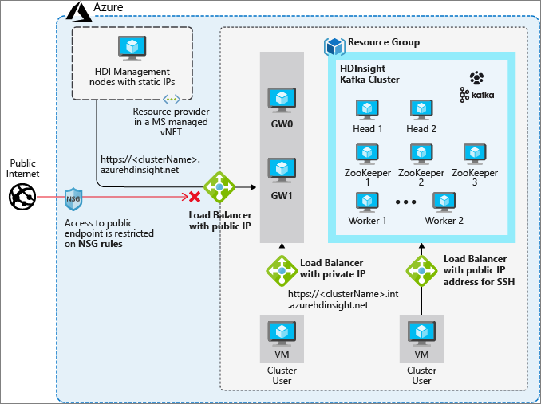

# Azure HDInsight virtual network architecture

This article explains the resources that are present when you deploy an HDInsight cluster into a custom Azure Virtual Network. This information will help you to connect on-premises resources to your HDInsight cluster in Azure. For more information on Azure Virtual Networks, see [What is Azure Virtual Network?](../virtual-network/virtual-networks-overview.md).

## Resource types in Azure HDInsight clusters

Azure HDInsight clusters have different types of virtual machines, or nodes. Each node type plays a role in the operation of the system. The following table summarizes these node types and their roles in the cluster.

| Type | Description |
| --- | --- |
| Head node |  For all cluster types except Apache Storm, the head nodes host the processes that manage execution of the distributed application. The head node is also the node that you can SSH into and execute applications that are then coordinated to run across the cluster resources. The number of head nodes is fixed at two for all cluster types. |
| ZooKeeper node | Zookeeper coordinates tasks between the nodes that are doing data processing. It also does leader election of the head node, and keeps track of which head node is running a specific master service. The number of ZooKeeper nodes is fixed at three. |
| Worker node | Represents the nodes that support data processing functionality. Worker nodes can be added or removed from the cluster to scale computing capability and manage costs. |
| R Server edge node | The R Server edge node represents the node you can SSH into and execute applications that are then coordinated to run across the cluster resources. An edge node doesn't  participate in data analysis within the cluster. This node also hosts R Studio Server, enabling you to run R application using a browser. |
| Region node | For the HBase cluster type, the region node (also referred to as a Data Node) runs the Region Server. Region Servers serve and manage a portion of the data managed by HBase. Region nodes can be added or removed from the cluster to scale computing capability and manage costs.|
| Nimbus node | For the Storm cluster type, the Nimbus node provides functionality similar to the Head node. The Nimbus node assigns tasks to other nodes in a cluster through Zookeeper, which coordinates the running of Storm topologies. |
| Supervisor node | For the Storm cluster type, the supervisor node executes the instructions provided by the Nimbus node to performing the desired processing. |

## Basic virtual network resources

The following diagram shows the placement of HDInsight nodes and network resources in Azure.

The default resources present when HDInsight is deployed into an Azure Virtual Network include the cluster node types mentioned in the previous table, as well as network devices that support communication between the virtual network and outside networks.

The following table summarizes the nine cluster nodes that are created when HDInsight is deployed into a custom Azure Virtual Network.

| Resource type | Number present | Details |
| --- | --- | --- |
|Head node | two |    |
|Zookeeper node | three | |
|Worker node | two | This number can vary based on cluster configuration and scaling. A minimum of three worker nodes is needed for Apache Kafka.  |
|Gateway node | two | Gateway nodes are Azure virtual machines that are created on Azure, but aren't visible in your subscription. Contact support if you need to reboot these nodes. |

The following network resources present are automatically created inside the virtual network used with HDInsight:

| Networking resource | Number present | Details |
| --- | --- | --- |
|Load balancer | three | |
|Network Interfaces | nine | This value is based on a normal cluster, where each node has its own network interface. The nine interfaces are for the two head nodes, three zookeeper nodes, two worker nodes, and two gateway nodes mentioned in the previous table. |
|Public IP Addresses | two |    |

## Endpoints for connecting to HDInsight

You can access your HDInsight cluster in three ways:

- An HTTPS endpoint outside of the virtual network at `CLUSTERNAME.azurehdinsight.net`.
- An SSH endpoint for directly connecting to the headnode at `CLUSTERNAME-ssh.azurehdinsight.net`.
- An HTTPS endpoint within the virtual network `CLUSTERNAME-int.azurehdinsight.net`. Notice the "-int" in this URL. This endpoint will resolve to a private IP in that virtual network and isn't accessible from the public internet.

These three endpoints are each assigned a load balancer.

Public IP addresses are also provided to the two endpoints that allow connection from outside the virtual network.

1. One public IP is assigned to the load balancer for the fully qualified domain name (FQDN) to use when connecting to the cluster from the internet `CLUSTERNAME.azurehdinsight.net`.
1. The second public IP address is used for the SSH only domain name `CLUSTERNAME-ssh.azurehdinsight.net`.

## Next steps

* [Secure incoming traffic to HDInsight clusters in a virtual network with private endpoint](https://azure.microsoft.com/blog/secure-incoming-traffic-to-hdinsight-clusters-in-a-vnet-with-private-endpoint/)
