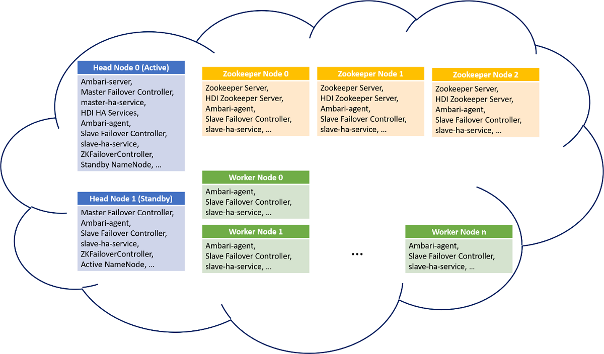

# High availability services in Azure HDInsight

```
Q1: What is the intent of the article? What should customers understand and/or do after they have read it? 

Q2: What is the logical relationship between the sections and how do they contribute to the intent in Q1? Some of the sections seem to describe the services that HDInsight uses to ensure availability and how they work (Apache Zookeeper, slave failover controller). Others seem to describe the process for ensuring availability (startup, failover process). The 'YARN Resource Manager high availability' section seems to focus on how its subservices contribute to the availability of this service and not how it supports the HDInsight service overall.

Q3: How does this article relate to any similar articles we already have?
```

High availability (HA) is the ability of a system to provide a desired level of continued operation to its users. In the ecosystem of Apache Hadoop and related technologies like Spark, Hive, and HBase, there are specific components which are designed to maintain system availability. This article discusses how different components are used in Azure HDInsight to ensure high availability of data and operations.

Different nodes in an HDInsight cluster contain different HA services as shown in the following diagram:



Different cluster types also contain different HA components. Some of the most important high availability services provided by HDInsight are summarized in the following table:

| Service | Type | Cluster nodes | Cluster types| Purpose |
|---|---|---|---|---|
| Apache Ambari server  | service | Active headnode | All | Monitors and manages the cluster. |
| Application Timeline Server for Apache YARN | Service | Active headnode | ? | Debugging info about YARN jobs running on the cluster. |
| Job history server | Service | Active headnode | ? | Maintains debugging data for MapReduce jobs. |
| Apache Livy | Service | Active headnode | Spark2 | Enables easy interaction with a Spark cluster over a REST interface |
| Master failover controller | Application | Both headnodes | All | Handles failover behaviors, such as stops Ambari server and master-ha-service on standby headnode and starts them on active headnode. |
| Master-ha-service | Application | Both headnodes | All | Handles HA services when fail-over happens. |

## High Availability services in detail

### Apache Zookeeper

HDInsight uses Apache Zookeeper to determine the status of HA services and to perform failovers. Another quorum (second quorum) of Zookeeper servers run on Zookeeper nodes in parallel with the first quorum. The second quorum is used to decide the active headnode. The HDInsight HA services run on headnodes only. The service should always be running on the active headnode, and stopped and put in maintenance mode on the standby headnode.

### Slave failover controller

The slave failover controller runs on every node in the cluster. The controller is responsible for starting the Ambari agent and slave-ha-service, an HA service handler, on each node. It periodically queries the second quorum about the active headnode.  The controller updates the host configuration file, restarts Ambari agent, and the slave-ha-service when  the active/standby headnodes changes. The slave-ha-service is responsible for stopping HDInsight HA services on the standby headnode.

### Master failover controller

The master failover controller runs on both head nodes. Both master failover controllers communicate with the second quorum to elect the headnode they're running on as the active headnode.

For example, if a master failover controller one on headnode 0 wins the election, then headnode 0 becomes active. The master failover controller starts Ambari server and master-ha-service on headnode 0. The other master failover controller stops Ambari server and master-ha-service on headnode 1.

The master-ha-service only runs on active headnode, it stops HDInsight HA services on standby headnode and starts HA services on active headnode.

### YARN Resource Manager high availability

HDInsight clusters based on Apache Hadoop 2.4 or higher support YARN Resource Manager high availability. There are two resource managers, rm1 and rm2, running on headnode-0 and headnode-1, respectively. Like NameNode, Resource Manager is also configured for automatic failover. Another Resource Manager is automatically elected to be the active one when the active Resource Manager goes down or unresponsive.

Resource Manager uses its embedded ActiveStandbyElector as a failure detector and leader elector. Unlike HDFS NodeManager, Resource Manager doesn't need a separate ZKFC daemon. The active Resource Manager writes its states into Apache Zookeeper.

Resource Manager high availability is independent from NameNode and HDInsight HA services, the active Resource Manager may not run on active headnode or headnode that the active NameNode is running. For more information about YARN Resource Manager high availability, see [Resource Manager High Availability](https://hadoop.apache.org/docs/current/hadoop-yarn/hadoop-yarn-site/ResourceManagerHA.html).

### HBase Master high availability

HDInsight HBase clusters support HBase Master high availability. Unlike other HA services, which run on headnodes, HBase Masters run on the three Zookeeper nodes, where one of them is the active master and the other two are standby. Like NameNode, HBase Master coordinates with Apache Zookeeper for leader election and does automatic failover when current active master has problems. There is only one active HBase Master at any time.

## High Availability processes

### Startup

During cluster deployment, the HDInsight agent starts HA service-related components in the following order:

- second Zookeeper quorum
- master failover controller
- slave failover controller.

### The failover process

A health monitor, which is a daemon, runs along with each master failover controller to  perform heartbeats with the headnodes. (Q: Should we explain what a daemon is? Why is it important for the customer to know that the health monitor is a daemon?). The headnode is regarded as an HA service in this scenario. The health monitor checks if the HA service is healthy and if it's ready to join in the leadership election. If yes, this HA service will compete in the election. If no, it will quit the election until it becomes ready again.

For active headnode failures, such as headnode crash, or rebooting, if the standby headnode achieves the leadership and becomes active, its master failover controller will start all HDInsight HA services on it. It will also stop these services on the other headnode.

For HDInsight HA service failures, such as service down, unhealthy, and so on, master failover controller should be able to automatically restart or stop the services according to the headnode status. Users shouldn't manually start HDInsight HA services on both head nodes. Instead, allow automatic or manual failover to recover the problem.

### Hadoop Distributed File System (HDFS) NameNode high availability

HDInsight clusters based on Hadoop 2.0 or higher provide NameNode high availability. There are two NameNodes running on two headnodes, respectively, which are configured for automatic failover. The NameNodes use ZKFailoverController to communicate with Apache Zookeeper to elect for active/standby status. ZKFailoverController runs on both headnodes, and works in the same way as the master failover controller above.

Apache Zookeeper is independent of the second quorum, so the active NameNode may not run on the active headnode. When the active NameNode is dead or unhealthy, the standby NameNode wins the election and becomes active.

### Inadvertent manual intervention

It's expected that HDInsight HA services should only be running on the active headnode, and automatically restarted when necessary. Since individual HA services don't have their own health monitor, failover can't be triggered at the level of the individual service. Failover and availability of HDInsight HA services is ensured at the node level and not at the service level.

## Some known issues

* When manually starting an HA service on the standby headnode, it won't stop until next failover happens. When HA services are running on both headnodes, some potential problems include: Ambari UI is inaccessible, Ambari throws errors, YARN, Spark, and Oozie jobs may stuck.

* When an HA service on the active headnode stops, it won't restart until next failover happens or the master-ha-service restarts. When one or more HA services stop on the active headnode, especially when Ambari server stops, Ambari UI is inaccessible, other potential problems include YARN, Spark, and Oozie jobs failures.

## Next steps

* [Availability and reliability of Apache Hadoop clusters in HDInsight](hdinsight-high-availability-linux.md)
* [Azure HDInsight virtual network architecture](hdinsight-virtual-network-architecture.md)
