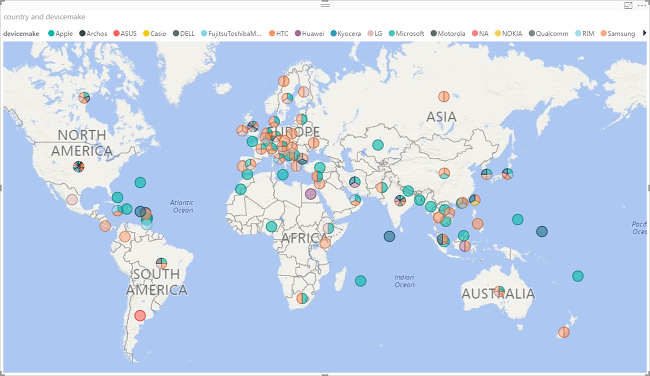
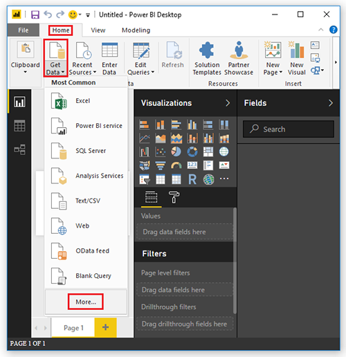
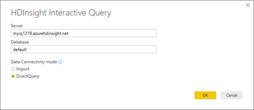
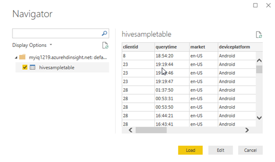

# Visualize Interactive Query Hive data with Microsoft Power BI using direct query in Azure HDInsight

Learn how to connect Microsoft Power BI to Azure HDInsight Interactive Query clusters and visualize the Hive data using direct query. In this tutorial, you load the data from a hivesampletable Hive table to Power BI. The Hive table contains some mobile phone usage data. Then you plot the usage data on a world map:

You can leverage the [Hive ODBC driver](../hadoop/apache-hadoop-connect-hive-power-bi.md) to do import via the generic ODBC connector in Power BI Desktop. However it is not recommended for BI workloads given non-interactive nature of the Hive query engine. [HDInsight Interactive Query connector](./apache-hadoop-connect-hive-power-bi-directquery.md) and 
[HDInsight Spark connector](https://docs.microsoft.com/power-bi/spark-on-hdinsight-with-direct-connect) are better choices for their performance.

## Prerequisites
Before going through this article, you must have the following items:

* **HDInsight cluster**. The cluster can be either an HDInsight cluster with Hive or a newly released Interactive Query cluster. For creating clusters, see [Create cluster](../hadoop/apache-hadoop-linux-tutorial-get-started.md#create-cluster).
* **[Microsoft Power BI Desktop](https://powerbi.microsoft.com/desktop/)**. You can download a copy from the [Microsoft Download Center](https://www.microsoft.com/download/details.aspx?id=45331).

## Load data from HDInsight

The hivesampletable Hive table comes with all HDInsight clusters.

1. Sign in to Power BI Desktop.
2. Click the **Home** tab, click **Get Data** from the **External data** ribbon, and then select **More**.

    
3. From the **Get Data** pane, type **hdinsight** in the search box. If you don't see **HDInsight Interactive Query (Beta)**, you need to update your Power BI Desktop to the latest version.
4. Click **HDInsight Interactive Query (Beta)**, and then click **Connect**.
5. Click **Continue** to close the **Preview connector** warning dialog.
6. From **HDInsight Interactive Query**, select or enter the following information:

    - **Server**: Enter the Interactive Query cluster name, for example *myiqcluster.azurehdinsight.net*.
    - **Database**: For this tutorial, enter **default**.
    - **Data Connectivity mode**: For this tutorial, select **DirectQuery**.

    
7. Click **OK**.
8. Enter the HTTP user credential, and then click **OK**.  The default username is **admin**
9. From the left pane, select **hivesampletale**, and then click **Load**.

    

## Visualize data

Continue from the last procedure.

1. From the Visualizations pane, select **Map**.  It is a globe icon.

    
2. From the Fields pane, select **country** and **devicemake**. You can see the data plotted on the map.
3. Expand the map.

## Next steps
In this article, you learned how to visualize data from HDInsight using Power BI.  To learn more, see the following articles:

* [Visualize Hive data with Microsoft Power BI using ODBC in Azure HDInsight](../hadoop/apache-hadoop-connect-hive-power-bi.md). 
* [Use Zeppelin to run Hive queries in Azure HDInsight](./../hdinsight-connect-hive-zeppelin.md).
* [Connect Excel to HDInsight with the Microsoft Hive ODBC Driver](../hadoop/apache-hadoop-connect-excel-hive-odbc-driver.md).
* [Connect Excel to Hadoop by using Power Query](../hadoop/apache-hadoop-connect-excel-power-query.md).
* [Connect to Azure HDInsight and run Hive queries using Data Lake Tools for Visual Studio](../hadoop/apache-hadoop-visual-studio-tools-get-started.md).
* [Use Azure HDInsight Tool for Visual Studio Code](../hdinsight-for-vscode.md).
* [Upload Data to HDInsight](./../hdinsight-upload-data.md).
