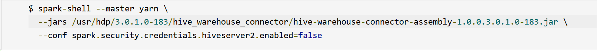
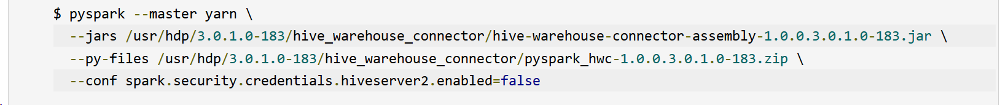
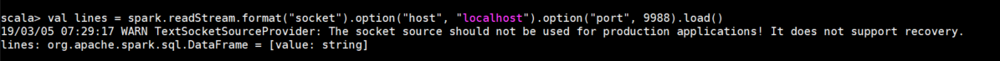

# Integrate Apache Spark and Apache Hive with the Hive Warehouse Connector

The Apache Hive Warehouse Connector (HWC) brings Hive features such as ACID support, fine grained security features with Apache Ranger and Low Latency Analytical Processing into Spark. The Hive Warehouse Connector allows you to read and write Apache Spark DataFrames into Hive tables, stream Spark DataFrames to Hive, and apply Apache Ranger policies on Spark DataFrames through Hive.

Starting with Hortonworks Data Platform (HDP) 3.0, Apache Spark and Apache Hive have separate catalogs. Spark uses its catalog to access tables for SparkSQL and similarly Hive uses its own catalog. This catalog separation can be a bottleneck for companies having to access Hive tables from Spark.


Hive offers features like ACID support, fine grained security features with Apache Ranger and Low Latency Analytical Processing by caching metadata files. Spark does not natively provide features like ACID tables, Row/Column level access control with Ranger Integration and LLAP (Low Latency Analytical Processing).

The Hive Warehouse Connector supports the following interaction modes:

* Spark shell
* PySpark
* spark-submit
* Zeppelin 
* Livy

The following list describes a few of the operations supported by the Hive Warehouse Connector:

* Describing a table
* Creating a table for ORC-formatted data
* Selecting Hive data and retrieving a DataFrame
* Writing a DataFrame to Hive in batch
* Executing a Hive update statement
* Reading table data from Hive, transforming it in Spark, and writing it to a new Hive table
* Writing a DataFrame or Spark stream to Hive using HiveStreaming

## How to setup Hive Warehouse Connector between Spark and Interactive Query clusters

Do the following to setup the Hive Warehouse Connector between a Spark and Interactive Query cluster in Azure HDInsight

1. Create a HDInsight Spark 4.0 cluster using the Azure portal with a storage account and a custom Azure virtual network. For information on creating a cluster in an Azure virtual network, see [Add HDInsight to an existing virtual network](../../hdinsight/hdinsight-extend-hadoop-virtual-network.md#existingvnet).
1. Create a HDInsight Interactive Query (LLAP) 4.0 cluster using the Azure portal with the same storage account and Azure virtual network as the spark cluster.
1. Configure the Spark cluster by adding the following properties under SPARK2 > CONFIGS > Custom spark2-defaults.

    1. Set `spark.hadoop.hive.llap.daemon.service.hosts` to the value corresponding to `LLAP app name` under Advanced `hive-interactive-env`. For example,

        ```scala
        spark.hadoop.hive.llap.daemon.service.hosts = @llap0
        ```

    1. Set `spark.sql.hive.hiveserver2.jdbc.url` with the JDBC url to connect to Hiveserver2 on the Interactive Query cluster.

        ```scala
        spark.sql.hive.hiveserver2.jdbc.url = jdbc:hive2://hwcllapdemo.azurehdinsight.net:443/;user=admin;password=H@doop1234;ssl=true;transportMode=http;httpPath=/hive2
        ```
        
        >[!Note] JDBC URL should contain credentials for connecting to Hiveserver2.

    1. Set `spark.datasource.hive.warehouse.load.staging.dir` is pointed into a suitable HDFS-compatible staging directory. In our case since these are two different clusters, this should be set to folder with the staging directory inside LLAP cluster’s container so that HiveServer2 has access to it. For example,

        ```scala
        spark.datasource.hive.warehouse.load.staging.dir = 'wasb://hwcllapdemo@hwcdemostorage.blob.core.windows.net/tmp'
        ```

    1. Set `spark.datasource.hive.warehouse.metastoreUri` with the value of metastore URI of Interactive query cluster. For example, 

        ```scala
        spark.datasource.hive.warehouse.metastoreUri  = ‘thrift://hn0-hwclla.0iv2nyrmse1uvp2caa4e34jkmf.cx.internal.cloudapp.net:9083,thrift://hn1-hwclla.0iv2nyrmse1uvp2caa4e34jkmf.cx.internal.cloudapp.net:9083’
        ```

    1. Set `spark.security.credentials.hiveserver2.enabled` to false for YARN client deploy mode
    1. Set `spark.hadoop.hive.zookeeper.quorum` to zookeeper quorum of LLAP Cluster. For example,

        ```scala
        spark.hadoop.hive.zookeeper.quorum  = ‘zk0-hwclla.0iv2nyrmse1uvp2caa4e34jkmf.cx.internal.cloudapp.net:2181,zk2-hwclla.0iv2nyrmse1uvp2caa4e34jkmf.cx.internal.cloudapp.net:2181,zk3-hwclla.0iv2nyrmse1uvp2caa4e34jkmf.cx.internal.cloudapp.net:2181’
        ```

### Use-cases and scenarios with examples

You can use spark-shell, pyspark, spark-submit, Zeppelin, or other methods to connect to your LLAP cluster.  

This article will provide examples using spark-shell.

Start a Spark-shell as shown below:



Pyspark shell can be started as shown:



Example:


A Hive Warehouse Connector instance can be started using the following commands:

```scala
import com.hortonworks.hwc.HiveWarehouseSession
val hive = HiveWarehouseSession.session(spark).build()
```

###	Creating and reading DataFrames

HWC works as a pluggable library to Spark with Scala, Java, and Python support. It exposes a JDBC-style API to Spark developers for executing queries to Hive. Results are returned as a DataFrame for any further processing/analytics inside Spark. Since data is loaded from LLAP daemons to Spark executors in parallel, this is much more efficient and scalable than using a standard JDBC connection from Spark to Hive.


Results of the query are Spark DataFrames, which can be used with Spark libraries like MLIB and SparkSQL.

###	Writing out Spark DataFrames

As described, Spark doesn’t natively support writing to Hive’s managed ACID tables. Using HWC, we can write out any DataFrame into a Hive table.

Sample dataframe write is shown in the pictures below.

Firstly, we create a table called `sampletable_colorado` and filter column where state is `Colorado` from `hivesampletable` and save it in `sampletable_colorado`
 


###	Structured streaming write

Using Hive Warehouse Connector, you can use Spark streaming to write data into Hive tables.

We will demonstrate a sample spark streaming example by ingesting data into hive table.

Data is ingested via localhost port 9999 and read into a Spark DataFrame.



To generate data for the Spark stream that you have just created, do the following:

1. Open another terminal on the same Spark cluster
1. At the command prompt, type `nc -lk 9999` 
1. Type the words that you would like the Spark stream to ingest, followed by carriage return. These words are inserted into a hive table.

Hive table is created, and data is inserted.


>[!Note]
> There is an issue about interpreting `spark.datasource.*` configurations into options internally in Apache Spark, which currently makes this library require to set metastoreUri and database options manually. For more information, see [SPARK-25460](https://issues.apache.org/jira/browse/SPARK-25460) for more details. As soon as this issue is resolved, both metastoreUri and the database can be omitted likewise.

### Use cases in HDInsight 4.0 with Enterprise Security Package

The Hive Warehouse Connector allows Apache Spark to use the advanced security features of Apache Hive.

#### Setup

Do the following to

Create a HDInsight 4.0 Spark and Interactive Query cluster with Enterprise Security Package (ESP) within the same subnet.
Update the DNS entries of Spark Cluster with DNS entries on Interactive Query cluster so that Spark Cluster can resolve IP addresses of the nodes in Interactive Query cluster. 


#### Execute Queries

Connect to spark-shell as shown in example


 
> [!Note] 
> The config for spark-shell can be populated by finding the related config on Interactive Query cluster.

Hive Warehouse Connector also provides row filtering and column masking using Apache Ranger policies on an Interactive Query cluster.

We have a table `demo` with column masking policy that only shows the last 4 characters.

Before applying the policy, `demo` table shows full table.


After applying the ranger policy, we can see only last four characters on the column.


## Next steps

* [Use Interactive Query with HDInsight](https://docs.microsoft.com/en-us/azure/hdinsight/interactive-query/apache-interactive-query-get-started)
* [Examples of interacting with Hive Warehouse Connector using Zeppelin, Livy, spark-submit and pyspark](https://community.hortonworks.com/articles/223626/integrating-apache-hive-with-apache-spark-hive-war.html)