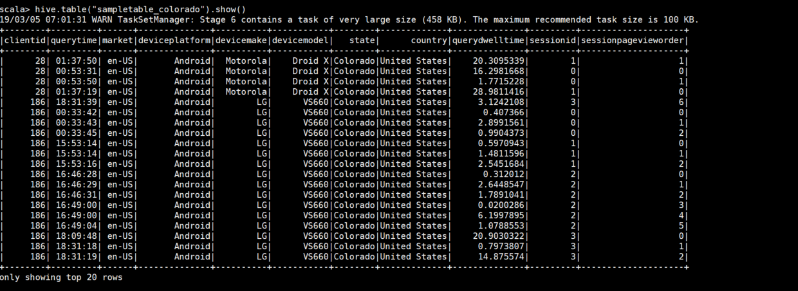
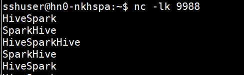

# Integrate Apache Spark and Apache Hive with the Hive Warehouse Connector

The Apache Hive Warehouse Connector (HWC) is a library that allows you to work more easily with Apache Spark and Apache Hive by supporting tasks such as moving data between Spark DataFrames and Hive tables, and also directing Spark streaming data into Hive tables. Hive Warehouse Connector works like a bridge between Spark and Hive. It supports Scala, Java, and Python for development.

The Hive Warehouse Connector allows you to take advantage of the unique features of Hive and Spark to build powerful big-data applications. Apache Hive offers support for database transactions that are Atomic, Consistent, Isolated, and Durable (ACID). For more information on ACID and transactions in Hive, see [Hive Transactions](https://cwiki.apache.org/confluence/display/Hive/Hive+Transactions). Hive also offers detailed security controls through Apache Ranger and Low Latency Analytical Processing not available in Apache Spark.

Apache Spark, has a Structured Streaming API that gives streaming capabilities not available in Apache Hive. Beginning with HDInsight 4.0, Apache Spark 2.3.1 and Apache Hive 3.1.0 have separate metastores, which can make interoperability difficult. The Hive Warehouse Connector makes it easier to use Spark and Hive together. The HWC library loads data from LLAP daemons to Spark executors in parallel, making it  more efficient and scalable than using a standard JDBC connection from Spark to Hive.


Some of the operations supported by the Hive Warehouse Connector are:

* Describing a table
* Creating a table for ORC-formatted data
* Selecting Hive data and retrieving a DataFrame
* Writing a DataFrame to Hive in batch
* Executing a Hive update statement
* Reading table data from Hive, transforming it in Spark, and writing it to a new Hive table
* Writing a DataFrame or Spark stream to Hive using HiveStreaming

## Hive Warehouse Connector setup

Follow these steps to setup the Hive Warehouse Connector between a Spark and Interactive Query cluster in Azure HDInsight:

1. Create a HDInsight Spark 4.0 cluster using the Azure portal with a storage account and a custom Azure virtual network. For information on creating a cluster in an Azure virtual network, see [Add HDInsight to an existing virtual network](../../hdinsight/hdinsight-extend-hadoop-virtual-network.md#existingvnet).
1. Create a HDInsight Interactive Query (LLAP) 4.0 cluster using the Azure portal with the same storage account and Azure virtual network as the Spark cluster.
1. Copy the contents of the `/etc/hosts` file on headnode0 of your Interactive Query cluster to the `/etc/hosts` file on the headnode0 of your Spark cluster. This step will allow your Spark cluster to resolve IP addresses of the nodes in Interactive Query cluster. View the contents of the updated file with `cat /etc/hosts`. The output should look something like what is shown in the screenshot below.

    

1. Configure the Spark cluster settings by doing the following steps: 
    1. Go to Azure portal, select HDInsight clusters, and then click on your cluster name.
    1. On the right side, under **Cluster dashboards**, select **Ambari home**.
    1. In the Ambari web UI, click **SPARK2** > **CONFIGS** > **Custom spark2-defaults**.

        

    1. Set `spark.hadoop.hive.llap.daemon.service.hosts` to the same value as the property **LLAP app name** under **Advanced hive-interactive-env**. For example, `@llap0`

    1. Set `spark.sql.hive.hiveserver2.jdbc.url` to the JDBC connection string, which connects to Hiveserver2 on the Interactive Query cluster. The connection string for your cluster will look like URI below. `CLUSTERNAME` is the name of your Spark cluster and the `user` and `password` parameters are set to the correct values for your cluster.

        ```
        jdbc:hive2://LLAPCLUSTERNAME.azurehdinsight.net:443/;user=admin;password=PWD;ssl=true;transportMode=http;httpPath=/hive2
        ```

        >[!Note] 
        > The JDBC URL should contain credentials for connecting to Hiveserver2 including a username and password.

    1. Set `spark.datasource.hive.warehouse.load.staging.dir` to a suitable HDFS-compatible staging directory. If you have two different clusters, the staging directory should be a folder in the staging directory of the LLAP cluster’s storage account so that HiveServer2 has access to it. For example, `wasb://STORAGE_CONTAINER_NAME@STORAGE_ACCOUNT_NAME.blob.core.windows.net/tmp` where `STORAGE_ACCOUNT_NAME` is the name of the storage account being used by the cluster, and `STORAGE_CONTAINER_NAME` is the name of the storage container.

    1. Set `spark.datasource.hive.warehouse.metastoreUri` with the value of the metastore URI of the Interactive Query cluster. To find the metastoreUri for your LLAP cluster, look for the **hive.metastore.uris** property in the Ambari UI for your LLAP cluster under **Hive** > **ADVANCED** > **General**. The value will look something like the following URI:

        ```
        thrift://hn0-hwclla.0iv2nyrmse1uvp2caa4e34jkmf.cx.internal.cloudapp.net:9083,
        thrift://hn1-hwclla.0iv2nyrmse1uvp2caa4e34jkmf.cx.internal.cloudapp.net:9083
        ```

    1. Set `spark.security.credentials.hiveserver2.enabled` to `false` for YARN client deploy mode.
    1. Set `spark.hadoop.hive.zookeeper.quorum` to the Zookeeper quorum of your LLAP Cluster. To find the Zookeeper quorum for your LLAP cluster, look for the **hive.zookeeper.quorum** property in the Ambari UI for your LLAP cluster under **Hive** > **ADVANCED** > **Advanced hive-site**. The value will look something like the following string:

        ```
        zk1-nkhvne.0iv2nyrmse1uvp2caa4e34jkmf.cx.internal.cloudapp.net:2181,
        zk4-nkhvne.0iv2nyrmse1uvp2caa4e34jkmf.cx.internal.cloudapp.net:2181,
        zk6-nkhvne.0iv2nyrmse1uvp2caa4e34jkmf.cx.internal.cloudapp.net:2181
        ```

To test the configuration of your Hive Warehouse Connector, follow the steps in the section [Connecting and running queries](#connecting-and-running-queries).

## Using the Hive Warehouse Connector

### Connecting and running queries

You can choose between a few different methods to connect to your Interactive Query cluster and execute queries using the Hive Warehouse Connector. Supported methods include the following tools:

* [spark-shell](../spark/apache-spark-shell.md)
* PySpark
* spark-submit
* [Zeppelin](../spark/apache-spark-zeppelin-notebook.md)
* [Livy](../spark/apache-spark-livy-rest-interface.md)

All examples provided in this article will be executed through spark-shell.

To start a spark-shell session, do the following steps:

1. SSH into the headnode for your cluster. For more information about connecting to your cluster with SSH, see [Connect to HDInsight (Apache Hadoop) using SSH](../../hdinsight/hdinsight-hadoop-linux-use-ssh-unix.md).
1. Change into the correct directory by typing `cd /usr/hdp/current/hive_warehouse_connector` or provide the full path to all jar files used as parameters in the spark-shell command.
1. Enter the following command to start the spark shell:

    ```bash
    spark-shell --master yarn \
    --jars /usr/hdp/3.0.1.0-183/hive_warehouse_connector/hive-warehouse-connector-assembly-1.0.0.3.0.1.0-183.jar \
    --conf spark.security.credentials.hiveserver2.enabled=false
    ```

1. You will see a welcome message and a `scala>` prompt where you can enter commands.

1. After starting the spark-shell, a Hive Warehouse Connector instance can be started using the following commands:

    ```scala
    import com.hortonworks.hwc.HiveWarehouseSession
    val hive = HiveWarehouseSession.session(spark).build()
    ```

### Connecting and running queries on Enterprise Security Package (ESP) clusters

The Enterprise Security Package (ESP) provides enterprise-grade capabilities like Active Directory-based authentication, multi-user support, and role-based access control for Apache Hadoop clusters in Azure HDInsight. For more information on ESP, see [An introduction to Apache Hadoop security with Enterprise Security Package](../domain-joined/apache-domain-joined-introduction.md).

1. Follow the initial steps 1 and 2 under [Connecting and running queries](#connecting-and-running-queries).
1. Type `kinit` and login with a domain user.
1. Start spark-shell with the full list of configuration parameters as shown below. All of the values in all capital letters between angle brackets must be specified based on your cluster. If you need to find out the values to input for any of the parameters below, see the section on [Hive Warehouse Connector setup](#hive-warehouse-connector-setup).:

    ```bash
    spark-shell --master yarn \
    --jars /usr/hdp/3.0.1.0-183/hive_warehouse_connector/hive-warehouse-connector-assembly-1.0.0.3.0.1.0-183.jar \
    --conf spark.security.credentials.hiveserver2.enabled=false
    --conf spark.hadoop.hive.llap.daemon.service.hosts='<LLAP_APP_NAME>'
    --conf spark.sql.hive.hiveserver2.jdbc.url='jdbc:hive2://<ZOOKEEPER_QUORUM>;serviceDiscoveryMode=zookeeper;zookeeperNamespace=hiveserver2-interactive'
    --conf spark.datasource.hive.warehouse.load.staging.dir='<STAGING_DIR>'
    --conf spark.datasource.hive.warehouse.metastoreUri='<METASTORE_URI>'
    --conf spark.hadoop.hive.zookeeper.quorum='<ZOOKEEPER_QUORUM>'
   ```

###	Creating Spark DataFrames from Hive queries

The results of all queries using the HWC library are returned as a DataFrame. The following examples demonstrate how to create a basic query.

```scala
hive.setDatabase("default")
val df = hive.executeQuery("select * from hivesampletable")
df.filter("state = 'Colorado'").show()
```

The results of the query are Spark DataFrames, which can be used with Spark libraries like MLIB and SparkSQL.

###	Writing out Spark DataFrames to Hive tables

Spark doesn’t natively support writing to Hive’s managed ACID tables. Using HWC, however, you can write out any DataFrame to a Hive table. You can see this functionality at work in the following example:

1. Create a table called `sampletable_colorado` and specify its columns using the following command:

    ```scala
    hive.createTable("sampletable_colorado").column("clientid","string").column("querytime","string").column("market","string").column("deviceplatform","string").column("devicemake","string").column("devicemodel","string").column("state","string").column("country","string").column("querydwelltime","double").column("sessionid","bigint").column("sessionpagevieworder","bigint").create()
    ```

2. Filter the table `hivesampletable` where the column `state` equals `Colorado`. This query of the Hive table is returned as a Spark DataFrame. Then the DataFrame is saved in the Hive table `sampletable_colorado` using the `write` function.
    
    ```scala
    hive.table("hivesampletable").filter("state = 'Colorado'").write.format(HiveWarehouseSession.HIVE_WAREHOUSE_CONNECTOR).option("table","sampletable_colorado").save()
    ```

You can see the resulting table in the screenshot below.



###	Structured streaming writes

Using Hive Warehouse Connector, you can use Spark streaming to write data into Hive tables.

Follow the steps below to create a Hive Warehouse Connector example that ingests data from a Spark stream on localhost port 9999 into a Hive table.

1. Open a terminal on your Spark cluster.
1. Begin the spark stream with the following command:

    ```scala
    val lines = spark.readStream.format("socket").option("host", "localhost").option("port",9988).load()
    ```

1. Generate data for the Spark stream that you created, by doing the following steps:
    1. Open another terminal on the same Spark cluster.
    1. At the command prompt, type `nc -lk 9999`. This command uses the netcat utility to send data from the command line to the specified port.
    1. Type the words that you would like the Spark stream to ingest, followed by carriage return.
        
1. Create a new Hive table to hold the streaming data. At the spark-shell, type the following commands:

    ```scala
    hive.createTable("stream_table").column("value","string").create()
    ```

1. Write the streaming data to the newly created table using the following command:

    ```scala
    lines.filter("value = 'HiveSpark'").writeStream.format(HiveWarehouseSession.STREAM_TO_STREAM).option("database", "default").option("table","stream_table").option("metastoreUri",spark.conf.get("spark.datasource.hive.warehouse.metastoreUri")).option("checkpointLocation","/tmp/checkpoint1").start()
    ```

    >[!Important]
    > The `metastoreUri` and `database` options must currently be set manually due to a known issue in Apache Spark. For more information about this issue, see [SPARK-25460](https://issues.apache.org/jira/browse/SPARK-25460).

1. You can view the data inserted into the table with the following command:

    ```scala
    hive.table("stream_table").show()
    ```

### Securing data on Spark ESP clusters

1. Create a table `demo` with some sample data by entering the following commands:

    ```scala
    create table demo (name string);
    INSERT INTO demo VALUES ('HDinsight');
    INSERT INTO demo VALUES ('Microsoft');
    INSERT INTO demo VALUES ('InteractiveQuery');
    ```

1. View the table's contents with the following command. Before applying the policy, the `demo` table shows the full column.

    ```scala
    hive.executeQuery("SELECT * FROM demo").show()
    ```

    

1. Apply a column masking policy that only shows the last four characters of the column.  
    1. Go to the Ranger Admin UI at `https://CLUSTERNAME.azurehdinsight.net/ranger/`.
    1. Click on the Hive service for your cluster under **Hive**.
        
    1. Click on the **Masking** tab and then **Add New Policy**
        
    1. Provide a desired policy name. Select database: **Default**, Hive table: **demo**, Hive column: **name**, User: **rsadmin2**, Access Types: **select**, and **Partial mask: show last 4** from the **Select Masking Option** menu. Click **Add**.
                
1. View the table's contents again. After applying the ranger policy, we can see only the last four characters of the column.

    

## Next steps

* [Use Interactive Query with HDInsight](https://docs.microsoft.com/azure/hdinsight/interactive-query/apache-interactive-query-get-started)
* [Examples of interacting with Hive Warehouse Connector using Zeppelin, Livy, spark-submit, and pyspark](https://community.hortonworks.com/articles/223626/integrating-apache-hive-with-apache-spark-hive-war.html)
