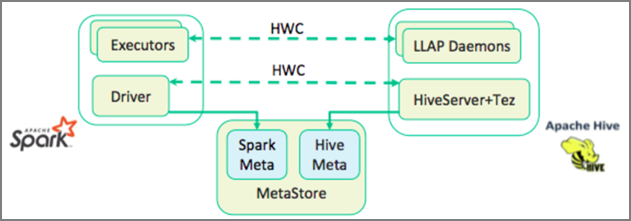
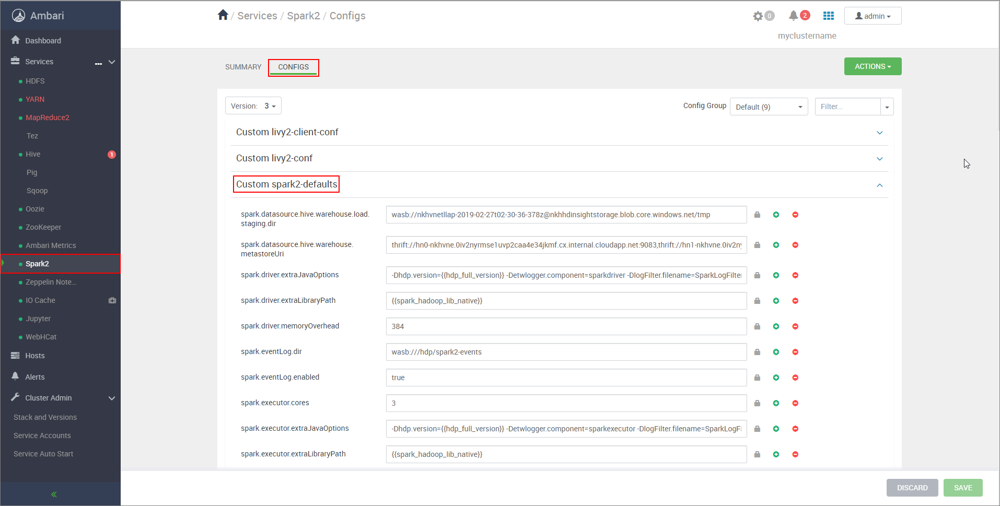
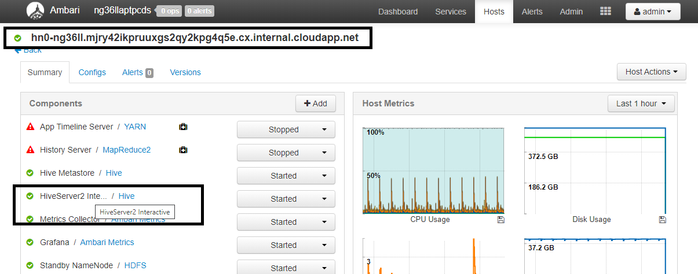
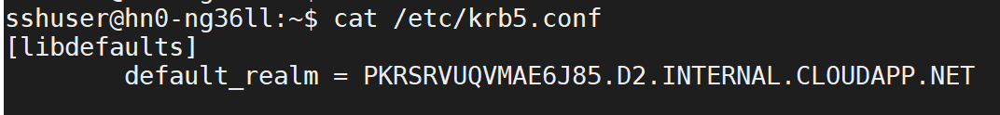
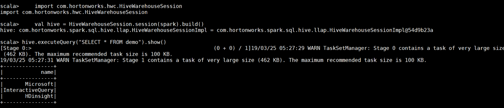
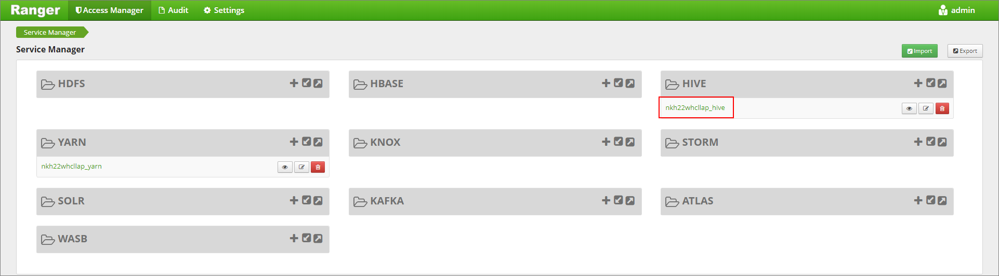
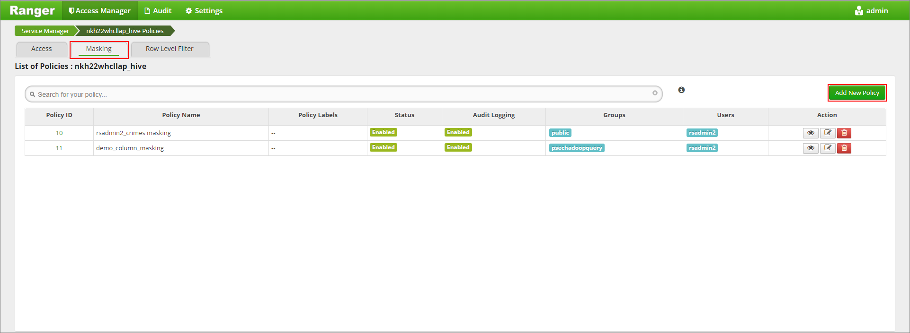
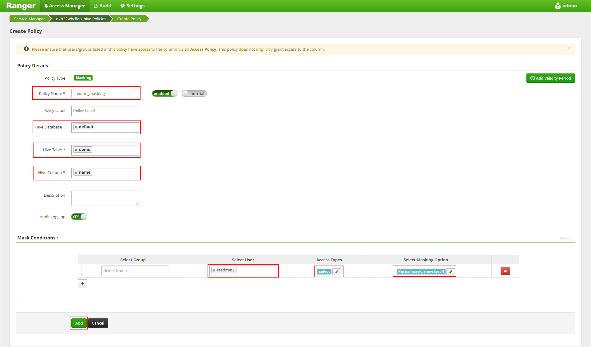
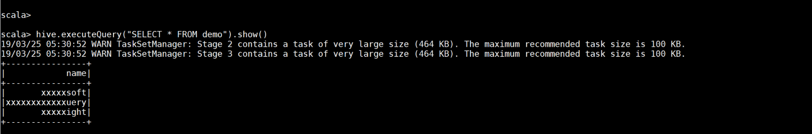

# Integrate Apache Spark and Apache Hive with Hive Warehouse Connector in Azure HDInsight

The Apache Hive Warehouse Connector (HWC) is a library that allows you to work more easily with Apache Spark and Apache Hive. It supports tasks such as moving data between Spark DataFrames and Hive tables. Also, by directing Spark streaming data into Hive tables. Hive Warehouse Connector works like a bridge between Spark and Hive. It also supports Scala, Java, and Python as programming languages for development.

The Hive Warehouse Connector allows you to take advantage of the unique features of Hive and Spark to build powerful big-data applications.

Apache Hive offers support for database transactions that are Atomic, Consistent, Isolated, and Durable (ACID). For more information on ACID and transactions in Hive, see [Hive Transactions](https://cwiki.apache.org/confluence/display/Hive/Hive+Transactions). Hive also offers detailed security controls through Apache Ranger and Low Latency Analytical Processing (LLAP) not available in Apache Spark.

Apache Spark, has a Structured Streaming API that gives streaming capabilities not available in Apache Hive. Beginning with HDInsight 4.0, Apache Spark 2.3.1 and Apache Hive 3.1.0 have separate metastores. The separate metastores can make interoperability difficult. The Hive Warehouse Connector makes it easier to use Spark and Hive together. The HWC library loads data from LLAP daemons to Spark executors in parallel. This process makes it more efficient and adaptable than a standard JDBC connection from Spark to Hive.



Some of the operations supported by the Hive Warehouse Connector are:

* Describing a table
* Creating a table for ORC-formatted data
* Selecting Hive data and retrieving a DataFrame
* Writing a DataFrame to Hive in batch
* Executing a Hive update statement
* Reading table data from Hive, transforming it in Spark, and writing it to a new Hive table
* Writing a DataFrame or Spark stream to Hive using HiveStreaming

## Hive Warehouse Connector setup

Hive Warehouse Connector needs separate clusters for Spark and Interactive Query workloads. Follow these steps to set up these clusters in Azure HDInsight.

### Create clusters

1. Create an HDInsight Spark **4.0** cluster with a storage account and a custom Azure virtual network. For information on creating a cluster in an Azure virtual network, see [Add HDInsight to an existing virtual network](../../hdinsight/hdinsight-plan-virtual-network-deployment.md#existingvnet).

1. Create an HDInsight Interactive Query (LLAP) **4.0** cluster with the same storage account and Azure virtual network as the Spark cluster.

### Configure HWC settings

#### Gather preliminary information

1. From a web browser, navigate to `https://LLAPCLUSTERNAME.azurehdinsight.net/#/main/services/HIVE` where LLAPCLUSTERNAME is the name of your Interactive Query cluster.

1. Navigate to **Summary** > **HiveServer2 Interactive JDBC URL** and note the value. The value may be similar to: `jdbc:hive2://zk0-iqgiro.rekufuk2y2ce.bx.internal.cloudapp.net:2181,zk1-iqgiro.rekufuk2y2ce.bx.internal.cloudapp.net:2181,zk4-iqgiro.rekufuk2y2ce.bx.internal.cloudapp.net:2181/;serviceDiscoveryMode=zooKeeper;zooKeeperNamespace=hiveserver2-interactive`.

1. Navigate to **Configs** > **Advanced** > **Advanced hive-site** > **hive.zookeeper.quorum** and note the value. The value may be similar to: `zk0-iqgiro.rekufuk2y2cezcbowjkbwfnyvd.bx.internal.cloudapp.net:2181,zk1-iqgiro.rekufuk2y2cezcbowjkbwfnyvd.bx.internal.cloudapp.net:2181,zk4-iqgiro.rekufuk2y2cezcbowjkbwfnyvd.bx.internal.cloudapp.net:2181`.

1. Navigate to **Configs** > **Advanced** > **General** > **hive.metastore.uris** and note the 
value. The value may be similar to: `thrift://iqgiro.rekufuk2y2cezcbowjkbwfnyvd.bx.internal.cloudapp.net:9083,thrift://hn1-iqgiro.rekufuk2y2cezcbowjkbwfnyvd.bx.internal.cloudapp.net:9083`.

1. Navigate to **Configs** > **Advanced** > **Advanced hive-interactive-site** > **hive.llap.daemon.service.hosts** and note the value. The value may be similar to: `@llap0`.

#### Configure Spark cluster settings

1. From a web browser, navigate to `https://CLUSTERNAME.azurehdinsight.net/#/main/services/SPARK2/configs` where CLUSTERNAME is the name of your Apache Spark cluster.

1. Expand **Custom spark2-defaults**.

    

1. Select **Add Property...** to add the following configurations:

    | Configuration | Value |
    |----|----|
    |`spark.datasource.hive.warehouse.load.staging.dir`|`wasbs://STORAGE_CONTAINER_NAME@STORAGE_ACCOUNT_NAME.blob.core.windows.net/tmp`. <br> Set to a suitable HDFS-compatible staging directory. If you have two different clusters, the staging directory should be a folder in the staging directory of the LLAP cluster's storage account so that HiveServer2 has access to it.  Replace `STORAGE_ACCOUNT_NAME` with the name of the storage account being used by the cluster, and `STORAGE_CONTAINER_NAME` with the name of the storage container. |
    |`spark.sql.hive.hiveserver2.jdbc.url`| The value you obtained earlier from **HiveServer2 Interactive JDBC URL** |
    |`spark.datasource.hive.warehouse.metastoreUri`| The value you obtained earlier from **hive.metastore.uris**. |
    |`spark.security.credentials.hiveserver2.enabled`|`true` for YARN cluster mode and `false` for YARN client mode. |
    |`spark.hadoop.hive.zookeeper.quorum`| The value you obtained earlier from **hive.zookeeper.quorum**. |
    |`spark.hadoop.hive.llap.daemon.service.hosts`| The value you obtained earlier from **hive.llap.daemon.service.hosts**. |

1. Save changes and restart all affected components.

### Configure HWC for Enterprise Security Package (ESP) clusters

The Enterprise Security Package (ESP) provides enterprise-grade capabilities like Active Directory-based authentication, multi-user support, and role-based access control for Apache Hadoop clusters in Azure HDInsight. For more information on ESP, see [Use Enterprise Security Package in HDInsight](../domain-joined/apache-domain-joined-architecture.md).

Apart from the configurations mentioned in the previous section, add the following configuration to use HWC on the ESP clusters.

1. From Ambari web UI of Spark cluster, navigate to **Spark2** > **CONFIGS** > **Custom spark2-defaults**.

1. Update the following property.

    | Configuration | Value |
    |----|----|
    | `spark.sql.hive.hiveserver2.jdbc.url.principal`    | `hive/<llap-headnode>@<AAD-Domain>` |
    
    * From a web browser, navigate to `https://CLUSTERNAME.azurehdinsight.net/#/main/services/HIVE/summary` where CLUSTERNAME is the name of your Interactive Query cluster. Click on **HiveServer2 Interactive**. You will see the Fully Qualified Domain Name (FQDN) of the head node on which LLAP is running as shown in the screenshot. Replace `<llap-headnode>` with this value.

        

    * Use [ssh command](../hdinsight-hadoop-linux-use-ssh-unix.md) to connect to your Interactive Query cluster. Look for `default_realm` parameter in the `/etc/krb5.conf` file. Replace `<AAD-DOMAIN>` with this value as an uppercase string, otherwise the credential won't be found.

        

    * For instance, `hive/hn0-ng36ll.mjry42ikpruuxgs2qy2kpg4q5e.cx.internal.cloudapp.net@PKRSRVUQVMAE6J85.D2.INTERNAL.CLOUDAPP.NET`.
    
1. Save changes and restart components as needed.

## Hive Warehouse Connector usage

You can choose between a few different methods to connect to your Interactive Query cluster and execute queries using the Hive Warehouse Connector. Supported methods include the following tools:

* [Spark-shell / PySpark](../spark/apache-spark-shell.md)
* [Spark-submit](#spark-submit)
* [Zeppelin](./apache-hive-warehouse-connector-zeppelin.md)


Below are some examples to connect to HWC from Spark.

### Spark-shell

1. Use [ssh command](../hdinsight-hadoop-linux-use-ssh-unix.md) to connect to your Apache Spark cluster. Edit the command below by replacing CLUSTERNAME with the name of your cluster, and then enter the command:

    ```cmd
    ssh sshuser@CLUSTERNAME-ssh.azurehdinsight.net
    ```

1. From your ssh session, execute the following command to note the `hive-warehouse-connector-assembly` version:

    ```bash
    ls /usr/hdp/current/hive_warehouse_connector
    ```

1. Edit the code below with the `hive-warehouse-connector-assembly` version identified above. Then execute the command to start the spark shell:

    ```bash
    spark-shell --master yarn \
    --jars /usr/hdp/current/hive_warehouse_connector/hive-warehouse-connector-assembly-<VERSION>.jar \
    --conf spark.security.credentials.hiveserver2.enabled=false
    ```

1. After starting the spark shell, a Hive Warehouse Connector instance can be started using the following commands:

    ```scala
    import com.hortonworks.hwc.HiveWarehouseSession
    val hive = HiveWarehouseSession.session(spark).build()
    ```

### Spark-submit

Once you build the scala/java code along with the dependencies into an assembly jar, use the below command to launch a Spark application. Replace `<VERSION>`, and `<APP_JAR_PATH>` with the actual values.

* YARN Client mode
    
    ```scala
    spark-submit \
    --class myHwcApp \
    --master yarn \
    --deploy-mode client \
    --jars /usr/hdp/current/hive_warehouse_connector/hive-warehouse-connector-assembly-<VERSION>.jar \
    --conf spark.security.credentials.hiveserver2.enabled=false
    /<APP_JAR_PATH>/myHwcAppProject.jar
    ```

* YARN Cluster mode
    ```scala
    spark-submit \
    --class myHwcApp \
    --master yarn \
    --deploy-mode cluster \
    --jars /usr/hdp/current/hive_warehouse_connector/hive-warehouse-connector-assembly-<VERSION>.jar \
    --conf spark.security.credentials.hiveserver2.enabled=true
    /<APP_JAR_PATH>/myHwcAppProject.jar
    ```

For Python, add the following configuration as well. 

    ```python
    --py-files /usr/hdp/current/hive_warehouse_connector/pyspark_hwc-<VERSION>.zip
    ```
    
## Run queries on Enterprise Security Package (ESP) clusters

Use `kinit` before starting the spark-shell or spark-submit. Replace USERNAME with the name of a domain account with permissions to access the cluster, then execute the following command:

```bash
kinit USERNAME
```

### Securing data on Spark ESP clusters

1. Create a table `demo` with some sample data by entering the following commands:

    ```scala
    create table demo (name string);
    INSERT INTO demo VALUES ('HDinsight');
    INSERT INTO demo VALUES ('Microsoft');
    INSERT INTO demo VALUES ('InteractiveQuery');
    ```

1. View the table's contents with the following command. Before applying the policy, the `demo` table shows the full column.

    ```scala
    hive.executeQuery("SELECT * FROM demo").show()
    ```

    

1. Apply a column masking policy that only shows the last four characters of the column.  
    1. Go to the Ranger Admin UI at `https://LLAPCLUSTERNAME.azurehdinsight.net/ranger/`.
    1. Click on the Hive service for your cluster under **Hive**.
        
    1. Click on the **Masking** tab and then **Add New Policy**

        

    1. Provide a desired policy name. Select database: **Default**, Hive table: **demo**, Hive column: **name**, User: **rsadmin2**, Access Types: **select**, and **Partial mask: show last 4** from the **Select Masking Option** menu. Click **Add**.
                
1. View the table's contents again. After applying the ranger policy, we can see only the last four characters of the column.

    

## Next steps

* [HWC and Apache Spark operations](./apache-hive-warehouse-connector-operations.md)
* [Use Interactive Query with HDInsight](./apache-interactive-query-get-started.md)
* [HWC integration with Apache Zeppelin](./apache-hive-warehouse-connector-zeppelin.md)
* [Examples of interacting with Hive Warehouse Connector using Zeppelin, Livy, spark-submit, and pyspark](https://community.hortonworks.com/articles/223626/integrating-apache-hive-with-apache-spark-hive-war.html)