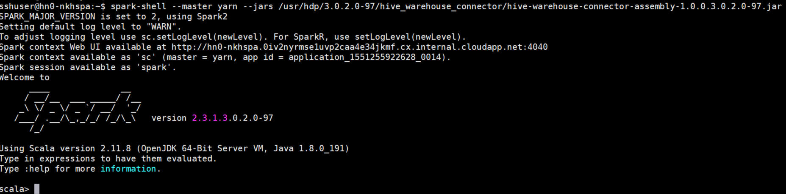
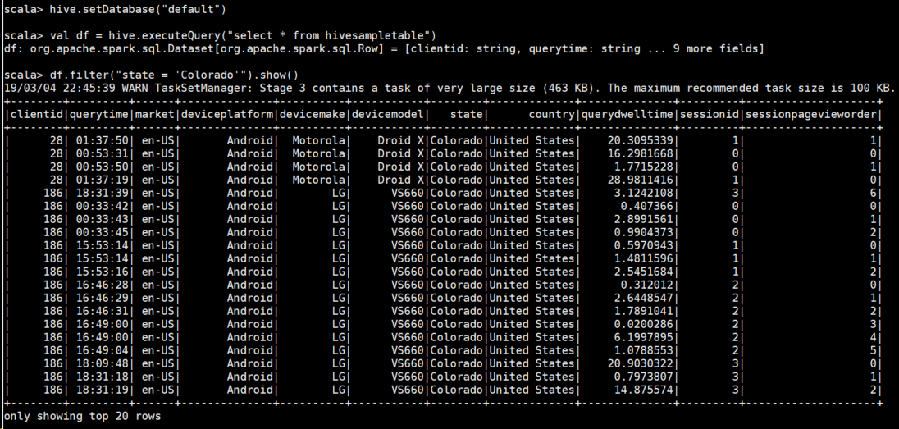
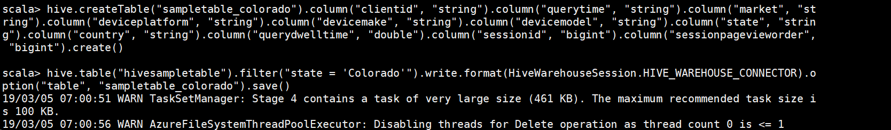
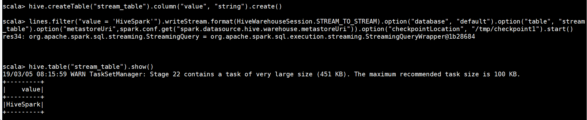
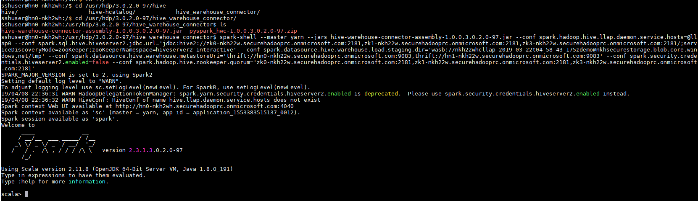

# Integrate Apache Spark and Apache Hive with the Hive Warehouse Connector

Apache Hive offers ACID support, detailed security controls through Apache Ranger and Low Latency Analytical Processing not available in Apache Spark. Apache Spark, on the other hand, has a Structured Streaming API that gives streaming capabilities not available in Apache Hive. Beginning with Hortonworks Data Platform (HDP) 3.0, Apache Spark and Apache Hive have separate data catalogs which can make interoperability difficult.

The Apache Hive Warehouse Connector (HWC) is a library that allows you to work more easily with Spark and Hive by supporting tasks such as moving data between Spark DataFrames and Hive tables, and also directing Spark streaming data into Hive tables.


Some of the operations supported by the Hive Warehouse Connector are the following:

* Describing a table
* Creating a table for ORC-formatted data
* Selecting Hive data and retrieving a DataFrame
* Writing a DataFrame to Hive in batch
* Executing a Hive update statement
* Reading table data from Hive, transforming it in Spark, and writing it to a new Hive table
* Writing a DataFrame or Spark stream to Hive using HiveStreaming

## How to setup Hive Warehouse Connector between Spark and Interactive Query clusters

Do the following to setup the Hive Warehouse Connector between a Spark and Interactive Query cluster in Azure HDInsight:

1. Create a HDInsight Spark 4.0 cluster using the Azure portal with a storage account and a custom Azure virtual network. For information on creating a cluster in an Azure virtual network, see [Add HDInsight to an existing virtual network](../../hdinsight/hdinsight-extend-hadoop-virtual-network.md#existingvnet).
1. Create a HDInsight Interactive Query (LLAP) 4.0 cluster using the Azure portal with the same storage account and Azure virtual network as the Spark cluster.
1. Configure the Spark cluster by setting the following config properties under **SPARK2** > **CONFIGS** > **Custom spark2-defaults**.

    1. Set `spark.hadoop.hive.llap.daemon.service.hosts` to the same value as the property **LLAP app name** under **Advanced hive-interactive-env**. For example, `@llap0`

    1. Set `spark.sql.hive.hiveserver2.jdbc.url` to the JDBC connection string which connects to Hiveserver2 on the Interactive Query cluster. The connection string for your cluster will look like `jdbc:hive2://CLUSTERNAME.azurehdinsight.net:443/;user=admin;password=PWD;ssl=true;transportMode=http;httpPath=/hive2`, where `CLUSTERNAME` is the name of your Spark cluster and the `user` and `password` parameters are set to the correct values for your cluster.

        >[!Note] 
        > The JDBC URL should contain credentials for connecting to Hiveserver2 including a username and password.

    1. Set `spark.datasource.hive.warehouse.load.staging.dir` to a suitable HDFS-compatible staging directory. If you have two different clusters, this should be a folder in the staging directory of the LLAP cluster’s storage account so that HiveServer2 has access to it. For example, `wasb://CLUSTERNAME@hwcdemostorage.blob.core.windows.net/tmp`

    1. Set `spark.datasource.hive.warehouse.metastoreUri` with the value of the metastore URI of the Interactive Query cluster.

        ```
        thrift://hn0-hwclla.0iv2nyrmse1uvp2caa4e34jkmf.cx.internal.cloudapp.net:9083,
        thrift://hn1-hwclla.0iv2nyrmse1uvp2caa4e34jkmf.cx.internal.cloudapp.net:9083
        ```

    1. Set `spark.security.credentials.hiveserver2.enabled` to `false` for YARN client deploy mode
    1. Set `spark.hadoop.hive.zookeeper.quorum` to the Zookeeper quorum of LLAP Cluster.

        ```
        zk0-hwclla.0iv2nyrmse1uvp2caa4e34jkmf.cx.internal.cloudapp.net:2181,zk2-hwclla.0iv2nyrmse1uvp2caa4e34jkmf.cx.internal.cloudapp.net:2181,zk3-hwclla.0iv2nyrmse1uvp2caa4e34jkmf.cx.internal.cloudapp.net:2181
        ```

## Use-cases and scenarios with examples

You can choose between a few different methods to connect to your Interactive Query cluster and execute queries using the Hive Warehouse Connector. Supported methods include the following:

* [spark-shell](../spark/apache-spark-shell.md)
* PySpark
* spark-submit
* [Zeppelin](spark/apache-spark-zeppelin-notebook.md)
* [Livy](../spark/apache-spark-livy-rest-interface.md)

All examples provided in this article will be executed through spark-shell.

To start a spark-shell session, do the following:

1. SSH into the headnode for your cluster. See [Connect to HDInsight (Apache Hadoop) using SSH](../../hdinsight/hdinsight-hadoop-linux-use-ssh-unix.md) for more information on connecting to your cluster with SSH.
1. Enter the following command to start the spark shell

    ```bash
    spark-shell --master yarn \
    --jars /usr/hdp/3.0.1.0-183/hive_warehouse_connector/hive-warehouse-connector-assembly-1.0.0.3.0.1.0-183.jar \
    --conf spark.security.credentials.hiveserver2.enabled=false
    ```

1. You will see a prompt like the one below indicating that the spark shell has been started correctly

    

You can start a pyspark shell session using the following command:

```bash
spark-shell --master yarn \
--jars /usr/hdp/3.0.1.0-183/hive_warehouse_connector/hive-warehouse-connector-assembly-1.0.0.3.0.1.0-183.jar \
--py-files /usr/hdp/3.0.1.0-183/hive_warehouse_connector/pyspark_hwc-1.0.0.3.0.1.0-183.zip |
--conf spark.security.credentials.hiveserver2.enabled=false
```

After starting the spark-shell, a Hive Warehouse Connector instance can be started using the following commands:

```scala
import com.hortonworks.hwc.HiveWarehouseSession
val hive = HiveWarehouseSession.session(spark).build()
```

###	Scenario 1: Creating Spark DataFrames from Hive queries

"HWC works as a pluggable library to Spark with Scala, Java, and Python support. It exposes a JDBC-style API to Spark developers for executing queries to Hive. Results are returned as a DataFrame for any further processing/analytics inside Spark. Since data is loaded from LLAP daemons to Spark executors in parallel, this is much more efficient and scalable than using a standard JDBC connection from Spark to Hive." (https://hortonworks.com/blog/hive-warehouse-connector-use-cases/)



The results of the query are Spark DataFrames, which can be used with Spark libraries like MLIB and SparkSQL.

###	Scenario 2: Writing out Spark DataFrames to Hive tables

As described, Spark doesn’t natively support writing to Hive’s managed ACID tables. Using HWC, we can write out any DataFrame into a Hive table.

Sample DataFrame write is shown in the pictures below.

Firstly, we create a table called `sampletable_colorado` and filter column where state is `Colorado` from `hivesampletable` and save it in `sampletable_colorado`.
 



###	Scenario 3: Structured streaming writes

Using Hive Warehouse Connector, you can use Spark streaming to write data into Hive tables.

The following steps demonstrate ingesting data from a Spark stream on localhost port 9999 into a Hive table.

1. Open a terminal on your Spark cluster
1. Begin the spark stream with the following command:
    ```scala
    val lines = spark.readStream.format("socket").option("host", "localhost").option("port",9988).load()
    ```
1. Generate data for the Spark stream that you have just created, by doing the following:
    1. Open another terminal on the same Spark cluster
    1. At the command prompt, type `nc -lk 9999`. This command uses the netcat utility to send data from the command line to the specified port.
    1. Type the words that you would like the Spark stream to ingest, followed by carriage return.
1. Create a new Hive table to hold the streaming data. At the spark-shell, type `hive.createTable("stream_table").column("value","string").create()`

A Hive table is created, and data is inserted.




>[!Note]
> There is an issue about interpreting `spark.datasource.*` configurations into options internally in Apache Spark, which currently makes this library require to set metastore Uri and database options manually. For more information, see [SPARK-25460](https://issues.apache.org/jira/browse/SPARK-25460) for more details. As soon as this issue is resolved, both metastore Uri and the database can be omitted likewise.

### Use cases in HDInsight 4.0 with Enterprise Security Package

The Hive Warehouse Connector allows Apache Spark to use the advanced security features of Apache Hive.

#### Setup

Do the following to

Create a HDInsight 4.0 Spark and Interactive Query cluster with Enterprise Security Package (ESP) within the same subnet.
Update the DNS entries of Spark Cluster with DNS entries on Interactive Query cluster so that Spark Cluster can resolve IP addresses of the nodes in Interactive Query cluster. 


#### Execute Queries

Connect to spark-shell as shown in example


 
> [!Note] 
> The config for spark-shell can be populated by finding the related config on Interactive Query cluster.

Hive Warehouse Connector also provides row filtering and column masking using Apache Ranger policies on an Interactive Query cluster.

We have a table `demo` with column masking policy that only shows the last 4 characters.

Before applying the policy, `demo` table shows full table.


After applying the ranger policy, we can see only last four characters on the column.


## Next steps

* [Use Interactive Query with HDInsight](https://docs.microsoft.com/en-us/azure/hdinsight/interactive-query/apache-interactive-query-get-started)
* [Examples of interacting with Hive Warehouse Connector using Zeppelin, Livy, spark-submit and pyspark](https://community.hortonworks.com/articles/223626/integrating-apache-hive-with-apache-spark-hive-war.html)