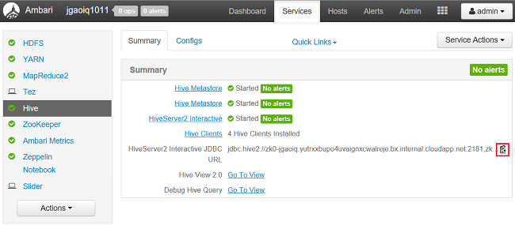

# What is Interactive Query In Azure HDInsight

Interactive Query (also called Apache Hive LLAP, or [Low Latency Analytical Processing](https://cwiki.apache.org/confluence/display/Hive/LLAP)) is an Azure HDInsight [cluster type](../hdinsight-hadoop-provision-linux-clusters.md#cluster-types). Interactive Query supports in-memory caching, which makes Apache Hive queries faster and much more interactive. Customers use Interactive Query to query data stored in Azure storage & Azure Data Lake Storage in super-fast manner. Interactive query makes it easy for developers and data scientist to work with the big data using BI tools they love the most. HDInsight Interactive Query supports several tools to access big data in easy fashion.

[!INCLUDE [hdinsight-price-change](../../../includes/hdinsight-enhancements.md)]

An Interactive Query cluster is different from an Apache Hadoop cluster. It contains only the Hive service.

You can access the Hive service in the Interactive Query cluster only via Apache Ambari Hive View, Beeline, and the Microsoft Hive Open Database Connectivity driver (Hive ODBC). You can’t access it via the Hive console, Templeton, the Azure Classic CLI, or Azure PowerShell.

## Create an Interactive Query cluster

For information about creating a HDInsight cluster, see [Create Apache Hadoop clusters in HDInsight](../hdinsight-hadoop-provision-linux-clusters.md). Choose the Interactive Query cluster type.

## Execute Apache Hive queries from Interactive Query

To execute Hive queries, you have the following options:

* Use Microsoft Power BI

    See [Visualize Interactive Query Apache Hive data with Power BI in Azure HDInsight](./apache-hadoop-connect-hive-power-bi-directquery.md)
    See [Visualize big data with Power BI in Azure HDInsight](../hadoop/apache-hadoop-connect-hive-power-bi.md).

* Use Visual Studio

    See [Connect to Azure HDInsight and run Apache Hive queries using Data Lake Tools for Visual Studio](../hadoop/apache-hadoop-visual-studio-tools-get-started.md#run-interactive-apache-hive-queries).

* Use Visual Studio Code

    See [Use Visual Studio Code for Apache Hive, LLAP, or pySpark](../hdinsight-for-vscode.md).
* Run Apache Hive by using Apache Ambari Hive View.
  
    See [Use Apache Hive View with Apache Hadoop in Azure HDInsight](../hadoop/apache-hadoop-use-hive-ambari-view.md).

* Run Apache Hive by using Beeline.
  
    See [Use Apache Hive with Apache Hadoop in HDInsight with Beeline](../hadoop/apache-hadoop-use-hive-beeline.md).
  
    You can use Beeline from either the head node or from an empty edge node. We recommend using Beeline from an empty edge node. For information about creating an HDInsight cluster by using an empty edge node, see [Use empty edge nodes in HDInsight](../hdinsight-apps-use-edge-node.md).
* Run Apache Hive by using Hive ODBC.
  
    See [Connect Excel to Apache Hadoop with the Microsoft Hive ODBC driver](../hadoop/apache-hadoop-connect-excel-hive-odbc-driver.md).

To find the Java Database Connectivity (JDBC) connection string:

1. Sign in to Apache Ambari by using the following URL: `https://<cluster name>.AzureHDInsight.net`.
2. In the left menu, select **Hive**.
3. To copy the URL, select the clipboard icon:

   

## Next steps

* Learn how to [create Interactive Query clusters in HDInsight](../hdinsight-hadoop-provision-linux-clusters.md).
* Learn how to [visualize big data with Power BI in Azure HDInsight](../hadoop/apache-hadoop-connect-hive-power-bi.md).
* Learn how to [use Apache Zeppelin to run Apache Hive queries in Azure HDInsight](../interactive-query/hdinsight-connect-hive-zeppelin.md).
