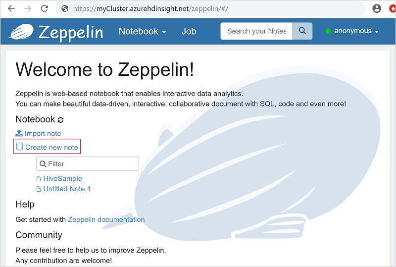

# Quickstart: Execute Apache Hive queries in Azure HDInsight with Apache Zeppelin

In this quickstart, you learn how to use Apache Zeppelin to run [Apache Hive](https://hive.apache.org/) queries in Azure HDInsight. HDInsight Interactive Query clusters include [Apache Zeppelin](https://zeppelin.apache.org/) notebooks that you can use to run interactive Hive queries.

If you don't have an Azure subscription, create a [free account](https://azure.microsoft.com/free/?WT.mc_id=A261C142F) before you begin.

## Prerequisites

An HDInsight Interactive Query cluster. See [Create cluster](../hadoop/apache-hadoop-linux-tutorial-get-started.md) to create an HDInsight cluster.  Make sure to choose the **Interactive Query** cluster type.

## Create an Apache Zeppelin Note

1. Replace `CLUSTERNAME` with the name of your cluster in the following URL `https://CLUSTERNAME.azurehdinsight.net/zeppelin`. Then enter the URL in a web browser.

2. Enter your cluster login username and password. From the Zeppelin page, you can either create a new note or open existing notes. **HiveSample** contains some sample Hive queries.  

    

3. Select **Create new note**.

4. From the **Create new note** dialog, type or select the following values:

    - Note Name: Enter a name for the note.
    - Default interpreter: Select **jdbc** from the drop-down list.

5. Select **Create Note**.

6. Enter the following Hive query in the code section, and then press **Shift + Enter**:

    ```hive
    %jdbc(hive)
    show tables
    ```

    

    The **%jdbc(hive)** statement in the first line tells the notebook to use the Hive JDBC interpreter.

    The query shall return one Hive table called **hivesampletable**.

    The following are two additional Hive queries that you can run against **hivesampletable**:

    ```hive
    %jdbc(hive)
    select * from hivesampletable limit 10

    %jdbc(hive)
    select ${group_name}, count(*) as total_count
    from hivesampletable
    group by ${group_name=market,market|deviceplatform|devicemake}
    limit ${total_count=10}
    ```

    Comparing to the traditional Hive, the query results come back must faster.

### Additional examples

1. Create a table. Execute the code below in the Zeppelin Notebook:

    ```hql
    %jdbc(hive)
    CREATE EXTERNAL TABLE log4jLogs (
        t1 string,
        t2 string,
        t3 string,
        t4 string,
        t5 string,
        t6 string,
        t7 string)
    ROW FORMAT DELIMITED
    FIELDS TERMINATED BY ' '
    STORED AS TEXTFILE;
    ```

1. Load data into the new table. Execute the code below in the Zeppelin Notebook:

    ```hql
    %jdbc(hive)
    LOAD DATA
    INPATH 'wasbs:///example/data/sample.log'
    INTO TABLE log4jLogs;
    ```

1. Insert a single record. Execute the code below in the Zeppelin Notebook:

    ```hql
    %jdbc(hive)
    INSERT INTO TABLE log4jLogs2
    VALUES ('A', 'B', 'C', 'D', 'E', 'F', 'G');
    ```

Review the [Hive language manual](https://cwiki.apache.org/confluence/display/Hive/LanguageManual) for additional syntax.

## Clean up resources

After you complete the quickstart, you may want to delete the cluster. With HDInsight, your data is stored in Azure Storage, so you can safely delete a cluster when it isn't in use. You're also charged for an HDInsight cluster, even when it isn't in use. Since the charges for the cluster are many times more than the charges for storage, it makes economic sense to delete clusters when they aren't in use.

To delete a cluster, see [Delete an HDInsight cluster using your browser, PowerShell, or the Azure CLI](../hdinsight-delete-cluster.md).

## Next steps

In this quickstart, you learned how to use Apache Zeppelin to run Apache Hive queries in Azure HDInsight. To learn more about Hive queries, the next article will show you how to execute queries with Visual Studio.

> [!div class="nextstepaction"]
> [Connect to Azure HDInsight and run Apache Hive queries using Data Lake Tools for Visual Studio](../hadoop/apache-hadoop-visual-studio-tools-get-started.md)
