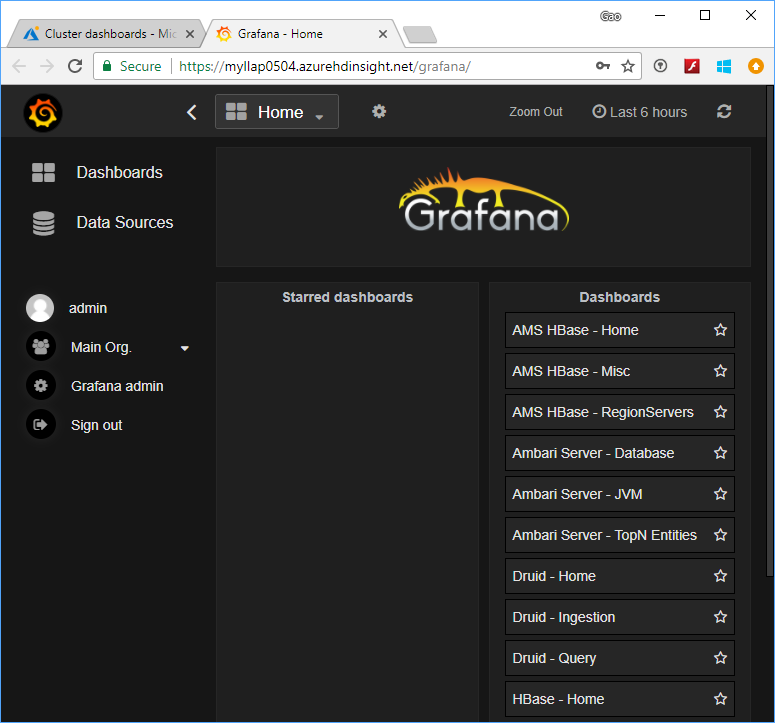

# Access Grafana in Azure HDInsight

[Grafana](https://grafana.com/) is a popular, open-source graph and dashboard builder. Grafana is feature rich; not only does it let users create customizable and shareable dashboards, it also offers templated/scripted dashboards, LDAP integration, multiple data sources, and more.

Currently, in Azure HDInsight, Grafana is supported with the Spark, HBase, Kafka and Interactive Query cluster types. It is not supported for clusters with Enterprise Security Pack enabled.

If you don’t have an Azure subscription, create a [free account](https://azure.microsoft.com/free/?WT.mc_id=A261C142F) before you begin.

## Create an Apache Hadoop cluster

See [Create Apache Hadoop clusters using the Azure portal](../hdinsight-hadoop-create-linux-clusters-portal.md). For **Cluster type**, select **Spark**, **Kafka**, **HBase**, or **Interactive Query**.

## Access the Grafana dashboard

1. From a web browser, navigate to `https://CLUSTERNAME.azurehdinsight.net/grafana/` where CLUSTERNAME is the name of your cluster.

1. Enter the Hadoop cluster user credentials.

1. The Grafana dashboard appears and looks like this example:

    

## Clean up resources

If you're not going to continue to use this application, delete the cluster that you created with the following steps:

1. Sign in to the [Azure portal](https://portal.azure.com/).

1. In the **Search** box at the top, type **HDInsight**.

1. Select **HDInsight clusters** under **Services**.

1. In the list of HDInsight clusters that appears, select the **...** next to the cluster that you created.

1. Select **Delete**. Select **Yes**.

## Next steps

To learn more about analyzing data with HDInsight, see the following articles:

* [Use Apache Hive with HDInsight](../hadoop/hdinsight-use-hive.md).

* [Use MapReduce with HDInsight](../hadoop/hdinsight-use-mapreduce.md).

* [Get started using Visual Studio Hadoop tools for HDInsight](../hadoop/apache-hadoop-visual-studio-tools-get-started.md).
