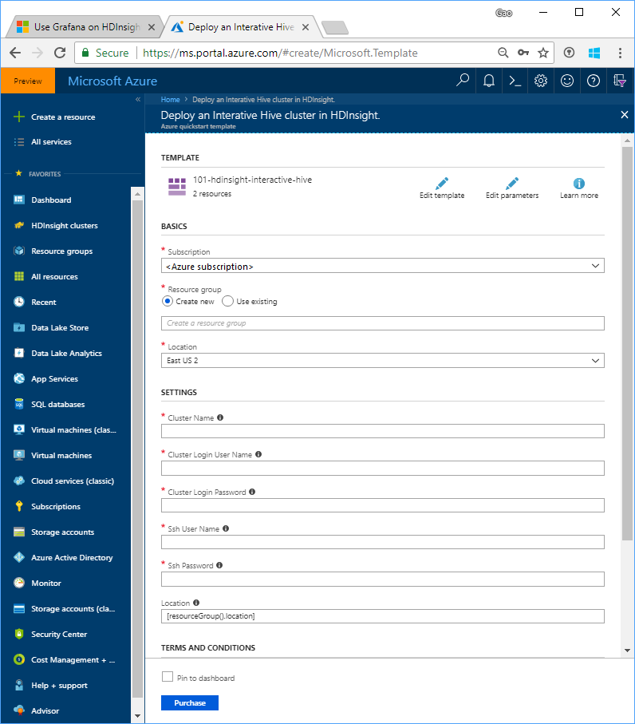
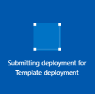
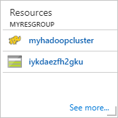
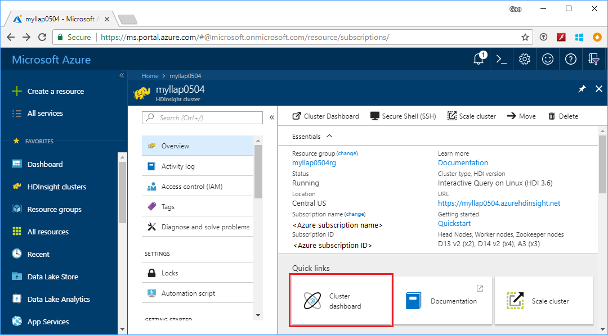
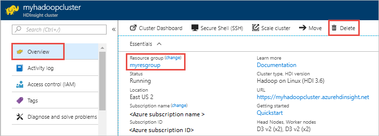

# Access Grafana in Azure HDInsight

[Grafana](https://grafana.com/) is a popular, open-source graph and dashboard builder. Grafana is feature rich; not only does it let users create customizable and shareable dashboards, it also offers templated/scripted dashboards, LDAP integration, multiple data sources, and more.

Currently, in Azure HDInsight, Grafana is supported with the Hbase and Interactive Query cluster types.

If you don't have an Azure subscription, [create a free account](https://azure.microsoft.com/free/) before you begin.

## Create an Apache Hadoop cluster

In this section, you create an Interactive Query cluster in HDInsight using an Azure Resource Manager template. Resource Manager template experience is not required for following this article. 

1. Click the **Deploy to Azure** button below to sign in to Azure and open the Resource Manager template in the Azure portal. 
   
    

2. Enter or select the values as suggested in the following screenshot:

    > [!NOTE]  
    > The values you provide must be unique and should follow the naming guidelines. The template does not perform validation checks. If the values you provide are already in use, or do not follow the guidelines, you get an error after you have submitted the template.       
    > 
    >
    
    

    Enter or select the following values:
    
    |Property  |Description  |
    |---------|---------|
    |**Subscription**     |  Select your Azure subscription. |
    |**Resource group**     | Create a resource group or select an existing resource group.  A resource group is a container of Azure components.  In this case, the resource group contains the HDInsight cluster and the dependent Azure Storage account. |
    |**Location**     | Select an Azure location where you want to create your cluster.  Choose a location closer to you for better performance. |
    |**Cluster Type**     | Select **hadoop**. |
    |**Cluster Name**     | Enter a name for the Apache Hadoop cluster. Because all clusters in HDInsight share the same DNS namespace this name needs to be unique. The name can consist of up to 59 characters includings letters, numbers, and hyphens. The first and last characters of the name cannot be hyphens. |
    |**Cluster login name and password**     | The default login name is **admin**. The password must be at least 10 characters in length and must contain at least one digit, one uppercase, and one lower case letter, one non-alphanumeric character (except characters ' " ` \). Make sure you **do not provide** common passwords such as "Pass@word1".|
    |**SSH username and password**     | The default username is **sshuser**.  You can rename the SSH username.  The SSH user password has the same requirements as the cluster login password.|
       
    Some properties have been hardcoded in the template.  You can configure these values from the template. For more explanation of these properties, see [Create Apache Hadoop clusters in HDInsight](../hdinsight-hadoop-provision-linux-clusters.md).

3. Select **I agree to the terms and conditions stated above** and **Pin to dashboard**, and then select **Purchase**. You shall see a new tile titled **Submitting deployment** on the portal dashboard. It takes about 20 minutes to create a cluster.

    

4. Once the cluster is created, the caption of the tile is changed to the resource group name you specified. The tile also lists the HDInsight cluster that is created within the resource group. 
   
    
    
5. The tile also lists the default storage associated with the cluster. Each cluster has an [Azure Storage account](../hdinsight-hadoop-use-blob-storage.md) or an [Azure Data Lake account](../hdinsight-hadoop-use-data-lake-store.md) dependency. It is referred as the default storage account. HDInsight cluster and its default storage account must be colocated in the same Azure region. Deleting clusters does not delete the storage account.
    

> [!NOTE]  
> For other cluster creation methods and understanding the properties used in this article, see [Create HDInsight clusters](../hdinsight-hadoop-provision-linux-clusters.md). 

## Access the Grafana dashboard

1. Sign in to the [Azure portal](https://portal.azure.com).

2. Select **HDInsight clusters**, and then select the cluster name you created in the last section.

3. Under **Quick links**, click **Cluster dashboard**.

    

4. From the dashboard, click the **Grafana** tile. Alternatively, browse to the `/grafana/` path of your cluster URL. For example, `https://<clustername>.azurehdinsight.net/grafana/`.

5. Enter the Hadoop cluster user credentials.

6. The Grafana dashboard appears and looks like this example:

    

   

## Clean up resources
After you complete the article, you may want to delete the cluster. With HDInsight, your data is stored in Azure Storage, so you can safely delete a cluster when it is not in use. You are also charged for an HDInsight cluster, even when it is not in use. Since the charges for the cluster are many times more than the charges for storage, it makes economic sense to delete clusters when they are not in use. 

> [!NOTE]  
> If you are *immediately* proceeding to the next tutorial to learn how to run ETL operations using Hadoop on HDInsight, you may want to keep the cluster running. This is becuase in the tutorial you have to create a Hadoop cluster again. However, if you are not going through the next tutorial right away, you must delete the cluster now.

**To delete the cluster and/or the default storage account**

1. Go back to the browser tab where you have the Azure portal. You shall be on the cluster overview page. If you only want to delete the cluster but retain the default storage account, select **Delete**.

    

2. If you want to delete the cluster as well as the default storage account, select the resource group name (highlighted in the previous screenshot) to open the resource group page.

3. Select **Delete resource group** to delete the resource group, which contains the cluster and the default storage account. Note deleting the resource group deletes the storage account. If you want to keep the storage account, choose to delete the cluster only.

## Next steps
In this article, you learned how to create a Linux-based HDInsight cluster using a Resource Manager template, and how to perform basic Apache Hive queries. In the next article, you learn how to perform an extract, transform, and load (ETL) operation using Hadoop on HDInsight.

> [!div class="nextstepaction"]
>[Extract, transform, and load data using Interactive Query on HDInsight](../interactive-query/interactive-query-tutorial-analyze-flight-data.md)

If you're ready to start working with your own data and need to know more about how HDInsight stores data or how to get data into HDInsight, see the following articles:

* For information on how HDInsight uses Azure Storage, see [Use Azure Storage with HDInsight](../hdinsight-hadoop-use-blob-storage.md).
* For information on how to upload data to HDInsight, see [Upload data to HDInsight](../hdinsight-upload-data.md).

To learn more about analyzing data with HDInsight, see the following articles:

* To learn more about using Hive with HDInsight, including how to perform Hive queries from Visual Studio, see [Use Apache Hive with HDInsight](../hdinsight-use-hive.md).
* To learn about Pig, a language used to transform data, see [Use Apache Pig with HDInsight](../hdinsight-use-pig.md).
* To learn about MapReduce, a way to write programs that process data on Hadoop, see [Use MapReduce with HDInsight](../hdinsight-use-mapreduce.md).
* To learn about using the HDInsight Tools for Visual Studio to analyze data on HDInsight, see [Get started using Visual Studio Hadoop tools for HDInsight](../hadoop/apache-hadoop-visual-studio-tools-get-started.md).

If you'd like to learn more about creating or managing an HDInsight cluster, see the following articles:

* To learn about managing your Linux-based HDInsight cluster, see [Manage HDInsight clusters using Ambari](../hdinsight-hadoop-manage-ambari.md).
* To learn more about the options you can select when creating an HDInsight cluster, see [Creating HDInsight on Linux using custom options](../hdinsight-hadoop-provision-linux-clusters.md).

[1]: ../HDInsight/apache-hadoop-visual-studio-tools-get-started.md

[hdinsight-provision]: hdinsight-provision-linux-clusters.md
[hdinsight-upload-data]: hdinsight-upload-data.md
[hdinsight-use-hive]: hdinsight-use-hive.md
[hdinsight-use-pig]: hdinsight-use-pig.md
