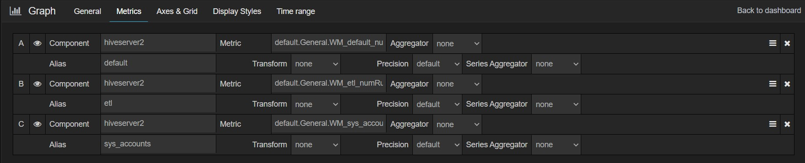

Workload Management (WLM) is available to the customers starting HDInsight 4.0 clusters. At present we have observed customers facing various issues in the WLM flow.

To debug any ongoing issue that may be related to WLM following queries and resources can be utilized.

## Hive Commands to view WLM Resource Plan Definition
-----------------------------------------------------
```
-- View all resource plans available in the cluster
SHOW RESOURCE PLANS;
-- View resource plan definition
SHOW RESOURCE PLAN <plan_name>;
```

## WLM Metrics
--------------
Following example shows the metrics that are published by WLM master for a given pool in a resource plan.
```
"name" : "Hadoop:service=hiveserver2,name=WmPoolMetrics.etl",
    "modelerType" : "WmPoolMetrics.etl",
    "tag.Context" : "HS2",
    "tag.SessionId" : "etl",
    "tag.Hostname" : "hn0-c2b-ll.cu1cgjaim53urggr4psrgczloa.cx.internal.cloudapp.net",
    "NumExecutors" : 10,
    "NumRunningQueries" : 2,
    "NumParallelQueries" : 3,
    "NumQueuedQueries" : 0,
    "NumExecutorsMax" : 10
```


These Metrics can be accessed directly via HS2Interactive UI in case of standard clusters under the Metrics Dump Tab. <br>


For ESP clusters as HS2Interactive UI is unavailable (known issue) we can get the same metrics on grafana. <br>
The metrics name follows the below patterns:
```
default.General.WM_<pool>_numExecutors
default.General.WM_<pool>_numExecutorsMax
default.General.WM_<pool>_numRunningQueries
default.General.WM_<pool>_numParallelQueries
default.General.WM_<pool>_numQueuedQueries
```
Replace `<pool>` with respective pool name to get the metrics in grafana. 


Note: Make sure hiveserver2 component is selected in the above filters and component name.

<br>

## Get WLM related entities information from metastore database
------------------------------------------------------
WLM related information can also be viewed from following "SYS" tables in Hive in case you are unable to access Hive Server.
Note: SYS is Hive database which includes tables that virtually views metadata in Hive metastore.

* **SYS.WM_RESOURCEPLANS** (NAME string, STATUS string, QUERY_PARALLELISM int, DEFAULT_POOL_PATH string)
* **SYS.WM_POOLS** (RP_NAME string, PATH string, ALLOC_FRACTION double, QUERY_PARALLELISM int, SCHEDULING_POLICY string)
* **SYS.WM_MAPPINGS** (RP_NAME string, ENTITY_TYPE string, ENTITY_NAME string, POOL_PATH string, ORDERING int)
* **SYS.WM_TRIGGERS** (RP_NAME string, NAME string, TRIGGER_EXPRESSION string, ACTION_EXPRESSION string)
* **SYS.WM_POOLS_TO_TRIGGERS** (RP_NAME string, POOL_PATH string, TRIGGER_NAME string)

<br>

## WLM Feature Characteristics
-----------------------------
### **Lifecycle of Tez AMs in WLM Enabled Clusters**
In contrast to default LLAP clusters, WLM enabled clusters have additional Tez AMs which are scheduled to run in `wm` queue in case *hive.server2.tez.interactive.queue=wm*  <br>
These Tez AMs spawn up when WLM is activated based on the sum of QUERY_PARALLELISM of all the pools defined in the resource plan. <br>
Once we disable the Workload Management in the cluster these Tez AMs are automatically KILLED.
`{ DISABLE WORKLOAD MANAGEMENT; }`

### **Resource contention**
In WLM enabled LLAP cluster, resources are shared among queries based on resource plan configuration. This sometimes leads to query slowness.
Some tunings can be done to resource plan to reduce the resource contention that happen within a pool. For example `scheduling_policy` can be defined as either 'fair', which guarantees an equal share of resources on the cluster to each query that is assigned to the pool; or 'fifo', which guarantees all resources to the first query that comes to the pool.<br>
Following example shows how to set scheduling policy for a pool named etl in the resource plan wlm_basic:
```
ALTER POOL wlm_basic.etl SET SCHEDULING_POLICY = fair;
```
One can also set the scheduling policy while creating the pool:
```
CREATE POOL wlm_basic.default WITH ALLOC_FRACTION = 0.5, QUERY_PARALLELISM = 2, SCHEDULING_POLICY = fifo;
```

### **Query Failures for some specific use cases**
Running queries in WLM can get killed automatically for following cases:
1. If a Move Trigger is applied on a query and te query is moved to a destination pool that doesn't have any Tez AMs available (fully utilized pool in resource plan), the query is killed. <br>
This is a design limitation of WLM feature. You can workaround this feature by increasing the `QUERY_PARALLELISM` property for the destination pool so that even in case of max load scenario, the queries submitted to the cluster can be supported by this pool. Also, tune the `wm` queue size to accommodate this change. <br>
2. If WLM is disabled, all the inflight queries will fail with following exception pattern:
```
FAILED: Execution Error, return code 1 from org.apache.hadoop.hive.ql.exec.tez.TezTask. Dag received [DAG_TERMINATE, DAG_KILL] in RUNNING state.
```
3. If a WLM Tez AM gets killed some of the query may fail with following pattern. On resubmission these queries should run fine.
```
java.util.concurrent.CancellationException: Task was cancelled.
	at com.google.common.util.concurrent.AbstractFuture.cancellationExceptionWithCause(AbstractFuture.java:1349) ~[guava-28.0-jre.jar:?]
	at com.google.common.util.concurrent.AbstractFuture.getDoneValue(AbstractFuture.java:550) ~[guava-28.0-jre.jar:?]
	at com.google.common.util.concurrent.AbstractFuture.get(AbstractFuture.java:513) ~[guava-28.0-jre.jar:?]
	at com.google.common.util.concurrent.AbstractFuture$TrustedFuture.get(AbstractFuture.java:90) ~[guava-28.0-jre.jar:?]
	at com.google.common.util.concurrent.Uninterruptibles.getUninterruptibly(Uninterruptibles.java:237) ~[guava-28.0-jre.jar:?]
	at com.google.common.util.concurrent.Futures.getDone(Futures.java:1064) ~[guava-28.0-jre.jar:?]
	at com.google.common.util.concurrent.Futures$CallbackListener.run(Futures.java:1013) ~[guava-28.0-jre.jar:?]
	at com.google.common.util.concurrent.DirectExecutor.execute(DirectExecutor.java:30) ~[guava-28.0-jre.jar:?]
	at com.google.common.util.concurrent.AbstractFuture.executeListener(AbstractFuture.java:1137) ~[guava-28.0-jre.jar:?]
	at com.google.common.util.concurrent.AbstractFuture.complete(AbstractFuture.java:957) ~[guava-28.0-jre.jar:?]
	at com.google.common.util.concurrent.AbstractFuture.cancel(AbstractFuture.java:611) ~[guava-28.0-jre.jar:?]
	at com.google.common.util.concurrent.AbstractFuture$TrustedFuture.cancel(AbstractFuture.java:118) ~[guava-28.0-jre.jar:?]
	at org.apache.hadoop.hive.ql.exec.tez.WmTezSession$TimeoutRunnable.run(WmTezSession.java:264) ~[hive-exec-3.1.3.4.1.3.6.jar:3.1.3.4.1.3.6]
	at java.util.concurrent.Executors$RunnableAdapter.call(Executors.java:511) [?:1.8.0_275]
	at java.util.concurrent.FutureTask.run(FutureTask.java:266) [?:1.8.0_275]
	at java.util.concurrent.ScheduledThreadPoolExecutor$ScheduledFutureTask.access$201(ScheduledThreadPoolExecutor.java:180) ~[?:1.8.0_275]
	at java.util.concurrent.ScheduledThreadPoolExecutor$ScheduledFutureTask.run(ScheduledThreadPoolExecutor.java:293) ~[?:1.8.0_275]
	at java.util.concurrent.ThreadPoolExecutor.runWorker(ThreadPoolExecutor.java:1149) [?:1.8.0_275]
	at java.util.concurrent.ThreadPoolExecutor$Worker.run(ThreadPoolExecutor.java:624) [?:1.8.0_275]
	at java.lang.Thread.run(Thread.java:748) [?:1.8.0_275]
```

## Known Issues
---------------
1. Spark jobs submitted via [Hive Warehouse Connector (HWC)](https://docs.microsoft.com/en-us/azure/hdinsight/interactive-query/apache-hive-warehouse-connector) can experience intermittent failures if target LLAP cluster have WLM enabled. <br>
**Mitigation:** <br>
To avoid the above issues, Customer can have two LLAP Clusters, one with WLM enabled and other without WLM.
The customer then can use HWC to connect their Spark cluster to the LLAP cluster without WLM.

2. The `DISABLE WORKLOAD MANAGEMENT;` command hangs for a long time sometimes. <br>
**Mitigation**: <br>
Cancel the command and check the resource plans status with
`SHOW RESOURCE PLANS;`
If there is still an active resource plan available try running `DISABLE WORKLOAD MANAGEMENT` command again; <br>

3. Zombies Tez AM can spawn up that doesn't go away with `DISABLE WORKLOAD MANAGEMENT` command and hive server restart as well. <br>
**Mitigation**: <br> 
These Tez AMs can only be removed after they are killed via `yarn UI` or `yarn console application`. <br>
Disable workload management and use the below command to kill all application in wm queue. <br>
`for x in $(yarn application -list | grep wm | awk '{ print $1 }'); do yarn application -kill $x; done` <br>