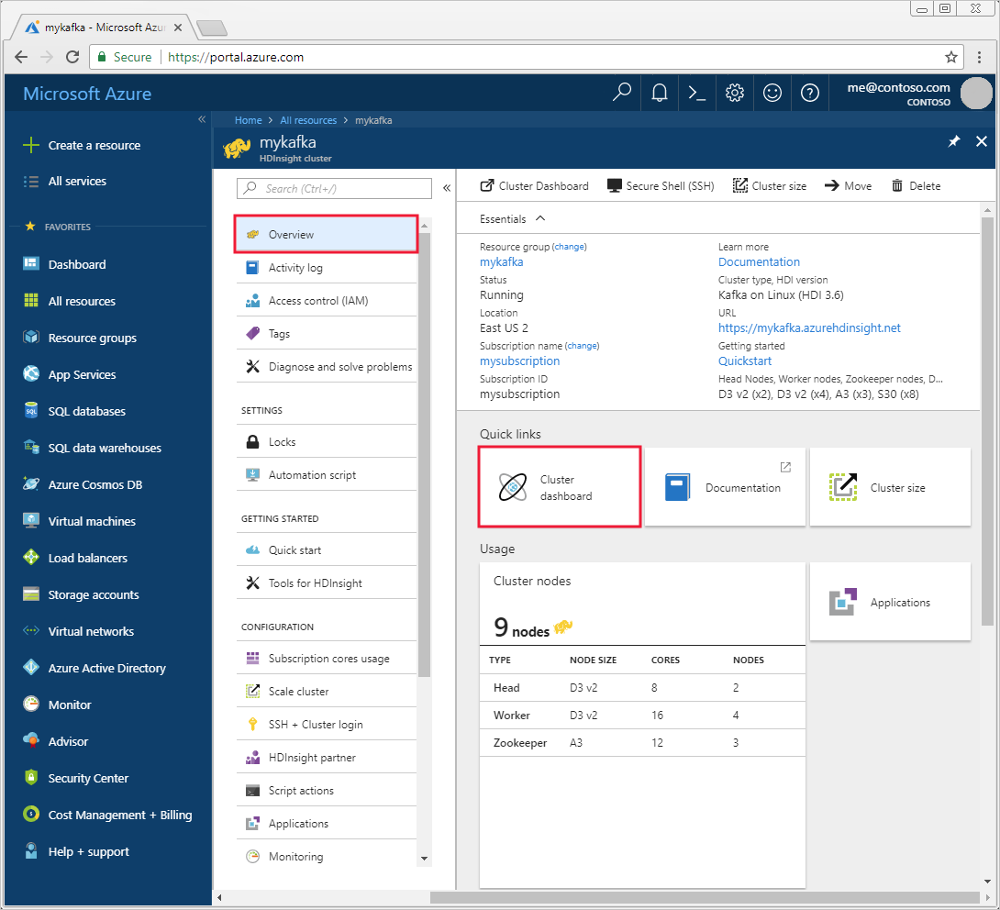
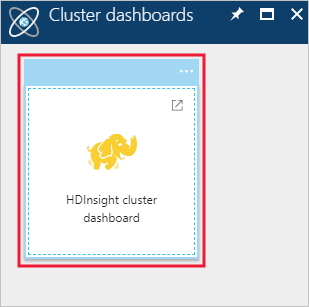
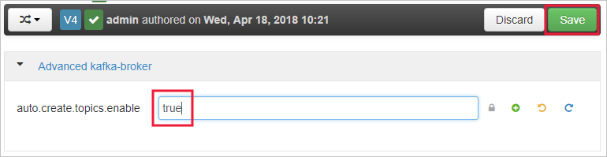
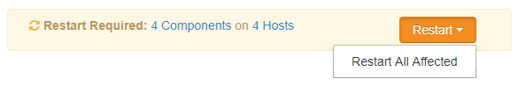

# How to configure Apache Kafka on HDInsight to automatically create topics

By default, Kafka on HDInsight does not enable automatic topic creation. You can enable auto topic creation for existing clusters using Ambari. You can also enable auto topic creation when creating a new Kafka cluster using an Azure Resource Manager template.

## Ambari Web UI

To enable automatic topic creation on an existing cluster through the Ambari Web UI, use the following steps:

1. From the [Azure portal](https://portal.azure.com), select the Kafka cluster.

2. From the __Cluster overview__, select __Cluster dashboard__. 

    

3. Then select __HDInsight cluster dashboard__. When prompted, authenticate using the login (admin) credentials for the cluster.

    

3. Select the Kafka service from the list on the left of the page.

    

4. Select Configs in the middle of the page.

    

5. In the Filter field, enter a value of `auto.create`. 

    

    This filters the list of properties and displays the `auto.create.topics.enable` setting.

6. Change the value of `auto.create.topics.enable` to `true`, and then select Save. Add a note, and then select Save again.

    

7. Select the Kafka service, select __Restart__, and then select __Restart all affected__. When prompted, select __Confirm restart all__.

    

> [!NOTE]
> You can also set Ambari values through the Ambari REST API. This is generally more difficult, as you have to make multiple REST calls to retrieve the current configuration, modify it, etc. For more information, see the [Manage HDInsight clusters using the Ambari REST API](../hdinsight-hadoop-manage-ambari-rest-api.md) document.

## Resource Manager templates

When creating a Kafka cluster using an Azure Resource Manager template, you can directly set `auto.create.topics.enable` by adding it in a `kafka-broker`. The following JSON snippet demonstrates how to set this value to `true`:

```json
"clusterDefinition": {
    "kind": "kafka",
    "configurations": {
    "gateway": {
        "restAuthCredential.isEnabled": true,
        "restAuthCredential.username": "[parameters('clusterLoginUserName')]",
        "restAuthCredential.password": "[parameters('clusterLoginPassword')]"
    },
    "kafka-broker": {
        "auto.create.topics.enable": "true"
    }
}
```

## Next Steps

In this document, you learned how to enable automatic topic creation for Kafka on HDInsight. To learn more about working with Kafka, see the following links:

* [Analyze Kafka logs](apache-kafka-log-analytics-operations-management.md)
* [Replicate data between Kafka clusters](apache-kafka-mirroring.md)
